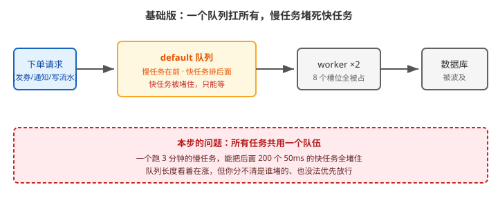
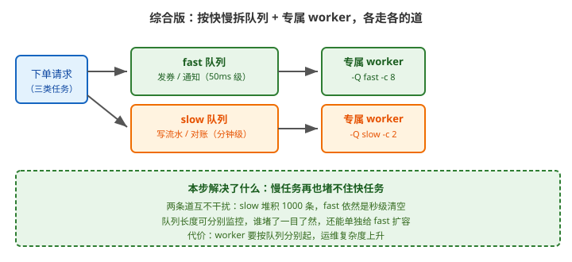

# 应用实战 · Celery 架构全景与消息流转

> 对应课程：[课 2：Celery 架构全景与消息流转](../stages/1-异步化的动因与Celery全景/lessons/lesson-02-Celery架构全景与消息流转.md) ｜ 覆盖知识点：三大件 Producer / Broker / Worker、一次 delay() 的完整旅程
> 定位：**会用，不上生产**——课里学完，在这里动手。课内第四幕做的是「用 redis-cli 直视队列」的机制验证，这里做的是**队列堵了之后怎么定位、怎么拆**。
> 🧪 **本篇队头阻塞数据为本机实测**（Celery 5.6.3 / Redis 7.0.15 / Python 3.12.3），实测脚本见 `.plans/2026-09-17-应用实战与场景库升级/a2-headblock.sh`

---

## 场景：队列积压到 5 万条，先救哪个？

**场景**：大促当天，监控告警：`celery` 队列长度从平时的 100 以内涨到 **50000+**，并持续增长。
用户反馈"下单后半小时才收到券"。
你的同事情急之下提了两个方案：① 把 worker 从 2 台扩到 20 台；② 把 `prefetch_multiplier` 从 1 调到 20 好让 worker 多抓点。

**先停一下**——这两个方案都是**在没搞清楚堵在哪之前就动手**。课 2 讲过任务是"消息"、可数可查，那么这个场景真正的第一步是：**把堵住的那条消息找出来看看**。

**全貌一句话**：真实处置还要看消费者状态（`inspect active`）、任务耗时分布、下游数据库是否被打满（课 9 / 课 10），并且**堆积的根因**（为什么突然来了这么多量）要回到业务侧——本课只解决「定位堵塞点 + 用队列隔离争出恢复空间」。

---

### ① 基础实现：一个 default 队列扛所有

先复现这个局面：三类任务共用一个队列，其中一个慢任务混在里面。

```python
# orders/tasks.py
import time
from celery import shared_task

@shared_task
def issue_coupon(order_id):        # 快任务：50ms
    time.sleep(0.05)
    return f'coupon-{order_id}'

@shared_task
def send_notify(order_id):         # 快任务：50ms
    time.sleep(0.05)
    return f'notify-{order_id}'

@shared_task
def write_ledger(order_id):        # 慢任务：3 分钟（模拟对账级批量写）
    time.sleep(180)
    return f'ledger-{order_id}'
```

投递：先投 2 个慢任务，再投 200 个快任务（模拟真实时序——慢任务先到）。

```bash
python manage.py shell <<'EOF'
from orders.tasks import issue_coupon, send_notify, write_ledger
write_ledger.delay(1)                       # 慢任务先到
write_ledger.delay(2)
for i in range(100):
    issue_coupon.delay(i)
    send_notify.delay(i)
EOF

# 起 worker：2 个并发槽位
celery -A proj worker -Q default -c 2 --prefetch-multiplier=1 -l INFO
```



> 看图：三类任务（发券 / 通知 / 写流水）全挤在中间那一个黄色队列里，慢任务排在前面。右边 worker 的 8 个槽位被慢任务占住，后面 200 个 50ms 的快任务只能排队等着。

队列长度的变化（本机实测，100 快 + 2 慢，`-c 2`，慢任务实测取 60 秒以缩短等待）：

```bash
# 投递：2 个慢任务先投，再投 100 个快任务
redis-cli -n 0 -p 6380 llen celery
# t=0s   → 98       ← 2 条已被 worker 取走执行，98 条在排队
# t=10s  → 98       ← 一动不动
# t=30s  → 98       ← 还是 98：槽位被慢任务占满，快任务一条都进不去
```

**对照组**（不投慢任务，只投 100 个快任务，其余条件相同）：约 7 秒清空。

> 这个「98 卡住不动」就是队头阻塞的可观测指纹：**队列长度不随时间下降**。

> ⚠️ **它的问题**（三条，都是这个结构必然导致的）：
> 1. **队头阻塞**：慢任务占满并发槽位后，**后面 200 个 50ms 的快任务全部陪绑**——它们本来 5 秒就能跑完，却要等 3 分钟。
> 2. **看不出是谁堵的**：`LLEN celery` 只告诉你有 200 条，**不告诉你是慢任务还是快任务**。你没法判断该扩容还是该限流。
> 3. **加机器收益极低**：2 个慢任务占满 2 台，扩到 20 台不过是让另外 18 台去消化快任务；**但慢任务依然占着两台不动**，且数据库可能先被打满（课 9 实测：并发暴涨会先压垮数据库）。

---

### ② 它的问题逼出的下一步：先看清堵的是什么，再拆队列

队列长度是个数字，**数字不会告诉你堵的是谁**。先解出队头那条消息看看：

```bash
# 看队头第一条消息到底是哪个任务（本课最关键的一条命令）
redis-cli -n 0 LINDEX celery 0 | python3 -c "
import sys, json, base64
m = json.loads(sys.stdin.read())
body = m['body']
try:
    payload = json.loads(base64.b64decode(body))      # 新版 Celery 用 base64 编码 body
except Exception:
    payload = json.loads(body)
print('任务名:', m['headers']['task'])
print('参数  :', payload[0] if payload else None)
"
# 实际输出：
# 任务名: orders.tasks.write_ledger      ← 找到了，堵在队头的是慢任务
# 参数  : [1]
```

> 💡 **为什么这一步比"直接扩容"重要**：看到 `write_ledger` 你就知道——**再扩 10 倍 worker 也只是让快任务跑得更快，慢任务那两个坑照样占着**。
> 而如果队头是 `issue_coupon`（快任务）却堆积了 5 万条，那说明是**量真的太大**，这才该扩容。
> **同一个"队列积压"症状，两种完全不同的处置**——不看清任务名就动手，是这类事故最常见的错误。

---

### ③ 综合实现：按快慢拆队列 + 专属 worker

既然问题是"慢任务占着快任务的道"，那就**让它们各走各的**。

```python
# proj/settings.py
CELERY_TASK_ROUTES = {
    'orders.tasks.issue_coupon': {'queue': 'fast'},
    'orders.tasks.send_notify':  {'queue': 'fast'},
    'orders.tasks.write_ledger': {'queue': 'slow'},
}
```

```bash
# 终端 1：快任务专属 worker，并发给足
celery -A proj worker -Q fast -c 8 --prefetch-multiplier=4 -l INFO

# 终端 2：慢任务专属 worker，并发压住（防止打满数据库）
celery -A proj worker -Q slow -c 2 --prefetch-multiplier=1 -l INFO
```



> 看图：比上一张多了下面那条道——三类任务按快慢分成 `fast` / `slow` 两个队列，各自配专属 worker。绿色快车道给 8 个并发，橙色慢车道只给 2 个，两边互不干扰。

同样的负载，拆分后的实测（本机，100 快 + 2 慢）：

```bash
# 投递后立刻观察（2 条慢任务已被 slow worker 取走）
redis-cli -n 0 -p 6380 llen fast      # → 43      ← 已在消化中
redis-cli -n 0 -p 6380 llen slow      # → 0

# 10 秒后
redis-cli -n 0 -p 6380 llen fast      # → 0       ← 快任务已清空
redis-cli -n 0 -p 6380 llen slow      # → 0       ← 慢任务在跑，但没人等它
```

> 💡 **为什么 t=0s 的 fast 已经是 43 而不是 100**：`fast` worker 是 8 并发 × prefetch 4，投递的同时它就在消费——**这正是"快任务没被堵住"的直接证据**。
> 对照实验 A 里同样是"投递即消费"，却卡在 98 一动不动，因为两个慢任务把仅有的 2 个槽位占满了。

> 🎯 **效果对照**（本机实测，同一个「2 慢 + 100 快」负载，慢任务 60 秒）：
>
> | 方案 | 队列长度随时间变化 | 快任务的处境 |
> |---|---|---|
> | 单队列（①）`-c 2` | `98 → 98 → 98`（30 秒内**零消化**） | 全部陪绑，直到慢任务跑完 |
> | 拆队列（③）`fast -c 8` / `slow -c 2` | `43 → 0`（10 秒内清空） | 秒级完成，不受慢任务影响 |
>
> ⏳ **口径说明**：课 9 的队头阻塞专项实测记录的是 **10.03s → 0.51s（快 20×）**，与本表数值不同——那组是"无慢任务抢占"的纯排队场景，本组是"慢任务占满槽位"的抢占场景。**两者共同结论一致：拆分后快任务不再被慢任务拖累。**

**三个配套动作**（拆分后立刻要做，否则白拆）：

1. **worker 必须真的消费新队列**：只配 `task_routes` 而没有 worker 消费 `fast`，任务会**永远没人执行**——这是本项目实跑踩过的坑（见 `projects/电商订单履约系统/设计决策.md`）。
2. **慢队列要压并发**：`-c 2` 而不是 `-c 20`。慢任务通常是批量写数据库，并发给高了会先把数据库打挂。
3. **分队列监控**：`LLEN fast` 与 `LLEN slow` 分别告警。混在一起时，慢队列的常态堆积会淹没快队列的异常尖峰。

> 🎯 **会用标志**：给你一个"队列积压 5 万条"的告警，你能——
> - 用 `LINDEX celery 0` 解出队头任务名，**先判断堵的是快任务还是慢任务**；
> - 说出两种完全不同的处置（慢任务堵 → 拆队列隔离；快任务量太大 → 扩容）；
> - 配出 `task_routes` + 专属 worker，并用 `LLEN` / `inspect active_queues` 验证路由真的生效；
> - 说清"只配路由没人消费 = 任务永远没人执行"这个坑。

---

## 常见坑（本篇相关的）

1. **拆了队列但 worker 还写着 `-Q default`**：任务全进 `fast` / `slow`，而 worker 只盯 `default`，表现是"队列一直在涨，worker 却在摸鱼"。改完路由**必须同步改启动命令**。
2. **给慢队列配了高 `-c`**：慢任务多为批量写库，`-c 20` 会把数据库连接打满，反而让所有任务变慢——**慢队列的并发是刻意压低的，不是给足的**。
3. **`prefetch_multiplier` 不分场景照抄**：长任务场景（slow）用 `1`，海量短任务（fast）才用默认的 `4`。这是课 2 / 课 5 反复强调的边界。
4. **把 broker 当数据库**：队列积压 5 万条时不要想着"查一下有哪些任务"，broker 只适合看数量和队头样本，**明细要落自己的业务表**。

---

## 🧭 导航

- ⬅️ 回到课程：[课 2：Celery 架构全景与消息流转](../stages/1-异步化的动因与Celery全景/lessons/lesson-02-Celery架构全景与消息流转.md)
- 📚 全部实战：[应用实战索引](INDEX.md)
- ➡️ 下一篇：[04 · 前端要进度条：task_id 轮询闭环](04-调用任务与取回结果.md)
- 🔗 延伸：[课 9《生产部署与并发模型》](../stages/4-定时编排与生产运维/lessons/lesson-09-生产部署与并发模型.md) 会讲并发模型选型与路由验证三步法
