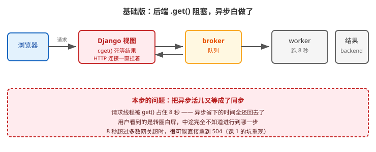
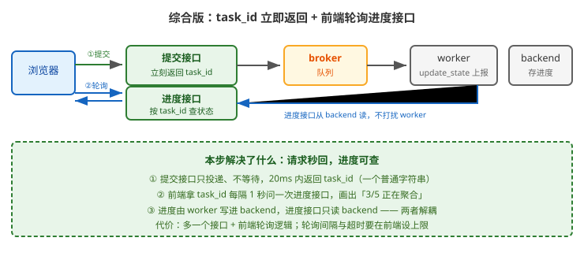

# 应用实战 · 调用任务与取回结果

> 对应课程：[课 4：调用任务与取回结果](../stages/2-Django集成与任务基础/lessons/lesson-04-调用任务与取回结果.md) ｜ 覆盖知识点：delay 与 apply_async、AsyncResult 与结果查询、任务怎么测
> 定位：**会用，不上生产**——课里学完，在这里动手。课内第四幕做的是「`get()` 阻塞 8 秒」的机制验证，这里做的是**前端进度条这条完整链路怎么搭**。
> 🧪 **本篇关键数据为本机实测**（Celery 5.6.3 / Redis 7.0.15 / Python 3.12.3），实测脚本见 `.plans/2026-09-17-应用实战与场景库升级/a4-progress.sh`

---

## 场景：产品要一个"生成中 3/5 · 正在聚合数据"的进度条

**场景**：运营要导出一份月报，任务耗时约 8 秒。产品给的原型上有个进度条，要求显示「生成中 3/5 · 正在聚合数据」。
你的第一版实现跑通了，但**用户点完按钮页面白屏转圈 8 秒**，进度条一个字都不动。更糟的是，8 秒超过了网关超时，部分用户直接拿到 **504**。

这就是课 4 第四幕 ④ 那个 `get() 阻塞了 8.021s` 的现实版——**异步白做了**。

**全貌一句话**：生产版还要处理轮询的退避与超时上限、任务失败时前端怎么展示、以及结果清理（`result_expires`，课 10）——本课只解决「让进度条真的动起来」这条主链路。

---

### ① 基础实现：`delay()` 之后直接 `get()`

最直觉的写法——投递、等结果、返回：

```python
# views.py
from rest_framework.decorators import api_view
from rest_framework.response import Response
from .tasks import generate_report

@api_view(['POST'])
def report_create(request):
    r = generate_report.delay(request.data['month'])
    result = r.get(timeout=30)      # ⚠️ 就是这一行
    return Response({'url': result['url']})
```



> 看图：请求从左边进来，卡在红色「Django 视图」里（`r.get()` 死等），这条 HTTP 连接一直挂着，直到最右边 worker 跑完、结果回到 backend 才释放。

本机实测（课 4 第四幕同口径，8 秒任务）：

```
投递耗时 0.005s
get() 阻塞了 8.021s          ← 异步省下的时间全还回去了
```

> ⚠️ **它的问题**（三条）：
> 1. **异步退化成同步**：请求线程被 `get()` 占住 8 秒，课 1 讲的"慢活儿占坑"问题原样重现——**用 Celery 省下的响应时间，被 `get()` 又吃回去了**。
> 2. **用户全程无反馈**：8 秒里 HTTP 连接挂着，前端拿不到任何中间状态，只能白屏转圈，进度条永远是 0。
> 3. **可能直接 504**：8 秒已超过多数 Nginx / 网关的默认超时（通常 60s 才安全，但慢任务或网络抖动时会更久）——用户看到的是网关错误页，不是你的报表。

---

### ② 改进实现：先拿 task_id 返回，前端轮询状态

既然不能等，那就**先回一个 task_id，让前端自己来问**。

```python
# views.py
@api_view(['POST'])
def report_create(request):
    r = generate_report.delay(request.data['month'])
    return Response({'task_id': r.id}, status=202)   # 202 Accepted：已接受，处理中

@api_view(['GET'])
def report_status(request, task_id):
    from celery.result import AsyncResult
    r = AsyncResult(task_id)
    return Response({'state': r.state})
```

```javascript
// 前端：拿到 task_id 后每秒问一次
const { task_id } = await (await fetch('/api/report/', {method:'POST', ...})).json();
const timer = setInterval(async () => {
  const s = await (await fetch(`/api/report/${task_id}/`)).json();
  if (s.state === 'SUCCESS') { clearInterval(timer); loadReport(); }
}, 1000);
```

**这一步解决了阻塞问题，但进度条还是不会动**——因为状态只有 `PENDING → SUCCESS` 两跳，中间的"正在聚合数据"根本不存在。实测（本机）：

```bash
# 只开 track_started，不上报进度
PENDING → PENDING → STARTED → STARTED → ... → SUCCESS
```

> ⚠️ **它的问题**：
> 1. **进度条依然没数据**：`STARTED` 只表示"开始跑了"，没有"第几步"。产品要的「3/5」拿不到。
> 2. **`STARTED` 默认是关的**：`task_track_started` 默认 `False`，不开的话连 `STARTED` 都没有，状态直接从 `PENDING` 跳到 `SUCCESS`。
> 3. **前端轮询没有退出条件**：任务失败时 `state` 变 `FAILURE`，如果前端只判 `SUCCESS` 就一直轮询下去。

---

### ③ 综合实现：worker 上报进度 + 前端渲染

让 worker 在执行过程中**主动上报进度**，前端按进度渲染。

```python
# tasks.py
from celery import shared_task

STEPS = ['拉数据', '聚合', '渲染', '上传', '通知']

@shared_task(bind=True)
def generate_report(self, month):
    total = len(STEPS)
    for i, step in enumerate(STEPS, start=1):
        # ⭐ 关键：把进度写进 backend，前端才读得到
        self.update_state(
            state='PROGRESS',
            meta={'current': i, 'total': total, 'step': step},
        )
        do_step(step, month)          # 真正干活
    return {'url': f'/media/report-{month}.pdf'}
```

```python
# views.py
@api_view(['GET'])
def report_status(request, task_id):
    from celery.result import AsyncResult
    r = AsyncResult(task_id)
    if r.state == 'PROGRESS':
        return Response({'state': 'PROGRESS', **r.info})   # 3 / 5 / 步骤名
    if r.state == 'SUCCESS':
        return Response({'state': 'SUCCESS', 'url': r.result['url']})
    if r.state == 'FAILURE':
        return Response({'state': 'FAILURE', 'error': str(r.info)}, status=500)
    return Response({'state': r.state})          # PENDING / STARTED
```

```javascript
// 前端：三种终态都要退出轮询
const timer = setInterval(async () => {
  const s = await (await fetch(`/api/report/${task_id}/`)).json();
  if (s.state === 'PROGRESS') {
    setBar(s.current / s.total, `${s.step}`);        // 「3/5 · 正在聚合」
  } else if (s.state === 'SUCCESS') {
    clearInterval(timer); loadReport(s.url);
  } else if (s.state === 'FAILURE') {
    clearInterval(timer); showError(s.error);         // ⭐ 失败也要停
  }
}, 1000);
```



> 看图：比上一张多了下面那条蓝色回路——提交接口只管投递、立刻回 `task_id`；进度接口单独存在，**从 backend 读进度，不打扰 worker**。worker 每完成一步就把进度写进 backend，形成闭环。

**必须配的两个开关**（缺一个进度条就不动）：

```python
# settings.py
CELERY_RESULT_BACKEND = 'redis://127.0.0.1:6380/1'   # 没有 backend = 没有进度可存
CELERY_TASK_TRACK_STARTED = True                      # 打开才看得到 STARTED
CELERY_RESULT_EXPIRES = 3600                          # 结果别永久堆积（课 10）
```

本机实测（5 步任务，每步 1 秒，轮询间隔 0.5 秒）：

```
PENDING
PROGRESS {'current': 1, 'total': 5, 'step': '拉数据'}
PROGRESS {'current': 2, 'total': 5, 'step': '聚合'}
PROGRESS {'current': 3, 'total': 5, 'step': '渲染'}
PROGRESS {'current': 4, 'total': 5, 'step': '上传'}
PROGRESS {'current': 5, 'total': 5, 'step': '通知'}
SUCCESS {'url': '/media/report-2026-08.pdf'}
```

> 🎯 **会用标志**：给你一个"要显示进度条"的需求，你能——
> - 说出为什么 `get()` 会让异步白做（请求线程被占住，退回到同步）；
> - 用 `self.update_state(state='PROGRESS', meta={...})` 让 worker 上报进度；
> - 配齐 backend 与 `track_started` 两个开关，并说清缺了各自的表现；
> - 写出前端轮询的**三种终态退出**（SUCCESS / FAILURE / 超时），不留死循环。

---

## 常见坑（本篇实测与课文共同踩到的）

1. **没配 backend 却期待有进度**：`PENDING` 会一直不变（课 2 误区 5）。判断标准——**看到状态永远是 PENDING，先查 backend 配没配**。
2. **`update_state` 忘了 `bind=True`**：`@shared_task` 不带 `bind=True` 就没有 `self`，报 `TypeError: missing 1 required positional argument`。
3. **前端只判 `SUCCESS` 就退出**：任务抛异常时 `state` 是 `FAILURE`，轮询会永远跑下去——**失败分支必须写**。
4. **`SoftTimeLimitExceeded` 从 `celery` 顶层导入**：会 `ImportError` 导致 worker 启动崩溃（课 10 实测）。正确写法是 `from celery.exceptions import SoftTimeLimitExceeded`。
5. **结果永久堆积**：不设 `result_expires`，每条结果约 328 字节、默认 TTL 约 24 小时，300 个任务就是 300 条 key（课 10 实测）。轮询型接口务必设一个合理的过期时间。

---

## 🧭 导航

- ⬅️ 回到课程：[课 4：调用任务与取回结果](../stages/2-Django集成与任务基础/lessons/lesson-04-调用任务与取回结果.md)
- 📚 全部实战：[应用实战索引](INDEX.md)
- ⬅️ 上一篇：[02 · 消息积压：先救哪个队列](02-Celery架构全景与消息流转.md)
- ➡️ 下一篇：[05 · 任务总失败：DLQ 兜底](05-确认机制与重试策略.md)
