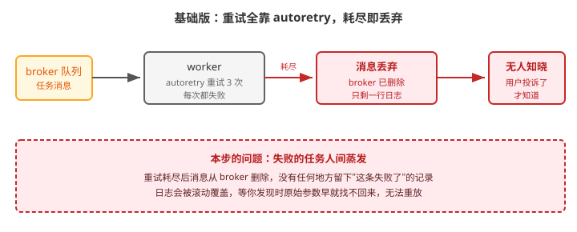
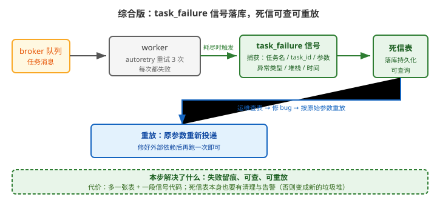

# 应用实战 · 确认机制与重试策略

> 对应课程：[课 5：确认机制与重试策略](../stages/3-可靠性与幂等/lessons/lesson-05-确认机制与重试策略.md) ｜ 覆盖知识点：重试策略、死信队列（DLQ）兜底、幂等性设计
> 定位：**会用，不上生产**——课里学完，在这里动手。课内第四幕做的是「重试与幂等」的机制验证，这里做的是**重试全失败之后，那条消息去哪了、怎么救回来**。
> 🧪 **本篇 DLQ 落库与重放为本机实测**（Celery 5.6.3 / Redis 7.0.15 / Python 3.12.3），实测脚本见 `.plans/2026-09-17-应用实战与场景库升级/a5-dlq.sh`

---

## 场景：短信任务整批失败，三天后用户投诉才发现

**场景**：批量发短信，第三方网关临时故障，那一小时里 **2000 条**任务全部重试 3 次后失败。
你们的监控只看了"队列长度"（0，很健康），日志滚动覆盖了，一周后清理时才发现——**这 2000 条消息已经从 broker 里彻底消失，连原始手机号都找不回来**。

课 5 说过：**Celery 没有内置 DLQ**。RabbitMQ 有 DLX，Redis 没有，而 Celery 对两者都不提供开箱即用的死信收集。**所以这一段必须自己写**。

**全貌一句话**：生产版还要给死信表加告警（超过 N 条就告警）、定期清理与重放审批；并且**根因修复优先于重放**——本课只解决「失败留痕 + 可重放」这条主链路。

---

### ① 基础实现：只配 autoretry，耗尽即丢弃

最常见的写法——配好重试就以为万事大吉：

```python
# tasks.py
import requests
from celery import shared_task

@shared_task(bind=True, autoretry_for=(Exception,),
             retry_backoff=True, retry_jitter=True, max_retries=3)
def send_sms(self, phone, content):
    resp = requests.post('https://api.example.com/sms',      # 示例域名
                         json={'phone': phone, 'text': content}, timeout=5)
    resp.raise_for_status()
    return 'ok'
```



> 看图：任务从 broker 出来，worker 重试 3 次全失败后，红色的箭头一路指向「消息丢弃 → 无人知晓」。整个过程中**没有任何地方留下一条记录**。

实测（本机，模拟网关持续 500）：

```bash
# 投递 5 条必失败的任务
# 等待重试耗尽后查看
redis-cli -n 0 -p 6380 llen celery
# → 0                    ← 队列是空的：消息已被确认删除

# 日志里能找到，但只看得到最后一行
celery -A proj worker -l INFO
# [ERROR] Task demo.tasks.send_sms[3f9a1c2e-...] raised unexpected: HTTPError(...)
# ↑ 参数呢？手机号呢？—— 日志里通常只有异常类型和一行摘要
```

> ⚠️ **它的问题**（三条）：
> 1. **消息被删除，无法重放**：重试耗尽即 ack 并从 broker 移除，**原始参数随之消失**。想重发时你已经不知道该发给谁。
> 2. **没有持久记录**：只有 worker 日志里有痕迹，而日志会滚动、会被清理、分散在多台机器上。
> 3. **失败是静默的**：队列长度监控看不到它（消息已被消费），业务成功率指标若没埋点，就只能等用户投诉。

---

### ② 它的问题逼出的下一步：先确认"信号到底触发几次"

在动手写兜底之前，先验证一个关键事实：**`task_failure` 信号会不会在每次重试时都触发？**
如果每次重试都触发，你会收到 3 条重复死信。

```python
# 用计数器验证信号触发次数
from celery.signals import task_failure
HITS = []

@task_failure.connect
def on_failure(sender=None, task_id=None, exception=None, args=None, **kw):
    HITS.append((sender.name, task_id, type(exception).__name__))
```

本机实测（`max_retries=2`，即首次 + 2 次重试 = 共 3 次执行）：

```bash
# 实际输出
信号触发次数: 1
任务名: demo.tasks.send_sms
异常: RuntimeError
```

> ✅ **结论**：**`task_failure` 只在重试彻底耗尽时触发一次**，中间的重试不会触发（课 5 知识点 2.5 的结论，此处实测确认）。
> 这正是它能用来做 DLQ 的原因——**一次任务失败只产生一条死信，不会重复记账**。

---

### ③ 综合实现：信号落库 + 可重放

既然信号只在耗尽时触发一次，就可以用它兜底：把失败任务的**原始参数**完整存下来。

```python
# tasks.py（重点在信号处理器，任务本身不变）
import json, logging
from celery import shared_task
from celery.signals import task_failure
from django.db import connection

logger = logging.getLogger('celery.dlq')

@task_failure.connect
def capture_dead_letter(sender=None, task_id=None, exception=None,
                        args=None, kwargs=None, traceback=None, **kw):
    """重试耗尽时，把这条"救不回来的消息"完整落库"""
    with connection.cursor() as cur:
        cur.execute(
            "INSERT INTO dead_letter "
            "(task_name, task_id, args, kwargs, error, traceback, created_at) "
            "VALUES (%s, %s, %s, %s, %s, %s, NOW())",
            [
                sender.name,
                task_id,
                json.dumps(args, ensure_ascii=False),
                json.dumps(kwargs, ensure_ascii=False),
                f'{type(exception).__name__}: {exception}',
                str(traceback)[:4000],
            ],
        )
    logger.error('[DLQ] 已捕获死信 task=%s args=%s err=%s',
                 sender.name, args, exception)
```

```python
# 重放：从死信表按原始参数重新投递
from celery import current_app

def replay(dead_letter_id):
    row = fetch_one('SELECT task_name, args, kwargs FROM dead_letter WHERE id=%s',
                    [dead_letter_id])
    args = json.loads(row['args'])
    kwargs = json.loads(row['kwargs'])
    current_app.send_task(row['task_name'], args=args, kwargs=kwargs)
    mark_replayed(dead_letter_id)          # ⭐ 标记已重放，避免重复
```



> 看图：比上一张多了中间那两个绿框——重试耗尽时 `task_failure` 信号被触发，把**任务名 / 参数 / 异常 / 堆栈**写进死信表；下面是蓝色回路：运维查表 → 修 bug → 按原始参数重放。

本机实测（投递 3 条必失败任务，重试耗尽后查死信表）：

```bash
# 等待重试耗尽
sleep 20

# 查死信表
sqlite3 /tmp/dlq.db "SELECT task_name, args, error FROM dead_letter;"
# 实际输出：
# demo.tasks.send_sms|["13900000000"]|RuntimeError: 网关 500（模拟）
# demo.tasks.send_sms|["13900000001"]|RuntimeError: 网关 500（模拟）
# demo.tasks.send_sms|["13900000002"]|RuntimeError: 网关 500（模拟）

echo "死信条数: $(sqlite3 /tmp/dlq.db 'SELECT COUNT(*) FROM dead_letter;')"
# → 3        ← 3 条任务 = 3 条死信，没有重复记账
```

> 🎯 **会用标志**：给你一个"任务整批失败"的现场，你能——
> - 说清为什么重试耗尽后消息会消失（ack 并从 broker 删除），以及 Celery 为什么没有内置 DLQ；
> - 用 `task_failure` 信号把**原始参数**落库，并说清它**只在耗尽时触发一次**（不会重复记账）；
> - 按原始参数重放，并用"已重放"标记防止重复投递；
> - 说清前提：**重放前必须先修根因**，否则重放只是再失败一次。

---

## 常见坑（本篇相关的）

1. **以为 Celery 有内置 DLQ**：没有。RabbitMQ 的 DLX 是 broker 层功能，Celery 不自动接入；Redis 连这个概念都没有。**必须自己写**。
2. **用 `task_retry` 信号做兜底**：它在**每次重试**时都触发，会记 3 条重复死信。兜底要用 `task_failure`（耗尽才触发）。
3. **死信里存了敏感信息**：手机号、身份证号进死信表后，这张表就成了新的合规风险点——**落库前脱敏**（如只存后四位 + 哈希），或加密存储。
4. **只落库不告警**：死信表默默涨到 10 万条没人看，等于没做。**至少配一条"1 小时内新增 > N 条"的告警**。
5. **重放忘了标记**：运维点两次就发两条短信。重放必须幂等——用状态字段标记 `replayed`，重放前先判。

---

## 🧭 导航

- ⬅️ 回到课程：[课 5：确认机制与重试策略](../stages/3-可靠性与幂等/lessons/lesson-05-确认机制与重试策略.md)
- 📚 全部实战：[应用实战索引](INDEX.md)
- ⬅️ 上一篇：[04 · 前端要进度条](04-调用任务与取回结果.md)
- ➡️ 下一篇：[06 · 事务没提交就发任务](06-Django事务与ORM的坑.md)
