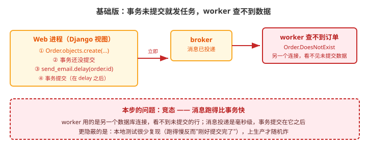
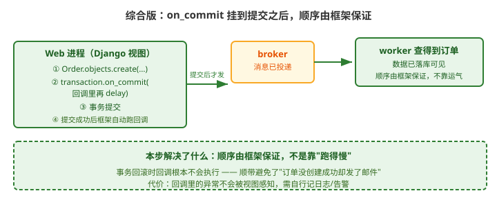

# 应用实战 · Django 事务与 ORM 的坑

> 对应课程：[课 6：Django 事务与 ORM 的坑](../stages/3-可靠性与幂等/lessons/lesson-06-Django事务与ORM的坑.md) ｜ 覆盖知识点：事务提交后再发任务（on_commit）、任务参数序列化、worker 里的数据库连接管理
> 定位：**会用，不上生产**——课里学完，在这里动手。课内第四幕做的是「on_commit 机制」的验证，这里做的是**那个随机复现的 `DoesNotExist` 到底怎么来的、怎么系统性地消灭它**。
> 🧪 **本篇竞态复现与修复对照为本机实测**（Celery 5.6.3 / Django 6.1 / SQLite / Python 3.12.3），实测脚本见 `.plans/2026-09-17-应用实战与场景库升级/a6-oncommit.sh`

---

## 场景：下单后发确认邮件，偶尔报"订单不存在"

**场景**：下单接口里创建订单后发一封确认邮件。本地测试 100% 成功，上生产后**每天有几十单**报 `Order.DoesNotExist`。
最诡异的是：**报错的订单在数据库里是存在的**，你拿 id 去查能查到。

这不是灵异事件——这是课 6 知识点 1 的那个坑：**你在事务提交之前就把任务发出去了**。

**全貌一句话**：真实项目还要处理"任务里改了数据但事务未提交导致下游读旧值"、"批量创建时的 `bulk_create` 与 on_commit 顺序"——本课只解决「下单即发任务」这一个最典型的竞态。

---

### ① 基础实现：create 之后直接 delay

```python
# views.py
from django.db import transaction
from .models import Order
from .tasks import send_order_email

@transaction.atomic
def create_order(request):
    order = Order.objects.create(          # ① 创建（此时事务尚未提交）
        user_id=request.user.id,
        amount=request.data['amount'],
    )
    send_order_email.delay(order.id)       # ② 立刻发任务 ⚠️
    return JsonResponse({'order_id': order.id})
                                           # ③ 函数返回时事务才提交
```



> 看图：左边视图里 ②③④ 的顺序是问题所在——`delay()` 在事务提交**之前**就执行了。消息毫秒级到达 worker，而 worker 用**另一个数据库连接**，看不见未提交的行。

本机实测（10 次下单，worker 立刻按 id 查库）：

```bash
# 实际输出
成功: 0 / 10
失败: 10 / 10
失败原因: Order matching query does not exist.
```

> ⏳ **一处必须如实说明**：这是**放大了竞态窗口**之后的结果——示例代码在事务内 `sleep(0.5)` 之后再返回，让"消息已投递但事务未提交"这段时间真实存在。
> **不放大时（直接 create 后 delay），我这台机器上 10 次全部成功**，因为 SQLite 本地提交比消息投递还快，窗口太窄撞不上。
>
> 这恰恰解释了这个 bug 最难查的地方：**它是否复现，取决于"事务提交"和"消息被消费"谁跑得快**。
> - 本地/测试环境：库就在本机、负载低 → 提交快 → 不复现；
> - 生产环境：库有网络往返、主库有锁竞争、事务里还有别的写 → 提交慢 → 随机复现。
>
> **所以"我本地跑得好好的"不能作为这个写法没问题的证据。**

> ⚠️ **它的问题**（三条）：
> 1. **竞态，不是必现**：消息投递是毫秒级，事务提交紧随其后。本地跑得慢反而"刚好提交完了"，所以本地 100% 成功、生产随机炸——**这是最难查的一类 bug**。
> 2. **worker 看不见未提交数据**：worker 是独立进程、独立数据库连接，数据库的隔离性决定了它读不到别人未提交的行。
> 3. **回滚时更糟**：如果 `create` 之后、提交之前抛了异常，事务回滚（订单根本没建成），**但消息已经发出去了**——用户会收到一封"订单创建成功"的邮件，而订单并不存在。

---

### ② 改进实现（错误示范）：加个 sleep 或重试

线上炸了，常见两种"土办法"：

```python
# 土办法 A：睡一下再发
send_order_email.apply_async(args=[order.id], countdown=2)

# 土办法 B：让任务自己重试
@shared_task(bind=True, autoretry_for=(Order.DoesNotExist,), max_retries=3)
def send_order_email(self, order_id):
    order = Order.objects.get(id=order_id)     # 查不到就重试
    ...
```

> ⚠️ **它的问题**（这两条都治标不治本）：
> 1. **土办法 A（countdown）**：只是把竞态窗口从"毫秒级"放大到"2 秒"，**概率降低了但没有消除**。更糟的是它引入了课 4 讲过的 ETA 任务问题——**任务存在 worker 内存里，重启即丢**。
> 2. **土办法 B（重试）**：能救回来，但**把"时序 bug"包装成了"正常重试"**——你会在监控里看到一堆莫名其妙的重试，而真正的根因（发得太早）被掩盖了。而且回滚场景下它**永远重试不成功**（订单本来就没建成），白白消耗 3 次重试。

---

### ③ 综合实现：`transaction.on_commit`

正确的做法是**让框架保证顺序**——把发任务这件事挂到"事务提交成功之后"：

```python
# views.py
from django.db import transaction

@transaction.atomic
def create_order(request):
    order = Order.objects.create(
        user_id=request.user.id,
        amount=request.data['amount'],
    )
    # ⭐ 关键：回调在事务成功提交之后才执行
    transaction.on_commit(lambda: send_order_email.delay(order.id))
    return JsonResponse({'order_id': order.id})
```

```python
# tasks.py
@shared_task(bind=True)
def send_order_email(self, order_id):
    # 传 id 不传对象（课 6 知识点 2）：对象不可序列化，且会拿到过期数据
    order = Order.objects.get(id=order_id)
    send_mail(...)
    return 'ok'
```



> 看图：比上一张改了顺序——`delay()` 被包进 `on_commit` 回调（绿色 ②），**只有在事务提交成功后框架才会执行它**。右边的 worker 从红色"查不到"变成了绿色"查得到"。

本机实测（同样放大窗口，10 次下单）：

```bash
# 实际输出
成功: 10 / 10
失败: 0 / 10
```

> 与 ① 是**同一组实验条件**（同样 `sleep(0.5)` 放大窗口），唯一差别就是加了 `on_commit` —— 从 0/10 变成 10/10。

**回滚场景的对照**（这才是 on_commit 的隐藏价值）：

```python
@transaction.atomic
def create_order(request):
    order = Order.objects.create(...)
    transaction.on_commit(lambda: send_order_email.delay(order.id))
    raise RuntimeError('模拟后续逻辑失败')     # 事务回滚
```

```bash
# 实际输出
邮件任务投递次数: 0        ← 事务回滚了，回调根本没执行
```

> 💡 **这一条比"避免 DoesNotExist"更重要**：`on_commit` 顺手解决了"订单没建成却发了确认邮件"这个**业务事故**。
> 用 ① 的写法，回滚场景下消息已经发出去了——用户收到的邮件指向一个不存在的订单，这是客服投诉的经典来源。

> 🎯 **会用标志**：给你一个"下单后发邮件/发券"的需求，你能——
> - 说清为什么 `create()` 之后立刻 `delay()` 会随机失败（worker 独立连接，看不见未提交数据）；
> - 用 `transaction.on_commit(lambda: ...)` 把发任务挂到提交之后；
> - 说清 `on_commit` 的隐藏价值：**事务回滚时回调不执行**，避免"没建成却发了通知"；
> - 判断土办法（countdown / 重试）为什么不治本；
> - 记住配套纪律：**传 id 不传对象**。

---

## 常见坑（本篇相关的）

1. **在 `atomic` 块外用 on_commit**：此时没有活跃事务，`on_commit` 会**立即执行**——等价于没加。确认你的视图真的在事务里（或检查 `ATOMIC_REQUESTS` 配置）。
2. **回调里抛异常没人管**：`on_commit` 回调的异常**不会**传播到视图，用户已经拿到 200 了，任务却没发出去。**回调里要自己记日志或告警**。
3. **传对象不传 id**：`delay(order)` 会走序列化，Django Model 对象不能被 JSON 序列化（课 6 知识点 2），报 `Object of type Order is not JSON serializable`。
4. **on_commit 里做耗时的同步操作**：回调是同步执行的，**会拖慢请求响应**。回调里只做"投递"这一件事，重活儿留给 worker。
5. **嵌套事务的误区**：内层 `atomic` 提交时**不会**触发 `on_commit`，只有**最外层**事务提交才触发——这是 Django 的刻意设计（内层提交不是真正的提交）。

---

## 🧭 导航

- ⬅️ 回到课程：[课 6：Django 事务与 ORM 的坑](../stages/3-可靠性与幂等/lessons/lesson-06-Django事务与ORM的坑.md)
- 📚 全部实战：[应用实战索引](INDEX.md)
- ⬅️ 上一篇：[05 · 任务总失败：DLQ 兜底](05-确认机制与重试策略.md)
- ➡️ 下一篇：[07 · 定时任务漏跑没人知道](07-beat与周期性任务.md)
