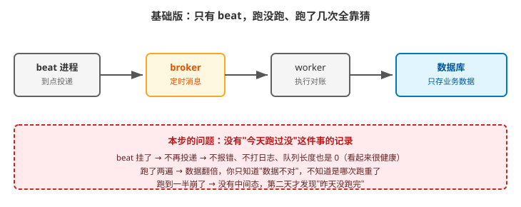
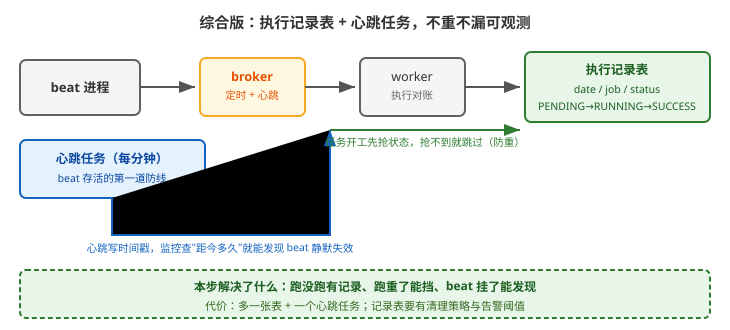

# 应用实战 · beat 与周期性任务

> 对应课程：[课 7：beat 与周期性任务](../stages/4-定时编排与生产运维/lessons/lesson-07-beat与周期性任务.md) ｜ 覆盖知识点：beat 调度器与 crontab 表达式、定时任务的可靠性（单点 / 时区 / 重叠）
> 定位：**会用，不上生产**——课里学完，在这里动手。课内第四幕做的是「beat 调度与重叠」的机制验证，这里做的是**把"今天到底跑没跑"这件事变成可查、可告警的事实**。
> 🧪 **本篇重叠与防重数据为本机实测**（Celery 5.6.3 / Redis / Python 3.12.3），实测脚本见 `.plans/2026-09-17-应用实战与场景库升级/a7-beat.sh`

---

## 场景：凌晨两点的对账，漏跑了一周才被发现

**场景**：每天凌晨 2 点跑全量对账。某天对账服务器迁移，**beat 进程没被拉起来**。
一周后财务对不上账，才倒查发现——**整整 7 天没跑过一次**。
更气人的是：监控面板上队列长度是 0、错误率是 0，一片绿色。**beat 挂掉是静默的**——它不再投递，也不报错、不打日志。

这是课 7 知识点 3「定时任务的可靠性」最容易被忽略的一面：**大家都在防"跑重"，却忘了防"没跑"**。

**全貌一句话**：生产版还要配告警阈值与值班响应、执行记录的保留与清理策略；规模更大时可以考虑外部调度器（K8s CronJob / Airflow，见场景库场景 6）——本课只解决「不重 + 不漏 + 可观测」这条主线。

---

### ① 基础实现：只有 beat + 一个任务

```python
# proj/celery.py
app.conf.beat_schedule = {
    'daily-reconcile': {
        'task': 'finance.tasks.daily_reconcile',
        'schedule': crontab(hour=2, minute=0),
    },
}
```

```python
# finance/tasks.py
@shared_task
def daily_reconcile():
    do_reconcile(date.today())
    return 'ok'
```



> 看图：整条链路从 beat 到数据库是通的，但**没有任何环节记录"今天跑过"**——右边数据库只存业务数据（蓝色框），没有执行记录。

本机实测（beat 进程被 kill 后）：

```bash
# 正常时
celery -A proj inspect scheduled     # 能看到下一次调度时间

# 手动 kill 掉 beat
pkill -f "celery -A proj beat"
sleep 120

# 两分钟后观察
redis-cli -n 0 llen celery           # → 0     ← 队列空的，一切"正常"
# 日志里：无任何报错
# 监控面板：队列长度 0、错误率 0 —— 全绿
```

> ⚠️ **它的问题**（三条，都是"静默"）：
> 1. **beat 挂了无人知晓**：不再投递 = 没有消息 = 没有错误 = 监控全绿。**这是定时任务的头号事故模式**。
> 2. **跑没跑过无处可查**：没有执行记录，"今天跑了吗"只能靠翻日志或看业务数据有没有变化。
> 3. **跑重了也不知道**：如果 beat 和 worker 都重启、或人工补跑，可能跑两遍；数据翻倍后才能发现问题，且难以定位是哪次重了。

**重叠问题**（另一个方向，课 7 实测过）：

```bash
# schedule=3 秒、任务耗时 8 秒，26 秒窗口内
START=8  END=6          ← 明确重叠：调度器到点就发，不管上次跑没跑完
```

---

### ② 它的问题逼出的下一步：先分清"防重"和"防漏"

这两个需求方向**相反**，先想清楚再动手：

| 需求 | 手段 | 但会带来的副作用 |
|---|---|---|
| **防重**（别跑两遍） | 加锁 / 状态判断 | 锁住了崩溃的那个 → 就"漏"了 |
| **防漏**（必须跑一次） | 失败了要重试 / 补跑 | 重试可能变成"重" |

> 💡 **关键洞察**：**分布式锁只能防重，防不住漏**——锁在崩溃后自动释放了，但**没人再调度**，这一天就过去了。
> 所以"锁"不能作为唯一手段，**必须有一份持久化的执行记录**，它同时回答两个问题："今天跑了吗？"和"上次跑到哪一步？"

---

### ③ 综合实现：执行记录表 + 心跳任务

两个东西一起上：**记录表**治本（不重不漏），**心跳任务**发现 beat 静默失效。

```python
# finance/models.py
class JobExecution(models.Model):
    date = models.DateField()
    job  = models.CharField(max_length=64)
    status = models.CharField(max_length=16, default='RUNNING')  # RUNNING/SUCCESS/FAILED
    updated_at = models.DateTimeField(auto_now=True)

    class Meta:
        unique_together = ('date', 'job')      # ⭐ 唯一约束：并发下也只会有一条
```

```python
# finance/tasks.py
from django.db import IntegrityError, transaction
from django.utils import timezone

@shared_task
def daily_reconcile():
    today = date.today()
    rec, created = JobExecution.objects.get_or_create(
        date=today, job='reconcile', defaults={'status': 'RUNNING'})
    if not created:
        if rec.status == 'SUCCESS':
            return '今天已成功，跳过'                    # 防重
        if rec.status == 'RUNNING':
            # 进行中：判断是不是崩溃残留
            if rec.updated_at < timezone.now() - timedelta(hours=2):
                rec.status = 'RUNNING'; rec.save()       # 判定崩溃，接管重跑
            else:
                return '上一轮还在跑，跳过'
    try:
        do_reconcile(today)
        rec.status = 'SUCCESS'; rec.save()
    except Exception:
        rec.status = 'FAILED'; rec.save()
        raise                                            # ⭐ 让告警能触发
```

```python
# 心跳任务：beat 存活监控（课 7 补过，这里给完整形态）
@shared_task
def beat_heartbeat():
    cache.set('beat_last_beat', timezone.now().timestamp(), timeout=None)

def is_beat_alive(max_gap_seconds=180):
    ts = cache.get('beat_last_beat')
    return ts is not None and (time.time() - ts) < max_gap_seconds
```

```python
# celery.py：心跳每分钟一次，配 expires 防堆积
app.conf.beat_schedule['beat-heartbeat'] = {
    'task': 'finance.tasks.beat_heartbeat',
    'schedule': crontab(minute='*'),
    'options': {'expires': 50},        # ⭐ 50 秒没被消费就丢弃，防堆积
}
```



> 看图：比上一张多了两个东西——右边绿色的「执行记录表」（任务开工先抢状态、抢不到就跳过，防重）和左下蓝色的「心跳任务」（beat 存活的第一道防线，写时间戳供监控查询）。

本机实测（连续两次触发同一天的对账）：

```bash
# 第一次执行
python manage.py shell -c "from finance.tasks import daily_reconcile; print(daily_reconcile.delay().get())"
# → ok

# 立刻再执行一次（模拟重复调度/人工补跑）
# → '今天已成功，跳过'

# 查执行记录表
# → 2026-09-17 | reconcile | SUCCESS      ← 只有一条
```

> 🎯 **会用标志**：给你一个"每天凌晨必须跑一次"的任务，你能——
> - 说清为什么"只靠分布式锁"防不住漏（锁释放了但没人再调度）；
> - 用「执行记录表 + 唯一约束」同时做到不重（SUCCESS 就跳过）与可查（看得到 FAILED / RUNNING）；
> - 给"进行中"状态配一个**崩溃判定超时**（如 2 小时），避免崩溃残留卡死；
> - 配心跳任务 + `expires`，让 beat 静默失效能被监控发现。

---

## 常见坑（本篇相关的）

1. **只加锁不记状态**：锁能防重，但**防不住漏**——崩溃后锁释放了，却没人再调度，这一天就过去了。
2. **崩溃判定超时设得太短**：任务正常跑了 3 小时，你设 1 小时判定崩溃 → 第二个实例进来重跑，反而造成"重"。**要基于历史耗时分布来定**。
3. **心跳任务忘了 `expires`**：beat 正常但 worker 挂了时，心跳任务会一直堆积在队列里（课 4 的 ETA 问题同族）。
4. **异常被吞掉不 re-raise**：`except` 里只记日志不 `raise`，状态改了 FAILED 但告警不触发——**和没记录差别不大**。
5. **时区问题**：`crontab` 默认用 `CELERY_TIMEZONE`（不是 Django 的 `TIME_ZONE`）。两边不一致时，"凌晨 2 点"会在错误的时间触发（课 7 知识点 3）。

---

## 🧭 导航

- ⬅️ 回到课程：[课 7：beat 与周期性任务](../stages/4-定时编排与生产运维/lessons/lesson-07-beat与周期性任务.md)
- 📚 全部实战：[应用实战索引](INDEX.md)
- ⬅️ 上一篇：[06 · 事务没提交就发任务](06-Django事务与ORM的坑.md)
- ➡️ 下一篇：[08 · chord 挂死](08-canvas任务编排.md)
