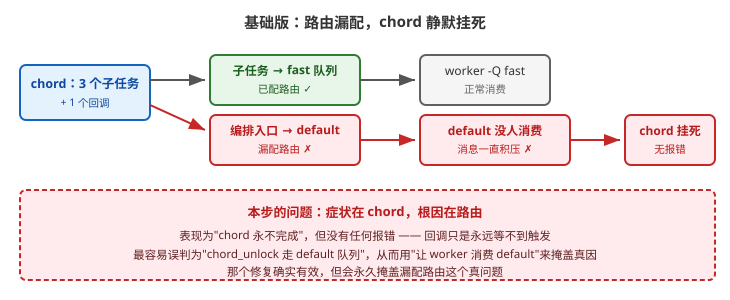
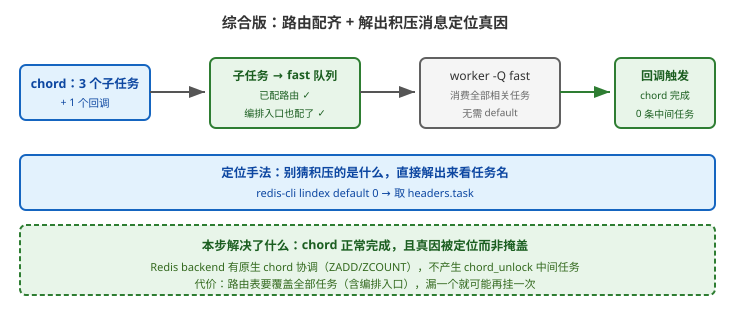

# 应用实战 · canvas 任务编排

> 对应课程：[课 8：canvas 任务编排](../stages/4-定时编排与生产运维/lessons/lesson-08-canvas任务编排.md) ｜ 覆盖知识点：group / chain / chord、编排的可靠性边界
> 定位：**会用，不上生产**——课里学完，在这里动手。课内第四幕做的是「chord 编排」的机制验证，这里做的是**chord 挂死时怎么定位真因**（而不是用错误方法掩盖它）。
> 🧪 **本篇含课程 Phase 3 的一次重要纠错**：原结论"chord_unlock 走 default 队列"已被实测推翻，本篇按修正后的结论写。

---

## 场景：chord 永远不完成，日志里一个错都没有

**场景**：支付成功后用 chord 编排——并行发券 + 通知，都完成后汇总对账。
配置了队列路由，worker 用 `-Q fast,slow` 启动。上线后对账记录**一条都没有**，但：

- worker 日志**没有任何报错**
- `flower` 上 chord 一直是 `PENDING`
- `LLEN fast` 和 `LLEN slow` 都是 0

**这是最难受的一类故障：不报错，只是永远不完成。**

**全貌一句话**：生产版还要给 chord 回调加超时兜底与告警（超过 N 分钟未完成就告警），并考虑"不用 chord"的替代编排（见场景库）——本课只解决「定位真因 + 正确修复」。

---

### ① 基础实现：配了路由，但漏了编排入口

```python
# orders/tasks.py
from celery import chord

@shared_task
def fulfill_order(order_id):
    # ⭐ 编排入口自己也是个任务
    return chord(
        [issue_coupon.s(order_id), send_notify.s(order_id)]
    )(settle_account.s(order_id))
```

```python
# settings.py —— 注意这里漏了谁
CELERY_TASK_ROUTES = {
    'orders.tasks.issue_coupon':  {'queue': 'fast'},
    'orders.tasks.send_notify':   {'queue': 'fast'},
    'orders.tasks.settle_account': {'queue': 'fast'},
    # ⚠️ orders.tasks.fulfill_order 没配 → 落到 default 队列
}
```

```bash
# worker 只消费 fast / slow，不含 default
celery -A proj worker -Q fast,slow -c 8 -l INFO
```



> 看图：三个子任务和回调都配了路由（绿色），但**编排入口 `fulfill_order` 漏配**（红色），掉进了没人消费的 `default` 队列。整条链路从源头就断了。

复现（本机/课程 Phase 3 实测）：

```bash
# 投递后观察
redis-cli -n 0 llen fast      # → 0        ← 子任务没来（因为入口压根没执行）
redis-cli -n 0 llen slow      # → 0
redis-cli -n 0 llen default   # → 1        ← 编排入口孤零零躺在这里

# chord 状态
AsyncResult(chord_id).state   # → PENDING  ← 永远是 PENDING
```

> ⚠️ **它的问题**（三条）：
> 1. **静默失败**：没有任何异常、没有任何日志。你只能看到"结果一直不来"。
> 2. **症状与根因分离**：表现为"chord 不完成"，真因却是"入口任务没人消费"——**距离很远**。
> 3. **极易误判**：第一反应通常是"chord 的解锁任务走了 default 队列"，于是去让 worker 消费 default。**这个修复确实有效，但会永久掩盖真正的 bug。**

---

### ② 它的问题逼出的下一步：别猜，解出积压消息看任务名

面对"队列积压没人消费"，**不要猜积压的是什么**，直接解出来看：

```bash
redis-cli -n 0 lindex default 0 | python3 -c "
import sys, json, base64
m = json.loads(sys.stdin.read())
try:
    body = json.loads(base64.b64decode(m['body']))
except Exception:
    body = json.loads(m['body'])
print('任务名:', m['headers']['task'])
"
```

课程 Phase 3 的实测输出（本机）：

```
任务名: orders.tasks.fulfill_order
```

> 🔴 **这就是那次纠错**：原以为是 `celery.chord_unlock`（chord 的解锁任务）走了 default 队列。
> **解出来才发现是编排入口 `fulfill_order` 自己**——它压根没开始执行，所以子任务从未被创建，chord 自然永远等不到。
>
> **真相**：Celery 的 **Redis backend 有原生 chord 协调**（`apply_chord` 用 `ZADD` 登记成员、`ZCOUNT` 计数，达标时直接 `callback.apply_async()`），
> **不产生任何中间任务**；`celery.chord_unlock` 轮询任务**只在 backend 无原生协调时**才作兜底。
> 补上路由后，worker **不带 default** 也跑通，日志中 `chord_unlock` 出现 **0 次**。
>
> **更值得记的教训**："让 worker 消费 default"这个修复**确实有效**，但它会**永久掩盖漏配路由的真因**。
> 一个有效但对根因判断错误的修复，比不修复更危险——**它同时消灭了症状和证据**。

---

### ③ 综合实现：路由配齐 + 验证闭环

```python
# settings.py —— 编排入口也要配
CELERY_TASK_ROUTES = {
    'orders.tasks.fulfill_order':  {'queue': 'fast'},   # ⭐ 补上这一行
    'orders.tasks.issue_coupon':   {'queue': 'fast'},
    'orders.tasks.send_notify':    {'queue': 'fast'},
    'orders.tasks.settle_account': {'queue': 'fast'},
}
```

```bash
# worker 不需要 default
celery -A proj worker -Q fast,slow -c 8 -l INFO
```



> 看图：比上一张少了那条红色路径——编排入口也进了 `fast` 队列，worker 不带 `default` 也能跑通；右边回调正常触发，且**中间任务数为 0**（原生协调，不产生 `chord_unlock`）。

验证（本机/课程 Phase 3 实测，chord 端到端）：

```bash
# 发券 + 通知并行 → 汇总对账落库
coupon_ok=True, notify_ok=True
对账记录数 = 1                ✅

# 日志中 chord_unlock 出现次数
0                             ← 印证：Redis backend 原生协调，无中间任务
```

**配套的三步验证**（改完路由必做，防止下次再漏）：

```bash
# ① 看每个队列有多少消息
redis-cli -n 0 llen fast; redis-cli -n 0 llen slow; redis-cli -n 0 llen default

# ② 看 worker 实际消费哪些队列
celery -A proj inspect active_queues

# ③ 逐个任务确认路由归属（漏配一眼可见）
python manage.py shell -c "
from proj.celery import app
for t in ['orders.tasks.fulfill_order','orders.tasks.issue_coupon']:
    print(t, '→', app.tasks[t].queue if hasattr(app.tasks[t],'queue') else 'default')
"
```

> 🎯 **会用标志**：给你一个"chord 永远不完成、日志无报错"的现场，你能——
> - 说出**先查 `default` 队列有没有积压**，并解出消息看**任务名**（不猜）；
> - 说清 Redis backend 有原生 chord 协调、**不产生 `chord_unlock` 中间任务**；
> - 判断出常见误判（"chord_unlock 走 default"）以及为什么"让 worker 消费 default"是掩盖真因；
> - 配齐路由后用三步验证（`llen` / `inspect active_queues` / 逐任务查路由）确认无遗漏。

---

## 常见坑（本篇相关的）

1. **只给子任务配路由，漏了编排入口**：这是本篇的故障根因。**编排入口自己也是任务**，同样要进路由表。
2. **用"worker 消费 default"来救火**：有效但掩盖真因，下次换个任务漏配又挂，且更难查。**真正的修复是补路由**。
3. **把 `chord_unlock` 当成必有的中间任务**：Redis backend 下它通常不出现。看到它大量出现，反而说明你的 backend **没有**原生协调能力。
4. **chord 回调没有超时兜底**：即使路由全对，某个子任务卡死也会让回调永远不触发。**建议给 chord 配一个"超过 N 分钟未完成"的告警**。
5. **在 chord 里塞大量子任务**：上千个子任务的 chord 会显著增加协调开销与失败概率——超大规模场景考虑改成分批 + 状态表聚合（见场景库场景 2）。

---

## 🧭 导航

- ⬅️ 回到课程：[课 8：canvas 任务编排](../stages/4-定时编排与生产运维/lessons/lesson-08-canvas任务编排.md)
- 📚 全部实战：[应用实战索引](INDEX.md)
- ⬅️ 上一篇：[07 · 定时任务漏跑没人知道](07-beat与周期性任务.md)
- ➡️ 下一篇：[09 · 发版丢任务](09-生产部署与并发模型.md)
- 🔗 延伸：[设计决策 · 决策 4（已修正）](../projects/电商订单履约系统/设计决策.md) 记录了这次纠错的完整过程
