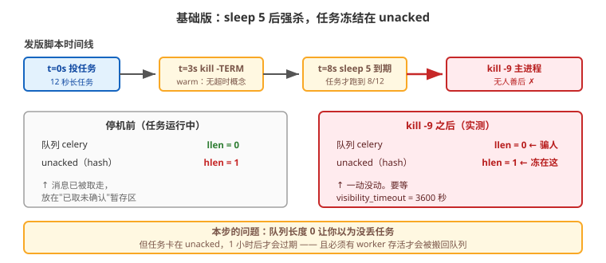
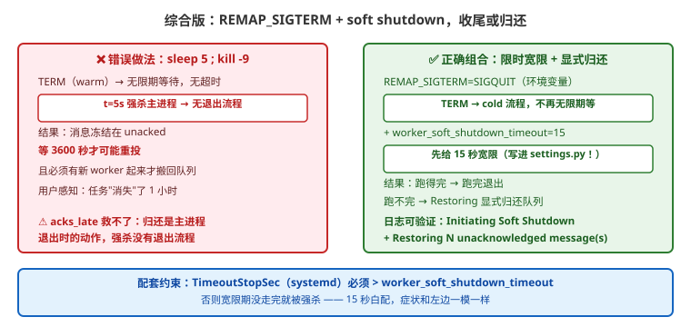

# 应用实战 · 生产部署与并发模型

> 对应课程：[课 9：生产部署与并发模型](../stages/4-定时编排与生产运维/lessons/lesson-09-生产部署与并发模型.md) ｜ 覆盖知识点：优雅停机、warm/soft/cold shutdown、`REMAP_SIGTERM`
> 定位：**会用，不上生产**——课里学完，在这里动手。课内第四幕做的是「四种停机的行为对照」，这里做的是**你那套发版脚本到底会不会丢任务**（以及"丢"的任务藏在哪）。
> 🧪 **本篇含 4 组本机实测**，其中 2 组推翻了"配了 `acks_late` 就不丢任务"这个常见误解——详见 ②。

---

## 场景：每次发版都有任务卡在 STARTED，永远不结束

**场景**：运维的发版脚本是这么写的，看起来很"优雅"：

```bash
kill -TERM $(cat /var/run/celery/worker.pid)   # 优雅停机
sleep 5                                         # 等 5 秒
kill -9 ...                                     # 还没退就强杀
```

结果每次发版后，总有那么几个"正在跑的长任务"状态卡在 `STARTED`，永远不结束。
你去 Redis 里查队列长度，**是 0**——"队列都空了，怎么会丢任务？"

**全貌一句话**：生产版还要配 systemd 的 `TimeoutStopSec > worker_soft_shutdown_timeout`、容器环境的 `REMAP_SIGTERM=SIGQUIT`，以及任务幂等（因为重投意味着可能跑两遍）——本课只解决「搞清楚丢的任务去哪了 + 正确停机的三件套」。

---

### ① 基础实现：那套"看起来很优雅"的发版脚本

```bash
# deploy.sh —— 问题版本
kill -TERM $(cat /var/run/celery/worker.pid)
sleep 5
kill -9 $(cat /var/run/celery/worker.pid) 2>/dev/null
```



> 看图：`TERM` 触发的是 **warm shutdown**——它只是"停止收新任务，把手上的活干完"，**不会在 5 秒后自动放弃**。
> 第 5 秒你 `kill -9` 时，12 秒的任务才跑到第 8 秒；主进程被强杀，**来不及把消息还回队列**，它就留在 `unacked` 里了。

**本机实测（12 秒长任务，第 3 秒执行发版脚本）**：

```bash
$ bash a9-shutdown.sh     # 实验 A
TERM 后 5 秒，任务进度: 8/12  ← warm shutdown，还在跑
已 kill -9
最终进度: 8/12 秒
任务状态: TIMEOUT              ← 永远不结束，卡在 STARTED
broker celery 队列剩余: 0      ← 队列是空的！
```

> ⚠️ **它的问题**（三条，一条比一条反直觉）：
> 1. **`sleep 5` 是个假承诺**：warm shutdown 没有超时概念，`sleep 5` 到期时任务可能才跑了一半。你以为"等了 5 秒很优雅"，其实只是**把 kill 从第 0 秒推迟到了第 5 秒**——该丢还是丢。
> 2. **队列长度是 0，但任务确实丢了**：这是最迷惑人的地方。见 ②。
> 3. **`kill -9` 杀的是主进程**：主进程负责清理和归还消息，把它强杀 = **没人善后**。

---

### ② 它的问题逼出的下一步：队列是 0，任务到底去哪了？

"队列长度 0"不代表任务没了，只代表**它不在队列里**。kombu（Celery 的消息库）把**已取走但还没确认**的消息放在另一个结构里。

**本机实测（db0 全量 key 快照，12 秒任务运行中 vs 主进程被 `kill -9` 后）**：

```bash
$ bash a9-diag2.sh
== kill -9 之前（任务正在跑，已取未 ack）==
  unacked        type=hash  size=1      ← 消息在这里
  unacked_index  type=zset  size=1
  队列 celery     size=0

== kill -9 之后（主进程强杀，来不及清理）==
  unacked        type=hash  size=1      ← 还在这里，一动没动
  unacked_index  type=zset  size=1
  队列 celery     size=0

任务进度: 3/12
```

**对照组——`kill -TERM`（warm，等跑完再退）**：

```
TERM 之后：
  _kombu.binding.celery  type=set  size=1     ← unacked / unacked_index 全被清干净了
任务进度: 6/6                                  ← 跑完了
```

> 🔴 **这就是本篇要推翻的误解**：**"配了 `task_acks_late` 就不会丢任务"是错的。**
>
> `acks_late` 的确让消息在 broker 里保留了一份（所以它在 `unacked` 里），**但它不能让一个被 `kill -9` 的主进程把消息还回去**——
> 归还动作（`Restoring N unacknowledged message(s)`）由 **主进程在退出时执行**，而 `kill -9` 恰恰不给主进程执行的机会。
>
> **所以真相是**：任务没"丢"，它被**冻结**在 `unacked` 里，要等 `visibility_timeout`（默认 **3600 秒 = 1 小时**）后才过期。
> 你的发版 5 分钟后就结束了，而任务要 1 小时后才可能被看到——**对用户来说，这就是丢了**。

**验证这个"冻结"确实存在**（把 `visibility_timeout` 调到 10 秒，强杀后**再启动一个新 worker**）：

```bash
$ bash a9-diag4.sh     # 实验 E：20 秒长任务，vt=10
  [1] 运行中：        队列=0  unacked=1
  [3] 强杀后（进度 4/20）：队列=0  unacked=1
  [4] 干等 14 秒（vt 已到期，但没有 worker 活着）：队列=0  unacked=1   ← 自己不会回来
  [5] 启动新 worker： 队列=1  unacked=0                                ← 回来了！
  [7] 任务最终进度: 20/20    状态: SUCCESS                              ← 重跑成功
```

> 🎯 **关键结论（本篇最重要的一条）**：
> - 强杀后消息**不会自动回到队列**，它停泊在 `unacked`；
> - **干等没有用**——必须**有 worker 存活**（新起的也算），kombu 在连接/恢复时才会把过期的 `unacked` 消息搬回队列；
> - 所以"发版丢任务"的真正后果是：**新 worker 起来之前，这些任务对用户是不可见的**。发版窗口越长，用户等越久。

**另一个反直觉点**：`reject_on_worker_lost` **也救不了主进程被杀**。
它管的是"**子进程**崩了（OOM、段错误）但主进程还活着"的情况——实测日志里会有：

```
[ERROR/MainProcess] Task handler raised error: WorkerLostError(
    'Worker exited prematurely: signal 9 (SIGKILL) Job: 0.')
```

主进程随后拉起新子进程，任务重新跑（实测最终 12/12 完成）。**但整个 worker 被 `kill -9` 时，这个机制同样没有执行机会。**

---

### ③ 综合实现：正确的停机三件套

```python
# settings.py —— ⭐ 实测确认：写进 settings 才稳定生效
CELERY_TASK_ACKS_LATE = True                        # 崩溃/被砍 → 消息在 broker 有留存
CELERY_TASK_REJECT_ON_WORKER_LOST = True            # 子进程崩了 → 重新入队
CELERY_WORKER_PREFETCH_MULTIPLIER = 1               # 长任务场景：公平分发
CELERY_WORKER_SOFT_SHUTDOWN_TIMEOUT = 15.0          # 5.5+：给 15s 宽限收尾
CELERY_WORKER_ENABLE_SOFT_SHUTDOWN_ON_IDLE = True   # 5.5+：空闲时也走 soft
```

```bash
# 容器环境必配（环境变量，写进 app.conf 无效）
export REMAP_SIGTERM="SIGQUIT"     # TERM → 走 cold 流程（不再无限期等待）
```



> 看图：左边是错误的"等 5 秒再强杀"（任务冻在 `unacked` 1 小时）；
> 右边是正确组合——`TERM` 被重映射为 cold 流程，先给 15 秒宽限，**跑得完的跑完，跑不完的显式 `Restoring` 归还队列**，而不是被强杀后无声冻结。

**为什么必须 `REMAP_SIGTERM`**：容器/K8s 停止 Pod 发的就是 `TERM`。默认 `TERM` = warm = **无限期等待**，
你的 `terminationGracePeriodSeconds: 30` 一到，容器被 `KILL`——**和第 ① 步的 `sleep 5; kill -9` 是同一个死法**，只是等待时间从 5 秒变成 30 秒。

**配套的 systemd 约束**（实测踩过的坑）：

```ini
[Service]
Environment="REMAP_SIGTERM=SIGQUIT"
TimeoutStopSec=30          # ⭐ 必须 > worker_soft_shutdown_timeout（15）
```

> ⚠️ `TimeoutStopSec` 若小于 soft shutdown 超时，宽限期没走完就被 systemd 强杀——**那 15 秒白配了**，症状和第 ① 步一模一样。

**验证配置真的生效**（别靠猜，实测踩过的坑：环境变量 `CELERY_WORKER_SOFT_SHUTDOWN_TIMEOUT` **worker 读不到**，静默回落 `0.0`）：

```bash
celery -A proj inspect conf | grep -i soft_shutdown
# 期望：worker_soft_shutdown_timeout: 15.0   ← 不是 0.0！
```

**验证停机会不会丢任务**（这个自查手法比看配置更直接）：

```bash
# 停机前 / 停机后各查一次，size 从 1 变 0 = 消息已被正常处理或归还
redis-cli -n 0 hlen unacked          # ← 注意是 hash，不是 list
redis-cli -n 0 llen celery           # ← 队列长度，0 不代表没丢
```

> 🎯 **会用标志**：给你一个"发版后任务卡在 STARTED"的现场，你能——
> - 说出**不要只看 `llen` 队列**，还要看 `unacked`（kombu 的"已取未确认"暂存区，类型是 hash）；
> - 解释为什么 `acks_late` **救不了主进程被 `kill -9`**（归还是主进程退出时的动作，强杀没有退出流程）；
> - 说明 `reject_on_worker_lost` 只对**子进程崩溃**有效（日志 `WorkerLostError`），对整机强杀无效；
> - 判断出 `sleep 5; kill -9` 的本质问题（warm 没有超时概念，强杀主进程 = 无人善后）；
> - 给出正确组合：`REMAP_SIGTERM=SIGQUIT` + `worker_soft_shutdown_timeout` + `TimeoutStopSec` **大于** 宽限时间。

---

## 常见坑（本篇相关的）

1. **只看 `llen` 队列判断"有没有丢任务"**：❌ 强杀后队列就是 0，但任务冻在 `unacked` 里。**必看 `hlen unacked`**。
2. **以为 `acks_late` 就万事大吉**：它只保证"broker 里还有一份"，**不保证"有人把它还回队列"**——归还需要主进程优雅退出。
3. **`sleep N; kill -9` 式的发版脚本**：warm shutdown 没有超时概念，`sleep` 只是把强杀推迟了 N 秒。**要么给足宽限，要么用 soft shutdown 明确限时**。
4. **`visibility_timeout` 默认 1 小时太长**：强杀后任务要 1 小时才可能被重新看到。长任务场景建议调到**大于最长任务耗时**但别大得离谱（比如 10~30 分钟），并配合告警。
5. **新 worker 起来就万事大吉？**：重投意味着**任务可能跑第二遍**。这依赖你在课 5 做的**幂等**——不幂等的任务重跑就是资损。
6. **用环境变量注入 `CELERY_WORKER_SOFT_SHUTDOWN_TIMEOUT`**：实测 worker **读不到**，静默回落 `0.0`，功能没启用且**无任何报错**。写进 `settings.py`。

---

## 🧭 导航

- ⬅️ 回到课程：[课 9：生产部署与并发模型](../stages/4-定时编排与生产运维/lessons/lesson-09-生产部署与并发模型.md)
- 📚 全部实战：[应用实战索引](INDEX.md)
- ⬅️ 上一篇：[08 · chord 挂死](08-canvas任务编排.md)
- ➡️ 下一篇：（完）回到 [场景解法库](../10-场景解法库/INDEX.md) 看同类问题的横向对比
- 🔗 相关：[课 5 · 确认机制与重试策略](05-确认机制与重试策略.md)（幂等是重投的前提）

