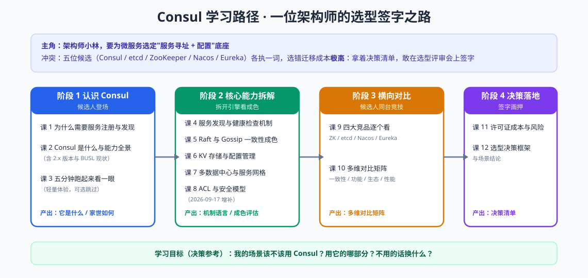

# Consul 学习路径总览

> 学习目标：**决策参考**——学完能回答"我的场景该不该用 Consul、用它的哪部分、不用换什么"。
> 学习者画像：入门水平。最近更新：2026-08-27

## 故事主线：一位架构师的选型签字之路

**主角**：架构师小林，公司微服务化，要为"服务寻址 + 配置"选定底座。
**冲突**：候选五位（Consul、etcd、ZooKeeper、Nacos、Eureka），资料各执一词；选错迁移成本极高；2023 年后 Consul 还换了许可证，决策更复杂。
**转折**：每阶段回答一层疑问——认识本尊 → 拆开引擎 → 竞品同台 → 签字画押。
**收束**：拿着决策清单，敢在选型评审会上签字。

## 各阶段一览

| 阶段 | 名称 | 故事章节 | 目标 | 重点 |
|------|------|----------|------|------|
| 1 | 认识 Consul | 候选人登场 | 搞懂 Consul 是什么、能干什么、架构长什么样 | 服务发现问题本质；能力全景；Server/Client/DC 模型；2.x 版本与 BUSL 许可证现状 |
| 2 | 核心能力拆解 | 拆开引擎看成色 | 评估每项核心能力的机制与可靠性 | 健康检查语义；Raft 与 Gossip；三种读模式；KV 与配置中心差距；多 DC 与 Connect 网格 |
| 3 | 横向对比 | 候选人同台竞技 | 建立 Consul 与四大竞品的多维对比矩阵 | ZK/etcd/Nacos/Eureka 各自的牌；一致性、功能、生态、性能四维对比 |
| 4 | 决策落地 | 签字画押 | 形成可执行的选型决策框架 | BUSL 深度解读；运维与退出成本；场景结论；决策清单与落地路线 |

## 阶段依赖

- 阶段 1 是全局问题基础：不懂"为什么需要注册中心"，后面所有对比都无意义
- 阶段 2 为对比提供机制语言：没有 Raft/读模式/健康检查的概念，阶段 3 只能死记硬背
- 阶段 3 输出对比矩阵，是阶段 4 决策的直接输入
- 全路径图：

## 角色视角（多角色判定）

| 项 | 结论 |
|----|------|
| 主线角色 | **架构师 / 开发视角做选型**（学习者画像：入门、目标=决策参考） |
| 次角色 | **运维 / SRE** |
| 判定依据 | 命中三条信号：① 官方文档本身分角色组织（Develop / Operate）；② 现实中分岗位（应用开发 vs 运维 / SRE）；③ 删掉运维内容后主线仍完整 |
| 处置 | 次角色内容收敛为子教程，主线只做提及级带过 |

- **运维专项**：部署 / 集群 / 证书 / 备份 / 监控 / 升级 / 多机房与 K8s——按需学习，不影响主线进度（入口：[子教程/运维专项/overview.md](子教程/运维专项/overview.md)）｜**进度：课 8 / 8 已交付（课 1、2、3、4、5、6、7、8 · 运维专项全部完成）**（[课 1 生产部署与集群搭建](子教程/运维专项/lessons/lesson-01-生产部署与集群搭建.md)、[课 2 集群健康与 day-2 运维](子教程/运维专项/lessons/lesson-02-集群健康与day-2运维.md)、[课 3 性能、容量与调优](子教程/运维专项/lessons/lesson-03-性能、容量与调优.md)、[课 4 证书与密钥生命周期](子教程/运维专项/lessons/lesson-04-证书与密钥生命周期.md)、[课 5 备份、恢复与灾备演练](子教程/运维专项/lessons/lesson-05-备份、恢复与灾备演练.md)、[课 6 监控指标与告警](子教程/运维专项/lessons/lesson-06-监控指标与告警.md)、[课 7 版本升级与迁移](子教程/运维专项/lessons/lesson-07-版本升级与迁移.md)、[课 8 多机房与 K8s 运维视角](子教程/运维专项/lessons/lesson-08-多机房与K8s运维视角.md)）
- **提及级约定**：主线中运维知识只写"一句话 + 指向子教程"，不展开（课 11 的「运维五问」即此形态）

## 关键背景事实（已核查，2026-08）

- Consul 当前处于 **2.x 时代**：v2.0.0 于 2026-05-24 发布，当前维护 2.0.x / 1.22.x / 1.21.x 三条线（核查于 2026-08）
- **许可证**：Consul 1.16.4 是最后一个 MPL 2.0 版本，1.17.0 起为 BUSL 1.1（2023-08-10 宣布）；API/SDK 保持 MPL 2.0（核查于 2026-08）
- 这两条事实是"决策参考"目标下最重要的评估输入，将在课 2 与课 11 深入展开
