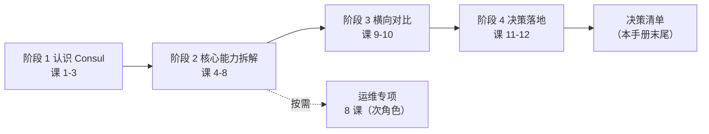

# Consul 课程手册（最终交付）

> **本手册是全课程的收口件**：一张全局地图 + 一份可勾选的决策清单。
> 主线 12 课 ✅ 全部完成 ｜ 运维专项 8 课 ✅ 全部完成 ｜ 应用实战 5 篇 ✅ 全部实测
> 生成日期：2026-09-21 ｜ 学习目标：**决策参考**

## 这份手册怎么用

它不是第 13 课，不重讲任何内容。它只做三件事：

1. **给你一张地图**——学过的东西在哪、彼此什么关系
2. **把 12 课压缩成 12 条最硬的结论**——评审会上能直接引用的那种
3. **末尾付一份决策清单**——学完整门课真正要交出去的东西

> ⚠️ **如果你想直接做决策，跳到末尾「决策清单」。** 其余部分是给需要回溯依据的人准备的。

---

## 一、全课程地图



| 块 | 解决什么 | 入口 |
|----|---------|------|
| 主线 4 阶段 12 课 | 该不该用 Consul、用哪部分、不用换什么 | [02-课程目录](./02-课程目录.md) |
| 运维专项 8 课 | 决定用之后，平时怎么把它养住 | [子教程/运维专项](./子教程/运维专项/overview.md) |
| 应用实战 5 篇 | 机制怎么变成能跑的东西 | [应用实战/INDEX.md](./应用实战/INDEX.md) |
| 综合实战项目 | 跨 4 阶段的可运行工程 | [服务注册发现与配置中心](./projects/服务注册发现与配置中心/README.md) |
| 实战经验 / 排障手册 / 场景解法库 | 崩了怎么查、新需求怎么设计 | [08](./08-实战经验.md) ｜ [09](./09-排障速查手册.md) ｜ [场景解法库](./场景解法库/INDEX.md) |

**角色提示**：主线是架构师 / 开发视角做**选型**；运维专项是运维 / SRE 视角做**养护**。两者不是两个进度条——删掉运维内容，主线依然完整。时间紧的话，运维专项的保命线是**课 2（健康）> 课 6（监控）> 课 5（备份）**。

---

## 二、12 课速览：每课最硬的一条

> 只列每条课**最反直觉、最能在评审会上顶用**的那一条。完整内容点课名。

### 阶段 1：认识 Consul（候选人登场）

**课 1 为什么需要服务注册与发现** —— [讲义](./stages/1-认识Consul/lessons/lesson-01-为什么需要服务注册与发现.md)
服务发现不是"查 IP"，是**把"地址"从代码里搬到运行时的一个可失效、可替换的间接层**。客户端发现 vs 服务端发现的差别，本质是"谁承担寻址逻辑"。

**课 2 Consul 是什么与能力全景** —— [讲义](./stages/1-认识Consul/lessons/lesson-02-Consul是什么与能力全景.md)
**Consul 是能力集合，不是单一产品**（服务发现 / 健康检查 / KV / 多 DC / 网格 / DNS+HTTP 双接口）。这一条决定了后面所有结论都必须是"用它的哪部分"，而不是"用不用它"。

**课 3 五分钟跑起来看一眼** —— [讲义](./stages/1-认识Consul/lessons/lesson-03-五分钟跑起来看一眼.md)（轻量体验课，可选跳过）
本机实测踩到一个环境坑：Windows 的 `nslookup` **不支持自定义端口**，验证 DNS 接口要 `-dns-port=53` 适配。（课内已如实记录排查过程）

### 阶段 2：核心能力拆解（拆开引擎看成色）

**课 4 服务发现与健康检查机制** —— [讲义](./stages/2-核心能力拆解/lessons/lesson-04-服务发现与健康检查机制.md)
健康检查的语义比"探活"丰富得多——六种类型覆盖没有 HTTP 端口的后台任务（TTL / 脚本）。TTL 实测：心跳停止后约 **1 分 15 秒**自动注销。

**课 5 Raft 与 Gossip 一致性成色** —— [讲义](./stages/2-核心能力拆解/lessons/lesson-05-Raft与Gossip一致性成色.md)
杀掉 leader 的三层节奏实测：**+3.6s suspect → +7.2s failed → +11s 选出新 leader → +19.7s autopilot 移除**。这三个数是"Consul 的 CP 成色"真正的量化答案。

**课 6 KV 存储与配置管理** —— [讲义](./stages/2-核心能力拆解/lessons/lesson-06-KV存储与配置管理.md)
**KV 能当配置源，当不了配置中心**——无版本历史、无审计、无灰度。单值有硬上限，超限回 413（被动失败，重试无效）。

**课 7 多数据中心与服务网格** —— [讲义](./stages/2-核心能力拆解/lessons/lesson-07-多数据中心与服务网格.md)
两条都反常识：① 多 DC **联邦是查询通道，不是数据副本**（dc2 读 dc1 的 key 返回 404）；② Connect **默认 intention 是 allow**——不配 ACL 默认拒绝，网格形同虚设。另有实测的"幽灵意图"：意图删除后约 **11 分钟**内授权端点仍返回已删意图。

**课 8 ACL 与安全模型** —— [讲义](./stages/2-核心能力拆解/lessons/lesson-08-ACL与安全模型.md)
**ACL 的失败是静默的**：无权限读单键返 403，但列服务返 `200 {}`、列 keys 返 `200 []`、递归读越权返 **404 伪装成"配置不存在"**。匿名 token 的 SecretID 就是字面量 `anonymous`——它不是"没权限"，它有默认策略。

### 阶段 3：横向对比（候选人同台竞技）

**课 9 四大竞品逐个看** —— [讲义](./stages/3-横向对比/lessons/lesson-09-四大竞品逐个看.md)
四位对手各有出身决定牌面：ZK（Hadoop 生态 / ZAB）、etcd（k8s 基石 / 纯 KV）、Nacos（注册+配置二合一 / AP-CP 可切换）、Eureka（AP 自我保护 / 2.x 已停滞）。本课含两项事实纠错（Nacos 归属、Eureka 现状）。

**课 10 多维对比矩阵** —— [讲义](./stages/3-横向对比/lessons/lesson-10-多维对比矩阵.md)
产出**四维矩阵 + 决策卡片 A–G**。性能维度**诚实做定性处理**——按大纲评审约定，无出处不写数字。

### 阶段 4：决策落地（签字画押）

**课 11 许可证成本与风险** —— [讲义](./stages/4-决策落地/lessons/lesson-11-许可证成本与风险.md)
三本账：① 对绝大多数团队 **BUSL 1.1 不生效**（限制的是"卖与 HashiCorp 竞争的托管服务"），但它**确实不是开源许可证**（OSI 不认证），有合规政策的组织里这是硬成本；② 运维账里最贵的不是机器，是**"必须懂它"的人**；③ 退出账最反直觉：Consul **没有** OpenTofu 那样的成熟社区 fork 可退，退出路径是**控制耦合面**。

**课 12 选型决策框架与场景结论** —— [讲义](./stages/4-决策落地/lessons/lesson-12-选型决策框架与场景结论.md)
全课程收束课，产出决策框架（**4 条一票否决项** + 5 种团队类型的权重表 + 四维打分卡）、四类场景结论（A–D）、三页纸决策材料。

---

## 三、三条元结论

> 如果整门课只准带走三句话：

1. **Consul 的主场是"异构环境的服务注册发现 + 健康检查"**。它的价值随环境复杂度上升：单 K8s 集群 ≈ 0，异构 + 多 DC → 显著。
2. **"该不该用 Consul"是个错误问题**，正确问法是"用它的**哪一部分**"——它是能力集合，不是单一产品。
3. **决策的价值在于划边界**：知道"不用 Consul 的什么"，比论证"它很好"更值钱。

---

## 四、运维专项：决定用之后的 8 课

> 全 8 课于 2026-09-20 交付，均在本机（WSL Ubuntu 24.04 + Consul 2.0.2）**实测**，非纸面推演。入口：[子教程/运维专项](./子教程/运维专项/overview.md)

| 课 | 最硬的一条实测结论 |
|----|------------------|
| **课 1 生产部署与集群搭建**（[讲义](./子教程/运维专项/lessons/lesson-01-生产部署与集群搭建.md)） | 坏 1 台可写（含停 leader，会重选）；坏 2 台不可用且**剩余进程仍存活**。无 quorum 的失败形态**不唯一**（空响应 000 / `No cluster leader` / `Raft leader not found` / `connection refused`），**空响应最常见**——故验收脚本必须校验 HTTP 状态码而非 body |
| **课 2 集群健康与 day-2 运维**（[讲义](./子教程/运维专项/lessons/lesson-02-集群健康与day-2运维.md)） | **指标恒 0 陷阱**：API `Healthy=true` 而 `consul_autopilot_healthy` 恒 0，连 leader 自己的 `isLeader` 也 0。另：4 台时 FailureTolerance **仍 = 1**（4 台 ≠ 比 3 台多容错），5 台才是 2 |
| **课 3 性能、容量与调优**（[讲义](./子教程/运维专项/lessons/lesson-03-性能、容量与调优.md)） | **吞吐差 42~48 倍**：串行 94~111 / 并发 675~757 / 批量事务 4559~4684 条每秒（两轮独立复现）。根因是每条串行写都要等一次 fsync + 复制确认 |
| **课 4 证书与密钥生命周期**（[讲义](./子教程/运维专项/lessons/lesson-04-证书与密钥生命周期.md)） | **三类凭证互相独立**：gossip key / TLS / Connect CA，`keyring` 返回 empty 即未加密。**改 CA 配置 ≠ 立即轮换**——这是最常漏的一项 |
| **课 5 备份、恢复与灾备演练**（[讲义](./子教程/运维专项/lessons/lesson-05-备份、恢复与灾备演练.md)） | **恢复是全量覆盖，不是合并**——快照之后写的数据恢复后全丢。快照**含真实 CA 私钥**（全毁重建后 CA 完整复活），此前"不含 CA 私钥"的说法经实测不成立 |
| **课 6 监控指标与告警**（[讲义](./子教程/运维专项/lessons/lesson-06-监控指标与告警.md)） | **双重命名陷阱**：无前缀的 `consul_autopilot_healthy` 恒为 0（空壳），真实值在**带主机名前缀**的同名指标里。恒 0 指标配告警是**两种相反的错误**：写 `== 0` 永久误报，写 `> 0` **静默失效**（真故障也不响，最危险） |
| **课 7 版本升级与迁移**（[讲义](./子教程/运维专项/lessons/lesson-07-版本升级与迁移.md)） | **回滚不是撤销，是回到过去**：回滚后老数据回来了，但升级窗口内新增的数据**全部丢失**。滚动升级受 quorum 约束——3 节点一次只能停 1 台，停 2 台写直接失败 |
| **课 8 多机房与 K8s 运维视角**（[讲义](./子教程/运维专项/lessons/lesson-08-多机房与K8s运维视角.md)） | 联邦的价值是**故障域隔离**（dc2 全挂后 dc1 读写正常），不是数据冗余。WAN 故障检测 **40 秒**（`probe_interval=5s` × `suspicion_mult=6`）。`consul leave` 后进程活着、HTTP 200，但跨 DC 已断——且**清 data_dir 无效**，恢复必须 `consul join -wan` |

> **保命线优先级**：课 2（健康） > 课 6（监控） > 课 5（备份）。

---

## 五、应用实战五篇

> 入口：[应用实战/INDEX.md](./应用实战/INDEX.md) ｜ 均为**渐进演进**结构（基础 → 它的问题 → 综合 → 边界），各配 3 张分步设计图。

| 篇 | 配套课 | 最硬的一条结论 |
|----|--------|--------------|
| **A 读模式实测**（[实战篇](./practices/实战A-读模式实测/README.md)） | [课 5](./stages/2-核心能力拆解/lessons/lesson-05-Raft与Gossip一致性成色.md) | 强杀 leader 后约 **9.5 秒**窗口内 `default`/`consistent` 全返 500，只有 `stale` 还返旧值——但 **quorum 丢失时 stale 也挂**。stale 换的是"选举期间可用"，不是"选举失败可用" |
| **B Connect 最小闭环**（[实战篇](./practices/实战B-Connect最小闭环/README.md)） | [课 7](./stages/2-核心能力拆解/lessons/lesson-07-多数据中心与服务网格.md) | Consul 2.0.2 自带 `consul connect proxy`，**无需 Envoy 即可跑通 mTLS 数据面**；同时实测**绕过 sidecar 直连应用端口是明文 200**——网格不是"开了就安全" |
| **C ACL 生产权限模型**（[实战篇](./practices/实战C-ACL生产权限模型/README.md)） | [课 8](./stages/2-核心能力拆解/lessons/lesson-08-ACL与安全模型.md) | 21 项权限矩阵验证出两个静默坑：递归读越权返 **404 伪装空配置**；`operator` 类资源**不带 label**，写成 `operator_prefix ""` 不报错但权限静默不生效 |
| **D 灰度发布与流量切分**（[实战篇](./practices/实战D-灰度发布与流量切分/README.md)） | [课 7](./stages/2-核心能力拆解/lessons/lesson-07-多数据中心与服务网格.md) | Consul **有**灰度能力（`ServiceSplitter`），但**必须先把协议从默认 `tcp` 声明为 `http`**，否则写入直接 500；且**网关配置写入成功 ≠ 网关在运行**——`ingress-gateway` 写入后 8080 无任何进程监听。**控制面算得对，不等于流量真的按规则走**（需 Envoy） |
| **E 北向网关与真实数据面**（[实战篇](./practices/实战E-北向网关与真实数据面/README.md)） | [课 7](./stages/2-核心能力拆解/lessons/lesson-07-多数据中心与服务网格.md) | 用 Docker 跑 Envoy 1.37.6 兑现 D 篇边界：网关→sidecar→后端**真实数据面打通**，实测 50/50 = V1:16/V2:14、权重热更新 90/10 免重启。三条硬约束：注册网关**必须带 `Kind:"ingress-gateway"`**、bootstrap **必须传 `-grpc-ca-file`**、请求**必须带 `web.ingress.*` Host 头否则 404。⚠️ 反面发现：**intention deny 写入 HTTP 200 但未拦截**（Envoy 无 DENY 策略），根因未确认 |

---

## 六、辅助材料

| 材料 | 什么时候翻 |
|------|-----------|
| [08-实战经验.md](./08-实战经验.md) | 想知道"不该用在哪"——10 条故障模式 + 反模式，适用边界在最前 |
| [09-排障速查手册.md](./09-排障速查手册.md) | 已经崩了——15 条症状按"一眼识别"倒查，条件-动作表（机长 QRH 式） |
| [场景解法库/INDEX.md](./场景解法库/INDEX.md) | 新需求来了——8 场景 × 4 解法 × 1 机制图 = 32 张，含非 Consul 栈替代路线 |
| [综合实战项目](./projects/服务注册发现与配置中心/README.md) | 想跑一个跨 4 阶段的真工程——Python 3.11 纯标准库零依赖，十步演示全通 |
| [web-index/hashicorp-consul](./web-index/hashicorp-consul/index.md) | 想查官方文档——31 分区 / 562 条索引，按"我要做什么"定位页面 |
| [00-学习档案.md](./00-学习档案.md) | 断点续学 / 查某结论的实测证据与评审记录 |

---

## 七、决策清单（本课程的最终交付物）

> 这是学完整门课要交出去的东西。**填完它，你就敢在评审会上签字。**
> 每条后面标了依据出处，评审被追问时能立刻回指。

### 第 0 步：一票否决检查（先做这个）

> 命中任意一条，**直接出局或改变方案，不要继续打分**。

```text
□ 纯 K8s 单集群内的服务发现        → 用 K8s Service，Consul 是重复建设    [课 12]
□ 组织有"仅用 OSI 认证开源"硬政策   → BUSL 1.1 非 OSI 认证                 [课 11]
□ 核心诉求是配置中心全功能         → 用 Nacos / Apollo，Consul KV 不够     [课 6]
□ 需要亚秒级故障交接的选主         → 用 etcd 租约 / K8s Lease（Consul 锁受
                                     LockDelay 约束约 15 秒）              [课 6]
```
→ **是否命中？** __________ ｜命中则止步，不必填下面。

### 第 1 页：结论

```text
用 / 不用：________________________

若用，用哪一部分（可多选，请勾选）：
  □ 服务注册发现 + 健康检查      ← Consul 的主场                    [课 4]
  □ KV 做配置分发（须 Git 做源）  ← 能分发，管不了版本/灰度/审计      [课 6]
  □ 多数据中心联邦查询           ← 查询通道，不是数据副本            [课 7]
  □ Connect 服务网格（mTLS+授权） ← 默认 allow，必须配 ACL 默认拒绝  [课 7][课 8]
  □ DNS 接口                     ← 多语言友好                        [课 5]

不用换什么（明确划边界，这半句最值钱）：
  例：配置仍用 Apollo ｜ 纯 K8s 内仍用 Service ｜ 选主仍用 etcd 租约
  ________________________________________________
```

### 第 2 页：代价与风险

```text
【许可证账】BUSL 六问自查结论：                                      [课 11]
  是否向第三方提供与 HashiCorp 付费版竞争的托管/嵌入服务？  □是 □否
  组织是否有"仅 OSI 认证开源"的合规政策？                    □是 □否
  结论：__________________________________________

【运维账】运维五问的答案（写具体负责人，不写岗位名）：               [课 11]
  谁负责 quorum 与 leader 健康监控？       → __________  [运维课 2]
  谁负责三类证书/密钥的轮换？              → __________  [运维课 4]
  谁验证过一次真实的快照恢复？             → __________  [运维课 5]
  谁核验过告警指标的语义（三步核验）？      → __________  [运维课 6]
  谁负责跟随升级路径？                     → __________  [运维课 7]
  ⚠️ 五问答不出具体人名的，运维能力那一维直接给 2 分以下。

【退出账】耦合深度评分（1-5，越高越难走）：                          [课 11]
  直接调 Consul HTTP API 的服务占比越高 → 分越高
  是否有抽象层（注册/配置可替换后端）？    □有 □无    [实战项目 stage34_ext.py]
  评分：____ 分
  ⚠️ 退出路径是控制耦合面，不是指望社区 fork——Consul 没有成熟的
     OpenTofu 式 fork 可退。
```

### 第 3 页：落地路线

```text
【POC 阶段 1-2 周】验收点（必须全部通过）：                          [课 12]
  □ 服务注册与发现跑通（用 /v1/health/service，不是 catalog）
  □ 健康检查按预期摘除（故意停实例）
  □ 配置热更新生效（阻塞查询，客户端超时 > wait）
  □ failover 演练：停一个 server，集群仍可写
  □ 快照备份 → 恢复 → 验证（在测试环境，理解"全量覆盖"）
  □ 告警指标三步核验（确认不是累积计数、不是恒 0 空壳）

【灰度阶段 2-4 周】
  □ 选 1-2 个非核心服务接入，新老寻址双跑对比
  □ 故意制造故障（网络抖动 / agent 重启 / leader 切换）
  □ 验证告警真的会响（不是静默失效）
  □ 本次踩的坑补进团队排障手册

【全面落地】
  □ 按服务重要性分批，核心服务最后接
  □ 补齐运维文档（运维五问的答案写进去）
  □ 确定升级节奏与负责人（含 Consul-Envoy 版本匹配）
  □ 定期演练：恢复演练 + 故障演练

⚠️ POC 最重要也最常被跳过的一条：故意制造故障。
   "正常时能用"不构成信心，"我知道它坏了是什么样子"才构成。
```

### 附：四维打分卡（第 0 步未命中才填）

```text
我的团队类型：______________（小团队/中型/大厂平台/金融国企/云厂商）

第一步 —— 按团队类型取权重，再自行微调（合计 100%）：              [课 12]
  小团队（<20人无专职运维）  需求30% 技术20% 运维35% 许可15%
  中型（有专职 SRE）         需求35% 技术25% 运维25% 许可15%
  大厂平台团队               需求35% 技术30% 运维15% 许可20%
  金融/国企/政府采购         需求25% 技术20% 运维20% 许可35%
  云厂商/卖托管服务          需求25% 技术20% 运维20% 许可35% ⚠️若与 HCP 竞争则 BUSL 直接生效

  我的权重：需求____% 技术____% 运维____% 许可____%

第二步 —— 打分（每维 1-5）：
  需求匹配 ____   技术栈 ____   运维能力 ____   许可证 ____

第三步 —— 加权总分 = ________
  ≥4.0 → 值得上 ｜ 3.0-4.0 → 做 POC 边用边验证 ｜ <3.0 → 先补短板或另选
```

---

## 八、回指检查（填完清单后做一遍）

| 你写的结论 | 应能回指 |
|-----------|---------|
| 关于注册发现 / 健康检查 | [课 4](./stages/2-核心能力拆解/lessons/lesson-04-服务发现与健康检查机制.md) |
| 关于一致性 / 读模式 | [课 5](./stages/2-核心能力拆解/lessons/lesson-05-Raft与Gossip一致性成色.md) |
| 关于 KV / 配置 | [课 6](./stages/2-核心能力拆解/lessons/lesson-06-KV存储与配置管理.md) |
| 关于多 DC / 网格 | [课 7](./stages/2-核心能力拆解/lessons/lesson-07-多数据中心与服务网格.md) |
| 关于权限 | [课 8](./stages/2-核心能力拆解/lessons/lesson-08-ACL与安全模型.md) |
| 关于竞品对比 | [课 9](./stages/3-横向对比/lessons/lesson-09-四大竞品逐个看.md) / [课 10](./stages/3-横向对比/lessons/lesson-10-多维对比矩阵.md) |
| 关于许可证 / 运维 / 退出 | [课 11](./stages/4-决策落地/lessons/lesson-11-许可证成本与风险.md) |

> ⚠️ **某条结论回指不到具体课时，说明它是"感觉"而非"依据"**——评审会上被追问一句就会露馅。

---

## 已知边界（诚实记录）

- **K8s 落地深度未覆盖**：课 12 只讲"怎么落地 + 增量价值判断"，不含生产级 `values.yaml`、多集群联邦实操、sidecar 调优——这些需要真实 K8s 环境验证，本机不具备条件。运维专项课 8 同理（K8s 部分为官方文档引用，**未实测**）。
- **性能数字均为本机实测**：运维专项课 3 的 42~48 倍吞吐差、fsync 0.11ms 等，来自 WSL 虚拟盘环境，**不可外推生产**。课 10 的性能对比则按约定做定性处理，无出处不写数字。
- **版本与许可证事实核查于 2026 年**：2.x 版本线、BUSL 适用范围、Helm chart 版本对应关系等，应用时请查官方兼容矩阵与许可证原文。
- **权重表是起点不是圣旨**：课 12 已明确提示按实际情况调整，"调整的过程本身就是决策"。
- **实战 D 篇为纯控制面实测**：验证了"路由规则算得对"，**未验证"流量真的按规则走"**——该边界已由 **E 篇兑现**（Docker 跑 Envoy 1.37.6，实测真实分流成功）。D 篇自身结论仍按纯控制面范围陈述。
- **实战 E 篇的数据面为单容器单实例**：Envoy 跑在 Docker（`--network host`），未验证多网关 HA、TLS 终止、Terminating/Mesh Gateway。网关场景下 **intention deny 写入成功但未拦截**，根因未确认——如要用 intention 做网关侧访问控制，必须先自行验证。

---

← 返回 [02-课程目录.md](./02-课程目录.md) ｜ [01-学习路径总览.md](./01-学习路径总览.md) ｜ [00-学习档案.md](./00-学习档案.md)
