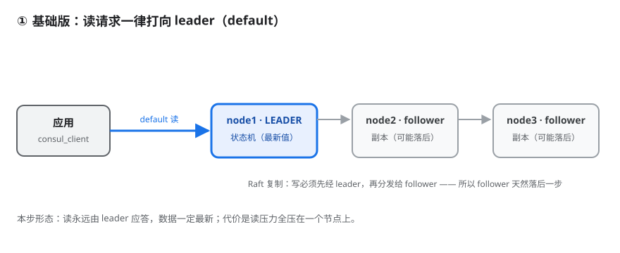
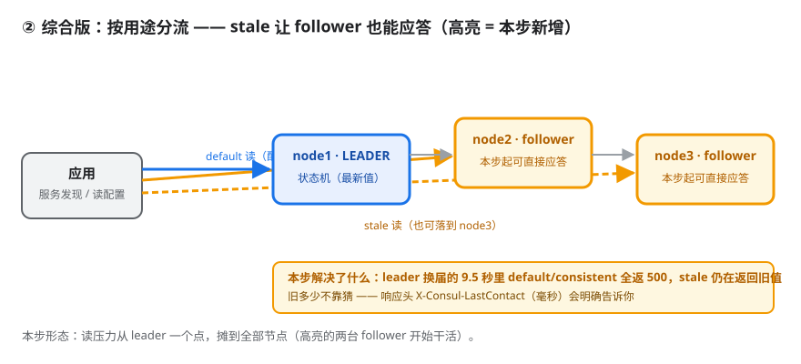
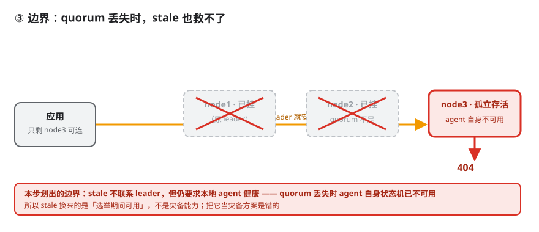

# 应用实战 · Raft 与 Gossip 一致性成色

> 对应课程：[第 5 课：Raft 与 Gossip 一致性成色](../../stages/2-核心能力拆解/lessons/lesson-05-Raft与Gossip一致性成色.md) ｜ 覆盖知识点：三种读模式、Raft quorum 与选举窗口、stale 作为降级通道的边界
> 定位：**会用，不上生产**——课里学完，在这里动手。
> 📖 结论已按官方文档核对（核对于 2026-09 ｜ 来源：[Consul Consistency Modes](https://developer.hashicorp.com/consul/docs/v1.20.x/api-docs/features)）

## 场景 1：读多写少，怎么把读压力从 leader 身上卸下来

**场景**：Consul 只有一个 leader 能应答强一致读。服务发现每秒几千次查询全打在 leader 上，leader CPU 先扛不住——需要把一部分读分流给 follower。

**全貌一句话**：完整方案还需要 agent 缓存、多 agent 地址配置、Enterprise 冗余区（非本课内容），本课不展开。

### ① 基础实现（能跑但幼稚）



> 看图：三个节点里只有 node1（LEADER）在应答读，node2 / node3 只接收 Raft 复制、不服务读——读压力集中在一个点上。

```python
def read_config(key):
    # 不加一致性参数 = default，请求会被转发给 leader
    with urllib.request.urlopen(f'http://127.0.0.1:8500/v1/kv/{key}') as r:
        return json.loads(r.read())[0]['Value']
```

> ⚠️ **它的问题**：① 读压力全压 leader——官方建议"尽可能把非 stale 读转成 stale 读"；② leader 换届时**明确失败**，实测强杀后约 **9.5 秒**窗口内 `default` / `consistent` **全部返回 500**；③ 联系不上 leader 要等多久取决于选举超时，给不出确定 SLA。

### ② 综合实现（被问题逼出来的下一步）



> 看图：高亮的两个 follower 本步开始直接应答读。服务发现走 stale（橙线），配置读取仍走 default（蓝线）。

```python
def kv_get(key, consistency):
    """consistency: 'default' | 'consistent' | 'stale'"""
    url = f'http://127.0.0.1:8500/v1/kv/{key}'
    if consistency == 'stale':      url += '?stale'
    elif consistency == 'consistent': url += '?consistent'
    with urllib.request.urlopen(url) as r:
        return json.loads(r.read())[0]['Value'], r.headers

instances, _ = kv_get('service/web', 'stale')      # 容忍旧值，换可用性
db_host,   _ = kv_get('config/db_host', 'default') # 必须准，且读频率低
```

**stale 旧多少不用猜**——响应头 `X-Consul-LastContact`（毫秒）会告诉你。实测持续写入时：`default` / `consistent` 恒为 `0`，`stale` 为 `15 / 30 / 45`。可直接接进监控。

**为什么不能全改 stale**：连续 10 次写入后立即读，stale **10/10 全部落后一个版本**——不是偶发，是机制决定的。

### ③ 边界：stale 不是灾备



> 看图：node1、node2 都挂掉后只剩 node3 孤立存活。stale 不联系 leader，但仍要求本地 agent 健康——此时 agent 自身已不可用，实测返回 **404**。

```text
写（PUT）-> 500   consistent -> 500   default -> 500   stale 读 -> 404
```

> ⚠️ **与官方文档的冲突（如实记录）**：官方文档称"即使集群不可用（没有 quorum），也可以响应查询"。本机 Consul 2.0.2 实测**未复现**——quorum 丢失时 stale 返回 404。差异可能来自客户端 agent 与 server 同进程的行为差异，本文按实测记录，不做与官方一致的断言。

所以 stale 换来的是**"选举期间可用"**，不是灾备能力。

> 🎯 **会用标志**：能按用途给不同接口选对读模式（服务发现 stale / 配置 default / 锁 consistent），并说清 stale 在 quorum 丢失时同样不可用。

---

## 📎 实测证据

本机 Consul 2.0.2 三节点集群实测（2026-09-17），脚本：[`read_modes.py`](read_modes.py)、[`leader_kill2.py`](leader_kill2.py)、[`quorum_loss.py`](quorum_loss.py)。

| 指标 | 实测值 |
|------|--------|
| 写后立即读 stale 落后 | 稳定 1 个版本（10/10 次） |
| stale 的 LastContact | 15–45ms（持续写入时） |
| leader 强杀后不可用窗口 | 约 9.5 秒（default/consistent 全 500） |
| quorum 丢失时 stale | 404（与官方文档不符，已如实标注） |

> 📌 **实测踩过的坑**：第一版脚本一直访问 8500，而被强杀的正是 node1（8500），导致三种模式全失败——那是"连不上 agent"，不是"读模式差异"。**必须从存活节点读**（修正版 `leader_kill2.py`）。

**边界**：单机三节点均绑 `127.0.0.1`，分区靠杀进程模拟；9.5 秒是默认 `raft_multiplier` 下结果；`consistent` 与 `default` 本次表现一致（差异在"旧 leader 被隔离"场景，未构造）；Gossip 两层池未实测。

## 🧭 导航

- ⬅️ 回到课程：[第 5 课：Raft 与 Gossip 一致性成色](../../stages/2-核心能力拆解/lessons/lesson-05-Raft与Gossip一致性成色.md) ｜ 📚 [应用实战索引](../../应用实战/INDEX.md)
- ➡️ 下一课实战：[07 · 多数据中心与服务网格](../实战B-Connect最小闭环/README.md)
