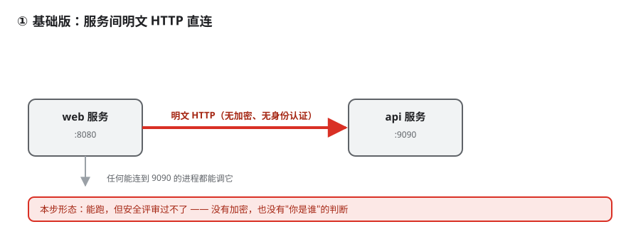
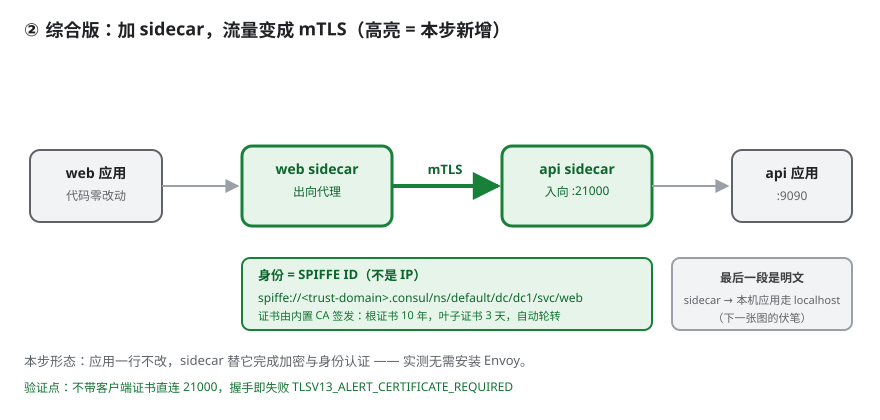
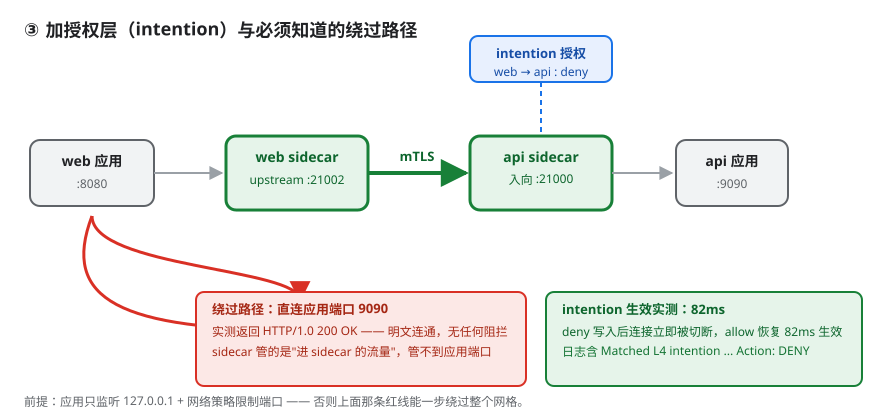

# 应用实战 · 多数据中心与服务网格

> 对应课程：[第 7 课：多数据中心与服务网格](../../stages/2-核心能力拆解/lessons/lesson-07-多数据中心与服务网格.md) ｜ 覆盖知识点：Connect sidecar 注册、mTLS 数据面、intention 授权、SPIFFE 身份、网格可绕过的边界
> 定位：**会用，不上生产**——课里学完，在这里动手。
> 📖 结论已按官方文档核对（核对于 2026-09 ｜ 来源：[Consul Connect](https://developer.hashicorp.com/consul/docs/connect)）

## 场景 1：服务间流量要加密 + 身份认证，但应用不想改代码

**场景**：服务之间是明文 HTTP。安全评审要求加密与身份认证，但给每个服务自己接 TLS 意味着自建 CA、签发证书、写轮转逻辑——每加一个服务重来一遍。

**全貌一句话**：完整方案还需要 Envoy（七层能力）、consul-dataplane、可观测性埋点（非本课内容），本课不展开。

### ① 基础实现（能跑但幼稚）



> 看图：web 直连 api 的 9090，链路上没有加密，也没有"你是谁"的判断。

```python
resp = requests.get('http://127.0.0.1:9090/')   # 明文，谁都能调
```

> ⚠️ **它的问题**：① 流量明文，抓包即可读；② 无身份认证，只能靠 IP 白名单，而 IP 会变、可伪造；③ 自己接 TLS 则每个服务都要写一遍。

### ② 改进实现：加 sidecar，流量变 mTLS

先破除一个误解：**不装 Envoy 也能跑**。本机实测 `envoy` 与 `consul-dataplane` 均 NOT FOUND，但 Consul 自带内置代理（`consul connect proxy`）——功能比 Envoy 少（无七层路由、无灰度），**但能跑 mTLS**。

注册时挂上 sidecar 即可（真实文件：[`api.json`](api.json)、[`web.json`](web.json)）：

```json
// api.json：空对象 = 让 Consul 自动补 sidecar
"connect": { "sidecar_service": {} }

// web.json：声明 upstream，注意端口不能撞自己的 sidecar
"connect": { "sidecar_service": { "proxy": { "upstreams": [
  { "destination_name": "api", "local_bind_port": 21002 } ] } } }
```

注册后 sidecar 是 Consul 自动补的：`api-1-sidecar-proxy port=21000 kind=connect-proxy`（web 侧同理占 21001）。

> ⚠️ **它的问题**：upstream 端口撞车。第一版配成 `21001`（web 自己的 sidecar 端口），启动即失败——`bind: Only one usage of each socket address`。**sidecar 默认端口从 21000 起递增**，改成 `21002` 后正常。

### ③ 综合实现（加密 + 授权）



> 看图：两个高亮 sidecar 是本步新增——应用一行未改，加密与身份认证全由 sidecar 完成；中间是 mTLS，两侧仍是本机明文。

```powershell
consul connect proxy -sidecar-for api-1   # 入向
consul connect proxy -sidecar-for web-1   # 出向
python backend.py 9090 api                # api 真实后端
```

应用只把目标改成自己的 upstream 端口（拨本地分机号）：

```python
resp = requests.get('http://127.0.0.1:21002/')
# -> HTTP 200 {"service": "api", "path": "/", "message": "hello from api"}
```

**验证"加密"真的是加密**——不带客户端证书直连 21000，握手即失败：

```text
SSLError: [SSL: TLSV13_ALERT_CERTIFICATE_REQUIRED] tlsv13 alert certificate required
```

**身份不是 IP，是 SPIFFE ID**：`spiffe://<trust-domain>.consul/ns/default/dc/dc1/svc/web`。证书由内置 CA 签发：**根证书 10 年、叶子证书 3 天**（自动轮转）——根长期因为换根成本高，叶子短期因为泄露影响小。

加密够了还缺"谁可以调谁"——加 intention（`intention-deny.json`）：

```json
{ "Kind": "service-intentions", "Name": "api",
  "Sources": [ { "Name": "web", "Action": "deny" } ] }
```

`consul config write intention-deny.json` 后连接立刻被切断，日志写明原因：`Matched L4 intention: default/web => default/api (Precedence: 9, Action: DENY)`。改回 allow 后 **82ms 恢复**。

### ④ 边界：绕过 sidecar 是明文



> 看图：上方蓝框是新增的授权层；下方红色路径绕过 sidecar 直连 9090——这一段不受任何保护。

```text
直连 127.0.0.1:9090（绕过 sidecar） -> HTTP/1.0 200 OK（明文，无任何阻拦）
```

Connect 管的是"进 sidecar 的流量"，管不到"直达应用端口的流量"。保护生效依赖：① 应用只监听 `127.0.0.1`；② 网络策略限制端口；③ 容器下 sidecar 与应用同 Pod。**应用监听 `0.0.0.0` 又无网络策略时，一步即可绕过 mTLS——网格等于白建。**

> 🎯 **会用标志**：能在不装 Envoy 的前提下跑通"注册 sidecar → 启动代理 → upstream 访问 → intention 切断"闭环，并指出"应用监听 0.0.0.0 时网格可被绕过"。

---

## 📎 实测证据

本机 Consul 2.0.2（dev）实测（2026-09-17），文件：[`api.json`](api.json)、[`web.json`](web.json)、[`backend.py`](backend.py)、[`intention-deny.json`](intention-deny.json)。

| 指标 | 实测值 |
|------|--------|
| mTLS 数据面 | HTTP 200，全程未装 Envoy |
| 无证书访问 | `TLSV13_ALERT_CERTIFICATE_REQUIRED` |
| 绕过 sidecar 直连 9090 | HTTP/1.0 200 OK（明文） |
| intention deny → allow 恢复 | 82ms |

> 📌 **与课 7 的冲突（如实记录）**：课 7 曾记录"删除 intention 后 11 分钟仍返回已删意图"。本次**未复现**，deny 与 allow 均秒级生效。差异可能来自本次用 `consul config write`（配置条目）而课 7 用旧版 API，或版本行为变化。本文按实测记录。

**边界**：未装 Envoy，七层能力未实测；内置代理多节点行为未实测；`consul-dataplane` 未安装；证书轮转过程未实测。

## 🧭 导航

- ⬅️ 回到课程：[第 7 课：多数据中心与服务网格](../../stages/2-核心能力拆解/lessons/lesson-07-多数据中心与服务网格.md) ｜ 📚 [应用实战索引](../../应用实战/INDEX.md)
- ➡️ 下一课实战：[08 · ACL 与安全模型](../实战C-ACL生产权限模型/README.md)
