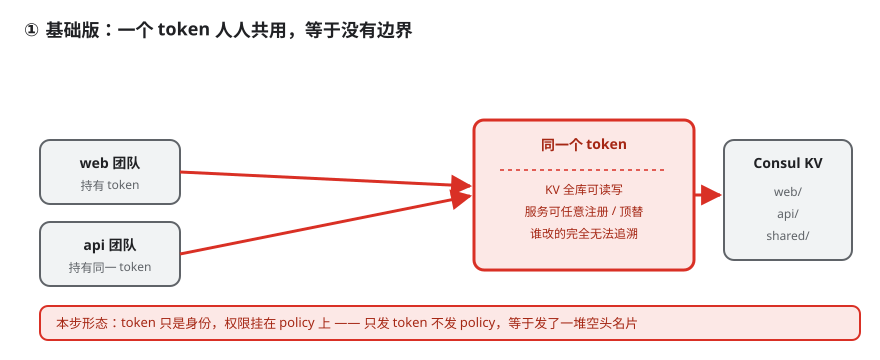
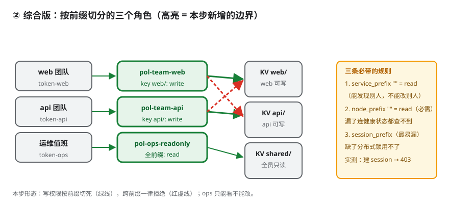
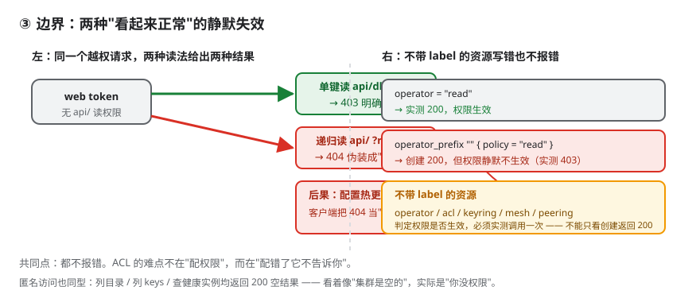

# 应用实战 · ACL 与安全模型

> 对应课程：[第 8 课：ACL 与安全模型](../../stages/2-核心能力拆解/lessons/lesson-08-ACL与安全模型.md) ｜ 覆盖知识点：ACL 三层模型（token / policy / rule）、默认策略与匿名 token、权限矩阵验证、静默失效的两种形态
> 定位：**会用，不上生产**——课里学完，在这里动手（结构与边界见 SKILL.md「教学叙事骨架 · 应用实战」）。
> 📖 结论已按官方文档核对（核对于 2026-09 ｜ 来源：[Consul ACL Rules](https://developer.hashicorp.com/consul/docs/reference/acl/rule)）

---

## 场景 1：三个团队共用一套 Consul，怎么做到"我的东西只有我能改"

**场景**：web / api / 数据三个团队共用一个集群，配置都往同一个 KV 里写，服务注册也没人管权限——因为当初图省事没开 ACL。某天 api 的连接串被改到了测试机，查日志发现改它的请求来自 web 团队一个服务的 IP：有人在调试时手滑写错了前缀。**没有权限边界，任何能连上 8500 的人都能改任何 key。**

**全貌一句话**：完整方案还需要 ACL 复制（多数据中心）、token 轮转机制、企业版 namespace / admin partition（非本课内容），本课不展开。

### ① 基础实现（能跑但幼稚）



> 看图：三个团队共用一个 token，它对 KV 全库可读写、可任意注册或顶替服务——谁改的完全无法追溯。

第一反应是"给每个团队发一个 token"：

```json
{ "Description": "web", "Policies": [] }
```

### ⚠️ 它的问题

1. **token 本身不携带权限**——token 只是身份，权限挂在 **policy** 上，token 通过关联 policy 获得权限。只发 token 不发 policy，等于发了一堆空头名片。
2. **`default_policy` 不设成 `deny`，ACL 等于没开**——默认是 `allow` 时，没带 token 的请求照样通行，精心配的 policy 只约束了"带了 token 的人"。
3. **配错了不报错**——下面这条规则，创建 policy 返回 200、创建 token 返回 200，一切看起来都好：

```hcl
operator_prefix "" {
  policy = "read"
}
```

然后拿这个 token 去读 `/v1/operator/raft/configuration`：

```text
403 Permission denied: ... lacks permission 'operator:read'
```

**规则写错了，Consul 不告诉你，只是静默地不生效。** 正确写法是 `operator = "read"`——因为 `operator` 这个资源**不带 label**。

### ② 综合实现（被问题逼出来的下一步）



> 看图：三个角色各持一个 token、各绑一个 policy（高亮部分即本步新增的边界）。绿线是允许的写入，红虚线是跨前缀被拒——写权限按前缀切死，ops 只能看不能改。

**第一步：起一个默认拒绝的环境**（同目录 [`acl-lab.hcl`](acl-lab.hcl)）：

```hcl
acl = {
  enabled        = true
  default_policy = "deny"
  enable_token_persistence = true
}
```

```powershell
consul agent -dev -config-file=acl-lab.hcl
curl -X PUT http://127.0.0.1:8500/v1/acl/bootstrap   # 取回管理 token，只能做一次
```

**第二步：按前缀切分策略**（`policies/pol-team-web.hcl`，真实文件在 [`policies/`](policies/)）：

```hcl
key_prefix "web/" { policy = "write" }     # 只给自己前缀写权限
key_prefix "shared/" { policy = "read" }   # 公共配置只读

service_prefix "web" { policy = "write" }  # 能注册自己的服务
service_prefix ""    { policy = "read" }   # 能"发现"别人，不能"改"别人

node_prefix "" { policy = "read" }         # 必需：看不到节点就查不到健康检查结果
```

**第三步：建 policy 与 token**：

```powershell
curl -X PUT http://127.0.0.1:8500/v1/acl/policy `
  -H "X-Consul-Token: <管理token>" `
  -d "{""Name"":""pol-team-web"",""Rules"":""<HCL内容>""}"

curl -X PUT http://127.0.0.1:8500/v1/acl/token `
  -H "X-Consul-Token: <管理token>" `
  -d "{""Description"":""web"",""Policies"":[{""ID"":""<policy-id>""}]}"
```

**三条必带规则**（右图高亮，都是实测踩出来的）：

| 规则 | 为什么必需 | 漏了的后果 |
|------|-----------|-----------|
| `service_prefix "" = read` | 服务发现要靠它 | 只能看见自己的服务 |
| `node_prefix "" = read` | 健康检查结果挂在节点上 | 查不到任何健康实例 |
| `session_prefix` | session + KV 锁的前提 | **建 session 403，分布式锁用不了**（最易漏） |

**验证——21 项权限矩阵全实测**（节选，每个动作真发一次 HTTP 请求）：

| 动作 | web token | api token | ops token | 匿名 |
|------|-----------|-----------|-----------|------|
| 写 `web/db_host` | **200** | 403 | 403 | 403 |
| 写 `api/db_host` | 403 | **200** | 403 | 403 |
| 读 `web/db_host` | 200 | 403 | **200** | 403 |
| 递归读 `api/` | **404** ⚠️ | 200 | 200 | — |
| 注册名为 `api` 的服务 | **403** | 200 | 403 | 403 |
| 建 session | **403** | — | — | 403 |
| 读 raft 配置 | 403 | — | **200** | 403 |
| 列服务目录 | 200 | 200 | 200 | **`{}`** ⚠️ |

### ③ 必须知道的边界：两种"看起来正常"的静默失效



> 看图：左半是同一个越权请求的两种读法——单键读返回 403（明确拒绝），递归读返回 404（伪装成"没数据"）；右半是不带 label 的资源，写错形式也不报错。两者共同点是：**都不报错**。

**形态一：递归读越权返回 404，不是 403**

```text
web 单键读 api/db_host         -> 403  （明确：没权限）
web 递归读 api/ ?recurse=true  -> 404  （看起来：没数据）
```

`api/db_host` 明明存在（ops 用同样方式读返回 200）。**同一个权限问题，两种读法给出两种表现。**

后果很实际。配置热更新的标准做法是阻塞查询：

```python
try:
    result = kv_get('api/', recurse=True, index=last_index, wait='5m')
except ConsulError as e:
    if e.status == 404:
        return {}   # 前缀不存在 = 还没有配置，属正常初始状态
    raise
```

于是"没权限"被当成"还没配"，**配置热更新静默失效，而且没有任何报错**——服务一直用启动时的旧配置跑下去。

**形态二：匿名访问返回 200 空结果**

```text
匿名列服务目录 -> 200 {}      匿名列 keys -> 200 []      匿名查健康实例 -> 200 []
```

这三个 `200` 最容易骗人：看起来像"集群里没数据"，实际是"你没权限看"。比报错更糟，因为它不会触发任何告警。

**形态三：不带 label 的资源写法**

| 类型 | 写法 | 资源 |
|------|------|------|
| 带 label | `xxx_prefix "前缀" { policy = "..." }` | `key`、`node`、`service`、`session`、`agent`、`event`、`query` |
| 不带 label | `xxx = "read"` | `operator`、`acl`、`keyring`、`mesh`、`peering` |

顺带确认：**`write` 在带 label 的资源上隐含 `read`**（`key:write` 能读回自己写的键，实测 200），但在 `operator` 这类上**不隐含**（实测 403）。

### 🎯 会用标志

能为多团队场景写出按前缀切分的最小权限策略（含 `node_prefix` 与 `session_prefix`），并在 token 创建返回 200 后，**用一次真实调用验证权限是否真的生效**——而不是只看创建成功。

---

## 📎 实测记录与证据

本篇所有状态码均来自本机 Consul 2.0.2（dev + ACL）真跑（2026-09-17），自动化脚本在同目录下：[`setup_and_verify.py`](setup_and_verify.py)、[`acl-lab.hcl`](acl-lab.hcl)、[`policies/`](policies/)。

| 检查项 | 实测证据 |
|--------|---------|
| `default_policy = "deny"` 已生效 | 匿名注册服务 403 |
| 每团队只有自己的写权限 | web 写 `api/` 403 |
| 值班账号不能改业务数据 | ops 写 `web/` 403 |
| 不带 label 资源写法正确 | `operator = "read"` → 200；`operator_prefix ""` → 403 |
| 需要锁的服务补了 `session_prefix` | 未补 → 建 session 403 |
| 热更新链路验证过（不只看 200） | 越权递归读 404，会静默失效 |

**已知边界**：本次跑在 dev 单节点，多节点场景需要 ACL 复制（`/v1/acl/replication`），未涉及；`down_policy = "extend-cache"` 的实际行为未实测，仅按官方文档写入注释；企业版 namespace / admin partition 未提供（本机社区版）；token 撤销后的生效时延未实测。

---

## 🧭 导航

- ⬅️ 回到课程：[第 8 课：ACL 与安全模型](../../stages/2-核心能力拆解/lessons/lesson-08-ACL与安全模型.md)
- 📚 全部实战：[应用实战索引](../../应用实战/INDEX.md)
- ➡️ 相关排障：[09-排障速查手册](../../09-排障速查手册.md) 症状 10「ACL 静默失败」
