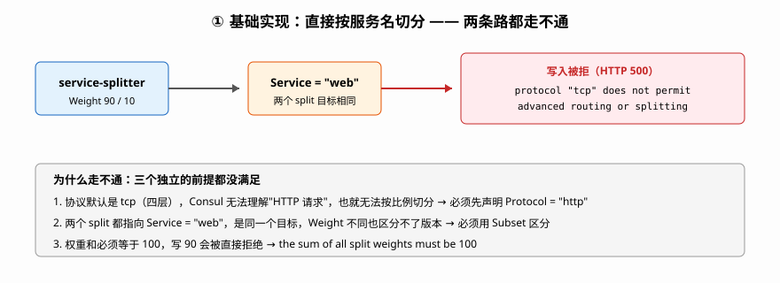
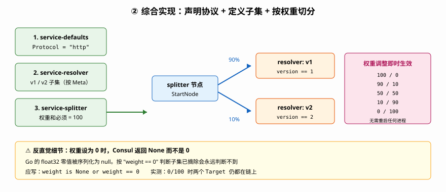
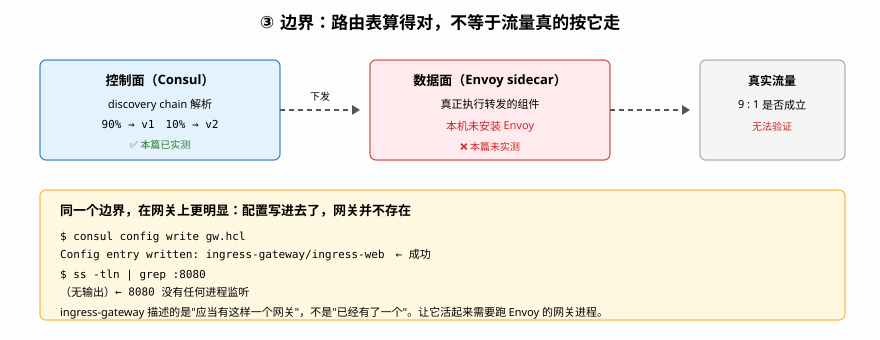

# 应用实战 · 多数据中心与服务网格（流量切分篇）

> 配套 [课 7 多数据中心与服务网格](../../stages/2-核心能力拆解/lessons/lesson-07-多数据中心与服务网格.md)
> 实测环境：本机 WSL / Consul 2.0.2，**纯控制面（未启用 Envoy 数据面）**
> ⚠️ 本篇边界已由 [实战 E 北向网关与真实数据面](../实战E-北向网关与真实数据面/README.md) 兑现：Envoy 已通过 Docker 跑通，真实分流实测成功
> 判定依据：[应用实战篇-逐课判定.md](../../应用实战篇-逐课判定.md)

## 场景 1：新版服务要上线，怎么先放 10% 流量进去试

你要发布 `web` 的 v2 版本。直接全量切有风险，希望先放 10% 流量到 v2，观察没问题再逐步放大到 100%。

这就是**灰度发布**。Consul 里做这件事的组件叫 **discovery chain**（解析链）——它不转发流量，只**告诉数据面"这一跳该往哪走"**。

### ① 基础实现（能跑但幼稚）

最直觉的做法：注册两个实例，然后写 `service-splitter` 按比例切分。

```bash
# 注册 v1 / v2 两个实例（用 Meta.version 区分版本）
curl -s -X PUT http://127.0.0.1:8500/v1/agent/service/register -d '{
  "Name":"web","ID":"web-v1","Port":8081,"Meta":{"version":"1"} }'
curl -s -X PUT http://127.0.0.1:8500/v1/agent/service/register -d '{
  "Name":"web","ID":"web-v2","Port":8082,"Meta":{"version":"2"} }'

# 按 9:1 切分
cat > splitter.hcl <<'EOF'
Kind = "service-splitter"
Name = "web"
Splits = [
  { Weight = 90, Service = "web" },
  { Weight = 10, Service = "web" },
]
EOF
consul config write splitter.hcl
```



直接失败：

```
Error writing config entry service-splitter/web:
  Unexpected response code: 500 (discovery chain "web" uses a protocol "tcp"
  that does not permit advanced routing or splitting behavior)
```

**两个问题同时暴露**：

1. **协议不对**。服务默认协议是 `tcp`，而 tcp 是四层，Consul 不知道什么是"HTTP 请求"，也就没法按比例切。必须先声明 `http`。
2. **两个 split 指向同一个服务**，`Weight` 再不同也区分不了版本——`web` 和 `web` 是同一个目标。要区分版本得用**子集（subset）**。

### ② 综合实现（被问题逼出来的下一步）

补两件事：声明协议、定义子集。

```bash
# 1. 声明协议为 http（关键前提）
cat > defaults.hcl <<'EOF'
Kind = "service-defaults"
Name = "web"
Protocol = "http"
EOF
consul config write defaults.hcl

# 2. 用 ServiceResolver 按 Meta.version 切出子集
cat > resolver.hcl <<'EOF'
Kind = "service-resolver"
Name = "web"
Subsets = {
  "v1" = { Filter = "Service.Meta.version == 1" }
  "v2" = { Filter = "Service.Meta.version == 2" }
}
EOF
consul config write resolver.hcl

# 3. 按子集切分（权重和必须 = 100）
cat > splitter.hcl <<'EOF'
Kind = "service-splitter"
Name = "web"
Splits = [
  { Weight = 90, ServiceSubset = "v1" },
  { Weight = 10, ServiceSubset = "v2" },
]
EOF
consul config write splitter.hcl   # → Config entry written: service-splitter/web
```



解析链立刻改变，`consul config write` 返回后**无需重启任何进程**：

```bash
curl -s http://127.0.0.1:8500/v1/discovery-chain/web
```

```
StartNode: splitter:web.default.default
  splits:
    90 % -> resolver:v1.web.default.default.dc1
    10 % -> resolver:v2.web.default.default.dc1
Targets:
  v1.web.default.default.dc1  (Filter: Service.Meta.version == 1)
  v2.web.default.default.dc1  (Filter: Service.Meta.version == 2)
```

放大灰度只需改一次权重，实测 100/0 → 90/10 → 50/50 → 10/90 → 0/100 全部即时生效：

```
设为 100/  0: 100 % -> v1    |  None % -> v2
设为  90/ 10:  90 % -> v1    |   10 % -> v2
设为  50/ 50:  50 % -> v1    |   50 % -> v2
设为  10/ 90:  10 % -> v1    |   90 % -> v2
设为   0/100:  None % -> v1  |  100 % -> v2
```

> ⚠️ **一个反直觉细节**：权重设为 0 时，Consul 返回的是 `None` 而不是 `0`。这是 Go 的 `float32` 零值被序列化成 `null` 的表现。如果你的监控或脚本按"权重 == 0"判断"该子集已摘除"，会**永远判断不到**——要用 `weight is None or weight == 0`。

### ③ 边界：控制面算得对，不等于流量真的按这个走

这是本篇最该记住的一条。

**discovery chain 只是"路由表"，不是"路由器"。** 上面所有实测都在控制面完成：Consul 算出了正确的切分比例，但**没有任何流量真的被切分**——因为实际转发由 Envoy sidecar 执行，而本机没装 Envoy。

同一个边界在网关上更明显。网关配置**能被控制面接受**：

```bash
cat > gw.hcl <<'EOF'
Kind = "ingress-gateway"
Name = "ingress-web"
Listeners = [
  { Port = 8080, Protocol = "http", Services = [ { Name = "web" } ] },
]
EOF
consul config write gw.hcl   # → Config entry written: ingress-gateway/ingress-web
```

但你去看 8080 端口：

```bash
ss -tln | grep :8080
# → 无输出。8080 根本没有进程监听
```



**配置写进去了，网关并不存在。** 这三个字是理解 Consul 网关的关键——`ingress-gateway` 配置条目描述的是"**应当**有一个这样的网关"，而不是"**已经**有了一个"。真正让它活起来需要一个跑 Envoy 的网关进程。

所以本课的边界要讲清楚：**本篇实测能证明"路由规则算得对"，不能证明"流量真的按规则走"**。后者必须上 Envoy——本篇到此为止，**继续看 [实战 E](../实战E-北向网关与真实数据面/README.md)**，那里把 Envoy 真跑起来，兑现了这条边界。

### 🎯 会用标志

做到以下四件事，说明你真的会用这套东西了：

1. 能在不查文档的情况下说出：写 `service-splitter` 之前必须先做什么（答：给服务声明 `Protocol = "http"`）
2. 看到 `the sum of all split weights must be 100` 报错，知道是权重和算错了，而不是配置格式错
3. 能解释"Consul 里配好了灰度但流量没变"最可能的原因（答：没有数据面执行者——缺 Envoy sidecar）
4. 能说清 `ingress-gateway` 配置写入成功 ≠ 网关在运行

## 📎 实测证据

全部为 2026-09-21 本机 Consul 2.0.2（WSL）实测，`consul agent -dev` 模式。

| # | 验证项 | 命令 | 实测结果 |
|---|--------|------|----------|
| 1 | 未声明协议时的默认 chain | `curl /v1/discovery-chain/web` | `Protocol: tcp`，`StartNode: resolver:...`，`Default: True` |
| 2 | tcp 下写 splitter | `consul config write` | ❌ 500 `protocol "tcp" that does not permit advanced routing or splitting behavior` |
| 3 | 声明 http 后同一配置 | 同上 | ❌ 500（换成 `inconsistent protocols`，因 split 目标 `other` 仍是 tcp）→ 见 #7 |
| 4 | 声明 `service-defaults` http | `consul config write` | ✅ `Protocol: http`，`Default: True` |
| 5 | 权重和 = 90 | `consul config write` | ❌ 500 `the sum of all split weights must be 100, not 90.000000` |
| 6 | 权重和 = 100（90/10） | `consul config write` | ✅ `service-splitter/web` |
| 7 | 协议一致性 | split 目标含 tcp 服务 | ❌ 500 `service "other" has "tcp" which is not "http"` |
| 8 | 权重演进 | 100/0→90/10→50/50→10/90→0/100 | ✅ 全部即时生效，`StartNode` 恒为 `splitter:web...` |
| 9 | 权重 0 的返回值 | `discovery-chain` | ⚠️ 返回 `None`（非 `0`），两个 Target 仍在链上 |
| 10 | 切到不存在的子集 v9 | `consul config write` | ✅ **写入成功**，chain 出现 `v9.web...` Target（不校验子集非空） |
| 11 | ServiceRouter 路径路由 | `consul config write` | ✅ `StartNode` 变为 `router:web...`，与 splitter 共存 |
| 12 | IngressGateway 写入 | `consul config write` | ✅ `ingress-gateway/ingress-web` |
| 13 | TerminatingGateway 写入 | `consul config write` | ✅ `terminating-gateway/term-external` |
| 14 | 网关端口是否监听 | `ss -tln \| grep :8080` | ❌ 未监听——配置存在但无进程 |
| 15 | 网关关联不存在服务 | `consul config write` | ❌ 500 `service "no-such-service" has protocol "tcp", which does not match defined listener protocol "http"` |
| 16 | 网关协议冲突（legacy tcp） | `consul config write` | ❌ 500 同上，listener `http` vs service `tcp` |
| 17 | 删除 splitter/router | `consul config delete` | ✅ chain 回到 `resolver:...`，`Default: None` |

## 仍存在的已知边界

以下内容**本篇未实测**，不以确定语气陈述：

- ~~**真实流量切分比例**：需 Envoy sidecar 才能验证 90/10 是否真的是 9:1（本篇只验证了控制面算出的权重）~~ → **已由 E 篇兑现**：实测 50/50 = V1:16/V2:14，90/10 = V1:22/V2:8
- ~~**网关数据面行为**：IngressGateway 的真实转发、TLS 终止、超时重试，全部依赖 Envoy~~ → **真实转发已由 E 篇兑现**（TLS 终止与超时重试仍未测）
- **Envoy 版本与 Consul 的兼容矩阵**：见主线课 11 缺口 #5
- **跨 DC 的灰度**：联邦环境下子集与 split 的行为未测（本篇为单 DC dev 模式）

## 🧭 导航

- 配套课：[课 7 多数据中心与服务网格](../../stages/2-核心能力拆解/lessons/lesson-07-多数据中心与服务网格.md)
- 相关课：[课 4 服务发现与健康检查](../../stages/2-核心能力拆解/lessons/lesson-04-服务发现与健康检查机制.md)（prepared query）｜[课 12 选型决策框架](../../stages/4-决策落地/lessons/lesson-12-选型决策框架与场景结论.md)（CRD 全景）
- 一键索引：[应用实战 INDEX](../../应用实战/INDEX.md)

---

← 返回 [02-课程目录.md](../../02-课程目录.md)
