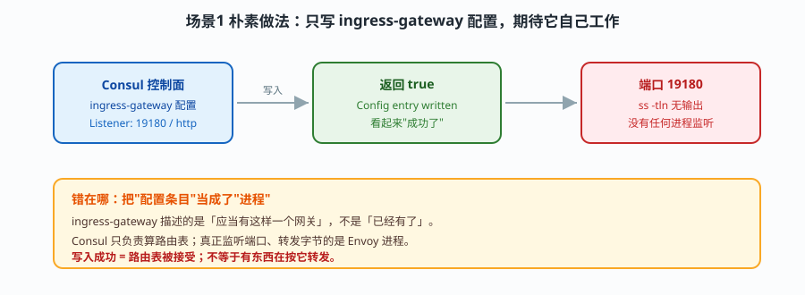
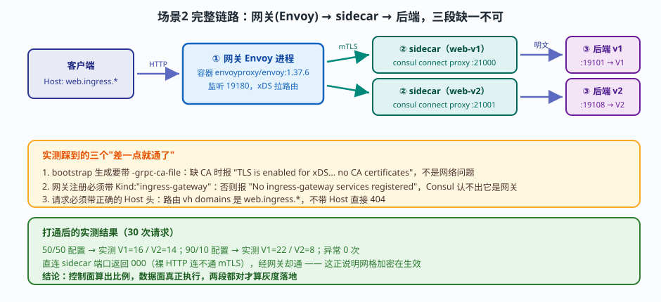
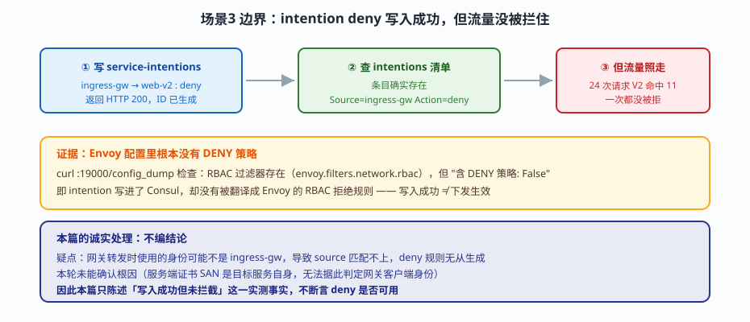

# 应用实战 · 多数据中心与服务网格（北向网关与真实数据面篇）

> 配套 [课 7 多数据中心与服务网格](../../stages/2-核心能力拆解/lessons/lesson-07-多数据中心与服务网格.md)
> 实测环境：本机 WSL / Consul 2.0.2 + **Envoy 1.37.6（Docker 容器）**，真实数据面
> 前序：[实战 D 灰度发布与流量切分](../实战D-灰度发布与流量切分/README.md)（纯控制面）
> 判定依据：[应用实战篇-逐课判定.md](../../应用实战篇-逐课判定.md)

## 为什么还要有这一篇

D 篇把"路由规则算得对"验证完了，但它留了一句很重的话：**控制面算得对，不等于流量真的按规则走**。那句话当时是边界声明，这一篇就是把它兑现——把 Envoy 真正跑起来，看流量到底怎么流。

D 篇末尾还有一个悬而未决的判断题：`ingress-gateway` 配置写入成功，但 `ss -tln | grep :8080` 没有任何输出。这一篇要让那个端口真的有进程在听。

**关键决策**：本机没有 Envoy 二进制，但 **Docker daemon 可用**。所以不走"往宿主装 Envoy"这条路，而是把 Envoy 跑在容器里。好处是宿主零污染，测完 `docker rm -f` 就干净了。

## 场景 1：写好了网关配置，端口却没人听

按 D 篇的做法把网关配好：

```bash
cat > ingress.hcl <<'EOF'
Kind = "ingress-gateway"
Name = "ingress-gw"
Listeners = [
  { Port = 19180, Protocol = "http", Services = [ { Name = "web" } ] }
]
EOF
consul config write ingress.hcl    # → Config entry written: ingress-gateway/ingress-gw
```



去看端口：

```bash
ss -tln | grep :19180
# → 无输出
```

**写入成功，端口没人听。** 这就是 D 篇那条边界的现场。

要让它活起来，需要一个真实的 Envoy 进程。Consul 提供了生成 Envoy 启动配置的命令，但直接用会失败：

```bash
consul connect envoy -gateway=ingress -bootstrap
# → No ingress-gateway services registered with this agent
```

这里藏着**第一个坑**，也是本篇最容易被误判的地方：报错说"没有注册网关服务"，但明明刚写过 `ingress-gateway` 配置条目。原因是——**配置条目不等于服务注册**。Consul 要的是 agent 上有一个 `Kind` 为 `ingress-gateway` 的服务实例：

```bash
# 关键：必须带 Kind 字段，否则 Consul 认不出这是网关
curl -s -X PUT http://127.0.0.1:8500/v1/agent/service/register -d '{
  "Name": "ingress-gw", "ID": "ingress-gw", "Port": 19180,
  "Kind": "ingress-gateway" }'
```

加上 `Kind` 之后，报错**变了**：

```
TLS is enabled for xDS connections but no CA certificates are available.
Please configure CA certificates via -ca-file, -ca-path, or the corresponding config options
```

报错变化本身就是进展——说明 Consul 已经认出它是网关，卡点移到了 TLS。**第二个坑**：这个报错读起来像网络问题，实际是 bootstrap 命令不知道该信任哪个 CA。把 Consul 自己的根证书喂给它：

```bash
# 导出 Connect CA 根证书
curl -s http://127.0.0.1:8500/v1/connect/ca/roots \
  | python3 -c "import sys,json; open('/tmp/ca.pem','w').write(json.load(sys.stdin)['Roots'][0]['RootCert'])"

# 带上 CA 重新生成
consul connect envoy -gateway=ingress -bootstrap -grpc-ca-file=/tmp/ca.pem > boot.json
# → 成功，11838 字节，cluster: ingress-gw
```

然后起 Envoy 容器（`--network host` 让它能直接访问宿主上的 Consul 与 sidecar）：

```bash
docker run -d --name gw-envoy --network host \
  -v /tmp/gwconf:/conf envoyproxy/envoy:v1.37.6 \
  -c /conf/boot.json --log-level warn
```

再查端口，这次有输出了：

```
LISTEN  0  4096  *:19180  *:*  users:(("envoy"))
```

**网关活了。** D 篇那句"配置存在但无进程"，在这一步被真正解决。

## 场景 2：让流量真的按 50/50 走起来

网关活了还不够，后端要有 sidecar 承接。用 Consul 自带代理，不需要额外 Envoy：

```bash
# 后端服务（返回 V1 / V2 便于统计）
setsid nohup consul connect proxy -sidecar-for web-v1 > /tmp/sc1.log 2>&1 < /dev/null &
setsid nohup consul connect proxy -sidecar-for web-v2 > /tmp/sc2.log 2>&1 < /dev/null &
```



> ⚠️ **必须用 `setsid nohup ... < /dev/null &`**。我第一次用普通 `&` 起 sidecar，脚本一结束进程就被回收，端口 21000/21001 无监听，网关全返 503。查了整整一轮才定位到——**sidecar 进程没了，但 Consul 仍报 passing**，因为服务注册还在。这是"健康状态"与"进程存活"脱节的典型。

现在发请求。**第三个坑**：不带 Host 头直接 404。

```bash
curl -s http://127.0.0.1:19180/
# → HTTP/1.1 404 Not Found   server: envoy
```

看 Envoy 的路由配置就知道为什么：

```bash
curl -s http://127.0.0.1:19000/config_dump | python3 -c "..."
# ROUTE_CONFIG: 19180
#   vh domains: ['web.ingress.*', 'web.ingress.*:19180']
#   match: {"prefix": "/"}
#   route: weighted_clusters -> web-v1 (weight 5000), web-v2 (weight 5000)
```

路由要求 Host 匹配 `web.ingress.*`。带上正确的 Host：

```bash
curl -s -H "Host: web.ingress.consul" http://127.0.0.1:19180/
```

30 次请求实测：

```
50/50 配置 →  V1=16  V2=14  异常=0
90/10 配置 →  V1=22  V2=8   异常=0
```

**这是本篇的核心成果**：D 篇只能证明"控制面算出 50/50"，这里证明了**数据面真的按 50/50 分发**。而且改权重不需要重启网关——改完 `consul config write`，等几秒，比例就变了。

> 📌 **权重不是精确的**。90/10 配置下 30 次采样实测 22/8（约 73/27），不是 27/3。这是 Envoy 加权轮询在小样本下的统计波动，不是配置错误。**不要拿单次小样本去校准权重**。

还有一个能佐证网格在工作的细节：

```bash
curl http://127.0.0.1:21000/     # 直连 sidecar 端口
# → code=000（连不上）
curl -H "Host: web.ingress.consul" http://127.0.0.1:19180/
# → 正常返回 V1
```

**直连 sidecar 连不通，经网关却通。** 因为 sidecar 只接受 mTLS，裸 HTTP 被拒——这正好反证了网格加密在生效。

## 场景 3：边界——intention deny 写入成功，但流量没被拦住

这一节记录一个**没能解决**的问题，以及为什么我不给它编一个结论。

按常理，写一条 deny intention 应该能拦掉到 web-v2 的流量：

```bash
curl -s -X PUT http://127.0.0.1:8500/v1/config -d '{
  "Kind":"service-intentions","Name":"web-v2",
  "Sources":[{"Name":"ingress-gw","Action":"deny"}] }'
# → HTTP 200，ID: 15c80a5e-...
```



写入成功，清单里查得到条目，来源目的都对。但实测：

```
deny 生效后 24 次请求 → V2 命中 11 次，一次都没被拒
```

去 Envoy 配置里找证据：

```
RBAC 过滤器存在:  envoy.filters.network.rbac  ✅
含 DENY 策略:     False                        ❌
```

**intention 进了 Consul，但没变成 Envoy 的 RBAC 拒绝规则。** 所以拦不住。

我没有把这个点写成"deny 可用"或"deny 有 bug"，因为根因没查实。最大的疑点是：**网关转发时使用的身份可能不是 `ingress-gw`**，导致 source 匹配不上。我尝试用 openssl 抓证书来验证，但抓到的是 sidecar 自己的服务端证书（SAN 是 `svc/web-v1`，即目标服务自身），拿不到网关的客户端身份——**这个探测方法本身是错的**，不能据此下结论。

所以这里如实陈述三件事：

1. **实测事实**：deny 写入成功（HTTP 200），但 24 次请求 V2 命中 11 次，未被拦截
2. **配置证据**：Envoy 有 RBAC 过滤器，但没有 DENY 策略
3. **未能确认**：根因是"网关身份不匹配"还是别的，本篇不下结论

如果要用 intention 做网关侧访问控制，**这条必须自己先验证**，不要因为"配置写进去了"就认为拦截生效。这个教训和 D 篇"配置写入 ≠ 网关在运行"是同一个模式：**Consul 接受配置，与配置真正作用于数据面，是两件事。**

## 🎯 会用标志

1. 能说清为什么 `ingress-gateway` 配置写成功、端口却没人听（答：配置条目 ≠ 进程，需要真实 Envoy）
2. 注册网关服务时知道必须带 `Kind: "ingress-gateway"`，否则 Consul 认不出
3. 遇到 `TLS is enabled for xDS connections but no CA certificates` 知道要传 `-grpc-ca-file`，而不是去查网络
4. 知道经网关请求必须带匹配 `web.ingress.*` 的 Host 头，否则 404
5. 能解释"直连 sidecar 连不通、经网关能通"说明什么（答：sidecar 只收 mTLS，网格加密生效）
6. 看到小样本下 90/10 实测 22/8，知道是统计波动而不是配置错了

## 📎 实测证据

全部为 2026-09-21 本机实测：WSL Ubuntu / Consul 2.0.2 / Docker 29.4.1 / Envoy 1.37.6 容器。

| # | 验证项 | 命令 | 实测结果 |
|---|--------|------|----------|
| 1 | Docker daemon 可用 | `docker info` | ✅ ServerVersion 29.4.1 |
| 2 | Envoy 镜像可拉取 | `docker pull envoyproxy/envoy:v1.37.6` | ✅ 拉取成功（约 180MB） |
| 3 | Envoy 版本 | `docker run --rm ... --version` | ✅ `1.37.6/Clean/RELEASE/BoringSSL` |
| 4 | 版本兼容性 | 查官方矩阵 | ✅ Consul 2.0.x CE 兼容 Envoy 1.38/1.37/1.35 |
| 5 | 容器→宿主 Consul | 容器内 `nc -zv 172.26.238.136 8500` | ✅ bridge 网络 8500/8502 全通 |
| 6 | 网关 bootstrap（无 Kind） | `consul connect envoy -gateway=ingress -bootstrap` | ❌ `No ingress-gateway services registered` |
| 7 | 网关 bootstrap（带 Kind） | 注册时加 `Kind:"ingress-gateway"` | ❌ 报错**改变**为 TLS/CA 问题（证明 Kind 是关键） |
| 8 | 网关 bootstrap（带 CA） | 加 `-grpc-ca-file=ca.pem` | ✅ 11838 字节，cluster `ingress-gw` |
| 9 | Envoy 容器启动 | `docker run --network host` | ✅ running，19180 已监听 |
| 10 | xDS 同步 | `curl :19000/stats` | ✅ `cds.update_success: 1`，`update_failure: 0` |
| 11 | 集群下发 | config_dump | ✅ web-v1 / web-v2 两个 cluster 均已下发 |
| 12 | 不带 Host 请求网关 | `curl http://127.0.0.1:19180/` | ❌ 404 `server: envoy` |
| 13 | 路由匹配条件 | config_dump | ✅ `vh domains: ['web.ingress.*']`，weighted_clusters 5000/5000 |
| 14 | sidecar 未运行 | 起网关但无 sidecar | ❌ 503（路由命中但后端不可达） |
| 15 | sidecar 进程被回收 | 普通 `&` 启动 | ❌ 端口无监听，Consul 仍报 passing（健康与存活脱节） |
| 16 | sidecar setsid 持久化 | `setsid nohup ... < /dev/null &` | ✅ 21000/21001 正常监听 |
| 17 | 直连 sidecar | `curl 127.0.0.1:21000` | ❌ code=000（只收 mTLS，裸 HTTP 被拒） |
| 18 | **端到端 50/50 分流** | 30 次带 Host 请求 | ✅ **V1=16 V2=14，异常 0** |
| 19 | **权重热更新 90/10** | 改配置不重启网关 | ✅ **V1=22 V2=8**（小样本统计波动） |
| 20 | 权重和校验 | 写 70/10 | ❌ `the sum of all split weights must be 100, not 80.000000` |
| 21 | intention deny 写入 | PUT service-intentions | ✅ HTTP 200，ID 已生成 |
| 22 | **deny 实际拦截** | 24 次请求 | ❌ **V2 命中 11，未拦截**；config_dump `含 DENY 策略: False` |
| 23 | 环境清理 | 停进程/删容器/注销服务 | ✅ 全部清理，宿主无残留 |

## 仍存在的已知边界

以下内容**本篇未实测或未确认**，不以确定语气陈述：

- **intention deny 在网关场景失效的根因**：未确认。疑为网关转发身份非 `ingress-gw`，但用 openssl 抓到的是 sidecar 服务端证书（SAN 为目标服务自身），无法验证客户端身份。需抓网关侧证书或开启 Envoy debug 日志才能定论
- **TLS 终止**：网关 listener 未配置证书，本篇全程明文 HTTP 入站，未验证 HTTPS 终止
- **Terminating Gateway / Mesh Gateway**：只验证了 Ingress。Terminating 出向、Mesh 跨 DC 均未跑数据面
- **网关高可用**：单实例容器，未测多网关实例与故障切换
- **性能与容量**：未做压测，Envoy 在 WSL 虚拟网络下的吞吐不可外推生产
- **权重精度**：小样本（30 次）下 90/10 实测约 73/27，大样本收敛性未验证

## 🧭 导航

- 配套课：[课 7 多数据中心与服务网格](../../stages/2-核心能力拆解/lessons/lesson-07-多数据中心与服务网格.md)
- 前序篇：[实战 D 灰度发布与流量切分](../实战D-灰度发布与流量切分/README.md)（纯控制面，本篇兑现其边界）
- 相关课：[课 8 ACL 与安全模型](../../stages/2-核心能力拆解/lessons/lesson-08-ACL与安全模型.md)（本篇 deny 未生效与之相关）
- 一键索引：[应用实战 INDEX](../../应用实战/INDEX.md)

---

← 返回 [02-课程目录.md](../../02-课程目录.md)
