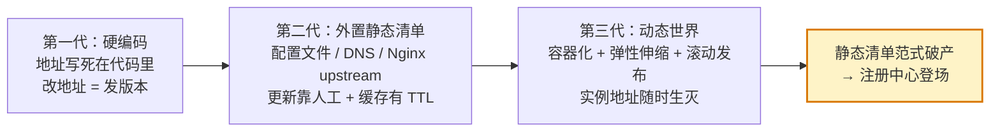
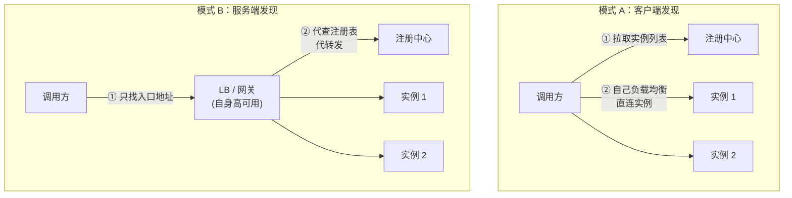
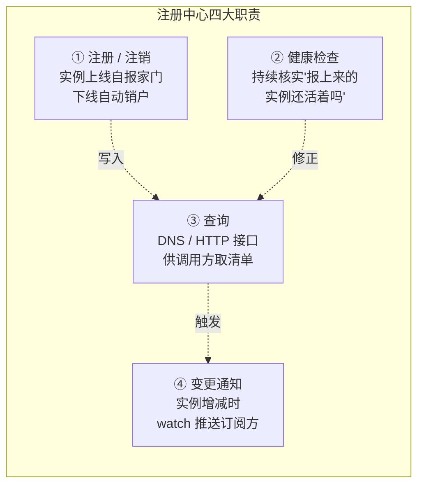
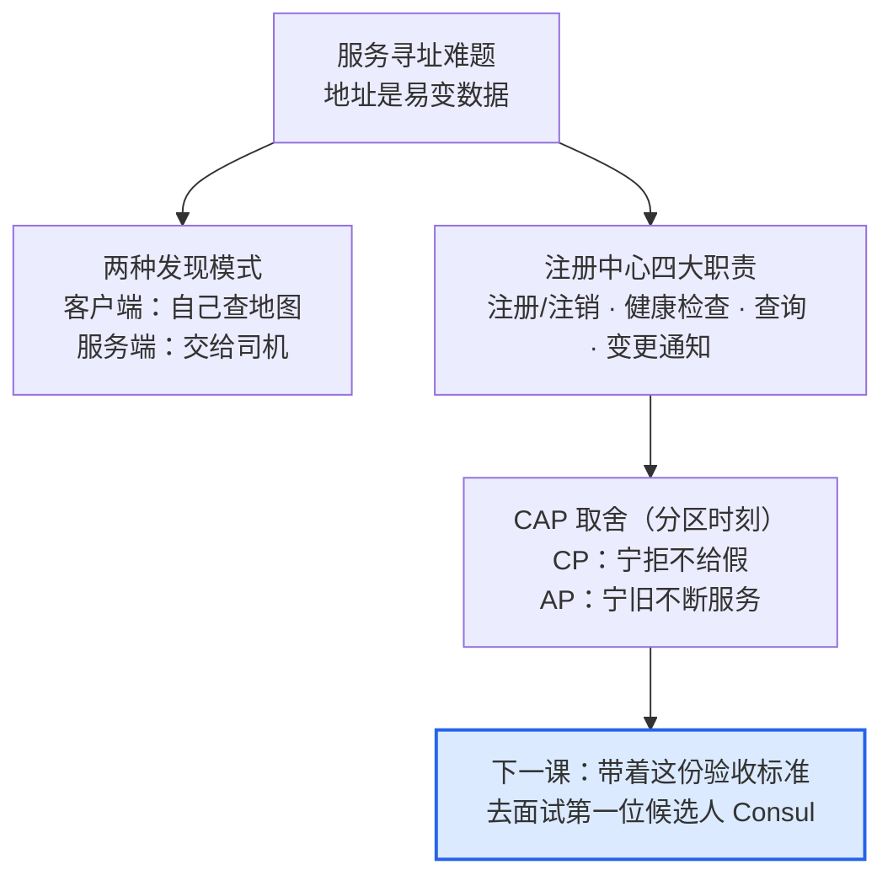

# 课 1：为什么需要服务注册与发现

> **本课目标**：理解"服务寻址"这个问题本身：它是怎么随着架构演化被一步步放大的，注册中心为什么是标准答案。这是全课程的问题原点，也是一切选型讨论的前提。
>
> **情节定位**：故事开篇。小林接手微服务化改造，第一个深夜故障电话让他意识到"服务找不到服务"才是最原始的痛。

---

## 第一幕：深夜故障电话

周二 23:47，小林的手机响了。订单服务的告警：调库存服务超时，失败率 40%。

小林打开配置中心一看，订单服务里写的库存服务地址是 `10.2.3.15:8080`。复盘结果：库存服务上周为应对大促从 3 个实例扩到了 5 个，新实例都注册到了弹性伸缩组里；而 `10.2.3.15` 这台机器昨天凌晨硬件故障被下线了。订单服务毫不知情，还在执着地拨打一个已经停机的号码。

这不是个例。在"服务从几台静态服务器变成成百上千个动态实例"的十年变迁里，"调用方如何拿到目标服务的正确地址"从一个小麻烦，长成了微服务架构的第一块基石问题——**服务发现**这个品类（注册中心），就是被这类故障一路逼出来的。

> 📌 本课不讲任何具体产品。先把问题本身吃透：**它是什么、有多疼、解法的形状长什么样**。带着这个"验收标准"，课 2 再去面试五位候选人。

## 第二幕：认知冲突

复盘会上，有同事提出："这有什么难的，前面加个 Nginx 负载均衡不就完了？"

小林在白板上问了三个问题，会议室安静了：

1. **Nginx 的 upstream 列表是谁维护的？** 还是人。只是把"改代码里的 IP"变成了"改 Nginx 配置里的 IP"——问题没有消失，只是搬了个家。
2. **实例宕机了，Nginx 怎么知道？** 默认不知道，流量打过去超时才被动发现；要主动探测，就得自己写健康检查逻辑——每个服务写一遍？
3. **我们有 200 个服务、上千个实例、每天几百次发布。** 谁来当这个"人肉 DNS"，在每次扩容、缩容、发布、宕机时实时更新所有调用方的清单？

冲突的本质浮出水面：**调用方需要一份"永远最新、只含健康实例"的地址清单，而这份清单只要靠人工维护，规模一大必然出错。** "加个 Nginx"治标不治本，因为 Nginx 的配置表本身还是一份静态清单。

## 第三幕：层层揭示

### 知识点 1：服务寻址难题——从硬编码 IP 到动态世界

**一句话定义**：服务寻址 = 调用方在发起请求前，获得目标服务"当前可用的网络地址"的过程。

**直觉建立**：你通讯录里存的是"张三"还是"张三 2019 年用的手机号"？如果存的是号码，他一换号你就失联。现代通讯录的聪明之处在于：**你记名字，它记号码，号码变了自动更新**。服务发现要解决的就是同一件事——让"服务名"与"服务实例地址"解耦。

**核心原理**：寻址方式的三代演化，每一代都在"地址是常量还是数据"上退让一步。



- **第一代（硬编码）**：地址是代码常量。实例换个 IP 就得发版，发版本身又制造新的地址变更——死循环。
- **第二代（外置清单）**：地址搬家到配置文件、DNS 记录或 Nginx upstream。比硬编码进步（不用发版了），但清单的**更新动作**仍是人工的，而且 DNS 还有本地缓存 TTL，变更传播以分钟计。
- **第三代（动态世界）**：容器用完即弃、弹性伸缩随流量增删实例、滚动发布每次都换一批 IP。地址从"半年不变"变成"每小时都可能变"——**静态清单这个范式本身破产了**，无论它放在哪里。

**示例演示（纸面推演）**：库存服务 18:00 扩容（3→5 实例）、22:00 实例 A 宕机、23:00 发布换掉全部实例。对照三种寻址方式：

| 时刻 | 发生了什么 | 硬编码 | 静态清单 | 真实需求 |
|------|-----------|--------|----------|----------|
| 18:00 | 扩容 +2 实例 | 不知道新实例，白白闲置 40% 算力 | 依赖谁去改清单 | 清单立即多 2 条 |
| 22:00 | 实例 A 宕机 | 继续拨打停机号码 | 清单里还躺着尸体地址 | 清单立即剔除 1 条 |
| 23:00 | 滚动发布全换 IP | 彻底失联 | 人工逐条改，发布窗口内半瘫 | 清单随发布实时滚动 |

三行推演已经勾勒出"注册中心"的完整需求轮廓：**清单要自动、要实时、要只留活的**。

**常见误区**：

- *"我们只有 8 个服务，用不着这套"* ——决定性变量不是服务数量，而是 **实例数 × 变更频率**。8 个服务若每次发布都换 IP、每天发布 5 次，静态清单的维护量与 80 个低频服务相当。
- *"上了 K8s 是不是就没这个问题了"* ——问题没有消失，是被 Kubernetes 内化了（它自带了一套服务发现）。你的系统里若还有 K8s 之外的 VM、外部服务，问题立刻回来。这个判断将在课 11 的决策框架中正式展开。

**一句话记住**：实例地址是易变数据，把它当常量写在哪里，哪里就是下一个故障点。

> 🎯 **选型视角**：算一算你自己的"动态度"（实例数 × 每日变更次数）。动态度越高，注册中心的收益越刚性；动态度极低时，"要不要引入"本身就是一个值得质疑的问题。

### 知识点 2：两种发现模式——客户端发现 vs 服务端发现

**一句话定义**：发现模式回答的是"**谁去查注册表、谁来做负载均衡**"——调用方自己干，还是交给中间层。

**直觉建立**：找餐厅的两种方式。**客户端发现** = 自己打开大众点评，筛掉歇业的，挑一家导航过去；**服务端发现** = 直接走进美食城，前台（中间层）替你安排座位。前者你掌握主动权但得自己装 App 学会筛选，后者省心但依赖前台不宕机。

**核心原理**：



> 两个子图各自独立示意（注册中心是同一个角色，分开画只是为了避免连线交叉）；差别只看一点：**负载均衡发生在调用方进程里，还是发生在中间层**。

| 维度 | 客户端发现 | 服务端发现 |
|------|-----------|-----------|
| 调用路径 | 调用方 → 实例（少一跳） | 调用方 → 中间层 → 实例（多一跳） |
| 负载均衡位置 | 调用方进程内（策略可精细定制） | 中间层统一（策略全局一致） |
| 客户端改造成本 | **高**：每种语言都要一套发现逻辑 | **低**：调用方只认一个固定入口 |
| 新增故障点 | 无中间层 | 中间层自身必须高可用 |
| 典型代表 | 早期 Netflix Ribbon + Eureka 组合 | AWS ELB、Nginx、K8s Service |

**DNS 与 API 两种查询接口的取舍**（横跨两种模式的通用问题）：

- **DNS 接口**（如 Consul 的 `web.service.consul`）：零改造成本，任何语言、任何老代码、甚至 `curl` 都认；但通常只有粗粒度轮询，且受本地 DNS 缓存影响，"剔除坏实例"的时效打折。
- **HTTP API 接口**：能拿到健康过滤、标签过滤、元数据等精细能力；但需要 SDK 集成或显式 HTTP 调用，老系统改造成本高。

**示例演示（纸面）**：同一个"订单调库存"场景——模式 A 下，订单服务进程内的 SDK 每 5 秒拉一次库存服务实例列表并本地缓存，请求直连；模式 B 下，订单服务只配置 `http://inventory.internal` 一个入口，网关查表转发。模式 A 少一跳延迟、可按"就近机房"精细路由；模式 B 下订单服务零改造，连 COBOL 老系统都能接入。

**常见误区**：

- *两种模式必须二选一* —— 大系统常混用：对外网关用服务端发现，内部高频调用链用客户端发现。
- *"有 K8s Service 就不用操心模式了"* —— K8s Service 本身就是服务端发现的一种实现（kube-proxy 在节点上做转发，对调用方透明）。理解两种模式，才能看懂各家产品在卖哪一层能力。

**一句话记住**：客户端发现是"自己查地图"，服务端发现是"上车交给司机"；多语言团队往往更爱司机。

> 🎯 **选型视角**：你的技术栈里语言种类越多，"客户端发现 + SDK 模式"的税越重，DNS 接口 / 服务端发现的价值越高。这条判断会在阶段 3 对比 Nacos（Java 亲和）与 Consul（多语言 + DNS）时反复用到。

### 知识点 3：注册中心的核心职责与 CAP 初印象

**一句话定义**：注册中心 = 存放"服务名 → 健康实例列表"映射、并让这份列表**自动保持最新**的专用基础设施。

**直觉建立**：一栋写字楼的物业前台。入驻登记（新实例注册）、退租销户（实例注销）、保安定时巡逻（健康检查）、访客问询（服务查询）。人走了前台台账自动划掉——而不是等访客撞上锁着的门才知道。

**核心原理**：四大职责环环相扣，缺一个都会退化回"人肉 DNS"。



但注册中心自己也是一个分布式系统——它自己也有多个节点、也会宕机、也会遇到网络分区。于是躲不开 CAP 定理（CAP theorem，Brewer 2000 年在 PODC 会议上提出猜想，MIT 的 Gilbert 与 Lynch 2002 年给出形式化证明；核查于 2026-08）：

- **C（一致性）**：每次读到的都是最新写入的数据。
- **A（可用性）**：每个请求都能得到（不一定最新的）响应。
- **P（分区容错）**：节点间网络断了（分区），系统仍要运作。

分布式系统的网络分区无法避免，所以 **P 是前提而非选项**；真正的选择发生在**分区出现的那一刻**：

| 取舍 | 分区时的行为 | 注册表语义 | 风险面 |
|------|-------------|-----------|--------|
| **CP（一致性优先）** | 拿不准就不给：拒绝响应或报错 | 宁可"暂时查不到"，不给"可能过期的清单" | 分区期间新写入的实例/宕机实例，外界感知延迟 |
| **AP（可用性优先）** | 照常响应，给本地已有的旧数据 | 宁可"清单可能不准"，不能"完全不服务" | 调用方可能拿到已死实例的地址，打过去才发现 |

Brewer 本人在 2012 年专门撰文澄清：流行的"三选二"说法有误导性——**没有分区时，C 和 A 可以兼得；取舍只在分区窗口内发生**（核查于 2026-08）。

**示例演示（纸面推演）**：3 节点注册中心，机房网络抖动，节点 1 与节点 2/3 断联。此刻库存服务向节点 1 注册了一个新实例：

- CP 系统：节点 1 因无法与多数派达成一致而**拒绝这次注册**；调用方在节点 2/3 查到的清单确定没有新实例，但也确定**不会拿到假数据**。
- AP 系统：节点 1 **接受注册**并本地生效；查节点 1 能看到新实例，查节点 2/3 看不到——清单短暂不一致，但三边都在正常服务。

哪个更疼，取决于业务：**电商大促中"打到坏实例导致下单失败"更疼，还是"两分钟查不到新实例"更疼？** 这没有标准答案——它正是 Consul（CP 系）与 Eureka（AP 系）的分野，也是课 5、课 9 的主线之一。

**常见误区**：

- *"CAP 是三选二"* —— 准确表述是"**分区发生时**，在 C 与 A 之间二选一"；P 在跨网络的分布式系统里不可放弃。
- *"注册中心挂了 = 所有服务立即瘫痪"* —— 不对。调用方通常**本地缓存**了实例清单，注册中心短暂不可用期间，存量调用靠缓存还能撑一阵。这决定了"不可用"的工程语义比字面宽松，也解释了为什么很多团队能容忍 AP 语义。
- *"CAP 只考注册中心"** —— 它是一切分布式数据系统的通用约束，阶段 2 课 5 讲 Raft 时你会再次遇见它。

**一句话记住**：注册中心 = 一本带保安巡逻、自动更新的活电话簿；它在分区时的性格（CP/AP），是选型的第一道分水岭。

> 🎯 **选型视角**：先自问"我的业务更怕哪种伤"——打到坏实例（ favors CP）还是短时查无此服务（ favors AP）。这个答案会直接淘汰一半候选人。

## 第四幕：实操验证

### 纸面推演：重放深夜故障

回到第一幕的故障（订单服务硬编码 `10.2.3.15:8080`，库存服务扩容后旧实例宕机），分别推演"没有注册中心"与"有注册中心"两条时间线：

| 时刻 | 没有注册中心的世界 | 有注册中心的世界 |
|------|------------------|-----------------|
| 17:00 库存扩容 +2 实例 | 新实例无人知晓，闲置 | 新实例自注册，清单 3→5 |
| 22:00 实例 A 宕机 | 无感知 | 健康检查标红，清单剔除 A |
| 22:00~ 订单发调用 | 40% 请求撞死地址，告警炸裂 | 调用方拿到的清单只含 4 个活实例，流量自动绕开 A |
| 23:47 | 深夜故障电话响起 | 小林在睡觉 |

四大职责（注册/检查/查询/通知）在这张表里各就各位——这就是第二幕三个问题被逐一拆解后的样子。

### 可选微实验：亲手制造一次"深夜故障"（约 2 分钟，PowerShell）

```powershell
# 终端 1：模拟库存服务实例 A
python -m http.server 8000

# 终端 2：模拟库存服务实例 B（扩容后的新实例，端口不同）
python -m http.server 8001

# 终端 3：模拟订单服务（硬编码调用 A）
curl http://127.0.0.1:8000
# 预期输出：一段 HTML 目录列表（HTTP 200，调用成功）

# 现在回到终端 1，Ctrl+C 杀掉实例 A（模拟宕机），再次调用：
curl http://127.0.0.1:8000
# 预期输出：curl : Unable to connect to the remote server
```

实例 B 明明活着（终端 2 还在跑），但硬编码的调用方就是够不着它。此刻你手动把命令改成 `curl http://127.0.0.1:8001` 再执行——**这个"人肉更新清单"的动作，就是注册中心要替你自动完成的事**。它要做快（秒级）、做准（只留活的）、做省心（无人值守）。

## 第五幕：体系收束

本课是全课程的**问题原点**。你已经拿到三样东西，它们会贯穿后面十课：

1. **一张需求清单**：注册中心 = 注册/注销 + 健康检查 + 查询 + 变更通知，四大职责缺一不可。
2. **一对模式透镜**：客户端发现 vs 服务端发现，DNS vs API——以后看任何产品的能力页，先问"它把负载均衡放在哪、用什么接口暴露"。
3. **一道分水岭**：CP 还是 AP——你的业务更怕"打到坏实例"还是"查无此服务"。



**自测思考题**（建议先自己作答再看提示）：

1. 团队把服务地址写进 Nginx upstream，由运维每周更新一次——这属于第几代寻址？它在什么条件下崩坏？
   *提示：第二代静态清单；崩坏条件 = 变更频率超过更新频率（扩缩容、宕机、滚动发布）。*
2. 一个 12 种语言混合、含大量无法改造的老系统的团队，更该选哪种发现模式？为什么？
   *提示：服务端发现（或 DNS 接口）——客户端发现的 SDK 成本按语言数线性放大。*
3. CP 注册中心分区期间，新注册的实例外界看不到。这对"滚动发布"场景意味着什么具体风险？
   *提示：新实例上线却接不到流量，发布窗口被拉长；需要等分区恢复或靠本地缓存兜底。*

---

## 📇 概念速查卡

| 术语 | 一句话解释 | 本课角色 |
|------|-----------|----------|
| 服务寻址 | 调用前拿到目标"当前可用地址" | 问题本身 |
| 三代演化 | 硬编码 → 静态清单 → 动态世界 | 问题的放大过程 |
| 客户端发现 | 调用方查表 + 自己负载均衡 | 解法形态 A |
| 服务端发现 | 中间层代查代转发 | 解法形态 B |
| DNS / API 接口 | 零改造但粗粒度 / 灵活但要集成 | 查询通道的取舍 |
| 注册中心四大职责 | 注册注销、健康检查、查询、变更通知 | 选型验收标准 |
| CAP / CP / AP | 分区时刻在一致性与可用性间二选一 | 第一道选型分水岭 |

## 🚀 下一批接力提示词

> 学完本课后，**复制下面这段文字发给 AI**，即可无缝进入下一批（无需重新描述上下文）：

```
继续学 Consul。我的学习档案在 consul/00-学习档案.md，
刚学完阶段 1《认识 Consul》的课《为什么需要服务注册与发现》
知识点（服务寻址难题、两种发现模式、注册中心核心职责与 CAP 初印象），
请按大纲继续讲解下一批知识点。
```

## 🧭 课程导航

- [下一课：课 2 Consul 是什么与能力全景](./lesson-02-Consul是什么与能力全景.md)
- [返回课程目录](../../../02-课程目录.md)
