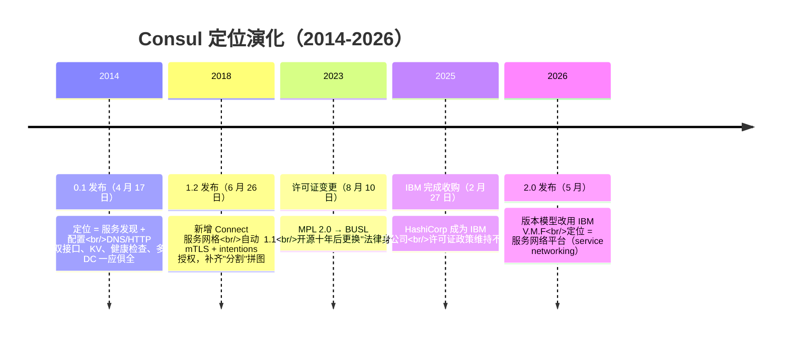
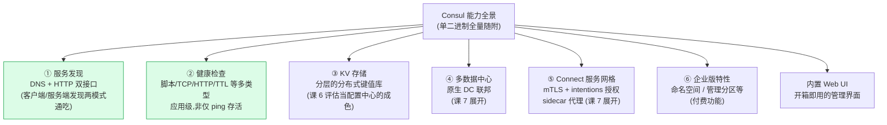
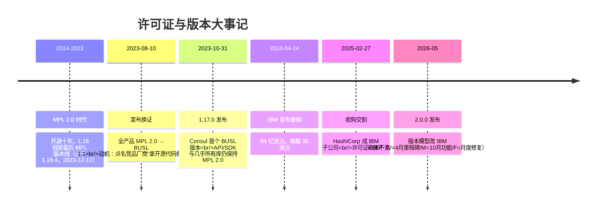
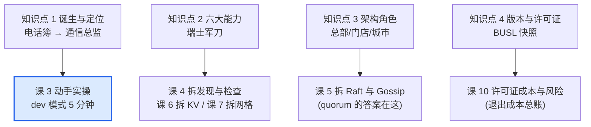

# 课 2：Consul 是什么与能力全景

> **本课目标**：建立 Consul 的完整心智模型：它从哪来、能干哪六件事、架构上由什么角色组成，以及 2026 年当下的版本与许可证现状（决策关键输入）。
>
> **情节定位**：第一位候选人登场：小林翻 Consul 的履历——HashiCorp 出身、十年演化、以及 2023 年那场许可证风波。

---

## 第一幕：候选人的履历表

小林把课 1 的验收清单打印出来压在桌上：**四大职责（注册/注销、健康检查、查询、变更通知）、一对模式透镜（客户端 vs 服务端发现）、一道 CP/AP 分水岭**。第一位候选人的简历放上桌面：

- **姓名**：Consul，2014 年 4 月 17 日入行（HashiCorp 官方发布博客，核查于 2026-08）
- **出身**：HashiCorp——2012 年由 Mitchell Hashimoto 与 Armon Dadgar 创立的公司，此前已有 Vagrant、Terraform 等作品
- **入行动机**：2013 年前后，两位创始人帮客户做"不可变基础设施"时撞上一个矛盾——服务地址既不能烘焙进镜像（IP 会变），又不想每次变更都跑一轮 Chef/Puppet 配置管理。他们先把"集群成员管理与故障检测"做成了通用库 Serf（2013），再在其上叠加 Raft 共识与服务目录，Consul 就此诞生
- **入职宣言**（2014 年原话）："a solution for service discovery and configuration"——一个服务发现与配置方案

十年后，这份简历的头衔已换成"**服务网络平台**（service networking）"。从"电话簿"到"通信总监"，它是怎么升职的？升职之后还干不干电话簿的活？

## 第二幕：三处疑点

小林通读简历，在三个地方画了问号：

1. **能力疑似包装过度**：简历写着六大能力全家桶（发现、健康检查、KV、多数据中心、服务网格、企业特性）——我只招一个注册中心，这算能力富裕，还是为用不上的部分买单？
2. **法律身份变了**：开源十年（MPL 2.0，Mozilla 公共许可证——一种公认的宽松开源许可证）的老将，2023 年 8 月突然宣布把后续版本全部换成 BUSL 1.1——"开源出身却不再开源"，这算不算重大瑕疵？
3. **东家换了**：2025 年 2 月，HashiCorp 被 IBM 以 64 亿美元收购。新东家手下，产品路线和承诺还作数吗？

疑点 1 需要拆开它的**能力与身材**（知识点 1–3）；疑点 2、3 是同一件事的两面——**一份"婚前协议"要逐条读**（知识点 4，深度拆解在课 10）。

## 第三幕：层层揭示

### 知识点 1：诞生与定位——从服务发现工具到服务网络平台

**一句话定义**：Consul 是 HashiCorp 推出的服务网络平台，2014 年入行时只做两件事——服务发现与配置管理，2018 年起叠加服务网格能力，逐步演化为平台级产品。

**直觉建立**：一位从"前台总机"做起、后来升任"通信总监"的老员工。第一份工作只管"查号码 + 传话"（服务发现 + 健康状态）；升职后开始管"加密专线和门禁授权"（服务网格）。头衔变了，但查号码的活儿一直没丢——**老本行反而是它最成熟的部分**。

**核心原理**：一条定位演化时间线（各节点均已联网核实）：



还有一条贯穿十年的工程线索：Consul 用 **Go** 编写，静态编译为**单个可执行文件**——无 JVM、无外部依赖，拷到 Linux/Windows/macOS 上就能跑，这从先天上压低了部署与运维成本。加之这副"单二进制 + agent 模型 + Raft + gossip"的骨架从未推倒重来——对选型者这是加分项：十年老架构，生态与运维经验都可复用。

**示例演示**：官方措辞的对照——2014 年发布博客标题是 "HashiCorp Consul"（正文自称 "a solution for service discovery and configuration"）；2026 年官方博客与文档统一自称 "service networking platform"。头衔变化不是公关话术：2018 年 1.2 的 Connect 让它把"发现、配置、分割（segmentation）"三块拼图凑齐，从此按"服务网络"的故事讲（核查于 2026-08）。

**常见误区**：

- *"Consul 生来就是服务网格"* —— 不对。2014-2018 它只是服务发现 + 配置工具；网格是 1.2（2018-06）才补上的能力，而且是 beta 起步。
- *"HashiCorp 只会做 Consul"* —— 反了，Consul 是 HashiCorp 工具家族（Vagrant/Terraform/Vault/Nomad…）的一员。这既是生态优势（与 Terraform、Vault 天然配合），也意味着公司精力分散在多条产品线上。

**一句话记住**：电话簿起家、通信总监在职——但十年没换过骨架的，只有这一位候选人。

> 🎯 **选型视角**：候选人的"职级演化"要倒着读——今天它是平台，但你**只按用到的能力付运维成本**。只当注册中心用，完全合法且是最成熟的用法；只是"平台"这个词会让采购流程把它对标到更重的品类。这份错位感会贯穿课 6、课 7。

### 知识点 2：能力全景图——六大能力

**一句话定义**：Consul 的能力清单 = 服务发现、健康检查、KV 存储、多数据中心、Connect 服务网格、（企业版）命名空间与管理分区，外加一个内置 Web UI。

**直觉建立**：瑞士军刀。主刀（服务发现）人人买它都为这个；剪刀（KV）、开瓶器（网格）平时收着，要用就展开。**关键不是刀具有几把，而是你为用不到的那几把多背了多少重量**。

**核心原理**：六大能力全景，按"课 1 验收清单"的顺序重排：



前四项（绿底）恰好就是课 1 定下的"注册中心四大职责"对应面：

| 课 1 验收项 | Consul 的答卷 | 备注 |
|------------|--------------|------|
| 注册/注销 | HTTP API / 配置文件注册到任意 agent | 课 3 实操 |
| 健康检查 | 多类型检查挂在服务/节点上 | 课 4 拆机制 |
| 查询 | DNS + HTTP 双接口 | 双模式通吃，课 1 知识点 2 的两种模式它都接 |
| 变更通知 | watch / 阻塞查询（blocking query） | 课 4 拆机制 |
| CP 还是 AP？ | **本题课 5 揭晓**（Raft 系，先卖个关子） | 它是 CP 阵营，与 Eureka 分野 |

**示例演示（纸面）**：小林的公司现状是"200 个服务、12 种语言、含 K8s 与 VM 混部"。对照清单：①②④刚需；③已有 Nacos/Apollo 类配置中心的可不用；⑤纯 K8s 业务已有 Istio 的可能重叠；⑥要看预算。**六项里真正要买的可能只有两项**——这正是全家桶产品的典型采购画像。

**常见误区**：

- *"能力多 = 赚了"* —— 能力多意味着**攻击面与升级回归面同比例扩大**。只用服务发现却升到了带网格大改动的版本，回归测试成本照样付。
- *"KV 就是配置中心"* —— KV 是"存储"，配置中心还需要"推送、灰度、回滚、审计"等外围能力。课 6 专门算这笔账。
- *"Connect 是必选项"* —— Connect 完全可以不开，开了才有 sidecar 与证书体系。不开它，Consul 就是一台干净的电话簿。

**一句话记住**：六把刀具全量随附，但你只为真正拔出来的那把付磨损费。

> 🎯 **选型视角**：画一张你自己的"能力-现状对照表"：每项能力标"刚需 / 已被他家覆盖 / 空闲"。**空闲项超过一半时，认真考虑专门化工具**（阶段 3 对比的核心动作）。

### 知识点 3：架构角色——Server / Client / 数据中心

**一句话定义**：Consul 采用 agent 模型——每个参与节点跑一个 Consul agent（一个进程），它有两种身份：**Server**（存数据、管共识）与 **Client**（轻量转发、就近服务）；一个数据中心（DC）内的所有 agent 合起来构成一个 Consul 集群。

**直觉建立**：连锁品牌。**总部（Server）**只有几家，掌握唯一总账本，大事要"过半数高管到会"才能拍板（quorum，多数派仲裁——课 5 细讲）；**门店（Client）**遍地都是，不存账本，就近接待客人（注册、健康检查）再转送总部；**一个城市（DC）**的直营体系 = 一个集群，城市之间还有总部级的"城际通讯"（WAN 联邦）。

**核心原理**：一图看懂两层数据中心拓扑：

```mermaid
flowchart TB
    subgraph DC1["数据中心 dc1（一个集群）"]
        subgraph servers["Server × 3（Raft 仲裁，奇数台）"]
            L["Leader<br/>唯一接受写入"]
            F1["Follower"]
            F2["Follower"]
        end
        CL1["Client agent<br/>（业务节点 A 上）"]
        CL2["Client agent<br/>（业务节点 B 上）"]
        CL1 -.->|"转发 RPC"| L
        CL2 -.->|"转发 RPC"| F1
        S1["服务 web<br/>注册+健康检查"]
        CL1 --- S1
    end
    subgraph DC2["数据中心 dc2（另一个集群）"]
        L2["Server × 3"]
        CL3["Client agents..."]
    end
    L <==>|WAN gossip 联邦<br/>(跨 DC 目录交换，课 7)| L2
    style L fill:#fee2e2,stroke:#dc2626
    style L2 fill:#fee2e2,stroke:#dc2626
```

三个角色各自的分工与脾气：

- **Server**：集群的"账本层"。3 或 5 台（奇数，为 quorum），数据经 Raft 共识写入（课 5 拆解）。**读写请求其实可以从任意 agent 进入**，但最终写都汇聚到 Leader 提交。
- **Client**：集群的"接待层"。无状态、不存数据，负责本节点上的服务注册、健康检查执行，把请求转发给 Server。轻到可以忽略，但**没有它，注册就得直连 Server**。
- **DC（数据中心）**：Consul 的一切概念默认以 DC 为边界——服务目录、gossip 局域网、Raft 集群都在 DC 内；跨 DC 靠 WAN 联邦交换目录（课 7）。一个 DC = 一个集群，这是读拓扑图的第一公理。

**示例演示（纸面）**：一次注册的旅程——业务节点 A 上的 web 服务启动，向**同节点的 client agent** 自报家门（name=web, port=8080)；agent 把注册请求经 LAN 转发给任一 server，最终由 Leader 经 Raft 写入目录并复制到另外两台；随后任何节点查询 `web` 都能拿到清单。宕机时：client agent 停止心跳，集群将其标记失联——**课 1 四大职责在这条链路上各就各位**。顺带解开图中的"gossip"一词：agent 之间的 **gossip（流言协议）**负责传播"谁在场、谁失联"——像门店之间互相传八卦，一传十、十传百地扩散成员状态，不需要总部逐一电话核实（两层流言池的机制课 5 拆）。

**常见误区**：

- *"Client 也存一份数据"* —— 不存。Client 无状态只转发；数据只在 Server 上，靠 Raft 保持三副本一致。
- *"Server 越多越稳"* —— 反而更慢：每次写入要过半数确认，5 台已是常规上限，7 台以上写放大明显。
- *"agent 是一台机器"* —— agent 是**进程**，"每节点一个 agent"是约定；K8s 时代这个模型正在演进（新版提供更轻的 dataplane 形态，一句带过，课 4/课 5 不依赖它）。
- *"DC 就是一个机房"* —— Consul 语义里 DC 是**集群边界**，物理上一个机房可以拆两个"DC"（两个集群），一个低延迟局域网也常算一个 DC。按"集群"理解 DC，不按机房。

**一句话记住**：Server 是总部账本（奇数台过半拍板），Client 是就近门店（无状态转送），一个 DC 一个集群。

> 🎯 **选型视角**：把拓扑直接换算成成本——3 台 Server（要养机器/实例+监控+备份+升级）、每业务节点一个 agent（发布流程要纳入）、DC 数量 = Server 组数。**"用 Consul"的真实运维账单从这里开始算**，课 10 算总账。

### 知识点 4：版本与许可证现状（2026-08 快照）

**一句话定义**：截至 2026 年 8 月，Consul 处于 2.0 时代（IBM V.M.F 版本模型），同时维护 2.0.x / 1.22.x / 1.21.x(LTS) 三条版本线；1.17.0 起本体许可证为 BUSL 1.1（源可用、非 OSI 开源），API/SDK 仍为 MPL 2.0。

**直觉建立**：相亲对象的"婚姻史与法律身份"。过去十年换了身份证（MPL → BUSL），2025 年换了东家（IBM），但**婚内条款白纸黑字**：过日子（内部使用）随便，抢对方家生意（竞争性商用）不行，且每份合同满 4 年自动"转正"回旧条款（MPL）。

**核心原理**：事件时间线 + 条款要点（全部核查于 2026-08）：



**BUSL 1.1 条款三句话读懂**（完整拆解在课 10）：

1. **source-available ≠ 开源**：代码完全公开可看可改，但 OSI（开源促进会）不认它为开源许可证。
2. **内部使用完全放行**：HashiCorp 官方 FAQ 明确——生产、非生产、公司内部各事业部互用，全都可以；**对绝大多数"自用"公司，行为上与从前无差别**。
3. **禁区只有一条**：拿它做"与 HashiCorp 竞争的对外产品/服务"（如基于 Consul 卖托管注册中心）。且每个版本发布满 4 年（Change Date）自动转回 MPL 2.0。

**当前版本线与支持期**（官方文档口径，核查于 2026-08）：

| 版本线 | 定位 | 支持至 | 备注 |
|--------|------|--------|------|
| 2.0.x | 当前主线 | 2028-04-30 | 2.0 亮点多为企业版功能（多端口网格、外部 CA、全局 RPC 限流） |
| 1.22.x | 稳定线 | 2026-10-31 | 很快到期，新部署不建议再入 |
| 1.21.x | **最后一个 LTS** | 2027-04-30 | 1.x 长期支持的终点 |
| ≤1.20 | 已 EOL | — | 含全部 MPL 时代版本；无补丁，尽快升级 |

> 时间线彩蛋：1.16.4（2023-12-12）的发布时间反而**晚于** 1.17.0（2023-10-31）——因为 HashiCorp 承诺对 MPL 代码库的安全更新持续到 2023 年 12 月。旧许可证版本线的"善后"，也做满了四个月。

**示例演示（纸面）**：三类典型场景的合规判定——①公司内部微服务用 Consul 做注册中心：**放行**，与换证前无差别；②把 Consul 打进卖给客户的商业软件里做服务发现组件：**需细读 Additional Use Grant 并过法务**（"嵌入再售卖"触碰竞争条款的边缘地带）；③云厂商想基于 Consul 提供托管服务对外卖：**明确禁止**——这正是换证的导火索。

**常见误区**：

- *"BUSL = 不能商用"* —— 错。商用内部使用明确允许，受限的只有"竞争性提供"。
- *"换了许可证，我们已经部署的版本违法了"* —— 不涉及。换证只约束**新版本**；1.16.4 及更早版本永远是 MPL 2.0。
- *"这事跟我无关"* —— 换证与收购至少影响三件事：法务入库流程（不再是 OSI 开源）、部分开源镜像源停止分发 BUSL 版本、以及**退出成本**（若哪天要换掉它，看课 10）。选型者必须把它当作成本项入账。

**一句话记住**：身份证换了（BUSL），日子照过（内部用无碍），禁区只有一条（别拿它跟 HashiCorp 抢生意），每版 4 年自动转正。

> 🎯 **选型视角**：立即把三件事写进决策清单：①你的用法是否踩"竞争性提供"红线（99% 的内部场景不踩）；②公司开源软件入库政策是否接受 source-available；③1.21 LTS 是 1.x 终点，新部署直接从 2.0.x 起步。课 10 再算退出成本的总账。

## 第四幕：实操验证

### 纸面推演：第一轮面试评分表

回到第二幕的三个疑点，用本课所学逐项裁决：

| 疑点 | 裁决 | 依据 |
|------|------|------|
| 能力包装过度？ | **部分成立** | 六大能力全量随附（单二进制），但可只开前两项；代价是升级回归面与运维面按全家桶走 |
| 法律身份瑕疵？ | **对内部使用不构成实质伤害** | BUSL 明确放行内部使用；但入库流程与退出成本要重新记账 |
| 东家换了还稳吗？ | **观察项** | 交割后许可证政策未变、2.0 按新版本模型正常迭代（2026-05）；长期路线待观察 |

结论：**简历通过初筛，进入实操轮**——纸上谈兵看不出 Raft 成色与 DNS 手感，课 3 把它拉出来遛遛。

### 可选微观察（约 2 分钟，无需安装任何东西）

不动手装，先远程看一眼它的"法律身份"与"版本现场"，验证知识点 4 的两张表：

1. 浏览器打开 Consul 的 GitHub 仓库 LICENSE 页：`https://github.com/hashicorp/consul/blob/main/LICENSE.md`——亲眼确认 BUSL 1.1 正文与 **Additional Use Grant**（HashiCorp 的额外授权条款）。
2. 再看发布页：`https://github.com/hashicorp/consul/releases`——对照是否能找到 2.0.x、1.22.x、1.21.x 三条线并存的现象。

> 你在 LICENSE 里看到的 Busl 与附加授权，正是 2023-08-10 那纸公告的最终形态。

## 第五幕：体系收束

课 1 你拿到了**验收标准**，本课完成了**第一位候选人的初面**：履历（诞生与定位）、技能表（六大能力）、组织架构（Server/Client/DC）、法律身份（版本与许可证）。四个知识点在全局中的位置：



**自测思考题**（建议先自己作答再看提示）：

1. 一家公司说"我们 2019 年就部署了 Consul，所以换许可证对我们没影响"。这话对吗？
   *提示：半对。存量版本永远是 MPL；但只要升级到 1.17+ 就进入 BUSL 时代，且 ≤1.20 已 EOL 无补丁——"不升级"本身有安全成本。*
2. 团队打算只用 Consul 的服务发现，不开 Connect。部署 2.0.x 后，升级回归测试要不要关注 Connect 相关的变更？
   *提示：要。单二进制全量随附，网格层的大改动（如 2.0 的多端口、Envoy 版本约束）同样进入你的回归面——这就是"全家桶账单"。*
3. 为什么 Consul 的 Server 推荐 3 或 5 台而不是 2 台或 4 台？
   *提示：quorum 要"过半数"。2 台挂 1 台剩 1 台=不过半；4 台挂 1 台剩 3 台过半但挂 2 台就瘫痪，容错与 3 台相同却多养一台——奇数是性价比最优解（课 5 展开）。*

---

## 📇 概念速查卡

| 术语 | 一句话解释 | 本课角色 |
|------|-----------|----------|
| HashiCorp | 2012 年创立，Consul 的东家，2025 年起为 IBM 子公司 | 候选人出身 |
| service networking | Consul 今日的自我定位：服务网络平台 | 履历头衔 |
| Serf | 2013 年的 gossip 成员管理库，Consul 的底座之一 | 出身血统 |
| Connect | 1.2（2018）引入的服务网格：mTLS + intentions | 六大能力之五 |
| agent 模型 | 每节点一个进程，Server/Client 两种身份 | 组织架构 |
| quorum | Raft 多数派仲裁，Server 取奇数的原因 | 课 5 伏笔 |
| DC（数据中心） | Consul 语义里的集群边界 | 组织架构 |
| BUSL 1.1 | 源可用许可证：内部放行、禁竞争性提供、4 年转 MPL | 法律身份 |
| MPL 2.0 | 1.16.4 及之前版本的 OSI 开源许可证；API/SDK 沿用至今 | 法律身份 |
| LTS | 长期支持版；1.21.x 是 1.x 最后一个 LTS | 版本线 |

## 🚀 下一批接力提示词

> 学完本课后，**复制下面这段文字发给 AI**，即可无缝进入下一批（无需重新描述上下文）：

```
继续学 Consul。我的学习档案在 consul/00-学习档案.md，
刚学完阶段 1《认识 Consul》的课《Consul 是什么与能力全景》
知识点（诞生与定位、能力全景图、架构角色、版本与许可证现状），
请按大纲继续讲解下一批知识点。
```

## 🧭 课程导航

- [上一课：课 1 为什么需要服务注册与发现](./lesson-01-为什么需要服务注册与发现.md)
- [下一课：课 3 五分钟跑起来看一眼](./lesson-03-五分钟跑起来看一眼.md)
- [返回课程目录](../../../02-课程目录.md)
