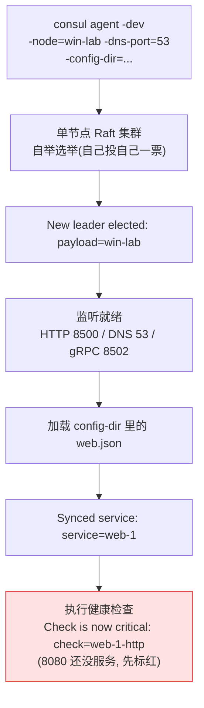
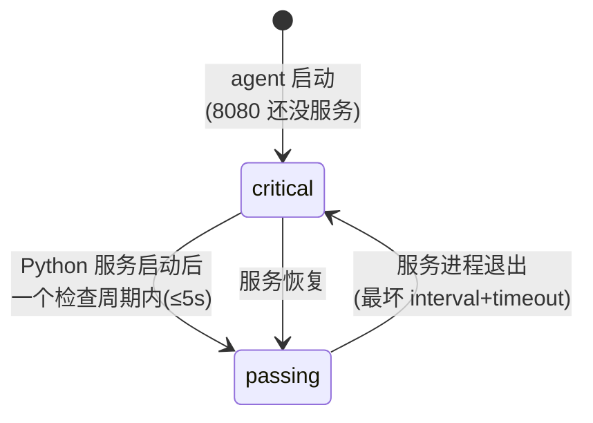
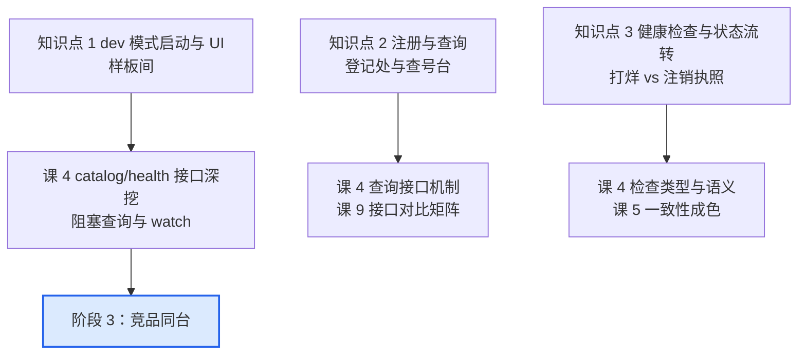

# 课 3：五分钟跑起来看一眼（轻量体验课）

> **本课目标**：亲手完成"安装 → 启动 → 注册 → 查询 → 健康检查"完整闭环，把阶段 1 的全部概念落到看得见的命令输出上。
> **情节定位**：小林不听 PPT 吹牛，要求现场演示：五分钟，让一个服务在 Consul 里"活"起来。
> **定位说明**（大纲评审约定）：本课为可选体验课，决策参考型学习者可跳过直接进入阶段 2；但"眼见为实"对建立直觉有实际帮助，推荐快速过一遍。
>
> **本课所有命令与输出均为 2026-08-28 在本机（Windows 11 + Consul 2.0.2）真实实测**，非文档摘抄。你复现时看到的输出应与讲义一致（时间戳除外）。

---

## 第一幕：现场演示开场

课 2 结束时，Consul 的简历通过了初筛：履历清白、能力齐全、架构合理。但小林合上简历说了句话："**PPT 上谁都会写'五分钟上手'，现在演示给我看。**"

演示清单只有四步：

1. 装上它（真的只要一条命令？）
2. 启动它（课 2 讲的 Server/Client/DC 拓扑，一个人怎么演？）
3. 让一个服务"活"起来（注册 → 被查到）
4. 让这个服务"死"一次（健康检查 → 查询结果变化）

对应课 1 抽象出的注册中心四大职责：**注册/注销、健康检查、查询、变更通知**——前三项本课全部亲手摸到，第四项（变更通知）留个钩子给课 4。

## 第二幕：演示前的三个真实障碍

备课实测在本机跑了一遍全流程，撞上了三个真实障碍（比演示本身更有教学价值）：

1. **装完"找不到命令"**：winget 装完 Consul，直接敲 `consul` 报"不是内部或外部命令"——PATH 环境变量改了，但**已打开的终端不会自动刷新**。Windows 装完即用的"即用"，得先重开一个终端窗口。
2. **教材上的 DNS 命令在这台机器上失效**：所有 Consul 教材都写 `dig @127.0.0.1 -p 8600 web.service.consul`，但本机没有 dig；换 `nslookup -port=8600 ...` 也超时。实测排查发现：**这台 Windows 11 的 nslookup 是新式实现，根本不支持自定义端口**（命令行 `-port=` 和交互式 `set port` 都没有这个选项），查询被静默发送到默认 53 端口，自然石沉大海。
3. **"服务挂了，为什么还查得到"**：停掉服务进程后，`catalog` 接口里 web 服务还在——第一反应是"Consul 坏了"，其实是它最核心的设计：**注册事实与可用状态是分离的**（知识点 3 详解）。

障碍 1、2 属于"本机适配"，下文命令已全部绕开；障碍 3 恰恰是本课最重要的教学点。开始演示。

## 第三幕：层层揭示

### 知识点 1：dev 模式启动与 UI

**一句话定义**：`consul agent -dev` 用一条命令启动一个"单节点、纯内存、Server 与 Client 一体"的 Consul 集群，官方定位仅限本地开发体验，明确禁止用于生产。

**直觉建立**：**样板间**。户型结构（agent 模型、Raft、gossip）和真房子一模一样，你在样板间里学到的动线（注册、查询、检查）全部适用于真房子；但面积（单节点）、地基（无持久化，重启全丢）、安保（无 TLS、无 ACL）都是简化版。

**核心原理**：一条命令背后发生了什么（本机实测启动日志逐行解读）：



启动横幅里最有信息量的一行（实测）：

```text
Client Addr: [127.0.0.1] (HTTP: 8500, HTTPS: -1, gRPC: 8502, gRPC-TLS: 8503, DNS: 53)
```

HTTP API 与 UI 在 8500，DNS 在 53（默认 8600，本机改为 53 的原因见知识点 2），且**只监听 127.0.0.1 回环地址**（loopback，只有本机进程能连）——dev 模式不会把端口暴露给局域网，这也是它"仅限开发"的天然护栏之一。

安装方式概览（本机实测 winget 路线）：

| 方式 | 命令/入口 | 实测结论 |
|------|----------|----------|
| winget（本机首选） | `winget install Hashicorp.Consul --source winget` | ✅ 装到 2.0.2，PATH 自动登记，**需重开终端** |
| 官方二进制 | releases.hashicorp.com 下载 zip 解压 | 通用方案，手动加 PATH |
| Chocolatey | `choco install consul` | 未实测，非本机首选 |

**示例演示**（实测输出节选）：

```powershell
# 启动（终端窗口 A，保持运行）
consul agent -dev -node=win-lab -dns-port=53 -config-dir=D:/projects/learning/consul/playground

# 另开一个终端（窗口 B）看成员
consul members
```

```text
Node     Address         Status  Type    Build  Protocol  DC   Partition  Segment
win-lab  127.0.0.1:8301  alive   server  2.0.2  2         dc1  default    <all>
```

浏览器打开 `http://127.0.0.1:8500/ui/`（实测 HTTP 200）：左侧 Services 里能看到 `web`，点进去有健康检查的实时状态——**课 2 的"内置 Web UI"能力亲眼验证**。

`-node=win-lab` 的作用：默认节点名是计算机名（本机为 `V_WYPGWU-PC5`），含下划线，不是合法 DNS 字符（实测启动日志警告 "will not be discoverable via DNS due to invalid characters"）。起个干净名字，消掉警告，后面的 DNS 演示也更漂亮。

**常见误区**：

- *"dev 模式这么方便，小项目直接上生产"* —— 明确禁止：数据纯内存（重启全丢）、单节点无冗余、无鉴权。生产形态的最小拓扑是 3 台 Server（课 2 的"总部账本"），课 10 算账。
- *"装完敲 consul 报错 = 装坏了"* —— 只是 PATH 没刷新，**重开一个终端窗口**即可（实测踩坑）。
- *"配置目录里放什么文件都行"* —— 实测：config-dir 只认 `.json` / `.hcl`，其他扩展名文件会打印 `skipping file ... extension must be .hcl or .json` 警告。配置目录保持干净，只放服务定义。

**一句话记住**：dev 是样板间——动线全真、地基全假；一条命令起集群，重启归零，生产勿用。

> 🎯 **选型视角**：把"五分钟上手"当作选型的真实维度——Consul（单二进制、零依赖、自带 UI）与 ZooKeeper（先装 JDK、改 zoo.cfg、配 myid）的上手成本差距是结构性的。但样板间体验好 ≠ 生产便宜，后者课 10 用账本说话。

### 知识点 2：注册与查询服务

**一句话定义**：服务通过 JSON 配置文件（或 HTTP API）向 agent 注册；查询走两个接口——HTTP API（8500，信息全、能过滤）与 DNS（默认 8600，信息少、但零改造成本）。

**直觉建立**：**登记处与查号台**。注册 = 到前台填表（姓名、门牌号、标签）；查询有两种问法——打电话问总机（HTTP API：什么都能问，还能只转健康分机）或查公共电话簿（DNS：任何会查 DNS 的程序都认识它，但只给你一个地址）。

**核心原理**：本课的服务定义文件全文（`D:/projects/learning/consul/playground/web.json`，已为你创建好）：

```json
{
  "service": {
    "id": "web-1",
    "name": "web",
    "tags": ["demo", "v1"],
    "address": "127.0.0.1",
    "port": 8080,
    "check": {
      "id": "web-1-http",
      "name": "web-1 HTTP check",
      "http": "http://127.0.0.1:8080/",
      "interval": "5s",
      "timeout": "2s"
    }
  }
}
```

字段速读：`name` 是查询用的服务名（同名可多实例），`id` 是实例唯一标识，`tags` 是过滤标签，`address:port` 是实例地址；`check` 挂了一条 HTTP 健康检查（知识点 3 主角）。agent 启动时加载此文件，日志打出 `Synced service: service=web-1` 即注册完成。

三个查询接口的语义分工（全部本机实测）：

| 接口 | 回答的问题 | 服务宕机时 |
|------|-----------|-----------|
| `/v1/catalog/service/web` | **谁注册过**（目录视图） | 仍返回（注册事实还在） |
| `/v1/health/service/web?passing=true` | **谁现在健康**（健康视图） | 返回空 |
| DNS `web.service.consul` | **健康的地址是什么**（应用视图） | NXDOMAIN（DNS 标准否定应答：域名不存在） |

**示例演示**（实测输出，服务健康时）：

```powershell
# HTTP API：目录视图（节选关键字段，实测返回约 40 个字段）
Invoke-RestMethod http://127.0.0.1:8500/v1/catalog/service/web
```

```json
{
  "Node": "win-lab",
  "ServiceID": "web-1",
  "ServiceName": "web",
  "ServiceTags": ["demo", "v1"],
  "ServiceAddress": "127.0.0.1",
  "ServicePort": 8080
}
```

```powershell
# DNS：A 记录（只有地址）
nslookup web.service.consul 127.0.0.1
```

```text
Server:  win-lab.node.dc1.consul      ← Consul 的 DNS 服务器连反向解析都自己答了
Address:  127.0.0.1

Name:    web.service.consul
Address:  127.0.0.1
```

```powershell
# DNS：SRV 记录（连端口一起带出）
nslookup -type=SRV web.service.consul 127.0.0.1
```

```text
web.service.consul  SRV service location:
      priority       = 1
      weight         = 1
      port           = 8080
      svr hostname   = 7f000001.addr.dc1.consul
7f000001.addr.dc1.consul  internet address = 127.0.0.1
```

两个细节值得停下看一眼：

- **`web.service.consul` 的命名格式**是 Consul DNS 的约定：`<服务名>.service.consul`，`service` 也可换成 `query`、`connect` 等，`.consul` 后缀可在配置中修改。
- **`7f000001.addr.dc1.consul`** 不是乱码：`7f000001` 是 `127.0.0.1` 的十六进制 IP 编码（7f=127, 00=0, 00=0, 01=1）。Consul 2.0 用"IP 编码主机名"作为 SRV 目标，绕开了节点名可能含非法字符的坑。

**本机适配：Windows 11 的 DNS 端口坑（实测详解）**。默认情况下 Consul DNS 监听 8600，标准查法是 `dig @127.0.0.1 -p 8600 web.service.consul`（Linux/macOS 教材通用）。本机两步排查实锤：

1. 本机无 dig；用 Python 直发 DNS 报文到 `127.0.0.1:8600`——**Consul 的 DNS 服务响应完全正常**（A 记录正确返回）。
2. 在本机 53 端口放监听器，再跑 `nslookup -port=8600 web.service.consul 127.0.0.1`——**查询全落在了 53 端口**。结论：这台 Windows 11 的新式 nslookup **不支持自定义端口选项**（`nslookup /?` 的选项列表里没有 port，交互模式 `set port` 也被拒绝）。

解法就是本课启动命令里的 `-dns-port=53`：让 Consul 的 DNS 直接监听 53（Windows 绑定低位端口不需要管理员权限，本机实测可行；前提是 53 端口空闲）。改完后原生 `nslookup web.service.consul 127.0.0.1` 无需任何端口参数。

**常见误区**：

- *"DNS 查不到 = 没注册"* —— 不对。DNS 只返回**健康**实例，服务 critical 时返回 NXDOMAIN，但 catalog 里注册事实还在。排查顺序：先查 catalog（注册），再查 health（状态）。
- *"catalog 和 health 接口差不多"* —— 语义完全不同：catalog 是"户口本"（注册事实），health 是"体检报告"（实时状态）。知识点 3 用一张实测表说透。
- *"nslookup 失败是 Consul 的 bug"* —— 在这台 Windows 11 上多半是端口坑（上文实测）。在别的环境（Linux/macOS）则用 dig 指定 8600。
- *"SRV 记录没用"* —— A 记录只有 IP，端口要靠约定（如"web 永远 8080"）；SRV 把端口带在记录里，服务端口动态化时它才是完整答案。

**一句话记住**：注册填表（JSON），查询两路——HTTP 问总机（信息全），DNS 查电话簿（零改造）；目录看户口，健康看体检。

> 🎯 **选型视角**：DNS 接口是 Consul 的差异化王牌——**存量系统零改造接入**：老应用、脚本、甚至不认识 HTTP 的设备，把 DNS 服务器指到 Consul 就能发现服务。对比 Nacos/Eureka（纯 HTTP API），这是 Consul 在传统环境与混合环境里的实打实优势，阶段 3 对比矩阵会再遇到它。

### 知识点 3：健康检查与状态流转

**一句话定义**：给服务挂上检查（HTTP/TCP/脚本/TTL 等类型），agent 按固定周期执行并维护每个检查的状态（passing / warning / critical）；健康视图与 DNS 查询据此自动过滤，注册目录则保持不变。

**直觉建立**：**打烊 ≠ 注销执照**。门店关门（服务进程死了，check 转 critical）：查号台不再转接（health 查不到、DNS 摘除），但工商登记还在（catalog 仍有记录）——注销执照（deregister）是另一个独立动作。这个分离让"**曾经注册**"与"**现在可用**"各自干净。

**核心原理**：本课用的 HTTP 检查语义（本机实测验证）：

- agent 每 5 秒（`interval`）GET 一次 `http://127.0.0.1:8080/`，2 秒内（`timeout`）没回应算失败
- 响应 `200` → passing；`429` → warning；其他状态码或连接失败/超时 → critical（状态码语义为官方文档规定；本机实测验证了 200 与连接失败两端）
- 状态变化写入日志：`Check status updated: check=web-1-http status=passing`

状态流转与三个视图的联动（全周期实测表，本课最重要的一张表）：



| 查询视图 | 服务未启动 | 服务健康运行 | 服务宕机 |
|----------|-----------|-------------|----------|
| `/v1/health/checks/web` 状态 | critical | passing | **critical** |
| `/v1/health/service/web?passing=true` 计数 | 0 | 1 | **0** |
| `/v1/catalog/service/web` 计数 | 1 | 1 | **仍是 1** |
| DNS `web.service.consul` | NXDOMAIN | 127.0.0.1 | **NXDOMAIN** |

三行变化、一行不动——**注册事实（catalog）与可用状态（health/DNS）的分离**，就是这张表的全部思想。课 1 的"注册中心四大职责"中，前三项在这张表里合流：注册（catalog 不变）、健康检查（状态列流转）、查询（视图列差异）。

**示例演示**（实测输出，检查详情）：

```powershell
(Invoke-RestMethod http://127.0.0.1:8500/v1/health/checks/web) |
  Select-Object CheckID, Status, Output
```

服务健康时（Output 字段截取）：

```text
CheckID : web-1-http
Status  : passing
Output  : HTTP GET http://127.0.0.1:8080/: 200 OK Output: <!DOCTYPE HTML>...
```

服务宕机时（状态翻转，实测约在进程退出后 5~10 秒内发生）：

```text
CheckID : web-1-http
Status  : critical
```

顺带实测了 Consul DNS 对宕机服务的回答：

```text
*** win-lab.node.dc1.consul can't find web.service.consul: Non-existent domain
```

**常见误区**：

- *"服务挂了会自动从 Consul 里消失"* —— 不会。catalog 保留注册事实；自动摘除只发生在健康视图与 DNS。真正注销是独立动作：服务优雅退出时调 API，或节点执行 leave；节点意外失联后其服务也会因节点级检查失败而进不了健康视图（目录清理的完整机制超出本课范围，先记住"宕机 ≠ 注销"即可）。
- *"检查一挂，查询立刻变"* —— 有周期延迟：最坏一个 `interval`（本课 5s）+ `timeout`（2s）。生产上健康检查间隔与故障感知速度是同一个旋钮的两面，调快感知灵敏但探测流量上升。
- *"critical 就是坏消息"* —— 对调用方是（不再给你流量），对运维是好消息（故障被主动发现而非被动投诉）。Consul 的价值正在于把"发现故障"从用户投诉提前到 5 秒内。
- *"DNS 摘除后客户端立刻不再调用"* —— DNS 有缓存 TTL，客户端侧的彻底摘除 = 检查周期 + DNS TTL + 客户端缓存策略。这是 DNS 发现模式的固有延迟，阶段 3 对比时是重要变量。

**一句话记住**：检查管体检（passing/critical 周期流转），目录管户口（注册事实不随健康变）；宕机后健康视图与 DNS 摘除，户口本不动。

> 🎯 **选型视角**：本课检查的是"应用真的能应答 HTTP 200"，而不是"机器 ping 得通"——**应用级健康检查**是 Consul 的基本盘（进程活着但接口 500 的"半死"状态才是线上最常见故障）。四态状态（passing/warning/critical + 维护模式）与检查类型的丰富度，进入阶段 3 对比矩阵的"健康检查"一行。

## 第四幕：实操验证（5 分钟复现清单）

> 场地已备好：`D:/projects/learning/consul/playground/web.json`。Consul 2.0.2 已装（若需重装：`winget install Hashicorp.Consul --source winget`，装完**重开终端**）。

按顺序在三个终端窗口执行（每条命令均实测可跑）：

```powershell
# ── 窗口 A：启动 agent（保持运行，看日志滚动）──────────────
consul agent -dev -node=win-lab -dns-port=53 -config-dir=D:/projects/learning/consul/playground

# ── 窗口 B：观察与查询 ─────────────────────────────────────
consul members
# 浏览器打开 http://127.0.0.1:8500/ui/ → Services → web（检查 critical 时呈红色警示）

# 注册事实（户口本）：
Invoke-RestMethod http://127.0.0.1:8500/v1/catalog/service/web
# 健康状态（体检报告）：
(Invoke-RestMethod http://127.0.0.1:8500/v1/health/checks/web).Status   # critical
# DNS（还没健康实例）：
nslookup web.service.consul 127.0.0.1                                   # Non-existent domain

# ── 窗口 C：启动模拟业务服务（相当于你的 web 进程）──────────
python3.11.exe -m http.server 8080 --bind 127.0.0.1

# ── 回窗口 B：等 5~10 秒，再看一遍 ──────────────────────────
(Invoke-RestMethod http://127.0.0.1:8500/v1/health/checks/web).Status   # passing
@((Invoke-RestMethod "http://127.0.0.1:8500/v1/health/service/web?passing=true")).Count  # 1
nslookup web.service.consul 127.0.0.1                                   # 127.0.0.1
nslookup -type=SRV web.service.consul 127.0.0.1                         # port = 8080
# 浏览器刷新 UI：web 的健康检查状态转绿

# ── 模拟宕机：窗口 C 按 Ctrl+C 停掉服务 ─────────────────────
# 等 5~10 秒，重复上面四条：critical / 0 / NXDOMAIN，catalog 计数仍是 1

# ── 收摊：窗口 A 按 Ctrl+C 停 agent（一切归零：dev 模式数据在内存）──
```

**本机适配备忘**（PowerShell 环境实测经验）：

- PowerShell 不支持 `&&` 连接命令，多条命令用 `;` 或分窗口执行
- HTTP 查询优先 `Invoke-RestMethod`（本机实测 curl.exe 传参易踩引号转义坑）
- 本机 `python` 命令被 Microsoft Store 别名劫持，用 `python3.11.exe`
- 服务定义 JSON 保持纯 ASCII（本机控制台 GBK 编码，JSON 里写中文再手工保存有编码风险）
- 停 Python 服务用窗口内 Ctrl+C；若在别处强杀进程树残留，可用 `netstat -ano | Select-String ":8080.*LISTENING"` 找到 PID 再结束

纸面验收（不动手也能做对）：合上讲义，你能不看答案说出——服务宕机后三个查询接口各返回什么、哪一个不变、为什么？

## 第五幕：体系收束

演示结束。小林在验收单上逐项打勾——课 1 的抽象职责，现在每一条都有了手指记忆：

| 课 1 四大职责 | 本课亲手做的 | 亲手看到的 |
|--------------|-------------|-----------|
| 注册 / 注销 | web.json 随 agent 启动加载 | catalog 出现 web-1（且宕机不消失） |
| 健康检查 | HTTP GET 每 5 秒一次 | passing ↔ critical 流转，5~10 秒内生效 |
| 查询 | HTTP API × 2 + DNS × 2 | 三视图语义分工（户口/体检/应用视图） |
| 变更通知 | 本课未做 | 课 4 揭晓：watch 与阻塞查询 |

三个知识点在全局的位置：



**自测思考题**（建议先自己作答再看提示）：

1. 服务进程已经死了 10 分钟，`/v1/catalog/service/web` 还能查到 web-1。同事说"Consul 有 bug，死服务不删"。你怎么回应？
   *提示：不是 bug 是设计——catalog 记录注册事实，健康状态在 health 视图（critical）与 DNS（NXDOMAIN）里已正确摘除。调用方拿不到地址，注册事实保留供排查与恢复。真正的注销是独立动作（API 调用或 agent 下线）。*
2. 把 `interval` 从 5s 改成 60s，服务宕机后被 DNS 摘除最长要多久？代价是什么？
   *提示：最坏 interval + timeout ≈ 62 秒。代价是故障感知与摘除变慢；收益是探测流量降到 1/12。检查间隔 = 灵敏度与开销的旋钮。*
3. 为什么本课启动命令要加 `-dns-port=53`，而教材上都是 8600？
   *提示：默认 8600，标准姿势是 `dig -p 8600`。这台 Windows 11 的新式 nslookup 实测不支持自定义端口（查询静默发往 53），故让 Consul 直接监听 53，原生 nslookup 零参数可用。在 Linux/macOS 上不需要这个参数。*

---

## 📇 概念速查卡

| 术语 | 一句话解释 | 本课角色 |
|------|-----------|----------|
| dev 模式 | 单节点内存集群，一条命令启动，禁用于生产 | 样板间 |
| `-node` | 指定节点名（默认机器名，可能含非法 DNS 字符） | win-lab 的由来 |
| `-dns-port` | DNS 监听端口（默认 8600，本机改 53 绕开 nslookup 坑） | 本机适配 |
| `-config-dir` | 服务定义/配置目录，只读 .json/.hcl | web.json 的家 |
| catalog 视图 | 注册事实（户口本），不随健康变化 | 三视图之一 |
| health 视图 | 实时状态（体检报告），可 `?passing=true` 过滤 | 三视图之二 |
| DNS 视图 | 只吐健康实例（A 记录给 IP，SRV 连端口） | 三视图之三 |
| passing / critical | 检查状态的两端（另有 warning 与维护模式） | 状态流转主角 |
| NXDOMAIN | DNS"域名不存在"应答，Consul 对 critical 服务的答复 | 宕机的 DNS 表现 |
| `web.service.consul` | Consul DNS 命名约定：`<服务名>.service.consul` | 查询格式 |
| SRV 记录 | 携带 port/priority/weight 的 DNS 记录 | 端口动态化的答案 |
| `7f000001.addr.dc1.consul` | IP 十六进制编码的 SRV 目标主机名 | 2.0 新命名方式 |
| blocking query / watch | 变更通知机制（长轮询） | 课 4 伏笔 |

## 🚀 下一批接力提示词

> 学完本课后，**复制下面这段文字发给 AI**，即可无缝进入下一批（进入阶段 2：拆开引擎看成色）：

```
继续学 Consul。我的学习档案在 consul/00-学习档案.md，
刚学完阶段 1《认识 Consul》的课《五分钟跑起来看一眼》
知识点（dev 模式启动与 UI、注册与查询服务、健康检查与状态流转），
请按大纲继续讲解下一批知识点。
```

## 🧭 课程导航

- [上一课：课 2 Consul 是什么与能力全景](./lesson-02-Consul是什么与能力全景.md)
- [下一课：课 4 服务发现与健康检查机制](../2-核心能力拆解/lessons/lesson-04-服务发现与健康检查机制.md)
- [返回课程目录](../../../02-课程目录.md)
