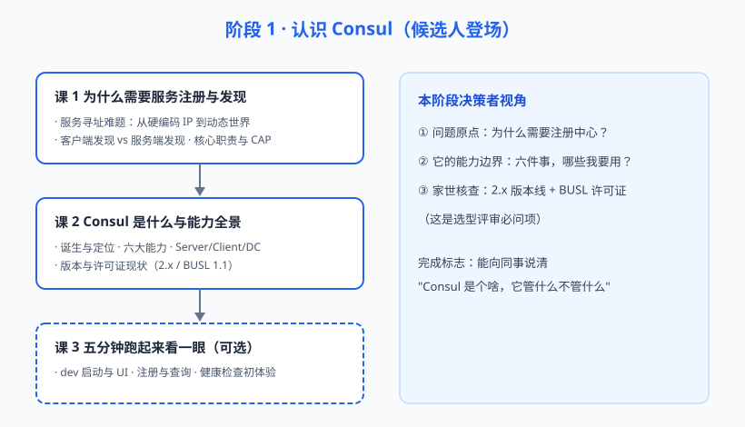

# 阶段 1：认识 Consul（候选人登场）

> 故事章节定位：小林接到选型任务，第一位候选人 Consul 登场。先别急着比，先看清楚它是谁、有什么本事、家世如何（版本与许可证）。

## 阶段目标

1. 理解"为什么需要服务注册与发现"——这是一切选型的问题原点
2. 建立 Consul 的能力全景与架构心智模型（Server/Client/DC）
3. 掌握影响决策的两条关键事实：2.x 版本现状、BUSL 1.1 许可证
4. （可选）亲手把它跑起来看一眼，建立直观感受

## 学习重点

- 服务寻址难题的演化（硬编码 → 配置中心 → 注册中心）
- 客户端发现 vs 服务端发现两种模式
- 注册中心的四大核心职责与 CAP 取舍初印象
- Consul 六大能力：服务发现、健康检查、KV 存储、多数据中心、Connect 服务网格、DNS/HTTP 双接口
- Server / Client agent / 数据中心三层架构
- 2026 年版本线与许可证现状

## 必须掌握的知识点

| 课 | 知识点 |
|----|--------|
| 课 1 | 服务寻址难题；两种发现模式；注册中心核心职责与 CAP 初印象 |
| 课 2 | 诞生与定位；能力全景；架构角色；版本与许可证现状 |
| 课 3 | dev 模式启动；注册与查询；健康检查初体验（轻量体验，可选跳过） |

## 阶段路径图

## 下一阶段预告

认识完"它是什么"还不够——选型不能只看宣传页。阶段 2 拆开引擎，逐项检验它的核心能力成色：健康检查怎么工作、一致性靠什么保证、KV 能不能当配置中心、多 DC 和服务网格是不是噱头。
