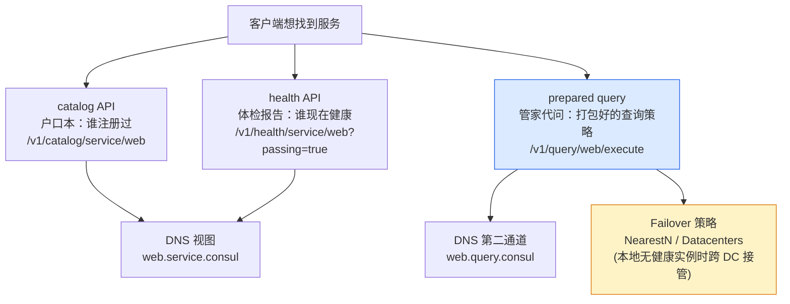
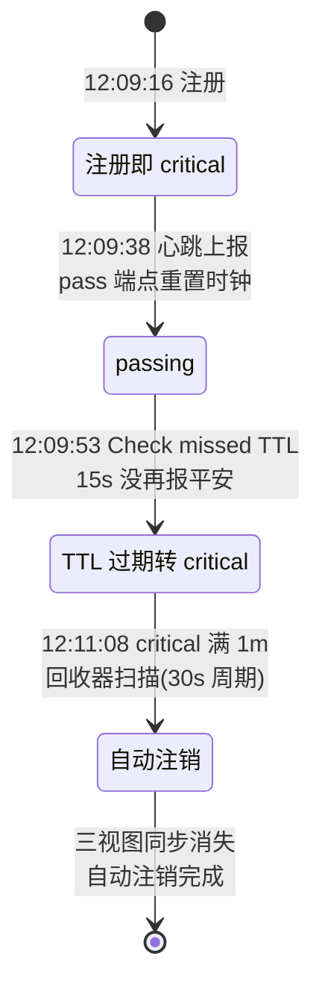
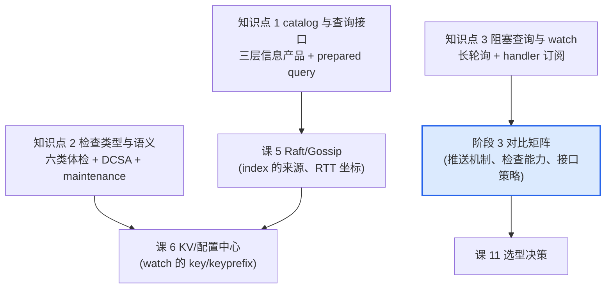

# 课 4：服务发现与健康检查机制

> **本课目标**：从"用"深入到"懂"——掌握 Consul 服务目录的查询体系、健康检查的类型与语义、阻塞查询与 watch 的变更通知机制。学完能回答评审会上必被追问的细节："unhealthy 的实例到底多久会被剔除？""客户端怎么第一时间知道服务列表变了？"
> **情节定位**：拆引擎第一站。小林带着课 3 的"眼见为实"走进评审会预演，被 CTO 老周连问三个细节，一个都答不上来。
>
> **本课所有命令与输出均为 2026-08-28 在本机（Windows 11 + Consul 2.0.2）真实实测**；文档级事实（参数上限、回收器周期等）已对照 HashiCorp 官方文档核实，文中逐一标注"实测"或"文档"来源。

---

## 第一幕：评审会上的三个追问

演示很成功，但老周没鼓掌。他翻了翻小林的验收单，只问了三个问题：

1. "你课 3 自己写的：服务宕机后 **catalog 还留着记录**。那我追问一句——一个实例 critical 了，**多久会被清出注册表**？永远不清吗？"
2. "你说客户端'查'服务。查完之后呢？轮询？间隔多少？**服务挂了，客户端多久知道**？"
3. "健康检查你只演示了 HTTP 一种。**还有哪几种？什么时候用哪种**？有没有不劳 Consul 主动去探的？"

小林张了张嘴，发现阶段 1 学的是"它有什么"，而老周问的全是"**它怎么工作、边界在哪**"。这节课就顺着这三个问题，把课 3 里每个"亲眼看到"的接口再往下拆一层——拆引擎，从自己摸过的零件开始。

## 第二幕：拆解前的三个真实障碍

备课实测在这台机器上又撞出三个坑（老周如果现场追问，每一个都够喝一壶）：

1. **"死实例会一直躺在户口本里吗？"**——课 3 的"宕机 ≠ 注销"设计看着像缺陷：注册表岂不越来越脏？实测发现了兜底机制（知识点 2），但它**默认是关闭的**。
2. **"watch 敲上去怎么打印一次就退出了？"**——实测 `consul watch -type=service -service=web` 打印一坨 JSON 就退出（exit 0）。查官方帮助才知是**文档写明的行为**：不带 handler 子进程的 watch 就是"打印一次即终止"——正宗用法是挂子进程。
3. **"创建查询还能被拒？"**——用 `PUT /v1/query` 创建 prepared query，直接被拒（`method PUT not allowed`）。创建是 **POST**，PUT 是"更新指定 ID"。API 细节只有真跑一遍才现形。

带着这三个坑往下拆。

## 第三幕：层层揭示

### 知识点 1：catalog 与查询接口

**一句话定义**：Consul 的查询体系是三层"信息产品"——catalog（户口本：注册事实）、health（体检报告：实时状态）、prepared query（预定义查询：把过滤与故障转移策略打包、以一个名字对外提供的"管家代问"）。

**直觉建立**：**商场问询台与私人管家**。问询台（catalog/health）你问什么它答什么，答完拉倒；管家（prepared query）则提前听懂了你的偏好——"只给我**健康的**、带 `demo` 标签的、**离我最近的** web 实例，本地没有就去隔壁机房找"——一次交代，终身有效，而且**管家还接 DNS 电话**（`web.query.consul`）。

**核心原理**：三层查询体系全景（课 3 已建立前两层，本课补第三层）：



前两层的分工课 3 已用实测表说透（catalog 不随健康变化，health/DNS 只吐健康实例）。本课的增量有三块：

**① 过滤参数**。health 系查询支持 `?passing=true`（只留健康实例）与 `?tag=`（标签过滤）。实测：web-1 带标签 `["demo","v1"]`，`tag=demo` 返回 1 个实例，`tag=prod` 返回 0 个。多实例环境中，标签是"按版本/环境切流"的查询抓手。

**② prepared query 的创建与执行**（全部本机实测）。创建载荷（`consul/payloads/query-web.json`）：

```json
{
  "Name": "web",
  "Service": {
    "Service": "web",
    "Failover": { "NearestN": 1 },
    "OnlyPassing": true
  }
}
```

```powershell
# 创建（注意：POST！PUT 会被拒：method PUT not allowed —— 实测踩坑）
Invoke-RestMethod -Method Post -Uri http://127.0.0.1:8500/v1/query `
  -InFile D:/projects/learning/consul/payloads/query-web.json -ContentType 'application/json'
# 返回：ID = fc088324-4231-d973-cb28-e97ee6edde98

# 按名字执行（也可按 ID 执行）
Invoke-RestMethod http://127.0.0.1:8500/v1/query/web/execute
# Service: web   实例: web-1 (127.0.0.1:8080, Tags: demo/v1)

# DNS 侧第二条通道（实测解析成功）
nslookup web.query.consul 127.0.0.1
# Name: web.query.consul   Address: 127.0.0.1
```

**③ Failover 语义**（文档核实）：`NearestN: 1` 表示"本地 DC 无健康实例时，按**网络往返时间（RTT）**从近到远尝试最多 1 个远程 DC"；`Datacenters: ["dc2","dc3"]` 则是固定顺序的静态列表；两者可混合（先 NearestN 后列表，每个 DC 只查一次）。RTT 数据来自 WAN gossip 池的网络坐标子系统（课 5 揭示）。**单 DC 的 dev 环境演示不出跨 DC 效果**——本地就是唯一的选择，这本身就是"failover 依赖多 DC 联邦"的证明。

实例级的"最近"则由 `near` 参数负责：`near: "_agent"` 会按网络坐标把**离发起查询的 agent 最近的实例排在最前**（`_ip` 则按请求来源 IP 排序），实现就近路由——"最近实例路由"的另一半拼图（文档核实，单机 dev 无距离差，不实测）。

prepared query 还有一张牌：**模板查询**（`name_prefix_match`），一个空名字的模板可兜底匹配所有 `*.query.consul` 查询，让"全部服务自动获得故障转移策略"只需一条配置（文档核实，本课不实测）。

**常见误区**：

- *"用 PUT 创建 prepared query"* —— 创建是 `POST /v1/query`；`PUT /v1/query/<id>` 是更新。实测 PUT 直接 405（method not allowed）。
- *"DNS 只能查 `web.service.consul`"* —— `web.query.consul` 是第二条 DNS 通道，背后挂着过滤与 failover 策略；把应用配置从 `.service.consul` 改成 `.query.consul` 一个后缀，就白得一套故障转移（官方教程的标准玩法）。
- *"NearestN=1 在本地就能测"* —— 不能。它依赖 WAN gossip 的 RTT 坐标排序远程 DC，单 DC 环境无从"转移"。
- *"prepared query 和直接调 health API 差不多"* —— 差在**策略的位置**：直接调 API，过滤与故障转移逻辑写死在每个客户端里；prepared query 把策略集中存在 Consul 服务端（类似 KV，按 DC 级存储），客户端只认一个名字。改策略不用改代码。

**一句话记住**：查询三层楼——catalog 看户口、health 看体检、prepared query 是管家：一次交代偏好，DNS/HTTP 都能找到它，本地没健康的还知道去哪家隔壁救急。

> 🎯 **选型视角**：prepared query 是"把服务发现策略下沉到基础设施"的代表能力——竞品里 Nacos 用权重/分组、Eureka 用 zone 亲和实现类似意图，而 Consul 的独特之处是**DNS 域名级策略**（改域名后缀即获得过滤+故障转移，存量应用零代码改造）。这条进入阶段 3 对比矩阵的"功能与接口"一行。

### 知识点 2：健康检查类型与语义

**一句话定义**：检查是"拿什么证据证明你活着"的机制——六类主干检查（TTL / HTTP / TCP / gRPC / script / Docker）加四类扩展（UDP / OSService / H2ping / Alias），每类采集证据的方式不同；配套两把运维语义钥匙：`deregister_critical_service_after`（critical 久了自动注销）与 maintenance 模式（主动下线）。

**直觉建立**：**六种体检方式**。HTTP/TCP/gRPC 是医生上门抽血（Consul 主动探测，各有探测手段）；TTL 是你**自己按时报平安**（不报就当出事——被动检查）；script 是上门做全套检查（跑一段自定义程序）；Docker 是进隔离病房里查（在容器内执行）。另有两把钥匙：critical 满期自动注销是"**死亡证明**"（执照吊销）；maintenance 是店主自己挂"**装修歇业**"的告示——不是病了，是主动歇业，两者语义完全不同。

**核心原理**：六类主干检查速查表（判定规则为官方文档规定）：

| 类型 | 探测方式 | 判定规则 | 典型场景 | 本课实测 |
|------|---------|---------|---------|---------|
| HTTP | 周期 GET 一个 URL | 2xx→passing；429→warning；其他/超时→critical | Web 服务、REST 接口 | ✅ web-1（课 3 起） |
| TCP | 周期发起 TCP 连接 | 连上→passing；连不上→critical | 只要有端口就能测：数据库、无 HTTP 的服务 | ✅ api-2 |
| TTL | 服务周期性调 API 报状态 | 超时不报→critical（**被动检查**） | 后台任务、无监听端口的服务 | ✅ api-1 |
| gRPC | 探测标准 gRPC 健康协议端点 | 协议返回健康→passing | gRPC 微服务 | 未实测 |
| script | 周期执行外部程序 | 退出码 0→passing，1→warning，其他→critical | 自定义深度检查（需显式开启，有安全面） | 未实测 |
| Docker | 通过 Docker exec API 在容器内执行脚本 | 同 script 的退出码约定 | 容器化部署 | 未实测 |

四个扩展成员一句话点名（文档核实）：**UDP**（发数据报）、**OSService**（探测操作系统服务，Windows 服务可用）、**H2ping**（HTTP/2 ping 帧）、**Alias**（**镜像**另一个节点/服务的健康状态，别名检查——"家属代答"）。

**TTL 检查三个实测细节**（本课主角，全部本机实测）：

1. **TTL 检查"生而 critical"**——注册时（心跳端点从未被调用过）状态就是 critical，文档解释：默认 critical 是为了防止服务"未经体检就进流量池"。实测 api-1 注册 2 秒后查询：`api-1-ttl: critical`。
2. **上报端点家族**：`PUT /v1/agent/check/pass/<CheckID>`（报平安，重置 TTL 时钟）、`warn`（报警告）、`fail`（报故障）。实测 pass 后 `passing` 实例计数从 1 变 2。
3. **过期语义**：最后一次 pass 之后 `TTL` 时长内没有再报，转 critical。实测日志原文：`Check missed TTL, is now critical: check=api-1-ttl`——注意 TTL 过期的日志措辞与 HTTP/TCP 失败不同（后者是 `Check is now critical`）。

**`deregister_critical_service_after`（DCSA）：自动注销**——直接回答老周第一问。字段挂在检查上：HTTP API 里叫 `DeregisterCriticalServiceAfter`（本课实测用的就是它），配置文件里用 snake_case 的 `deregister_critical_service_after`（与 web.json 中 check 字段命名风格一致）。语义：**检查 critical 状态持续超过该时长 → 该服务及其全部检查被自动注销**。三条实测+文档互证的规则：

- 最短 1 分钟（文档明文：低于 1m 的值会被钳制）
- 回收器**每 30 秒扫一次**（文档明文），所以实际注销时刻 = critical 时刻 + 配置时长 + 最多一个扫描周期。**实测完美互证**：critical 于 12:09:53，配置 1m，注销于 12:11:08——75 秒 = 60 秒配置 + 15 秒调度延迟（在 30 秒扫描周期内）
- 文档建议：配置成**远长于任何可预期可恢复故障**的时长

本课 TTL 全生命周期实测时间线（agent 日志原文，最有教学价值的一段）：



```text
12:09:31 [WARN]  agent: Check missed TTL, is now critical: check=api-1-ttl   ← 注册后15s，没人报平安
12:09:38 [INFO]  agent: Synced check: check=api-1-ttl                        ← 我调 pass 端点上报
12:09:53 [WARN]  agent: Check missed TTL, is now critical: check=api-1-ttl   ← 又过了15s，没再报
12:11:08 [INFO]  agent: Deregistered service: service=api-1                  ← 自动注销发生！
12:11:08 [INFO]  agent: deregistered service with critical health due to
                 exceeding health check's 'deregister_critical_service_after'
                 timeout: service=api-1 check=api-1-ttl timeout=1m0s         ← 日志原文点名机制
```

注销后三视图实测（注意 api-2 是同名服务的另一实例，完好保留）：`/v1/catalog/service/api` 只剩 api-2；`/v1/agent/checks` 只剩 api-2-tcp 与 web-1-http；`/v1/agent/services` 只剩 api-2 与 web-1。**自动注销按"实例"粒度执行，不牵连同服务的其他实例。**

**maintenance 模式：主动下线**。API：`PUT /v1/agent/service/maintenance/web-1?enable=true&reason=deploying-v2`。实测四连：

| 观察点 | 实测结果 |
|--------|---------|
| agent 本地检查列表 | 立刻出现新检查 `_service_maintenance:web-1`（critical），**reason 写在 Notes 字段**（`deploying-v2`），Output 为空 |
| 服务端 health 视图 | 2 秒内跟上（靠反熵对账——agent 周期性把本地状态同步给 server 的机制，课 5 展开） |
| passing 计数 / prepared query | 归 0（OnlyPassing 的查询同步摘除） |
| 关闭维护模式 | `enable=false` 后 2 秒恢复 passing——**无需等探测周期**（web-1-http 检查缓存的 passing 还有效，摘掉的只是维护检查） |

**检查粒度**：检查分**服务级**（挂在服务上，只影响该服务——本课全部实例都是）与**节点级**（挂在节点上，影响该节点全部服务；每个节点自带的 `serfHealth` 就是节点级，agent 失联它转 critical，节点上所有服务随之出健康视图）。注意（文档核实）：DCSA 只对**服务级**检查生效，节点级检查 critical 不会触发注销。

**防抖**（文档核实，一句带过）：`success_before_passing` / `failures_before_critical`（1.7+）要求连续 N 次成功/失败才翻转状态，专治网络抖动导致的检查"闪烁"。

**常见误区**：

- *"critical 了 Consul 就不管了"* —— 有兜底但**默认关闭**：不配 DCSA，critical 记录会无限期留在目录里（内存与快照随之膨胀；运维资料普遍建议显式配置并慎重选值）。
- *"DCSA 设 5 秒，故障 5 秒就清"* —— 不行：最低 1 分钟 + 30 秒扫描粒度。且设太短的真代价是**恢复慢的服务被整条注销**，恢复后要重新注册全量同步，比多躺几分钟贵得多。
- *"TTL 过期 = 服务死了"* —— TTL 只证明"没报平安"：服务进程活着但忘了埋心跳逻辑，一样 critical。TTL 适合"能自证健康"的后台任务，不适合"能被探测"的在线服务。
- *"maintenance 就是手动 critical"* —— 语义相反：critical 是"疑似故障"（被动、意外），maintenance 是"公告歇业"（主动、有 reason、可预期）。发布前把实例先摘出流量再重启（业内称"排水"）就用 maintenance：流量摘了，但全公司都知道这是你主动安排的。

**一句话记住**：六类检查各管一种体检方式（TTL 自己报平安，其余上门探）；DCSA 是 critical 满期的死亡证明（最短 1 分钟，30 秒一扫）；maintenance 是主动挂歇业告示——被动故障与主动下线，两套语义。

> 🎯 **选型视角**：检查类型的丰富度与四态语义（passing/warning/critical/maintenance）是 Consul 的基本盘——对比：Eureka 基本依赖客户端心跳（约等于只有 TTL），Nacos 提供 HTTP/TCP/自定义等。**应用级健康检查 + 自动注销 + 维护模式**三件套的完整度，进入阶段 3 对比矩阵的"健康检查"一行。

### 知识点 3：阻塞查询与 watch

**一句话定义**：blocking query 是 HTTP API 的长轮询机制——带上 `index` 参数的请求会挂起，直到数据变更或超时才返回；watch 是官方 CLI 对它的封装——变更发生时自动执行你指定的 handler 子进程。

**直觉建立**：**不挂电话的查号台**。普通查询：拨号→报结果→挂断，想知道变化只能反复拨（纯轮询）。阻塞查询：拨过去说"**这次先别挂，名单有变化你再出声**"（长轮询）；watch 则是"把我的电话登记下来，**名单一变你就打给我**"——但注意，这套"推送"的 API 语义仍是长轮询，不是服务端反向拨号的传统推送（1.10+ 的 streaming 后端是内部演进，客户端无感，见下文演进注记）。

**核心原理**：机制三要素（文档核实）：

- **`X-Consul-Index` 响应头**：请求资源当前状态的版本号。下次请求带 `?index=<上次值>`，语义是"我要等这个版本**之后**的变化"
- **`wait` 参数**：最长挂起时长，**默认 5 分钟、上限 10 分钟**，另加最多 `wait/16` 的随机抖动（错峰唤醒）
- **关键文档原话**："**阻塞请求的返回不能保证发生了变更**"——超时、不影响结果的幂等写入（写了但查询结果不变的写入）都可能让它返回。所以客户端标准姿势是：唤醒→重读→拿新 index→继续挂

本课做了**对照实验**（本机实测，两组数据直接回答老周第二问）：

**对照组（无变化）**：盯住 index=46，wait=15s——**等满整整 15.0 秒**才返回，index 仍 46，结果不变。

**实验组（有变化）**：盯住 index=46，wait=60s 挂起 → 杀掉 8080 模拟服务 → **3 秒内返回**：

```text
start:   12:15:37.936  watching index: 46  wait=60s
kill:    12:15:51.917  (Python 服务进程终止)
returned:12:15:54.852  new index: 56        ← 服务死掉后 3 秒被唤醒
                                            （比 60 秒等待上限早了 56 秒）
```

**实测彩蛋（比教科书更真实）**：实验组返回体里的 passing 计数是 **1（旧数据）**；随后重读：计数 **0**、web-1-http critical，而 **index 仍是 56、没有再变**——说明唤醒时返回的就是一份滞后于 index 的旧快照，**唤醒与读取之间存在竞态窗口**。这正印证了文档"返回不保证变更"的告诫：**阻塞查询是闹钟，不是报纸**——被唤醒后必须重读，不能直接消费返回体。

**watch 的两种形态**（实测 + 帮助文档原文）：

- **不带子命令**：`consul watch -type=service -service=web` → 打印一坨 JSON（当前状态）**随即退出**。帮助文档原文："Otherwise, the latest values are dumped to stdout and **the watch terminates**."（实测踩坑后查文档核实——不是 bug，是设计）
- **带 handler 子进程（正宗用法）**：`consul watch -type=service -service=web -- <命令>` → watch 持续运行，**每次变更把最新结果 JSON 从 stdin 喂给子进程**。实测（handler 是个往日志追加时间戳的 PowerShell 脚本，见第四幕）：

```text
13:57:17 handler fired: web-1-http = critical   ← 启动即触发一次（初始状态）
13:57:36 Python 服务重启
13:57:41 handler fired: web-1-http = passing    ← 服务恢复后约 5 秒被唤醒
```

watch 类型（本机 2.0.2 帮助文档实测）：`key` / `keyprefix` / `services` / `nodes` / `service` / `checks` / `event` 共 7 种——不只盯服务，KV、节点、事件都能订阅（课 6 用得上 `key`/`keyprefix`）。

**与纯轮询对比**（机制层的账，为阶段 3 攒证据）：

| 维度 | 纯轮询（客户端定时 GET） | 阻塞查询 / watch |
|------|------------------------|-----------------|
| 感知延迟 | 平均半个轮询间隔（间隔 10s → 平均等 5s，最坏 10s+变更传播） | 接近实时（实测 3~5 秒，瓶颈在检查周期而非查询机制） |
| 服务器开销 | N 个客户端 × 每秒 1/间隔 次全量查询，绝大多数空手而归 | N 个客户端各挂 1 条连接：长轮询占用服务端处理协程与连接（运维资料称之为泄漏风险源），但变更稀疏时总开销远低于轮询 |
| 实现复杂度 | 最低（一个定时器） | 中：要处理 index 回退重置、唤醒后重读、限速（文档给了一整套客户端实现守则） |

**演进注记**（文档核实）：Consul 1.10 起引入 **streaming backend**——对支持的端点，服务端改用"发布变更事件到主题、客户端订阅"替代长轮询，大幅减少传输量；**API 语义（index/wait）不变，客户端无感**。本课实测观察到的行为与经典长轮询一致。

**常见误区**：

- *"watch 是服务端主动推送"* —— 客户端视角像推送，机制本质是长轮询（1.10+ 的 streaming 是内部演进，对外 API 不变）。与 Nacos 2.x 的 gRPC 长连接真推送相比，机制不同、成本结构不同——阶段 3 细算。
- *"consul watch 敲上去打印一次就退了，是坏了"* —— 不带子命令就是这个行为（帮助文档明文）。要持续订阅就挂 handler：`consul watch -type=service -service=web -- 你的命令`。
- *"阻塞查询返回了，数据肯定变了、返回体肯定能用"* —— 双错：文档明确"返回不保证变更"；实测还抓到返回体是旧快照的竞态。唤醒后**重读**才是唯一正确姿势。
- *"wait 设长一点省事，比如 1 小时"* —— 上限 10 分钟，且带 wait/16 抖动；挂起的每条连接都在占服务端资源，wait 越长泄漏面越大。

**一句话记住**：阻塞查询=不挂电话的查号台（index 定版本、wait 定时限、唤醒必须重读）；watch=官方代管的订阅器，变更喂给 handler 子进程——本质仍是长轮询。

> 🎯 **选型视角**："服务列表变了，客户端多快知道、为此付出多少服务器开销"是注册中心的推送能力考题。Consul 的答案：API 层长轮询 + 内部 streaming 演进；Nacos 2.x：gRPC 长连接推送；Eureka：客户端定时全量+增量拉取（感知延迟以分钟计）。三种答案的成本结构差异，进阶段 3 对比矩阵"性能与规模"一行。

## 第四幕：实操验证（复现清单）

> 场地已备好：`consul/playground/`（web.json + api-2.json，agent 启动时自动加载）、`consul/payloads/`（api-1.json、query-web.json，供 API 调用）、`consul/tools/watch-handler.ps1`（watch 的 handler）。Consul 2.0.2 已装。

按顺序执行（每条命令均实测可跑，本机适配要点沿用课 3：新终端直接可用 `consul`；HTTP 查询用 `Invoke-RestMethod`；杀 Python 服务认 netstat 找到的监听 PID，别认启动器 PID）：

```powershell
# ── 窗口 A：启动 agent（web-1 + api-2 随配置自动注册）────────
consul agent -dev -node=win-lab -dns-port=53 -config-dir=D:/projects/learning/consul/playground

# ── 窗口 B：基线 + 注册 api-1（TTL 15s + DCSA 1m，走 HTTP API）──
python3.11.exe -m http.server 8080 --bind 127.0.0.1        # 先起服务，检查才转绿
Invoke-RestMethod -Method PUT -Uri http://127.0.0.1:8500/v1/agent/service/register `
  -InFile D:/projects/learning/consul/payloads/api-1.json -ContentType 'application/json'
# 观察：api-1-ttl 生而 critical
Invoke-RestMethod -Method PUT -Uri http://127.0.0.1:8500/v1/agent/check/pass/api-1-ttl
# 观察：passing（此时别再报平安，让 15 秒 TTL 过期）
# 之后每隔十几秒查一次，看 critical 出现（约 15 秒后）：
(Invoke-RestMethod http://127.0.0.1:8500/v1/health/checks/api) | Select CheckID,Status

# ── prepared query（趁等 api-1 过期的空档）─────────────────────
Invoke-RestMethod -Method Post -Uri http://127.0.0.1:8500/v1/query `
  -InFile D:/projects/learning/consul/payloads/query-web.json -ContentType 'application/json'
Invoke-RestMethod http://127.0.0.1:8500/v1/query/web/execute   # 返回 web-1
nslookup web.query.consul 127.0.0.1                            # 第二条 DNS 通道
nslookup -type=SRV web.query.consul 127.0.0.1                  # SRV 连端口

# ── maintenance（开→看→关）────────────────────────────────────
Invoke-RestMethod -Method PUT -Uri "http://127.0.0.1:8500/v1/agent/service/maintenance/web-1?enable=true&reason=deploying-v2"
(Invoke-RestMethod http://127.0.0.1:8500/v1/agent/checks).'_service_maintenance:web-1'  # 看 Notes 字段
@((Invoke-RestMethod "http://127.0.0.1:8500/v1/health/service/web?passing=true")).Count  # 0
Invoke-RestMethod -Method PUT -Uri "http://127.0.0.1:8500/v1/agent/service/maintenance/web-1?enable=false"

# ── 阻塞查询（对照组 → 实验组）────────────────────────────────
$idx = (Invoke-WebRequest "http://127.0.0.1:8500/v1/health/service/web?passing=true" -UseBasicParsing).Headers["X-Consul-Index"]
# 对照组：无变化，等满 15 秒
Invoke-WebRequest "http://127.0.0.1:8500/v1/health/service/web?passing=true&index=$idx&wait=15s" -UseBasicParsing
# 实验组：另开窗口杀掉 8080 监听进程（netstat -ano | Select-String ":8080.*LISTENING" 找 PID），
# 下面这条会在数秒内提前返回（index 跳变）：
Invoke-WebRequest "http://127.0.0.1:8500/v1/health/service/web?passing=true&index=$idx&wait=60s" -UseBasicParsing
# 唤醒后重读，才是真相：
@((Invoke-RestMethod "http://127.0.0.1:8500/v1/health/service/web?passing=true")).Count   # 0

# ── watch + handler（正宗用法）─────────────────────────────────
consul watch -type=service -service=web -- powershell -NoProfile -ExecutionPolicy Bypass -File D:/projects/learning/consul/tools/watch-handler.ps1
# 另开窗口重启 python 服务，几秒后看 watch-handler.log 出现 passing 记录

# ── 收摊：窗口 A/B 按 Ctrl+C；watch 窗口 Ctrl+C；杀残留（认 netstat 的 PID）──
```

**验收线**：全程大约 15 分钟（其中约 1 分 15 秒在等 api-1 自动注销——正好用它来体会"回收器 30 秒一扫"的粒度）。纸面验收：不看讲义说出——api-1 从注册到从 catalog 消失的完整时间线与每一站的日志关键字；阻塞查询"唤醒后为什么必须重读"。

## 第五幕：体系收束

老周的三连问，现在每一问都有了实测背书的答案：

| 老周的问题 | 答案 | 证据 |
|-----------|------|------|
| critical 多久被清出注册表？ | 默认永远不清；配 DCSA 后 = 配置时长（最短 1m）+ 30 秒扫描粒度（实测 1m 配置 75 秒生效） | 实测时间线 + 官方文档互证 |
| 客户端多久感知变更？ | 检查周期（本课 5s）+ 秒级唤醒（实测杀服务后 3 秒阻塞查询返回、服务恢复后 5 秒 watch 触发） | 对照实验 + handler 日志 |
| 检查有几种、怎么选？ | 六主干 + 四扩展；能被探测就用 HTTP/TCP/gRPC，能自证就用 TTL | 类型表 + 三类检查同台实测 |

课 1 的四大职责至此**全部亲手摸过**：注册/注销（课 3 + 本课自动注销）、健康检查（课 3 + 本课类型语义）、查询（课 3 三视图 + 本课 prepared query）、**变更通知（本课补完）**。本课还顺手留下两个钩子：`X-Consul-Index` 是**Raft 日志水位**（课 5 揭示 index 的真正来源与三种读模式）；`NearestN` 依赖 **WAN gossip 的 RTT 坐标**（课 5 的 gossip 两层池）。



**自测思考题**（先自己作答再看提示）：

1. 为什么官方建议 `deregister_critical_service_after` 设得"远长于任何可预期的可恢复故障"？设成刚好 1 分钟会发生什么？
   *提示：恢复慢的服务（GC 停顿、依赖抖动）会被整条注销——恢复后要重新注册、重新过"生而 critical"体检、全量同步，代价远高于在目录里多躺几分钟。自动注销是"清尸体"机制，不是"提速"机制。*
2. 阻塞查询返回了，为什么不能直接用返回体里的数据？
   *提示：两层原因——文档层面"返回不保证变更"（超时/幂等写入也返回）；实测层面抓到竞态：唤醒时返回体还是旧快照（count 1，重读才见 0）。标准姿势：唤醒→重读→新 index→再挂。*
3. `NearestN` 故障转移为什么在单 DC 的 dev 环境里演示不出来？它依赖什么？
   *提示：NearestN 按远程 DC 的网络往返时间排序择近转移，RTT 估算来自 WAN gossip 池的网络坐标子系统——单 DC 没有"远程"，也没有 WAN 池。多 DC 联邦（课 7）才是它的舞台。*

---

## 📇 概念速查卡

| 术语 | 一句话解释 | 本课角色 |
|------|-----------|----------|
| prepared query | 存在服务端的预定义查询（过滤+failover 策略打包，按名执行） | 管家代问 |
| `web.query.consul` | prepared query 的 DNS 名（区别于 `web.service.consul`） | 第二条 DNS 通道 |
| NearestN / Datacenters | failover 两策略：按 RTT 择近 / 固定列表顺序 | 跨 DC 故障转移 |
| OnlyPassing | 查询只返回全部检查 passing 的实例 | 过滤参数 |
| TTL 检查 | 被动检查：服务自己按时报状态，超时不报即 critical | api-1 实测主角 |
| `check/pass` 端点 | TTL 检查的上报接口（另有 warn / fail） | 报平安 |
| DCSA | `deregister_critical_service_after`：critical 满期自动注销（最短 1m，30 秒一扫） | 死亡证明 |
| maintenance 模式 | 主动下线：挂 `_service_maintenance:` 检查，reason 在 Notes | 歇业告示 |
| 生而 critical | 检查注册的初始状态，防未体检服务进流量池 | 实测+文档 |
| blocking query | 带 index 的长轮询：挂起至变更或超时（wait 默认 5m 上限 10m） | 不挂电话的查号台 |
| `X-Consul-Index` | 资源状态版本号（Raft 日志水位，课 5 展开） | index 参数来源 |
| 闹钟不是报纸 | 唤醒后必须重读——返回不保证变更、可能是旧快照 | 实测竞态教训 |
| watch + handler | 正宗用法：变更时把结果 JSON 喂给子进程 | 订阅器 |
| watch 无子命令 | 打印一次即终止（帮助文档明文） | 实测踩坑 |
| streaming backend | 1.10+ 的订阅推送后端，替代长轮询，API 不变 | 演进注记 |

## 🚀 下一批接力提示词

> 学完本课后，**复制下面这段文字发给 AI**，即可无缝进入下一批（课 5：一致性成色——Raft、Gossip 与三种读模式）：

```
继续学 Consul。我的学习档案在 consul/00-学习档案.md，
刚学完阶段 2《核心能力拆解》的课《服务发现与健康检查机制》
知识点（catalog 与查询接口、健康检查类型与语义、阻塞查询与 watch），
请按大纲继续讲解下一批知识点。
```

## 🧭 课程导航

- [上一课：课 3 五分钟跑起来看一眼](../1-认识Consul/lessons/lesson-03-五分钟跑起来看一眼.md)
- [下一课：课 5 Raft 与 Gossip 一致性成色](./lesson-05-Raft与Gossip一致性成色.md)
- [返回课程目录](../../02-课程目录.md)
