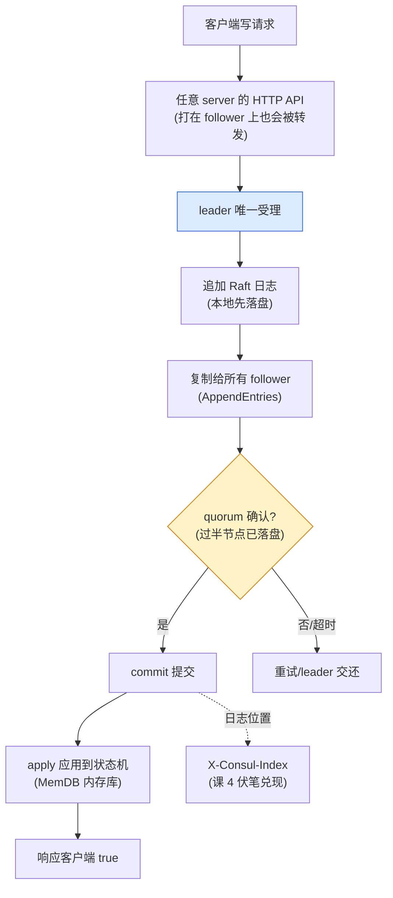
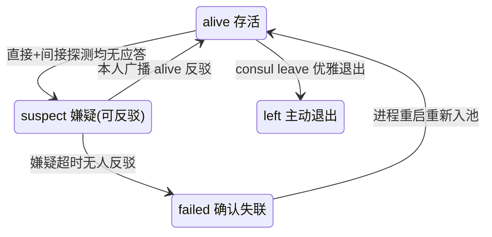
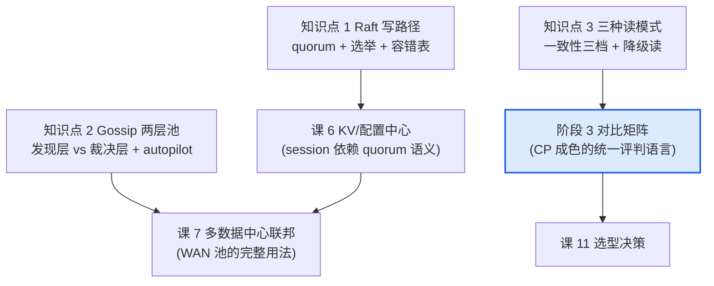

# 课 5：Raft 与 Gossip 一致性成色

> **本课目标**：拆开 Consul 一致性架构的两根支柱——Raft（强一致写路径与仲裁）与 Gossip（成员管理与故障检测），掌握三种读模式的取舍。学完能回答评审会上最硬核的两个问题："脑裂时会怎样？""我读到的到底是不是最新数据？"
> **情节定位**：引擎第二站。小林带着课 4 的"查询体系"走进老周办公室，被两个分布式系统经典问题正面击中——这次他不能再用"官方文档说"搪塞。
>
> **本课所有命令与输出均为 2026-08-28 在本机（Windows 11 + Consul 2.0.2）真实实测**：在一台机器上用三组独立端口跑起了 3 节点 Raft 集群，外加 1 个第二数据中心节点，完整实测了选举、杀 leader、quorum 丢失、节点回归、双 DC 联邦全流程；文档级事实（默认参数、容错表、读模式语义）已对照 HashiCorp 官方文档逐项核实，文中标注"实测"或"文档"来源。

---

## 第一幕：评审会上的三个灵魂拷问

小林把课 4 的查询体系讲完，老周合上笔记本，只问了三个问题：

1. "你说 Consul 是 CP。我机房里 3 台 server，交换机一分两半，**少数派那边会发生什么**？会不会两边各选一个'大脑'、各自接受写入、数据越写越分裂？"
2. "业务方问我：**'我读到的服务列表是最新的吗？'** 你怎么回答？读接口就一个 GET，'新'到什么程度是个准话吗？"
3. "最后一个是采购问题：**为什么所有人都说 server 要 3 台或 5 台？** 我加预算上 4 台，容错能力不是更强吗？"

前两问是分布式系统的经典难题（脑裂与读一致性），第三问是它的数学推论。这节课用一套真实跑在本机的 3 节点集群，把三个问题全部实测回答——包括真刀真枪杀掉 leader、亲手制造 quorum 丢失。

## 第二幕：拆解前的三个真实障碍

搭实验集群的过程本身就撞出三个坑（每一个都比想象中有料）：

1. **Consul 2.0 在 Windows 上默认起不来**。3 节点配置就绪、启动，齐刷刷报错：`fail to open write-ahead-log: failed initializing meta DB: sync ...raft\wal: Access is denied.`。排查确认与磁盘、权限、路径无关（C 盘复现同样失败），根因是 **Consul 1.21+/2.0 把 Raft 日志存储默认后端换成了 WAL LogStore（Write-Ahead Log，写前日志后端），它在 Windows 上初始化目录同步时被拒**。官方文档给出了标准回退方案：`raft_logstore { backend = "boltdb" }`，切换后数据目录里的 `raft/wal/` 目录变成单个 `raft.db` 文件，一切正常。这是一个真实的生产级兼容坑——Windows 用户升级后大概率撞上（本机 Win11 与网上论坛 Consul 1.21.3 案例两个独立环境均复现）。
2. **杀掉的 leader 从 raft peers 里"消失"了**。硬杀 node1 后查看 `consul operator raft list-peers`，列表里只剩 2 个节点——直觉上"死掉的成员应该还躺在列表里"。翻日志才发现是 autopilot 在 +19.7 秒时执行了 `Attempting removal of failed server`，把死节点移出了投票集合。这个"意外发现"后来成了本课最有价值的知识点之一（见知识点 2 的分工实证）。
3. **刚写入的 index 是 34，Commit Index 却显示 33**。连续快写 3 条后立即查询，Commit Index 显示 40（落后刚写的 3 条），3 秒后再查变成 43——追平了。差点把这个"差一"当成 bug 写进讲义：其实 `list-peers` 的 Commit Index 是 **leader 视角各节点已确认复制的位置（match index）**，跟随者的 ACK 是异步批量的，写入返回成功后（已过 quorum）这个统计视图还需要一拍才追平。

带着这三个坑往下拆。

## 第三幕：层层揭示

### 知识点 1：Raft 写路径与 quorum

**一句话定义**：Consul 的所有写操作走同一条强一致通道——leader 唯一受理、追加 Raft 日志、过半数节点落盘确认（quorum）、提交后应用生效；凑不齐 quorum 时宁可拒绝写入，也不冒脑裂风险。

**直觉建立**：**过半数签字才生效的公文制度**。任何文件（写请求）只能交给总经理（leader）签发；总经理把文件抄送给过半数副总（quorum 复制）、各自签字存档（落盘）后文件才算正式生效（commit）；生效后才下发全公司执行（apply）。总经理失联了，副总们开会选新总经理——当选必须拿到**过半选票**；如果连过半数的人都凑不齐，公司宁可**停发一切文件**（拒绝写入），也绝不允许出现两个"总经理"各自签发。

**核心原理**：Raft 用"任期（term）+ 多数派"两个机制保证同一时间至多一个有效 leader：



leader 不是天生的：集群启动或 leader 失联时，follower 等待一个**随机化的心跳超时**（Consul 默认 `raft_multiplier=5`，对应 ElectionTimeout 5 秒——文档；超时随机化后落在 5~10 秒区间，这是 Raft 协议避免多节点同时拉票瓜分选票的标准做法），先当 candidate（候选人，follower 与 leader 之间的选举过渡态）拉票，拿到**过半选票**才转正。Consul 还启用了 **pre-vote 预投票**机制：正式拉票前先探口风，避免一个状态落后的节点贸然发起选举把健康的 leader 拉下马。

**为什么是 3 或 5 台**：quorum = (N/2) + 1，容错 = N - quorum。官方容错表（文档）：

| server 数 | quorum | 容错台数 | 点评 |
|-----------|--------|----------|------|
| 1 | 1 | 0 | 单点，仅开发用 |
| 2 | 2 | 0 | **两台反而零容错**：挂任何一台都丢 quorum |
| 3 | 2 | 1 | 最小生产配置 |
| 4 | 3 | 1 | **比 3 台多花一台，容错不变**，写延迟还更高 |
| 5 | 3 | 2 | 容错翻倍，值得加钱 |

偶数的问题一目了然：4 台的 quorum 是 3，挂 2 台就瘫——容错能力和 3 台完全一样；多出的第 4 台只增加复制开销，不增加容错。**要加就加到下一个奇数台阶**。

**实测证据**（3 节点集群，node1/node2/node3 端口组 8300/8310/8320）：

① **集群引导与首次选举**。三个节点通过 LAN gossip 互相发现，第三个节点入池瞬间触发 bootstrap：

```text
14:45:41.988 [INFO] agent.server: Found expected number of peers, attempting bootstrap
14:45:45.262 [WARN] agent.server.raft: heartbeat timeout reached, starting election
14:45:45.262 [INFO] agent.server.raft: entering candidate state: node="Node at 127.0.0.1:8300 [Candidate]" term=2
14:45:45.263 [INFO] agent.server.raft: pre-vote successful, starting election: term=2 tally=2 refused=0 votesNeeded=2
14:45:45.268 [INFO] agent.server.raft: election won: term=2 tally=2
14:45:45.268 [INFO] agent.server.raft: entering leader state: leader="Node at 127.0.0.1:8300 [Leader]"
14:45:45.268 [INFO] agent.server: New leader elected: payload=node1
```

从第三节点入池到 leader 诞生共 **3.3 秒**；`votesNeeded=2`、`tally=2`——3 个投票者需要 2 票过半，**quorum 公式直接写在日志里**。

② **写路径与 index 的对应**。往 follower（node2，端口 8510）发写请求，验证"任意 server 可收、leader 统一处理"：

```powershell
# 经 follower node2 写入
Invoke-WebRequest -Method Put http://127.0.0.1:8510/v1/kv/raft/demo2 -Body 'second-write'
# body: true

# 读响应头（curl 原始输出）——课 4 埋的伏笔在这里兑现
X-Consul-Index: 34
X-Consul-Knownleader: true
X-Consul-Lastcontact: 0

# 读到的 KV 条目
"Key":"raft/demo2","CreateIndex":34,"ModifyIndex":34
```

**X-Consul-Index 34 == 条目的 ModifyIndex 34**——课 4 说"index 是 Raft 日志水位"，此刻有了直接证据：每条写入占据 Raft 日志的一个位置，那个位置号就是 index。再写 3 条（index 41/42/43），立即查 `list-peers` 显示 Commit Index 40，3 秒后追平 43——各节点的复制确认视图异步收敛，但"Trails Leader By 0 commits"始终成立。

③ **杀 leader 实测故障转移**。硬杀 node1（`Stop-Process -Force`，模拟断电），在幸存节点上轮询：

```text
14:48:44.661 [INFO] agent.server.memberlist.lan: memberlist: Suspect node1 has failed, no acks received
14:48:48.182 [INFO] agent.server.serf.lan: serf: EventMemberFailed: node1 127.0.0.1
14:48:51.808 [WARN] agent.server.raft: rejecting pre-vote request since we have a leader: from=127.0.0.1:8320
14:48:51.846 [WARN] agent.server.raft: heartbeat timeout reached, starting election: last-leader-addr=127.0.0.1:8300
14:48:51.847 [INFO] agent.server.raft: pre-vote successful, starting election: term=3 tally=2 refused=1 votesNeeded=2
14:48:51.861 [INFO] agent.server.raft: election won: term=3 tally=2
14:48:51.861 [INFO] agent.server: New leader elected: payload=node2
```

API 轮询测得**新 leader 诞生于杀掉旧 leader 后 11 秒**（与 5~10 秒随机选举超时 + 投票一轮的文档口径吻合）。日志里还有两个彩蛋：node3 曾抢先发起 pre-vote 被 node2 拒绝（`rejecting pre-vote request since we have a leader`——leader 租约还没过期）；随后 node2 自己的超时到点，一击当选。选举完成后写入立即恢复，实测 `PUT /v1/kv/raft/after-failover` 返回 `true`。

**常见误区**：

- **"4 台比 3 台更稳"**——数学不成立（见容错表）；真要加就加到 5。
- **"leader 挂了会丢数据"**——已 commit 的条目在过半节点上落了盘，新 leader 一定拥有全部已提交数据；丢的只是"尚未过半确认"的极小窗口。
- **"脑裂会写坏数据"**——恰好相反：少数派凑不齐 quorum，直接拒写（下个知识点实测给你看 500 报错）。脑裂在 Consul 里的代价是**少数派不可用**，不是数据分裂。

**适用边界**：这套强一致是有账单的——写延迟对 RTT 敏感（官方建议 server 间平均 RTT < 50ms）；quorum 丢失期间全部写入与强一致读停摆；每个 DC 一套独立的 Raft（跨 DC 不共享 quorum，课 7 展开）。

### 知识点 2：Gossip 两层池（LAN / WAN）

**一句话定义**：Gossip 是 Raft 之外的"民间情报网"——LAN 池（8301 端口）管同一数据中心内**全体 agent** 的成员管理与秒级故障检测，WAN 池（8302 端口）把各数据中心的 **server** 串成一张全局网并维护网络坐标；它只负责"发现"（谁可能挂了、坐标多远），不做"裁决"。

**直觉建立**：**公司微信群 vs 正式签报系统**。群里谁半小时没冒泡，几秒内就有人 @ 他、找他邻居打听（SWIM 探测——一套分布式"谁还活着"探测算法）；但人员离职生效、公文签发，还是要走签报系统投票（Raft）。群里传得快，但"群里说他失踪了"不等于"公司已注销他的工位"——**情报归 gossip，裁决归 Raft**。

**核心原理**：Consul 内嵌 Serf 库（基于 SWIM 协议 + HashiCorp 的 Lifeguard 增强），分成两张池：

| 维度 | LAN 池 | WAN 池 |
|------|--------|--------|
| 端口 | 8301（TCP+UDP） | 8302（TCP+UDP） |
| 范围 | 单个数据中心内 | **全局唯一**，跨数据中心 |
| 成员 | 全体 agent（client + server） | **只有 server** |
| 职责 | 成员发现、分布式故障检测、事件广播 | 跨 DC server 互联、网络坐标（RTT 估算） |
| 检测节奏 | 快（实测秒级） | 慢（实测约 36 秒标记 failed） |

SWIM 的故障检测是一套防误报的组合拳：每秒随机挑一个成员直接探测（probe_interval 1s，文档）；没应答不急着定罪，**再请 3 个随机成员间接探测**（3 是 memberlist 库默认的间接探测数；防止探测者自己网络抖动）；间接也没回音才标记 **suspect（嫌疑）**——嫌疑期内节点本人可以"反驳"（活着就广播 alive 消息）；嫌疑超时才最终标记 **failed**。



**实测证据**（与知识点 1 同一套集群）：

① **LAN 故障检测时间线**（硬杀 node1 后，node2 视角）：

```text
14:48:41.013  node1 进程被硬杀
14:48:44.661  Suspect node1 has failed, no acks received   ← +3.6s 进入嫌疑
14:48:48.182  serf: EventMemberFailed: node1               ← +7.2s 定罪 failed
14:49:00.663  autopilot: Attempting removal of failed server ← +19.7s 裁决层动手
```

**gossip 用 7.2 秒"发现"，Raft 体系用 19.7 秒才"裁决"（autopilot 移出投票集合）——两层各自按自己的节奏工作**。第二次实验（杀 node3）复测为 +6.7 秒，稳定在 7 秒量级。

② **"谁说了算"的分工实证**。node1 在 gossip 里已 failed（+7.2s），但 `consul operator raft list-peers` 里它**仍然躺在投票集合中**——直到 autopilot 在 +19.7s 执行 `RemoveServer` 才移出。gossip 的成员视图（`consul members`）与 Raft 的投票集合（`list-peers`）是**两本账**：前者是情报（快、但只是情报），后者是裁决依据（quorum 按投票集合算）。autopilot 是把两本账对齐的中间人（默认开启，文档：CleanupDeadServers=true，移除后进 left 态不再计入 quorum）。

③ **WAN 池实测**（第二数据中心 dc2 的 server 通过 `retry_join_wan` 加入）：

```text
$ consul members -wan -http-addr=http://127.0.0.1:8510
Node            Address         Status  Type    DC
dc2-server.dc2  127.0.0.1:8332  alive   server  dc2
node1.dc1       127.0.0.1:8302  alive   server  dc1
node2.dc1       127.0.0.1:8312  alive   server  dc1
node3.dc1       127.0.0.1:8322  alive   server  dc1
```

WAN 池四个成员**全是 server**（client 不入 WAN 池）；而 LAN 池按 DC 隔离——dc2 的 `consul members` 只看得到它自己。dc2 直接查 dc1 的目录（`/v1/catalog/nodes?dc=dc1`）成功返回 3 个节点，这就是 WAN 转发。**课 4 prepared query 的 NearestN 择近转移，数据源就是 WAN 池的网络坐标子系统**（实测 `/v1/coordinate/datacenters` 返回两个 DC 的坐标）——单 DC 环境演示不出 failover 的原因至此完全揭晓。

④ **优雅退出 vs 硬杀的对照**（收尾实验）：`consul leave` 让节点广播"我要走了"，gossip 立即标 `left`、Raft 投票集合**当场**移除该 peer；硬杀则是 `failed` + peer 滞留等 autopilot 清理。运维启示：**计划内下线永远用 leave，别直接 kill**。

**常见误区**：

- **"gossip 说挂了就是挂了"**——gossip 只更新成员视图，Raft 的 quorum 才是提交裁决；两者之间靠 autopilot 对齐（有秒级时间差）。
- **"成员列表 = Raft 投票集合"**——两本账。实测里回归的 node1 先以 **Voter=false（非投票者）**身份进集群，等 `ServerStabilizationTime`（默认 10 秒，文档）稳定期过后才转正为 Voter——新/回归节点不立即有投票权，防止落后节点扰乱 quorum。
- **"WAN 池会同步数据"**——不会。WAN gossip 只传成员与坐标信息；跨 DC 的目录查询是**按需转发**（RPC），KV 数据更是完全不做跨 DC 复制（课 7 展开）。

**适用边界**：gossip 的"快"以最终一致换来的——suspect 状态有反驳机制、Lifeguard 防止本机过载时误报邻居，但极端网络抖动下仍可能有短暂误判；它是**发现层**，真正的容错裁决交给 Raft 的票数。

### 知识点 3：三种读模式（default / consistent / stale）

**一句话定义**：Consul 把"读到多新"做成了可选参数——default（默认，几乎强一致，存在 leader 更替瞬间的极小旧读窗口）、consistent（读前强制 quorum 确认，线性一致，代价是多一轮往返）、stale（任意 server 可答，无 leader 也能读，可用性优先）。

**直觉建立**：**查户口的三种姿势**。default = 去户政窗口问（基本是最新档，但万一窗口刚好在换班，可能给你旧档）；consistent = 要求窗口**当场和档案室核对原件**再回答（绝对准确，多花时间）；stale = 看路边的公告栏（贴的是几十毫秒前的快照，可能旧，但公告栏到处都有、**从不关门**——哪怕户政系统瘫痪了它还在）。

**核心原理**：三种模式一张权衡表（语义来自官方 API 文档，实测见下）：

| 维度 | default | consistent | stale |
|------|---------|------------|-------|
| 一致性 | 几乎强一致；leader 租约窗口内旧 leader 可能答旧值（仅读受影响，写不受） | 线性一致，无任何条件 | 最终一致，一般与 leader 差 50ms 内，**但无上限** |
| 谁来答 | leader 或"最近联系过 leader"的 follower | leader（读前先向 quorum 确认自己仍是 leader） | **任意 server**（含无 leader 时） |
| 延迟 | 基准 | 多一轮 quorum 往返，最高 | 最低（本地状态直答） |
| 无 quorum 时 | 500 No cluster leader | 500 No cluster leader | **200 照常答** |
| 典型用途 | 大多数 API 读 | 分布式锁、选主、资金类操作 | 服务发现、DNS（DNS 默认就是 stale） |

表中的"线性一致"（linearizability）给个白话定义：任何一次读，效果都等同于读到**此刻全局唯一的最新版本**——哪怕集群正在换 leader 也不破例。default 的"极小窗口"来自 **leader 租约**（LeaderLeaseTimeout，默认配置下 2500ms，文档）：旧 leader 与多数派失联后的租约残余期内，它理论上还能按旧状态回答读请求——这也是"Consul 是 CP"这句话需要打的折扣：**写的强一致无折扣，读要看你选的模式**。

**实测证据**：

① **quorum 丢失读矩阵**（本课压轴实验）。杀掉 node3 后集群只剩 1/2 投票者（quorum 不可达），对幸存节点 node2 发四类请求：

```powershell
# 1) default 读 → 拒绝
GET /v1/kv/raft/demo          → [HTTP 500] No cluster leader
# 2) consistent 读 → 拒绝
GET /v1/kv/raft/demo?consistent → [HTTP 500] No cluster leader
# 3) 写入 → 拒绝
PUT /v1/kv/raft/no-quorum     → [HTTP 500] No cluster leader
# 4) stale 读 → 照常返回数据
GET /v1/kv/raft/demo?stale    → [HTTP 200] [{"Key":"raft/demo","Value":"aGVsbG8tcmFmdA==",...}]
```

**少数派"集体闭嘴"保护一致性，stale 模式守住最后一线读可用性**——CP 的完整含义在此一目了然。重启 node3 后 quorum 恢复（2/2），写入立即恢复 `true`；再重启 node1，它以非投票者身份回归、数据追平后转正，集群回到 3 voter 满血状态。

② **延迟微基准**（.NET HttpClient 实测 200 次取均值，本机回环、看相对关系）：

```text
stale    @ leader    0.17 ms/req   ← 最快（本地状态直答）
stale    @ follower  0.20 ms/req
default  @ leader    0.25 ms/req
consistent @ leader  0.29 ms/req   ← 多一轮 quorum 确认
default  @ follower  0.37 ms/req   ← follower 上还叠加了转发/校验开销
```

回环网络把绝对差压到了亚毫秒级；真实网络下 consistent 的额外往返、default 转发的开销会按 RTT 放大。**排序稳定：stale < default < consistent**（同一节点上）。

③ **陈旧度自检的抓手**：响应头 `X-Consul-LastContact`（该 server 距上次被 leader 联系过了多少毫秒）与 `X-Consul-KnownLeader`（是否已知 leader）——客户端可以拿它给 stale 读自行设阈值兜底（课 4 阻塞查询时已见过这两个头，此刻语义完整了）。

**常见误区**：

- **"Consul 是 CP，所以读到的都是最新的"**——写是强一致，读不是：default 有租约窗口，要线性一致必须显式加 `?consistent`。
- **"stale 读到旧数据是 bug"**——是明码标价的设计（无上限陈旧）；嫌旧就用 `X-Consul-LastContact` 自行判断。
- **"DNS 和 HTTP API 一个一致性"**——DNS 查询默认走 stale（服务发现天然容忍秒级陈旧），这正是课 3 DNS 秒级更新、且无需指定模式的底层原因。

**适用边界**：服务发现选 stale/default 足够（实例列表容忍百毫秒级陈旧，换高可用很划算）；**分布式锁、选主、看钱的数据必须 consistent**（或配合 session 机制，课 6 展开）；集群失去 quorum 的窗口期，stale 是唯一还能用的读通道——把它留作"降级读"的应急预案。

## 第四幕：实操验证（复现清单）

以下 2026-08-28 全部实测通过。配置文件在 `consul/playground/cluster/`（node1/node2/node3/dc2 四份 JSON），单机多节点的关键是**端口组错开**：

```json
{
  "datacenter": "dc1", "node_name": "node1",
  "server": true, "bootstrap_expect": 3,
  "data_dir": "D:/projects/learning/consul/playground/cluster/data/node1",
  "bind_addr": "127.0.0.1",
  "retry_join": ["127.0.0.1:8301", "127.0.0.1:8311", "127.0.0.1:8321"],
  "raft_logstore": { "backend": "boltdb" },
  "ports": { "http": 8500, "dns": 8600, "server": 8300,
             "serf_lan": 8301, "serf_wan": 8302, "grpc": 8502, "grpc_tls": 8503 }
}
```

node2/node3 同款改端口组（8510/8311/8312/8310、8520/8321/8322/8320）；dc2 节点改 `datacenter: dc2`、`bootstrap_expect: 1`、`retry_join_wan: [三个 WAN 端口]`、端口组 8530/8331/8332/8330。**Windows 必须加 `raft_logstore` 回退 boltdb**（见第二幕障碍 1）。

```powershell
# 启动三个节点（三个终端，每个一条）
consul agent -config-file D:/projects/learning/consul/playground/cluster/node1.json
consul agent -config-file D:/projects/learning/consul/playground/cluster/node2.json
consul agent -config-file D:/projects/learning/consul/playground/cluster/node3.json

# 集群体检
consul operator raft list-peers -http-addr=http://127.0.0.1:8500   # 谁是 leader、Commit Index
consul members -http-addr=http://127.0.0.1:8500                     # LAN gossip 成员
consul info -http-addr=http://127.0.0.1:8500                        # term / commit_index / state

# 写路径验证（打 follower，看 index 对应）
Invoke-WebRequest -Method Put http://127.0.0.1:8510/v1/kv/raft/demo -Body 'hello-raft'
Invoke-WebRequest http://127.0.0.1:8520/v1/kv/raft/demo             # 看 X-Consul-Index 头

# 杀 leader（leader 不一定是 node1——先查当前 leader 是谁）
Invoke-RestMethod http://127.0.0.1:8500/v1/status/leader
# 返回形如 "127.0.0.1:8300"（leader 的 server RPC 端口），对照端口组即知是哪个节点
# 再经 netstat -ano 找到该节点任一监听端口（如它的 HTTP 端口）的 PID
Stop-Process -Id <pid> -Force
# 然后轮询 http://127.0.0.1:8510/v1/status/leader 观察选举用时

# quorum 丢失矩阵（再杀一个节点后）
curl.exe -s -w "`n[HTTP %{http_code}]`n" "http://127.0.0.1:8510/v1/kv/raft/demo"
curl.exe -s -w "`n[HTTP %{http_code}]`n" "http://127.0.0.1:8510/v1/kv/raft/demo?consistent"
curl.exe -s -w "`n[HTTP %{http_code}]`n" "http://127.0.0.1:8510/v1/kv/raft/demo?stale"

# 双 DC（启动 dc2 节点后）
consul members -wan -http-addr=http://127.0.0.1:8510                # WAN 池（只收 server）
Invoke-RestMethod "http://127.0.0.1:8530/v1/catalog/nodes?dc=dc1"   # 跨 DC 查询

# 收尾：优雅退出（顺序 leave，观察 peers 逐个移除）
consul leave -http-addr=http://127.0.0.1:8530
consul leave -http-addr=http://127.0.0.1:8500
consul leave -http-addr=http://127.0.0.1:8520
consul leave -http-addr=http://127.0.0.1:8510
```

## 第五幕：体系收束

老周的三个问题，现在每个都有实测背书的答案：

| 老周的问题 | 答案 | 证据 |
|-----------|------|------|
| 脑裂会怎样？ | 少数派凑不齐 quorum：写、default 读、consistent 读全部 500 拒绝，**宁可不可用，绝不双头写**；stale 读是唯一留着的降级通道 | quorum 丢失矩阵实测 |
| 读到的是最新的吗？ | 分三档：default 几乎最新（租约窗口）、consistent 绝对最新（quorum 确认）、stale 可能旧（一般 50ms 内、无上限）；**"新"是可以选的参数，不是默认恩赐** | 官方文档 + 延迟微基准 |
| 为什么 3 或 5 台？ | quorum=(N/2)+1：4 台与 3 台容错同为 1，白花一台钱；5 台容错 2。偶数不增加容错只增加复制开销 | 官方容错表 |

至此"拆引擎"过了最硬核的一站：**Raft 管裁决（写路径与 quorum）、gossip 管情报（成员与坐标）、读模式管分寸（一致性三档）**。三个知识点还各自留下了钩子：



课 1 的 CAP 初印象在这里落成了具体机制：**Consul 用"少数派停摆"兑现 C，用"stale 读"给 A 留了一扇小窗**——这句话将原样带进阶段 3，成为横向对比五个候选人的统一评判语言。

**自测思考题**（先自己作答再看提示）：

1. 预算只够 4 台 server，运维说"挂 1 台无所谓"。他说得对吗？4 台到底比 3 台强在哪、弱在哪？
   *提示：容错同为 1 台（quorum 3）。强的：多一台落盘副本、读可分摊；弱的：写要多复制一份、quorum 比 3 台的更难凑（3/4 vs 2/3）。若第 2 台也挂，两边同样瘫。通常建议：要么 3 要么 5，别停在偶数。*
2. gossip 7 秒就标记 node1 failed 了，为什么 Raft 又等了约 11 秒才选出新 leader、autopilot 更是等到 19.7 秒才移除死节点？这三层为什么不同步？
   *提示：三个协议三种时钟。SWIM 的嫌疑期（约几秒）管"发现"；Raft 的随机选举超时（5~10 秒 + pre-vote）管"稳妥换帅"——宁慢勿乱，防止乱选举引发抖动；autopilot 的稳定期（ServerStabilizationTime 10 秒等）管"移除非投票者前再确认"。快有快的用处，慢有慢的道理。*
3. 集群失去 quorum 期间，监控面板还在通过 `?stale` 读服务列表"苟着"。这个设计有什么隐患？业务侧应该怎么兜底？
   *提示：stale 无陈旧上限——你看到的可能是很久以前的快照，而注册中心此刻已不能写入（新实例注册不上、下线实例删不掉）。兜底：监控 `X-Consul-LastContact` 头设阈值告警；把"stale 能读"当作逃生通道而非常态运行模式；quorum 恢复是第一优先级事故响应。*

---

## 📇 概念速查卡

| 术语 | 一句话解释 | 本课角色 |
|------|-----------|----------|
| Raft | 多数派共识协议：唯一 leader 收写、过半确认才提交 | 裁决层 |
| quorum | 过半数 = (N/2)+1；提交与选主的最低票数 | 本课数学主线 |
| leader / follower / candidate | Raft 三角色；candidate 是选举过渡态 | 选举流程 |
| pre-vote | 正式拉票前的预投票，落后节点先探口风 | 实测日志可见 |
| bootstrap_expect | 集群引导：凑齐 N 个 server 才初始化 Raft | 3 节点实验的起点 |
| X-Consul-Index | Raft 日志位置（课 4 伏笔，本课实测兑现） | 写路径证据 |
| raft_multiplier | Raft 时序缩放因子，默认 5（ElectionTimeout 5s） | 文档 |
| gossip / SWIM | 流言式成员协议：随机探测 + 间接确认 + 嫌疑反驳 | 发现层 |
| suspect → failed | SWIM 两级定罪：嫌疑（可反驳）→ 确认失联 | +3.6s → +7.2s 实测 |
| LAN 池（8301） | DC 内全体 agent 的成员网（client + server） | 故障检测主力 |
| WAN 池（8302） | 全局 server 网：跨 DC 互联 + 网络坐标 | NearestN 数据源 |
| 网络坐标 | WAN gossip 维护的 RTT 估算体系 | 课 4 伏笔兑现 |
| autopilot | 自动运维：清理死节点（→left）、新节点稳定期后转正 | 两本账的中间人 |
| ServerStabilizationTime | 新/回归节点健康稳定 10 秒后才获投票权（默认） | node1 回归实测 |
| leader 租约 | LeaderLeaseTimeout（默认 2.5s）：旧 leader 短窗内或答旧读 | default 的"折扣" |
| default / consistent / stale | 读一致性三档：几乎强一致 / 线性一致 / 无上限陈旧 | 本课第三主线 |
| `No cluster leader` | 无 quorum 时写与强一致读的拒绝理由（HTTP 500） | 实测错误文本 |
| WAL LogStore | Consul 1.21+/2.0 默认 Raft 日志后端；Windows 需回退 boltdb | 本机环境坑 |

## 🚀 下一批接力提示词

> 学完本课后，**复制下面这段文字发给 AI**，即可无缝进入下一批（课 6：KV 存储与配置管理）：

```
继续学 Consul。我的学习档案在 consul/00-学习档案.md，
刚学完阶段 2《核心能力拆解》的课《Raft 与 Gossip 一致性成色》
知识点（Raft 写路径与 quorum、Gossip 两层池、三种读模式），
请按大纲继续讲解下一批知识点。
```

## 🧭 课程导航

- [上一课：课 4 服务发现与健康检查机制](./lesson-04-服务发现与健康检查机制.md)
- [下一课：课 6 KV 存储与配置管理](./lesson-06-KV存储与配置管理.md)
- [返回课程目录](../../02-课程目录.md)
