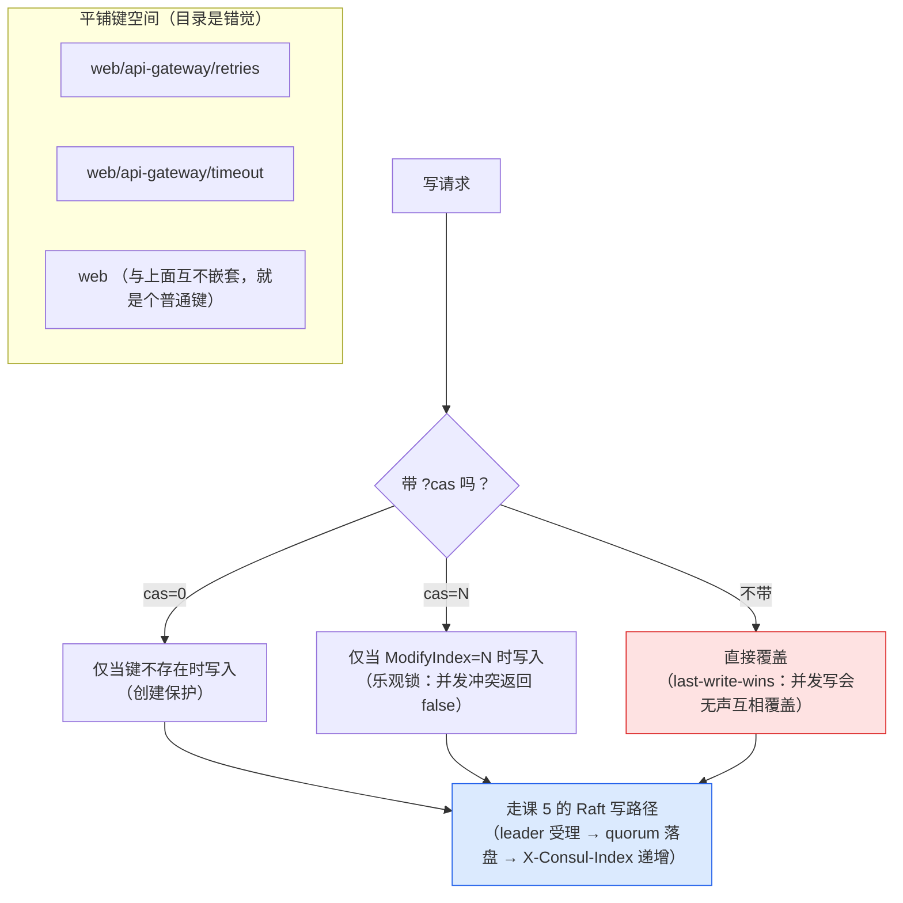
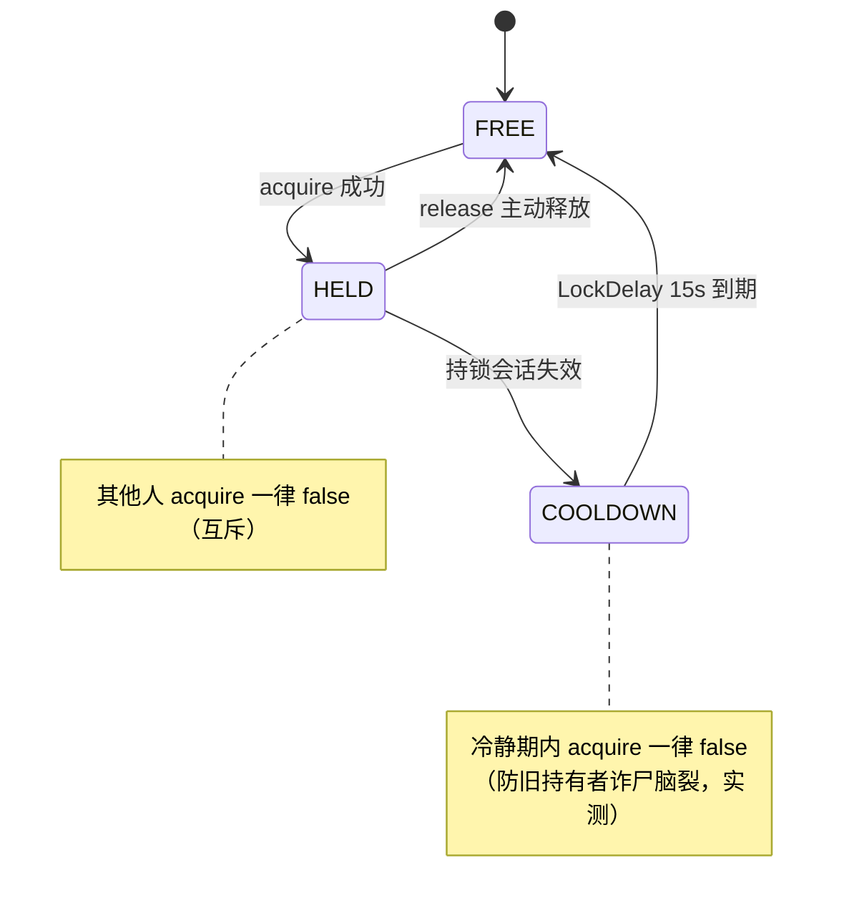
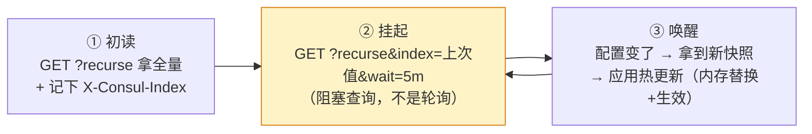
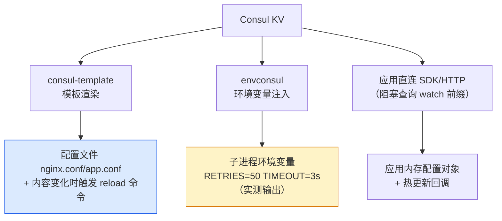
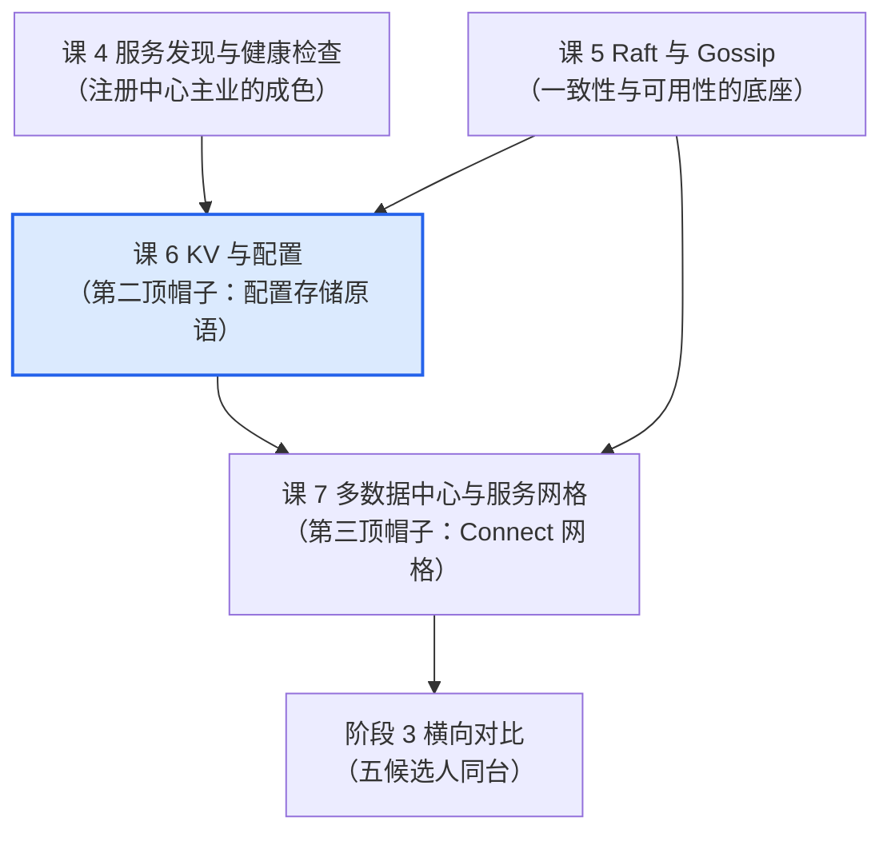

# 课 6：KV 存储与配置管理

> **本课目标**：拆开 Consul 的第二大能力——KV 存储与配置管理。掌握 CRUD/CAS/锁/事务四组核心原语，实测"KV 当配置中心"的真实成色（能干什么、缺什么），跑通 consul-template/envconsul 两条自动化消费链路。学完能回答选型中的关键一问："注册中心之外再白送一个 KV，配置中心是不是就不用另买了？"
> **情节定位**：引擎第三站。小林把课 5 的一致性成色报告交上去，Java 组长顺口说了一句："Consul 不还带个 KV 吗？配置也放它那儿，Apollo/Nacos 就不用养了，少一个组件。"小林去找老周验证这个说法的成色。
>
> **本课所有命令与输出均为 2026-08-28 在本机（Windows 11 + Consul 2.0.2）真实实测**：dev 模式 agent 上完整跑了 CRUD、前缀查询、CAS、分布式锁（含 LockDelay 防脑裂）、事务、阻塞查询热更新全流程；另下载官方 consul-template v0.42.1 与 envconsul v0.14.0 两个生态工具跑通了文件渲染与环境变量注入链路。文档级事实（namespaces/审计日志的企业版边界、KV 值上限、事务操作数上限、K8s/Nomad 集成形态）已对照 HashiCorp 官方文档逐项核实，文中标注"实测"或"文档"来源。

---

## 第一幕：一句"少养一个组件"引出的三个问题

小林刚讲完 Raft 与 Gossip，Java 组长的提议让他心动——毕竟"少养一个组件"在架构评审里永远动听。老周听完转述，慢悠悠放下茶杯：

1. "先说底层。**两个运维同时改同一个配置键，会发生什么？**后写的覆盖先写的？那先写的那次变更就无声无息丢了？并发写安全吗？"
2. "再说管理。你把配置放进去，**改错了怎么回滚？灰度发布怎么发？谁改的、什么时候改的，审计日志在哪？**配置中心'管理'的那半边，KV 给了吗？"
3. "最后说消费。**几十个应用怎么拿到 KV 里的配置？**每个团队自己写一遍'读 KV + 监听变化'的代码？还是有什么现成的？"

三问层层递进：第 1 问是存储原语的成色，第 2 问是"配置中心"这四个字的成色，第 3 问是生态的成色。这节课全部用本机实测回答——包括真刀真枪地让两个"实例"抢一把分布式锁。

## 第二幕：拆解前的三个真实障碍

备课实测本身就撞出三个坑（两个是 Windows 专属，一个差点把课 4 学的知识用错）：

1. **阻塞查询拿错 index，立即返回旧值**。模拟"应用监听配置变化"，用键自己的 `ModifyIndex`（28）当阻塞查询的 `index` 参数——请求**秒回**，拿到的还是旧值 6。排查发现：阻塞查询盯的是**全局 Raft 日志位置**（响应头 `X-Consul-Index`），不是单个键的版本号；此前锁操作的写入已把全局位置推到 28 之后，所以"秒回"。正确姿势是取上一次响应头里的 `X-Consul-Index`（当时为 48），用它挂起后，写入 52 毫秒即唤醒并拿到新值。这个坑直接写进了知识点 2 的标准用法里。
2. **PowerShell 5.1 的 `Invoke-WebRequest` 请求 JSON 数组响应直接抛 `NullReferenceException`（甚至挂死）**。读 `X-Consul-Index` 响应头必须用它，结果在 Windows PowerShell 5.1 上接连翻车；加 `-UseBasicParsing` 参数后才稳定。本课复现清单里的命令全部已按此适配。
3. **consul-template 的 reload 命令在 Windows 上起不来**。按 Linux 教程写 `command = "nginx -s reload"` 这类带空格的命令串，consul-template 与 envconsul 都报 `parsing command: executable file not found in %PATH%`。查官方 issue 确认：带空格的命令串会走 `sh -c` 解析路径，而 Windows 没有 sh（envconsul issue #329，2023 年报的，至今如此）。解法是配置文件里用 `exec { command = ["cmd", "/c", "..."] }` 数组形式直传参数；顺带发现 `.cmd` 脚本也不能直接被 Go 运行时执行，必须 `cmd /c` 包装。

带着这三个坑往下拆。

## 第三幕：层层揭示

### 知识点 1：KV API 与核心操作

**一句话定义**：KV 是 Consul 内置的强一致键值存储——平铺键空间用 `/` 惯例模拟"目录"，Raft 背书的 CRUD 与前缀查询是基本盘，CAS（Compare-And-Swap，比较并交换：写入前先比对版本号，对不上就拒绝）乐观锁与基于 session（会话，一种带生命期的占用凭证）的锁原语解决并发写安全，`/v1/txn` 提供最多 64 个操作的跨键原子事务（文档）。

**直觉建立**：**公司前台的公告板 + 借用登记簿**。公告板看着分了区（"研发部公告""行政公告"），但那只是便利贴上写的字——板子本身没有格子（平铺键空间：`web` 和 `web/api-gateway` 可以同时存在，谁也不是谁的"父目录"）；每张便利贴角落有个全局递增的编号（`ModifyIndex`），你要换内容前先核对编号、写完编号就变（CAS 乐观锁：拿号更新，号不对就拒绝）；登记簿借用物资要登记人名（session），人离职登记自动作废（锁自动释放）。

**核心原理**：



三个并发安全层次要分清：

| 层次 | 机制 | 实测行为 | 适用 |
|------|------|----------|------|
| 单键并发 | `?cas=` | cas=0 对已存在键返回 `false`；cas=过期 ModifyIndex 返回 `false` | 防覆盖、创建保护 |
| 跨键原子 | `/v1/txn` | 批内任一 cas 条件失败 → HTTP 409 **整批拒绝**，已试写的键保持原值 | 多键要么全改要么全不改 |
| 互斥占用 | session + `?acquire=` | B 抢 A 持有的锁返回 `false`；持锁会话销毁锁自动释放 | 选主、独占任务 |

**锁原语的完整生命周期**（本课实测全流程）：



最微妙的是 `LockDelay`：持锁会话失效后锁"看起来"空出来了，但 Consul **故意再锁 15 秒**（实测：失效后 1 秒抢锁 false，16 秒后 true）——旧持有者可能只是网络抖了一下、还自认为持锁，立刻放给别人就是双持有脑裂。宁可让大家都等，这和课 5"少数派宁可闭嘴"是同一种保守哲学。

**实测证据**（编号承接备课记录，全部为真实输出摘录）：

① **CRUD 与 base64**（一种把任意字节编码成安全文本的通用方案，让 HTTP 传输二进制内容不乱码）。PUT 裸值返回 `true`；GET 返回的 `Value` 是 base64（`NQ==` 解码即 `5`），还有 `Flags`（自定义 64 位标记，实测 `?flags=42` 原样存取，Consul 自己不用它）、`CreateIndex/ModifyIndex`（就是课 5 的 Raft 日志位置——课 5 伏笔在 KV 上兑现）。

② **前缀查询三件套**。`?keys` 列全量键；`?keys&separator=/` 把 `web/api-gateway/` 当"目录"返回（只列直接子项）；`?recurse` 取整棵子树。**"目录"是纯惯例**：实测 PUT 一个名为 `web` 的键，与 `web/api-gateway/retries` 安然共存，GET `/v1/kv/web` 与 GET `/v1/kv/web/?recurse` 互不干扰——斜杠只是键名里的普通字符。

③ **CAS 矩阵**。cas=0 写已存在键 → `false`；cas=正确 ModifyIndex → `true` 且 ModifyIndex 递增；cas=旧值 → `false`（并发冲突被拦截）。

④ **锁全流程**。会话 A 抢锁成功后 GET 该键：`LockIndex=1`（第几次被成功获取）、`Session=A 的 ID`（当前持有者）；B 抢锁 `false`；A 释放后 B 立即可抢；**销毁持锁的 B（模拟崩溃）→ 1 秒后 GET，Session 字段已空**（锁自动释放，Behavior 默认 release）；新会话 C 在失效后 1 秒抢锁 `false`、16 秒后 `true`（LockDelay 实测为默认 15 秒）。

⑤ **事务原子性**。两键同批 set → `Results=2` 全生效；批内混一个 cas（Index 给过期值 999）→ HTTP 409 整批拒绝，实测确认**批里那个本会成功的 set 也没有生效**——真回滚，不是"能成的先成"。单个事务最多 64 个操作、不跨数据中心（文档）。

**常见误区**：

1. **"KV 有目录层级"**。没有。UI 里的树是渲染出来的视觉糖，API 层面是平铺键空间——`delete web` 不会动 `web/api-gateway` 下任何键（实测共存互不干扰）。
2. **"并发 PUT 天然安全"**。不带 cas 的 PUT 是 last-write-wins，**后写无声覆盖先写**——两个运维同时改配置，输的那次变更没有任何报错。安全要自己用 cas 争取。
3. **"lock 是成品分布式锁服务"**。它是一把**原语**：没有可重入、没有 fencing token、没有等待队列。高阶语义（如选主）要拿它自己组装（官方 Go 客户端在原语上包了 lock/semaphore，CLI 有 `consul lock` 命令，文档）。
4. **"LockIndex 是锁状态"**。它只是"这个键被成功获取过的次数"计数器，判断谁持有锁要看 `Session` 字段（实测 GET 锁键：LockIndex=2 时锁可能是空闲的）。

**适用边界**：单值上限 **512KB**（文档口径；实测 600KB 直接 HTTP 413 Request Entity Too Large，500KB 正常）——放配置绰绰有余，放证书/大 JSON 要三思；锁适合低频协调（选主、任务独占），不适合高频竞争（每次抢锁都是一轮 Raft 写，课 5 的成本）；事务单 DC 内有效，跨 DC 没有事务。

### 知识点 2：KV 当配置中心——用法与局限

**一句话定义**：KV 当"简易配置中心"完全成立——watch 前缀 + 应用热更新的链路完整且快（本机实测写入到感知 52 毫秒）；但配置中心的"管理"半边几乎全缺：无环境模型、无版本历史、无灰度回滚、无推送审计，四样都是结构性缺失而非功能没做完。

**直觉建立**：**办公室白板 vs 专业档案室**。白板（KV）：写上去大家立刻都能看到最新内容（watch 链路快）、擦了重写也容易——但**擦掉的旧内容就没了**（无历史）、谁擦的没人记录（无审计）、想先给一半人看没门（无灰度）。档案室（Nacos/Apollo）：每版存档、改动留痕、按批投放——但你得雇个档案员（多养一个组件及其运维）。"少养一个组件"省下的钱，有一部分就是档案员的工资。

**核心原理**。标准用法是**三步一循环**（这就是"配置中心"的全部骨架）：



**关键细节：index 用什么值**。阻塞查询的 `index` 必须用上一次响应头里的 **`X-Consul-Index`（全局 Raft 位置）**，不能用某个键的 `ModifyIndex`——后者是"这个键最后一次被改"的位置，比全局位置小，用它挂起会**立即唤醒返回旧快照**（本课实测翻车现场：用 ModifyIndex=28 挂起秒回旧值 6，因为锁操作早把全局位置推过去了）。删除也触发唤醒——Consul 内部用墓碑机制（tombstone）记录"某键在位置 N 被删"，所以删键的事件也不会丢（文档）。

**局限清单**——四项结构性缺失，每项都配了实测或文档证据：

| 缺失 | 表现 | 证据 | 造血方案（自己补） |
|------|------|------|----------|
| 无环境模型 | dev/staging/prod 只能靠键前缀惯例（`config/prod/...`），没有原生隔离 | namespaces 是企业版功能（文档：Consul 1.7 引入即 Enterprise 专属）；OSS 全局一个键空间 | 前缀约定 + ACL 按 key_prefix 授权 |
| 无版本历史 | PUT 即覆盖，旧值消失；没有版本 API | 实测 `GET /v1/kv/.../versions` → 404；`?versions` 参数被无视原样返回单键 | 改前 `consul kv export` 快照存 Git |
| 无灰度/回滚 | 没有"先给 10% 实例生效"的机制；回滚=手工 PUT 旧值（而旧值得自己找） | 同上——没有历史哪来回滚 | 键粒度拆分 + 应用侧分批拉取 |
| 无推送审计 | 无"谁在何时改了什么"的日志 | audit logging 是企业版功能（文档："requires HCP or self-managed Consul Enterprise"） | 网关层记 HTTP 访问日志 |

**适用判断的分界线**：配置项少而稳定（feature flag、超时参数、开关类）、团队规模小、发布流程简单 → KV 够用且省心；一旦需要**多环境隔离、发布前预览、灰度投放、改动审计、一键回滚**中的任意两样 → 专业配置中心（Nacos/Apollo）的主场。这条分界线将原样带进课 9 的对比矩阵。

**实测证据**：热更新闭环（正确 index 姿势）——应用挂起于 `X-Consul-Index=48`（15:32:21.656），运维 PUT 新值（15:32:32.517），应用唤醒拿到新值 20（15:32:32.569）：**写入到感知 52 毫秒**。这是"KV 能当简易配置中心"的最硬证据；而错误 index 姿势（秒回旧值）则是反面教材。

**常见误区**：

1. **"配置中心 = 存配置的地方"**。存储 + 变更通知只占配置中心的一半价值；"管理"（版本/灰度/审计/回滚）才是与 Nacos/Apollo 的分水岭——KV 只有前一半。
2. **"watch 是服务端推送"**。本质是 HTTP 长轮询阻塞查询（课 4 知识在 KV 上的复用），服务端只是"hold 住不返回"，不是长连接推送。心智模型错了就理解不了为什么要处理"唤醒但无变化"的边界。
3. **"回滚就是再 PUT 一次"**。前提是你得知道旧值是什么——KV 不记历史，旧值得自己留（export/Git）。生产事故时"翻旧版"的速度取决于你事先的造血方案。

**适用边界**：值上限 512KB（同知识点 1）限制了单键配置的体积；watch 前缀的每个应用都持有一条阻塞查询的 HTTP 连接，实例数量大时要评估连接压力与查询成本（生产环境通常经本地 client agent 转发分摊）。

### 知识点 3：Consul Template 与集成生态

**一句话定义**：HashiCorp 为"应用怎么消费 KV"配了三个姿势——consul-template 把 KV 渲染成**配置文件**并可自动触发 reload、envconsul 把 KV 注入成**环境变量**、应用直连 SDK 自己监听；K8s/Nomad 场景则由平台侧集成（catalog sync / 原生运行时）承担注册来源自动化。

**直觉建立**：**三位翻译官**。KV 里躺着的是键值对，但应用只听得懂三种语言：配置文件（nginx 读 conf）、环境变量（12-factor 应用读 env——12-factor 即"十二要素应用"方法论：配置一律从环境变量读，天生适配容器）、API 调用（代码直连）。consul-template 翻译成文件、envconsul 翻译成环境变量、直连就是应用自带翻译。翻译官还都自带"实时重译"——KV 一变，译文跟着变。

**核心原理**：



**consul-template 的自动化链路**是它存在的意义：`KV 变化 → 模板重渲染 → 配置文件重写 → 触发 reload 命令`，四步全自动（实测时间线见下）。两个关键语义：

1. **只在内容变化时执行命令**（幂等）：新渲染结果与**落盘文件**相同 → 不写文件、不跑命令（新进程首渲染也一样与文件比对）。实测三种场景钉死：值不变重跑 `-once` → 无命令；**同值重写**（PUT 相同值）→ 无命令；改值 → 命令立刻触发。这避免了无意义的 reload 风暴。

> 📌 **勘误与加强**（2026-08-28 补测）：初稿此处写"同值重写时 ModifyIndex 动了但渲染结果没变"，这个附带断言**已被复验证伪**。用官方 CLI 独立复验（Consul 2.0.2）：`kv put` 写入相同值后 `ModifyIndex` **保持 201 不变**，写入新值才跳到 203；用 Python 客户端复验同值重写前后 `X-Consul-Index` 同样保持 197 不变。
> 即：**同值重写在服务端看来等于什么都没发生**，既不推进 index，也不唤醒 watch。这反而让上面的结论更硬——"渲染结果不变则不触发命令"不只是 consul-template 的幂等设计，其上游（Consul 服务端）压根就没有产生变更事件。
2. **模板函数族**：`{{ key "path" }}` 取单值——键不存在则**阻塞等待**（实测：引用缺失键的 `-once` 进程挂起不退出，键灌入才渲染；启动顺序敏感场景要当心）、`{{ keyOrDefault "path" "默认值" }}` 容错取值（实测缺失键渲染出默认值 `fallback-60`）；还能 `{{ range service "web" }}` 遍历服务实例渲染 nginx upstream——**它不只服务 KV，也是课 4 服务发现的消费端**（课 4 伏笔兑现）。

**Windows 专属大坑**（本课实测 + 官方 issue 核实）：命令串带空格（如 `"cmd /c reload.cmd"`）会走 `sh -c` 解析路径，Windows 没有 sh → `failed parsing command: executable file not found in %PATH%`。正确姿势是配置文件里 `exec { command = ["cmd", "/c", "脚本路径"] }` 数组直传；且 `.cmd` 脚本必须 `cmd /c` 包装（Go 运行时不直接执行批处理）。

**envconsul**：姿势更轻——不给文件，直接给子进程注入环境变量。实测 `-prefix web/api-gateway -upcase` 启动，子进程拿到 `RETRIES=50 TIMEOUT=3s`（前缀剥掉、键名大写）。**它的"热更新"方式是重启子进程**：守护模式（不带 `-once`）下持续 watch 前缀，KV 一变就**重启子进程**、用新值重新注入（实测：KV 改值后约 1 秒子进程重新拉起）；`-once` 模式只注入一次、不监听，且子进程退出后 envconsul 随之退出。没有"原地改环境变量"这回事——环境变量在进程启动那一刻定格（操作系统层面如此），这决定了它只适合可以重启的进程。

**平台集成**（文档级，K8s/Nomad 无法本机实测，来源已核实）：

1. **K8s catalog sync**：consul-k8s 项目的 syncCatalog 组件（Helm 一键装），**双向**同步 K8s Service 与 Consul 服务目录（toConsul/toK8S 可独立开关）；同步进 Consul 的服务挂在一个叫 `k8s-sync` 的**伪节点**上（不是真实机器，只是 sync 进程批量挂靠服务的注册载体）；默认只同步 NodePort/LoadBalancer/External IP 类型（ClusterIP 虚 IP 集群外不可达）。
2. **Nomad**：同为 HashiCorp 家产品，原生运行时级集成——任务定义里声明即注册，Consul 1.19 进一步补齐了 API gateway、透明代理、admin partitions 的 Nomad 支持（文档）。

**实测证据**（consul-template v0.42.1 + envconsul v0.14.0，官方 releases 下载）：

① **单次渲染**。模板 `retries = {{ key "web/api-gateway/retries" }}` + `timeout = "{{ keyOrDefault "..." "3s" }}"`，`-once` 渲染出 `retries = 20 / timeout = "3s"`。

② **全自动链路时间线**（守护模式，日志与产物双重留痕）：

```text
15:39:34.577  PUT retries=50（运维改配置）
15:39:34.622  [INFO] (runner) rendered "gateway.tpl" => "gateway.conf"   ← 45ms 后重渲染
15:39:34.622  [INFO] (child) spawning: cmd /c reload.cmd                 ← 同毫秒触发 reload
15:39:34.640  reload.log 新增一行 "reloaded at ..."                       ← 63ms 全链路闭环
```

③ **Windows 命令坑修复过程**：字符串命令 → `executable file not found in %PATH%`（exit=14）→ 改 `exec` 数组 → 命令正常触发、reload.log 新增。envconsul 同款坑同款解法。

④ **envconsul 守护模式的重启语义**：长驻子进程启动于 16:09:06.71，KV 改值后子进程于 16:09:20.01 被重新拉起（约 1 秒响应）——它的"热更新"就是重启换环境变量；`-once` 模式注入一次即止，且子进程退出后 envconsul 随之退出。

**常见误区**：

1. **"KV 一变就执行命令"**。不对——**渲染内容**变了才执行。键被改成相同值、或模板输出恰好不变，命令都不跑（幂等设计，实测确认）。
2. **"consul-template 只是 KV 工具"**。它同时吃两路数据源：KV（`key` 函数）与服务发现（`service` 函数），后者是"动态生成 nginx upstream"这类经典场景的核心。
3. **"envconsul 的热更新 = 原地换环境变量"**。不对。环境变量在进程启动时定格（操作系统层面如此），envconsul 守护模式的"更新"是**重启子进程**注入新环境变量（实测 KV 改值后约 1 秒重启）；进程不能随便重启的场景（长连接网关、有状态服务），请用 consul-template（文件+reload 信号）或应用直连 watch。
4. **"K8s 上也用这套"**。K8s 有原生 ConfigMap/Secret 生态，配置消费通常走原生通道；Consul 在 K8s 的主业是跨平台服务发现与网格，catalog sync 才是它的集成接口。

**适用边界**：老应用/基础设施软件（nginx、HAProxy、Prometheus 配置——读文件、支持 reload 信号）→ consul-template；容器化/12-factor 应用 → envconsul 或平台注入；有开发力量的服务 → 直连 SDK watch（控制力最强，课 4 的阻塞查询就是它的底层）。K8s 内 → 原生生态优先，Consul 补跨集群。

## 第四幕：复现清单（全部实测可跑）

> 环境：Windows 11 + Consul 2.0.2（PATH 中）+ PowerShell 5.1。工具下载到 `consul/playground/tools/`。**注意**：Windows PowerShell 5.1 下读响应头必须 `Invoke-WebRequest -UseBasicParsing`。

```powershell
# ── 0. 启动 dev agent（内存存储，无 WAL 坑）──────────────────
consul agent -dev -node=lesson6          # 新开一个终端窗口跑着
# 注意：-client=127.0.0.1 会被 PowerShell 拆参，dev 默认就监听回环，不用加

# ── 1. CRUD 与前缀查询 ──────────────────────────────────────
Invoke-RestMethod -Method PUT -Uri http://127.0.0.1:8500/v1/kv/web/api-gateway/retries -Body '5'
Invoke-RestMethod -Uri http://127.0.0.1:8500/v1/kv/web/api-gateway/retries    # Value 是 base64
[System.Text.Encoding]::UTF8.GetString([Convert]::FromBase64String('NQ=='))   # 解码 → 5
Invoke-RestMethod -Uri 'http://127.0.0.1:8500/v1/kv/web/?keys'                # 全量键
Invoke-RestMethod -Uri 'http://127.0.0.1:8500/v1/kv/web/?keys&separator=/'    # 模拟目录
Invoke-RestMethod -Method PUT -Uri http://127.0.0.1:8500/v1/kv/web -Body 'root-marker'  # 目录错觉实锤

# ── 2. CAS 乐观锁 ───────────────────────────────────────────
Invoke-RestMethod -Method PUT -Uri 'http://127.0.0.1:8500/v1/kv/web/api-gateway/retries?cas=0' -Body '999'  # 已存在 → false
$idx=(Invoke-RestMethod -Uri http://127.0.0.1:8500/v1/kv/web/api-gateway/retries).ModifyIndex
Invoke-RestMethod -Method PUT -Uri "http://127.0.0.1:8500/v1/kv/web/api-gateway/retries?cas=$idx" -Body '6'  # 正确版本 → true

# ── 3. 分布式锁（含 LockDelay 防脑裂）────────────────────────
$sA=(Invoke-RestMethod -Method PUT -Uri http://127.0.0.1:8500/v1/session/create -Body '{"Name":"A"}').ID
$sB=(Invoke-RestMethod -Method PUT -Uri http://127.0.0.1:8500/v1/session/create -Body '{"Name":"B"}').ID
Invoke-RestMethod -Method PUT -Uri "http://127.0.0.1:8500/v1/kv/lock/gateway?acquire=$sA" -Body 'A'  # true
Invoke-RestMethod -Method PUT -Uri "http://127.0.0.1:8500/v1/kv/lock/gateway?acquire=$sB" -Body 'B'  # false 互斥
Invoke-RestMethod -Uri http://127.0.0.1:8500/v1/kv/lock/gateway             # 看 LockIndex 与 Session 字段
Invoke-RestMethod -Method PUT -Uri "http://127.0.0.1:8500/v1/kv/lock/gateway?release=$sA" -Body 'A'  # 释放
Invoke-RestMethod -Method PUT -Uri http://127.0.0.1:8500/v1/session/destroy/$sB                     # 持锁会话销毁
# 锁自动释放；立刻再抢会撞 LockDelay（默认 15 秒）——防旧持有者诈尸

# ── 4. 阻塞查询热更新（注意 index 的正确姿势）─────────────────
$w=Invoke-WebRequest -UseBasicParsing -Uri 'http://127.0.0.1:8500/v1/kv/web/api-gateway/?recurse'
$gidx=[string]$w.Headers['X-Consul-Index']     # 全局位置（不是键的 ModifyIndex！）
$r=Invoke-RestMethod -Uri "http://127.0.0.1:8500/v1/kv/web/api-gateway/?recurse&index=$gidx&wait=30s"
# 另一窗口 PUT 新值 → 本窗口唤醒拿到新快照（实测 52ms）

# ── 5. 无版本历史与大小上限 ─────────────────────────────────
Invoke-RestMethod -Uri http://127.0.0.1:8500/v1/kv/web/api-gateway/retries/versions   # 404
$v600='x'*(600*1024); Invoke-RestMethod -Method PUT -Uri http://127.0.0.1:8500/v1/kv/big -Body $v600  # 413

# ── 6. 事务（原子批）────────────────────────────────────────
$body='[{"KV":{"Verb":"set","Key":"app/cfg","Value":"dg=="}},{"KV":{"Verb":"cas","Key":"app/ver","Value":"Mg==","Index":999}}]'
Invoke-RestMethod -Method PUT -Uri http://127.0.0.1:8500/v1/txn -Body $body -ContentType 'application/json'  # 409 整批拒绝

# ── 7. consul-template（先下载：releases.hashicorp.com/consul-template/0.42.1/）──
Set-Content gateway.tpl 'retries = {{ key "web/api-gateway/retries" }}'
Set-Content ct-config.hcl @'
consul { address = "127.0.0.1:8500" }
template {
  source      = "D:/projects/learning/consul/playground/gateway.tpl"
  destination = "D:/projects/learning/consul/playground/gateway.conf"
  exec { command = ["cmd", "/c", "D:/projects/learning/consul/playground/reload.cmd"] }
}
'@
tools\consul-template.exe -once -config ct-config.hcl      # 单次渲染
tools\consul-template.exe -config ct-config.hcl            # 守护模式（改 KV 看文件与命令联动）
# Windows 大坑：命令串带空格会找 sh → 必须 exec 数组；.cmd 必须 cmd /c 包装

# ── 8. envconsul（releases.hashicorp.com/envconsul/0.14.0/）──
Set-Content ec-config.hcl @'
consul { address = "127.0.0.1:8500" }
exec { command = ["cmd", "/c", "D:/projects/learning/consul/playground/showenv.cmd"] }
'@
tools\envconsul.exe -once -config ec-config.hcl -prefix web/api-gateway -upcase   # → RETRIES=xx TIMEOUT=xx

# ── 9. CLI 顺手测 ───────────────────────────────────────────
consul kv put cli-test/greeting hello-cli
consul kv get -detailed cli-test/greeting
consul kv export web/                    # 整树导出 JSON（配置迁移/备份利器）

# ── 收尾：Ctrl+C 停掉 dev agent，确认无残留进程 ───────────────
Get-Process consul,consul-template,envconsul -ErrorAction SilentlyContinue
```

## 第五幕：体系收束

老周的三个问题，现在每个都有实测背书的答案：

| 老周的问题 | 答案 | 证据 |
|-----------|------|------|
| 并发写安全吗？ | 裸 PUT 不安全（last-write-wins 无声覆盖）；安全要显式启用：cas 乐观锁（单键）、/v1/txn 原子批（跨键）、session 锁（互斥占用，LockDelay 15 秒防脑裂） | CAS 矩阵、409 整批回滚、锁全流程实测 |
| 配置管理的"管理"给了吗？ | 只给了骨架（watch+热更新，52ms 链路），管理四件套全缺：无环境模型（namespaces 企业版）、无版本历史（404 实测）、无灰度回滚、无审计（audit 企业版） | 局限清单逐项核实 |
| 应用怎么消费？ | 三姿势：consul-template 文件渲染+reload（63ms 全自动链路）、envconsul 环境变量（变更时重启子进程换新值）、直连 SDK watch；K8s/Nomad 由平台集成 | 两个工具本机全流程实测 |

Java 组长"少养一个组件"的说法，成色判定是：**存储与变更通知这一半，KV 免费给且质量过硬（Raft 背书）；管理那一半，要么自己造血（export+Git+ACL），要么另请专业选手**。这个结论将在阶段 3 与 Nacos/Apollo 正面碰撞时复用。

至此"拆引擎"只剩最后一站。已拆完的三站拼起来：



课 5 的伏笔在本课继续兑现：KV 的 `CreateIndex/ModifyIndex` 就是 Raft 日志位置，CAS 的"版本号"就是 X-Consul-Index——**KV 的每一项并发安全承诺，底层都是课 5 那条 leader 唯一受理、quorum 落盘的写路径**。

**自测思考题**（先自己作答再看提示）：

1. 运维 A 和 B 几乎同时 `PUT` 同一个键（都没带 cas），都收到 `true`。最终值是谁的？丢掉的那次变更有报错吗？该怎么防？
   *提示：终值是"后到达 leader 的那次"（last-write-wins），输掉的那次返回的同样是 true——**无任何报错**，变更无声丢失。防法：写路径统一走 `?cas=ModifyIndex`（乐观锁，冲突返回 false 可重试），或写入前用 `?cas=0` 做创建保护。*
2. 用 KV 锁做定时任务防重复执行：实例 A 拿锁后 GC 停顿 20 秒，session TTL 15 秒到期锁被释放，实例 B 拿锁开跑。A 醒来继续跑——两个实例都在跑，锁没防住？
   *提示：锁原语只保证"同一时刻至多一个持有者"，不保证持有者不"醒来失忆"。TTL 要大于业务最长暂停时间（GC/网络抖动余量），且 LockDelay 冷静期（默认 15 秒）正是为这种场景争取缓冲；更稳的做法是业务侧加 fencing token（每次获取锁带上递增序号，执行前校验自己仍是最新持有者）。*
3. 团队用 KV 当配置中心，某天某服务批量读到了"半新半旧"的配置（数据库地址是新的、密码是旧的）。可能的原因？怎么根治？
   *提示：两次单键读取之间配置被改（无事务读取）。根治：① 应用侧一次 `?recurse` 拿整棵前缀快照（单次阻塞查询返回的是同一位置的一致快照）；② 运维侧多键联动变更走 `/v1/txn` 原子批——读写两端都要原子，缺一边都可能撕裂。*

---

## 📇 概念速查卡

| 术语 | 一句话解释 | 本课角色 |
|------|-----------|----------|
| KV store | Consul 内置强一致键值存储，Raft 背书 | 本课主角 |
| 平铺键空间 | 没有目录层级，`/` 只是键名字符；UI 树是视觉糖 | 目录错觉澄清 |
| base64 Value | API 返回的值都是 base64 编码 | 实测解码 |
| ModifyIndex / CreateIndex | 键的创建/最后修改的 Raft 日志位置（课 5 伏笔兑现） | CAS 版本号 |
| flags | 键上的自定义 64 位不透明标记，Consul 不解释 | 实测 42 存取 |
| `?keys` / `?recurse` / `separator` | 前缀查询三件套：列键 / 取子树 / 模拟目录 | 实测 |
| CAS（compare-and-swap） | 带版本条件的写：cas=0 创建保护、cas=N 乐观锁 | 并发安全第一层 |
| `/v1/txn` | 跨键原子事务：≤64 操作，任一失败整批回滚 | 并发安全第二层 |
| session | 有生命期的"占用凭证"，可绑健康检查或 TTL | 锁的地基 |
| acquire / release | 基于 KV+session 的锁获取/释放参数 | 并发安全第三层 |
| LockDelay | 持锁会话失效后的 15 秒冷静期，防旧持有者诈尸 | 实测 1 秒抢不到/16 秒可抢 |
| LockIndex | 该键被成功获取过的次数（不是锁状态） | 误区澄清 |
| watch 前缀 | 阻塞查询监听前缀变化 → 应用热更新 | 配置中心骨架 |
| X-Consul-Index | 全局 Raft 位置；阻塞查询 index 的正确取值 | 翻车现场主角 |
| tombstone | 删除事件的墓碑记录，保证删键也能唤醒 watch | 文档 |
| namespaces / audit logging | 环境隔离与审计日志：均企业版功能 | 局限清单证据 |
| consul-template | KV/服务 → 配置文件 + reload 命令自动化；内容变化才触发 | 三姿势之一 |
| envconsul | KV → 子进程环境变量；变更时重启子进程换新值（-once 只注入一次） | 三姿势之二 |
| catalog sync | consul-k8s 双向同步 K8s Service 与 Consul 目录（k8s-sync 伪节点） | 平台集成 |

## 🚀 下一批接力提示词

> 学完本课后，**复制下面这段文字发给 AI**，即可无缝进入下一批（课 7：多数据中心与服务网格）：

```
继续学 Consul。我的学习档案在 consul/00-学习档案.md，
刚学完阶段 2《核心能力拆解》的课《KV 存储与配置管理》
知识点（KV API 与核心操作、KV 当配置中心的用法与局限、
Consul Template 与集成生态），
请按大纲继续讲解下一批知识点。
```

## 🧭 课程导航

- [上一课：课 5 Raft 与 Gossip 一致性成色](./lesson-05-Raft与Gossip一致性成色.md)
- [下一课：课 7 多数据中心与服务网格](./lesson-07-多数据中心与服务网格.md)
- [返回课程目录](../../02-课程目录.md)
