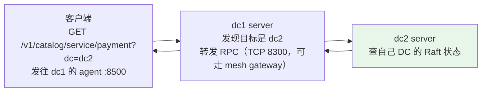
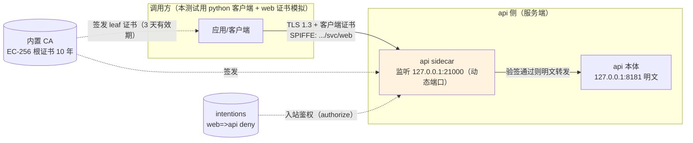
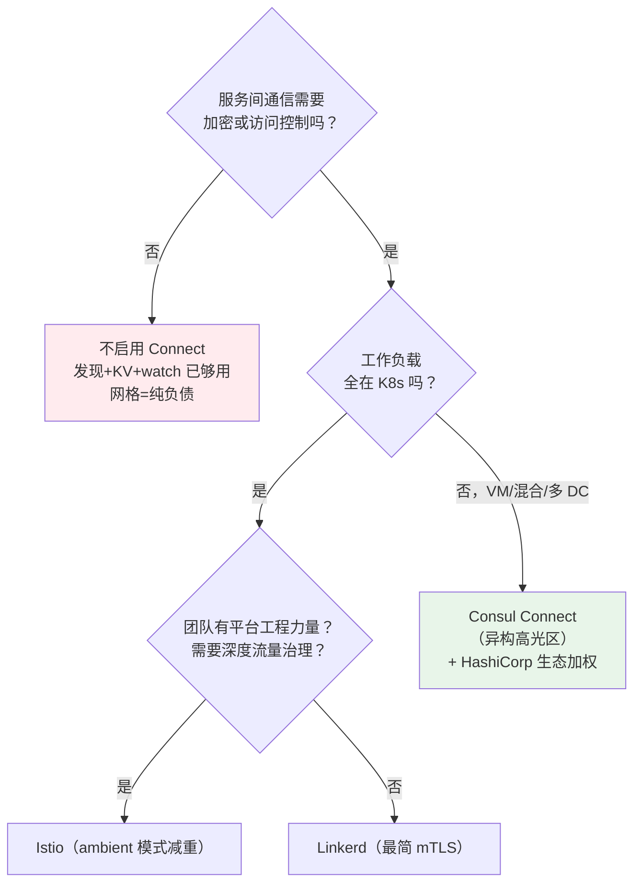

# 课 7：多数据中心与服务网格 Connect

> 阶段 2《核心能力拆解》最后一课。前置：课 5（Raft/Gossip/双 DC 集群）、课 6（KV/配置）。
> 实测环境：Windows 11 本机，Consul 2.0.2。Connect 线用 dev agent；多 DC 线复用课 5 的四节点集群（node1/node2/node3 + dc2）。
> 实测时间：2026-08-28。文中所有命令与输出均为本机真实运行结果。

## 本课目标

评估 Consul 两张"高级牌"的成色：**多数据中心联邦**与**Connect 服务网格**（mTLS + intentions + Envoy）。决策视角重点回答：这两个能力是我的真需求，还是选型时被"功能多"带偏的伪需求。

---

## 第一幕：宣传页最亮的两行字

小林的选型报告写到了最后一页。前面六课拆完引擎：服务发现是看家本事（课 4），一致性成色扎实（课 5），KV 能用但管理半边缺课（课 6）。现在只剩宣传页最亮的两行字——"**多数据中心**"和"**服务网格**"——还没验过货。

这两行字最容易被写进 PPT，也最容易变成坑：

- 多数据中心：听起来就是"高可用""异地多活"，但**你需要的到底是多活，还是只读灾备？** 两者的技术要求天差地别。
- 服务网格：听起来就是"零信任""mTLS"，但**开箱真是零信任吗？数据面免费的吗？** 这两个问题本课都会用实测回答。

本课的立场延续全程：不打分、只验货。每个能力问三个问题——**它怎么工作（机制）、它工作得如何（实测）、它值不值得我为此买单（决策）**。

---

## 第二幕：三个真实障碍

小林在验证这两张牌时，撞上了三个障碍。每一个都推翻了一个想当然的假设。

### 障碍一："开了 Connect 就是零信任了吧？"

实测直接打脸。注册两个带 sidecar 的服务后，在**没有任何意图规则**时查询判定：

```powershell
PS> consul intention check web api
Allowed
```

**默认放行**。真正想知道"谁能连我"还得再查一层：谁都能连，只要它有一张合法证书。而证书的获取门槛，取决于你有没有开 ACL（本课 dev 模式没开，任何能访问 agent 的进程都能给自己签一张 leaf 证书）。"开了 Connect"与"零信任"之间，隔着 ACL、默认拒绝策略、意图治理一整套配置。

### 障碍二："多 DC 的话，数据总该同步了吧？"

在 dc1 写入 `geo/region=shanghai`，然后到 dc2 **本地**读同一个 key：

```powershell
PS> Invoke-RestMethod http://127.0.0.1:8530/v1/kv/geo/region
# 远程服务器返回错误: (404) 未找到
```

**404**。KV 数据完全不做跨 DC 复制（课 5 埋的伏笔，本课兑现）。更颠覆直觉的是：dc2 也可以有自己的 `geo/region=shenzhen`，**同一个 key 在两个 DC 是两个独立值**，互不知晓。多 DC 联邦连的是"查询通道"，不是"数据副本"。

### 障碍三："网格功能是 Consul 自带的，不额外花钱吧？"

功能不额外花钱，但**数据面不自带**。Consul 网格的生产数据面是 Envoy，而 Envoy 的版本被三层绑定：Consul 版本 ↔ consul-dataplane 版本 ↔ Envoy 版本。本机 Consul 2.0.2 对应 Envoy 1.37.2（2.0.1 起为 1.38.2）——这意味着 Envoy 的安全更新、特性、故障排查都跟着 Consul 的升级节奏走。官方文档原话："Support for newer versions of Envoy will not be added to existing releases"（已发布的 Consul 版本不会新增对新 Envoy 的支持）。这是账单上不印字的一行。

---

## 第三幕：三张牌逐一摊开

### 知识点 1：多数据中心联邦

#### 一句话定义

多 DC 联邦用 WAN gossip 池把各 DC 的 server 串成一张全局网，**不复制业务数据**，跨 DC 访问全部按需转发 RPC；跨 DC 组网有两种方案——WAN 联邦（一个大家庭）与 cluster peering（门当户对的两家亲家）。

#### 直觉建立

把每个 DC 想成一家独立核算的分公司：

- **WAN gossip 池**是分公司老总们的电话群（课 5 实测：只收 server，LAN 池按 DC 隔离）。群里聊的只有"谁还活着、网络路况（坐标）"，**不聊业务**。
- 想查另一家分公司的账（目录/KV），走的是**点对点要账**：本 DC server 把请求转发给对方 server，对方查完自己的 Raft 再把结果送回来。
- 所以分公司之间**账本各记各的**（KV 不复制、目录不复制），要账失败就失败（对方失联，查询报错），不会把自家账本搞乱。

#### 核心原理

**跨 DC 查询的转发链路**（本机四节点集群实测）：



实测证据链（全部真实输出，2026-08-28）：

```powershell
# 在 dc2 注册 payment 服务后，从 dc1 跨 DC 查询（转发成功）
PS> (Invoke-WebRequest 'http://127.0.0.1:8500/v1/catalog/service/payment?dc=dc2').Content
# [{"Node":"dc2-server",...,"Datacenter":"dc2","ServiceName":"payment","ServicePort":9090,...}]

# dc1 本地查 payment（不带 ?dc=）——目录不复制，本地没有
PS> (Invoke-WebRequest 'http://127.0.0.1:8500/v1/catalog/service/payment').Content
# []

# KV 的独立性更彻底：
# dc1: PUT /v1/kv/geo/region = shanghai
# dc2 本地 GET 同 key → 404
# dc2 GET ?dc=dc1 → shanghai（转发读）
# dc2: PUT /v1/kv/geo/region = shenzhen（同 key 独立值）
# dc1 GET ?dc=dc2 → shenzhen；dc1 本地 GET → shanghai（互不干扰）
```

**故障成色**（多 DC 最重要的实测）：硬杀 dc2 节点后——

| 操作 | 结果 | 耗时 |
|------|------|------|
| dc1 本地写 KV | ✅ 正常（`still-writable` 写读成功） | 正常延迟 |
| dc1 跨 DC 读 KV（?dc=dc2） | ❌ HTTP 500 | 9ms 快速失败 |
| dc1 跨 DC 查 catalog（?dc=dc2） | ❌ HTTP 500 | 2ms 快速失败 |
| WAN 池里 dc2 的状态 | 仍是 alive（1） | gossip 故障检测滞后（课 5：WAN failed 约 +36s） |

两个教学点：① **每 DC 独立 Raft 的价值**——远端 DC 挂掉，本地读写毫发无损（对比课 5：本 DC quorum 丢失才是致命伤）；② **RPC 可用性与 gossip 成员状态是两回事**——转发请求 9ms 内失败，但 WAN 池状态要等 gossip 检测周期才翻转。重启 dc2 后跨 DC 查询自动恢复（实测 `shenzhen` 读回）。

**转发开销微基准**（HttpClient 100 次均值，本机回环）：本 DC 读 0.85ms vs 跨 DC 读 0.99ms。回环环境只体现转发链路自身开销（+0.14ms）；真实 WAN 上 RTT（几十 ms 起）才是主导项。

**跨 DC 的生产姿势：prepared query failover**。课 4 讲过单 DC prepared query；它的 `Failover` 配置是跨 DC 的高光功能：

```powershell
# 在 dc1 创建（dc1 本地没有 payment）
PS> Invoke-RestMethod -Method POST -Uri http://127.0.0.1:8500/v1/query -Body @{
  Name='payment-crossdc'; Service=@{Service='payment'; Failover=@{NearestN=3}}; DNS=@{TTL='10s'} }
# 执行：dc1 无健康实例 → 自动 failover 到 dc2
PS> Invoke-RestMethod "http://127.0.0.1:8500/v1/query/<id>/execute"
# Service: payment  Nodes: 1  Datacenter: dc2  Node: dc2-server（3ms）
```

**两种跨 DC 方案的定位**（文档级，官方 1.14+ 文档核实）：

| 维度 | WAN 联邦（WAN Federation） | 集群对等（Cluster Peering） |
|------|---------------------------|----------------------------|
| 心智模型 | 多个 DC 组成**一个集群** | **各自独立**的集群建立对等关系 |
| 全局状态 | 需要主 DC，复制 ACL/config entries | 无主 DC，各管各的 key/catalog/ACL |
| KV 共享 | ✅（跨 DC 转发访问） | ❌ 不支持 |
| 连接不同运维团队的集群 | ❌（假设同一控制方） | ✅（令牌建立信任，支持中心-辐射型 hub-and-spoke 拓扑） |
| 服务发现 | **转发**请求（本课实测的行为） | **复制**导出的服务 |
| 网关间加密 | mTLS 端到端保持加密 | 终止 mTLS 解密再加密（为动态路由） |
| gossip 依赖 | ✅ WAN gossip 池 | ❌ 用 mTLS 保护的 gRPC 直连 |
| 官方限制 | 两者**不能同时使用** | 同左 |

mesh gateway 在两种方案里都是流量中继节点：传统 WAN 联邦要求所有 server 暴露 WAN 地址（K8s 环境很难）；Consul 1.8+ 支持通过 mesh gateway 做 WAN 联邦，只需暴露网关——这是混合云/跨平台 DC 互联的推荐姿势。

#### 实测证据

上面已内嵌。补充一条踩坑记录：本机 `Get-NetTCPConnection -State Listen` 找 PID 曾漏报（记忆卡已知坑），多 DC 实验中改用 `netstat -ano` 后稳定。

#### 常见误区

- **"多 DC = 数据多副本/异地容灾"**——不是。KV 与目录都不复制，跨 DC 只是查询通道。要数据冗余请自己做（如课 6 的 export+Git 方案多 DC 各存一份，或用外部同步工具）。官方架构文档原话："By default, the information is not replicated across datacenters."
- **"跨 DC 查询挂了会拖垮本地"**——不会。本地 Raft 独立运转（实测 dc2 失联时 dc1 本地写读正常）。但反过来：**依赖跨 DC 查询的应用**（如配置全存在 dc1、dc2 的应用每次都 `?dc=dc1` 拉取）会在 dc1 失联时全断——这是架构问题，不是 Consul 的锅。
- **"联邦和对等可以混着用"**——官方明确不支持同时使用，选型时就要定方向。

#### 适用边界

- 需要跨 DC **服务发现与调用**（多活、就近路由、failover）：联邦/对等都合适，prepared query failover 是现成工具。
- 需要跨 DC **数据同步**（配置分发、状态共享）：Consul 多 DC 本身不提供，需在应用层或外部工具层解决。
- 只读灾备场景：其实连联邦都不一定需要——灾备 DC 冷启动后再加 WAN 池也来得及，多 DC 联邦的价值主要在"活着的时候互相访问"，而不是"死的时候接管"。

---

### 知识点 2：Connect 服务网格（mTLS / intentions）

#### 一句话定义

Connect 给每个服务配一个 sidecar 代理做 mTLS 加解密与意图鉴权，内置 CA 自动签发短周期证书，服务身份用 SPIFFE ID 表达，intentions 声明"谁能连谁"；生产数据面是 Envoy，内置代理仅供测试。

#### 直觉建立

把 sidecar 想成每个服务雇的**私人保镖**：

- 应用本体完全不加密、也完全不懂证书（实测：直连 8181 端口明文拿到响应，毫无阻拦）。
- 所有流量先进保镖（sidecar 监听动态端口）：进来的连接先验对方保镖递上的"工作证"（mTLS 客户端证书，证件上有 SPIFFE ID 服务身份），再查"访客名单"（intentions），两关都过才转交给应用。
- 证件由公司统一发证机关（内置 CA）签发，3 天一换（leaf 证书有效期实测），防伪造防冒用。

#### 核心原理

**mTLS 链路与身份体系**（本机 dev agent 全程实测）：



**注册即得保镖**。服务定义里加 `connect.sidecar_service: {}`，agent 自动生成 sidecar 注册：

```json
{ "service": { "id": "api-1", "name": "api",
    "address": "127.0.0.1", "port": 8181,
    "connect": { "sidecar_service": {} } } }
```

注册后 `GET /v1/agent/services` 里多了 `api-1-sidecar-proxy`（Kind=`connect-proxy`，动态端口 21000，Proxy 元数据含 `DestinationServiceName: api`、`LocalServiceAddress: 127.0.0.1:8181`）——保镖的工牌上写着"我给 api 看门，转交地址 8181"。

**CA 与身份**。`GET /v1/connect/ca/roots` 实测：dev 模式自动创建内置 CA（EC 256 位根证书，有效期 10 年），trust domain 为随机 UUID 格式（如 `b56397a3-....consul`，Consul 1.17+ 的 SPIFFE 联邦模型）。服务身份格式（sidecar 日志原文）：

```text
Parsed TLS identity: uri=spiffe://b56397a3-f9a5-54cf-7528-6f9ce729717a.consul/ns/default/dc/dc1/svc/api
```

leaf 证书（服务个体的"工牌"，区别于 CA 根证书；`GET /v1/agent/connect/ca/leaf/<service>`，注意是 agent 前缀路径）有效期实测仅 **3 天**，EKU 同时含 serverAuth 与 clientAuth——短期证书自动轮换是设计使然，生产由代理自动换证。

**mTLS 强制的三层证据**（本机实测矩阵）：

| 场景 | 结果 | 证据 |
|------|------|------|
| 无证书直连 sidecar（curl） | ❌ TLS 握手被拒 | `curl: (52) Empty reply from server`（TCP 通、TLS 断） |
| 持有效证书 + 无意图（默认） | ✅ 握手成功且拿到业务响应 | python 客户端持 echo/api 证书 → `HTTP/1.0 200 OK` |
| 持有效证书 + deny 意图 | ❌ 鉴权拒绝 | 代理日志 `authz call denied: Matched L4 intention: default/web => default/api (Action: DENY)`，客户端收到 TLS alert `bad_certificate` |
| 明文直连服务本体 8181 | ✅ 无任何阻拦 | 证明"数据面不加密直通"绕过路径存在，需网络层配合封堵 |

**intentions 的语义**。声明式规则（source → destination + allow/deny），支持通配符与优先级（本课实测的 deny 意图日志显示 Precedence: 9，精确匹配最高）。关键边界行为（官方文档+实测互证）：

- **默认策略是 allow**（回退到 ACL default_policy；dev 无 ACL 时即放行）。官方安全最佳实践明确要求生产配置默认拒绝（default deny intention policy），否则"缺规则=放行"。
- 意图变更**不影响已建立的连接**，只拦新连接（L4 语义）；L7 意图（HTTP 路径/方法/header）需 Envoy。
- 意图缓存在 agent 与代理本地、经 xDS 流传播（xDS：Envoy 的动态配置下发协议，控制面通过它把证书/意图/路由规则推给每个代理），**非即时生效**。

**内置代理的成色边界（本课最大实测发现）**。用内置代理（`consul connect proxy`）做意图生命周期实验时抓到一组现象，值得单独记录：

```text
16:33:30  deny 意图存在时连接被拒（authz 日志：Matched ... Action: DENY）  ← 意图拦截正常工作
16:33:49  删除意图后连接仍被拒（日志仍匹配"已删除"的意图 ID）           ← 幽灵意图
16:34:20  重新获取证书重试（agent 返回缓存的同一张，序列号未变），仍被拒（匹配同一幽灵意图）
16:38:35  重启 sidecar 进程，仍被拒（authorize 端点直接返回幽灵意图）
16:44:25  11 分钟内持续如此；期间新创建的 deny echo=>api 意图在 60 秒观察窗内也始终未生效  ← 授权视图冻结
```

直接证据：`POST /v1/agent/connect/authorize` 在意图列表 API（`/v1/connect/intentions` 返回 `[]`）为空时，仍返回 `Authorized: false, Reason: Matched L4 intention ... (ID: 5026c9a9...)`——agent 授权层持有陈旧的意图快照，删除不失效、新建不传播。

这个现象与官方文档的两个声明一致：① 内置代理"not supported for production...does not support many of Consul's service mesh features, and is not under active development"；② 意图"cached locally on the Consul agent and in the Envoy proxy. Updates propagate to proxies via xDS streaming, **not instantaneously**"。结论：**意图机制本身可靠（deny 存在时拦截确凿），但内置代理+dev 模式下的意图生命周期管理不可靠**——它就是官方说的"仅供测试"的活体证据。生产用 Envoy 走 xDS 增量流是另一条传播路径（本机未装 Envoy，无法验证其行为，此句为文档级结论）。

**数据面依赖 Envoy：版本兼容矩阵是隐藏运维成本**（文档级，官方 changelog 与 envoy 参考页核实）：

- Consul 2.0.0 捆绑 Envoy 1.37.2（SECURITY 更新），2.0.1 升至 1.38.2 并移除 1.34.14——Envoy 版本跳动常由 CVE 驱动。
- 三层绑定：Consul 大版本 ↔ consul-dataplane 大版本 ↔ Envoy 大版本；每个 Consul 大版本兼容前后各一个 dataplane 大版本以平滑升级。
- 官方策略原话："Support for newer versions of Envoy will not be added to existing releases"——老 Consul 永远等不到新 Envoy，要新特性/新修复必须升级 Consul 整条链。
- consul-dataplane（1.14 引入）：K8s 环境下取代 client agent 管理 Envoy（单 gRPC 连接、无 gossip、Envoy+dataplane 打包单镜像）；VM/裸机环境继续用 client agent 模式（官方明确"continue to be supported for the foreseeable future"）。

#### 实测证据

已在核心原理内嵌。环境备注：① dev agent 上做 Connect 实验时，服务注册若带 TTL 检查+DCSA（课 4 知识），检查超时会连带注销服务与 sidecar 注册，sidecar 的 watch 报 404 后进入指数退避——本课实验中途踩到，去掉 TTL 后恢复；② 服务注销重注册后，agent 的 leaf 证书缓存不刷新（同一序列号），手工测试证书时需留意；③ WSL 的 wslrelay 进程可能抢占 8081 端口（本机实测双监听），实验端口尽量避开常见端口。

#### 常见误区

- **"开了 Connect 就零信任"**——默认 allow（实测+文档双重确认）。零信任需要：ACL 默认拒绝 + default deny intention + 显式 allow 清单，三件套缺一不可。
- **"mTLS 加密后服务本体就安全了"**——sidecar 只守 front door。直连服务本体端口（实测 8181 明文 200）完全绕过网格，需网络层（防火墙/安全组）封堵直连路径，否则加密形同虚设。
- **"意图改了立刻生效/立刻失效"**——两个方向都不即时：新意图要经 xDS 推送到代理，删掉的意图在代理缓存刷新前还拦着人（本课幽灵意图实测）。
- **"内置代理先凑合上生产"**——官方原文三个否定：不支持生产、不支持很多网格特性、不再积极开发。

#### 适用边界

- 有跨团队/跨语言的服务间访问控制需求（intentions 是声明式的服务防火墙）、有合规加密要求（金融/医疗东西向流量）、混合环境统一策略——Connect 的正主场。
- 应用都在 K8s 且只需要基础 mTLS——Istio ambient/Linkerd 是更轻的选项（见知识点 3）。
- 只做服务发现+KV、没有服务间加密与访问控制刚需——Connect 是纯增重（见知识点 3 的"负资产"判断）。

---

### 知识点 3：网格能力的成色评估

#### 一句话定义

Consul 网格的差异化牌是**异构环境**（VM+K8s+裸机统一网格）与**多 DC 原生**，高光区在非 K8s/混合场景；如果只需发现+配置，网格能力是记在账上的复杂度负债，不是加分项。

#### 直觉建立

网格市场三类玩家，定位像三种餐厅：

- **Istio**：豪华自助餐——什么菜都有（最丰富的流量管理/故障注入/细粒度授权）， Envoy 做后厨，但需要专职团队运营；近年转向 ambient 模式（无 sidecar 的 L4 + 按需 waypoint 代理）减重。
- **Linkerd**：轻食店——Rust 自研微代理，只做 mTLS+基础可观测性+简单流量，性能开销全场最低，但只开在 K8s 这条街。
- **Consul Connect**：连锁食堂进驻园区——它的祖传手艺是"在任何地方都能开"（服务发现出身），VM/裸机/K8s/多 DC 统一纳管，与 Vault/Nomad/Terraform 打包成 HashiCorp 生态套餐。

#### 核心原理

**定位差异的三方共识**（多份 2025-2026 对比文章交叉核实，结论高度一致）：

| 维度 | Istio | Linkerd | Consul Connect |
|------|-------|---------|----------------|
| 数据面 | Envoy | linkerd2-proxy（Rust 自研） | Envoy |
| 非 K8s 支持 | VM 支持"有限/复杂" | ❌ K8s only | ✅ VM/裸机原生（最强项） |
| 多集群/多 DC | 强但复杂（多控制面模式） | 基础（镜像服务模式） | ✅ 原生成熟（本课实测的联邦+failover） |
| 复杂度 | 高 | 低 | 中 |
| 生态绑定 | CNCF 毕业项目 | CNCF 毕业项目 | HashiCorp 栈（Vault/Nomad/Terraform） |
| L7 授权粒度 | AuthorizationPolicy（路径/方法/header） | Server+AuthPolicy | intentions（L4 服务级；L7 需 Envoy+协议声明） |

**生产采用度观察**（文档级，多来源交叉）：共识是"纯 K8s 场景下 Istio/Linkerd 的打磨度更高（K8s 特性、生态、社区规模），Consul 的高光区在**非 K8s 与混合环境**"——多份对比的措辞高度一致："If you're running primarily VMs or a mix of VMs and containers, Consul is the practical choice"；"Consul is the go-to choice if you're not all-in on Kubernetes"。另有第三方资源开销参考数据（Istio ~150MB/pod、Consul ~120MB、Linkerd ~50MB；延迟 +2~3ms vs +1ms）——**标注为第三方 2025-2026 对比数据，非官方基准**，量级参考即可。

**决策判断：只要发现+配置时，网格是不是"负资产"？** 用本课两代实测叠加课 5/6 的证据做资产负债表：

| 资产 | 负债 |
|------|------|
| mTLS 与意图机制本身扎实（deny 拦截三方证据互证） | 数据面 Envoy 三层版本绑定（升级耦合 CVE 节奏） |
| 异构环境统一治理（VM+K8s 一张网） | 运维面扩大：CA 管理、证书轮换监控、意图治理、代理生命周期 |
| 多 DC failover 现成（prepared query 3ms 路由） | 默认 allow+缓存语义，上零信任需完整配置（ACL+默认拒绝+意图清单） |
| 服务发现/KV 不用网格也能用（课 3-6 全程未启 Connect） | 排障复杂度：TLS+代理+意图三层叠加（本课幽灵意图排查即预演） |

判断框架（小林的决策卡片）：



给小林的结论：网格能力不是普适加分项，而是**场景条件资产**——满足"异构环境+服务间安全刚需+（可选）HashiCorp 生态"三个条件时它从负债转为资产；否则记为"暂不启用的能力"，选型时按"该不该为用不到的能力付复杂度税"来折价。

#### 实测证据

本知识点以文档级核查为主（三组来源：官方 cluster peering/envoy/intentions 文档、Consul 2.0 changelog、多份 2025-2026 独立对比文章交叉），表格中的行为断言均回链到知识点 1/2 的本机实测。第三方性能数字已标注来源属性。

#### 常见误区

- **"Consul 的网格比 Istio 全面"**——功能清单上 Istio 更长（故障注入、Wasm 扩展、最细 L7 授权）。Consul 的优势不在"更多"，在"更广"（平台覆盖面）。
- **"选了 Consul 就必须上全套网格"**——不必。发现/KV/DNS 与 Connect 完全可解耦（本课程课 3-6 全程没碰 Connect）。分期启用是正常路径。
- **"网格能替代网络安全"**——不能。直连服务本体绕过 sidecar（实测明文 200），防火墙/安全组仍然必要；网格管的是东西向服务间身份与加密，不是网络边界。

#### 适用边界

- 决策输入场景：选型对比（阶段 3 课 8/9 将把 Consul 与竞品同台，本课的定位差异是网格维度的预演）、已有 Consul 想加网格（先过决策卡片，再分期：先 mTLS 观察模式，再默认拒绝，再意图清单）。
- 本课结论的边界：采用度观察基于公开对比与社区共识，无内部生产数据；性能数字为第三方参考。国内环境另需评估 BUSL 许可证影响（课 10 展开）。

---

## 第四幕：复现清单（本机 PowerShell，全部实测通过）

### A. Connect 线（dev agent）

```powershell
# A1. 启动 dev agent（Connect 默认启用）
consul agent -dev -node=lesson7

# A2. 注册带 sidecar 的服务（api 本体用 python http.server 8181 顶替，注意避开 8080/8081 常见端口）
@'
{ "service": { "id": "api-1", "name": "api", "address": "127.0.0.1",
    "port": 8181, "connect": { "sidecar_service": {} } } }
'@ | Set-Content api-connect.json
consul services register api-connect.json

# A3. 查看 sidecar 自动注册（关注 Kind=connect-proxy 与动态端口 21000）
(Invoke-WebRequest -UseBasicParsing http://127.0.0.1:8500/v1/agent/services).Content

# A4. 内置 CA 与身份
(Invoke-WebRequest -UseBasicParsing http://127.0.0.1:8500/v1/connect/ca/roots).Content   # 根证书/信任域
consul connect proxy -sidecar-for api-1   # 启动 sidecar，日志含 Parsed TLS identity（SPIFFE ID）

# A5. leaf 证书（注意 agent 前缀路径；老路径 /v1/connect/ca/leaf 已 404）
$leaf = Invoke-RestMethod http://127.0.0.1:8500/v1/agent/connect/ca/leaf/api
$leaf.ValidAfter; $leaf.ValidBefore   # 实测有效期 3 天

# A6. mTLS 强制：无证书直连 sidecar（预期 exit 52）
curl.exe -s -o NUL -w "HTTP %{http_code} exit %{exitcode}" http://127.0.0.1:21000/

# A7. 意图生命周期（注意：内置代理的意图视图可能冻结，见讲义"幽灵意图"）
consul intention check web api                    # 默认 Allowed
consul intention create -deny web api             # Created: web => api (deny)
consul intention check web api                    # Denied
consul intention delete web api                   # 恢复默认

# A8. 带证书的端到端验证（python ssl 客户端，脚本思路见讲义附注）
#   leaf API 拿某服务的 CertPEM/PrivateKeyPEM → ssl.load_cert_chain → 连 21000
#   观察三种结果：无证书握手失败 / 有效证书+允许→HTTP 200 / deny→TLS alert bad_certificate
```

### B. 多 DC 线（复用课 5 四节点集群）

```powershell
# B1. 启动四节点（node1/node2/node3/dc2 配置在 consul/playground/cluster/，端口组错开）
consul agent -config-file D:/projects/learning/consul/playground/cluster/node1.json  # 8500 组
# ... node2（8510 组）/node3（8520 组）/dc2（8530 组）同理，各一个进程

# B2. WAN 池与跨 DC 服务发现
(Invoke-WebRequest 'http://127.0.0.1:8500/v1/agent/members?wan=1').Content   # 4 server
Invoke-RestMethod -Method PUT -Uri http://127.0.0.1:8530/v1/agent/service/register `
  -ContentType 'application/json' -Body '{"ID":"payment-1","Name":"payment","Address":"127.0.0.1","Port":9090}'
(Invoke-WebRequest 'http://127.0.0.1:8500/v1/catalog/service/payment?dc=dc2').Content  # 转发查询
(Invoke-WebRequest 'http://127.0.0.1:8500/v1/catalog/service/payment').Content        # 本地 []

# B3. KV 空间独立性（同 key 双值实验）
Invoke-RestMethod -Method PUT -Uri http://127.0.0.1:8500/v1/kv/geo/region -Body 'shanghai'
Invoke-RestMethod http://127.0.0.1:8530/v1/kv/geo/region                    # 404
Invoke-RestMethod 'http://127.0.0.1:8530/v1/kv/geo/region?dc=dc1'           # shanghai
Invoke-RestMethod -Method PUT -Uri http://127.0.0.1:8530/v1/kv/geo/region -Body 'shenzhen'
Invoke-RestMethod 'http://127.0.0.1:8500/v1/kv/geo/region?dc=dc2'           # shenzhen

# B4. 故障成色（先 netstat -ano 找 dc2 的 PID，Stop-Process 硬杀）
Invoke-RestMethod -Method PUT -Uri http://127.0.0.1:8500/v1/kv/healthcheck/dc2down -Body 'ok'  # 本地写正常
Invoke-RestMethod 'http://127.0.0.1:8500/v1/kv/geo/region?dc=dc2'          # 500（约 9ms 失败）

# B5. prepared query 跨 DC failover
Invoke-RestMethod -Method POST -Uri http://127.0.0.1:8500/v1/query -ContentType 'application/json' `
  -Body '{"Name":"payment-crossdc","Service":{"Service":"payment","Failover":{"NearestN":3}},"DNS":{"TTL":"10s"}}'
Invoke-RestMethod "http://127.0.0.1:8500/v1/query/<id>/execute"            # 自动路由到 dc2
```

附注：A8 的 python 客户端核心为 `ssl.SSLContext(PROTOCOL_TLS_CLIENT)` + `load_cert_chain(证书, 私钥)` + `wrap_socket` 后发送 HTTP GET；deny 时表现为收到 `SSLS3_ALERT_BAD_CERTIFICATE` 且 0 字节响应。实验素材在 `consul/playground/`（api-connect.json、web-connect.json、mtls-request.py 等）。

---

## 第五幕：体系收束

### 三知识点收束表

| 知识点 | 一句话结论 | 最硬的证据 |
|---------|-----------|-----------|
| 多数据中心联邦 | 连的是查询通道不是数据副本；本地 Raft 独立故远端失联毫发无损，但依赖跨 DC 的调用会断 | 同 key 双 DC 双值（shanghai/shenzhen）；dc2 失联时 dc1 本地正常+跨 DC 500/9ms |
| Connect 服务网格 | mTLS 与意图机制本身扎实，但默认 allow+内置代理仅供测试；生产数据面被 Envoy 三层版本绑定 | 无证书 exit 52 / 有效证书 200 / deny 时 authz 日志+bad_certificate 三方互证；幽灵意图实测 |
| 网格成色评估 | 异构环境（VM+K8s+多 DC）是唯一高光区；只要发现+配置时网格是复杂度负债 | 三方对比共识"VM/混合环境选 Consul"；Envoy 矩阵官方策略原文 |

### 阶段 2 全季收束

至此拆完引擎：**发现（课 4）+ 一致性（课 5）+ 配置（课 6）+ 高级牌（课 7）**。Consul 的画像已经完整——看家本事（发现+DNS）扎实，一致性成色足金，KV 是合格半成品，两张高级牌是条件资产。下一阶段（课 8/9）五位候选人同台竞技，本课的定位差异分析将直接复用。

### 自测三题

1. dc1 和 dc2 组了 WAN 联邦。你在 dc1 写入 KV `app/config=prod-v1`，同事在 dc2 执行 `GET /v1/kv/app/config`（不带 ?dc）和 `GET /v1/kv/app/config?dc=dc1`，各返回什么？为什么？
2. 你们开了 Connect 但没配任何意图和 ACL，服务 A 的 sidecar 端口被外网扫描到。攻击者能建立 TLS 连接吗？能拿到业务响应吗？哪两道防线缺失？
3. 全 K8s 环境、团队 5 人、只要 mTLS 和基础流量管理——按本课决策卡片该选什么？如果把"全 K8s"换成"60% 服务还在 VM 上"呢？

（答案要点：1. 404 / prod-v1，KV 不跨 DC 复制、?dc= 是按需转发；2. TLS 握手失败（无证书）拿不到响应，但缺失的防线是 ACL（谁都能领证书）与默认拒绝意图；若攻击者能访问 agent 领到合法证书则业务响应直接暴露；3. Linkerd / Consul Connect。）

### 速查卡

- WAN 池只收 server；跨 DC 查询=按需转发 RPC，数据不复制
- `?dc=` 跨 DC 查询；KV 本地 404 不代表"数据丢了"，代表"这本账不在本 DC"
- dc 远端失联：本地读写正常，跨 DC 查询快速 500；WAN gossip 状态翻转滞后（秒级）
- prepared query `Failover.NearestN`：跨 DC 自动路由（实测 3ms）
- WAN 联邦=一个集群（有主 DC、共享 ACL、转发发现）；cluster peering=对等集群（无主、复制导出服务、跨团队）；二者不能同时用
- sidecar 注册：`connect.sidecar_service: {}`；Kind=connect-proxy；动态端口（21000 起）
- SPIFFE ID：`spiffe://<trust-domain>/ns/<ns>/dc/<dc>/svc/<service>`；trust domain 是随机 UUID（1.17+ 格式）
- 内置 CA：EC-256 根证书 10 年；leaf 证书 3 天自动轮换；EKU 双向（serverAuth+clientAuth）
- leaf 证书 API：`/v1/agent/connect/ca/leaf/<svc>`（无 agent 前缀的老路径已 404）
- 默认意图策略=allow（回退 ACL default_policy）；生产零信任三件套：ACL 默认拒绝 + default deny intention + 显式 allow 清单
- 意图变更不影响存量连接；代理层意图缓存经 xDS 传播、非即时（内置代理实测会冻结，仅测试用）
- 内置代理官方定位：不支持生产、不支持很多特性、不积极开发（三连否定原文）
- Envoy 三层绑定：Consul ↔ consul-dataplane ↔ Envoy；2.0=Envoy 1.37.2（2.0.1→1.38.2）；老 Consul 不加新 Envoy 支持
- consul-dataplane：K8s 侧取代 client agent（单 gRPC、无 gossip）；VM/裸机继续 client agent 模式
- 网格竞品一句话：Istio 全功能最重、Linkerd 最轻仅 K8s、Consul 异构多 DC 高光
- 实验环境坑：TTL+DCSA 会自动注销 sidecar 注册；服务重注册后 leaf 缓存不刷新；8080/8081 易被 WSL 中继抢占

---

## 🚀 下一批接力提示词

```text
继续学 Consul。我的学习档案在 consul/00-学习档案.md，刚学完阶段 2《核心能力拆解》的课《多数据中心与服务网格》知识点（多数据中心联邦、Connect 服务网格（mTLS/intentions）、网格能力的成色评估），请按大纲继续讲解下一批知识点。
```

## 🧭 课程导航

- [下一课：课 8 四大竞品逐个看](../../3-横向对比/lessons/lesson-08-四大竞品逐个看.md)（阶段 3 开篇：ZooKeeper / etcd / Nacos / Eureka 逐个登台）
- 返回 [课程目录](../../02-课程目录.md)
