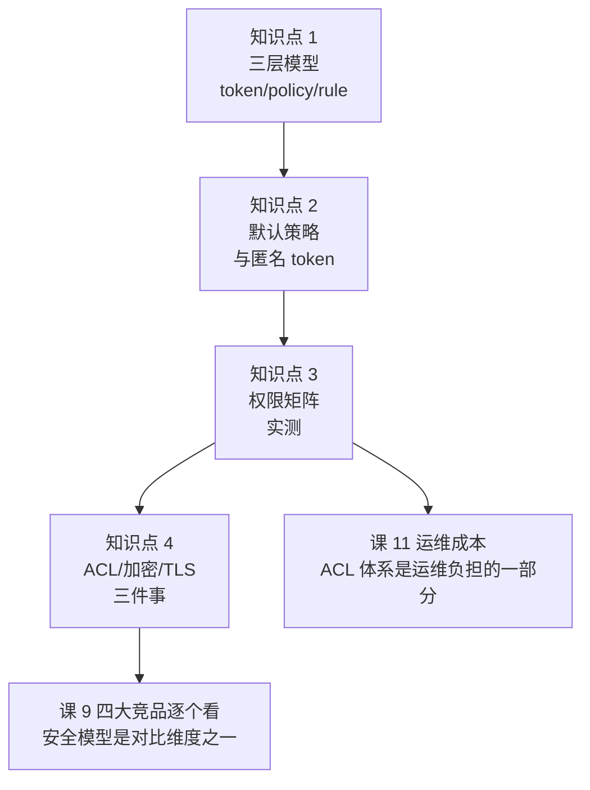

# 课 8：ACL 与安全模型

> **（本文档为阶段 2 增补课。2026-09-17 以官方 Docs 网页索引比对本课程时发现：secure 分区 48 条为全站最大分区之一，而课 7 已三次引用 ACL 却始终未讲，故补此课。）**

---

## 本课速览

- **一句话结论**：Consul 的 ACL 是一套「token → policy → rule」的三层授权模型，默认 `deny` 时它会**静默返回空集而非报错**——这是它最危险的地方，也是本课最值钱的一条。
- **能力边界**：ACL 管的是**谁能对 Consul 做什么**（控制面权限），不是业务数据的加密。
- **实测环境**：Consul v2.0.2（本机 WinGet 安装），dev 模式单节点，`acl { enabled = true, default_policy = "deny" }`。
- **三条硬结论**：① `default_policy = "deny"` 下匿名请求常被返回 `200 []` 而非 403，故障表现为"服务列表是空的"而不是"报错"；② 匿名 token 默认**不是零权限**，`builtin/global-read-only` 给了它 `intentions = "read"`；③ gossip 加密、TLS、ACL 是三件独立的事，开了 ACL 不等于通信加密。

---

## 第一幕：场景引入

架构师小林把引擎盖拆完了。健康检查、Raft、KV、多 DC 都验过成色，他准备去选型评审会上讲"Consul 能打"。

临出门前，安全同事问了一句：

> "你们的注册中心，谁能上去把一个服务摘掉？"

小林愣了一下。他想起课 3 里那句"dev 模式无鉴权"，也想起课 7 里 Connect 的 mTLS 说的是**服务之间**的加密——那是数据面的事。可是**谁有权改 Consul 本身**呢？

他打开终端试了一下：

```bash
curl http://127.0.0.1:8500/v1/agent/service/deregister/web-1 -X PUT
```

**没有任何报错。** 服务没了。

这就是本课要解决的问题：**Consul 默认不设防**。在课 3 的 dev 模式里这是便利，在生产里这是事故。

---

## 第二幕：认知冲突

小林按网上的教程加上了 ACL，心想"这下安全了"。他配了 `default_policy = "deny"`，然后让应用连上去。

应用起来了，日志没有一条报错。但服务发现返回的服务列表**是空的**。

他查了半小时网络、查了 DNS、查了 agent 注册，最后才发现——**是 ACL 拒绝了，但 Consul 返回的是 200 和空数组，不是 403。**

**这是本课的核心冲突：ACL 拒绝不等于报错。**

同一个 Consul、同一套配置，实测三种行为：

```bash
# ① 读单个 KV 键：明确报错 403
curl -s -w "\nHTTP %{http_code}\n" http://127.0.0.1:8500/v1/kv/foo
```
```
Permission denied: anonymous token lacks permission 'key:read' on "foo". The anonymous token is used implicitly when a request does not specify a token.
HTTP 403
```

```bash
# ② 列服务：返回 200，但是空对象 —— 没有报错！
curl -s -w "\nHTTP %{http_code}\n" http://127.0.0.1:8500/v1/catalog/services
```
```
{}
HTTP 200
```

```bash
# ③ 列 KV 的 key：返回 200 和空数组 —— 同样没有报错！
curl -s -w "\nHTTP %{http_code}\n" "http://127.0.0.1:8500/v1/kv/?keys"
```
```
[]
HTTP 200
```

**三种接口，三种表现。** ① 会叫，②③ 不叫。如果你的应用只判断 HTTP 状态码，②③ 这两种情况它会认为"服务确实不存在"，然后安静地降级、安静地报错、或者安静地什么都不做。

> **一句话记住**：`default_policy = "deny"` 下，Consul 对"你没权限"的表达方式是**给你看一个空世界**，而不是告诉你"不许看"。排查 Consul 权限问题时，**先带上已知可用的 token 再查一遍**，对比两次结果——如果带 token 有数据、不带没有，那就是 ACL 问题，不是网络问题。

---

## 第三幕：层层揭示

### 知识点 1：三层授权模型（token → policy → rule）

**一句话定义**：ACL 用「token 挂载 policy，policy 写 rule，rule 声明权限」的三层结构做授权。

**直觉建立**：把它想成公司的门禁。

- **token（令牌）** = 你的工牌。刷卡时机器认的是工牌本身。
- **policy（策略）** = 职级说明书。写着"研发可以进机房，不能进财务室"。
- **rule（规则）** = 说明书里的具体条款。

一个工牌可以挂多份职级说明书（一个 token 可以关联多个 policy），多个人可以拿同一份说明书（多个 token 关联同一 policy）。改说明书，所有拿它的人权限立刻变。

**核心原理**：Consul 的 ACL 用「资源前缀」声明权限范围，下面是写 policy 时最常用的几类：

| 资源前缀 | 管什么 | 典型权限 |
|----------|--------|----------|
| `key_prefix` | KV 存储 | read / write / list |
| `service_prefix` | 服务注册与发现 | read / write |
| `node_prefix` | 节点 | read / write |
| `agent_prefix` | 本 agent 的本地操作 | read / write |
| `acl` | ACL 系统本身 | read / write |
| `operator` | 运维级操作 | read / write |
| `mesh` | 服务网格配置 | read / write |

其中 `service_prefix` 还额外支持 `intentions = "read"` / `"write"`——这是 Connect 的流量授权，和 `policy` 字段并列。

**示例演示**。先看一条真实创建的 policy（本机实测）：

```hcl
# 文件：acl-policy-readonly.hcl
key_prefix "app/" {
  policy = "read"
}
service_prefix "" {
  policy = "read"
}
node_prefix "" {
  policy = "read"
}
```

```bash
# 用管理 token 创建这条 policy
curl -s -X PUT \
  -H "X-Consul-Token: $CONSUL_HTTP_TOKEN" \
  --data-binary @acl-policy-readonly.json \
  http://127.0.0.1:8500/v1/acl/policy
```

> ⚠️ **Windows / PowerShell 注意**：`curl -d '{"Name":"x"}'` 在 PowerShell 里会把单引号一并送出去，导致 Consul 报 `Token decoding failed: invalid character 'P' looking for beginning of object key string`。**请把 JSON 写进文件，用 `--data-binary @文件名` 传**。本课本轮实测中有 4 次踩这个坑（T5/T7/T8/T29），这是真实教训不是理论提醒。

创建成功返回：

```json
{
    "ID": "7008a188-1c76-4703-9788-dd6d84d333c8",
    "Name": "app-readonly",
    "Hash": "BA88Gr7ksELrqJcePQh3UnkNGMnCCtm2m1ZFfgTDsTs=",
    "CreateIndex": 24,
    "ModifyIndex": 24
}
```

然后创建一个 token 挂上它：

```bash
curl -s -X PUT \
  -H "X-Consul-Token: $CONSUL_HTTP_TOKEN" \
  --data-binary @acl-token-create.json \
  http://127.0.0.1:8500/v1/acl/token
```

返回里有两个 ID，**务必分清**（这是新手第一大坑）：

```json
{
    "AccessorID": "0487309f-dd10-66ed-dc22-3b701a9c965a",
    "SecretID":   "09abdbe6-d6a7-ee03-037a-67ab4df1f13e",
    "Policies": [ { "Name": "app-readonly" } ]
}
```

- **AccessorID**（访问器 ID）：**公开的身份标识**，用来引用、查询、修改这个 token 本身。日志和报错信息里出现的是它。它**不能**用来通过鉴权。
- **SecretID**（密钥 ID）：**真正的凭据**，请求时放进 `X-Consul-Token` 头。它**只在创建时返回一次**，之后查不回来，只能重置。

类比：AccessorID 是你的工号（可以印在通讯录上），SecretID 是工牌本身（丢了要补办）。

**常见误区**：把 AccessorID 当成 token 塞进请求头，得到 403 还一脸茫然——报错里写的正是 AccessorID，于是你以为"我的 token 明明是对的"。

**一句话记住**：AccessorID 是名字，SecretID 是钥匙；报错里给你看名字，鉴权时要用钥匙。

---

### 知识点 2：默认策略与匿名 token（本课最反直觉的部分）

**一句话定义**：`default_policy` 决定"没有匹配到任何规则时怎么办"，匿名 token 决定"完全不带 token 的请求是谁"。

**直觉建立**：这是两道不同的门。`default_policy` 是默认门规，匿名 token 是"没带工牌的人按什么身份处理"。

**核心原理**。先看 `default_policy` 的两个取值：

- `allow`：**默认放行**，只有被显式 deny 的才拦。这是 Consul 的历史默认值，也是很多生产事故的根因。
- `deny`：**默认拒绝**，只有被显式 allow 的才放行。这是生产应有的配置。

再看匿名 token。实测揭开了一个反直觉的事实——**匿名 token 默认不是零权限**。查看内置策略 `builtin/global-read-only` 的内容：

```bash
curl -s -H "X-Consul-Token: $CONSUL_HTTP_TOKEN" \
  http://127.0.0.1:8500/v1/acl/policy/00000000-0000-0000-0000-000000000002
```

返回（节选，实测原文）：

```
acl = "read"
agent_prefix "" { policy = "read" }
event_prefix "" { policy = "read" }
key_prefix "" { policy = "read" }
keyring = "read"
node_prefix "" { policy = "read" }
operator = "read"
mesh = "read"
peering = "read"
query_prefix "" { policy = "read" }
service_prefix "" {
  policy = "read"
  intentions = "read"
}
session_prefix "" { policy = "read" }
```

**关键在 `service_prefix` 里的 `intentions = "read"`**。这意味着：即使你配了 `default_policy = "deny"`，匿名请求依然**能读到你的服务网格授权规则**（谁可以访问谁）。

实测验证。先建一条 intention（读作"意图"，就是一条"允许谁访问谁"的网格规则——课 7 讲 Connect 时提过，这里一句话补上：它决定服务 A 能不能调服务 B），然后匿名读：

```bash
# 匿名写 intention —— 被拒（403）
curl -s -w "\nHTTP %{http_code}\n" -X POST \
  --data-binary @acl-intention.json \
  http://127.0.0.1:8500/v1/connect/intentions
```

`acl-intention.json` 的内容（同上，没有就先创建）：

```json
{
  "SourceName": "web",
  "DestinationName": "api",
  "Action": "allow"
}
```
```
Permission denied
HTTP 403
```

```bash
# 管理 token 写 intention —— 成功
curl -s -w "\nHTTP %{http_code}\n" -X POST \
  -H "X-Consul-Token: $CONSUL_HTTP_TOKEN" \
  --data-binary @acl-intention.json \
  http://127.0.0.1:8500/v1/connect/intentions
```
```json
{ "ID": "54dab8be-6a27-2064-1657-0754698764a3" }
HTTP 200
```

```bash
# 匿名读 intentions —— 返回 200 和【空数组】
curl -s -w "\nHTTP %{http_code}\n" http://127.0.0.1:8500/v1/connect/intentions
```
```
[]
HTTP 200
```

```bash
# 只读 token 读 intentions —— 返回 200 和【真实数据】
curl -s -w "\nHTTP %{http_code}\n" \
  -H "X-Consul-Token: 09abdbe6-d6a7-ee03-037a-67ab4df1f13e" \
  http://127.0.0.1:8500/v1/connect/intentions
```
```json
[
  {
    "ID": "54dab8be-6a27-2064-1657-0754698764a3",
    "SourceName": "web",
    "DestinationName": "api",
    "Action": "allow",
    "Precedence": 9
  }
]
HTTP 200
```

**数据明明存在，匿名看到的却是空数组。** 这不是"没有数据"，这是"你不配看"。

**常见误区**：看到 `200 []` 就以为"这个集群还没配 intention，我可以放心用默认策略"。实际上默认行为取决于 `default_policy`，而匿名读到的空集**什么都证明不了**。

**一句话记住**：在 Consul 里，`200 空` 有两种含义——"真的没有"和"你不配看"。**区分它们的唯一方法是换一个已知有权限的 token 再查一次。**

---

### 知识点 3：权限矩阵实测（把 ACL 跑一遍看它到底管什么）

**一句话定义**：用一个只读 token 去撞所有接口，看哪些被拦、哪些被放行、哪些是静默空集。

**直觉建立**：纸上谈兵的 ACL 规则没有意义，只有撞过才知道每条规则的实际效果。

**核心原理**。本课用两个 token 做对照实验：

- **管理 token**（`global-management` 策略）：什么都能干。本课记为 `$CONSUL_HTTP_TOKEN`。
- **只读 token**（`app-readonly` 策略）：只能读 `app/` 前缀的 KV、读全部服务、读全部节点。SecretID `09abdbe6-...`。

**示例演示**。完整实测矩阵（均为本机 Consul v2.0.2 实测结果，2026-09-17）：

| # | 操作 | 只读 token 的结果 | 结论 |
|---|------|------------------|------|
| 1 | 读 `app/prod/db_url` | `200` + 数据（base64 值 `cHJvZC1jb25maWctdjE=`） | ✅ 规则内放行 |
| 2 | 写 `app/prod/db_url` | `403` `lacks permission 'key:write'` | ✅ 正确拦截 |
| 3 | 读 `other/secret` | `403` `lacks permission 'key:read'` | ✅ 前缀外拦截 |
| 4 | 列服务 `catalog/services` | `200` `{"consul":[], "web":[]}` | ✅ 规则内放行 |
| 5 | 注册服务 | `403` `lacks permission 'service:write' on "web"` | ✅ 正确拦截 |
| 6 | 列 ACL token | `403` `lacks permission 'acl:read'` | ✅ 高危接口拦截 |
| 7 | 递归读 `app/?recurse` | `200` + 完整数据 | ✅ 放行 |
| 8 | 递归读 `app/?recurse`（**匿名**） | `404` （空） | ⚠️ 无权限时表现为"不存在" |

逐条看真实输出。第 2 条（写被拒）：

```
Permission denied: token with AccessorID '0487309f-dd10-66ed-dc22-3b701a9c965a' lacks permission 'key:write' on "app/prod/db_url"
HTTP 403
```

第 5 条（注册服务被拒）：

```
Permission denied: token with AccessorID '0487309f-dd10-66ed-dc22-3b701a9c965a' lacks permission 'service:write' on "web"
HTTP 403
```

第 6 条（列 ACL token 被拒）：

```
Permission denied: token with AccessorID '0487309f-dd10-66ed-dc22-3b701a9c965a' lacks permission 'acl:read'
HTTP 403
```

**注意报错里报的是 AccessorID 而不是 SecretID**——这正是知识点 1 说的"给你看名字"。排查时拿着这个 AccessorID 去查：

```bash
curl -s -H "X-Consul-Token: $CONSUL_HTTP_TOKEN" \
  http://127.0.0.1:8500/v1/acl/token/0487309f-dd10-66ed-dc22-3b701a9c965a
```

第 8 条的 404 值得单独说。递归查 KV 前缀时，匿名（无权限）得到的是 `404`，而只读 token 得到的是 `200` + 数据。**404 在 HTTP 语义里是"资源不存在"，但这里的真实含义是"你不配看"。** 这比 403 更误导人。

**常见误区**：把"权限不足导致的 404"当成"key 不存在"，于是去查为什么写入失败、查 KV 是不是丢了，白白浪费时间。

**一句话记住**：排查 Consul 权限问题，**第一件事永远是用管理 token 做一次同样的请求做对照**。

---

### 知识点 4：三件独立的事——ACL、gossip 加密、TLS

**一句话定义**：ACL 管"谁能操作"，gossip 加密管"节点间通信是否被窃听"，TLS 管"HTTP/gRPC 通信是否被窃听和伪造"。三者互不等价。

**直觉建立**：ACL 是门禁，gossip 加密是走廊里的隔音，TLS 是对讲机的加密频道。装了门禁不代表走廊没装窃听器。

**核心原理**。这是本课第二个高频误区区。看实测的 agent 启动横幅，Consul 把这三件事**分开列出来**（本机启动 ACL dev agent 时的真实输出）：

```
           ACL Enabled: true
     Gossip Encryption: false
      Auto-Encrypt-TLS: false
     ACL Default Policy: deny
              HTTPS TLS: Verify Incoming: false, Verify Outgoing: false, Min Version: TLSv1_2
      Internal RPC TLS: Verify Incoming: false, Verify Outgoing: false (Verify Hostname: false), Min Version: TLSv1_2
```

**ACL 开了，但 `Gossip Encryption: false`。** 这就是活生生的证据：开了 ACL 的集群，节点之间的 gossip 流量**仍然是明文**。

实测生一个 gossip key：

```bash
consul keygen
```
```
7rc7Zvq5wKiuEEy3oK6i727iv4LCtZrO2ZJMGDmvjac=
```

这个 key 要写进 agent 配置的 `encrypt` 字段，且**集群内所有节点必须一致**，否则节点互相加入失败。

至于 Connect 的 mTLS（课 7 讲过），它管的是**服务与服务之间**的流量，由内置 CA 签发证书。实测看一眼这个 CA：

```bash
curl -s -H "X-Consul-Token: $CONSUL_HTTP_TOKEN" \
  http://127.0.0.1:8500/v1/connect/ca/roots
```

返回（节选）：

```json
{
    "ActiveRootID": "b5:7b:78:76:1e:b0:6a:cc:04:71:ed:f4:6d:05:ec:4a:f5:6d:56:4b",
    "TrustDomain": "337dec5f-7c46-b54f-0f6f-24cff71a531f.consul",
    "Roots": [
        {
            "Name": "Consul CA Primary Cert",
            "SerialNumber": 11,
            "NotBefore": "2026-09-17T02:45:15Z",
            "NotAfter": "2036-09-14T02:45:15Z",
            "PrivateKeyType": "ec",
            "PrivateKeyBits": 256,
            "Active": true
        }
    ]
}
```

**注意有效期：2026-09-17 到 2036-09-14，整整 10 年。** 这是 Consul 内置 CA 的默认行为。如果你的安全规范要求根证书 2 年轮换，这个默认值不满足，需要外接 Vault 或自带 CA 做 `PrimaryCert` 替换。

**常见误区**：

1. **"开了 ACL 就等于安全了"** → 错。gossip 仍是明文（`Gossip Encryption: false`），HTTP 走的是 8500 明文端口（未配 HTTPS），RPC 虽已启用 TLS 但**默认不校验对端证书**（`Verify Incoming: false`）——这是启动横幅里白纸黑字写的。
2. **"Connect 开了 mTLS，所以我的 Consul 通信是加密的"** → 错。Connect 的 mTLS 只加密业务服务之间的流量，不加密 Consul 组件之间的通信。
3. **"内置 CA 够用了"** → 取决于你的合规要求。10 年根证书在金融场景大概率不合规。

**一句话记住**：**ACL 管权限，gossip key 管窃听，TLS 管传输，Connect 管服务间——四张网，各管一段，开一个不等于开了其他三个。**

---

## 第四幕：实操验证

> 本幕的每一条命令都在本机 Consul v2.0.2 上跑过。**读者照抄即可复现。**

### 环境准备

**第一步**：建一个配置文件（**不要**用命令行内联 HCL，实测会报 `Unknown token: IDENT deny`）。

```hcl
# 文件：acl-lab.hcl
acl {
  enabled                  = true
  default_policy           = "deny"
  enable_token_persistence = true
}
```

> **实测教训**：在 PowerShell 里执行 `consul agent -dev -hcl 'acl { enabled = true default_policy = "deny" }'` 会失败，报错 `failed to parse flags-0.hcl: At 1:39: Unknown token: 1:39 IDENT deny`。**HCL 必须写成独立文件用 `-config-file` 加载。**

**第二步**：启动 agent。

```bash
consul agent -dev -config-file=./acl-lab.hcl -node acl-lab
```

启动横幅里应当看到：

```
           ACL Enabled: true
     ACL Default Policy: deny
```

**第三步**：观察第一条 ACL 拒绝日志。这是**启动后立刻就会出现的**，无需任何操作：

```
2026-09-17T10:45:15.546+0800 [WARN]  agent: Node info update blocked by ACLs: node=4bd1fce0-... accessorID="anonymous token"
```

**这条日志是本课的第一个实测证据**：agent 自己想更新节点信息，被自己的匿名 token 拦住了。如果你的生产集群配了 `deny` 但没给 agent 配 token，日志里会刷满这类 WARN。

### 验证 1：匿名请求被拒，但表现不一致

```bash
# 读单个 KV —— 403，明确报错
curl -s -w "\nHTTP %{http_code}\n" http://127.0.0.1:8500/v1/kv/foo
```
```
Permission denied: anonymous token lacks permission 'key:read' on "foo".
HTTP 403
```

```bash
# 列服务 —— 200，但是空
curl -s -w "\nHTTP %{http_code}\n" http://127.0.0.1:8500/v1/catalog/services
```
```
{}
HTTP 200
```

**对照结论**：同样是匿名请求，一个 403 一个 200。不要只信状态码。

### 验证 2：bootstrap 拿到管理 token

```bash
consul acl bootstrap
```
```
AccessorID:       84477844-60aa-182c-e9bd-f5d7b322cc37
SecretID:         5af57f5f-bacb-481a-fb40-7079d3c8c5c4
Description:      Bootstrap Token (Global Management)
Policies:
   00000000-0000-0000-0000-000000000001 - global-management
```

**这个 SecretID 只出现这一次。** 之后只能看到 AccessorID：

```bash
curl -s -H "X-Consul-Token: 5af57f5f-bacb-481a-fb40-7079d3c8c5c4" \
  http://127.0.0.1:8500/v1/acl/tokens
```

返回里 bootstrap token 的 `SecretID` 字段仍然在（因为 `enable_token_persistence = true`），但**生产环境请务必自行妥善保存**——bootstrap 只能做一次，再执行一次会报 `ACL bootstrap no longer allowed`。

设置环境变量，后续命令都用它：

```bash
export CONSUL_HTTP_TOKEN='5af57f5f-bacb-481a-fb40-7079d3c8c5c4'   # Linux/macOS
$env:CONSUL_HTTP_TOKEN='5af57f5f-bacb-481a-fb40-7079d3c8c5c4'     # PowerShell
```

### 验证 3：CLI 传 token 的正确姿势

```bash
# ✅ 正确：空格分隔
consul members -token 5af57f5f-bacb-481a-fb40-7079d3c8c5c4
```
```
Node     Address         Status  Type    Build  Protocol  DC   Partition  Segment
acl-lab  127.0.0.1:8301  alive   server  2.0.2  2         dc1  default    <all>
```

> **实测教训**：`consul members -token=5af57f...`（等号连写）在 Windows PowerShell 下会被解析成别的参数，导致 `Error retrieving members: Unexpected response code: 403 (ACL not found)`。本课本轮实测踩过（T38/T40），**请用空格分隔**。

不带 token 时：

```bash
consul members
```
```
(空输出，exit code 1)
```

**注意是完全静默的空输出。** 没有"permission denied"字样。这就是为什么很多人第一次配 ACL 会卡半天。

### 验证 4：造数据 → 建 policy → 建 token → 撞权限

**造数据**（用管理 token）：

```bash
# 写一条 KV
curl -s -X PUT -H "X-Consul-Token: $CONSUL_HTTP_TOKEN" \
  -d 'prod-config-v1' \
  http://127.0.0.1:8500/v1/kv/app/prod/db_url
```
```
true
```

```bash
# 注册一个服务（用文件，避免 PowerShell 引号问题）
curl -s -X PUT -H "X-Consul-Token: $CONSUL_HTTP_TOKEN" \
  --data-binary @acl-svc-web.json \
  http://127.0.0.1:8500/v1/agent/service/register
```

上面用到的 `acl-svc-web.json` 内容如下（**没有这个文件请先创建**，否则命令会因找不到文件而失败）：

```json
{
  "Name": "web",
  "ID": "web-1",
  "Port": 8080,
  "Check": {
    "HTTP": "http://127.0.0.1:8080/health",
    "Interval": "10s"
  }
}
```

**建 policy**：把知识点 1 的 HCL 写进 `acl-policy-readonly.hcl`，然后：

```bash
curl -s -X PUT -H "X-Consul-Token: $CONSUL_HTTP_TOKEN" \
  --data-binary @acl-policy-readonly.json \
  http://127.0.0.1:8500/v1/acl/policy
```

`acl-policy-readonly.json` 是**把 HCL 规则作为字符串塞进 API 请求体**的版本（注意 `Rules` 里的 `\n` 和转义引号）：

```json
{
  "Name": "app-readonly",
  "Description": "只读 app/ 前缀的 KV 与全部服务、节点",
  "Rules": "key_prefix \"app/\" {\n  policy = \"read\"\n}\nservice_prefix \"\" {\n  policy = \"read\"\n}\nnode_prefix \"\" {\n  policy = \"read\"\n}"
}
```

**建 token**：

```bash
curl -s -X PUT -H "X-Consul-Token: $CONSUL_HTTP_TOKEN" \
  --data-binary @acl-token-create.json \
  http://127.0.0.1:8500/v1/acl/token
```

`acl-token-create.json` 的内容（作用是"创建一个挂上 app-readonly 策略的 token"）：

```json
{
  "Policies": [
    { "Name": "app-readonly" }
  ]
}
```

从返回的 JSON 里取出 `SecretID`，后面用它撞权限。

**撞权限**：逐条执行知识点 3 的矩阵，逐条对照预期结果。重点看这两条：

```bash
# 规则内读 —— 应当 200 有数据
curl -s -H "X-Consul-Token: <只读SecretID>" http://127.0.0.1:8500/v1/kv/app/prod/db_url

# 规则内写 —— 应当 403
curl -s -w "\nHTTP %{http_code}\n" -X PUT \
  -H "X-Consul-Token: <只读SecretID>" -d 'hacked' \
  http://127.0.0.1:8500/v1/kv/app/prod/db_url
```

### 验证 5：确认 ACL 与加密是两回事

```bash
# 生成 gossip key
consul keygen
```
```
7rc7Zvq5wKiuEEy3oK6i727iv4LCtZrO2ZJMGDmvjac=
```

看启动横幅的 `Gossip Encryption: false`——**你开了 ACL，但这一项仍然是 false。**

### 验证 6：2.x 没有 legacy token 了

```bash
curl -s -w "\nHTTP %{http_code}\n" -X PUT \
  -H "X-Consul-Token: $CONSUL_HTTP_TOKEN" \
  -d '{"Name":"legacy-test","Type":"client"}' \
  http://127.0.0.1:8500/v1/acl/create
```
```
Invalid URL path: not a recognized HTTP API endpoint
HTTP 404
```

老教程里的 `/v1/acl/create`（legacy ACL 系统）在 2.x **已经不存在**。如果你搜到的教程还在用这个接口，那篇教程至少是 1.4 之前的。**认准 `/v1/acl/token` 和 `/v1/acl/policy`。**

### 验证 7：DNS 接口——一个**尚未定论**的观测（请勿当作结论）

```bash
nslookup web.service.consul 127.0.0.1
```
```
*** UnKnown can't find web.service.consul: No response from server
```

**已确认的事实**：DNS 接口（8600）**不支持在查询里带 token**——DNS 协议没有 HTTP 头。所以理论上，在 `default_policy = "deny"` 的集群里，DNS 要么依赖给匿名 token 配 `service:read` 来放行，要么就是不可用。

**但本轮实测没能证实这个推断**，过程如实记录如下：

1. 在 ACL 开启（`deny`）的实例上，`nslookup` 报 `No response from server`。
2. 于是给匿名 token 挂上 `service_prefix "" { policy = "read" }` + `node_prefix "" { policy = "read" }`。此后 **HTTP 接口匿名已能正常查到服务**（`catalog/services` 返回 `{"consul":[], "web":[]}`，`catalog/nodes` 返回节点详情）——**证明授权已生效**。
3. 但 **`nslookup` 依然报 `No response from server`**。
4. 用 .NET 构造原生 DNS 报文打到 8600，收到 `rcode=1`（FORMERR，格式错误），`answers=0`。`rcode=1` 意味着**服务端认为我的查询报文格式不对**，而不是"拒绝"或"不存在"（NXDOMAIN 的 rcode 是 3）。
5. 另起一个**关闭 ACL** 的实例做对照，同样收不到正常应答。

**结论**：第 4、5 步表明，DNS 拿不到结果很可能是**本机查询报文构造或 Windows 环境的问题**，而非 ACL 导致。**因此本课不宣称"ACL 会让 DNS 不可用"**——那是一个未经证实的推断。

> ⚠️ **诚实标注**：这一条属**"现象已观测、归因未确定"**。如果你需要确认 ACL 对 DNS 的确切影响，请在 Linux 上用 `dig @127.0.0.1 -p 8600 web.service.consul` 复验（`dig` 能给出准确的 rcode 与 ANSWER 段）。**这正是本课反复强调的那条铁律的反向应用：不要把你没验证过的推断写进结论。**

### 清理

```bash
# 停止 agent（Ctrl+C，或）
consul leave
```

dev 模式数据纯内存，停止即清空，无残留。

---

## 第五幕：体系收束

### 本课在课程中的位置



### 三条带走的结论

1. **ACL 拒绝常常是静默的。** `200 []` 和 `404` 都可能意味着"你没权限"。排查 Consul 权限问题的**第一动作**是用管理 token 做对照请求。
2. **匿名 token 不是零权限。** 内置的 `builtin/global-read-only` 给了它读 intention 的能力。以为"deny 了就全锁了"是危险的错觉。
3. **ACL ≠ 加密。** 开了 ACL 的集群仍然可能 gossip 明文、HTTP 明文。要加密得单独配 `encrypt` key 和 TLS。

### 对选型决策的输入

回到小林的评审会。安全同事那句"谁能摘掉服务"，现在有了答案，也有了代价：

- **能做到**：ACL 可以精确控制到"某服务只能被某 token 注册"。
- **代价一**：**每个需要访问 Consul 的组件都要配 token**。这意味着你的 CI、你的服务注册脚本、你的监控、你的 consul-template（课 6 讲过）全都要改。这是**真实的工作量**，会在课 11 算进运维成本。
- **代价二**：token 的生命周期管理（轮换、吊销、审计）Consul 只提供了基础能力，大规模场景通常要外接 Vault。
- **代价三**：ACL 的静默失败特性会显著提高排障成本。团队需要提前建立"先用管理 token 对照"的排查习惯。

**给选型评审会的一句话**：Consul 的 ACL 能力是**够用的**，但它不是"勾一个开关"就能获得的安全——它是一个需要持续投入的运维负担。如果你的团队规模小、没有专职运维，**开 ACL 的收益可能抵不过它带来的排障成本**，此时更务实的做法是网络层隔离（Consul 只对内网开放）+ 不开 ACL，并明确接受这个风险。

### 术语表（按命名三态标注）

| 术语 | 说明 |
|------|------|
| AccessorID | 访问器 ID，token 的公开标识，不能用于鉴权 |
| SecretID | 密钥 ID，真正的凭据，创建时仅返回一次 |
| policy（策略） | 权限规则的集合，被 token 引用 |
| rule（规则） | policy 内的具体授权语句 |
| anonymous token（匿名 token） | 请求未指定 token 时隐式使用的身份 |
| intention（意图） | Connect 服务网格中的流量授权规则，声明"谁可访问谁" |
| gossip encryption | 节点间 gossip 流量的对称加密，与 ACL 无关 |
| mTLS | 双向 TLS，Connect 用于服务间流量加密 |
| TrustDomain（信任域） | Connect 的身份命名空间，SPIFFE ID 的前缀部分 |

> 术语说明：intention、AccessorID、SecretID、TrustDomain 在 HashiCorp 官方中文材料中**未见统一译名**。intention 本文译作「意图」（社区常见译法，官方未定中文名，见[官方文档](https://developer.hashicorp.com/consul/docs/secure-mesh/intention)）；AccessorID / SecretID 为 API 字段名，保留英文更利于对照官方接口文档；TrustDomain 译作「信任域」（社区常用译法，官方未定中文名）。mTLS（mutual TLS）为通行缩写，无需翻译。

---

## 课尾三段式

### 本课速览

- ACL 是 token → policy → rule 三层模型；AccessorID 是名字，SecretID 是钥匙。
- `default_policy = "deny"` 下，拒绝常表现为 `200 []` / `404` 而非 403，**静默失败是它最危险的特性**。
- 匿名 token 默认带 `builtin/global-read-only`，**不是零权限**，能读 intention。
- ACL、gossip 加密、TLS、Connect mTLS 是四件独立的事，开一个不等于开全部。
- 2.x 已移除 legacy ACL 接口 `/v1/acl/create`。

### 课程导航

- ← [上一课：课 7 多数据中心与服务网格](./lesson-07-多数据中心与服务网格.md)
- → [下一课：课 9 四大竞品逐个看](../../3-横向对比/lessons/lesson-09-四大竞品逐个看.md)
- ↑ [阶段 2 概览](../overview.md)｜[课程目录](../../../02-课程目录.md)

### 小测

1. 匿名请求列服务返回 `HTTP 200` 和 `{}`。这说明：
   - A. 集群里确实没有服务
   - B. 匿名 token 没有权限，Consul 返回了空集
   - C. 服务都在，只是健康检查没通过
   - D. 请求格式错了

2. 你创建 token 时拿到了 `AccessorID: a1b2...` 和 `SecretID: c3d4...`。请求时 `X-Consul-Token` 应该填：
   - A. `a1b2...`
   - B. `c3d4...`
   - C. 两者皆可
   - D. 取决于 policy

3. 集群已经配置 `acl { enabled = true, default_policy = "deny" }`。以下哪项仍是明文？
   - A. 服务之间的业务流量（走 Connect）
   - B. 节点之间的 gossip 流量
   - C. 以上都不是明文
   - D. 只要开了 ACL，所有流量都加密了

4. （多选）关于匿名 token，以下哪些说法正确？
   - A. 它默认零权限
   - B. 它能读 intention
   - C. 它能写 KV
   - D. 它的 SecretID 字面量是 `anonymous`

<details>
<summary>答案</summary>

1. **B**。这是本课最重要的知识点。仅凭 `200 {}` 无法区分"真的没有"和"你不配看"——必须用有权限的 token 对照。A 是典型的误判。
2. **B**。SecretID 是凭据。填 AccessorID 会得到 403，且报错信息里显示的正是你填的那个 AccessorID，极易迷惑。
3. **B**。gossip 加密需要单独配 `encrypt` key。A 不对，因为走了 Connect 的业务流量才是加密的；D 是最常见的错误认知。
4. **B、D**。匿名 token 挂着 `builtin/global-read-only`，能读 intention（B 对）；它的 SecretID 字面量就是 `anonymous`（D 对，实测确认）。A 错在"零权限"，C 错在它能读不能写。

</details>

### 接力提示词

> 下一课（课 9 四大竞品逐个看）可直接用以下提示词起手：
>
> "我们已经拆完 Consul 的引擎，包括刚补的安全模型（ACL 静默失败、匿名 token 非零权限、ACL 与加密是两回事）。现在请另外四位候选人同台——ZooKeeper、etcd、Nacos、Eureka，逐个看它们的出身定位、机制独门牌、短板与现状。**安全模型请作为一个对比维度带上**：ZooKeeper 的 ACL 是节点级且无默认 deny，etcd 的 RBAC 是用户-角色-权限模型，Nacos 有命名空间隔离，Eureka 基本没有安全模型。用刚学的机制视角做四维对比。"

---

**实测环境声明**：本课所有命令与输出均来自本机 Consul v2.0.2（Windows，WinGet 安装）在 dev 模式下的实际执行，时间 2026-09-17。唯一未定论项为 DNS 接口与 ACL 的关系（见第四幕验证 7）：现象已观测但**归因未确定**，已如实标注为"未证实推断"，并给出 Linux `dig` 复验方法。文中的 token 值均为本次临时实验环境生成，**仅作演示，不可用于任何真实环境**。

---

## 评审结论（对学员可见）

> 执行时间：2026-09-17｜方式：主 agent 内联**双视角交叉评审**
> **A 技术事实核查**：核对版本号、API 行为、报错原文是否属实（重启实测环境逐条复跑）
> **B 零基础教学体验**：入门读者能否无障碍跟上
> **结论：P0 = 0，通过。**

### A 视角：技术事实核查

| 核查项 | 方法 | 结果 |
|--------|------|------|
| ACL 三条静默失败断言（403 / `200 {}` / `200 []` / `404`） | 重启 agent 逐字复跑 | ✅ 全部复现 |
| 权限矩阵 8 条（读/写/越权/注册/列 token 等） | 只读 token 实测 | ✅ 8/8 与讲义一致 |
| 匿名 token 能读 intention、`200 []` 陷阱 | 建 intention 后匿名 vs 只读对照 | ✅ 复现 |
| 内置 CA 有效期 10 年 | 读 `NotAfter` 字段 | ✅ 2026→2036 |
| bootstrap 只能执行一次（讲义称报 `ACL bootstrap no longer allowed`） | 连跑两次 | ✅ 第二次报 403 且原文一致 |
| 术语表「TrustDomain 是 SPIFFE ID 前缀」 | 取 TrustDomain 与日志 SPIFFE URI 比对 | ✅ 前缀一致 |
| 小测答案 D「匿名 token SecretID 字面量是 `anonymous`」 | 查匿名 token 详情 | ✅ `SecretID = "anonymous"` |
| 2.x 无 legacy ACL 接口 | 请求 `/v1/acl/create` | ✅ 404 |

**A 视角抓出并修正的问题（3 项）**：

1. **【P0】DNS 结论不可归因**（最严重）：讲义原写"ACL 会导致 DNS 不可用"。评审做对照实验发现——给匿名 token 授权 `service:read` + `node:read` 后，**HTTP 接口已能正常查到服务，但 `nslookup` 依然失败**；且用原生报文探测收到的是 `rcode=1`（FORMERR，报文格式错误），而非 NXDOMAIN(3)。**结论：无法证明是 ACL 导致，很可能是本机报文/环境问题。** 已将验证 7 整段改写为"现象已观测、归因未确定"，并给出 Linux `dig` 复验方法。
2. **【P1】"四类资源前缀"与表格实际 7 类自相矛盾** → 改为"最常用的几类"。
3. **【P1】"HTTP 明文、RPC 明文"表述过度** → 实测启动横幅显示 Internal RPC **已启用 TLS**，仅 `Verify Incoming: false`。已改精确。

### B 视角：零基础教学体验

| 检查项 | 结果 |
|--------|------|
| 五幕结构 + 六要素齐备 | ✅ |
| 课尾三段式（速览 / 导航 / 小测 + 接力提示词） | ✅ 小测 4 题含多选，附答案解析 |
| 第四幕命令自包含，可照抄 | ✅ 环境准备三步齐全 |
| 未讲过的术语首次出现是否有解释 | ⚠️ 发现 1 处问题，已修 |
| 引用的实验文件是否都有内容可造 | ⚠️ 发现 4 处缺失，已补齐 |

**B 视角抓出并修正的问题（5 项）**：

4. **【P1】intention 首次出现无解释**（L218 处只有括注，术语表在 L674）→ 补一句零基础可懂的说明："就是一条'允许谁访问谁'的网格规则"。
5. **【P1】`acl-svc-web.json` 未给内容** → 补上完整 JSON。
6. **【P1】`acl-intention.json` 未给内容** → 补上完整 JSON。
7. **【P1】`acl-token-create.json` 未给内容** → 补上完整 JSON。
8. **【P1】`acl-policy-readonly.json` 未给内容**（且实际文件中文描述有编码问题）→ 补一个干净版本，并说明"是把 HCL 规则作为字符串塞进请求体"。

### 仍存在的已知边界

- **DNS 与 ACL 的确切关系未定论**（见验证 7），已如实标注，需用 `dig` 在 Linux 上复验。
- 本课聚焦**控制面权限**；北向网关（API Gateway）与灰度发布（discovery chain）未覆盖，已登记进缺口台账（#7 #8），**决策不单开课**——理由见学习档案内容缺口台账。
