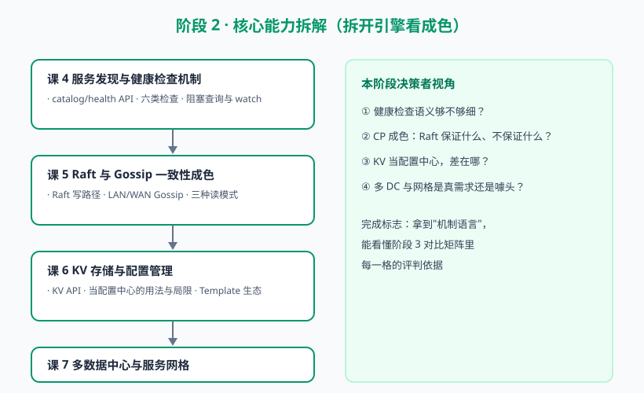

# 阶段 2：核心能力拆解（拆开引擎看成色）

> 故事章节定位：小林不吃宣传页那一套，要求"打开引擎盖"。这一章逐项检验 Consul 六大能力的机制与可靠性，为横向对比储备机制语言。

## 阶段目标

1. 掌握服务发现与健康检查的机制细节（查询接口、检查类型、watch）
2. 理解 Raft 写路径与 Gossip 两层池，能说清"Consul 的 CP 成色"
3. 掌握三种读模式，理解 Consul 在一致性与可用性上的灵活取舍
4. 评估 KV 做配置中心的用法与局限
5. 评估多数据中心与 Connect 服务网格的真实成色

## 学习重点

- catalog/health API 与 prepared query
- 六类健康检查与 deregister 语义
- 阻塞查询（blocking query）原理与 watch
- Raft：leader 选举、quorum、为什么是 3 或 5 节点
- LAN Gossip / WAN Gossip 分工
- default / consistent / stale 三种读模式
- KV API：CAS、前缀查询；与专业配置中心的差距
- Consul Template 生态；多 DC 联邦；Connect（mTLS、intentions）

## 必须掌握的知识点

| 课 | 知识点 |
|----|--------|
| 课 4 | catalog 与查询接口；健康检查类型与语义；阻塞查询与 watch |
| 课 5 | Raft 写路径与 quorum；Gossip 两层池；三种读模式 |
| 课 6 | KV API 与核心操作；KV 当配置中心的用法与局限；Consul Template 与集成生态 |
| 课 7 | 多数据中心联邦；Connect 服务网格；网格能力成色评估 |

## 阶段路径图

## 下一阶段预告

引擎拆完了，机制语言已就位。阶段 3 请另外四位候选人同台：ZooKeeper、etcd、Nacos、Eureka，用刚学的机制视角做四维对比，产出对比矩阵。
