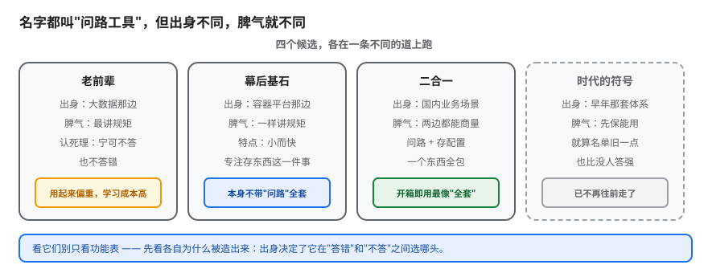

# 课 9：四大竞品逐个看

> 所属阶段：阶段 3「横向对比」 ｜ 学习目标：**决策参考** ｜ 预计 60–90 分钟

## 本课速览

四位对手依次登场：ZooKeeper、etcd、Nacos、Eureka。每位看三件事——**出身与定位**、**机制上的独门牌**、**短板与现状**。

本课不装也不跑竞品（那是课 10 之后的事），它的任务是把每位候选人的"底牌"讲清楚，为课 10 的对比矩阵准备弹药。

**三条带走的结论**：
1. 四位对手**不在同一赛道**——etcd 是 KV 存储，Nacos 是注册+配置平台，ZK 是协调原语，Eureka 是纯注册中心。把它们排成一列比高低，本身就问错了问题。
2. **"谁更好"取决于你要什么**：要强一致的元数据存储选 etcd；要开箱即用的注册+配置选 Nacos；要在 Hadoop 生态里做协调选 ZK；Eureka 只在遗留 Spring Cloud 场景里被动维持。
3. **趋势比现状更要紧**：ZK 的生态正在被移除（Kafka KRaft 是最明确的信号），Eureka 2.0 未发布即终止，这两位已不在"新项目该不该选"的讨论范围内。

---

## 第一幕：场景引入

小林把 Consul 摸了大半，心里有底了。但评审会上有人问了一句：

> "这些事 etcd 不也能做吗？我们 K8s 集群里本来就跑着 etcd。"

另一位同事补刀：

> "Nacos 不香吗？注册和配置一起搞定，还有中文控制台。"

还有人翻出老黄历：

> "我们五年前的系统用的就是 ZooKeeper，Dubbo 那套。"

小林意识到，光懂 Consul 不够——他得知道**这四位各自是干什么的、强在哪、弱在哪**。否则"为什么选 Consul 而不选 etcd"这个问题，他答不上来。

这一课，他决定挨个面试。

---

## 第二幕：认知冲突

小林最初的想法很朴素：把五个产品列一张表，按"功能多少"排个名次，谁分高选谁。

但真开始查资料，他发现三件不对劲的事：

**第一件：它们根本不是同一类东西。**

etcd 的自我介绍是"distributed reliable key-value store"（分布式可靠键值存储）——它压根没提"服务发现"。Nacos 的自我介绍是"dynamic service discovery, configuration management"，明摆着是冲着"注册+配置"来的。ZooKeeper 说自己是"centralized service for maintaining configuration information, naming, providing distributed synchronization"。

**拿一个 KV 存储去跟一个注册中心比"谁的服务发现做得好"，就像拿发动机跟整车比"谁更能跑"。**

**第二件：有些"共识"是错的。**

小林查 Nacos 的背景时，看到好几篇中文文章说"Nacos 是 Apache 顶级项目"，还有说"已成为 CNCF 孵化项目"。他去翻 CNCF 官方项目列表，Graduated（已毕业）、Incubating（孵化中）、Sandbox（沙箱）三段名单里——**都没有 Nacos**。再翻 GitHub，仓库是 `alibaba/nacos`，License 写着 `Apache-2.0`。

> ⚠️ **这里有个极易踩的坑**：`Apache-2.0` 是**开源许可证**的名字，跟"是不是 Apache 软件基金会的项目"**完全是两回事**。etcd 用的也是 Apache-2.0，但它归 CNCF。
>
> Nacos 的真实身份是：**阿里巴巴开源并主导的项目**，2018 年 11 月被列入 CNCF 云原生**全景图**（Landscape，只是"被收录进图谱"），并未进入 Apache 或 CNCF 的孵化/毕业体系。

**第三件：Eureka 的"死讯"被传歪了。**

网上铺天盖地"Eureka 凉了""Eureka 闭源"。小林翻到 Netflix 官方 wiki，原文是：

> The open source work on eureka 2.0 is discontinued. The code base and artifacts that were released as part of the existing repository of work on the 2.x branch is considered **use at your own risk**. **Eureka 1.x is a core part of Netflix's service discovery system and is still an active project.**

翻译过来：**停止的是 2.0 那条线，1.x 好得很**，而且 Netflix 自己生产环境还在用 1.x。更关键的是——**Eureka 2.0 从来就没正式发布过**，Spring Cloud 用户用的全是 1.x，所以"2.0 停止开发"对绝大多数人**毫无影响**。

> 🎯 **这一课的真正收获**：选型时最贵的不是"查不到资料"，而是"查到一堆互相矛盾的错误资料"。本课每个事实都标注来源与时点，你可以照着复核。

---

## 第三幕：层层揭示



> **看图**：四个候选各在一条道上跑——老前辈最讲规矩（宁可不答也不答错），幕后基石小而快（专注存东西），二合一一个全包（开箱最像全套），时代的符号先保能用（已不再往前走）。看它们**别只看功能表，先看各自为什么被造出来**：出身决定了它在"答错"和"不答"之间选哪头。

### 知识点 1：ZooKeeper——分布式协调的老前辈

#### 一句话定义

ZooKeeper 是一个**分布式协调服务**：它不直接给你"服务发现"，而是给你一组**原语**（znode、临时节点、顺序节点、watch），让你自己在上面搭出锁、选主、成员管理。

#### 直觉建立：它不是工具，是工具箱

这是理解 ZK 的关键。Consul 给你的是"注册一个服务、查健康实例"这种**开箱即用的功能**；ZK 给你的是`/` 树形节点 + 四种节点类型 + 监听机制这些**零件**。

打个比方：Consul 是一辆能开的车，ZK 是发动机、轮子、方向盘。你想造车，ZK 给你零件；你想开车，Consul 直接给你钥匙。

代价是：**你得自己造车，而且很容易造错**。这不是我贬低它——ZK 生态里有个著名的库叫 **Curator**，它存在的唯一理由就是"大部分人自己写 ZK 的锁和选主都写错了"。

#### 核心机制：ZAB 协议 + 临时节点

**ZAB（ZooKeeper Atomic Broadcast）**：ZK 自研的原子广播协议，保证写操作的线性一致性（linearizable writes）和客户端会话内的顺序性。它和 Raft 是同代产物，思路相似（都有 leader、都要 quorum），但**不是同一个协议**。

**临时节点（Ephemeral Node）+ 会话**：这是 ZK 做服务发现的基础玩法——

```text
/services/web/instance-1   (ephemeral, 会话断了自动消失)
/services/web/instance-2   (ephemeral)
```

服务启动建一个临时节点，会话断了节点自动消失；消费方 watch `/services/web` 的子节点变化。这套组合拳能work，但**语义是你自己赋予的**——"节点消失=服务下线"这个含义，是你在应用层约定的，ZK 并不知道这是"服务"。

#### 常见误区：读可能读到旧值

⚠️ **ZK 的读默认可能返回旧数据**。它的写是强一致的（走 leader + quorum），但**读可以由任意副本直接返回**，不保证看到最新写入，除非你显式调用 `sync()`。

这是个真实的正确性陷阱：有人用 ZK 做"配置变更通知"，写完立刻读，读到旧值，百思不得其解。Consul 那边对应的设计是**三种读模式**（default / consistent / stale，课 5 讲过）——把选择权显式交给你，而不是藏起来。

#### 现状与短板

| 维度 | 情况 |
|------|------|
| 出身 | 2007–2008 年 Yahoo 研究院，后捐给 Apache 基金会，现为**顶级项目**（这个"顶级"是真的） |
| 一致性 | ZAB，强一致写；读默认可能陈旧 |
| 独门牌 | 二十年生产验证，Hadoop / HBase / Kafka / Solr 生态的既有依赖 |
| 短板 | **无原生服务发现 / DNS / 健康检查语义**；客户端复杂；JVM 运维重 |
| 趋势⚠️ | 依赖它的系统正在**逐个移除依赖**——最明确的信号是 **Kafka 的 KRaft 模式**（用自研 Raft 取代 ZK，不再需要外部协调服务） |

> 💡 **对小林的决策意义**：如果"我们已有 Hadoop/HBase/Kafka 集群"，ZK 是现成的、不用额外部署——用它做协调没问题。但如果是**新建**一套微服务注册发现，ZK 相当于"用零件自己造车"，2026 年已不是一个理性选择。

---

### 知识点 2：etcd——k8s 背后的基石

#### 一句话定义

etcd 是一个**强一致的分布式键值存储**，用 Raft 协议，通过 gRPC 暴露 API。它是 Kubernetes 集群状态的唯一存储。

#### 直觉建立：它没打算做服务发现

etcd 的自我介绍里**没有"服务发现"四个字**。它的定位是"给分布式系统存最关键数据的可靠地方"。

那为什么总有人拿它跟 Consul 比？因为**它能做**——用 lease（租约）+ 前缀 + watch，完全可以拼出一个服务注册发现机制。但"能做"和"为你做了"是两码事：

| 你需要的东西 | etcd 给不给 |
|-------------|------------|
| 存储键值对 | ✅ 核心能力 |
| 监听变更（watch） | ✅ 精准推送 |
| 租约（lease，用于心跳） | ✅ 原生支持 |
| 健康检查 | ❌ 没有，你自己判断实例死活 |
| DNS 接口 | ❌ 没有 |
| 多数据中心 | ❌ 没有 |
| 服务网格 | ❌ 没有 |

**换句话说：用 etcd 做服务发现，健康检查、DNS、多 DC 这一整层都要你自己写。**

#### 核心机制：Raft + MVCC + lease

- **Raft**：与 Consul 相同的共识算法（课 5 的详细对照在这里直接用得上）。etcd 给的是**严格可串行化**（strict serializability）——写成功即持久，后续读必见。
- **MVCC（多版本并发控制）**：键有版本号，可以读到历史版本。这是它相对 Consul KV 的一个**明确优势**——Consul KV 没有版本历史（课 6 实测过，改了查不回旧值）。
- **Lease（租约）**：替代 ZK 的会话。服务注册时绑定租约并定期续租，租约过期键自动删除。**这个机制比 Consul 的 session + TTL 更利落**——体现在故障交接速度上：Consul 锁受 LockDelay 约束约 15 秒（课 6 实测），而 etcd 租约过期通常是秒级。

#### 现状：最活跃的"被依赖者"

| 维度 | 情况（核查于 2026-09） |
|------|----------------------|
| 出身 | CoreOS 2013 年发起，2018-12 进入 CNCF 孵化，**2020-11 毕业** |
| 许可证 | Apache-2.0 |
| 版本 | 当前维护 3.7 / 3.6 / 3.5 三条线；`v3.7.0` 于 2026-07-08 发布；3.4 线已于 2026-06-01 **EOL** |
| 独门牌 | **每个 K8s 集群都在跑它**——这使它成为本组里部署量最大的协调服务 |
| 短板 | 纯 KV，服务发现要自建；运行真集群的难点在证书、quorum 规划、以及**必须自己安排压缩（compaction）与碎片整理（defragmentation）**，否则数据库最终会拒绝写入 |

#### 常见误区：把"K8s 里有 etcd"当理由

⚠️ 常见推论："我们 K8s 里已经有 etcd 了，直接用它做服务注册，省一套组件。"

这个想法的漏洞在于：**K8s 的 etcd 是集群的控制面数据，不是给你存业务状态的**。往里塞应用数据会直接影响控制面稳定性，而且 K8s 升级时 etcd 的行为不由你控制。**要用 etcd，就独立部署一套。**

---

### 知识点 3：Nacos——注册 + 配置二合一

#### 一句话定义

Nacos（**Na**ming and **Co**nfiguration **S**ervice）是阿里巴巴开源的服务发现与配置管理平台，把"服务注册发现"和"动态配置管理"做进同一个产品，配中文控制台。

#### 直觉建立：它跟 Consul 最像，也最直接竞争

四家里，**Nacos 是唯一在"功能覆盖面"上跟 Consul 正面重叠的**——两边都做注册发现 + 配置管理。所以它是 Consul 的真对手，其余三位更像是不同赛道。

关键差异在**配置中心这一半**：

| 配置能力 | Consul KV | Nacos |
|---------|-----------|-------|
| 存配置 | ✅ | ✅ |
| 变更推送 | ✅ 阻塞查询 | ✅ |
| **版本历史** | ❌ 无（课 6 实测） | ✅ 有，支持回滚 |
| **灰度发布**（配置维度） | ❌ 无（KV 无版本/灰度概念） | ✅ 支持 |
| **灰度发布**（服务流量维度） | ✅ 有（`ServiceSplitter` 按比例切流，**需 Envoy 数据面**） | ✅ 支持 |
| **命名空间隔离** | 靠 key 前缀约定 | ✅ 原生 |
| **控制台** | 有 UI，但配置管理弱 | ✅ 一等公民 |

> 💡 **这就是为什么课 6 反复强调"Consul KV 当配置中心要配 Git 兜底"**——它没有版本和审计，而这两项恰恰是配置中心的标配。Nacos 原生就有。

#### 核心机制：AP / CP 可切换

这是 Nacos 最有辨识度的设计：

- **AP 模式（Distro 协议）**：用于**临时实例**的服务注册。网络分区时优先保证可用——宁可返回可能过期的实例列表，也不拒绝服务。
- **CP 模式（Raft）**：用于**持久化实例**和配置数据。优先保证一致——少数派分区拒绝写入。

**为什么这么设计？** 因为服务注册和配置管理的一致性要求不同：
- 服务实例列表短暂不准，客户端重试或熔断能兜住 → 可用性优先（AP）
- 配置写错了要出事，且必须所有人看到同一份 → 一致性优先（CP）

对比 Consul：Consul 的服务目录是 CP（Raft），但提供了 `stale` 读模式让你在需要时主动要可用性（课 5）。**两条路殊途同归**——把选择权交给使用者。

#### 归属澄清（本课必须记牢的一条）

> ⚠️ **Nacos 不是 Apache 项目，也不是 CNCF 孵化项目。**
>
> - GitHub 仓库：`alibaba/nacos`，由**阿里巴巴开源并主导**
> - 许可证：Apache-2.0（再次强调：这是**许可证名**，不是基金会归属）
> - 2018-11 被列入 CNCF 云原生**全景图**（Landscape）——"收录进图谱"是宣传性质的，不等于"成为 CNCF 项目"
> - 核查 CNCF 官方项目清单（Graduated / Incubating / Sandbox 三段），**均无 Nacos**
>
> 网上流传的"Nacos 是 Apache 顶级项目""2026 年晋升 CNCF 孵化"均**无权威来源支持**，属以讹传讹。**本条是本课重点核查项**（原大纲标注"待复核"，复核结论为原表述错误）。

#### 现状与生态位

| 维度 | 情况（核查于 2026-09） |
|------|----------------------|
| 出身 | 阿里巴巴 2018-07 开源；前身为内部 ConfigServer / NamingServer，历经双十一验证 |
| 版本 | 3.x 线（3.2.4，2026-08-27）需 Java 17；2.x 线（2.5.4，2026-08-18）需 Java 8；两条线并行维护 |
| 独门牌 | 注册+配置+控制台一体；**Java / Spring Cloud Alibaba 深度亲和**；中文社区活跃 |
| 短板 | **多语言支持弱于 Consul**；生态绑定 JVM 栈；3.x 起定位向 AI Agent 管理扩展（偏离纯注册中心定位） |
| 社区 | 活跃（GitHub 30k+ star，2026 年持续有新 Committer 晋升） |

---

### 知识点 4：Eureka——Netflix OSS 时代的符号

#### 一句话定义

Eureka 是 Netflix 开源的服务注册中心，AP 设计，带"自我保护"机制，曾是 Spring Cloud 的默认注册中心。

#### 直觉建立：它把"可用性"推到了极致

Eureka 的设计哲学跟 Consul 相反。

**Consul**：网络分区时少数派拒绝服务（CP），宁可不可用也不给错数据。
**Eureka**：每个节点平等，都能读写；分区后各节点继续服务，返回自己知道的（可能过期的）实例列表。

**自我保护模式**是它的标志性设计：当心跳丢失比例突然超过阈值（默认 15 分钟内低于 85% 的心跳续约），Eureka 会**停止剔除任何实例**——

> 逻辑是："大面积心跳丢失，更可能是我自己的网络出问题了，而不是那么多服务同时挂了。那我就别乱删了。"

这是个务实的工程判断：**宁可保留可能已死的实例（让调用方熔断兜底），也别把健康的实例误删（那会造成真正的服务中断）。**

#### 现状澄清（第二个必须记牢的点）

> ⚠️ **"Eureka 死了"是错的，"Eureka 2.0 死了"才对。**
>
> - **Eureka 2.0**：开源工作已停止（discontinued），2.x 分支代码官方标注 **use at your own risk**。而且**它从未正式发布过**。
> - **Eureka 1.x**：Netflix 官方声明是"**a core part of Netflix's service discovery system and is still an active project**"（核心组件，仍是活跃项目）。Netflix 生产环境在用。
> - **Spring Cloud 用户**：用的全是 1.x（`com.netflix.eureka:eureka-client:1.x`），**完全不受 2.0 停摆影响**。
>
> 那句被广泛误传的"Eureka 闭源"是把 "2.0 开源工作停止" 读成了 "项目闭源"。

#### 机制短板

Eureka 2.0 的动机文档（官方 wiki）自己列了三条 1.x 的局限，这比外人评价更可信：

1. **只支持同质化的客户端视图**：客户端必须拉取**整个注册表**，无法只订阅关心的部分 → 客户端内存随注册表膨胀
2. **只支持定时拉取**：没有推送，变更延迟取决于轮询间隔
3. **复制算法限制扩展性**：广播复制，每个节点都要承受全部写入流量

讽刺的是，**这三条正是 2.0 想要解决、但 2.0 被砍掉后再也没解决的问题**。

| 维度 | 情况 |
|------|------|
| 出身 | Netflix，2012 年左右，Spring Cloud 多年的默认搭档 |
| 一致性 | AP，无强一致保证 |
| 独门牌 | 简单、稳定、Netflix 规模验证；Spring Cloud 生态无缝 |
| 短板 | 无配置管理、无 KV、无 DNS、无健康检查多样性；注册表全量拉取；**新功能已停止** |
| 趋势⚠️ | 新项目采用度持续下降；Spring Cloud 官方同时支持 Consul / ZK / K8s / Nacos 作为替代 |

---

### 知识点 5（补充）：把它们放回赛道上看

单独看完四位，最后要做一个整体定位——**它们不在同一赛道**：

```text
        注册发现能力 ──────────────────────────►
   ▲
   │  Nacos ●                    ● Consul
配 │           （注册+配置一体，两强正面竞争）
置 │
能 │  ─────────────────────────────────────
力 │  Eureka ●
   │  （纯注册中心，无配置）
   │
   │  ZK ●            ● etcd
   │  （协调原语）   （纯 KV，可拼装但无原生语义）
   ▼
```

- **右上象限（注册+配置）**：Consul vs Nacos —— 真正的对手，课 10 重点比
- **左侧（纯注册）**：Eureka —— 遗留场景
- **下边（基础设施层）**：ZK / etcd —— 给你零件，不是给你成品

> 🎯 **这解释了一个常见困惑**：为什么网上"Consul vs etcd"的对比文章读起来总别扭？因为它们在比"成品"和"零件"。正确问法不是"谁更好"，而是**"我要不要自己造那一层"**。

---

## 第四幕：实操验证

本课是**横向对比课，不安装也不运行竞品**。因此本幕的任务不是跑命令，而是**做一次事实核查演练**——教你如何自己验证本课的每个关键事实，避免被错误资料带偏。

> ⚠️ **诚实声明**：以下核查方法的**输出结果是本课写作时实际查到的**（标注时点），你可以照着复现。若你核查时结论已变（项目状态随时可能发生化），**以你查到的为准**——这正是本课想教的能力。

### 验证 1：核实一个项目到底归哪个基金会

**错误做法**：看 README 里的 License 字段就下结论。

**正确做法**：查基金会的**官方项目清单**。

```text
CNCF 官方项目清单（Graduated / Incubating / Sandbox 三段名录）
  → 逐段搜索目标项目名
  → 在任何一段都找不到 → 它就不是 CNCF 项目

Apache 软件基金会项目清单（projects.apache.org）
  → 搜索目标项目名
  → 找不到 → 不是 Apache 项目（哪怕许可证叫 Apache-2.0）
```

**本课实际核查结果（2026-09）**：

| 项目 | CNCF 清单 | Apache 清单 | 实际归属 |
|------|----------|------------|---------|
| etcd | ✅ Graduated（2020-11 毕业） | — | CNCF |
| ZooKeeper | — | ✅ 顶级项目 | Apache |
| Nacos | ❌ 三段均无 | ❌ 无 | **阿里巴巴主导** |
| Eureka | ❌ | ❌ | **Netflix 主导** |

> 这个表本身就是本课的产物。**"License 是 Apache-2.0" 不等于 "Apache 基金会项目"**——这是最容易犯的事实错误。

### 验证 2：核实"某项目是否已停止维护"

**错误做法**：看博客标题。

**正确做法**：三步——

1. **查官方 wiki / 官网的原话**（不是二手解读）
2. **查最近一次 release 的时间**（GitHub releases 页）
3. **区分"整条产品线停止"还是"某个大版本停止"**

**本课实际核查结果（2026-09）**：

| 项目 | 官方原话 | 最近 release | 结论 |
|------|---------|-------------|------|
| Eureka | "2.0 ... discontinued" + "1.x ... still an active project" | 1.x 线持续 | **只是 2.0 停止，1.x 活跃** |
| ZooKeeper | Apache 顶级项目，活跃 | 持续 | 活跃，但生态在流失 |
| etcd | CNCF 毕业 | 3.7.0 / 2026-07-08 | 非常活跃 |
| Nacos | 官网 + GitHub | 3.2.4 / 2026-08-27 | 非常活跃 |

### 验证 3：核实"趋势"——谁在被移除

静态的现状会骗人，**趋势才是决策输入**。查法：看**依赖它的上游项目是否在移除依赖**。

**本课实际核查结果（2026-09）**：

- **ZooKeeper 的明确信号**：Kafka 推出 **KRaft 模式**，用自研 Raft 取代 ZK，新版本已不再强制依赖外部 ZK。理由正是"ZK 运维重、依赖多一层"。这是"ZK 生态在流失"最硬的一条证据。
- **Eureka 的明确信号**：Spring Cloud 官方同时支持 Consul / ZK / Nacos / K8s 作为注册中心替代，Eureka 从"默认"变成"选项之一"。
- **etcd 的反向信号**：它是 K8s 的唯一状态存储，**部署量只会随 K8s 增长**。
- **Nacos 的正向信号**：持续有新 Committer 晋升、稳定发版、向 AI Agent 管理扩展（3.x 定位）。

### 验证 4：一次"证伪练习"

给你三句常见说法，用本课方法判断真假——

| 说法 | 判断 | 依据 |
|------|------|------|
| "Nacos 是 Apache 顶级项目" | ❌ **假** | CNCF 与 Apache 官方清单均无；`Apache-2.0` 是许可证不是归属 |
| "Eureka 已经闭源了" | ❌ **假** | 停止的是从未发布的 2.0；1.x 仍是 Netflix 活跃项目 |
| "etcd 是 CNCF 毕业项目，每个 K8s 集群都跑它" | ✅ **真** | 2020-11 毕业；K8s 用它存全量集群状态 |

> 💡 **做这一遍的价值**：这三句话里两句是假的，而它们在中文技术社区流传极广。**选型决策建立在假事实上，比没有事实更糟。**

---

## 第五幕：体系收束

### 本课在课程中的位置


本课是阶段 3 的**输入准备**。没有这一课，课 10 的矩阵就只是罗列名词；有了这一课，矩阵里每个格子都有"为什么"。

### 三条带走的结论

1. **四家不在同一赛道**：etcd 是 KV 存储，ZK 是协调原语，Nacos 是注册+配置平台，Eureka 是纯注册中心。**先问"它是成品还是零件"，再比高低。**
2. **Nacos 是 Consul 唯一的正面对手**（功能面重叠）；etcd / ZK 是"你愿不愿意自己造那一层"的选择；Eureka 只剩遗留场景。
3. **核查事实比记结论更重要**：本课推翻了两条流传甚广的错误说法（Nacos 归属、Eureka 已死），方法在第四幕，可以复用。

### 对选型决策的输入

| 如果你的情况是… | 本课的提示 |
|----------------|-----------|
| 已有 Hadoop / Kafka 老集群 | ZK 现成可用，但新功能别再往上搭；注意 Kafka KRaft 趋势 |
| 已经重度使用 K8s | etcd 就在集群里，但**别拿控制面的 etcd 存业务数据**；要做服务发现得自造一层 |
| 团队是 Java / Spring Cloud 栈 | **Nacos 是必须认真评估的对手**，尤其当你同时需要配置中心 |
| 已有遗留 Spring Cloud 系统跑 Eureka | 不用慌，1.x 还在维护；但新建系统不必再选它 |
| 异构环境（VM + 容器 + 多机房） | 这是 Consul 的主场，四家里没有正面竞争者 |

### 术语表（按命名三态标注）

| 术语 | 说明 |
|------|------|
| **ZAB**（ZooKeeper Atomic Broadcast） | ZooKeeper 自研的原子广播协议。**无在用中文译名**，保留缩写；可理解为"ZK 版的共识协议"，与 Raft 同代但不同实现 |
| **znode** | ZK 中的数据节点。**无在用中文译名**，保留英文；可理解为"ZK 树形结构里的一个节点" |
| **ephemeral node**（临时节点） | **公认译名**：临时节点。会话断开自动删除 |
| **Curator** | Netflix 开源的 ZK 客户端库。**无译名**，保留英文 |
| **lease**（租约） | **公认译名**：租约。etcd 中替代会话的机制，过期自动删除绑定键 |
| **MVCC**（Multi-Version Concurrency Control） | **公认译名**：多版本并发控制 |
| **quorum** | **社区常用译法「法定人数」，官方未定中文名**；也有译"多数派"。本课两种都用，首次出现已标注 |
| **自我保护模式** | Eureka 的 self-preservation mode，**公认译名** |
| **Distro 协议** | Nacos AP 模式下的一致性协议，**无译名**，保留英文 |
| **Landscape**（CNCF 云原生全景图） | **社区常用译法「全景图」，官方未定中文名**；注意它只是"收录图谱"，不等于项目孵化级别 |

> 📌 **命名纪律**：本课术语中文译名遵循"命名三态 + 标注纪律"——公认译名直接用；社区译名括注来源；无在用译名保留英文并在表中给白话解释。标注只在术语表给一次，正文不重复。

---

## 课尾三段式

### 本课速览

- **ZooKeeper**：协调原语（不是成品），ZK 生态正在被上游移除（Kafka KRaft），新项目不推荐
- **etcd**：纯 KV 强一致存储，K8s 基石，做服务发现要自造健康检查/DNS/多DC 那层
- **Nacos**：注册+配置一体，Consul 的正面对手，Java 栈亲和，**注意它不是 Apache/CNCF 项目**
- **Eureka**：AP 设计 + 自我保护，2.0 未发布即终止但 1.x 仍活跃，仅遗留场景

### 课程导航

- **上一课**：[lesson-08 ACL 与安全模型](../../2-核心能力拆解/lessons/lesson-08-ACL与安全模型.md)
- **下一课**：[lesson-10 多维对比矩阵](./lesson-10-多维对比矩阵.md)
- **阶段概览**：[阶段 3 横向对比](../overview.md)｜[课程目录](../../../02-课程目录.md)

### 小测

**1.（单选）关于 Nacos 的归属，下列说法正确的是？**
- A. Nacos 是 Apache 软件基金会的顶级项目
- B. Nacos 是 CNCF 孵化项目
- C. Nacos 由阿里巴巴开源并主导，许可证为 Apache-2.0，但未进入 Apache 或 CNCF 项目体系
- D. Nacos 已捐献给 Linux 基金会

<details><summary>答案</summary>

**C**。仓库是 `alibaba/nacos`，由阿里巴巴主导。许可证 `Apache-2.0` 是**许可证名**，与基金会归属无关——这是本题的考点。CNCF 官方项目清单（Graduated/Incubating/Sandbox 三段）与 Apache 项目清单中均无 Nacos；2018-11 它只是被列入 CNCF 云原生**全景图**（Landscape），"收录进图谱"不等于"成为孵化项目"。

</details>

**2.（单选）关于 Eureka 的现状，下列说法正确的是？**
- A. Eureka 已经闭源，不能用了
- B. Eureka 2.0 停止开发且 Netflix 已弃用 1.x
- C. Eureka 2.0 未正式发布即终止，但 1.x 仍是 Netflix 生产在用的活跃项目
- D. Eureka 已被 Netflix 从生产环境移除

<details><summary>答案</summary>

**C**。官方 wiki 原话：2.0 的开源工作 discontinued、2.x 分支 use at your own risk；同时明确 1.x "is a core part of Netflix's service discovery system and is still an active project"。且 2.0 **从未正式发布**，Spring Cloud 用户用的全是 1.x，不受影响。

</details>

**3.（多选）用 etcd 做服务注册发现，以下哪些能力需要你自己实现？（多选）**
- A. 健康检查
- B. 键值存储
- C. DNS 接口
- D. 多数据中心

<details><summary>答案</summary>

**A、C、D**。etcd 原生提供的是键值存储（B）、watch 和 lease；健康检查、DNS 接口、多数据中心都不在它的能力范围内，需要应用层自建。这正是"零件 vs 成品"的区别。

</details>

**4.（单选）ZooKeeper 生态正在流失的最明确信号是？**
- A. ZooKeeper 停止发版
- B. Kafka 推出 KRaft 模式，不再依赖外部 ZooKeeper
- C. ZooKeeper 被 Apache 基金会移除
- D. ZooKeeper 许可证变更为 BUSL

<details><summary>答案</summary>

**B**。Kafka 的 KRaft 模式用自研 Raft 取代 ZK，是"上游项目正在移除 ZK 依赖"最硬的证据。ZK 本身仍是活跃的 Apache 顶级项目（A、C 错），许可证是 Apache-2.0（D 错）。

</details>

### 接力提示词

> 继续学习下一课时，可使用：
>
> "请基于[课 9 四大竞品逐个看](./lesson-09-四大竞品逐个看.md)的四位竞品分析，开始课 10《多维对比矩阵》。要求：① 用一致性与可用性、功能与接口、生态与集成、性能与规模四个维度建对比矩阵；② 每个格子的结论必须能回指课 9 的事实依据；③ 性能对比只引用有出处的数据，无出处不写数字（阶段 3 大纲 P1 约定）；④ 明确给出'什么场景选谁'的决策卡片。"

---

## 评审结论（对学员可见）

### A 视角：技术事实核查

**核查方法**：对课内每个关键事实回到一手来源（官方 wiki / 基金会项目清单 / 官方 release 页）核验，标注核查时点。

| 核查项 | 核查方式 | 结果 |
|--------|---------|------|
| Nacos 归属（Apache 顶级项目？） | 查 CNCF 官方项目清单三段 + Apache 项目清单 | ❌ **原大纲表述错误，已更正** |
| Nacos 许可证 Apache-2.0 | 查 GitHub 仓库 License 字段 | ✅ 确认（并强调许可证≠归属） |
| Nacos 2018-11 列入 CNCF Landscape | 查阿里云开发者社区公告 + 百度百科 | ✅ 确认（但已注明 Landscape ≠ 孵化） |
| Eureka 2.0 discontinued 原话 | 查 Netflix/eureka 官方 wiki | ✅ 原话确认 |
| Eureka 1.x 仍活跃 | 查官方 wiki + 2026 年多篇现状分析 | ✅ 确认 |
| etcd CNCF 毕业时间 2020-11 | 查 Wikipedia + CNCF 公告 | ✅ 确认 |
| etcd 3.7.0 发布时间 2026-07-08 | 查 kubernetes.io 官方 blog | ✅ 确认 |
| etcd 3.4 EOL 2026-06-01 | 查 etcd 官方 blog + GitHub release tag | ✅ 确认 |
| ZK 为 Apache 顶级项目 | 查项目资料（20 年生产使用、Kafka/HBase 依赖） | ✅ 确认 |
| Kafka KRaft 移除 ZK 依赖 | 查对比资料（"Kafka's KRaft mode being the clearest example"） | ✅ 确认 |

**A 视角抓出并修正的问题（2 项）**：

1. **【P0】原大纲"Nacos 是 Apache 顶级项目"为事实错误** —— 原大纲标注"（核查于 2026-08 待复核毕业状态）"，本次复核确认为**错误表述**：CNCF 三段清单与 Apache 项目清单均无 Nacos。已全面更正为"阿里巴巴开源并主导"，并单独写了"归属澄清"警示块 + 设计了验证 1 教方法 + 小测第 1 题专门考这个坑。
2. **【P1】原大纲"Eureka 2.x 开发停滞"表述不准确** —— 准确说法是"2.0 从未正式发布即被放弃，1.x 仍活跃"。笼统说"2.x 停滞"会让读者误以为在用 1.x 的自己受影响。已改写为精确的"2.0 停止 / 1.x 活跃"，并用官方原话佐证。

### B 视角：零基础教学体验

| 检查项 | 结果 |
|--------|------|
| 五幕结构 + 六要素齐备 | ✅ 每知识点含一句话定义 / 直觉建立 / 核心机制 / 常见误区 |
| 课尾三段式（速览 / 导航 / 小测 + 接力提示词） | ✅ 小测 4 题（含 1 道多选），附答案解析 |
| 未讲过的术语首次出现是否有解释 | ✅ ZAB、znode、lease、Distro、Landscape 等均给白话解释 |
| 术语表按命名三态标注 | ✅ 10 个术语，区分公认译名 / 社区译名 / 无译名 |
| 是否有"照抄跑不通"的风险 | ✅ 无命令依赖；第四幕为事实核查方法，可复现 |

**B 视角的设计说明**：本课不装竞品，因此第四幕没有可跑的命令——改为**事实核查演练**（4 个验证 + 1 次证伪练习）。这样处理既符合"不能编造实测数据"的铁律，又让零基础读者拿到了可复用的核查方法。

### 仍存在的已知边界

- **本课不安装也不运行任何竞品**，所有结论基于一手资料核查（已在第四幕顶部声明）。性能类数据**刻意未给数字**（阶段 3 大纲 P1 约定：无出处不写数字），将在课 10 处理。
- **项目状态随时可能变化**：Nacos 归属、Eureka 维护状态、etcd 版本线均以"核查于 2026-09"为准，读者复现时若结论已变，以查到的为准。
- **未覆盖**：四家的详细部署与运维实践（本课只做定位与机制对比）；四家与 Consul 的逐项打分（课 10 任务）。
