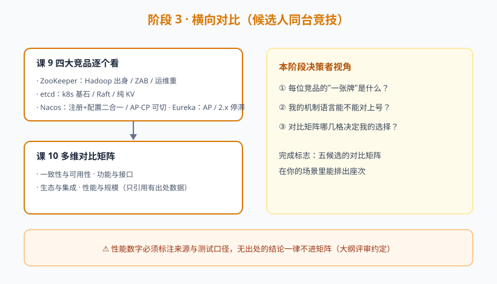

# 阶段 3：横向对比（候选人同台竞技）

> 故事章节定位：五位候选人同台。小林用阶段 2 学到的机制语言，逐个审视四位竞品的出身、牌面与短板，最后合成一张多维对比矩阵。

## 阶段目标

1. 掌握 ZooKeeper / etcd / Nacos / Eureka 各自的定位、机制与适用场景
2. 能用一致性、功能、生态、性能四个维度做结构化对比
3. 产出一张可复用的多维对比矩阵（决策的直接输入）

## 学习重点

- ZooKeeper：Hadoop 生态出身、ZAB 协议、临时节点做服务发现、运维复杂度
- etcd：k8s 基石、Raft、纯 KV 定位、gRPC API
- Nacos：阿里开源、注册+配置二合一、AP/CP 可切换、社区活跃度
- Eureka：Netflix 出品、AP 自我保护、2.x 停滞现状、Spring Cloud 生态位
- 四维对比：一致性与可用性、功能与接口、生态与集成、性能与规模
- ⚠️ 性能对比只引用有出处的数据，无出处不写数字（大纲评审 P1 约定）

## 必须掌握的知识点

| 课 | 知识点 |
|----|--------|
| 课 8 | ZooKeeper；etcd；Nacos；Eureka |
| 课 9 | 一致性与可用性对比；功能与接口对比；生态与集成对比；性能与规模参考 |

## 阶段路径图

## 下一阶段预告

矩阵在手，只差最后一步。阶段 4 处理三个"账本问题"：许可证合规吗？运维成本多少？想换的时候退得出吗？最后形成决策清单，签字画押。
