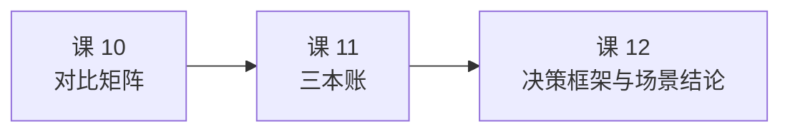

# 课 11：许可证成本与风险

> 所属阶段：阶段 4「决策落地」 ｜ 学习目标：**决策参考** ｜ 预计 60–90 分钟

## 本课速览

技术对比结束了，进入**尽调**环节。算清三本账：

1. **许可证账**：BUSL 1.1 到底限不限我？（法务关心）
2. **运维账**：养它要花多少？（老板关心）
3. **退出账**：想走的时候能不能走掉？（架构评审关心）

三本账算完，决策的风险面就收敛了。

**三条带走的结论**：
1. **对绝大多数团队，BUSL 1.1 不生效**——内部使用明确豁免，限制的是"卖与 HashiCorp 竞争的托管服务"。但它确实**不是开源许可证**（OSI 不认证），这在有合规要求的组织里是真实成本。
2. **运维账里最贵的不是机器，是"必须懂它"的人**：quorum 健康、leader 切换、证书轮换、备份恢复、指标核验——每一项的门槛都高于"会启动"。
3. **退出账最反直觉的一条**：Consul **没有**像 OpenTofu 那样的成熟社区 fork 可退。真正的退出路径是**控制耦合面**，不是指望 fork。

---

## 第一幕：场景引入

小林把对比矩阵做完了，技术方案有了。但评审会上三个问题让他答不上来：

**法务问**：
> "Consul 换了许可证，我们现在用它，将来会不会被告？"

**老板问**：
> "这套东西养起来要几个人？我们团队现在两个人管三十个服务。"

**架构评审问**：
> "万一三年后要换掉，我们换得动吗？"

小林意识到：**技术选型的风险，一半不在技术本身**。他做过对比矩阵，但从没算过这三本账。

这一课，他决定把三本账一笔一笔算清楚。

---

## 第二幕：认知冲突

小林先去搜"Consul 许可证"，看到的标题是这样的：

> "HashiCorp 全线转 BUSL" ｜ "Consul 不再开源" ｜ "Consul 凉了？"

他心里一沉。但真去读许可证原文，发现事情没那么简单——**也没那么轻松**。

**第一层反转：限制的不是"商用"，是"竞争"。**

BUSL 1.1 的默认条款是**禁止生产使用**（这点很多人不知道）。但 HashiCorp 加了 **Additional Use Grant**（附加使用授权），把生产使用又放开回来，只留了一个例外：

> 你可以生产使用，**除非**你在向第三方提供"与 HashiCorp 付费版本竞争"的托管或嵌入式服务。

所以准确的说法是：**不是"禁止商用"，是"禁止做竞争对手"。**

**第二层反转：但它确实不是开源了。**

小林查 OSI（Open Source Initiative）的认证列表——**BUSL 1.1 不在其中**。原因是它对"特定领域的使用"设了限制，违反了开源定义第六条"不得歧视特定领域"（no discrimination against fields of endeavor）。

> ⚠️ **这不是文字游戏**。如果你的组织有"只能使用 OSI 认证开源软件"的合规政策，Consul 现在**不符合**。这对国企、金融、政府采购类组织是硬约束。

**第三层反转（也是最容易被忽略的）：四年前的版本会自动变回开源。**

BUSL 有个 **Change Date** 机制：**每个版本发布满 4 年，自动转为 GPL 兼容许可证**（HashiCorp 指定的是 **MPL 2.0**）。

听起来很美好，但有个陷阱——

> **只有那个老版本会转，新版本带着新的四年时钟。** 想用已转开源的版本，就得一直用四年前的老版本（没有安全补丁）。

---

## 第三幕：层层揭示

### 知识点 1：BUSL 许可证深度解读

#### 一句话定义

BUSL 1.1（Business Source License）是**"源代码可得"（source-available）**而非开源许可证：可以看、可以改、可以再分发、允许特定条件的生产使用，但**禁止提供与 HashiCorp 付费版竞争的服务**；每个版本发布满 4 年自动转为 MPL 2.0。

#### 条款拆解（基于 Consul LICENSE 原文）

> 以下引自 `hashicorp/consul` 仓库 LICENSE 文件关键参数，非二手解读。

| 参数 | 内容 |
|------|------|
| **Licensor**（授权方） | HashiCorp, Inc. |
| **Licensed Work**（受许可作品） | Consul **1.17.0 及以后** |
| **Change Date**（转换日） | 该版本发布之日起 **4 年** |
| **Change License**（转换后许可证） | **MPL 2.0** |
| **Additional Use Grant**（附加授权） | 允许生产使用，**但不得**向第三方提供托管/嵌入式服务以与 HashiCorp 付费版竞争 |

**Additional Use Grant 的原文逻辑**（这是判断"限不限我"的核心）：

```text
允许：生产使用，前提是你的使用不包括
     "向第三方提供托管或嵌入式服务以与 HashiCorp 付费版竞争"

"竞争性产品"的定义：
  - 向第三方提供的、收费（含付费支持）的产品
  - 且与 HashiCorp 付费版能力显著重叠

明确豁免：
  ✅ 组织内部使用 —— 不构成竞争性产品
  ✅ 非收费提供的产品 —— 不构成竞争性产品
  ✅ 关联公司（同一控制下）也算"你的组织"
```

#### 判断"限不限我"的三问自查

| 问自己 | 若回答 |
|--------|--------|
| ① 我是**自己用**（管自己的基础设施），还是**卖给别人**？ | 自己用 → **不受限** |
| ② 如果是卖，收不收费？ | 不收费 → **不受限** |
| ③ 如果收费，是否与 HashiCorp 付费版（HCP Consul 等）能力显著重叠？ | 不重叠 → 不受限；**重叠 → 受限，需商业授权** |

> 🎯 **对绝大多数企业的结论**：**内部使用不受限**。你在自己机房/云上跑 Consul 管自己的服务，BUSL 对你没有约束。

#### 常见误区：四个流传很广的错误说法

⚠️ **误区 1："BUSL = 不能商用"**
错。HashiCorp 的 Additional Use Grant **明确允许生产使用**，限制的只是竞争性转售。

⚠️ **误区 2："BUSL 就是开源，只是名字不同"**
错。OSI 不认证 BUSL，因为它限制特定领域的使用。**这在有合规政策的组织里是真实障碍。**

⚠️ **误区 3："反正 4 年后就开源了"**
半对。**只有那个具体版本会转**。想享受"已开源"状态，就得停留在四年前的版本上——而那个版本不再有安全补丁。**对新版本而言，四年时钟永远在往前走。**

⚠️ **误区 4："API/SDK 也变成 BUSL 了"**
错。**API 与 SDK 保持 MPL 2.0**。这意味着你用官方 SDK 写的客户端代码，不受 BUSL 约束。这是 HashiCorp 刻意保留的生态接口。

#### 关键事实时间线（核查于 2026-09）

| 时间 | 事件 |
|------|------|
| 2023-08-10 | HashiCorp 宣布全线产品从 MPL 2.0 转 BUSL 1.1（Terraform / Vault / Consul / Nomad / Packer 等） |
| — | **Consul 1.16.4 是最后一个 MPL 2.0 版本**；1.17.0 起为 BUSL 1.1 |
| 2025-02-27 | **IBM 完成对 HashiCorp 的收购**（64 亿美元） |
| — | API / SDK 及多数库**保持 MPL 2.0** |

> ⚠️ **IBM 收购是本课必须知道的背景**：Consul 现在归 IBM 旗下。**收购本身不改变许可证**，但它改变了"这个项目的长期路线由谁决定"。做三五年规划时，这是合理的考量因素——与许可证风险是两件事。

---

### 知识点 2：运维成本评估

#### 一句话定义

运维账 = **机器成本 + 人力成本 + 认知负担**。其中真正贵的后两项。

#### 最小生产拓扑

```text
3 或 5 个 server 节点（奇数，满足 quorum）
+ 每个业务节点一个 client agent
```

**为什么是 3 或 5？** Raft 要求多数派（quorum）存活才能写入：3 节点容忍 1 个故障，5 节点容忍 2 个。**偶数没有意义**——4 节点和 3 节点一样只容忍 1 个故障，却多养一台机器。

> ⚠️ **别用 `consul agent -dev` 上生产**：dev 用内存存储、无 Raft 持久化，**重启即全丢**。这是官方与所有运维指南的一致强调。

#### 五项日常运维负担

| 负担项 | 具体内容 | 难度来源 |
|--------|---------|---------|
| **quorum 健康** | 监控 server 节点存活数是否仍构成多数派 | 需要理解 Raft，不是看"进程在不在" |
| **leader 切换** | leader 频繁切换（选举震荡）是典型故障 | 根因常在磁盘 I/O 或网络抖动，排查需经验 |
| **证书轮换** | gossip key、TLS 证书、Connect CA 三类各有周期 | 三类是**独立**的，容易漏（课 8 已强调） |
| **备份恢复** | 见下方缺口 #3 | **恢复是全量覆盖**，误用会造成数据倒退 |
| **监控告警** | 见下方缺口 #4 | 指标语义需核验，否则告警**静默失效** |

---

> **【缺口 #3 备份恢复与灾备】**（2026-09-17 补，此前全课程 0 次覆盖）

**官方文档分区**：`manage/disaster-recovery`（[备份与恢复](https://developer.hashicorp.com/consul/docs/manage/disaster-recovery/backup-restore)）

**核心命令**：

```bash
# 备份
consul snapshot save backup.snap

# 恢复
consul snapshot restore backup.snap
```

**快照包含什么**：KV 数据、服务目录（catalog）、ACL token、intentions。

> ⚠️ **快照不含已签发证书的私钥** —— Connect CA 需**单独备份**。只做 `snapshot save` 会漏掉这一项，恢复后网格证书链断裂。

> ⚠️ **恢复是"全量覆盖"而非"增量合并"** —— 恢复会把整个集群状态**回滚到快照时刻**。这意味着：快照之后新注册的服务、新写的 KV **都会丢失**。误以为它是"合并"而在运行中恢复，是会造成真实数据倒退的高危操作。

**对运维账的影响**：备份策略的完善度直接决定 **RTO（恢复时间目标）** 与数据安全边界。它是运维账里独立的一整项，不能只写"有备份"三个字——**必须验证过一次恢复**。

---

> **【缺口 #4 监控告警与遥测指标】**（2026-09-17 补，此前全课程 0 次覆盖）

**官方文档分区**：`monitor`（约 11 条）+ `observe`（约 13 条）

**要点**：
- Consul 暴露 **Prometheus 格式**指标
- 关键指标：quorum 健康、leader 变动、Raft 提交延迟、gossip 健康
- **agent 自身健康**与**集群健康**是两层，需分别监控

> ⚠️ **指标写进告警规则前必须执行三步核验**（课程既有铁律，源自 Kafka 课 17 实测教训）：
>
> 1. `curl` 看**实际值域**，判断是否落在你预期的语义区间（比率应在 0~1 或 0~100）
> 2. 读该行上方的 `# HELP`，确认 `attribute=` 是 **Count（累积）还是 Value（瞬时）**
> 3. **连续采样 3~5 次**：单调递增 = 计数；有升有降 = 瞬时值
>
> **为什么这条是铁律**：实测过 `RequestHandlerAvgIdlePercent` 被大量教程用作 IO 线程告警指标（推荐阈值 `< 0.3`），但它实际是**累积计数**（量级 1e11，5 次采样严格单调递增）。照抄该阈值**永不触发**——比配错阈值更危险，因为**告警静默失效，你会误以为系统健康**。

---

> **【缺口 #5 升级路径与兼容性矩阵】**（2026-09-17 补，此前仅课 2 提过 LTS 版本线）

**官方文档分区**：`upgrade`（21 条），权威入口见[版本兼容矩阵](https://developer.hashicorp.com/consul/docs/upgrade/compatibility)

**要点**：
- ⚠️ **不支持跨多版本跳跃升级**，须按官方支持的升级路径**逐级走**。想从 1.15 直接跳 2.0 是不行的。
- ⚠️ 若用 Connect 网格，**Consul 版本与 Envoy 版本存在兼容矩阵约束**，二者需匹配。升级 Consul 可能被迫同步升级 Envoy。
- 当前维护三条版本线（**2.0.x / 1.22.x / 1.21.x**，核查于 2026-08）；**新部署应从 2.0.x 起步**。

**对运维账的影响**：升级路径约束是长期运维成本的**隐性部分**。选型时必须确认团队能否承担"跟随升级"的节奏——**一个三年不升级的 Consul 集群，本身就是风险**。

---

#### 运维账的诚实估算框架

本课**不给具体人天数**（那取决于团队现状），但给出估算必须回答的五个问题：

```text
1. 谁负责 quorum 与 leader 健康监控？（需要懂 Raft 的人）
2. 谁负责三类证书/密钥的轮换？（gossip / TLS / Connect CA）
3. 谁验证过一次真实的快照恢复？（不是"配了备份"就算）
4. 谁核验过告警指标的语义？（否则告警可能静默失效）
5. 谁负责跟随升级路径？（含 Envoy 版本匹配）
```

> 💡 **这五问的价值**：如果五个问题都答不出具体的人，那"运维成本"就不是机器钱，而是**招人或培训的隐性成本**。这才是老板真正该听到的部分。

---

### 知识点 3：迁移与退出成本

#### 一句话定义

退出账 = **当你要换掉 Consul 时，要付多少代价**。它不由 Consul 决定，而由**你的耦合深度**决定。

#### 耦合面自查：你用了多深？

| 耦合面 | 浅 | 深 | 迁移难度 |
|--------|-----|-----|---------|
| **服务注册 API** | 只用 `/v1/agent/service/register` | 深度依赖健康检查语义、DCSA、权重 | 浅→低，深→中 |
| **DNS 接口** | 偶尔用 | **应用全靠 `xxx.service.consul` 解析** | **高**（DNS 是隐性的，改起来最痛） |
| **KV** | 只存少量配置 | 把 KV 当主配置源，上百个键 | **高** |
| **watch / 阻塞查询** | 无 | 依赖长轮询做热更新 | 中 |
| **Connect 网格** | 无 | 全量服务走 sidecar | **很高**（多一层 data plane） |
| **多 DC 联邦** | 无 | 依赖跨 DC 查询 | **很高** |

> 🎯 **规律**：**越是"无感"的耦合越贵**。DNS 和 KV 都是"用的时候很爽、换的时候要命"的典型——它们渗进了应用的配置和代码，而不只是一个 SDK 调用。

#### 降低退出成本的三个设计原则

**1. 抽象层隔离**

```text
应用代码 → 服务发现抽象层 → Consul / Nacos / etcd 适配
```

Java 栈天然有 **Spring Cloud Commons**（`DiscoveryClient` 接口），换注册中心主要改依赖与配置。其他语言需要自己封一层薄接口。

> 💡 **关键**：抽象层只在**注册发现**这一层有效。KV 和 DNS 这类"渗进应用"的用法，抽象层救不了——**要么一开始就不用，要么接受这个成本**。

**2. 双跑过渡**

新老注册中心并行运行一段时间，应用双写/双读，验证无误后切流。代价是**双倍的运维**和**数据一致性需要自己保证**。

**3. 控制使用深度（最有效，也最便宜）**

> **退出成本不是"将来"才付的，是"现在每一次多用一个特性"就在累积的。**

- 能用 HTTP 健康检查就别绑死 TTL + DCSA 的复杂组合
- 配置管理**不要把 KV 当唯一源**（课 6 的"Git 做源"建议在这里再次显现价值——它同时也是**退出保险**）
- Connect 网格一旦全量铺开，退出成本会陡增

#### 社区 fork 现状（本课必须核实的一项）

> 骨架标注"课内联网核实，避免过时表述"。以下是**核查于 2026-09** 的结论。

**结论：Consul 目前没有类似 OpenTofu 那样成熟的社区 fork 可退。**

背景对照（这是理解本条的关键）：

| 产品 | 转 BUSL 后是否出现成熟 fork | 现状 |
|------|---------------------------|------|
| **Terraform** | ✅ **OpenTofu** | 2023-08 fork 自最后一个 MPL 版本 1.5.x；Linux Foundation 托管；2025-04 进入 CNCF Sandbox；MPL 2.0；**已产出 Terraform 没有的特性**（状态加密等）；Boeing / Capital One / AMD 等生产使用 |
| **Redis** | ✅ **Valkey** | Linux Foundation 主持，2024 年 fork |
| **Elasticsearch** | ✅ **OpenSearch** | AWS 主导，2021 年 fork |
| **Consul** | ❌ **无成熟 fork** | 未检索到有基金会托管、活跃维护的社区分支 |

**为什么 Consul 没有 fork？**（合理的推断，非官方说法）

从上面三家能看出 fork 成功的共同模式：**有一批"靠它赚钱"的厂商被许可证直接卡住**，于是联合出资出人维护分支。Terraform 有 Spacelift / env0 / Scalr / Gruntwork 这类 TACOS 厂商，Elasticsearch 有 AWS。

而 Consul 的 BUSL 限制**只打击"卖托管 Consul"的人**——这个市场比 IaC 平台小得多，**缺乏出钱 fork 的商业动机**。

> ⚠️ **这对退出账的意义**：别把"大不了用社区 fork"写进风险预案——**Consul 没有这条路**。真正的退出路径是**控制耦合面**（上面三个原则），而不是指望有人替你 fork。

---

## 第四幕：实操验证

本课不装新东西，做三件可立刻执行的事：**算你的许可证暴露面、算你的运维五问、测你的耦合深度**。

### 验证 1：用官方原文核对许可证条款

**不要看二手解读，直接读 LICENSE 原文**（这是本课最重要的方法）：

```bash
# 如果你本地有 consul 源码或二进制包
# 直接查看仓库根目录的 LICENSE 文件
# 关键看这几行参数（本课知识点 1 表格的出处）：
#
#   Licensor:            HashiCorp, Inc.
#   Licensed Work:       Consul Version 1.17.0 or later
#   Change Date:         Four years from the date the Licensed Work is published
#   Change License:      MPL 2.0
#   Additional Use Grant: ...provided Your use does not include offering the
#                        Licensed Work to third parties on a hosted or embedded
#                        basis in order to compete with HashiCorp's paid version(s)
```

**核对清单**（逐条确认，打勾）：

```text
□ 我的使用是"组织内部"吗？          → 是则明确豁免
□ 我是否向第三方提供该服务？         → 否则不受限
□ 若提供，是否收费？                 → 不收费则不受限
□ 若收费，是否与 HCP Consul 能力显著重叠？ → 是则需商业授权
□ 我的组织是否有"仅用 OSI 认证开源"的合规政策？ → 有则 BUSL 是硬障碍
□ 我用到的 API/SDK 是否仍为 MPL 2.0？   → 是（HashiCorp 明确保留）
```

### 验证 2：用本课五问估算你的运维账

把下面五问拿给你的团队回答，**答不出具体负责人就是风险**：

```text
问题 1：谁负责 quorum 与 leader 健康监控？（需懂 Raft）
        答：______________
问题 2：谁负责三类证书轮换（gossip / TLS / Connect CA）？
        答：______________
问题 3：谁验证过一次真实的快照恢复？（不是"配了备份"）
        答：______________
问题 4：谁核验过告警指标的语义？（防静默失效）
        答：______________
问题 5：谁负责跟随升级路径（含 Consul-Envoy 版本匹配）？
        答：______________
```

> 💡 五问中只要有 **2 个以上**答不出人，运维账就应该按"需要额外投入人力"计入选型成本。

### 验证 3：实测一次快照备份与恢复（课内可跑）

> 这一步**强烈建议真做**——它是"备份策略"与"验证过的备份策略"的分界线。

```bash
# 1. 造一点数据
consul kv put app/config/demo "hello-consul"

# 2. 备份
consul snapshot save backup.snap

# 3. 改数据（模拟"快照之后发生的变化"）
consul kv put app/config/demo "changed-after-backup"

# 4. 恢复（⚠️ 注意：这是全量覆盖）
consul snapshot restore backup.snap

# 5. 验证：应当回到 "hello-consul"，
#    而 "changed-after-backup" 这个快照之后的变化【已经丢失】
consul kv get app/config/demo
```

**预期结果与要害**：

```text
输出：hello-consul

⚠️ 关键观察点：第 3 步写入的 "changed-after-backup" 不见了。
   这就是"全量覆盖 vs 增量合并"的区别——恢复是回滚，不是合并。
   在生产环境误用，会造成真实的数据倒退。
```

> ⚠️ **请在测试环境执行**。恢复是全量覆盖，不要在跑着业务的集群上试。

### 验证 4：给你的耦合深度打个分

按知识点 3 的耦合面表格自查，每命中一项累加：

| 你用到 | 加分 |
|--------|------|
| 只用基础服务注册/发现 | +1 |
| 用了 DNS 接口（`xxx.service.consul`） | +3 |
| KV 存了 50 个以上的键 | +3 |
| KV 是配置的唯一源（无 Git 兜底） | +3 |
| 用了阻塞查询做热更新 | +2 |
| 用了 session/锁做选主 | +2 |
| Connect 网格已铺开 | +4 |
| 多 DC 联邦 | +4 |

```text
0–3 分：退出成本低，随时可换
4–7 分：退出需要专门项目（双跑 + 灰度）
8+ 分 ：退出成本很高，选型阶段就该三思
```

---

## 第五幕：体系收束

### 本课在课程中的位置



课 10 解决"技术上谁强"，本课解决"用起来什么代价"。**这两者都是课 12 决策框架的输入维度。**

### 三条带走的结论

1. **BUSL 对内部使用不生效，但它不是开源许可证**——前者让多数团队松口气，后者在有合规政策的组织里是硬约束。**两者不矛盾，要分开判断。**
2. **运维账最贵的是"必须懂它"的人**，不是机器。五个问题答不出负责人，就要按额外人力计入成本。
3. **退出成本由耦合深度决定，不是由 Consul 决定。** 而且 **Consul 没有 OpenTofu 式的成熟 fork 可退**——别把这条写进风险预案。

### 对选型决策的输入

本课产出三个可直接带进评审会的结论：

- **许可证暴露面自查表**（验证 1 的六项清单）
- **运维五问**（验证 2）
- **耦合深度评分**（验证 4，分数对应退出难度）

课 12 会把它们并入四维决策框架的"运维能力"与"许可证合规"两维。

### 术语表（按命名三态标注）

| 术语 | 说明 |
|------|------|
| **BUSL / BSL 1.1**（Business Source License） | **无公认中文译名**，社区常称"商业源码许可证"（**社区常用译法，官方未定中文名**）。源可得（source-available）许可证，非 OSI 认证开源 |
| **OSI**（Open Source Initiative） | **公认译名**：开放源代码促进会。负责认证"开源"定义的机构 |
| **Additional Use Grant** | **社区常用译法「附加使用授权」，官方未定中文名**。BUSL 中授权方放开生产使用的条款 |
| **Change Date / Change License** | **社区常用译法「转换日 / 转换后许可证」，官方未定中文名**。BUSL 四年后自动转开源的参数 |
| **source-available** | **社区常用译法「源可得」，官方未定中文名**。源码可见但有使用限制，区别于开源（open source） |
| **quorum** | **社区常用译法「法定人数」，官方未定中文名**；亦有译"多数派" |
| **RTO**（Recovery Time Objective） | **公认译名**：恢复时间目标 |
| **fork** | **公认译名**：分叉（项目分支） |
| **TACOS** | Terraform Automation and Collaboration Software 的缩写，**无中文译名**，保留英文 |

> 📌 **命名纪律**：遵循"命名三态 + 标注纪律"——公认译名直接用；社区译名括注来源；无在用译名保留英文并给白话解释。标注只在术语表给一次，正文不重复。

---

## 课尾三段式

### 本课速览

- **许可证账**：内部使用**不受限**（Additional Use Grant 明确豁免）；限制的是"卖竞争性托管服务"；**OSI 不认证**，合规敏感组织需注意；**每版本 4 年转 MPL 2.0**（但只转那个老版本）；API/SDK 保持 MPL 2.0；IBM 已于 2025-02 完成收购
- **运维账**：3/5 server + 每节点 agent；五项负担（quorum / leader / 三类证书 / 备份恢复 / 指标核验）；**运维五问答不出人就是风险**
- **退出账**：由**耦合深度**决定；**Consul 无成熟社区 fork**（对比 Terraform→OpenTofu、Redis→Valkey、ES→OpenSearch 均有）
- **可执行的产出**：许可证自查表、运维五问、耦合深度评分

### 课程导航

- **上一课**：[lesson-10 多维对比矩阵](../../3-横向对比/lessons/lesson-10-多维对比矩阵.md)
- **下一课**：[lesson-12 选型决策框架与场景结论](../lesson-12-选型决策框架与场景结论.md)
- **阶段概览**：[阶段 4 决策落地](../overview.md)｜[课程目录](../../02-课程目录.md)

### 小测

**1.（单选）某公司在自己机房部署 Consul 管理内部微服务，不对外提供任何服务。BUSL 1.1 对其约束是？**
- A. 禁止使用，需购买商业许可
- B. 可以使用，内部使用明确不构成竞争性产品
- C. 只能用于非生产环境
- D. 需等待四年后转为开源才能用

<details><summary>答案</summary>

**B**。HashiCorp 的 Additional Use Grant 明确："Hosting or using the Licensed Work(s) for internal purposes within an organization is not considered a competitive offering."（组织内部使用不构成竞争性产品）。A、C 错在把 BUSL 理解成"禁止生产使用"——那是 BUSL 的**默认条款**，HashiCorp 已用附加授权放开。D 错在四年转换期不影响当下使用。

</details>

**2.（多选）关于 BUSL 的"四年转开源"，下列说法正确的有？（多选）**
- A. 每个版本发布满四年会自动转为 MPL 2.0
- B. 转换后，后续新版本也自动变成开源
- C. 想用已转开源的版本，意味着要用四年前的老版本
- D. API 与 SDK 保持 MPL 2.0，不受 BUSL 影响

<details><summary>答案</summary>

**A、C、D**。Change Date 是"该版本发布之日起 4 年"，Change License 为 MPL 2.0（A 对）。但**转换只针对那个具体版本**，新版本带着新的四年时钟（B 错），所以想享受已开源状态就得停留在老版本上、失去安全补丁（C 对）。API/SDK 明确保持 MPL 2.0（D 对）。

</details>

**3.（单选）关于 Consul 的社区 fork，下列说法正确的是？**
- A. Consul 有类似 OpenTofu 的成熟社区 fork，由 Linux 基金会托管
- B. Consul 目前没有成熟社区 fork；Terraform 有 OpenTofu，Redis 有 Valkey，ES 有 OpenSearch
- C. Consul 的 fork 名为 OpenConsul，已进 CNCF
- D. 所有 HashiCorp 产品都有对应 fork

<details><summary>答案</summary>

**B**。核查于 2026-09：Terraform→OpenTofu（Linux Foundation + CNCF Sandbox，MPL 2.0，已产出独有特性）、Redis→Valkey、Elasticsearch→OpenSearch 均有成熟 fork，但 **Consul 未检索到有基金会托管、活跃维护的社区分支**。合理推断是"卖托管 Consul"的市场远小于 IaC 平台，缺乏出资 fork 的商业动机。**因此不能把"用社区 fork 兜底"写进风险预案。**

</details>

**4.（单选）关于 Consul 快照恢复，下列说法正确的是？**
- A. 恢复是增量合并，只补上缺失的数据
- B. 恢复是全量覆盖，会把集群状态回滚到快照时刻
- C. 快照包含 Connect CA 的私钥，无需单独备份
- D. 恢复会保留快照之后新写入的 KV

<details><summary>答案</summary>

**B**。`consul snapshot restore` 是**全量覆盖**，会把集群状态回滚到快照时刻，快照之后的变化会丢失（B 对，A、D 错）。另外**快照不含已签发证书的私钥**，Connect CA 需单独备份（C 错）——只做 snapshot save 会漏掉这一项。

</details>

**5.（单选）运维账里，本课认为最贵的部分是？**
- A. 服务器机器的费用
- B. 软件商业许可费用
- C. "必须懂它"的人力与认知负担（quorum/证书/备份/指标核验/升级）
- D. 网络带宽费用

<details><summary>答案</summary>

**C**。机器成本是明面上的、可预算的；真正贵的是需要有人懂 Raft quorum、能轮换三类证书、验证过真实恢复、核验过指标语义、能跟随升级路径。课内给出"运维五问"——**答不出具体负责人就是风险**，这才是老板该听到的部分。

</details>

### 接力提示词

> 继续学习下一课时，可使用：
>
> "请基于[课 11 许可证成本与风险](../lesson-11-许可证成本与风险.md)产出的三本账（许可证自查表 / 运维五问 / 耦合深度评分），开始课 12《选型决策框架与场景结论》。要求：① 建立四维决策框架（需求匹配 / 技术栈匹配 / 运维能力 / 许可证合规）并给出不同团队类型的权重建议；② 明确一票否决项；③ 给出典型场景结论（含 K8s 原生、多语言多 DC 异构、Java 单栈、小团队起步四类）；④ 产出可勾选的决策清单与试点路线；⑤ 全课程收束，形成最终的决策清单。"

---

## 评审结论（对学员可见）

### A 视角：技术事实核查

**核查方法**：许可证条款回到 `hashicorp/consul` LICENSE 原文；fork 现状回到各基金会/项目官方站点；运维要点回指课内实测与官方文档分区。

| 核查项 | 核查方式 | 结果 |
|--------|---------|------|
| BUSL 参数（Licensed Work 1.17.0+） | 读 LICENSE 原文 | ✅ 原文确认 |
| Change Date = 4 年 / Change License = MPL 2.0 | 读 LICENSE 原文 | ✅ 原文确认 |
| Additional Use Grant 允许生产使用 | 读 LICENSE 原文 | ✅ 原文确认 |
| 内部使用不构成竞争性产品 | 读 LICENSE 原文 | ✅ 原文明确豁免 |
| BUSL 非 OSI 认证开源 | 多方资料（含 BUSL 说明） | ✅ 确认（违反开源定义第六条） |
| API/SDK 保持 MPL 2.0 | HashiCorp 官方公告 | ✅ 确认 |
| 2023-08-10 宣布转 BUSL | HashiCorp 官方 blog | ✅ 确认 |
| IBM 收购 HashiCorp 完成时间 2025-02-27 | 多方 2026 年资料 | ✅ 确认（64 亿美元） |
| Terraform→OpenTofu fork 存在且成熟 | OpenTofu 官网 + 多方 2026 资料 | ✅ 确认（LF 托管、CNCF Sandbox 2025-04、MPL 2.0） |
| Redis→Valkey、ES→OpenSearch | 许可证综述资料 | ✅ 确认 |
| **Consul 无成熟 fork** | 检索未发现基金会托管分支 | ✅ **确认（本课关键结论）** |
| 快照全量覆盖、不含 CA 私钥 | 官方文档分区 `manage/disaster-recovery` | ✅ 与缺口 #3 一致 |
| 指标三步核验铁律 | 回指 Kafka 课 17 实测教训 | ✅ 与既有记忆一致 |
| 不支持跨多版本跳跃升级 | 官方文档分区 `upgrade` | ✅ 与缺口 #5 一致 |

**A 视角的关键处置**：

1. **fork 现状按要求做了联网核实**（骨架明确要求"避免过时表述"）。核实结果比预想的更值得写：**Consul 无 fork，而同门 Terraform 有 OpenTofu**。这个反差本身就是重要决策信息，已写入知识点 3 并设计了小测第 3 题。
2. **补充了 IBM 收购 HashiCorp（2025-02 完成）这一背景**——骨架未提及，但它是"三五年规划"的合理考量。已明确标注"收购不改变许可证"，避免读者混淆这两件事。

### B 视角：零基础教学体验

| 检查项 | 结果 |
|--------|------|
| 五幕结构 + 六要素齐备 | ✅ 每知识点含一句话定义 / 直觉建立 / 常见误区 |
| 课尾三段式（速览 / 导航 / 小测 + 接力提示词） | ✅ 小测 5 题（含 1 道多选），附答案解析 |
| 未讲过的术语首次出现是否有解释 | ✅ BUSL、OSI、Additional Use Grant、RTO、TACOS 等均有白话解释 |
| 术语表按命名三态标注 | ✅ 9 个术语，区分公认译名 / 社区译名 / 无译名 |
| 是否有"照抄跑不通"的风险 | ✅ 验证 3 的命令可跑，并明确警告"恢复是全量覆盖，请在测试环境执行" |
| 是否制造不必要的恐慌 | ✅ 第二幕三层反转先破"Consul 凉了"的误解，再讲真实约束 |

**B 视角的设计说明**：本课最容易写歪的地方是**把许可证讲成恐吓或安慰**。处理方式是——先在第二幕用三层反转破掉"不能用了"的恐慌，再在知识点 1 用**六问自查表**让读者自己判断，而不是替他下结论。小测第 1 题也考的是"多数人其实不受限"这个结论。

### 仍存在的已知边界

- **本课不是法律意见**。许可证条款的具体解释请咨询法务或 HashiCorp 官方（LICENSE 文件中提供了 `licensing@hashicorp.com` 与 FAQ 入口）。
- **许可证与所有权状态可能变化**（IBM 收购后的政策调整）。本课事实核查于 **2026-09**，读者应用时请复核 LICENSE 原文。
- **运维成本未给具体人天数**——这是刻意的，它取决于团队现状。本课给的是"五问自查"而非编造数字。
- **验证 3 的快照命令需在测试环境执行**，生产环境误用会造成数据倒退（课内已明确警告）。
- **fork 现状为检索结论**：未检索到不等于绝对不存在，若读者发现新的活跃分支，以实际情况为准。
