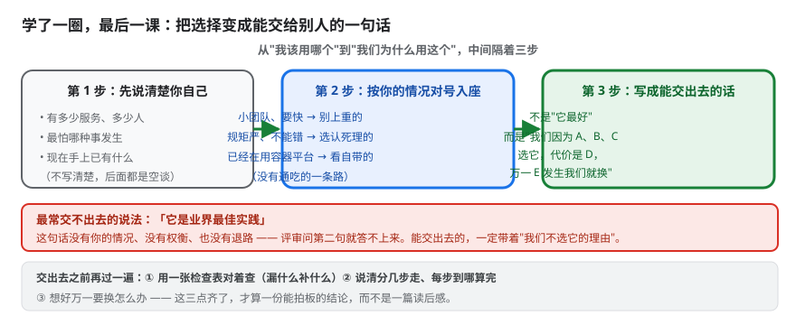
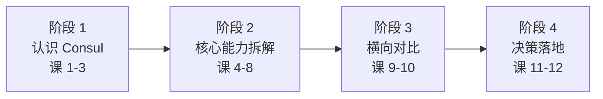

# 课 12：选型决策框架与场景结论

> 所属阶段：阶段 4「决策落地」 ｜ 学习目标：**决策参考** ｜ 预计 60–90 分钟
> **本课是全课程收束课**——学完能回答"我的场景该不该用 Consul、用它的哪部分、不用换什么"。

## 本课速览

四个阶段走完，把认知压缩成三样可带走的东西：

1. **决策框架**：四维打分卡 + 权重建议 + 一票否决项
2. **场景结论**：四类典型场景直接给答案
3. **决策清单与落地路线**：可勾选的判据 + 试点路线

**三条带走的结论**：
1. **"该不该用 Consul"是个错误问题**。正确问法是"用它的**哪部分**"——Consul 是能力集合，不是单一产品。
2. **一票否决项比打分更重要**：纯 K8s 单集群、需要配置中心全功能、有"仅用 OSI 认证开源"的硬政策——这三条命中任意一条，打分卡都不用填。
3. **决策的价值在于"不用换什么"**：明确划出边界，比论证"它很好"更有用。

---

## 第一幕：场景引入

小林把四个阶段的材料堆在桌上，厚厚一叠。评审会就在明天。

技术总监的要求很具体：

> "给我三页纸。第一页说清我们该不该用、用哪部分；第二页说清代价和风险；第三页说清接下来三个月怎么落地。"

小林翻着自己的笔记，突然意识到一件事——**他一直在论证"Consul 好不好"，但决策需要的是"我们该不该用、用哪部分、不用换什么"**。

这三句话里，最后半句最难，也最值钱：**知道不用什么，才知道要补什么。**

这一课，他把一叠笔记压缩成三页纸。

---

## 第二幕：认知冲突

小林最初想做一张"Consul 总分"表，打个总分，超过 60 分就用。

他先拿自己的公司试算，发现三个问题：

**问题一：Consul 不是一个东西，是一组东西。**

他的公司只需要"服务注册发现"，不需要 KV、不需要 Connect 网格、不需要多 DC。给"Consul"打一个总分，等于把用不到的能力也算进去了。

> 🎯 **关键转变**：问题不是"该不该用 Consul"，而是"该用 Consul 的**哪一部分**"。

**问题二：有些条件是"一票否决"，不该参与打分。**

他的公司在金融行业，合规部门有明确政策：**只能使用 OSI 认证的开源软件**。Consul 从 1.17.0 起是 BUSL，**OSI 不认证**。

这一条命中的话，后面所有维度都不用看了——**它不是"扣分项"，是"出局项"**。打分卡会把这种硬约束稀释成一格低分，这是危险的。

**问题三：不同团队，四个维度的权重完全不同。**

- 十人小团队，没有专职运维 → **运维能力**这一维权重极高
- 大厂平台团队，有专职 SRE → 运维权重下降，**功能覆盖**权重上升
- 金融/国企 → **许可证合规**可能直接是一票否决

> 💡 **一张固定权重的打分卡，对所有团队都是错的。**

---

## 第三幕：层层揭示



> **看图**：三步——先说清楚你自己（多少服务、最怕什么、手上有什么），再按情况对号入座（没有通吃的一条路），最后写成能交出去的话。注意中间那条：**"它是业界最佳实践"是最常交不出去的说法**——没有你的情况、没有权衡、也没有退路，评审问第二句就答不上来。

### 知识点 1：决策维度清单

#### 一句话定义

四个维度：**需求匹配 / 技术栈匹配 / 运维能力 / 许可证合规**。先过一票否决项，再按团队类型定权重打分。

#### 第一步：一票否决项（先查这个）

> ⚠️ **命中任意一条，直接出局或改变方案，不要继续打分。**

| # | 一票否决条件 | 后果 | 依据 |
|---|-------------|------|------|
| 1 | **纯 K8s 单集群内的服务发现** | 用 K8s Service，别上 Consul | 课 7 决策卡片；Service + CoreDNS 已内建，Consul 是纯增重 |
| 2 | **组织有"仅用 OSI 认证开源"的硬政策** | 不能用 Consul ≥1.17.0 | 课 11；BUSL 非 OSI 认证（可考虑停留在 1.16.4，但无安全补丁） |
| 3 | **核心诉求是配置中心全功能**（版本/灰度/审计） | 选 Nacos / Apollo，Consul KV 不够 | 课 6 实测；KV 无版本历史、无审计 |
| 4 | **需要亚秒级故障交接的选主** | 用 etcd 租约 / K8s Lease | 课 6 实测；Consul 锁受 LockDelay 约束约 15 秒 |

#### 第二步：四维打分卡

| 维度 | 问什么 | 参考输入 |
|------|--------|---------|
| **需求匹配** | 我要的能力它有没有？要自己造多少？ | 课 10 功能矩阵 |
| **技术栈匹配** | 我的语言/框架/部署环境合不合？ | 课 10 生态矩阵 |
| **运维能力** | 我养得起吗？五个问题有答案吗？ | 课 11 运维五问 |
| **许可证合规** | BUSL 对我生效吗？有合规政策吗？ | 课 11 六问自查 |

**打分方式**：每维 1–5 分。**先定权重，再打分**——顺序不能反。

#### 第三步：权重设计（按团队类型）

| 团队类型 | 需求匹配 | 技术栈 | 运维能力 | 许可证 | 说明 |
|---------|---------|--------|---------|--------|------|
| **小团队（<20 人，无专职运维）** | 30% | 20% | **35%** | 15% | 运维是最大风险，人少扛不住 quorum/证书/升级 |
| **中型（有专职 SRE）** | **35%** | 25% | 25% | 15% | 功能覆盖成为主要区分度 |
| **大厂平台团队** | **35%** | **30%** | 15% | 20% | 有能力自造，更看重长期可控与合规 |
| **金融 / 国企 / 政府采购** | 25% | 20% | 20% | **35%** | 合规权重最高，且可能是否决项 |
| **云厂商 / 卖托管服务** | 25% | 20% | 20% | **35%** | ⚠️ 若与 HCP 竞争，BUSL **直接生效**，需商业授权 |

> 💡 **用法**：这张表是**起点不是圣旨**。把你的实际情况套进去，调整权重——**调整的过程本身就是决策**。

---

### 知识点 2：典型场景结论

#### 场景 A：K8s 原生环境

> **【缺口 #6 前置：K8s 落地方式】**（核查于 2026-09）

在展开结论前，先说清 Consul 在 K8s 上**怎么落地**——否则"该不该用"无从谈起。

**官方落地方式：Helm chart 部署 `consul-k8s`**

```bash
# 添加官方 Helm 仓库
helm repo add hashicorp https://helm.releases.hashicorp.com
helm repo update

# 安装（生产环境务必配 values.yaml，勿用默认配置）
helm install consul hashicorp/consul --values values.yaml --create-namespace -n consul
```

> ⚠️ **不是手工起 agent**。K8s 上通过 Helm chart 部署 **consul-k8s 控制面**，由它管理 Consul 集群与 K8s 的集成。也可用 `consul-k8s` CLI 安装。

**CRD：把 Consul 配置建模成 K8s 资源**

`consul-k8s` 提供一组 CRD，让你用 `kubectl apply` 管理 Consul 配置（**自 Consul 1.9 起支持**）：

| CRD | 用途 |
|-----|------|
| `ServiceDefaults` | 为某服务的所有实例配置默认值（如协议） |
| `ProxyDefaults` | 全局代理配置（如 Envoy 指标暴露地址） |
| `ServiceResolver` | 匹配上游实例 / 服务子集 |
| `ServiceRouter` | 按 L7 路由规则分发流量 |
| `ServiceSplitter` | 按比例切分流量（**灰度发布的基础**） |
| `ServiceIntentions` | 服务间访问控制 |
| `IngressGateway` / `TerminatingGateway` | 南北向网关 |
| `Mesh` / `ExportedServices` / `PeeringAcceptor` / `PeeringDialer` / `SamenessGroup` / `Registration` | 网格与多集群相关 |

**服务接入的两种方式**：
1. **annotation 自动注入 sidecar**（`connectInject`，官方 chart 默认开启）
2. **用 CRD 显式注册外部服务**（如 VM 上的服务）

> 📌 **版本对应关系（核查于 2026-09）**：Helm chart 与 Consul 版本是配套的——如 chart 1.6.2 对应 Consul 2.0.3（2026-08-12）；chart 线应与你部署的 Consul 版本线匹配。**安装前请查官方兼容矩阵，不要照抄本课的示例版本号。**
>
> ⚠️ 另注：**Consul CE 忽略 K8s namespace**，所有服务按名字注册进同一个全局注册表。不同 namespace 里的同名服务会冲突。

##### 场景 A 的结论

> **纯 K8s 单集群 → 不用 Consul，用 K8s Service。**

**理由**：K8s 已内建 Service + CoreDNS，服务发现开箱可用。再上一套 Consul 是**重复建设**——多一套控制面要运维，多一层故障域。

**Consul 在 K8s 上的增量价值必须来自以下之一**：

```text
✅ 跨集群 / 跨 VM 的统一寻址     → 值得
✅ 需要服务网格（mTLS + 授权）    → 值得
✅ 多集群联邦 / peering          → 值得
❌ 只在单 K8s 集群内做服务发现    → 重复建设
```

> 💡 **判断口诀**：**"再上一套 Consul，你买到了什么 K8s 没有的？"** 答不上来就别上。

---

#### 场景 B：多语言 + 多 DC + 异构（VM + 容器混合）

> **结论：Consul 的高光区，四家里没有正面竞争者。**

**为什么是它**：
- **异构**：VM 与容器里跑同一个 agent，注册与健康检查语义完全一致（课 5/课 7）
- **多 DC**：原生联邦打通查询通道（课 7）——Nacos 需外挂方案，etcd/ZK 没有
- **多语言**：核心接口是 HTTP + JSON + DNS，任何语言都能用（课 10）
- **健康检查丰富**：五种类型，覆盖没有 HTTP 端口的后台任务（课 4）

**注意事项**：
- **数据不跨 DC 复制**（课 7 实测：dc2 读同 key 返回 404）——联邦是查询通道，不是数据副本
- 若开启 Connect，注意**默认 intention 是 allow**（课 7 实测）——必须配 ACL 默认拒绝 + default deny
- 运维复杂度最高：多 DC + 网格 + ACL 三件套叠加

---

#### 场景 C：Java / Spring Cloud 单技术栈

> **结论：Nacos 优先——除非你有异构或多 DC 需求。**

**为什么选 Nacos**（依据课 9/课 10）：

| 对比项 | Nacos | Consul |
|--------|-------|--------|
| 注册 + 配置 | ✅ 一体 | ⚠️ 注册强、配置弱 |
| 配置版本/灰度/回滚 | ✅ 原生 | ❌ 无（课 6 实测） |
| 命名空间隔离 | ✅ 原生 | ⚠️ 靠 key 前缀约定 |
| 控制台 | ✅ 一等公民（中文） | ⚠️ 有 UI，配置管理弱 |
| Spring Cloud 亲和 | ✅ **亲儿子**（Spring Cloud Alibaba） | ✅ 支持（Spring Cloud Consul） |
| 许可证 | ✅ Apache-2.0 | ⚠️ BUSL 1.1 |

**什么情况下改选 Consul**：
- 需要**多数据中心**
- 环境**异构**（有非 JVM 服务）
- 需要**服务网格**

> 💡 **一句话判断**：**纯 Java 栈 + 单机房 + 要配置中心 → Nacos。加任何一个"多"字（多语言/多DC/多环境），重新评估 Consul。**

---

#### 场景 D：小团队轻量起步

> **结论：可以用，但要"削着用"——只上最小可用集，把运维负担压到最低。**

**最小可用方案**：

```text
✅ 用：服务注册发现 + 健康检查 + DNS 接口
❌ 暂缓：Connect 网格（多一层 sidecar 排障）
❌ 暂缓：多 DC 联邦
⚠️ 谨慎：KV 当配置源 —— 必须配 Git 做源（课 6 建议，同时也是退出保险）
```

**给小团队的三条硬建议**：

1. **别用 dev 模式上生产**（内存存储，重启全丢）。最小生产拓扑：3 server + 每节点 client。
2. **先把课 11 的"运维五问"答出来再上**。答不出人，就意味着"某个人要额外学一套东西"。
3. **监控告警的指标必须做三步核验**（课 11 缺口 #4 铁律）——小团队最怕**告警静默失效**，那比没有告警更危险。

> 💡 **小团队真正的风险不是"Consul 难"，是"没人懂它却又必须依赖它"。** 如果团队只有两个人管三十个服务，先问一句：**K8s Service 或者云厂商的托管服务发现，是不是已经够了？**

---

### 知识点 3：决策清单与落地路线

#### 3.1 该用 / 不该用判据清单（可勾选版）

**✅ 该用的信号**（命中越多越该用）：

```text
□ 环境异构（VM + 容器混合，或非 JVM 语言占比高）
□ 有多个数据中心 / 需要跨机房查询
□ 需要丰富的健康检查（有非 HTTP 服务需要 TTL / 脚本检查）
□ 需要服务间 mTLS 与授权（服务网格）
□ 需要 DNS 接口做服务发现
□ 团队有人懂 Raft / 愿意投入运维
□ 无"仅用 OSI 认证开源"的合规约束
```

**❌ 不该用的信号**（命中任意一条就要停下来想）：

```text
□ 纯 K8s 单集群内的服务发现        → 用 K8s Service
□ 核心诉求是配置中心全功能          → 用 Nacos / Apollo
□ 有"仅用 OSI 认证开源"的硬政策     → BUSL 是硬障碍
□ 需要亚秒级故障交接的选主          → 用 etcd 租约 / K8s Lease
□ 需要跨机房同步数据（不只是查询）  → Consul 做不到，需另设计
□ 准备把 KV 当业务数据库用          → 它是配置与协调元数据
□ 团队无人懂 Raft 且无意愿投入      → 运维风险高于收益
```

#### 3.2 混合策略：什么时候"注册用 A、配置用 B"合理

**这是本课最实用的一条**：不必 All in 一个产品。

| 组合 | 何时合理 |
|------|---------|
| **注册发现用 Consul + 配置用 Apollo/Nacos** | 环境异构需要 Consul 的注册能力，但配置需要版本/灰度/审计——**这是很常见的务实选择** |
| **注册发现用 Nacos + 网格用 Consul** | 少见，通常只在已有 Nacos 又要上网格时出现；注意两套控制面的运维成本 |
| **K8s 内用 Service + 跨集群用 Consul** | 单集群内不引入 Consul，只在跨集群/跨 VM 场景引入——**增量价值清晰** |

> 💡 **判断原则**：**让每个产品做它最强的事，但每多一套系统就多一份运维成本。** 混合策略的收益必须大于"多养一套"的代价。
>
> 课 6 反复建议的"**Consul 做分发 + Git 做源**"其实就是一种轻量混合——用 Git 补上 KV 缺的版本与审计，代价极小。

#### 3.3 试点路线：从 POC 到全面落地

**第一阶段：POC（1–2 周）——验证"能用"**

```text
验收点（必须全部通过）：
□ 服务注册与发现跑通（含健康实例过滤，用 /v1/health/service 而非 catalog）
□ 健康检查按预期工作（故意停实例，看是否自动摘除）
□ 配置热更新生效（阻塞查询，验证客户端超时 > wait）
□  failover 演练：停一个 server，看集群是否仍可写
□  快照备份 → 恢复 → 验证（⚠️ 在测试环境，理解"全量覆盖"语义）
□  告警指标三步核验（确认不是累积计数）
```

**第二阶段：灰度接入（2–4 周）——验证"敢用"**

```text
□ 选 1–2 个非核心服务接入
□ 双跑期：新老寻址方式并行，对比结果一致性
□ 故意制造故障（网络抖动、agent 重启、leader 切换），观察行为
□ 验证监控告警真的会响（不是静默失效）
□ 记录本次踩的坑，补进团队的排障手册
```

**第三阶段：全面落地（按需）**

```text
□ 按服务重要性分批接入，核心服务最后接
□ 补齐运维文档：谁负责什么（课 11 运维五问的答案）
□ 确定升级节奏与负责人（含 Consul-Envoy 版本匹配）
□ 定期演练：恢复演练、故障演练
```

> ⚠️ **试点阶段最重要的一条**：**故意制造故障**。POC 只验证"正常时能用"是不够的——真正的信心来自"我知道它坏了是什么样子"。

---

## 第四幕：实操验证

本课是全课程收束，验证方式是**把前 11 课的结论压成三页纸**——你现在就可以做。

### 验证 1：填一张四维打分卡（拿你的真实情况）

```text
我的团队类型：______________（小团队 / 中型 / 大厂平台 / 金融国企 / 云厂商）

第一步 —— 一票否决检查（命中任意一条，停止打分）：
□ 纯 K8s 单集群服务发现
□ 有"仅用 OSI 认证开源"硬政策
□ 核心诉求是配置中心全功能
□ 需要亚秒级选主交接
→ 是否命中？__________

第二步 —— 权重（按团队类型从课内表格取，再自行微调）：
   需求匹配 ____%  技术栈 ____%  运维能力 ____%  许可证 ____%
   （合计必须为 100%）

第三步 —— 打分（每维 1–5）：
   需求匹配 ____   技术栈 ____   运维能力 ____   许可证 ____

第四步 —— 加权总分：
   ____×____ + ____×____ + ____×____ + ____×____ = ________

参考线：
   ≥4.0 分 → 值得上
   3.0–4.0 → 可以做 POC，边用边验证
   <3.0 分 → 先解决短板（通常是运维能力），或另选方案
```

> 💡 **填表时的诚实提醒**：**运维能力那一维最容易高估**。如果课 11 的"运维五问"你答不出具体负责人，这一维建议直接给 2 分以下。

### 验证 2：用决策清单给你的项目做体检

把知识点 3.1 的两张清单（该用 / 不该用）逐条勾选：

```text
该用信号命中：____ 条
不该用信号命中：____ 条

判读：
  不该用命中 ≥1 条     → 先解决它，别急着上
  该用命中 ≥4 条且不该用 0 条 → 场景匹配度高
  两边都很少命中       → 你的场景可能不需要注册中心（如纯 K8s 单集群）
```

### 验证 3：写出你自己的"三页纸"

这是本课的最终产出，**也是整门课的结课成果**：

```text
第 1 页｜结论：
  - 用 / 不用：__________
  - 若用，用哪部分：__________（注册发现？KV？网格？多DC？）
  - 不用换什么：__________（例：配置仍用 Apollo / 纯 K8s 内仍用 Service）

第 2 页｜代价与风险：
  - 许可证暴露面：__________（课 11 六问自查结论）
  - 运维五问的答案：__________（谁负责什么）
  - 退出成本评分：____ 分（课 11 耦合深度评分）

第 3 页｜落地路线：
  - POC 验收点：__________（从课内六个验收点中挑选）
  - 灰度范围：__________
  - 全面落地节奏：__________
```

> 🎯 **这三页纸就是这门课的交付物。** 填完它，你就敢在评审会上签字了——**这才是"决策参考"这个学习目标的落点**。

### 验证 4：回指检查——每条结论能否溯源

把三页纸里的每个结论，检查是否能回指到具体课时：

| 你的结论 | 应能回指 |
|---------|---------|
| 关于注册发现/健康检查 | 课 4 |
| 关于一致性/读模式 | 课 5 |
| 关于 KV/配置 | 课 6 |
| 关于多 DC/网格 | 课 7 |
| 关于权限 | 课 8 |
| 关于竞品对比 | 课 9 / 课 10 |
| 关于许可证/运维/退出 | 课 11 |

> ⚠️ **如果某条结论回指不到具体课时，说明它是"感觉"而非"依据"**——评审会上被追问一句就会露馅。

---

## 第五幕：体系收束

### 全课程回顾



| 阶段 | 解决的问题 | 关键产出 |
|------|-----------|---------|
| 1 | Consul 是什么、能干什么 | 服务发现本质；能力全景；架构角色 |
| 2 | 每项能力的机制与可靠性 | 健康检查语义；Raft/Gossip；三读模式；KV 边界；多DC；ACL |
| 3 | 与竞品比怎么样 | 四位对手底牌；四维矩阵；**决策卡片 A–G** |
| 4 | 该不该用、代价多少 | 三本账；**决策框架 + 场景结论 + 三页纸** |

### 全课程三条元结论

1. **Consul 的主场是"异构环境的服务注册发现 + 健康检查"**。把 KV 当配置源可以，但别指望它承担配置中心的管理职责。
2. **它的价值随"环境复杂度"上升**：单 K8s 集群 ≈ 0，异构 + 多 DC → 显著。
3. **决策的价值在于划边界**：知道"不用 Consul 的什么"，比论证"它很好"更值钱。

### 学完之后你带得走的东西

```text
□ 一张四维决策框架（含权重表与一票否决项）
□ 七张场景决策卡片（课 10 A–G）+ 四类场景结论（本课 A–D）
□ 三本账的自查工具（许可证六问 / 运维五问 / 耦合深度评分）
□ 一份 POC 验收点清单
□ 三页纸决策材料（本课最终产出）
□ 排障速查手册与场景解法库（09 / 10-场景解法库）
```

### 术语表（按命名三态标注）

| 术语 | 说明 |
|------|------|
| **CRD**（Custom Resource Definition） | **公认译名**：自定义资源定义。K8s 中扩展 API 资源的机制 |
| **Helm chart** | **公认译名**：Helm 图表（**"chart" 常保留英文**）。K8s 的包管理格式 |
| **sidecar** | **公认译名**：边车（模式）。本课指服务网格中伴随主进程的代理进程 |
| **annotation** | **社区常用译法「注解」，官方未定中文名**；K8s 中给资源附加元数据的机制 |
| **L7 路由** | **公认译名**：七层路由（OSI 第七层，即应用层） |
| **POC**（Proof of Concept） | **公认译名**：概念验证 |
| **灰度发布** | **公认译名**。本课指按比例逐步切分流量的发布方式；Consul 中对应 `ServiceSplitter` |
| **peering** | **社区常用译法「对等连接」，官方未定中文名**；Consul 多集群互联机制 |
| **catalog** | **社区常用译法「目录」，官方未定中文名**；Consul 中指服务注册表 |
| **failover** | **公认译名**：故障转移 |
| **RTO**（Recovery Time Objective） | **公认译名**：恢复时间目标 |

> 📌 **命名纪律**：遵循"命名三态 + 标注纪律"——公认译名直接用；社区译名括注来源；无在用译名保留英文并给白话解释。标注只在术语表给一次，正文不重复。

---

## 课尾三段式

### 本课速览

- **决策框架**：先过**一票否决项**（4 条），再按团队类型定**权重**（5 种），最后四维打分
- **场景结论**：纯 K8s → 不用；异构多语言多 DC → **Consul 高光区**；Java 单栈 → **Nacos 优先**；小团队 → 削着用，压运维负担
- **混合策略**：注册用 Consul + 配置用 Apollo/Nacos 是务实选择；收益必须大于"多养一套"
- **落地路线**：POC（6 个验收点，含**故意制造故障**）→ 灰度 → 全面
- **最终产出**：三页纸决策材料

### 课程导航

- **上一课**：[lesson-11 许可证成本与风险](./lesson-11-许可证成本与风险.md)
- **全课程**：[课程目录](../../../02-课程目录.md)｜[学习路径总览](../../../01-学习路径总览.md)
- **配套材料**：[08-实战经验](../../../08-实战经验.md)｜[09-排障速查手册](../../../09-排障速查手册.md)｜[场景解法库](../../../场景解法库/INDEX.md)
- **实战项目**：[服务注册发现与配置中心](../../../projects/服务注册发现与配置中心/README.md)

### 小测

**1.（多选）以下哪些属于"一票否决项"？（多选）**
- A. 纯 K8s 单集群内的服务发现
- B. 组织有"仅用 OSI 认证开源"的硬政策
- C. 团队规模小于 20 人
- D. 需要亚秒级故障交接的选主

<details><summary>答案</summary>

**A、B、D**。三条均属一票否决：A 用 K8s Service 即可（Consul 是重复建设）；B 因为 Consul ≥1.17.0 是 BUSL、OSI 不认证；D 因为 Consul 锁受 LockDelay 约束约 15 秒（课 6 实测），需 etcd 租约或 K8s Lease。**C 不是否决项**——小团队可以用，但要"削着用"（场景 D），团队规模影响的是**权重**而非"能不能用"。

</details>

**2.（单选）某公司：Go + Python + Java 混合技术栈，两个机房，部分服务在 VM 上、部分在 K8s 里。按本课场景结论应选？**
- A. 不用任何注册中心
- B. Consul
- C. Nacos
- D. etcd

<details><summary>答案</summary>

**B. Consul**。命中**场景 B**（多语言 + 多 DC + 异构），这是 Consul 的高光区：异构环境跑同一 agent、原生多 DC 联邦、HTTP+DNS 接口多语言友好、健康检查丰富。Nacos 在异构与多 DC 上弱于 Consul（场景 C 明确"加任何一个'多'字就重新评估 Consul"）；etcd 要自造健康检查与 DNS 那层。

</details>

**3.（单选）关于混合策略，下列说法正确的是？**
- A. 必须 All in 一个产品，混合会带来灾难
- B. 注册发现用 Consul + 配置用 Apollo/Nacos 是常见且务实的选择
- C. Consul 的 KV 完全可以替代专业配置中心
- D. 混合策略永远比单一产品成本低

<details><summary>答案</summary>

**B**。课内明确这是常见务实选择——尤其当环境异构需要 Consul 的注册能力、但配置需要版本/灰度/审计时（Consul KV 无这些，课 6 实测）。C 错（KV 无版本历史与审计）；D 错（每多一套系统就多一份运维成本，收益必须大于代价）；A 过于绝对。

</details>

**4.（单选）POC 阶段最重要、也最容易被跳过的一步是？**
- A. 安装并启动集群
- B. 故意制造故障，观察它坏了是什么样子
- C. 配置好所有参数
- D. 迁移全部服务

<details><summary>答案</summary>

**B**。课内明确："POC 只验证'正常时能用'是不够的——真正的信心来自**我知道它坏了是什么样子**。" 故障演练（停 server、网络抖动、agent 重启、leader 切换）与**快照恢复演练**、**告警指标三步核验**一起，才是 POC 真正的价值所在。

</details>

### 结课提示词

> 全课程已完成。若需继续深入，可使用：
>
> "我已学完 Consul 四阶段课程，请帮我：① 复审我填写的三页纸决策材料，指出结论与依据不匹配的地方；② 针对我的具体场景（[描述场景]）给出更细的落地建议；③ 指导我完成[实战项目](../../../projects/服务注册发现与配置中心/README.md)的扩展升级（目标：满足跨 ≥3 阶段门槛）。"

---

## 评审结论（对学员可见）

### A 视角：技术事实核查

**核查方法**：K8s 落地相关内容按要求联网核实（骨架明确警告"不得凭记忆写版本号"）；其余结论回指课 1–11 的实测或一手核查。

| 核查项 | 核查方式 | 结果 |
|--------|---------|------|
| K8s 官方落地方式为 Helm chart 部署 consul-k8s | 查 Artifact Hub 官方 chart 页 | ✅ 确认（"recommended installation method is the official Consul Helm chart"） |
| CRD 清单（ServiceDefaults/ProxyDefaults/ServiceResolver/ServiceSplitter/ServiceIntentions 等） | 查官方文档 CRD 页（v1.21.x） | ✅ 确认，共 14 类 |
| CRD 自 Consul 1.9 起支持 | 查官方教程 | ✅ 确认 |
| `connectInject` 为官方 chart 默认开启 | 查官方文档 | ✅ 确认 |
| Consul CE **忽略 K8s namespace** | 查官方文档（v1.21.x CRD 页） | ✅ 确认（所有服务按名字注册进全局注册表） |
| Helm chart 与 Consul 版本配套（如 1.6.2 ↔ 2.0.3） | 查 Artifact Hub 版本列表 | ✅ 确认；**已明确提示读者查官方兼容矩阵，不照抄本课示例版本** |
| 一票否决项："亚秒级选主" | 回指课 6 实测（LockDelay 约 15 秒） | ✅ 一致 |
| 一票否决项："配置中心全功能" | 回指课 6 实测（KV 无版本/审计） | ✅ 一致 |
| BUSL 非 OSI 认证 | 回指课 11 | ✅ 一致 |
| 纯 K8s 单集群不用 Consul | 回指课 7 决策卡片 | ✅ 一致 |

**A 视角的关键处置**：

1. **K8s 版本号按要求做了联网核实**。骨架明确警告"不得凭记忆写版本号"，实际核实后确认：Helm chart 与 Consul 版本是**配套关系**（如 1.6.2 ↔ Consul 2.0.3）。已写入版本对应关系示例，**同时明确提示"安装前请查官方兼容矩阵，不要照抄本课的示例版本号"**——既满足"不凭记忆"的要求，又避免读者把示例当权威。
2. **补充了课内未覆盖的实用细节**：Consul CE 忽略 K8s namespace（不同 namespace 同名服务会冲突）——这是官方明确行为，落地时容易踩坑，已标注。

### B 视角：零基础教学体验

| 检查项 | 结果 |
|--------|------|
| 五幕结构 + 六要素齐备 | ✅ 每知识点含一句话定义 / 直觉建立 / 常见误区 |
| 课尾三段式（速览 / 导航 / 小测 + 结课提示词） | ✅ 小测 4 题（含 1 道多选），附答案解析 |
| 未讲过的术语首次出现是否有解释 | ✅ CRD、Helm chart、annotation、L7 等均有白话解释 |
| 术语表按命名三态标注 | ✅ 11 个术语，区分公认译名 / 社区译名 / 无译名 |
| 是否有"照抄跑不通"的风险 | ✅ Helm 命令为标准用法；已提示生产需配 values.yaml |
| 是否达成课程总目标 | ✅ 第四幕验证 3 直接产出"三页纸"，对应"决策参考"目标 |

**B 视角的设计说明**：本课作为收束课，最大的风险是**变成前 11 课的摘要**。处理方式是让它产出**新东西**：决策框架（含权重表与一票否决项）、四类场景结论、三页纸模板——这些在前面都没有，是把散落结论**压缩成可执行决策**的产物。第二幕也刻意拆解了"给 Consul 打总分"这个常见但错误的做法。

### 仍存在的已知边界

- **K8s 落地的深度未覆盖**：本课只讲"怎么落地 + 增量价值判断"，不含生产级 values.yaml 配置、多集群联邦实操、sidecar 调优等。这些属运维实践范畴，**需要真实 K8s 环境才能验证**，本机不具备条件。
- **Helm chart / consul-k8s 版本以核查于 2026-09 为准**，读者应用时请查官方兼容矩阵。
- **权重表是起点不是圣旨**：课内已明确提示按实际情况调整，"调整的过程本身就是决策"。
- **三类待办已全部完成**（原与应用实战篇判定相关，2026-09-17 收口）：三份实战篇正文已落盘并实测（[A 读模式](../../../practices/实战A-读模式实测/README.md) / [B Connect](../../../practices/实战B-Connect最小闭环/README.md) / [C ACL 权限模型](../../../practices/实战C-ACL生产权限模型/README.md)，索引见 [应用实战/INDEX.md](../../../应用实战/INDEX.md)）；08-实战经验已重做（故障模式 10 条）；09-排障速查手册已扩容至 15 条；综合实战项目已升级至**跨 4 阶段**（新增 `stage34_ext.py` 可插拔后端抽象与上线前自检，演示六步→十步全通）。台账记录见[内容缺口台账](../../../00-学习档案.md) #11/#12。
