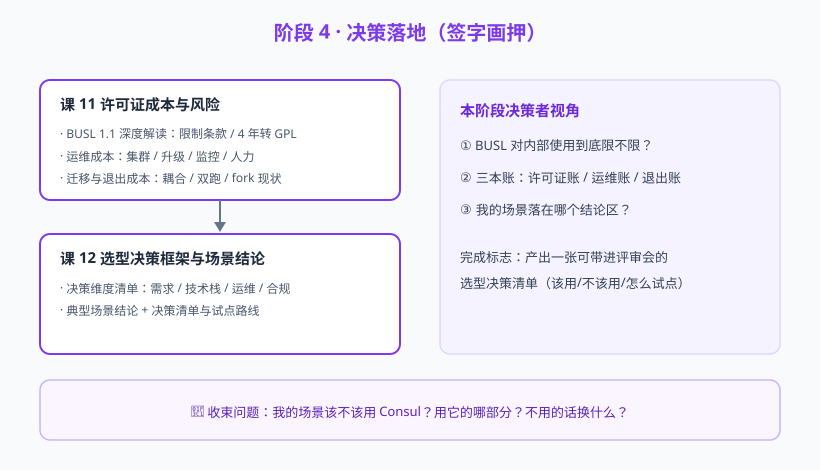

# 阶段 4：决策落地（签字画押）

> 故事章节定位：最后一章。小林把技术对比换成三本账——许可证账、运维账、退出账，然后写出决策清单，在选型评审会上签字。

## 阶段目标

1. 深度理解 BUSL 1.1 对内部使用的真实影响（哪些场景受限、哪些不受限）
2. 能估算 Consul 的运维成本（服务器、升级、监控、人力技能）
3. 理解迁移与退出成本（接口耦合度、双跑方案、社区 fork 现状）
4. 产出个人场景的选型决策清单与落地路线

## 学习重点

- BUSL 1.1 条款拆解：4 年自动转 GPL、竞争性限制、API/SDK 仍 MPL 2.0
- 运维成本：3/5 节点 server 集群、版本线维护、监控告警、团队技能
- 退出成本：注册/API 接口耦合、抽象层设计、双跑迁移
- 决策维度：需求匹配、技术栈匹配、运维能力、许可证合规
- 典型场景结论：k8s 原生、多语言多 DC、Spring Cloud、小团队轻量方案
- 决策清单：该用/不该用判据 + 试点路线

## 必须掌握的知识点

| 课 | 知识点 |
|----|--------|
| 课 10 | BUSL 许可证深度解读；运维成本评估；迁移与退出成本 |
| 课 11 | 决策维度清单；典型场景结论；决策清单与落地路线 |

## 阶段路径图

## 阶段收束

学完本阶段，回答故事开头的四个问题：Consul 是什么（阶段 1）、成色如何（阶段 2）、比竞品如何（阶段 3）、我该不该用（阶段 4）。决策清单将汇总进 final-课程手册.md。
