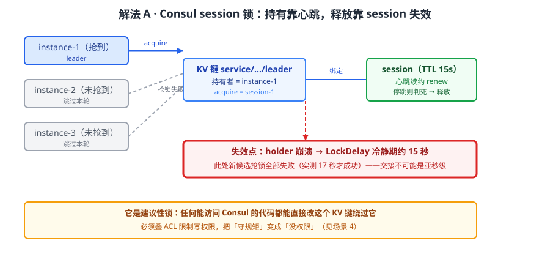
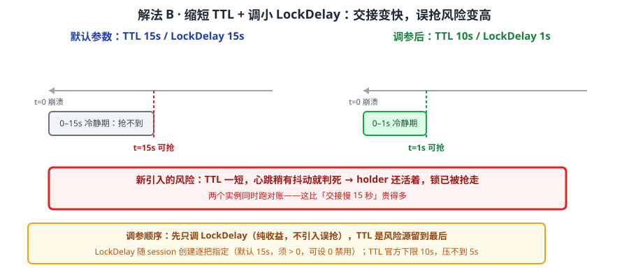
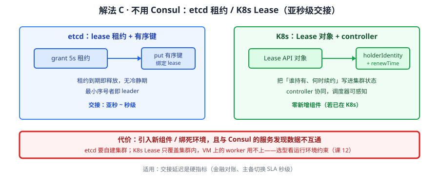
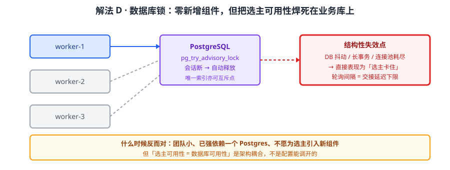

# 场景 1：多实例部署，要选主 / 防重跑（经典设计题）

**场景描述**：订单对账的定时任务部署了 3 个实例（为了高可用），但每天凌晨 3 点三个实例同时跑一遍，重复出账。团队要求"任一时刻只有一个实例在跑，它挂了要有人接上"，并且交接要快——运维说"能接受 1 分钟，不能接受 10 分钟"。

**🔒 先自己想 30 秒**：用数据库加一行锁？用 Redis 的 `SETNX`？还是用 Consul？如果选 Consul，holder 崩溃后锁是"立刻释放"还是"等一会儿"？那个"等一会儿"是多少？

<details><summary>💡 提示（分层 / 分维度想）</summary>

把问题拆成三问，分别想：
1. **锁怎么表达**——用什么数据结构标记"谁持有"？持有者崩溃时，这个标记靠什么机制自动消失（而不是靠它自己来删）？
2. **交接延迟由什么决定**——是"检测到崩溃"慢，还是"检测到了但不让别人抢"慢？两者是不是同一个参数？
3. **它是强制锁还是建议锁**——如果有一段代码不遵守规则直接改那个标记，你的锁还成立吗？

提示：Consul 的答案是 session（带生命期的占用凭证）+ KV acquire，而"挂了之后多久能抢"这个数字，课程里实测过——回忆一下课 6 的 LockDelay。

</details>

<details><summary>📖 展开解法</summary>

### 解法一览（效果按"交接延迟 / 互斥强度"对比）

| 解法 | 效果（交接延迟 / 互斥强度） | 代价 | 适用边界 |
|------|--------------------------|------|---------|
| A · Consul session 锁（KV acquire） | 约 15 秒（LockDelay 约束）/ 建议性 | 交接非亚秒级；只能约束守规矩的参与者 | 分钟级交接可接受；同栈已用 Consul |
| B · 缩短 TTL + 调小 LockDelay | 可压到 2–5 秒 / 建议性 | TTL 越短心跳压力越大，误判摘除风险升高 | 可接受秒级交接与更高抖动风险 |
| C · 不用 Consul：etcd 租约 / K8s Lease | 亚秒级 / 建议性（K8s Lease 与调度器协同更强） | 引入新组件（或绑定 K8s）；多一套运维 | 亚秒级交接是硬要求 |
| D · 数据库唯一键 /  advisory 表锁 | 取决于事务与轮询间隔，通常秒级 / 依赖事务隔离 | 锁与业务库耦合，DB 抖动即选主抖动 | 已有强一致 DB 且不愿引入新组件 |

> 解法 D 是**非本栈替代路线**，一并列出便于横向比较；本场景的"课程内解法"是 A、B 两条。

### 各解法详解

#### 解法 A：Consul session 锁（KV acquire）——同栈最低成本



读图：三个实例同时抢同一把锁，只有 instance-1 抢到（实线持有）；它对 KV 键的持有被绑在一个 session 上，而 session 绑着 TTL 健康检查。红框标的是**交接延迟的来源**——holder 崩溃后不是立刻可抢，中间隔着 LockDelay 那段冷静期，实测约 15 秒内新候选全部失败。

用 session 绑定一个 TTL 健康检查（或已有服务健康检查），持有者用 `acquire` 抢键：

```python
import consul, time, os

c = consul.Consul(host="127.0.0.1", port=8500)
MY_ID = f"order-worker-{os.getpid()}"

# 1. 建 session：绑定健康检查，TTL 15s；behavior=release 表示失效时释放（而非删除）键值
session_id = c.session.create(
    name=MY_ID,
    ttl="15s",          # 心跳间隔须小于 TTL；课程建议 TTL 的 1/2 ~ 2/3
    behavior="release",  # session 失效 → 锁自动释放，无需人工介入
)

# 2. 抢锁：acquire 带 session，成功返回 True
locked = c.kv.put("service/order-reconcile/leader", MY_ID, acquire=session_id)
if not locked:
    print("未抢到锁，本轮跳过")
    raise SystemExit(0)

try:
    while True:
        c.session.renew(session_id)   # 续约心跳，别等 TTL 自然过期
        do_reconcile()                 # 只有 leader 会执行
        time.sleep(5)
finally:
    c.session.destroy(session_id)      # 正常退出主动释放
```

> 为什么这么写：`behavior="release"` 与 `delete` 的差别在**失效后键值还在不在**——`release` 只解除占用、键值保留（下次直接抢），`delete` 会删掉整个键。选主场景用 `release`，因为它省掉"键不存在"的分支判断。
> **它的要害（实测）**：holder 崩溃后受 **LockDelay** 约束，本机实测约 **15 秒内新候选抢锁全部失败**（17 秒才成功）。这是设计上的防抖——避免网络抖动导致双主，代价就是**交接不可能是亚秒级**。

#### 解法 B：缩短 TTL + 调小 LockDelay——把 15 秒压到秒级



读图：左侧是默认参数（TTL 15s / LockDelay 15s）下的时间线，崩溃到可抢约 15 秒；右侧把 TTL 压到官方下限 10s、LockDelay 调到 1s，可抢点大幅提前。红框标的是**新引入的风险**——TTL 越短，心跳只要有一次网络抖动没续上，session 就被判死，锁在 holder 还活着时就被抢走（双主）。

两个参数都在**创建 session 时逐把指定**：

```python
# LockDelay 是 session 级参数，随这把锁单独指定；TTL 官方下限 10s（10s–86400s），压不到 5s
session_id = c.session.create(
    name=MY_ID,
    ttl="10s",        # 官方下限，想更快已无空间（低于 10s 会被拒绝）
    lock_delay=1,     # 秒；默认 15，设 0 可完全禁用（慎用）
    behavior="release",
)
```

> ⚠️ **别把 LockDelay 当成 agent 级全局开关**：它随 `session/create` 请求体传入（`LockDelay` 字段，默认 `15s`、必须 > 0，设 `0` 可禁用），只影响这把 session 持有的锁。"改一次影响整台 agent 上所有锁"是错的——这反而是好事：**不同锁可以用不同冷静期**，交接要快的锁单独给短 LockDelay，比全局下调安全。
> **这一跳的代价比收益更需要盯**：TTL 越短，**误判摘除**概率越高——holder 只是 GC 停顿或网络抖动，session 已过期，别人抢到锁，两个实例同时跑对账。**这正是故障模式 3「锁明明释放了，新候选却抢不到」的反面**：参数往两头调，一头是交接慢，一头是误抢。
> 调参前先问：业务真能接受双跑吗？对账类任务双跑通常比延迟 15 秒更贵。想两头都要，正解是业务侧加 **fencing token**（课 6 已给做法：每次获取锁带递增序号，执行前校验自己仍是最新持有者），而不是继续拧参数。

#### 解法 C：不用 Consul——etcd 租约 / K8s Lease（替代路线，见下）



读图：etcd 用 lease（租约）+ 有序键实现选主，租约到期即释放、无 LockDelay 式冷静期；K8s Lease 更进一步，把"持有者身份 + 续约时间"写进 API 对象，由 controller 协同。红框标的是**代价**：这两条路都要求你引入新组件（etcd 集群）或绑定运行环境（K8s），且它们与 Consul 的服务发现数据不互通。

```bash
# etcd：租约 + 有序键（示意，etcdctl v3 口径）
etcdctl lease grant 5          # 5 秒租约
etcdctl put /election/order worker-1 --lease=<lease-id>
```
```yaml
# K8s Lease：由 leader-elector 库维护，应用侧只需声明
apiVersion: coordination.k8s.io/v1
kind: Lease
metadata:
  name: order-reconcile
  namespace: default
spec:
  holderIdentity: "worker-1"
  leaseDurationSeconds: 5      # 亚秒~秒级交接靠它
  renewTime: "2026-09-18T03:00:05Z"
```

> 适用：交接延迟是**硬指标**（如金融对账、主备切换 SLA 秒级）。如果你的服务本来就跑在 K8s 上，Lease 是零新增组件的最优解——这正是**场景 8 会展开的选型权衡**：能力不是选最强的，是选跟你运行环境的约束最合的。

#### 解法 D：数据库唯一键 / advisory 表锁（非本栈替代路线）



读图：用一个唯一索引（或 `pg_advisory_lock`）当互斥点，靠事务提交/回滚释放。红框标的是它的**结构性代价**——锁的可用性完全绑定业务库：DB 抖动、长事务、连接池耗尽都会直接表现为"选主卡住"，而且轮询间隔决定了交接下限。

```sql
-- PostgreSQL advisory lock：会话断开即自动释放，无需清理
SELECT pg_try_advisory_lock(hashtext('order-reconcile'));  -- 返回 true 即抢到
```

> 什么时候它反而对：团队小、已经强依赖一个 Postgres、不愿为选主引入任何新组件。**但它把"选主可用性"和"数据库可用性"焊死了**——这是架构上的耦合，不是配置能调开的。

### 替代路线（≥1 条，非本课程技术栈）

| 替代方案 | 思路 | 与本课程解法的差异 |
|---------|------|------------------|
| etcd lease + 有序键 | 租约到期即释放，无冷静期 | 交接亚秒级；但引入独立 etcd 集群，与 Consul 服务发现数据不互通 |
| K8s Lease（coordination.k8s.io） | 把持有者身份写进 API 对象，controller 协同 | 零新增组件（若已在 K8s）；但绑死 K8s，VM 上的 worker 用不了 |
| PostgreSQL advisory lock | 会话级锁，断连自动释放 | 无新组件；但选主可用性 = 数据库可用性，轮询间隔决定交接下限 |
| 消息队列单一消费者 | 靠 MQ 分区/队列语义保证单消费 | 从"选主"变成"分工"，语义更简单；但要接受 MQ 的投递语义与运维 |

### 推荐路径（递进，不是一次全上）

1. **先上解法 A**（session 锁）——零新增组件，若业务能接受分钟级交接，到此为止，别调参
2. **交接仍不够快** → 上解法 B，但**只调 LockDelay，先别压 TTL**：冷静期是纯收益（它不引入误抢），TTL 才是风险源
3. **秒级以下是硬指标** → 别在 Consul 上硬拧，转解法 C（K8s 环境用 Lease，非 K8s 用 etcd），接受新组件
4. **任何一步都要补 ACL**：这几条都是建议性锁，用 ACL 限制谁能写那个 KV 前缀，把"守规矩"变成"没权限"（见场景 4）

### 知识点挂钩

- 解法 A / B → 阶段 2 课 6《KV 存储与配置管理》（session 与分布式锁、LockDelay 15 秒实测）
- 解法 A 的 TTL 与续约 → 阶段 2 课 4《服务发现与健康检查机制》（TTL 检查与心跳）
- 解法 C 的 K8s Lease → 阶段 4 课 12《选型决策框架与场景结论》（环境约束决定能力取舍）
- 解法 D → 与课 6「分布式锁」对照（差异见上表）

### 什么情况下此方案不适用

- **亚秒级交接是硬要求** → Consul 锁做不到，直接转解法 C（这是机制限制，不是调参能解决的）
- **需要强制互斥**（不允许任何代码绕过）→ 这四条都是建议性锁，必须叠 ACL 或直接换更强原语
- **跨机房选主** → session 与 KV 都不跨 DC（见场景 6），跨机房要另设计

### 做错会踩的坑

- 解法 A 忘了续约心跳 → session 在 holder 存活时过期，别人抢锁 → **双主双跑**
- 解法 B 把 TTL 压太短 → GC 停顿/网络抖动被误判为崩溃 → 关联 [08-实战经验.md](../08-实战经验.md) 故障模式 3「锁明明释放了，新候选却抢不到」（同参数区的另一头）
- 解法 D 长事务持锁 → 连接池耗尽，表现为"选主卡住" → 关联 [08-实战经验.md](../08-实战经验.md) 故障模式 6「leader 频繁切换（选举震荡）」

</details>
