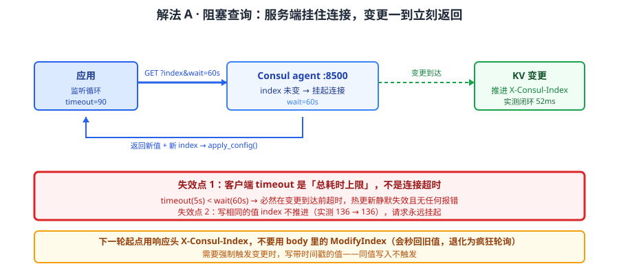
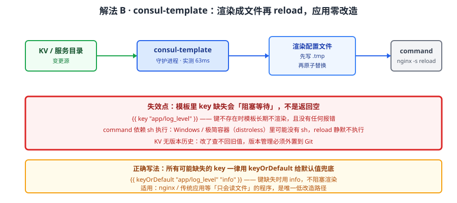
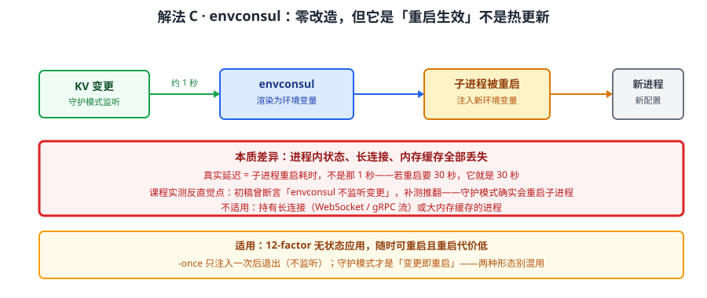
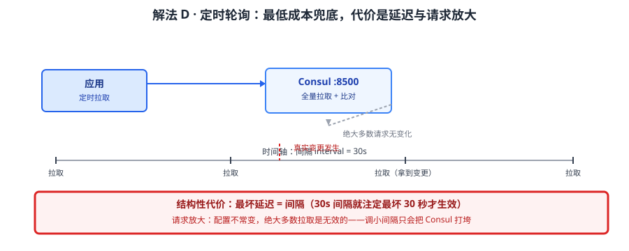

# 场景 2：配置热更新要秒级生效（经典设计题）

**场景描述**：配置散在 30 个服务的配置文件里，改一次要重启一批服务（约 20 分钟）。团队要"改完 5 秒内全量生效、不重启"。第一版方案上线后，运维反馈"改了配置从来没生效过，只能重启"——同样的代码，在测试环境却一切正常。

**🔒 先自己想 30 秒**："阻塞查询"听上去是"服务端有变更才返回"，那为什么它会永不生效？如果变更确实到达了，客户端这边最可能卡在哪一步？提示：想想 HTTP 客户端那个 `timeout` 参数的真实含义。

<details><summary>💡 提示（分层 / 分维度想）</summary>

把一次"配置变更到达应用"拆成四段，逐段问"这段会不会吞掉变更"：
1. **变更有没有发生**——写同值会不会推进版本号？
2. **服务端有没有挂住请求**——带了 `index` 和 `wait` 吗？`wait` 和客户端超时谁大？
3. **客户端收到后有没有处理**——用哪个 index 作为下一轮的起点？
4. **应用有没有应用**——渲染配置文件后触发 reload 了吗？

提示：课程里实测过两个非常具体的翻车点——一个是"写同值 index 不推进（136 → 136）"，一个是"客户端 timeout 是总耗时上限而非连接超时"。这两条都能让整条链路静默失效。

</details>

<details><summary>📖 展开解法</summary>

### 解法一览（效果按"生效延迟 / 改造成本"对比）

| 解法 | 效果（生效延迟 / 改造成本） | 代价 | 适用边界 |
|------|--------------------------|------|---------|
| A · 阻塞查询（长轮询） | 亚秒 ~ 秒级（实测 52ms）/ 中：应用要自己写监听循环 | 客户端超时必须 > wait；写同值不触发 | 应用可改造，配置是 KV 形态 |
| B · consul-template 渲染 + reload | 秒级（实测 63ms 渲染）/ 低：应用零改造 | 需额外进程；command 依赖 sh | 配置是文件形态（nginx / 传统应用） |
| C · envconsul 环境变量注入 | 变更 ~1 秒重启子进程 / 低：应用零改造 | **子进程会被重启**，不是热更新 | 12-factor 应用，可接受重启子进程 |
| D · 应用内定时轮询 | 取决于轮询间隔（通常 30–60s）/ 最低 | 延迟高 + 无效请求多 | 兜底降级，或变更不频繁 |

> 解法 C 是**课程实测反直觉点**——它常被误认为"不监听变更"，实测守护模式下 KV 变更后约 1 秒重启子进程换新环境变量，因此它是"重启式生效"而非热更新，与 A/B 不同类。

### 各解法详解

#### 解法 A：阻塞查询（长轮询）——应用内监听，延迟最低



读图：应用带着上次看到的 index 发请求，服务端在无变更时**挂住连接**直到 `wait` 超时或变更到达，变更一到立刻返回新值。红框标的是**最经典的失效点**——客户端的 `timeout` 若是总耗时上限（requests/urllib 都是），只要它小于 `wait`，请求必然在变更到达前就超时，表现为"热更新永远不生效"，且**不报错**。

```python
import requests

def watch_config(key, last_index=None, wait="60s"):
    """阻塞查询：index 未变则服务端挂起，变更到达立刻返回。"""
    params = {"recurse": "true", "wait": wait}
    if last_index:
        params["index"] = last_index
    # 关键：timeout 必须 > wait，否则等待必然在变更到达前被打断
    r = requests.get(
        f"http://127.0.0.1:8500/v1/kv/{key}",
        params=params,
        timeout=90,   # 90 > 60(wait)，留足余量
    )
    # 用响应头的 X-Consul-Index 作为下一轮起点，不要用 body 里的 ModifyIndex
    return r.headers.get("X-Consul-Index"), r.json()

index, data = None, None
while True:
    index, data = watch_config("app/", index)
    apply_config(data)   # 实测闭环 52ms
```

> 为什么这么写：`timeout` 必须大于 `wait`——**`requests` / `urllib` 的 timeout 是整个请求的总耗时上限，不是连接超时**，沿用默认 5 秒必然超时（这是本场景第一版上线的直接原因）。
> **两个必踩的坑（均实测）**：① 下一轮要用响应头 `X-Consul-Index`，**用 body 里的 `ModifyIndex` 会秒回旧值**，退化为疯狂轮询；② **写相同的值 index 不推进**（实测 136 → 136），阻塞查询永远挂起——需要强制触发时写带时间戳的值。

#### 解法 B：consul-template 渲染 + reload——应用零改造



读图：consul-template 进程守住 KV，变更时按模板渲染出配置文件、写临时文件再原子替换，然后执行 `command` 触发 reload。红框标的是它的**边界**——`command` 依赖 `sh`，Windows 或极简容器里可能没有；且模板里 key 缺失时会**阻塞等待**（`keyOrDefault` 可兜底），如果没配兜底，模板会一直不渲染。

```hcl
# consul-template 配置（ec-config.hcl）
template {
  source      = "/etc/ct/nginx.conf.tmpl"
  destination = "/etc/nginx/nginx.conf"
  command     = "nginx -s reload"      # 依赖 sh 执行
}
```
```liquid
{{/* 模板：key 缺失会阻塞；用 keyOrDefault 兜底 */}}
upstream backend {
{{ range service "web" }}
  server {{ .Address }}:{{ .Port }};
{{ end }}
}
log_level {{ keyOrDefault "app/log_level" "info" }};
```

> 为什么这么写：应用完全不需要知道 Consul 存在，配置以文件形态落地——对 nginx、传统 Java 应用这类"只会读文件"的程序是唯一低改造路径。本机实测渲染链路 **63ms**。
> **它特有的坑**：`key` 在键不存在时会**阻塞等待**该键出现（不是返回空），模板长期不渲染且无报错；用 `keyOrDefault` 给默认值可绕开。另外 KV **无版本历史**（改了查不回旧值），版本管理必须外置到 Git。

#### 解法 C：envconsul 环境变量注入——零改造，但是"重启式"生效



读图：envconsul 把 KV 渲染成环境变量再启动子进程，守护模式下检测到变更会**重启子进程**并注入新环境变量。红框标的是它与 A/B 的本质差异——**这不是热更新，是重启**：进程内状态、长连接、内存缓存全部丢失，约 1 秒完成。

```hcl
# envconsul 配置（ec-config.hcl）
envconsul -config=./ec-config.hcl -once python app.py   # -once：单次注入
envconsul -config=./ec-config.hcl python app.py         # 守护：变更即重启子进程
```

> **实测反直觉点**：课程初稿曾断言"envconsul 不监听变更"，补测推翻——**守护模式 KV 变更后约 1 秒重启子进程换新环境变量**。所以它适合 12-factor 应用（无状态、可随时重启），**不适合**持有长连接或大内存缓存的进程。
> 判定：**它不是"热更新"而是"重启生效"**——若你的服务重启代价是 30 秒，这条路的真实延迟是 30 秒而非 1 秒。

#### 解法 D：应用内定时轮询——最低成本兜底



读图：应用按固定间隔全量拉取配置并比对。红框标的是代价——延迟等于轮询间隔（改 30s 间隔就注定最坏 30 秒才生效），且绝大多数请求是无效的（配置不常变），白给 Consul 与网络加压。

```python
import time, requests

def poll_config(interval=30):
    """兜底方案：定时全量拉取比对。延迟 = interval。"""
    last = None
    while True:
        r = requests.get("http://127.0.0.1:8500/v1/kv/app/?recurse=true", timeout=5)
        if r.status_code == 404:
            time.sleep(interval); continue      # 空前缀 404 需兜底，别崩
        if r.text != last:
            last = r.text; apply_config(r.json())
        time.sleep(interval)
```

> 它的正当用途是**降级兜底**：Consul 不可达或监听链路出问题时，轮询至少保证配置最终一致。课程实测过"空前缀导致 404 崩溃"的坑——上面 `404` 分支就是对应的防御。
> 别把它当主方案：延迟与请求放大是结构性的，间隔调小只会把 Consul 打垮。

### 替代路线（非本课程技术栈）

| 替代方案 | 思路 | 与本课程解法的差异 |
|---------|------|------------------|
| Nacos / Apollo 专业配置中心 | 内建版本历史、灰度发布、审计日志 | Consul KV 这三项全无（版本须外置 Git、无审计、无灰度）；若这些是硬需求应直接换 |
| Kubernetes ConfigMap + Reloader | 挂载卷更新 + 触发滚动更新 | 与 K8s 深度集成，但跨 VM 无效；Consul 优势在异构环境（见场景 5） |
| Spring Cloud Config / etcd watch | 各自生态的配置推送 | 与 Consul 阻塞查询同思路，但绑定语言 / 组件生态 |
| 消息队列广播变更 | 写配置方发事件，消费方主动拉取 | 主动推送，延迟更低；但要接受 MQ 的投递语义与运维成本 |

### 推荐路径（递进，不是一次全上）

1. **先确认"变更真的发生了"**——写同值不推进 index（136 → 136），这是最常见的假故障；需要强制触发就写带时间戳的值
2. **应用可改造 → 解法 A**（阻塞查询），先把 `timeout > wait` 这条钉死，并用 `X-Consul-Index` 而非 `ModifyIndex`
3. **应用不能改（只会读文件）→ 解法 B**（consul-template），记得给所有可能缺失的 key 配 `keyOrDefault` 兜底
4. **12-factor 且可重启 → 解法 C**（envconsul），但先量清楚"重启一次的真实代价"
5. **任何方案都要留解法 D 兜底**——Consul 不可达时凭本地快照启动（原子写 `.tmp` 再 `os.replace`）

### 知识点挂钩

- 解法 A → 阶段 2 课 6《KV 存储与配置管理》（阻塞查询 52ms 闭环、`X-Consul-Index` vs `ModifyIndex`、同值重写 index 不推进）
- 解法 B → 阶段 2 课 6（consul-template v0.42.1 单次/守护渲染 63ms、key 缺失阻塞与 `keyOrDefault` 兜底）
- 解法 C → 阶段 2 课 6（envconsul v0.14.0，守护模式 ~1 秒重启子进程的实测反直觉点）
- 解法 D 的 404 兜底 → 阶段 2 课 6（空前缀 404 崩溃）
- 替代路线 → 阶段 3 课 10《多维对比矩阵》（配置中心能力横评）

### 什么情况下此方案不适用

- **需要版本历史 / 审计 / 灰度发布** → Consul KV 三项全无，别把它当主配置中心，转 Nacos / Apollo
- **配置体量大** → KV 单值上限 **512KB**（实测写 600KB 返回 413），大配置要拆键或换存储
- **要求"一次变更全局原子生效"** → 事务上限 64 个操作且限单 DC，跨 DC 无法原子（见场景 6）
- **跨机房同步配置** → KV 不跨 DC 复制，做不到（见场景 6 的边界说明）

### 做错会踩的坑

- 解法 A 客户端 `timeout` 小于 `wait` → 热更新静默失效且无报错 → 关联 [08-实战经验.md](../08-实战经验.md) 故障模式 1「配置热更新永远不生效（阻塞查询超时）」
- 解法 A 写同值 → index 不推进，永远挂起 → 关联 [08-实战经验.md](../08-实战经验.md) 故障模式 2「改了 KV 但阻塞查询不返回」
- 解法 B 模板 key 缺失无兜底 → 模板长期不渲染、无报错 → 关联 [09-排障速查手册.md](../09-排障速查手册.md) 症状 15
- 解法 C 误当热更新用在持有长连接的服务上 → 子进程重启丢连接 → 关联 [08-实战经验.md](../08-实战经验.md) 故障模式 4「服务注册成功但很快消失」

</details>
