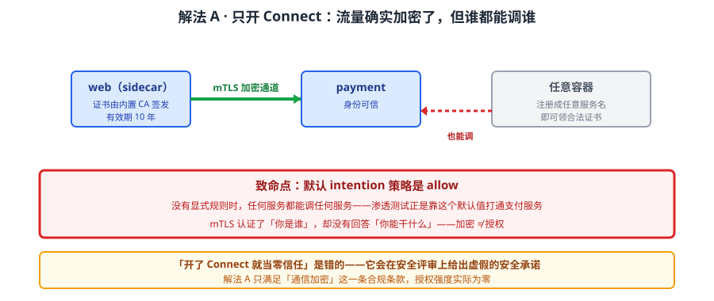
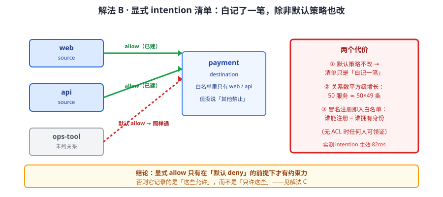
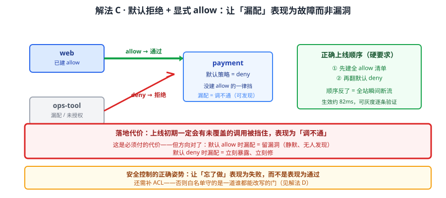
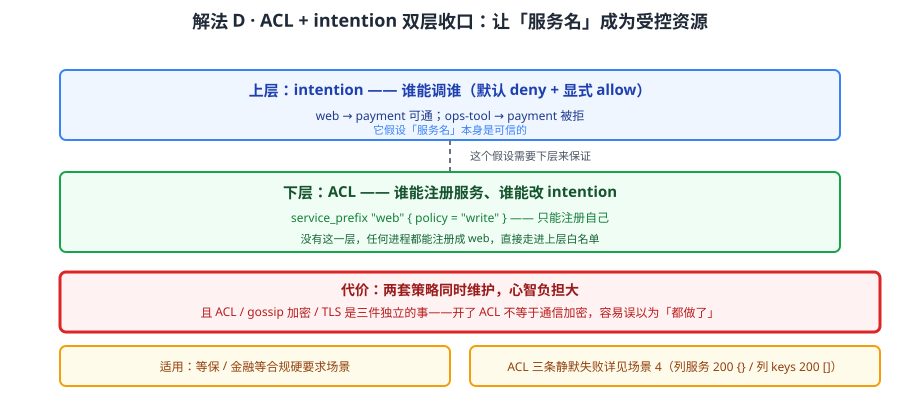

# 场景 3：要做服务间 mTLS 与授权（经典设计题）

**场景描述**：安全团队要求"服务之间全部走加密通道，并且能控制谁可以调谁"。团队开了 Consul Connect，给所有服务挂上 sidecar，宣告"零信任已落地"。渗透测试时，安全同学用一台普通容器领到一张合法证书，直接调通了支付服务——**所有人都能调所有服务**。

**🔒 先自己想 30 秒**：证书是 CA 签的、mTLS 也确实建立了，为什么"谁都能调谁"？问题出在**加密**还是**授权**？如果 intention 没配，默认是放行还是拒绝？

<details><summary>💡 提示（分层 / 分维度想）</summary>

把"零信任"拆成两件独立的事分别想：
1. **身份认证**（你是谁）——mTLS 解决了"通信双方都是真的服务"，但它回答的是"你是谁"，不是"你能干什么"
2. **授权**（你能干什么）——"web 能不能调 payment"这层判断，靠什么机制表达？没配的时候，默认是允许还是拒绝？

再想一层：**谁能给自己领证书**？如果任何进程都能向 Consul 注册一个名叫 `web` 的服务并拿到合法证书，那"身份"本身还可信吗？

提示：课程实测过两个关键事实——默认 intention 策略是 **allow**，以及 ACL 与 mTLS 是**两件独立的事**。

</details>

<details><summary>📖 展开解法</summary>

### 解法一览（效果按"授权强度 / 落地成本"对比）

| 解法 | 效果（授权强度 / 落地成本） | 代价 | 适用边界 |
|------|--------------------------|------|---------|
| A · 只开 Connect（mTLS） | 仅加密，授权强度为零 / 低 | **默认 allow**，任何人可领证调任意服务 | 只满足"通信加密"合规条款 |
| B · Connect + 显式 intention 清单 | 显式 allow 才通 / 中：要维护清单 | 清单随服务数平方增长；漏配即断流 | 服务数可控（<50），调用关系稳定 |
| C · 默认拒绝 + 显式 allow（推荐） | 默认全拒，漏配表现为"调不通" / 中 | 上线初期会有服务被误挡，需灰度 | 生产正确姿势，尤其合规场景 |
| D · intention + ACL 双层收口 | 默认拒绝 + 无权限注册不了服务 / 高 | 要同时维护两套策略，心智负担大 | 合规硬要求（等保 / 金融） |

> 解法 A→B→C→D 就是"从假零信任到真零信任"的递进；**只停在 A 是最危险的**，因为它看起来已经"加密了"。

### 各解法详解

#### 解法 A：只开 Connect（mTLS）——加密了，但等于没授权



读图：两个服务之间确实建立了 mTLS，证书由内置 CA 签发，流量是加密的。红框标的是**致命点**——默认 intention 策略是 **allow**：没有显式规则时，任何服务都能调任何服务。渗透测试用的那台普通容器，正是靠这个默认值拿到通路。

```bash
# 服务以 Connect 方式注册（带 sidecar）
curl -X PUT --data-binary @web-connect.json \
  http://127.0.0.1:8500/v1/agent/service/register

# 查内置 CA 证书有效期（实测 2026 → 2036，10 年）
consul connect ca get-config
```

> 为什么这不够：mTLS 证明"我是 web，你是 payment"——**它认证了身份，没做授权**。"web 能不能调 payment"这层判断由 intention 负责，而 intention 的**默认是 allow**。
> **"开了 Connect 就当零信任"是错的**：流量加密 ≠ 访问控制。这一条是本场景最贵的认知差——它会让团队在安全评审上给出虚假的安全承诺。

#### 解法 B：Connect + 显式 intention 清单——列出谁可以调谁



读图：为每个调用关系建一条 intention（web → api allow），未在清单中的关系**取决于默认策略**。红框标的是代价——若默认仍是 allow，没列的关系照样能通，清单只是"白记了一笔"；且服务数增长时，关系数是**平方级**增长。

```json
// intention-allow.json：允许 web 调 api
{
  "SourceName": "web",
  "DestinationName": "api",
  "Action": "allow"
}
```
```bash
curl -X POST --data-binary @intention-allow.json \
  http://127.0.0.1:8500/v1/connect/intentions
```

> **它的要害**：默认策略不改，显式 allow 就没有约束力——你只记录了"这些是允许的"，没禁止其他。课程实测：无 ACL 时**任何人都能给自己的服务领一张合法证书**，所以攻击者只需把服务命名成 `web` 就能进入白名单。
> 维护成本：50 个服务理论上是 50×49 条关系。实践中靠"按域分组 + 通配"收敛，但通配会削弱精度。

#### 解法 C：默认拒绝 + 显式 allow（推荐的生产姿势）



读图：把默认策略翻成 deny，所有调用默认被拒，只有显式建了 allow 的关系能通。红框标的是**落地代价**——上线初期一定会有没被覆盖的调用被挡住表现为"调不通"，必须灰度推进；但它的价值在于**漏配表现为故障而非漏洞**。

```hcl
# 1. ACL 默认拒绝（这是 intention 默认拒绝的前提之一）
acl {
  enabled        = true
  default_policy = "deny"
}
```
```bash
# 2. 把 intention 默认策略改为 deny
curl -X PUT --data-binary '{"Action":"deny"}' \
  http://127.0.0.1:8500/v1/connect/intentions/anon-default

# 3. 再逐条建显式 allow（顺序不能反，否则上线即断流）
curl -X POST --data-binary @intention-allow.json \
  http://127.0.0.1:8500/v1/connect/intentions
```

> 为什么这是推荐解：**失败方向对了**。默认 allow 时，漏配 = 留了个漏洞（静默、没人发现）；默认 deny 时，漏配 = 调不通（立刻暴露、立刻修）。安全控制的正确姿势就是让"忘了做"表现为失败。
> **上线顺序是硬要求**：先建全 allow 清单 → 再翻默认 deny。反过来会瞬间切断所有未列关系。课程实战 B 实测 intention 生效约 **82ms**，所以灰度期可以逐条加、快速验证。

#### 解法 D：intention + ACL 双层收口——堵住"随便领证"



读图：下层用 ACL 控制"谁能注册服务、谁能改 intention"（挡住冒名注册与策略篡改），上层用 intention 控制"谁能调谁"。红框标的是代价——两套策略要同时维护，且**ACL、gossip 加密、TLS 是三件独立的事**，开了 ACL 不等于通信加密，容易误以为"都做了"。

```hcl
# 只允许 web 服务注册自己，不给注册别的服务名的权限
service_prefix "web" {
  policy = "write"
}
# 不给随便读/改 intention 的权限
operator = "read"
```

> **为什么必须叠 ACL**：Connect 的身份来自"服务名"，而服务注册本身如果没有权限约束，任何进程都能注册成 `web`。ACL 把"服务名"变成受控资源，intention 的 allow 才有意义——**没有 ACL 的 intention，白名单守的是一道谁都能改写的门**。
> 三件事别搞混：**ACL**（谁能操作）、**gossip 加密**（节点间通信）、**TLS**（HTTP API 加密）。开了其中一个不代表另外两个也开了。

### 替代路线（非本课程技术栈）

| 替代方案 | 思路 | 与本课程解法的差异 |
|---------|------|------------------|
| Istio（AuthorizationPolicy） | 独立服务网格，策略与 K8s CRD 深度集成 | 策略表达力更强（L7 方法/路径级）；但组件重、学习曲线陡，且主要面向 K8s |
| Linkerd | 轻量服务网格，mTLS 默认开启 | 更轻、默认安全；但授权策略能力弱于 Istio，且同样绑定 K8s |
| SPIFFE / SPIRE 身份体系 | 独立的工作负载身份标准 | 身份层更通用（跨集群跨云）；但要自建控制面，Consul 内置 CA 已覆盖常规需求 |
| 网络层 NetworkPolicy | K8s 原生网络策略 | 只到 L3/L4（IP + 端口），无服务身份概念，无法表达"服务 A 可调用 B" |

### 推荐路径（递进，不是一次全上）

1. **先上解法 C 的顺序**：建全 allow 清单 → 再翻默认 deny（顺序反了会断流）
2. **然后补 ACL（解法 D）**——否则白名单形同虚设：谁能注册服务，谁就拥有那个身份
3. **最后单独确认三件事各自开着**：ACL 已启用、gossip 已加密、TLS 已配置（三者互不替代）
4. **灰度推进**：intention 生效约 82ms，可逐条加、快速验证，别一次性切

### 知识点挂钩

- 解法 A / B / C → 阶段 2 课 7《多数据中心与服务网格》（Connect 与 intentions、内置 CA 有效期 10 年、默认策略 allow 实测）
- 解法 D → 阶段 2 课 8《ACL 与安全模型》（ACL 三层模型、默认拒绝、三条静默失败）
- 实战验证 → [实战 B · Connect 最小闭环](../practices/实战B-Connect最小闭环/README.md)（无需 Envoy 跑通 mTLS 数据面，intention 82ms 生效）
- 身份体系对照 → 阶段 3 课 10《多维对比矩阵》（与 Istio / Linkerd 的服务网格能力横评）

### 什么情况下此方案不适用

- **需要 L7 级授权**（按 HTTP 方法 / 路径控制）→ intention 只到服务级（L4），细粒度要转 Istio 或在应用层做
- **纯 K8s 单集群且无 VM** → 引入 Connect 是增重，K8s NetworkPolicy + 原生 Service 更轻（见场景 5 与场景 8）
- **没有 Envoy sidecar 运维能力** → 数据面依赖代理，课程实测可用内置代理跑通最小闭环，但生产通常仍需 Envoy

### 做错会踩的坑

- 停在解法 A 就宣称"零信任" → 默认 allow，任何人可领证调任意服务 → 本场景开头的渗透测试现场
- 只建 allow 不翻默认 deny → 未列关系照样能通 → 关联 [08-实战经验.md](../08-实战经验.md) 故障模式 7「Connect 意图改了不生效」
- 开了 ACL 就以为通信也加密了 → ACL / gossip 加密 / TLS 是三件事 → 关联 [08-实战经验.md](../08-实战经验.md) 故障模式 10「ACL 静默失败」
- 上线顺序反了（先翻 deny 再加 allow）→ 全站调用瞬间中断

</details>
