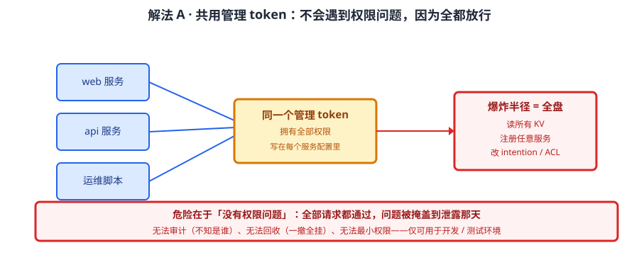
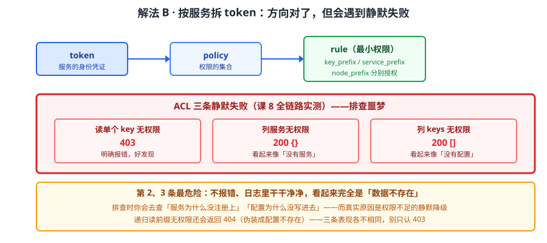
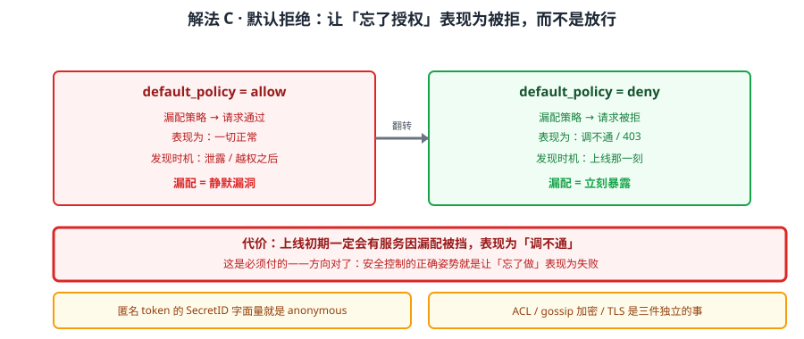
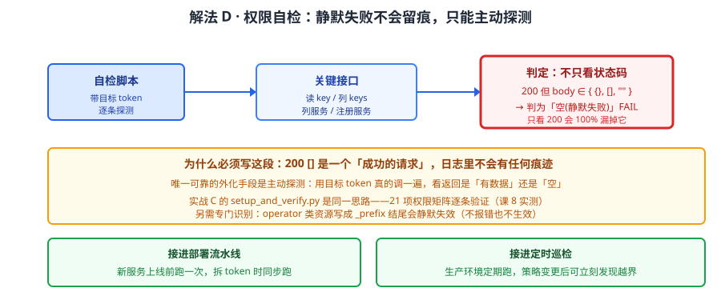

# 场景 4：要上生产，权限怎么收口（经典设计题）

**场景描述**：Consul 要上生产了。现状是所有服务共用 `bootstrap` 出来的那一个管理 token，写在每个服务的配置文件里。安全团队要求"按最小权限拆分"。拆分上线后第二天，业务同学反馈"服务注册不上了"和"配置读不到了"——但 Consul 日志里**没有任何报错**，两条查询都返回了 **200**。

**🔒 先自己想 30 秒**：为什么"没权限"会返回 200 而不是 403？如果让你排查，你会先看什么？再想一层：什么样的返回会让"权限不足"和"数据不存在"看起来一模一样？

<details><summary>💡 提示（分层 / 分维度想）</summary>

先把 ACL 的结构想清楚，再想"没权限"的表现：
1. **ACL 三层模型是什么**——token、policy、rule 的关系？权限是挂在谁身上的？
2. **默认策略选 allow 还是 deny**——"忘了授权"分别表现为通过还是拒绝？哪种更安全？
3. **为什么有的没权限返回 403、有的返回 200 空**——是 API 设计不一致，还是另有原因（想想"列表"和"单个读取"的区别）？

提示：课程实测过三类返回——403（明确报错）、`200 {}`（看起来像"没有服务"）、`200 []`（看起来像"没有配置"）。后两条是排查噩梦。

</details>

<details><summary>📖 展开解法</summary>

### 解法一览（效果按"安全强度 / 排查难度"对比）

| 解法 | 效果（安全强度 / 排查难度） | 代价 | 适用边界 |
|------|--------------------------|------|---------|
| A · 共用管理 token（现状） | 最低：一个泄露全盘失守 / 最低：不会遇到权限问题 | 无法审计、无法回收、无法最小权限 | 仅开发 / 测试环境 |
| B · 按服务拆 token（最小权限） | 中：单服务泄露影响可控 / 中 | 要为每个服务维护策略；静默失败难查 | 服务数可控，能接受策略维护 |
| C · 默认拒绝 + 前缀授权（推荐） | 高：忘了授权即被拒 / 中：静默失败要靠监控补 | 上线期会有服务被误挡；需配套可观测 | 生产正确姿势 |
| D · 默认拒绝 + 前缀授权 + 权限自检 | 同上，且静默失败可发现 / 低（有自检兜底） | 要写并维护自检脚本 | 生产 + 合规场景 |

> B / C / D 的区别不在"授什么权"，而在**默认策略的方向**与**静默失败的可发现性**——后者才是生产上的真正分水岭。

### 各解法详解

#### 解法 A：共用管理 token——方便但一炸全炸



读图：所有服务共用同一个管理 token，这个 token 拥有全部权限。红框标的是**爆炸半径**——任一服务的配置文件泄露（它就在配置文件里），攻击者拿到的是整个 Consul 的控制权：能读所有 KV、能注册任意服务、能改 intention。

```bash
# bootstrap 只能执行一次，第二次报「ACL bootstrap no longer allowed」
consul acl bootstrap
# 产出的 SecretID 就是管理 token——现状被直接写进了每个服务的配置
```

> 它为什么还能用：因为它不会遇到任何权限问题——**所有请求都通过**。这正是危险所在：权限问题被"全部放行"掩盖了，直到泄露那天。
> **没有中间状态**：要么全放行（现状），要么开始最小权限（解法 B 起）。没有"稍微收一点"的选项。

#### 解法 B：按服务拆 token（最小权限）——方向对了，但会遇到静默失败



读图：每个服务一个 token，token 挂 policy，policy 由 rule 组成，rule 按 `key_prefix` / `service_prefix` / `node_prefix` 限定范围。红框标的是**排查噩梦**——没权限时有的接口返回 403（好发现），有的返回 `200 {}` 或 `200 []`（看起来像"没有数据"）。

```hcl
# pol-team-web.hcl：web 服务只能写自己的服务、读 app/ 前缀的配置
service_prefix "web" {
  policy = "write"
}
key_prefix "app/" {
  policy = "read"
}
node_prefix "" {
  policy = "read"
}
```
```bash
# 建 policy 与 token
consul acl policy create -name team-web -rules @pol-team-web.hcl
consul acl token create -description "web service" -policy-name team-web
```

> **ACL 三条静默失败（课 8 全链路实测，本场景最反直觉的部分）**：
> 1. 无权限读**单个** key → **403**（明确报错，好发现）
> 2. 无权限**列服务** → **`200 {}`**（空对象，看起来像"没有服务"）
> 3. 无权限**列 keys** → **`200 []`**（空数组，看起来像"没有配置"）
>
> 第 2、3 条最危险：排查时你会以为"服务没注册上""配置没写进去"，实际是**权限不足的静默降级**——它不报错，日志里干干净净。

#### 解法 C：默认拒绝 + 前缀授权——让"忘了授权"表现为被拒



读图：把 `default_policy` 设为 deny，所有未在策略里显式放行的请求一律拒绝。红框标的是代价——上线初期会有服务因漏配被挡，表现为"调不通"；但方向对了：**漏配立刻暴露**。

```hcl
# 1. 开启 ACL，默认拒绝
acl {
  enabled        = true
  default_policy = "deny"
}

# 2. 按前缀授权（不是给一个万能 token）
key_prefix "app/web/" {
  policy = "read"
}
service_prefix "web" {
  policy = "write"
}
```

> 为什么推荐：**失败方向对了**。默认 allow 时漏配 = 静默放行（没人发现）；默认 deny 时漏配 = 拒绝（立刻暴露）。
> **匿名 token 的 SecretID 字面量就是 `anonymous`**——默认策略下它能读到什么，要专门检查一遍，别默认它什么都读不到。
> ACL / gossip 加密 / TLS 是**三件独立的事**：开了 ACL 不等于通信加密，别把三件事混为一谈。

#### 解法 D：叠权限自检，让静默失败可发现



读图：一个自检脚本用目标 token 逐条探测关键接口，把"返回 200 但空"与"返回 403"都判为失败并告警。红框标的是它守护的**具体陷阱**——`200 []` 和 `200 {}` 这两个"看起来正常"的返回，正是脚本要专门识别的对象。

```python
import requests

def check(token, name):
    """权限自检：把「200 但空」也判为失败——静默失败的只有这一种抓法。"""
    h = {"X-Consul-Token": token}
    cases = [
        ("读单个 key", "GET", "/v1/kv/app/web/port"),
        ("列 keys",    "GET", "/v1/kv/app/?keys=true"),
        ("列服务",     "GET", "/v1/catalog/services"),
        ("注册服务",   "PUT", "/v1/agent/service/register"),
    ]
    for label, method, path in cases:
        r = requests.request(method, f"http://127.0.0.1:8500{path}", headers=h, timeout=5)
        # 200 但空 = 静默失败；403 = 明确拒绝；二者都算不通过
        empty = r.text.strip() in ("{}", "[]", "")
        ok = (r.status_code == 200 and not empty)
        print(f"[{name}] {label}: {r.status_code} {'空(静默失败)' if empty else ''} -> {'OK' if ok else 'FAIL'}")

check("<YOUR_WEB_TOKEN>", "web")
```

> 为什么必须写这段：解法 B/C 的静默失败**不会在日志里留下任何痕迹**——`200 []` 是一个"成功的请求"。唯一可靠的外化手段是主动探测：用目标 token 真的去调一遍，看返回是"有数据"还是"空"。
> 把它接进**部署流水线**与**定时巡检**：新服务上线前跑一次，生产环境定期跑一次。课程实战 C 的 `setup_and_verify.py` 就是同一思路（21 项权限矩阵）。

### 替代路线（非本课程技术栈）

| 替代方案 | 思路 | 与本课程解法的差异 |
|---------|------|------------------|
| Vault 动态凭据 | 短期 token 自动轮换，用后即焚 | Consul ACL token 是**长期静态**的，泄露后需手动轮换；Vault 可自动过期，但要引入 Vault 集群 |
| K8s RBAC + ServiceAccount | 用 K8s 身份体系做权限，Consul 侧不细拆 | 与 K8s 深度集成；但只覆盖集群内，VM 无效，且粒度是"命名空间/资源"而非 Consul 的 key 前缀 |
| 网络隔离（只暴露本机 agent） | 靠网络层限制谁能访问 Consul | 拦得住外部访问，拦不住"能访问的人做什么"——粗粒度，应与 ACL 叠加而非替代 |
| 企业版 namespace / 审计日志 | 多租户隔离 + 谁改了什么有记录 | 解决审计与多租户；但**是企业版功能**，社区版无（课 8 已核实边界） |

### 推荐路径（递进，不是一次全上）

1. **先把 `default_policy` 翻成 deny**（解法 C）——这一步不需要先拆完所有 token，方向先对
2. **按服务逐个拆 token**（解法 B），拆一个验一个，别批量切
3. **立刻上权限自检**（解法 D）——在拆的过程中同步跑，否则静默失败无从发现
4. **定期轮换 token**：静态 token 泄露后必须手动轮换，把轮换周期写进运维规范
5. **有审计需求 → 评估企业版**：社区版无审计日志，"谁改了什么"只能靠外部留痕

### 知识点挂钩

- 解法 B / C / D → 阶段 2 课 8《ACL 与安全模型》（三层模型、默认拒绝、三条静默失败、21 项权限矩阵）
- 实战验证 → [实战 C · ACL 生产权限模型](../practices/实战C-ACL生产权限模型/README.md)（`validate_acl_rules()` 规则校验、`operator` 资源不带 label 的静默失效坑）
- 企业版边界 → 阶段 2 课 8（namespaces 与 audit logging 为企业版功能，社区版无）
- 令牌轮换对照 → 阶段 3 课 10《多维对比矩阵》（与 Vault 动态凭据的能力对照）

### 什么情况下此方案不适用

- **需要"谁在什么时候改了什么"的审计** → 社区版无审计日志（企业版才有），只能外部留痕或换方案
- **需要多租户强隔离** → 社区版无 namespaces，多团队共用一套 Consul 时隔离粒度不够
- **需要短期自动轮换凭据** → ACL token 是长期静态的，应引入 Vault 或外部轮换机制
- **团队无策略维护能力** → 拆 token 后每张策略都要维护，维护不了就别拆（宁可网络隔离 + 最小暴露面）

### 做错会踩的坑

- 只看返回码不看内容 → `200 {}` / `200 []` 被当成"正常无数据" → 关联 [08-实战经验.md](../08-实战经验.md) 故障模式 10「ACL 静默失败——服务没注册上其实是被权限挡了」
- 递归读前缀无权限 → 返回 **404** 而非 403，伪装成"配置不存在" → 关联 [09-排障速查手册.md](../09-排障速查手册.md) 症状 13
- `operator` 类资源写成 `_prefix` 结尾 → **静默失效**（不报错也不生效） → 关联 [09-排障速查手册.md](../09-排障速查手册.md) 症状 14
- 开了 ACL 就以为通信也加密了 → ACL / gossip 加密 / TLS 是三件独立的事 → 关联 [08-实战经验.md](../08-实战经验.md) 故障模式 10

</details>
