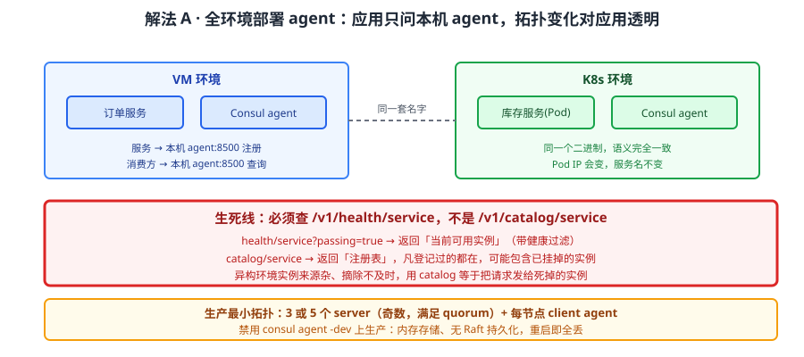
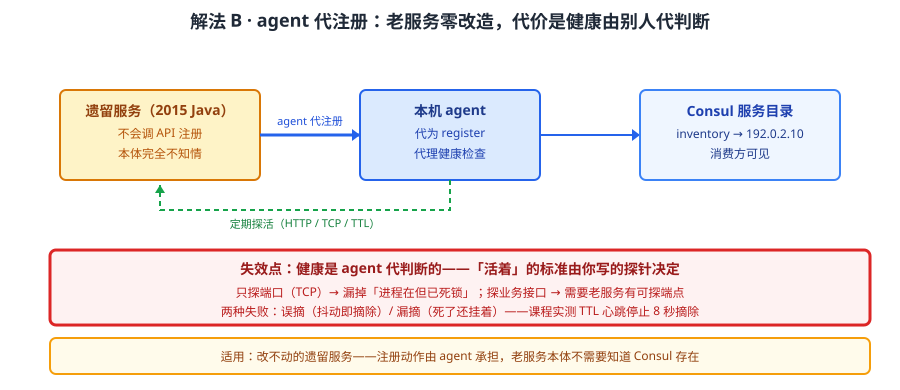
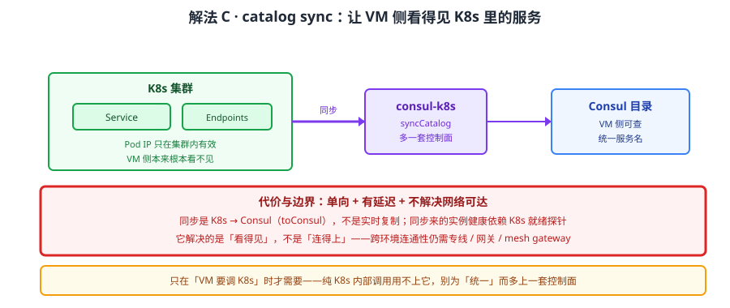
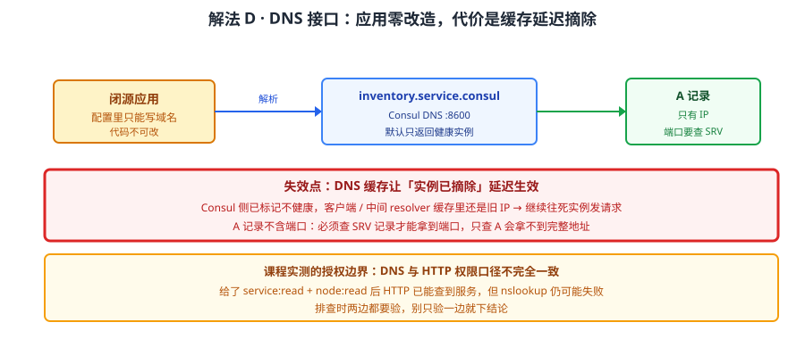

# 场景 5：异构环境（VM + 容器）统一寻址（规模压力题）

**场景描述**：公司有一批跑在 VM 上的遗留服务（订单、库存，2015 年的 Java 应用改不动），新服务全在 K8s 里。两边要互相调用，现状是维护两套寻址体系：VM 侧靠 DNS + 配置中心，K8s 侧靠 Service。每次有一边扩缩容，另一边的配置就要跟着改，故障频发。要求"一套名字走天下"。

**🔒 先自己想 30 秒**：Consul 凭什么能让 VM 和 K8s 用同一套名字？它是靠"同步两边的服务列表"实现的吗？如果不是，那 agent 在每个环境里扮演什么角色？

<details><summary>💡 提示（分层 / 分维度想）</summary>

把"统一寻址"拆成三个子问题分别想：
1. **名字从哪来**——谁来注册？VM 上的老服务不会自己调 API 注册，怎么办？
2. **消费方怎么查**——查到的是"注册表里登记过的"还是"当前活着且健康的"？这两者差别在哪？
3. **两边环境差异怎么抹平**——K8s 里的 Pod IP 会变、VM 的 IP 相对固定，寻址层要不要关心这个差异？

提示：回忆课 4 强调的那个区别——`/v1/catalog/service` 和 `/v1/health/service` 返回的不是一回事。这一条在异构环境里是生死线。

</details>

<details><summary>📖 展开解法</summary>

### 解法一览（效果按"改造成本 / 寻址准确性"对比）

| 解法 | 效果（改造成本 / 寻址准确性） | 代价 | 适用边界 |
|------|--------------------------|------|---------|
| A · 全环境部署 agent，按服务名发现 | 中：每环境装 agent / 高：只返回健康实例 | 老服务不会自注册，要额外手段；跨环境网络要打通 | VM + 容器长期共存 |
| B · 外部服务注册（agent 代注册老服务） | 低：老服务零改造 / 高 | 老服务的健康状态由 agent 代理探活，探不准会误摘 | 遗留服务无法改造 |
| C · catalog sync（K8s 服务同步进 Consul） | 中：装 consul-k8s / 高 | K8s 侧多一套控制面；同步有延迟与单向性 | K8s 侧服务要被 VM 侧调用 |
| D · DNS 接口（.service.consul） | 最低：应用零改造 / 中：DNS 无健康语义细节 | DNS 缓存导致摘除延迟；端口要用 SRV 查 | 应用不能改，只能解析域名 |

> 这四条**不是互斥的**，生产通常是 A + B + C 组合（agent 铺底、老服务代注册、K8s 同步），D 作为不能改应用的兜底。

### 各解法详解

#### 解法 A：全环境部署 agent，按服务名发现——Consul 的主场



读图：VM 与 K8s 节点上都跑 Consul agent，服务各自向本机 agent 注册，消费方只问本机 agent 要"健康的实例列表"。红框标的是**生死线**——必须查 `/v1/health/service`（带健康过滤），而不是 `/v1/catalog/service`（返回注册表，可能包含已挂掉的实例）。

```bash
# 消费方：只问本机 agent（:8500），代码里不出现任何 Server 地址
curl "http://127.0.0.1:8500/v1/health/service/inventory?passing=true"

# 反例：查 catalog 会拿到「登记过但已不健康」的实例
curl "http://127.0.0.1:8500/v1/catalog/service/inventory"
```

> 为什么这么配：**应用只与本机 agent 通信**，Server 地址只对 agent 可见——集群拓扑变化对应用完全透明，这是它能横跨 VM 与容器的根本原因。
> **`/v1/health/service` vs `/v1/catalog/service` 是生死线**：前者带健康过滤返回"当前可用实例"，后者返回的是**注册表**（凡登记过的都在）。异构环境里实例来源杂、摘除不及时，用 catalog 等于把请求发给已经死掉的实例。
> 别用 `consul agent -dev` 上生产：dev 是内存存储、无 Raft 持久化，重启即全丢。生产最小拓扑是 **3 或 5 个 server**（奇数，满足 quorum）+ 每节点 client agent。

#### 解法 B：外部服务注册——让改不动的老服务进入同一套名字



读图：VM 上的老服务不会调 API，由它本机的 agent 代为注册并代理健康检查，把探活结果回报给控制面。红框标的是代价——**健康状态是 agent 代理探的**：探针写得不准（比如只探端口不探业务），会误摘或漏摘，而老服务自己毫不知情。

```json
// web.json：由 agent 代为注册外部服务（老服务本体不需要改）
{
  "Name": "inventory",
  "Address": "192.0.2.10",
  "Port": 8080,
  "Check": {
    "HTTP": "http://192.0.2.10:8080/health",
    "Interval": "10s",
    "Timeout": "5s"
  }
}
```
```bash
curl -X PUT --data-binary @web.json \
  http://127.0.0.1:8500/v1/agent/service/register
```

> 为什么它能解决老服务：注册动作由 agent 承担，**老服务本体零改造**——2015 年的 Java 应用不需要知道 Consul 存在。
> **它的要害**：健康检查是 agent 代做的，"活着"的判断标准由你写的探针决定。只探端口（TCP）会漏掉"进程在但已死锁"；探业务接口则要老服务有可探的端点。探针设计不当的两种失败：误摘（抖动即摘除）与漏摘（死了还挂着）——对应课程实测的 TTL 心跳停止 8 秒摘除行为。

#### 解法 C：catalog sync——把 K8s 的服务同步进 Consul



读图：consul-k8s 组件监听 K8s 的 Service/Endpoint，把集群内的服务同步进 Consul 目录，VM 侧因此能查到 K8s 里的服务。红框标的是**单向性与延迟**——同步是 K8s → Consul 的（或按需双向），不是实时复制；且同步进来的实例健康状态依赖 K8s 侧的就绪探针。

```yaml
# consul-k8s Helm values 关键项（示意，以实际版本参数名为准）
syncCatalog:
  enabled: true
  toConsul: true      # K8s → Consul 方向
  toK8S: false        # Consul → K8s 方向（按需开启）
  default: true       # 默认同步全部服务，或按注解白名单
```

> 适用：K8s 侧的服务**要被 VM 侧调用**时——没有 sync，VM 侧根本看不见 K8s 里的服务（它们的 IP 只在集群内有效）。
> **代价与边界**：多一套控制面要运维（consul-k8s 组件本身也要高可用）；同步有延迟，不是实时；且**它解决的是"看得见"，不解决"网络可达"**——跨环境调用仍需打通网络（专线 / 网关 / mesh gateway）。

#### 解法 D：DNS 接口——应用零改造的兜底



读图：应用不改代码，直接解析 `inventory.service.consul`，Consul 的 DNS 接口返回健康实例 IP。红框标的是代价——**DNS 缓存**：应用或中间 resolver 的缓存会让"实例已摘除"这件事延迟生效，明明已经下线还在往那边发请求。

```bash
# 直接解析服务名（默认只返回健康实例）
dig @127.0.0.1 -p 8600 inventory.service.consul

# 端口要用 SRV 记录查（A 记录只有 IP）
dig @127.0.0.1 -p 8600 inventory.service.consul SRV
```

> 适用：完全不能改的应用（二进制闭源、配置里只能写域名）。
> **两个必知**：① **DNS 缓存会延迟摘除**——Consul 侧已经把实例标记为不健康，客户端缓存里还是旧 IP；② 端口不在 A 记录里，要用 **SRV 记录**才能拿到端口。
> 课程实测过 DNS 授权边界：给了 `service:read` + `node:read` 后 HTTP 已能查到服务，但 nslookup 仍可能失败——**DNS 与 HTTP 的权限口径不完全一致**，排查时别只验一边。

### 替代路线（非本课程技术栈）

| 替代方案 | 思路 | 与本课程解法的差异 |
|---------|------|------------------|
| 纯 K8s（Service + Ingress + ExternalName） | 用 K8s 原生能力给 VM 服务建 ExternalName | 单集群内够用；VM 侧反向查 K8s 服务很别扭，且无统一健康语义 |
| 统一 API 网关 | 所有跨环境调用走网关，网关做地址映射 | 解决"可达"与"统一入口"；但网关成为单点与瓶颈，且东西向流量绕行不合理 |
| 服务网格（Istio 多集群） | 网格层统一身份与寻址 | 能力更强（含 mTLS / 流量治理）；但组件重、主要面向 K8s，VM 接入成本高 |
| 商业 DNS / 全局负载均衡 | 靠 DNS 层做跨环境解析 | 与解法 D 同思路但更重；无服务健康语义，摘除靠 TTL |

### 推荐路径（递进，不是一次全上）

1. **先铺 agent（解法 A）**——两个环境都装，这是所有后续能力的前提；消费方一律改查 `/v1/health/service`
2. **老服务用代注册（解法 B）**——一个一个来，探针先探业务端点，探不了再退回 TCP
3. **K8s 侧开 catalog sync（解法 C）**——只在"VM 要调 K8s"时才需要，否则可以不上
4. **不能改的应用用 DNS（解法 D）**——同时把 DNS 缓存 TTL 调短，并接受它比 HTTP 查询慢一拍
5. **最后确认网络可达**——Consul 只解决"寻址"，跨环境连通性要另配（这不是 Consul 的职责）

### 知识点挂钩

- 解法 A → 阶段 1 课 1《为什么需要服务注册与发现》、阶段 2 课 4《服务发现与健康检查机制》（health vs catalog、TTL 摘除）
- 解法 B → 阶段 2 课 4（健康检查类型与探针设计）
- 解法 C → 阶段 2 课 7《多数据中心与服务网格》、阶段 4 课 12（K8s 落地方式）
- 解法 D → 阶段 2 课 4（DNS 接口与 SRV 记录、DNS 授权边界实测）
- 场景定位 → 阶段 3 课 10《多维对比矩阵》（异构环境是 Consul 相对 K8s 原生的最大差异点）

### 什么情况下此方案不适用

- **纯 K8s 单集群、无 VM** → 引入 Consul 是纯增重：多一套控制面要运维、多一层故障域，K8s Service 已够（转场景 8 的选型结论）
- **跨环境网络不通且无法打通** → Consul 只解决寻址，不解决连通性；网络不通时统一名字没有意义
- **服务数极少（<10）且拓扑稳定** → 维护两套配置的成本可能低于运维一套 Consul
- **要求毫秒级摘除** → DNS 缓存与健康检查间隔都有下限，亚秒级摘除要应用层配合熔断

### 做错会踩的坑

- 查 `/v1/catalog/service` 而非 `/v1/health/service` → 把请求发给已死实例 → 关联 [08-实战经验.md](../08-实战经验.md) 故障模式 4「服务注册成功但很快消失」
- 健康检查间隔与 TTL 配错 → 实例抖动即被摘除 → 关联 [08-实战经验.md](../08-实战经验.md) 故障模式 6「leader 频繁切换（选举震荡）」
- agent 找不到 server（VM 侧配置遗漏）→ 注册全部失败 → 关联 [09-排障速查手册.md](../09-排障速查手册.md) 症状 1「agent 找不到 server」
- K8s 上不同 namespace 的同名服务被合并 → 只有一个生效 → 关联 [09-排障速查手册.md](../09-排障速查手册.md) 症状 12「Consul CE 忽略 K8s namespace」（注意：这是 CE 的既有行为，与是否开 catalog sync 无关）
- catalog sync 与自注册并存 → 同一实例重复注册 → 用 `/v1/health/service` 查重核对，二者不要同时开

</details>
