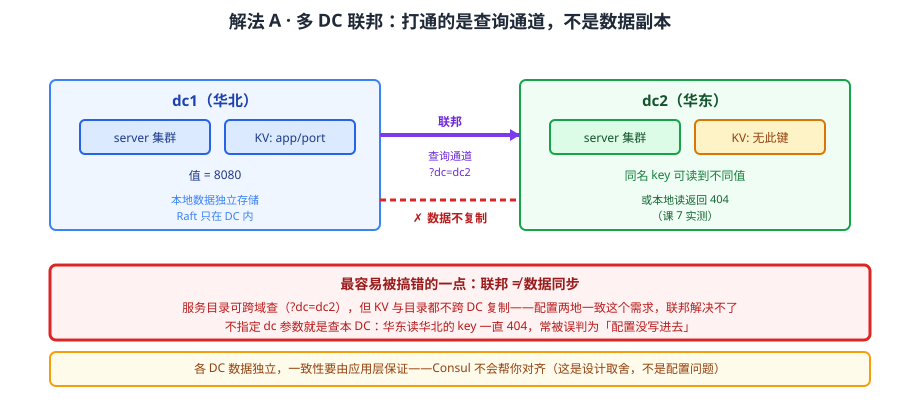
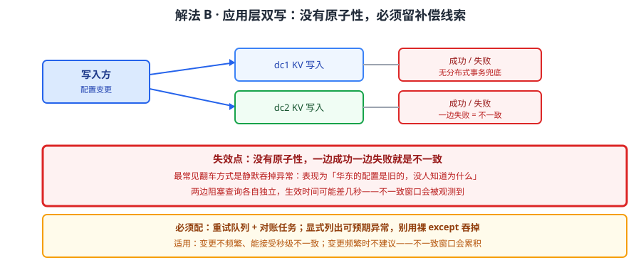
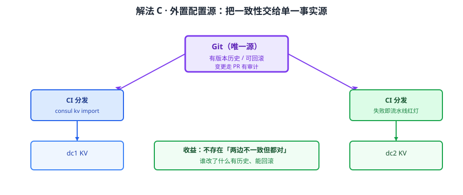
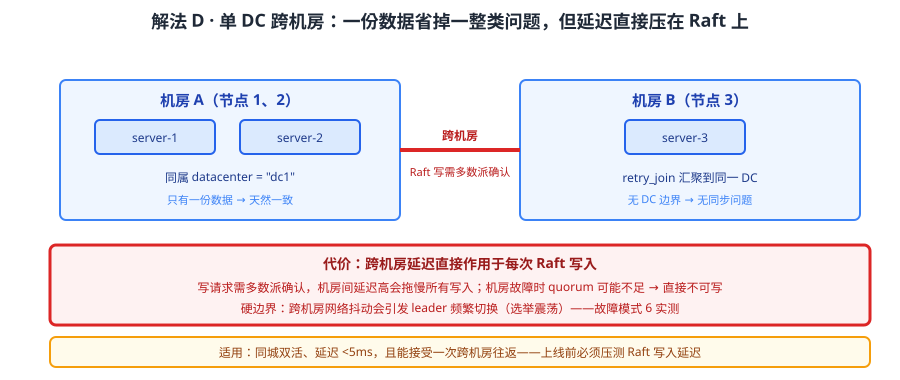

# 场景 6：多机房 / 多地域部署（规模压力题）

**场景描述**：服务分布在华北、华东两个机房，要求"华东能调用华北的服务"，并且**配置也要两地一致**——运维希望"在华北改一次配置，华东自动跟着变"。第一版按"多数据中心联邦"搭好，服务调用是通的；但配置同步始终不生效，华东读同一个 key 一直返回 **404**。

**🔒 先自己想 30 秒**：联邦打通了之后，为什么服务能查到、配置却读不到？"能查询"和"数据在那里"是一回事吗？如果两边都往同一个 key 写不同的值，会发生什么？

<details><summary>💡 提示（分层 / 分维度想）</summary>

把"多机房"拆成两类完全不同的需求：
1. **查询跨域**——"我在华东，想知道华北有哪些服务"：这需要什么？一条查询通道够不够？
2. **数据跨域**——"我在华北写的配置，华东也能读到"：这需要数据副本，还是查询通道？

关键区分：**联通的是"查询通道"还是"数据复制"**。这是 Consul 多 DC 最容易被搞错的一点（课 7 实测）。想想：如果两边都能写同一个 key，谁说了算？

</details>

<details><summary>📖 展开解法</summary>

### 解法一览（效果按"数据一致性 / 运维复杂度"对比）

| 解法 | 效果（数据一致性 / 运维复杂度） | 代价 | 适用边界 |
|------|--------------------------|------|---------|
| A · 多 DC 联邦（服务查询跨域） | 服务目录可跨域查 / 中 | **KV 与目录都不跨 DC 复制**，配置各写各的 | 只需"能查到对端服务" |
| B · 配置双写（应用层保证） | 取决于双写实现，通常最终一致 / 高 | 双写失败要补偿；两边可能短暂不一致 | 配置必须两地可用 |
| C · 外置配置源（Git / 配置中心） | 强一致（单一源）/ 中 | 引入外部组件；要自建分发链路 | 配置一致性是硬要求 |
| D · 单 DC 部署 + 跨机房网络 | 天然一致（只有一份）/ 低 | 跨机房延迟高；机房故障即全站故障 | 机房距离近、延迟可接受 |

> 旧版场景库里的「想跨机房同步配置数据 → 做不到」就是本场景的**边界结论**：它不是一道有解法谱系的题，而是解法 A 的固有约束，故并入此处说明，不单独立篇。

### 各解法详解

#### 解法 A：多 DC 联邦——打通的是查询通道，不是数据副本



读图：两个 DC 各自的 server 集群通过联邦建立连接，dc1 可以**查询** dc2 的服务目录。红框标的是**最容易被搞错的一点**——联邦连的是查询通道，**KV 与目录都不跨 DC 复制**：dc2 本地读同 key 返回 404，同 key 两个 DC 可以存**不同的值**。

```bash
# dc1 上查询 dc2 的服务目录（显式指定 dc 参数）
curl "http://127.0.0.1:8500/v1/health/service/inventory?dc=dc2&passing=true"

# 反例：不指定 dc 就是查本 DC——华东读华北的 key 一直 404 的原因
curl "http://127.0.0.1:8500/v1/kv/app/port"          # → 404（本 DC 没有）
```

> **实测结论（课 7）**：KV 与目录**都不跨 DC 复制**——dc2 本地读同 key 返回 **404**，同 key 两个 DC 可以存**不同的值**。
> 所以"配置两地一致"这个需求，**联邦解决不了**。想跨机房同步数据 / 配置 → 做不到，必须改设计（解法 B / C）。
> 需要主备切换时注意：各 DC 数据独立，**一致性要由应用层保证**，Consul 不会帮你对齐。

#### 解法 B：配置双写——应用层自己保证两地一致



读图：写入方同时写两个 DC 的 KV，任一边失败都要记录并补偿。红框标的是代价——**没有分布式事务兜底**：一边成功一边失败就是不一致，需要重试队列或对账任务；且两边阻塞查询各自独立，生效时间可能差几秒。

```python
import requests

DCS = ["http://dc1.example.com:8500", "http://dc2.example.com:8500"]

def put_both(key, value):
    """双写两个 DC：任一边失败都要留下补偿线索，不能静默吞掉。"""
    failed = []
    for base in DCS:
        try:
            r = requests.put(f"{base}/v1/kv/{key}", data=value, timeout=5)
            if r.status_code != 200:
                failed.append((base, r.status_code))
        except Exception as e:          # 显式列出可预期异常，别用裸 except 吞掉
            failed.append((base, repr(e)))
    if failed:
        log_and_retry(key, value, failed)   # 进重试队列，等补偿
        return False
    return True
```

> 为什么必须留补偿：双写没有原子性——**一边成功一边失败就是不一致**。静默吞掉异常是最常见的翻车方式，表现为"华东的配置是旧的，没人知道为什么"。
> 它的正当用途：配置变更不频繁、能接受秒级不一致、且愿意维护一个对账任务。变更频繁时不建议——不一致窗口会累积。

#### 解法 C：外置配置源——把一致性交给单一源



读图：配置以 Git（或专业配置中心）为唯一源，由分发链路分别写入各 DC。红框标的是代价——引入了外部组件与分发链路，但换来的是**单一事实源**：谁改了什么有历史、能回滚，不存在"两边不一致但都对"的状态。

```bash
# 以 Git 为源：变更走 PR，合并后由 CI 分发到各 DC
git commit -m "chore(config): 调整库存服务超时" && git push
# CI 侧：consul kv import / put 到各 DC，失败即流水线红灯
consul kv import @config/snapshot.json
```

> 为什么它更可靠：Consul KV **没有版本历史**（改了查不回旧值）、**没有审计日志**（企业版才有）——这两条恰恰是"配置一致性"最需要的。把源外置到 Git，版本与审计自然就有了。
> **这正是旧版场景库给出的结论**：有审计 / 灰度 / 版本需求 → 别用 KV 当主配置中心，用 Nacos / Apollo 等专业配置中心（见场景 2 的替代路线）。

#### 解法 D：单 DC 部署 + 跨机房网络——不联邦，就一份数据



读图：所有节点（无论物理在哪个机房）同属一个 DC，只有一份数据，天然一致。红框标的是代价——**跨机房延迟直接作用于 Raft**：写请求需要多数派确认，机房间延迟高会拖慢所有写入；且机房故障时 quorum 可能不足，直接不可写。

```hcl
# 单 DC 但跨机房：datacenter 用同一个名字，靠 retry_join 汇聚
datacenter = "dc1"
retry_join = ["192.0.2.11", "192.0.2.12", "192.0.2.13"]  # 分处不同机房
```

> 什么时候它反而对：**机房距离近（同城双活）、延迟低（<5ms）**，且你能接受一次 Raft 写的跨机房往返。它用"放弃 DC 边界"换来了"数据只有一份"，省掉所有一致性问题。
> **它的硬边界**：跨机房网络抖动会直接引发 **leader 频繁切换（选举震荡）**——课程故障模式 6 实测过这条。机房距离远、网络质量差时不要这么配。

### 替代路线（非本课程技术栈）

| 替代方案 | 思路 | 与本课程解法的差异 |
|---------|------|------------------|
| Nacos / Apollo 多机房部署 | 配置中心原生支持多机房与同步 | 解决的是「配置同步」，Consul 联邦不解决（实测不复制）；但要引入新组件 |
| 数据库自带复制 + 应用读本地库 | 靠 DB 复制保证配置一致 | 复用既有 DB 能力；但配置读取路径与 Consul 无关，两套体系并存 |
| etcd 跨地域（make-mirror /  learner） | 专门设计的跨地域复制机制 | 有官方复制能力；Consul 联邦刻意不做数据复制（设计取舍） |
| 消息队列同步变更 | 写配置方发事件，各 DC 消费后本地写入 | 最终一致 + 可重放；但要接受 MQ 投递语义与运维成本 |

### 推荐路径（递进，不是一次全上）

1. **先明确需求是哪一类**——只要"能查到对端服务"→ 解法 A 就够了，别往上加东西
2. **配置也要一致 → 解法 C**（外置源），而不是解法 B（双写）：双写的不一致窗口要靠人肉对账
3. **双写只在没有外部组件可用时选**，且必须配重试队列 + 对账任务
4. **机房近、延迟低 → 认真考虑解法 D**：一份数据省掉一整类问题，但要先压测跨机房 Raft 写入延迟
5. **别指望联邦能复制数据**——这是设计取舍，不是配置问题，调参解决不了

### 知识点挂钩

- 解法 A → 阶段 2 课 7《多数据中心与服务网格》（联邦是查询通道、KV 与目录不跨 DC 复制、同 key 两 DC 可存不同值，均实测）
- 解法 B / C → 阶段 2 课 6《KV 存储与配置管理》（KV 无版本历史、无审计日志、事务限单 DC 且上限 64 操作）
- 解法 D → 阶段 2 课 5《Raft 与 Gossip 一致性成色》（quorum 与写入延迟、选举震荡）
- 选型对照 → 阶段 3 课 10《多维对比矩阵》（与 Nacos / etcd 的跨地域能力横评）

### 什么情况下此方案不适用

- **要求 KV 数据跨机房自动同步** → 做不到，这是设计取舍（联邦不复制数据），改用法 C 或换组件
- **要求跨 DC 的原子事务** → 事务限单 DC 且上限 64 个操作，跨 DC 原子性不存在
- **机房间延迟高且要求写入低延迟** → 单 DC 跨机房（解法 D）会把延迟直接压到每次 Raft 写，不可接受
- **要求配置有版本历史与审计** → 社区版 KV 两项都没有，必须外置源或换配置中心

### 做错会踩的坑

- 以为"联邦 = 数据同步" → 配置两地不一致且无人知晓 → 关联 [08-实战经验.md](../08-实战经验.md) 故障模式 8「拿 Consul 跟 etcd/Nacos 做替换时功能对不上」
- 单 DC 跨机房但未压测 → 网络抖动引发选举震荡 → 关联 [08-实战经验.md](../08-实战经验.md) 故障模式 6「leader 频繁切换（选举震荡）」
- 双写吞掉异常 → 一边成功一边失败无人知道 → 只能靠对账发现：双写的**错误必须显式记录并告警**，静默吞异常等于没有双写
- 忘记显式指定 `dc` 参数 → 查的是本 DC，误判为"配置没写进去" → 关联 [08-实战经验.md](../08-实战经验.md) 故障模式 10「ACL 静默失败」（同为"看起来像没数据"）

</details>
