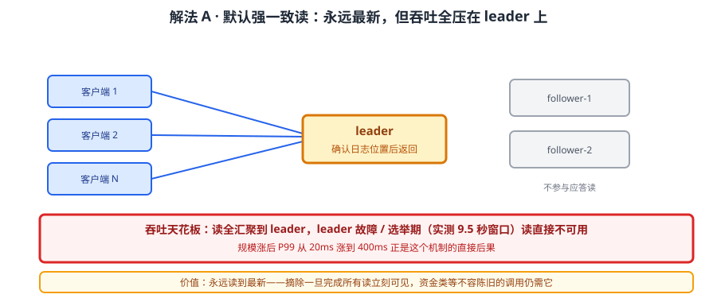
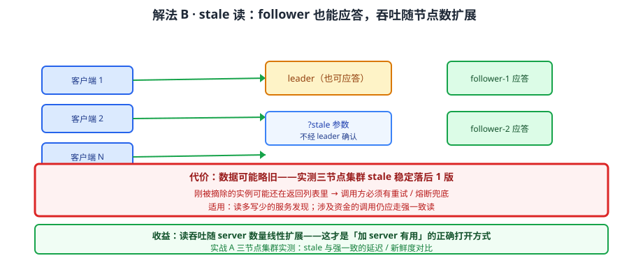
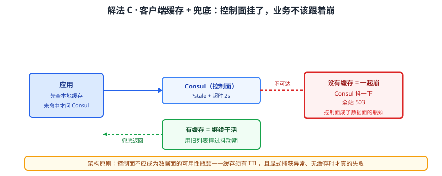
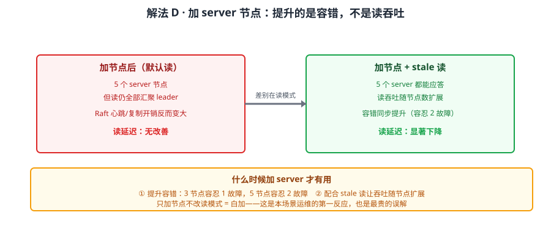

# 场景 7：服务从 20 个涨到 200 个（规模压力题）

**场景描述**：Consul 上线一年，服务从 20 个涨到 200 个、实例从 60 个涨到 600 个。最近开始出问题：服务发现的响应变慢（P99 从 20ms 涨到 400ms），偶发超时；一次网络抖动后，客户端大面积拿不到服务列表。运维想加 server 节点，但加完没有明显改善。

**🔒 先自己想 30 秒**：加 server 为什么没用？Consul 的读请求默认走什么一致性级别？如果让你在"读到最新的"和"读得快"之间选，代价分别是什么？再想一层：客户端拿不到列表时，除了报错还能怎么办？

<details><summary>💡 提示（分层 / 分维度想）</summary>

把"规模涨了之后什么先扛不住"拆开想：
1. **读路径**——默认读是不是都要经过 leader？强一致读和"随便找个节点读"差在哪？
2. **写路径**——注册/心跳是写操作，它们走 Raft 吗？600 个实例的心跳是什么量级？
3. **故障时的行为**——集群不可用（比如丢 quorum）时，客户端是"报错"还是"用旧数据继续干活"？

提示：课程实测过三种读模式的差异，以及 leader 强杀后那个 **9.5 秒窗口**。还有一个反直觉点：集群不可用时，有个模式能让客户端**继续用旧数据服务**——代价是可能读到过期实例。

</details>

<details><summary>📖 展开解法</summary>

### 解法一览（效果按"读延迟 / 数据新鲜度"对比）

| 解法 | 效果（读延迟 / 数据新鲜度） | 代价 | 适用边界 |
|------|--------------------------|------|---------|
| A · 默认强一致读（现状） | 高延迟：必经 leader / 最强：永远最新 | 读吞吐受限于 leader；leader 故障期不可读 | 服务数少、强一致优先 |
| B · stale 读（允许 follower 应答） | 低延迟：就近读 / 略旧（实测稳定落后 1 版） | 可能读到刚摘除的实例；要应用层容错 | 读多写少、可接受极短陈旧 |
| C · 客户端缓存 + 兜底 | 最低：本地命中 / 取决于缓存 | 缓存期内变更不可见；要设计失效策略 | 所有规模，应作为标配 |
| D · 加 server 节点（常见误解） | **基本无效** / 不变 | 增加 Raft 通信开销，可能更慢 | 仅提升容错，不提升读吞吐 |

> 解法 D 是**反面教材**但必须列——它是运维第一反应，而它在 Consul 的读模型下几乎无效。这是本场景最值钱的一条认知。

### 各解法详解

#### 解法 A：默认强一致读——正确性最好，吞吐受限于 leader



读图：所有读请求都被路由到 leader，由 leader 确认后返回。红框标的是**吞吐天花板**——leader 是单点承担读的确认工作；leader 故障或选举期间（实测强杀后约 **9.5 秒窗口**），读请求直接不可用。

```bash
# 默认即强一致读（不额外带参数）
curl "http://127.0.0.1:8500/v1/health/service/web?passing=true"
```

> 为什么规模一涨就慢：每个读都要 leader 确认日志位置，200 个服务 × 600 个实例的查询量全压在这一条路径上。**P99 从 20ms 涨到 400ms 正是这个机制的直接后果**。
> 它的价值：永远读到最新——摘除操作一旦完成，所有读立刻可见。对"绝不能调到已下线实例"的场景，这是唯一正确选择。

#### 解法 B：stale 读——让 follower 也能应答，吞吐不再受限于单点



读图：带 `stale` 参数后，任意 server（含 follower）都能直接应答，不必问 leader。红框标的是代价——**数据可能略旧**：课程实测三节点集群下 stale 读**稳定落后 1 版**，意味着刚被摘除的实例可能还在返回列表里。

```bash
# stale 读：任意 server 都可应答，不经过 leader
curl "http://127.0.0.1:8500/v1/health/service/web?passing=true&stale"

# 对比：默认（强一致）与 stale 的差异就是「要不要问 leader」
```

> 为什么它能解规模问题：读请求不再汇聚到 leader，**吞吐随 server 数量线性扩展**——这才是"加 server 有用"的正确打开方式（配合 stale）。
> **代价必须被应用层吸收**：stale 可能返回刚摘除的实例，所以调用方要有**重试 / 熔断**兜底。课程实测三节点集群 stale 稳定落后 1 版，这个陈旧程度在多数场景下可接受。
> 实战验证见 [实战 A · 读模式实测](../practices/实战A-读模式实测/README.md)（三节点集群、stale 与强一致对比）。

#### 解法 C：客户端缓存 + 兜底——集群挂了也能撑一会儿



读图：客户端把服务列表缓存在本地，Consul 不可达时使用缓存继续工作。红框标的是设计要点——**缓存必须有过期与兜底策略**：永不过期会一直调死实例，过期太短等于没缓存；且缓存内容是"上次看到的"，本身就有陈旧性。

```python
import time, requests

_cache = {"data": None, "ts": 0}
TTL = 10  # 缓存 10 秒

def discover(service):
    """带兜底的服务发现：Consul 挂了用旧列表继续干活，而不是一起崩。"""
    now = time.time()
    if _cache["data"] and now - _cache["ts"] < TTL:
        return _cache["data"]
    try:
        r = requests.get(
            f"http://127.0.0.1:8500/v1/health/service/{service}?passing=true&stale",
            timeout=2,
        )
        r.raise_for_status()
        # 就地更新字典的键，不要写 `_cache = {...}`
        # 否则 _cache 被 Python 视为本函数的局部变量，上面的读取会抛 UnboundLocalError
        _cache["data"] = r.json()
        _cache["ts"] = now
        return _cache["data"]
    except (requests.RequestException, ValueError) as e:   # 显式列出可预期异常，不要裸 except
        if _cache["data"]:
            return _cache["data"]    # 兜底：用旧列表继续服务
        raise                        # 没有缓存可兜，才真的失败
```

> ⚠️ **这段里藏着一个 Python 作用域陷阱**：如果在函数体内写 `_cache = {"data": r.json(), ...}`，Python 会把 `_cache` 当成**局部变量**，于是函数开头那次 `_cache["data"]` 读取会抛 `UnboundLocalError`——缓存逻辑一行都没跑到就崩了。正确写法是**就地更新字典的键**（如上），或用 `global _cache` 声明。这类 bug 在"缓存 + 兜底"代码里极常见，因为它平时不报错，只在缓存为空的第一次调用时炸。

> 为什么它是标配：**Consul 是控制面，不应该成为数据面的可用性瓶颈**。控制面短暂不可用时，业务应该继续跑（用旧列表），而不是一起 503。
> **这是架构原则不是优化技巧**：把"服务发现"设计成"尽力而为 + 本地兜底"，系统的可用性就不再等于 Consul 的可用性。

#### 解法 D：加 server 节点——最常见的误解



读图：运维加了 server 节点，但默认读仍全部汇聚到 leader。红框标的是**误解所在**——加 server 提升的是**容错能力**（能容忍更多节点故障），不是**读吞吐**；而且节点越多，Raft 心跳与复制的通信开销越大，某些情况下反而更慢。

```hcl
# 加 server 只提升容错（3 → 5 可容忍 2 节点故障）
server = true
bootstrap_expect = 5
```

> **什么时候加 server 才有用**：① 提升容错（3 节点容忍 1 故障，5 节点容忍 2 故障）；② **配合 stale 读**让读吞吐随节点数扩展。只加节点不改读模式 = 白加。
> 正确的规模解法是 **B + C**：stale 让读不再汇聚单点，客户端缓存让控制面抖动不传导到业务。

### 替代路线（非本课程技术栈）

| 替代方案 | 思路 | 与本课程解法的差异 |
|---------|------|------------------|
| etcd（线性读 + 串行读） | 明确区分 linearizable 与 serializable 读 | 与 Consul 的 default/stale 同构；etcd 读吞吐更高，但无健康检查与服务目录 |
| Eureka（客户端缓存优先） | 设计上就是 AP，客户端缓存是默认行为 | 天然抗控制面故障；但无强一致读选项，一致性更弱 |
| Nacos（AP / CP 可切换） | 按场景切换一致性模式 | 一致性可配；但跨语言与异构环境支持弱于 Consul |
| 本地 DNS 缓存 + SRV | 靠 DNS 层缓存扛读压力 | 与应用缓存同思路；但缓存失效控制粒度粗（依赖 TTL） |

### 推荐路径（递进，不是一次全上）

1. **先上解法 C（客户端缓存 + 兜底）**——零服务端改动、收益最大，任何规模都该有
2. **再切解法 B（stale 读）**——读多写少的服务发现天然适合；切之前确认调用方有重试 / 熔断
3. **保留强一致读给关键路径**——涉及"绝不能调到已下线实例"的调用（如资金扣减）继续用默认读
4. **最后才考虑加 server**——且明确目的：是为了容错（提升容忍故障数），不是为了提速
5. **配套监控**：把 leader 切换次数、读延迟 P99、stale 落后版本数纳入监控，规模问题才能被提前看到

### 知识点挂钩

- 解法 A / B → 阶段 2 课 5《Raft 与 Gossip 一致性成色》（三种读模式、stale 稳定落后 1 版、leader 强杀后 9.5 秒窗口）
- 实战验证 → [实战 A · 读模式实测](../practices/实战A-读模式实测/README.md)（三节点集群、stale 与强一致对比）
- 解法 C → 阶段 1 课 1《为什么需要服务注册与发现》（控制面与数据面分离原则）
- 解法 D → 阶段 2 课 5（quorum 与节点数：3 容忍 1、5 容忍 2）
- 替代路线 → 阶段 3 课 10《多维对比矩阵》（与 etcd / Eureka / Nacos 的一致性模型横评）

### 什么情况下此方案不适用

- **要求强一致且不容错任何陈旧** → stale 读不适用，只能走强一致 + 客户端缓存（缓存本身也引入陈旧，需权衡）
- **服务实例频繁上下线（如 Serverless）** → stale 落后 1 版可能返回刚销毁的实例，调用方必须能容忍重试
- **客户端无法改造（闭源二进制）** → 解法 C 落不了地，只能靠 DNS 缓存（场景 5 解法 D）或服务端扩容
- **网络分区频繁** → stale 读在分区期间可能返回较旧数据，需配合熔断

### 做错会踩的坑

- 只加 server 不改读模式 → 读延迟无改善，还多了通信开销 → 本场景运维的第一反应（解法 D）
- 切 stale 但没有重试兜底 → 调到刚摘除的实例 → 关联 [08-实战经验.md](../08-实战经验.md) 故障模式 4「服务注册成功但很快消失」
- leader 频繁切换导致读不可用 → 关联 [08-实战经验.md](../08-实战经验.md) 故障模式 6「leader 频繁切换（选举震荡）」
- 丢 quorum 后集群既不可写也不可强一致读 → 关联 [09-排障速查手册.md](../09-排障速查手册.md) 症状 3「leader 频繁切换」的 quorum 判定分支（这也是解法 C 必须存在的原因：控制面不可用时靠本地缓存撑住）

</details>
