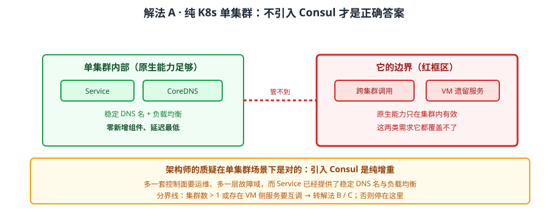
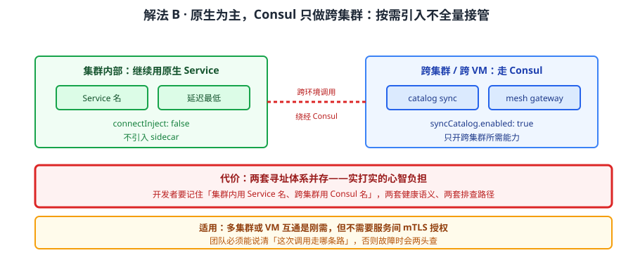
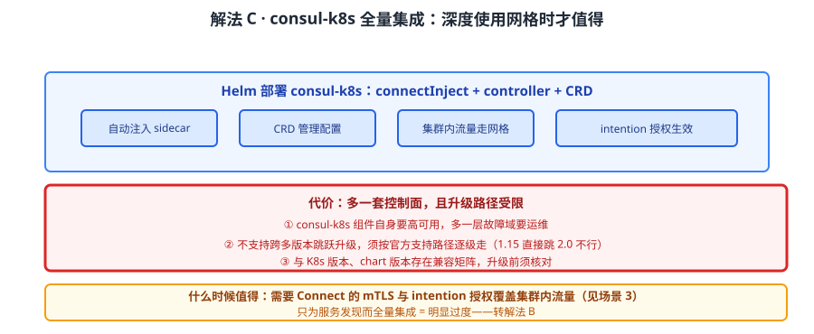
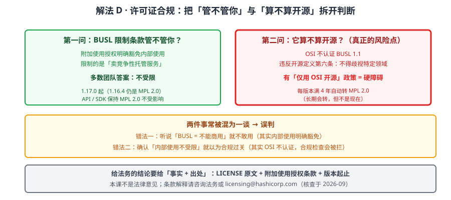

# 场景 8：要在 K8s 上落地，还要过法务（规模压力题）

**场景描述**：公司要把 Consul 引入 K8s 环境（12 个集群、约 300 个服务）。技术方案评审已过，卡在两处：① 架构师质疑"纯 K8s 为什么不用原生 Service，要引入 Consul"；② 法务看到"Consul 已从 MPL 2.0 转 BUSL 1.1"，问"这还算开源吗、我们会不会被告"。两个问题都没结论，项目停摆。

**🔒 先自己想 30 秒**：纯 K8s 场景引入 Consul，什么时候是增重、什么时候是真价值？判断的分界线是什么？再想许可证：BUSL 1.1 限制的是"卖竞争性托管服务"——如果你只是自己内部用，它约束你吗？那"它不是开源许可证"这件事又是另一回事吗？

<details><summary>💡 提示（分层 / 分维度想）</summary>

两个问题性质完全不同，别混着答：
1. **架构问题**——先问"有几个集群、有没有 VM、要不要跨集群调用"。纯单集群 vs 多集群 + 异构，结论完全相反。
2. **许可证问题**——把两件事分开：① BUSL 的**限制条款**管不管你（看你怎么用）；② 它**是不是开源**（看 OSI 认证）。前者多数团队不受限，后者在有合规政策的组织里是硬约束。

提示：课程实测/核实过几条硬事实——BUSL 1.1 从 **1.17.0** 起、附加使用授权明确豁免内部使用、每版本满 **4 年自动转 MPL 2.0**、**OSI 不认证** BUSL。别凭"听说"下结论。

</details>

<details><summary>📖 展开解法</summary>

### 解法一览（效果按"落地成本 / 长期风险"对比）

| 解法 | 效果（落地成本 / 长期风险） | 代价 | 适用边界 |
|------|--------------------------|------|---------|
| A · 纯 K8s 单集群：不引入 Consul | 最低（零新增）/ 最低 | 跨集群、VM 互通时无解 | 单集群、无 VM、不需要网格 |
| B · K8s 原生 + Consul 只做跨集群 | 中 / 低 | 两套体系并存，心智负担 | 多集群或 VM 互通是刚需 |
| C · consul-k8s 全量集成（Helm + CRD） | 高 / 中 | 多一套控制面；升级路径要跟官方 | 深度使用 Connect / 多集群 |
| D · 许可证规避：锁 1.16.4 / 换组件 / 买商业版 | 取决于选择 / 各不相同 | 锁版本失去安全更新；换组件迁移成本高 | 有"仅用 OSI 开源"合规政策 |

> A / B / C 是**架构选择**（递进增重），D 是**合规处置**——两者独立，可组合（如 B + D）。法务问题不会因为选了 A 就消失，也不会因为选了 C 就必然要处理。

### 各解法详解

#### 解法 A：纯 K8s 单集群——不引入 Consul 才是正确答案



读图：单集群内用原生 Service + Endpoints + CoreDNS 完成寻址，无额外组件。红框标的是**它的边界**——这套能力只在集群内有效：跨集群调用、VM 上的遗留服务，它都管不到。

```yaml
# 原生 Service：稳定的 DNS 名 + 负载均衡，单集群内已足够
apiVersion: v1
kind: Service
metadata:
  name: inventory
spec:
  selector:
    app: inventory
  ports:
    - port: 80
      targetPort: 8080
```

> **架构师的质疑在单集群场景下是对的**：Consul 的价值在**异构环境（VM + 容器）与多 DC**（见场景 5）。纯 K8s 场景下 Service 已经提供了稳定的 DNS 名与负载均衡，引入 Consul 是**纯增重**——多一套控制面要运维，多一层故障域。
> 判定分界线：**集群数 > 1，或存在 VM 侧服务要互调** → 转到解法 B / C。否则停在这里。

#### 解法 B：K8s 原生 + Consul 只做跨集群——按需要引入，不全量



读图：集群内部继续用原生 Service，只在"跨集群 / 跨 VM"这一层引入 Consul（含 catalog sync 与 mesh gateway）。红框标的是代价——**两套寻址体系并存**：开发者要记住"集群内用 Service 名、跨集群用 Consul 名"，这是实打实的心智负担。

```yaml
# consul-k8s：只开跨集群所需能力，不全量接管
syncCatalog:
  enabled: true     # 让 VM 侧能查到 K8s 服务（见场景 5 解法 C）
connectInject:
  enabled: false    # 暂不接管集群内流量，先不引入 sidecar
```

> 为什么它是多数团队的合理落点：**把 Consul 用在原生能力覆盖不到的地方**，而不是整体替换。集群内的调用继续走原生（延迟最低、组件最少），只有跨环境的那部分绕经 Consul。
> **代价要认**：两套名字、两套健康检查语义、两套排查路径。团队要能说清"这次调用走哪条路"，否则故障时会两头查。

#### 解法 C：consul-k8s 全量集成——深度使用网格能力时



读图：Helm 部署 consul-k8s，开启 connectInject 自动注入 sidecar、CRD 管理配置，集群内流量也走网格。红框标的是代价——**多一套控制面**：consul-k8s 组件自身要高可用、升级要跟官方路径（不支持跨多版本跳跃升级，须逐级走）。

```bash
# Helm 部署（示意，参数名以对应 chart 版本为准）
helm install consul hashicorp/consul \
  --set global.name=consul \
  --set connectInject.enabled=true \
  --set controller.enabled=true
```

> 什么时候值得全量：**需要 Connect 的服务间 mTLS 与 intention 授权**（见场景 3），且希望它覆盖集群内流量。如果只是为了服务发现，全量集成是明显过度。
> **运维代价（课 11 实测/核实）**：① 多一套控制面要运维且自身需高可用；② **不支持跨多版本跳跃升级**，须按官方支持路径逐级走，想从 1.15 直接跳 2.0 不行；③ 升级与 K8s 版本、chart 版本存在兼容矩阵。

#### 解法 D：许可证合规处置——把两件事分开判断



读图：把"BUSL 管不管你"与"它算不算开源"拆成两个独立判断。红框标的是**真正的风险点**——多数团队第一问的答案都是"不受限"，但第二问（OSI 不认证）在有"仅用 OSI 认证开源"政策的组织里是**硬障碍**，而且这两件事经常被混为一谈导致误判。

```bash
# 事实核对：回到 LICENSE 原文，不看二手解读
curl -s https://raw.githubusercontent.com/hashicorp/consul/main/LICENSE | head -40
# 关键字段：Licensed Work / Change Date / Change License / Additional Use Grant
```

| 判断 | 事实（课 11 核实，核查于 2026-09） | 结论 |
|------|----------------------------------|------|
| BUSL 从哪个版本起 | **Consul 1.17.0 及以后**（1.16.4 是最后一个 MPL 2.0 版本） | 用 1.16.x 则完全不受 BUSL 约束 |
| 内部使用受不受限 | 附加使用授权（Additional Use Grant）**明确豁免**——"组织内部使用不构成竞争性产品" | 多数团队不受限 |
| 限制的是什么 | 卖与 HashiCorp **竞争的托管服务** | 不做托管售卖就不触发 |
| 它算开源吗 | **OSI 不认证**（违反开源定义第六条：不得歧视特定领域） | 有合规政策的组织是硬约束 |
| 会变开源吗 | 每版本发布满 **4 年**自动转为 **MPL 2.0** | 长期会转，但不是现在 |
| API / SDK 呢 | **保持 MPL 2.0**，不受 BUSL 影响 | 客户端代码不受约束 |

> **三种处置**：① **锁 1.16.4**（完全绕开 BUSL）——代价是失去后续安全更新与 bug 修复，只适合短期过渡；② **照常用 + 走合规备案**（多数团队）——前提是组织没有"仅用 OSI 开源"的硬政策；③ **换组件或买商业版**——迁移成本高，只在合规硬约束时考虑。
> ⚠️ **本课不是法律意见**：条款的具体解释请咨询法务或 HashiCorp 官方（LICENSE 文件提供了 `licensing@hashicorp.com` 与 FAQ 入口）。许可证与所有权状态可能变化（IBM 收购 HashiCorp 于 2025-02 完成，**收购本身不改变许可证**），应用时请复核 LICENSE 原文。

### 替代路线（非本课程技术栈）

| 替代方案 | 思路 | 与本课程解法的差异 |
|---------|------|------------------|
| 纯 K8s 原生（Service + Ingress + Gateway API） | 不引入任何服务网格 | 零新增组件、延迟最低；跨集群与 VM 场景无解 |
| Istio | 独立服务网格，K8s 原生体验更好 | 网格能力更强（L7 授权）；但组件重，VM 接入成本高 |
| Linkerd | 轻量网格，mTLS 默认开启 | 更轻；授权策略能力弱于 Consul Connect 与 Istio |
| K8s 原生多集群（Submariner / Cilium ClusterMesh） | 专门解决跨集群网络与服务发现 | 专注跨集群；无 KV / 配置中心等 Consul 附加能力 |

### 推荐路径（递进，不是一次全上）

1. **先回答架构分界线**：单集群且无 VM → 停在解法 A，别引入；多集群或 VM 互通 → 进第 2 步
2. **再定引入范围**：只需跨集群互通 → 解法 B（不全量接管）；需要服务间 mTLS 授权 → 解法 C
3. **许可证问题单独走一遍两问判断**（解法 D 的表格），别与架构问题混答
4. **法务要结论时给"事实 + 出处"**：LICENSE 原文 + 附加使用授权条款 + 版本起止，而不是"网上说没问题"
5. **有"仅用 OSI 开源"硬政策** → 别绕，直接评估锁版本 / 换组件 / 商业版三选一

### 知识点挂钩

- 解法 A / B → 阶段 3 课 10《多维对比矩阵》、阶段 4 课 12《选型决策框架与场景结论》（异构环境是 Consul 相对 K8s 原生的最大差异点）
- 解法 C → 阶段 2 课 7《多数据中心与服务网格》、阶段 4 课 12（K8s 落地方式与缺口 #6 的消化）
- 解法 D → 阶段 4 课 11《许可证成本与风险》（BUSL 1.1 深度解读、附加使用授权、四年转 MPL 2.0、OSI 不认证、IBM 收购背景）
- 升级路径约束 → 阶段 4 课 11（不支持跨多版本跳跃升级，须逐级走）

### 什么情况下此方案不适用

- **单集群、无 VM、不需要网格** → 引入 Consul 是纯增重，停在解法 A
- **组织有"仅用 OSI 认证开源"硬政策且不能豁免** → BUSL 是硬约束，锁版本只是过渡，需评估换组件
- **团队无运维额外控制面的能力** → consul-k8s 自身也需高可用与升级维护，能力不足时先上解法 B
- **需要 L7 级授权（按方法 / 路径）** → intention 只到服务级，细粒度要转 Istio 或应用层（见场景 3）

### 做错会踩的坑

- 单集群也全量引入 → 多一套控制面与故障域，收益为零 → 关联 [08-实战经验.md](../08-实战经验.md) 故障模式 8「拿 Consul 跟 etcd/Nacos 做替换时功能对不上」
- 把"内部使用不受限"当成"它是开源" → 两件事，合规检查时会被拦 → 关联 [08-实战经验.md](../08-实战经验.md) 故障模式 9「许可证合规在上线前夜被叫停」
- K8s 多 namespace 同名服务被合并（CE 忽略 namespace）→ 关联 [09-排障速查手册.md](../09-排障速查手册.md) 症状 12「Consul CE 忽略 K8s namespace」
- 跨多版本跳跃升级 → 官方不支持，须逐级走 → 关联 [08-实战经验.md](../08-实战经验.md) 故障模式 9（升级路径相关）

</details>
