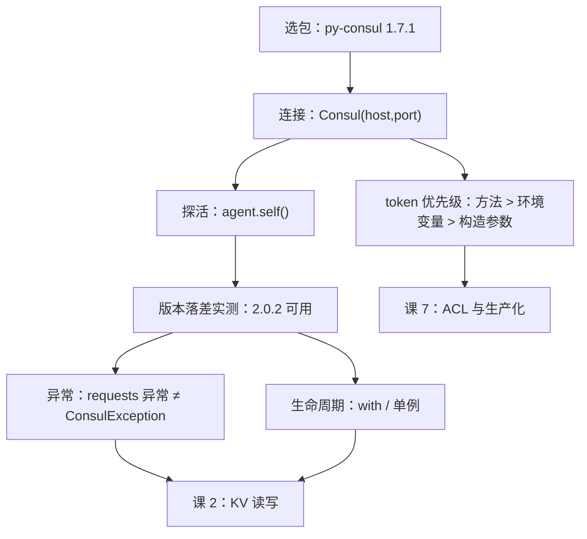

# 课 1：环境准备与客户端选型

> **本课定位**：环境准备课（轻量结构）。不装好包、连不上 agent，后面六课的代码一行都跑不起来。
> **前置提示**：只需知道 Consul 是个"能注册服务、能存 KV"的东西即可。若对 HTTP API 完全陌生，可先补[主线课 3「五分钟跑起来看一眼」](../../../stages/1-认识Consul/lessons/lesson-03-五分钟跑起来看一眼.md)。
> **实测环境**：WSL Ubuntu 24.04 / Python 3.12.3 / **py-consul 1.7.1** / **Consul 2.0.2**（dev 模式）— 本课全部输出均为本机真实运行结果，非文档转述。

---

## 第一幕：场景引入 —— 三个包，你装哪个？

架构师小林要在 Python 服务里读 Consul 的配置，顺手搜了一下：

```bash
pip install python-consul    # 搜到的第一篇中文博客这么写
pip install python-consul2   # 第二篇这么写
pip install py-consul        # 第三篇又换了个名
```

三个名字，装哪个？他随手装了第一个，`import consul` 成功了，跑起来也没报错——直到某天升级 Python，一堆诡异的兼容问题冒出来。他这才去查：**这个包 2018 年就没人维护了。**

这不是段子。这是 Consul Python 客户端领域**最普遍的一个坑**：三个包名高度相似、血缘同源、都能 `import consul`，但只有一个还活着。

---

## 第二幕：认知冲突 —— 名字像，命运完全不同

直觉上，"能装上、能 import、能跑通"应该等于"能用"。但这三个包里，**两个符合这个描述，却不该用**。

更反直觉的是：那个**唯一活跃维护**的包（`py-consul`），官方文档白纸黑字写着支持 **Consul 1.20–1.22**——而小林的环境是 **Consul 2.0.2**。

> **声明支持到 1.22，你的服务端是 2.0.2。差了一整个大版本。它到底能不能用？**

这个问题，看文档是回答不了的。本课会真跑一遍回答它。

---

## 第三幕：层层揭示

### 知识点 1：三个同宗包的血缘与现状

| 包 | 维护方 | 最新状态 | 结论 |
|----|--------|---------|------|
| `py-consul` | Criteo（fork 自 cablehead） | **1.7.1，2025-11-24**，活跃维护 | ✅ **用这个** |
| `python-consul` | cablehead（原作者） | 2018 年起无维护 | ❌ 不用 |
| `python-consul2` | poppyred | 0.1.5，最后提交 2022-02-16 | ❌ 不用 |

**一句话定义**：三者是同一个库在不同时期的三个名字，`py-consul` 是目前唯一还在更新的分支。

**直觉建立**：想象一条河改道了——原来的河道（`python-consul`）干了，有人挖了条支流（`python-consul2`）也停了，现在水都在新河道（`py-consul`）里流。**河名都带"consul"，但只有一条有水。**

**核心原理（为什么这么难分辨）**：三个包**导入名完全相同**，都是 `import consul`。这意味着：

- 装错了**不会报错**，代码照样跑
- `pip list` 里看到的名字和 `import` 的名字对不上，排查时极易混淆
- 中文技术博客大量停留在 2018–2022 年，抄到的往往是废弃包的写法

**示例演示（怎么确认自己装对了）**：

```bash
python3 -m pip show py-consul | head -3
```

实测输出：

```
Name: py-consul
Version: 1.7.1
Summary: Python client for Consul (python-consul fork)
```

> 注意 `Summary` 里的 `python-consul fork` —— 这就是血缘关系的直接证据。

**常见误区**：

- ❌ "能 import 就是对的" → 三个包都能 import
- ❌ "博客里写的就是官方的" → 博客写于 2018 年，那时 `python-consul` 确实还是主流
- ✅ **判断标准只有一个**：看 PyPI 上的**最后发布日期**，不看文章数量

**一句话记住**：`py-consul` 是那条还有水的河；判断依据是发布日期，不是导入名。

---

### 知识点 2：安装与连接 —— `Consul()` 到底能传什么

**一句话定义**：`consul.Consul(...)` 是入口，它的参数决定了客户端怎么找到 agent。

**直觉建立**：把它想成**打电话**——`host` + `port` 是号码，`scheme` 是"用座机还是加密线路"，`token` 是"报上你的工号"。

**核心原理（真实签名，源码核实）**：

```python
Consul.__init__(self, host, port, token, scheme, consistency, dc, verify, cert)
```

实测（`inspect.signature`）：

```
Consul.__init__ params: ['self', 'host', 'port', 'token', 'scheme', 'consistency', 'dc', 'verify', 'cert']
```

> ⚠️ **没有 `timeout` 构造参数。** 这是最容易记错的一点——稍后知识点 5 讲超时该怎么配。

**示例演示（最小连接）**：

```python
import consul
c = consul.Consul(host="127.0.0.1", port=8500)
```

默认值也实测确认过：不传 `host` 时是 `127.0.0.1`，不传 `port` 时是 `8500`。所以 `consul.Consul()` 等价于上面那行。

**环境变量（四个都支持，实测）**：

| 环境变量 | 作用 | 实测结果 |
|---------|------|---------|
| `CONSUL_HTTP_ADDR` | `<host>:<port>` 或 `scheme://host:port` | ✅ 生效（设 `127.0.0.1:8500` 后 `Consul()` 无参即可连） |
| `CONSUL_HTTP_TOKEN` | ACL token | ✅ 生效（见知识点 6 的**重要更正**） |
| `CONSUL_HTTP_SSL` | 值为 `true` 时走 https | ✅ 生效 |
| `CONSUL_HTTP_SSL_VERIFY` | 是否校验证书，默认 `true` | ✅ 生效 |

实测：

```python
os.environ["CONSUL_HTTP_ADDR"] = "127.0.0.1:8500"
c4 = consul.Consul()          # 一个参数都不传
c4.agent.self()["Config"]["Version"]   # -> '2.0.2'
```

**常见误区**：

- ❌ `Consul(timeout=5)` → `TypeError`，构造参数里没有它
- ❌ 以为 `CONSUL_HTTP_ADDR` 能覆盖显式传入的 `host` → **不能**。源码里只有 `host is None and port is None` 时才读环境变量

**一句话记住**：参数是"显式优先"，环境变量只在你**没说话**时兜底。

---

### 知识点 3：第一个请求 —— 用 `agent.self()` 探活

**一句话定义**：`c.agent.self()` 返回当前 agent 的完整自述，是**最合适的连通性探针**。

**直觉建立**：相当于打电话过去问"你是谁？"——对方报出工号、部门、版本，说明线路通了。

**核心原理**：它打的是 `/v1/agent/self`，返回一个大字典。实测顶层键有 7 个：

```
top keys: ['Config', 'DebugConfig', 'Coord', 'Member', 'Stats', 'Meta', 'xDS']
```

**示例演示（本课最重要的一段代码）**：

```python
import consul

c = consul.Consul(host="127.0.0.1", port=8500)
s = c.agent.self()
print(s["Config"]["Version"])   # 服务端版本
print(s["Config"]["Server"])    # 是不是 server 节点
print(s["Config"]["Datacenter"])# 数据中心名
print(s["Member"]["Name"])      # 节点名
```

实测输出：

```
2.0.2
True
dc1
VWYPGWU-PC5
```

**为什么用它探活，而不是 `kv.get`**：

- `agent.self()` **不需要任何权限**，ACL 开着也能调
- 它同时告诉你**版本**——正好用来回答本课开头的那个悬案
- 不写入任何数据，无副作用

**常见误区**：

- ❌ 用 `kv.get("some/key")` 探活 → key 不存在时返回 `(index, None)`，**不报错**，你以为成功了其实没验证到连通性
- ❌ 只看"没抛异常"就认为连上了 → 要**读返回值**才算数

**一句话记住**：探活用 `agent.self()`，它不写数据、不要权限、还能报版本。

---

### 知识点 4：那个悬案 —— 声明支持 1.22，实际跑在 2.0.2 上

**这是本课最硬的一个结论。**

**问题**：py-consul 1.7.1 的 README 声明支持 **Consul 1.20–1.22**，本机是 **Consul 2.0.2**。差一个大版本。

**实测方法**：直接在 2.0.2 上把后面六课要用到的 API 全跑一遍。

```python
import consul
c = consul.Consul(host="127.0.0.1", port=8500)

# 1. 探活
s = c.agent.self()
print("SELF_OK Version:", s["Config"]["Version"], "Server:", s["Config"]["Server"])

# 2. KV 读写往返
c.kv.put("lesson1/probe", "hello-consul-2.0.2")
idx, data = c.kv.get("lesson1/probe")
print("KV_GET idx:", idx, "value:", data["Value"])

# 3. 服务与健康
print("AGENT_SERVICES:", list(c.agent.services().keys()))
print("HEALTH_NODES:", len(c.health.service("consul")[1]))
```

实测输出（**原文照抄**）：

```
SELF_OK Version: 2.0.2 Server: True DC: dc1
KV_PUT: True
KV_GET idx: 19 value: b'hello-consul-2.0.2'
AGENT_SERVICES: []
HEALTH_NODES: 1
```

**13 个子 API 对象全部实例化成功**（实测）：

```
c.kv -> KV        c.agent -> Agent      c.health -> Health
c.catalog->Catalog c.session->Session    c.acl -> ACL
c.txn -> Txn      c.status -> Status    c.query -> Query
c.connect->Connect c.operator->Operator  c.coordinate->Coordinate
c.event -> Event
```

**结论**：

> ✅ **py-consul 1.7.1 在 Consul 2.0.2 上可用。** KV 读写往返、agent 自述、健康检查全部正常。

**但要诚实标注边界**：

- 本次验证覆盖的是**读写入口 + 服务发现**这两条主干，对应课 2–5
- **未验证**：ACL（课 7）、Session 锁（课 6）、TLS——这些课会在各自课上实测
- ⚠️ **"能用"不等于"所有端点都对齐 2.0.2"**。写每课前仍需查[端点实现状态表](../overview.md#端点实现状态备课前必查--2026-09-22-核实)

**这个结论的价值**：它说明**"声明支持范围"和"实际能不能用"是两件事**。SDK 声明的支持范围通常保守（只测到自己发版时存在的服务端版本），但 Consul 的 HTTP API 在 2.x 保持了向后兼容，所以旧客户端仍能工作。

**常见误区**：

- ❌ "声明不支持就是不能用" → 实测推翻
- ❌ "能用就等于全部功能都对齐" → 端点实现状态表里还有 ❌ 未实现的
- ✅ 正确姿势：**先测再判断，别停在文档字面**

**一句话记住**：文档说的是"我测过什么"，实测才能回答"我能用什么"。

---

### 知识点 5：连不上怎么办 —— 异常类型与四类原因

**一句话定义**：连不上时 `py-consul` 抛的是 **`requests` 层的异常**，不是它自己的异常类型。

**直觉建立**：`py-consul` 是**薄封装**——网络这一层它直接交给 `requests` 库，所以网络问题会以 `requests` 的方言报出来。

**核心原理（实测）**：

```python
bad = consul.Consul(host="127.0.0.1", port=8599)   # 不存在的端口
bad.agent.self()
```

实测：

```
type: ConnectionError | mro: ['ConnectionError', 'RequestException', 'OSError', 'Exception']
is ConsulException: False
```

> ❗ **关键发现**：`ConnectionError` **不是** `ConsulException` 的子类。
> 如果你写 `except consul.ConsulException:` 来兜底，**网络故障会漏过去**。

**四类原因与识别方法**：

| 原因 | 症状 | 怎么确认 |
|------|------|---------|
| agent 没起 | `ConnectionError: Max retries` | `consul members` 或 curl 8500 |
| 端口错了 | 同上 | `c.agent.self()` 换个端口试 |
| 主机不可达 | `ConnectionError`（超时更久） | `ping` / `telnet host port` |
| scheme 错了（http 连 https） | 连接被拒或返回非 JSON | 检查 `CONSUL_HTTP_SSL` 与 agent 的 TLS 配置 |

实测的报错原文（照抄）：

```
ConnectionError: HTTPConnectionPool(host='127.0.0.1', port=8599): Max retries
```

**示例演示（正确的兜底写法）**：

```python
import consul
from requests.exceptions import ConnectionError as ReqConnError

c = consul.Consul(host="127.0.0.1", port=8500)
try:
    s = c.agent.self()
    print("connected, version:", s["Config"]["Version"])
except (consul.ConsulException, ReqConnError) as e:
    print("connect failed:", type(e).__name__, e)
```

**常见误区**：

- ❌ 只 `except consul.ConsulException` → 网络异常漏网（**这是最危险的**）
- ❌ 把 `ConnectionError` 当业务逻辑错误处理 → 它是基础设施问题，该告警不该重试业务
- ✅ 网络异常和 Consul 业务异常**分开 catch**

**一句话记住**：`py-consul` 的异常分两族——`requests` 的（网络）和 `ConsulException` 的（业务），兜底要都写。

---

### 知识点 6：连接生命周期 —— 它是上下文管理器

**一句话定义**：`Consul` 对象实现了 `__enter__` / `__exit__`，可以用 `with` 自动关连接。

**直觉建立**：像打开文件——用完要关。`with` 帮你记得关。

**核心原理（实测）**：

```
HAS_ENTER: True HAS_EXIT: True
```

**示例演示**：

```python
import consul

with consul.Consul(host="127.0.0.1", port=8500) as c:
    s = c.agent.self()
    print("inside with, version:", s["Config"]["Version"])
# 出 with 后 http.close() 已被自动调用
```

**为什么重要**：`py-consul` 内部持有一个 `requests.Session`（连接池）。不关的话：

- 短生命周期脚本 → 进程退出时系统回收，影响不大
- 长生命周期服务 → **连接泄漏**，最终耗尽文件描述符

**生产建议**：

- ✅ 应用里用**单例 client**，不要每请求 `Consul()` 一次（建连接是有成本的）
- ✅ 脚本里用 `with`，或者进程结束前显式 `c.http.close()`
- ❌ 循环里反复 `Consul()` —— 课 3 会看到这是阻塞查询的经典错误

**常见误区**：

- ❌ "Python 有 GC，不用管" → GC 不保证及时释放 socket
- ❌ 每次请求新建 client → 连接池复用完全失效

**一句话记住**：长跑服务用单例，短脚本用 `with`。

---

### 知识点 7：token 优先级 —— 一条实测推翻的"常识"

> ⚠️ **本知识点是对 overview 中原推断的更正。** 原推断来自源码阅读，实测结果与之相反，以实测为准。

**一句话定义**：构造参数 `token` 和环境变量 `CONSUL_HTTP_TOKEN` **同时存在时，环境变量赢**。

**直觉建立（反直觉，所以要看实测）**：通常我们以为"显式传参 > 环境变量"。但这里源码写的是：

```python
self.token = os.getenv("CONSUL_HTTP_TOKEN", token)
```

`getenv(key, default)` 的语义是：**环境变量存在就用它，不存在才用 `token` 这个默认值**。所以环境变量优先级更高。

**核心原理（实测四组对照）**：

| 场景 | 代码 | `c.token` 实测值 |
|------|------|-----------------|
| 都没有 | `Consul(host, port)` | `None` |
| 只有构造参数 | `Consul(host, port, token="ctor-token")` | `'ctor-token'` |
| 只有环境变量 | 设 `CONSUL_HTTP_TOKEN=env-token`，`Consul(host, port)` | `'env-token'` |
| **两者都有** | 环境变量 `env-token` + 构造参数 `ctor-token` | **`'env-token'`** ← 环境变量赢 |

实测原文：

```
no-env no-ctor token: None
no-env ctor-token   : 'ctor-token'
env only            : 'env-token'
env + ctor          : 'env-token'
```

**第三层：方法级 token 仍然最高**（源码核实）：

```python
def prepare_headers(self, token=None):
    headers = {}
    if token or self.token:
        headers["X-Consul-Token"] = token or self.token
    return headers
```

`token or self.token` —— 方法调用时传入的 `token` 赢过 `self.token`。

**完整优先级（实测 + 源码双重确认）**：

```
方法级 token  >  环境变量 CONSUL_HTTP_TOKEN  >  构造参数 token  >  None
```

**示例演示**：

```python
import os, consul

os.environ["CONSUL_HTTP_TOKEN"] = "env-token"
c = consul.Consul(host="127.0.0.1", port=8500, token="ctor-token")
print(c.token)              # -> 'env-token'  环境变量赢
print(c.kv.get("k", token="method-token"))  # 这次请求用 method-token
```

**常见误区**：

- ❌ "构造参数优先级最高" → **实测推翻**，环境变量更高
- ❌ 在代码里写死 `token="xxx"` 以为能覆盖环境 → 覆盖不了
- ✅ 调试 token 问题时，**先查环境变量**：`echo $CONSUL_HTTP_TOKEN`

**一句话记住**：环境变量 > 构造参数 > 无；方法级参数又压过前两者。

> 📌 **本条更正记录**：overview 中「三个写课前必须知道的源码事实」第 3 条原写"构造参数 token 覆盖环境变量"，系**源码阅读时的误推**（把 `getenv(k, default)` 的默认值语义理解反了）。本课以四组实测对照推翻该推断，正确顺序如上。

---

## 第四幕：实操验证

下面这段是**完整可跑通**的最小验证脚本，把本课所有知识点串起来。

```python
#!/usr/bin/env python3
"""课 1 综合验证：装对包 → 连上 → 探活 → 读版本 → 异常处理"""
import os
import consul
from requests.exceptions import ConnectionError as ReqConnError

# 清掉环境变量，避免干扰本次验证
for k in ("CONSUL_HTTP_ADDR", "CONSUL_HTTP_TOKEN",
          "CONSUL_HTTP_SSL", "CONSUL_HTTP_SSL_VERIFY"):
    os.environ.pop(k, None)

print("py-consul 版本:", consul.__version__)

# 1) 构造参数核实：没有 timeout
import inspect
print("构造参数:", list(inspect.signature(consul.Consul.__init__).parameters))

# 2) 连通 + 探活（用 with 管理生命周期）
with consul.Consul(host="127.0.0.1", port=8500) as c:
    s = c.agent.self()
    print(f"已连接: version={s['Config']['Version']} "
          f"server={s['Config']['Server']} dc={s['Config']['Datacenter']}")

    # 3) 版本落差实测：声明 1.20-1.22，实际 2.0.2
    print("KV 写入:", c.kv.put("lesson1/probe", "hello-consul-2.0.2"))
    idx, data = c.kv.get("lesson1/probe")
    print(f"KV 读回: idx={idx} value={data['Value']}")

    # 4) 清理
    c.kv.delete("lesson1/probe")
    print("清理后:", c.kv.get("lesson1/probe"))

# 5) 连不上：异常不是 ConsulException
try:
    consul.Consul(host="127.0.0.1", port=8599).agent.self()
except Exception as e:
    print(f"连不上: {type(e).__name__}, 是ConsulException吗: "
          f"{isinstance(e, consul.ConsulException)}")

# 6) token 优先级四组对照
os.environ["CONSUL_HTTP_TOKEN"] = "env-token"
print("env+ctor ->", consul.Consul(port=8500, token="ctor-token").token)
os.environ.pop("CONSUL_HTTP_TOKEN")
```

**实测输出（本机真实运行）**：

```
py-consul 版本: 1.7.1
构造参数: ['self', 'host', 'port', 'token', 'scheme', 'consistency', 'dc', 'verify', 'cert']
已连接: version=2.0.2 server=True dc=dc1
KV 写入: True
KV 读回: idx=19 value=b'hello-consul-2.0.2'
清理后: ('24', None)
连不上: ConnectionError, 是ConsulException吗: False
env+ctor -> env-token
```

> 💡 **注意 `KV 读回` 那行的 `b'...'`** —— `Value` 是 **bytes 不是 str**。这是个伏笔，**课 2 会专门讲**它为什么这样、怎么处理。

**环境准备命令**（若从零开始）：

```bash
# 1. 装包（本课唯一的环境改动，需用户授权）
python3 -m pip install py-consul

# 2. 起 Consul（dev 模式，仅学习用，不可用于生产）
consul agent -dev -client=0.0.0.0 &

# 3. 确认起来了
curl -s http://127.0.0.1:8500/v1/status/leader
# 应返回: "127.0.0.1:8300"
```

---

## 第五幕：体系收束

### 本课知识地图



### 速查卡

| 我要… | 怎么做 |
|-------|--------|
| 确认装对了包 | `pip show py-consul` 看 Version ≥ 1.7.1 |
| 连本地 agent | `consul.Consul()`（默认 127.0.0.1:8500） |
| 探活并读版本 | `c.agent.self()["Config"]["Version"]` |
| 用环境变量配置 | `CONSUL_HTTP_ADDR` / `_TOKEN` / `_SSL` / `_SSL_VERIFY` |
| 安全兜底异常 | 同时 catch `ConsulException` 和 `requests` 的 `ConnectionError` |
| 管理连接 | 长跑服务用单例；脚本用 `with` |
| 排查 token 不生效 | 先 `echo $CONSUL_HTTP_TOKEN` |

### 三条元结论

1. **名字相似不等于同一个东西**。三个 Consul Python 包导入名都一样，判断依据是**发布日期**而非能否 import。
2. **声明支持范围 ≠ 实际可用性**。py-consul 声明支持到 1.22，实测在 2.0.2 上完全可用——因为 HTTP API 向后兼容。但"能用"不等于"所有端点都对齐"，仍需按端点状态表逐课验证。
3. **薄封装意味着两套异常**。`py-consul` 把网络层交给 `requests`，所以只 catch `ConsulException` 会漏掉所有网络故障——这是生产环境最危险的漏网之鱼。

### 本课更正记录

| 项 | overview 原推断 | 本课实测 | 处理 |
|----|----------------|---------|------|
| token 优先级 | "构造参数 token 覆盖环境变量" | **环境变量覆盖构造参数** | ✅ 已在知识点 7 更正，overview 已同步 |
| `Consul()` 参数 | 无 timeout | 确认无 timeout | ✅ 一致 |

### 小测

**1.（单选）** 三个 Consul Python 包中，目前应该用的是：
- A. `python-consul`
- B. `python-consul2`
- C. `py-consul`
- D. 三个都可以，随便选

<details><summary>答案</summary>

**C**。`py-consul` 是唯一活跃维护的（1.7.1，2025-11-24）。A 自 2018 年停更，B 停在 2022 年。三个包 `import consul` 都成功，所以"能装上"不是判断依据。

</details>

**2.（单选）** `c.agent.self()` 返回的 `Value` 为什么本课没提？以下关于探活的说法正确的是：
- A. 应该用 `kv.get("any/key")` 探活，因为它更轻量
- B. `agent.self()` 不需要权限、不写数据、还能读版本，是更合适的探针
- C. 只要不抛异常就说明连上了
- D. `agent.self()` 需要 ACL token 才能调用

<details><summary>答案</summary>

**B**。A 错在 key 不存在时返回 `(index, None)` 且不报错，验证不到连通性；C 错在必须读返回值；D 错在 `agent.self()` 无需权限。

</details>

**3.（多选）** 关于异常，以下正确的是：
- A. `ConnectionError` 是 `ConsulException` 的子类
- B. 只写 `except consul.ConsulException` 会漏掉网络故障
- C. 应该同时 catch `requests` 的异常和 `ConsulException`
- D. 网络异常应该重试业务逻辑

<details><summary>答案</summary>

**B、C**。A 错——实测 `is ConsulException: False`；D 错——网络异常是基础设施问题，该告警而非重试业务。

</details>

**4.（单选）** 环境变量 `CONSUL_HTTP_TOKEN=env` 与 `Consul(token="ctor")` 同时存在，`c.token` 是：
- A. `ctor`
- B. `env`
- C. `None`
- D. 报错

<details><summary>答案</summary>

**B**。源码 `os.getenv("CONSUL_HTTP_TOKEN", token)` 的语义是"环境变量存在就用它"，实测四组对照确认 `env + ctor -> env-token`。这是本课推翻 overview 原推断的一条。

</details>

---

## 课尾导航

**⬅️ 上一课**：（本课为子教程开篇）

**➡️ 下一课**：[课 2：KV 读写与配置中心用法](./lesson-02-KV读写与配置中心用法.md) —— 本课埋的伏笔 `b'hello-consul-2.0.2'`（bytes）会在这里解开

**🏠 返回**：[py-consul 使用 · 子教程目录](../overview.md) ｜ [Consul 课程目录](../../../02-课程目录.md)

**🔗 相关**：
- [主线场景 01 · 多实例选主与防重跑](../../../场景解法库/场景-01-多实例选主与防重跑.md)（本教程的由来——那一行 `consul.Consul(...)`）
- [主线课 3 · 五分钟跑起来看一眼](../../../stages/1-认识Consul/lessons/lesson-03-五分钟跑起来看一眼.md)（dev 模式）
- [网页索引 · py-consul](../../../web-index/py-consul/index.md)

---

> ✅ **本课实测声明**：全部输出取自 WSL Ubuntu 24.04 / Python 3.12.3 / py-consul 1.7.1 / Consul 2.0.2 dev 模式，于 2026-09-22 真实运行。未经实测的内容均已标注。
