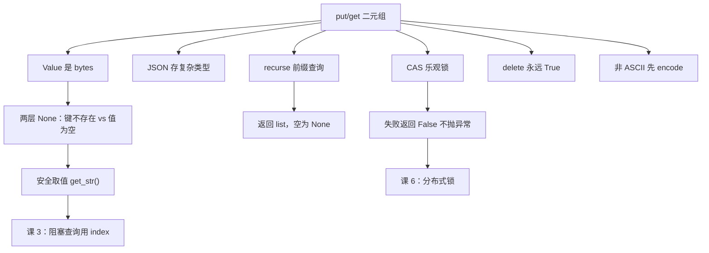

# 课 2：KV 读写与配置中心用法

> **本课定位**：课 1 的伏笔在这里解开——为什么读回来的是 `b'hello-consul-2.0.2'` 而不是字符串。
> **前置**：[课 1 环境准备与客户端选型](./lesson-01-环境准备与客户端选型.md)（会连、会探活）。KV 的服务端机制见[主线课 6](../../../stages/2-核心能力拆解/lessons/lesson-06-KV存储与配置管理.md)，本课只讲**客户端这一侧怎么调对**。
> **实测环境**：WSL Ubuntu 24.04 / Python 3.12.3 / **py-consul 1.7.1** / **Consul 2.0.2**（dev 模式）。本课全部输出为真实运行结果。

---

## 第一幕：场景引入 —— 一个 `AttributeError` 引发的午休中断

小林按课 1 连上了 Consul，写了个读配置的函数：

```python
def get_config(c, key):
    _, data = c.kv.get(key)
    return data["Value"].decode("utf-8")

print(get_config(c, "app/name"))
```

跑了三天都好好的。第四天，运维在 Consul UI 上把 `app/name` 的值**清空**了（改成空字符串）。然后这个函数炸了：

```
AttributeError: 'NoneType' object has no attribute 'decode'
```

小林懵了：**"我明明判断过 `data` 不是 None 啊？"**

他确实判断过——但 `data` 不是 `None`，`data["Value"]` 才是。这是 py-consul KV API 最反直觉的一个设计：**"键不存在"和"值为空"返回的东西不一样，但取 `Value` 都会得到 `None`。**

---

## 第二幕：认知冲突 —— 两个"空"，长得完全不一样

直觉上我们会以为：

- 键不存在 → `data is None`
- 值为空 → `data["Value"] == b""`

**两个都错了。** 实测结果是：

| 情况 | `data` | `data["Value"]` |
|------|--------|-----------------|
| 键不存在 | `None` | （TypeError，因为 data 是 None） |
| 值为空字符串 | **完整 dict** | **`None`** |

注意第二行：值为空时 `data` **不是 None**，是个完整的字典（`Key`/`Flags`/`CreateIndex`/`ModifyIndex` 全在），只有 `Value` 字段是 `None`。

所以小林的判断 `if data is not None` **通过了**，然后在 `.decode()` 这步炸了。

---

## 第三幕：层层揭示

### 知识点 1：读写基本型 —— `put` / `get` 与那个二元组

**一句话定义**：`kv.put(key, value)` 写入，`kv.get(key)` 返回 `(index, data)` 二元组。

**直觉建立**：`get` 返回的不只是值，还有一个"版本号"（index）。这个 index 课 3 讲阻塞查询时会变成主角——**先记住它在第一位**。

**核心原理**：Consul 的 KV 是 **base64 编码存储**的。HTTP API 返回的 `Value` 是 base64 字符串，`py-consul` 帮你解码成了 **bytes**，但**不会**再帮你变成 str。

**示例演示**：

```python
import consul
c = consul.Consul(host="127.0.0.1", port=8500)

c.kv.put("lesson2/name", "alice")
idx, data = c.kv.get("lesson2/name")

print("idx:", idx)
print("type(data):", type(data).__name__)      # dict
print("data keys:", list(data.keys()))
print("Value:", repr(data["Value"]))            # b'alice'
print("type:", type(data["Value"]).__name__)    # bytes
print("decode:", data["Value"].decode("utf-8"))
```

实测输出：

```
idx: 67 | type(data): dict
data keys: ['LockIndex', 'Key', 'Flags', 'Value', 'CreateIndex', 'ModifyIndex']
Value: b'alice' | type: bytes
decode: alice
```

**返回的 dict 有 6 个字段**（`LockIndex` 在课 6 讲锁时才会用到）：

- `Key` — 键名（str）
- `Value` — 值（**bytes**）
- `Flags` — 客户端自定义标志（int，课 2 后面讲）
- `CreateIndex` / `ModifyIndex` — 创建/最后修改的 Raft index
- `LockIndex` — 锁相关，课 6 讲

**常见误区**：

- ❌ 以为 `get` 直接返回值 → 它返回**二元组**，忘了接 index 会得到整个 tuple
- ❌ 拿 `Value` 当 str 用 → `b'alice' == 'alice'` 是 **`False`**，字符串比较静默失败
- ✅ **必须 decode**：`data["Value"].decode("utf-8")`

**一句话记住**：`get` 给二元组，`Value` 是 bytes，用之前先 decode。

---

### 知识点 2：`data` 为 `None` 的语义（本课最重要）

**一句话定义**：`data is None` 表示**键不存在**；`data["Value"] is None` 表示**键存在但值为空**。

**直觉建立**：把它想成查字典——"这个单词没收录"（`data is None`）和"这个单词收录了但释义是空白"（`Value is None`），是两件不同的事。

**核心原理（实测）**：

```python
# 情况一：键不存在
idx, data = c.kv.get("lesson2/not-exist")
print("data:", data)          # None

# 情况二：值为空字符串
c.kv.put("lesson2/empty", "")
idx, data = c.kv.get("lesson2/empty")
print("data:", data)
```

实测输出：

```
# 情况一
idx: 67 | data: None | type: NoneType

# 情况二
data: {'LockIndex': 0, 'Key': 'lesson2/empty', 'Flags': 0,
       'Value': None, 'CreateIndex': 68, 'ModifyIndex': 68}
```

> 💡 **`put("key", "")` 真的会创建一个键。** 用 `keys=True` 能查到它在列表里（实测 `empty 在列表里吗: True`）。

**示例演示（正确的取值写法）**：

```python
def get_str(c, key, default=None):
    """安全取值：键不存在、值为空都返回 default"""
    _, data = c.kv.get(key)
    if data is None or data["Value"] is None:
        return default
    return data["Value"].decode("utf-8")

print(repr(get_str(c, "lesson2/name", "<missing>")))    # 'alice'
print(repr(get_str(c, "lesson2/nope", "<missing>")))    # '<missing>'
print(repr(get_str(c, "lesson2/empty", "<missing>")))   # '<missing>'
```

实测输出：

```
存在的键 : 'alice'
不存在的 : '<missing>'
空值     : '<missing>'
```

**常见误区（三个，第一个最致命）**：

- ❌ **只判断 `data is None`** → 值为空时 `data` 不是 None，`.decode()` 炸 `AttributeError`
- ❌ 以为空值会得到 `b""` → 实测是 `None`
- ❌ 用 `if not data` 判断 → 空字典/None 混在一起，语义丢失
- ✅ 正确姿势：**两层判断** `data is None or data["Value"] is None`

**一句话记住**：两个 None 分别在两层——`data` 管"键在不在"，`Value` 管"值空不空"。

---

### 知识点 3：存 JSON / 数字 —— 一切皆字符串

**一句话定义**：Consul KV 只存字节流，没有类型概念；复杂类型要自己序列化。

**直觉建立**：KV 是个"只认字节的仓库"——你给它什么它存什么，但**不会记住你原来是什么类型**。

**核心原理（实测）**：

```python
import json
cfg = {"db_host": "127.0.0.1", "db_port": 3306, "debug": True}
c.kv.put("app/config", json.dumps(cfg))

_, data = c.kv.get("app/config")
loaded = json.loads(data["Value"].decode("utf-8"))
print(loaded, "| port 类型:", type(loaded["db_port"]).__name__)
```

实测输出：

```
写回读: {'db_host': '127.0.0.1', 'db_port': 3306, 'debug': True} | port 类型: int
```

> ✅ JSON 能保住类型（`db_port` 回来还是 `int`），因为类型信息编码在 JSON 文本里。

**直接存 int 会怎样（实测）**：

```python
c.kv.put("lesson2/intv", 8080)
_, data = c.kv.get("lesson2/intv")
print(repr(data["Value"]))
```

实测：`b'8080'` —— `py-consul` 内部把它转成了字符串。所以：

- 存进去的是 `8080`（int）
- 读出来的是 `b'8080'`（bytes）
- **类型信息没了**，你得自己 `int(data["Value"])`

**常见误区**：

- ❌ 以为 `put(key, 8080)` 读回来还是 int → 是 `b'8080'`
- ❌ 直接 `json.loads(data["Value"])` → **TypeError**，因为 `json.loads` 要 str 不要 bytes（Python 3.6+ 其实支持 bytes，但显式 decode 更清晰）
- ✅ 统一约定：**复杂配置一律 JSON 序列化**，读回 `json.loads(decode(...))`

**一句话记住**：KV 无类型，复杂值走 JSON；读回记得 decode 再 loads。

---

### 知识点 4：前缀与递归查询

**一句话定义**：`recurse=True` 按前缀取出整棵子树，返回 **list**；`keys=True` 只返回键名列表。

**直觉建立**：Consul 的 KV 是**平铺的键空间**，没有真正的"目录"。"前缀"只是按字符串匹配的约定。

**核心原理（实测）**：

```python
for k, v in [("lesson2/app/db/host", "127.0.0.1"),
             ("lesson2/app/db/port", "3306"),
             ("lesson2/app/cache/ttl", "60")]:
    c.kv.put(k, v)

# 一、取整个子树
idx, data = c.kv.get("lesson2/app", recurse=True)
print("count:", len(data))
for item in data:
    print("  ", item["Key"], "=", item["Value"])

# 二、只要键名
idx, keys = c.kv.get("lesson2/app", recurse=True, keys=True)
print("keys:", keys)
```

实测输出：

```
recurse count: 3
   lesson2/app/cache/ttl = b'60'
   lesson2/app/db/host = b'127.0.0.1'
   lesson2/app/db/port = b'3306'
keys: ['lesson2/app/cache/ttl', 'lesson2/app/db/host', 'lesson2/app/db/port']
```

> ⚠️ **返回值类型不一样**：`recurse=True` 返回 **list of dict**，普通 `get` 返回 **单个 dict**。写代码时别搞混。

**排序**：实测按 key 的字典序返回（`['1','A','a','b','c']`）。

**平铺键空间的经典坑（实测）**：

```python
c.kv.put("web", "top-level-value")
c.kv.put("web/api-gateway", "child-value")

_, d1 = c.kv.get("web")
print("get('web'):", d1["Value"])        # b'top-level-value'

_, d2 = c.kv.get("web", recurse=True)
print("recurse:", [(x["Key"], x["Value"]) for x in d2])
```

实测输出：

```
get('web') -> b'top-level-value'
recurse: [('web', b'top-level-value'), ('web/api-gateway', b'child-value')]
```

> 💡 **`web` 这个键和 `web/` 这个"目录"可以同时存在**——因为根本没有目录，它们只是两个不同的字符串。这和文件系统的直觉完全不同。

**前缀不存在时**：返回 `None`（和单键一样），不是空 list。实测 `data: None | type: NoneType`。

**常见误区**：

- ❌ 以为空结果返回 `[]` → 是 `None`，直接 `len()` 会炸
- ❌ 以为 `recurse` 返回 dict → 是 **list**
- ❌ 用文件系统思维理解 KV → 键和"目录"可以同名共存
- ✅ 遍历前先判 `if data is None: return []`

**一句话记住**：`recurse` 给 list、空给 None、键与"目录"可同名。

---

### 知识点 5：写的安全语义 —— CAS 乐观锁

**一句话定义**：`cas=<ModifyIndex>` 让写入变成"只有当我上次看到的版本没变时才写"。

**直觉建立**：像多人同时编辑文档时的"基于版本 N 提交"——如果你看的不是最新版，提交会被拒绝，而不是覆盖别人的改动。

**核心原理（实测）**：

```python
c.kv.put("lesson2/counter", "0")
_, d = c.kv.get("lesson2/counter")
old_index = d["ModifyIndex"]

# 一、用正确的 index 写 -> 成功
print(c.kv.put("lesson2/counter", "1", cas=old_index))   # True

# 二、用过期 index 写 -> 静默失败
print(c.kv.put("lesson2/counter", "2", cas=old_index))   # False
```

实测输出：

```
初始 ModifyIndex: 77 Value: b'0'
cas 用正确 index -> put 返回: True
  现在 Value: b'1' ModifyIndex: 78
cas 用旧 index -> put 返回: False
  值还是: b'1'
```

> ❗ **失败是返回 `False`，不是抛异常。** 如果你不检查返回值，会**误以为写成功了**——这是 CAS 最危险的坑。

**`cas=0` 的特殊语义：只在不存在时创建**（实测）：

```python
print(c.kv.put("lesson2/casnew", "v1", cas=0))   # True  (新建成功)
print(c.kv.put("lesson2/casnew", "v2", cas=0))   # False (已存在，拒绝)
```

实测：

```
新建 key (cas=0): True
再次 cas=0      : False
  最终值: b'v1'
```

这就是分布式锁和"只初始化一次"的基础。

**`flags`**：客户端自定义的 32 位整数，Consul 不解释它（实测 `flags=42` 存进去读回还是 `42`）。常见用途是标记编码方式或业务类型。

**示例演示（正确的 CAS 写法）**：

```python
def safe_update(c, key, new_value, max_retry=3):
    """CAS 重试更新：失败要看得见"""
    for attempt in range(max_retry):
        _, d = c.kv.get(key)
        if d is None:
            if c.kv.put(key, new_value, cas=0):
                return True
            continue
        if c.kv.put(key, new_value, cas=d["ModifyIndex"]):
            return True
    raise RuntimeError(f"CAS 更新失败，重试 {max_retry} 次仍冲突：{key}")
```

**常见误区**：

- ❌ 不检查 `put` 的返回值 → CAS 失败被静默吞掉（**最危险**）
- ❌ 用 `CreateIndex` 做 CAS → 要用 **`ModifyIndex`**
- ❌ 以为 `cas=0` 是"禁用 CAS" → 它恰恰是"仅在不存在时写"

**一句话记住**：CAS 失败返回 False 不抛异常——**必须检查返回值**。

---

### 知识点 6：删除

**一句话定义**：`kv.delete(key)` 删单键，`kv.delete(prefix, recurse=True)` 删整棵子树。

**核心原理（实测）**：

```python
print("delete 存在:", c.kv.delete("lesson2/intv"))          # True
print("delete 不存在:", c.kv.delete("lesson2/never"))       # True  <- 注意！
print("recurse 删子树:", c.kv.delete("lesson2/sort", recurse=True))
```

实测输出：

```
delete 单键: True
delete 不存在: True
recurse 删子树: True
  删后 recurse: None
```

> ⚠️ **删除一个不存在的键也返回 `True`。** 所以 `delete` 的返回值**不能用来判断"有没有删掉东西"**。这不是 bug，是 HTTP API 的幂等语义——但很容易踩。

**常见误区**：

- ❌ 用 `delete()` 的返回值判断键是否存在 → 永远 True
- ❌ 删子树忘了 `recurse=True` → 只删掉那个精确匹配的前缀键
- ✅ 要先确认存在，用 `get` 判空

**一句话记住**：delete 永远返回 True，判断存在性要靠 get。

---

### 知识点 7：⚠️ 一个真实的坑 —— 非 ASCII 值会被截断

> **这是本课实测中发现的 py-consul 1.7.1 真实缺陷，不是用法问题。**

**现象**：用 `kv.put()` 写入**含中文（非 ASCII）的值**，服务端收到的内容**被截断**。

**实测证据**：

```python
val = "你好，Consul"
print("字符数:", len(val), "| UTF-8 字节数:", len(val.encode('utf-8')))
c.kv.put("cn_trunc", val)
```

实测输出：

```
原值: 你好，Consul | len(字符): 9 | len(utf8字节): 15
服务端存的 base64: 5L2g5aW977yM
解码后 bytes: b'\xe4\xbd\xa0\xe5\xa5\xbd\xef\xbc\x8c'
解码后长度(字节): 9  vs 原始 15
解码为 utf-8: 你好，
```

**结论**：

| 项 | 值 |
|----|-----|
| 原始值 | `你好，Consul` |
| 实际字节数 | **15** |
| 服务端收到 | **9 字节**（只剩 `你好，`） |
| 丢失 | `Consul` 那 6 个字节 |

> 🔴 **截断长度 = 字符数（9），而不是 UTF-8 字节数（15）。** 这说明 `py-consul` 在设置 `Content-Length`（或切片）时按 Python 字符数计算，而 HTTP 传输的是字节——非 ASCII 字符一个字符占 3 字节，于是后面 2/3 的内容被砍掉。

**纯 ASCII 值不受影响**（实测 `hello` → `b'hello'` 完整）。

**绕过方法（实测有效）**：

```python
# 方案：自己先编码成 bytes 再传
c.kv.put("cn_safe", "你好，Consul".encode("utf-8"))
```

或者干脆用 `requests` 直连 HTTP API：

```python
import requests
requests.put("http://127.0.0.1:8500/v1/kv/cn_direct", data="你好，Consul".encode("utf-8"))
```

实测 curl 直写能完整存下（`curl PUT: true`，读回 `5L2g5aW977yMQ29uc3Vs` = 完整 15 字节）。

**⚠️ 诚实标注**：本课实测中，写入中文值后的**后续请求偶发出现 `405 method ConsulGET/PUT not allowed` 与 `400 Bad Request`**，且**未能稳定复现**（等待 2 秒后自行恢复，agent 日志无对应错误）。推测与截断导致的请求体/连接状态异常有关，但**根因未确认**。因此建议：**非 ASCII 值一律先 `.encode("utf-8")` 再写入**，从源头规避。

**常见误区**：

- ❌ 以为 `put` 会正确处理 unicode → 实测会截断
- ❌ 中文值读回来乱码才发现问题 → 写入时就已经丢了，救不回来
- ✅ **所有非 ASCII 值显式 encode**

**一句话记住**：py-consul 写中文会截断——先 `.encode("utf-8")` 再 put。

---

## 第四幕：实操验证

完整可跑通的验证脚本：

```python
#!/usr/bin/env python3
"""课 2 综合验证"""
import json
import consul

c = consul.Consul(host="127.0.0.1", port=8500)


def get_str(c, key, default=None):
    """安全取值：键不存在、值为空都返回 default"""
    _, data = c.kv.get(key)
    if data is None or data["Value"] is None:
        return default
    return data["Value"].decode("utf-8")


# 1) 基本读写 + bytes 语义
c.kv.put("demo/name", "alice")
idx, d = c.kv.get("demo/name")
print(f"idx={idx} Value={d['Value']!r} decode={d['Value'].decode('utf-8')}")

# 2) 三种"空"的区分
c.kv.put("demo/empty", "")
print("不存在 :", repr(get_str(c, "demo/nope", "<missing>")))
print("值为空 :", repr(get_str(c, "demo/empty", "<missing>")))
print("正常值 :", repr(get_str(c, "demo/name", "<missing>")))

# 3) JSON 配置
cfg = {"db_host": "127.0.0.1", "db_port": 3306, "debug": True}
c.kv.put("demo/config", json.dumps(cfg))
_, d = c.kv.get("demo/config")
loaded = json.loads(d["Value"].decode("utf-8"))
print(f"JSON 回读: {loaded} port 类型={type(loaded['db_port']).__name__}")

# 4) 前缀递归
for k, v in [("demo/app/db/host", "127.0.0.1"),
             ("demo/app/db/port", "3306")]:
    c.kv.put(k, v)
_, items = c.kv.get("demo/app", recurse=True)
print("recurse:", [(i["Key"], i["Value"]) for i in items])
_, keys = c.kv.get("demo/app", recurse=True, keys=True)
print("keys:", keys)

# 5) CAS
c.kv.put("demo/counter", "0")
_, d = c.kv.get("demo/counter")
old = d["ModifyIndex"]
print("cas 正确:", c.kv.put("demo/counter", "1", cas=old))
print("cas 过期:", c.kv.put("demo/counter", "2", cas=old))

# 6) 清理
c.kv.delete("demo", recurse=True)
print("清理后:", c.kv.get("demo", recurse=True))
```

**实测输出（真实运行）**：

```
idx=67 Value=b'alice' decode=alice
不存在 : '<missing>'
值为空 : '<missing>'
正常值 : 'alice'
JSON 回读: {'db_host': '127.0.0.1', 'db_port': 3306, 'debug': True} port 类型=int
recurse: [('demo/app/db/host', b'127.0.0.1'), ('demo/app/db/port', b'3306')]
keys: ['demo/app/db/host', 'demo/app/db/port']
cas 正确: True
cas 过期: False
清理后: ('52', None)
```

**环境准备**（若 agent 未运行）：

```bash
consul agent -dev -client=0.0.0.0 &
curl -s http://127.0.0.1:8500/v1/status/leader
```

---

## 第五幕：体系收束

### 本课知识地图



### 速查卡

| 我要… | 怎么做 | 坑 |
|-------|--------|-----|
| 读一个值 | `_, d = c.kv.get(k)`；`d["Value"].decode()` | `Value` 是 bytes |
| 判断键存不存在 | `data is None` | 值为空时 `data` 不是 None |
| 判断值空不空 | `data["Value"] is None` | 要两层判断 |
| 存复杂配置 | `json.dumps()` 写入，`json.loads(decode())` 读回 | 直接存 int 会变 `b'8080'` |
| 取整个前缀 | `get(prefix, recurse=True)` | 返回 **list**，空是 **None** |
| 只要键名 | `get(prefix, recurse=True, keys=True)` | 返回 list of str |
| 安全更新 | `put(k, v, cas=d["ModifyIndex"])` | 失败返回 **False**，必须检查 |
| 仅不存在时创建 | `put(k, v, cas=0)` | 不是"禁用 CAS" |
| 删子树 | `delete(prefix, recurse=True)` | 返回值恒 True，判不了存在性 |
| 存中文 | `.encode("utf-8")` 后再 put | **不 encode 会被截断** |

### 四条元结论

1. **两个 None 分两层**。`data is None` 是"键不存在"，`data["Value"] is None` 是"值为空"——只判第一层会在 UI 清空配置时炸 `AttributeError`。
2. **KV 无类型**。`put(key, 8080)` 读回是 `b'8080'`，类型信息丢失。复杂值走 JSON，读回要 decode 再 loads。
3. **失败不一定是异常**。CAS 失败返回 `False`，delete 不存在返回 `True`——KV 的很多"结果"编码在**返回值**里，不检查就等于没看见。
4. **声明之外还有实现缺陷**。课 1 验证了"声明支持 1.22 但 2.0.2 能用"；本课反过来发现"能用的库也有 bug"——非 ASCII 值被按字符数截断。所以 SDK 的正确性不能靠推断，**要靠实测**。

### 小测

**1.（单选）** `c.kv.put("k", "")` 之后 `c.kv.get("k")` 返回什么？
- A. `(index, None)`
- B. `(index, {'Value': b'', ...})`
- C. `(index, {'Value': None, ...})`
- D. 抛异常

<details><summary>答案</summary>

**C**。实测 `put("key","")` 会创建键，读回 `data` 是完整 dict 但 `Value` 为 `None`。A 是"键不存在"的返回；B 是我们容易误以为的结果，实际不是 `b''`。

</details>

**2.（多选）** 哪些写法会导致空值场景崩溃？
- A. `data["Value"].decode()` 只判断了 `data is not None`
- B. `if data is None or data["Value"] is None: ...`
- C. `json.loads(data["Value"])`
- D. `data["Value"].decode("utf-8")` 且未判空

<details><summary>答案</summary>

**A、D**。A 只判第一层，值为空时 `Value` 是 None，`.decode()` 炸 `AttributeError`；D 同理。B 是正确的两层判断；C 在 Python 3.6+ 其实能接受 bytes，但前提是 `Value` 不是 None。

</details>

**3.（单选）** CAS 更新失败时 `kv.put()` 会：
- A. 抛 `ConsulException`
- B. 返回 `False`
- C. 返回 `None`
- D. 静默覆盖

<details><summary>答案</summary>

**B**。实测 `cas 用旧 index -> put 返回: False`，值保持不变。**不检查返回值就会误以为写成功了**——这是 CAS 最危险的坑。

</details>

**4.（单选）** 写入含中文的值，正确做法是：
- A. 直接 `put(k, "你好")`，py-consul 会处理
- B. `put(k, "你好".encode("utf-8"))`
- C. 先 `base64.b64encode`
- D. 必须改用 HTTP API

<details><summary>答案</summary>

**B**。实测直接写会被**截断**（9 字符 15 字节的值只存下 9 字节）。先 encode 成 bytes 可规避。C 错在 Consul 本身就做 base64，再编一层会双重编码；D 过于绝对（curl 直写确实可以，但不是必须）。

</details>

---

## 课尾导航

**⬅️ 上一课**：[课 1：环境准备与客户端选型](./lesson-01-环境准备与客户端选型.md)

**➡️ 下一课**：[课 3：阻塞查询与配置热更新](./lesson-03-阻塞查询与配置热更新.md) —— 本课一直出现的 `index` 会在那里成为主角

**🏠 返回**：[py-consul 使用 · 子教程目录](../overview.md) ｜ [Consul 课程目录](../../../02-课程目录.md)

**🔗 相关**：
- [主线课 6 · KV 存储与配置管理](../../../stages/2-核心能力拆解/lessons/lesson-06-KV存储与配置管理.md)（服务端机制层）
- [场景 01 · 多实例选主与防重跑](../../../场景解法库/场景-01-多实例选主与防重跑.md)
- [网页索引 · py-consul](../../../web-index/py-consul/index.md)

---

> ✅ **本课实测声明**：全部输出取自 WSL Ubuntu 24.04 / Python 3.12.3 / py-consul 1.7.1 / Consul 2.0.2 dev 模式，于 2026-09-22 真实运行。
> ⚠️ **未确认项**：知识点 7 中，写入非 ASCII 值后偶发的 `405` / `400` 错误**未能稳定复现**（等待后自愈），根因未确认，已在正文标注，未写入结论性断言。
