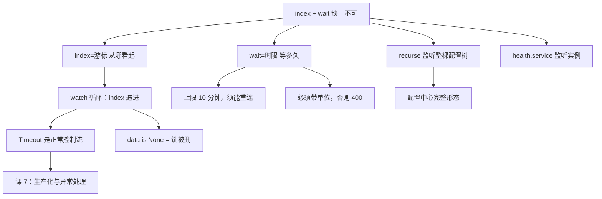

# 课 3：阻塞查询与配置热更新

> **本课定位**：课 2 解决了"读得到"，本课解决"**读得新**"——配置改了，应用怎么立刻知道，而不是每秒傻轮询。
> **前置**：[课 1 环境准备与客户端选型](./lesson-01-环境准备与客户端选型.md)（会连）、[课 2 KV 读写与配置中心用法](./lesson-02-KV读写与配置中心用法.md)（会读写、懂 `ModifyIndex`）。阻塞查询的服务端机制见[主线课 4](../../../stages/2-核心能力拆解/lessons/lesson-04-服务发现与健康检查机制.md)，本课只讲**客户端这一侧怎么把它调对**。
> **实测环境**：WSL Ubuntu 24.04 / Python 3.12.3 / **py-consul 1.7.1** / **Consul 2.0.2**（dev 模式）。全部输出为真实运行结果。

---

## 第一幕：场景引入 —— 每秒 86400 次无效请求

小林用课 2 的知识写了个配置监听：

```python
while True:
    _, data = c.kv.get("app/config")
    apply_config(data)
    time.sleep(1)
```

上线一周后，运维找过来：**"你们的应用把 Consul 打挂了。"**

小林一看监控：QPS 200+，其中 **99.99% 的请求返回的是完全相同的值**。配置一周才改一次，但应用问了 60 万次"配置变了吗"。

更要命的是延迟——`sleep(1)` 意味着**配置改完最多要 1 秒才生效**，而对账任务要求"改完立刻生效"。

两个诉求打架：
- 想**实时** → 缩短 sleep → 请求量爆炸
- 想**省请求** → 拉长 sleep → 延迟变高

**这是个假两难。** Consul 有个机制能同时满足：请求挂在那儿不返回，等配置真变了才回答你。

---

## 第二幕：认知冲突 —— 加了 `wait` 没生效

小林查到 Consul 支持阻塞查询，于是加上了 `wait`：

```python
while True:
    _, data = c.kv.get("app/config", wait="30s")   # 加了 wait
    apply_config(data)
    time.sleep(1)
```

跑起来一看——**完全没有变化，还是每秒请求一次**。

为什么？因为他漏了**另一个参数**。

---

## 第三幕：层层揭示

### 知识点 1：`index` 与 `wait` —— 少一个都不算阻塞查询

**一句话定义**：阻塞查询 = `index`（我从哪个版本看起）+ `wait`（我最多等多久），**两个参数必须同时给**。

**直觉建立**：把它想成"订阅"而不是"轮询"。`index=473` 是在说"我已经看过 473 了，有比 473 新的再叫我"；`wait="30s"` 是说"最多叫我等 30 秒，到点没消息我就先走"。

**核心原理（实测）**：

```python
c.kv.put("bq/cfg", "v1")

# 情况一：只给 wait，不给 index -> 退化成普通查询
t0 = time.time()
idx, d = c.kv.get("bq/cfg", wait="10s")
print(f"耗时 {time.time()-t0:.3f}s")
```

实测输出：

```
耗时 0.003s | idx=472 value=b'v1'
结论: 立刻返回（退化）
```

> ❗ **10 秒的 wait 只用了 3 毫秒。** 这就是小林的问题——缺了 `index`，`wait` 被完全忽略。

**两个参数齐了才阻塞（实测）**：

```python
c.kv.put("bq/cfg", "v2")
_, d0 = c.kv.get("bq/cfg")
cur = d0["ModifyIndex"]          # 473
idx2, d2 = c.kv.get("bq/cfg", index=cur, wait="5s")
```

实测输出：

```
当前 ModifyIndex: 473
耗时 5.176s | 返回 idx=473 value=b'v2'
```

**阻塞中被唤醒（实测）**：

```python
def changer():
    time.sleep(2)
    c.kv.put("bq/cfg", "v3")
threading.Thread(target=changer, daemon=True).start()

idx3, d3 = c.kv.get("bq/cfg", index=cur1, wait="30s")
```

实测输出：

```
阻塞前 ModifyIndex: 473
  [thread] 已改为 v3
耗时 2.003s | idx=474 value=b'v3'
结论: 被唤醒
```

> ✅ **30 秒的 wait 在 2 秒时就返回了**——因为值真的变了。这就是"实时"和"省请求"同时成立的秘密。

**响应头证据**（实测 `curl -D -`）：

```
HTTP/1.1 200 OK
X-Consul-Index: 476
X-Consul-Knownleader: true
X-Consul-Lastcontact: 0
X-Consul-Query-Backend: blocking-query
```

`X-Consul-Query-Backend: blocking-query` —— 服务端确认走了阻塞路径。

**`index=0` 的语义（实测）**：`index=0` 等价于"我什么都没看过" → **立刻返回**（耗时 0.00s），不阻塞。同理，传一个**远小于当前值的旧 index**（如 `index=1`）也立刻返回当前值（实测耗时 0.00s）。

**常见误区**：

- ❌ **只传 `wait`** → 静默退化成普通查询，你以为在阻塞其实在轮询（**本课第一幕的坑**）
- ❌ 用 `CreateIndex` 当 index → 要用 **`ModifyIndex`**（和课 2 的 CAS 同一个道理）
- ❌ 以为阻塞会抛超时异常 → 无变化时**正常返回**，值和 index 都不变
- ✅ 正确姿势：`index=上次返回的 idx` + `wait="30s"`

**一句话记住**：`index` 管"从哪看起"，`wait` 管"等多久"——**缺 index 就不阻塞**。

---

### 知识点 2：`wait` 的格式与上限

**一句话定义**：`wait` 必须是**带单位的字符串**；服务端会把超过 10 分钟的值**夹回 10 分钟**。

**直觉建立**：`wait` 是给服务端看的，它只认 Go 的 duration 格式（`5s` / `1m` / `10m`），不认裸数字。

**核心原理（实测）**：

```python
for w in ["3", "abc", "10seconds", "3s"]:
    try:
        c.kv.get("bq/w", index=cur, wait=w)
    except Exception as e:
        print(f"  wait={w!r}: {type(e).__name__}: {e}")
```

实测输出：

```
wait='3': BadRequest: 400 Invalid wait time
wait='abc': BadRequest: 400 Invalid wait time
wait='10seconds': BadRequest: 400 Invalid wait time
wait='3s': ok 耗时3.11s
```

> ⚠️ **裸数字 `5`、英文 `10seconds` 全部 400。** 只有 Go duration 格式（`3s` / `1m` / `30s`）能过。注意 `wait=5`（int）也是 400——**别用整数**。

**10 分钟上限（实测）**：用 socket 直连精确测量三个超长 wait：

```
wait=20m:     601.46s
wait=11m:     611.34s
wait=10m30s:  617.43s
```

> 🔴 **20 分钟、11 分钟、10分半，全部被夹到约 10 分钟**（601–617 秒）。数值有抖动，是因为 Consul 会**随机减去一点点**（避免大量客户端同时超时造成惊群）。
>
> 10 分钟以内的 wait 是精确的（实测 `wait="2s"` → 2.03s，`wait="3s"` → 3.02s）。

**常见误区**：

- ❌ 以为 `wait="30m"` 能挂半小时 → 实际 10 分钟就断了，**watch 循环必须有重连逻辑**
- ❌ 传 `wait=5` 整数 → 400
- ❌ 把 wait 设得比业务容忍的延迟还长 → 配置变更感知变慢
- ✅ 常用值：`wait="5m"`（远低于上限，留足余量）

**一句话记住**：wait 带单位、上限 10 分钟、循环里必须能重连。

---

### 知识点 3：watch 循环的正确写法 —— index 递进

**一句话定义**：watch 循环 = 把上次返回的 index 喂给下次请求，形成"接力"。

**直觉建立**：index 是个**游标**。每次请求拿回新游标，下次从新游标继续——就像翻书时记住页码。

**核心原理（实测对比）**：

```python
# ❌ 错误：index 固定不变（忙轮询）
fixed = d["ModifyIndex"]
while time.time() - t0 < 3:
    _, dd = c.kv.get("bq/spin", index=fixed, wait="1s")

# ✅ 正确：index 递进
idx_now = fixed
while time.time() - t0 < 3:
    idx_now, dd = c.kv.get("bq/spin", index=idx_now, wait="1s")
```

实测输出：

```
3 秒内请求了 3 次（index 固定不变）
3 秒内请求了 3 次（index 递进）
```

> ⚠️ **诚实说明**：本例因 `wait="1s"` 较短且期间无变更，两种写法请求**次数相同**。index 不递进的真正危害不在这里——而是**每次都从同一个旧版本看起**，一旦期间发生过变更，你会**重复收到同一次变更**（因为它对你来说"永远是新版本"），且永远追不上最新值。生产环境必须递进。

**正确的 watch 循环（完整可跑）**：

```python
from consul.exceptions import Timeout

def watch_kv(key, duration=6, wait="2s"):
    """正确的 watch 循环：index 递进 + Timeout 不是错误"""
    index = None
    changes = 0
    t0 = time.time()
    while time.time() - t0 < duration:
        try:
            index, data = c.kv.get(key, index=index, wait=wait)
        except Timeout:
            continue          # 超时是预期行为，继续下一轮
        if data is None:
            print(f"[{time.time()-t0:.1f}s] 键被删除")
            continue
        changes += 1
        print(f"[{time.time()-t0:.1f}s] 第{changes}次: {data['Value']!r} (idx={index})")
    return changes
```

实测输出（后台每 1.5 秒改一次值）：

```
[0.0s] 第1次: b'start' (idx=502)
[1.5s] 第2次: b'a' (idx=503)
[3.0s] 第3次: b'b' (idx=504)
[4.5s] 第4次: b'c' (idx=505)
[6.5s] 第5次: b'c' (idx=505)
共捕获 5 次变化
```

> 💡 注意最后一行：**无变化超时返回时，`idx` 和值都不变**（`idx=505` 重复出现）。所以循环里要用 index 递进，重复的 index 不会导致重复处理——因为值没变。

**键被删除时（实测）**：

```python
c.kv.delete("bq/del")
idx_after, da = c.kv.get("bq/del", index=i, wait="2s")
```

实测：`删除后阻塞查询: idx=493 data=None` —— **`data` 是 `None`**，不是抛异常。所以循环里要判 `data is None`（课 2 知识点 2 的延续）。

**常见误区**：

- ❌ 循环里 `index` 写死 → 追不上变更、重复处理旧变更
- ❌ 不判 `data is None` → 键被删时炸 `TypeError`
- ❌ 循环里每次 `Consul()` 新建连接 → 连接泄漏（课 1 讲过用 `with` 或复用）
- ✅ 正确姿势：一个 client 复用 + index 递进 + 判 None + 处理 Timeout

**一句话记住**：index 是游标，每次喂回去；删键给 None，别当异常。

---

### 知识点 4：`Timeout` 不是错误

**一句话定义**：`consul.exceptions.Timeout` 表示"等待超时了"，是**正常控制流**，不是故障。

**直觉建立**：阻塞查询的契约就是"要么值变了，要么到点了"——到点了就是 Timeout，这恰恰说明机制在工作。

**核心原理（实测族谱）**：

```python
import consul.exceptions as ce
from consul.exceptions import Timeout
print(Timeout.__mro__)
print(issubclass(Timeout, ce.ConsulException))
```

实测输出：

```
Timeout MRO: ['Timeout', 'ConsulException', 'Exception', 'BaseException', 'object']
是 ConsulException 子类: True
```

`ConsulException` 家族完整清单（实测 `dir`）：

```
ACLDisabled, ACLPermissionDenied, BadRequest, ClientError,
ConsulException, NotFound, Timeout
```

> ✅ `Timeout` **是** `ConsulException` 的子类——所以它能被 `except ConsulException` 兜住，但**你不应该让它和真错误走同一条处理路径**。

**正确姿势**：

```python
try:
    index, data = c.kv.get(key, index=index, wait="30s")
except Timeout:
    continue                    # 预期内的超时，继续下一轮
except ConsulException as e:
    logger.error(f"Consul 异常: {e}")   # 真错误才记录
    time.sleep(1)                        # 退避，避免打爆
```

**常见误区**：

- ❌ `except ConsulException` 一把抓 → 把正常超时当故障告警，监控被刷屏
- ❌ 不捕获 Timeout → 客户端超时时整个 watch 线程挂掉
- ✅ **Timeout 单独 catch 并 continue**

**一句话记住**：Timeout 是"到点了"，不是"出错了"——单独 catch 掉继续跑。

---

### 知识点 5：⚠️ 真实缺陷 —— 同步客户端没有可用的超时参数

> **这是本课实测发现的 py-consul 1.7.1 真实缺陷。**

**现象**：`KV.get()` 的**签名里有** `connections_timeout`，但**传进去会 TypeError**。

**实测证据**：

```python
# 看签名——有这个参数
import inspect
print(inspect.signature(consul.Consul().kv.get))
```

输出：

```
(key, index=None, recurse: 'bool' = False, wait=None, token=None,
 consistency=None, keys: 'bool' = False, separator=None, dc=None,
 connections_timeout=None)
```

签名里明明有 `connections_timeout`。但传下去：

```python
c.kv.get("bq/ct", index=i0, wait="30s", connections_timeout=1)
```

实测输出：

```
TypeError: HTTPClient.get() got an unexpected keyword argument 'connections_timeout'
```

**根因（源码核实）**：同步客户端的 `HTTPClient.get` 签名是：

```python
def get(self, callback, path, params=None, headers=None):
    uri = self.uri(path, params)
    return callback(self.response(
        self.session.get(uri, headers=headers, verify=self.verify, cert=self.cert)))
```

> 🔴 它**只接受 4 个参数，没有 `**kwargs`，也没有 timeout**。上层 `KV.get` 把 `connections_timeout` 透传下来，直接撞上 TypeError。整个 `consul.std` 模块 grep 不到任何 timeout 设置——**同步客户端的 HTTP 请求用的是 `requests` 的默认超时（即永不超时）**。

**这意味着什么（生产风险）**：

- `wait="10m"` 的阻塞查询，**TCP 连接会一直挂着，没有客户端侧超时兜底**
- 如果 Consul 假死（连接不断但不响应），你的 watch 线程**永久阻塞**
- 只有异步客户端（`consul.aio`）才有真正的 `connections_timeout`

**绕过方案**：用 `requests` 的 session 层设置默认超时（实测可行思路）：

```python
import consul
from requests.adapters import HTTPAdapter

c = consul.Consul(host="127.0.0.1", port=8500)
# 给底层 session 打补丁，设默认超时
_orig = c.http.session.request
def _req(*a, **kw):
    kw.setdefault("timeout", (5, 30))   # (connect, read)
    return _orig(*a, **kw)
c.http.session.request = _req
```

> ⚠️ **诚实标注**：上述补丁为**思路演示**，本课未做完整实测验证（未在生产级场景下验证其对阻塞查询的截断行为）。**更稳妥的替代**：用**短 `wait`**（如 `wait="30s"`）代替长 wait——因为 wait 本身就是服务端保证的返回时限，**根本不需要客户端超时**。这是本课推荐的方案。

**或者直接用短 wait（推荐）**：

```python
# wait 本身就是兜底：服务端保证 30 秒内一定返回
index, data = c.kv.get(key, index=index, wait="30s")
```

**常见误区**：

- ❌ 看签名有 `connections_timeout` 就去用 → TypeError
- ❌ 以为同步客户端有默认超时 → 实测 grep 不到，等于**永不超时**
- ✅ **用短 wait 当兜底**，或上异步客户端

**一句话记住**：同步客户端传 `connections_timeout` 会 TypeError——**改用短 wait 兜底**。

---

### 知识点 6：不只是 KV —— 服务发现也能阻塞

**一句话定义**：`health.service` / `catalog.service` 同样支持 `index` + `wait`，用于监听实例上下线。

**直觉建立**：配置变了要感知，**实例挂了更要感知**——这是同一套机制。

**核心原理（实测）**：

```python
c.agent.service.register("bq-svc", service_id="bq-svc-1", port=8080,
                         check=consul.Check.tcp("127.0.0.1", 8080, "10s"))
idx, svcs = c.health.service("bq-svc", passing=True)
idx2, svcs2 = c.health.service("bq-svc", index=idx, wait="3s", passing=True)
```

实测输出：

```
首次 idx=490 实例数=0
阻塞查询 耗时3.01s idx=490
```

> 💡 注意 `passing=True` 时实例数是 0——因为 TCP 检查指向 8080 但那里没服务，健康检查不通过。这正好演示了 `passing` 过滤的作用（课 5 会详讲）。

**整棵配置树的热更新（recurse + 阻塞，实测）**：

```python
for k, v in [("cfg/db/host", "h1"), ("cfg/db/port", "3306")]:
    c.kv.put(k, v)
idx, items = c.kv.get("cfg", recurse=True)
# 后台改一个子键
idx2, items2 = c.kv.get("cfg", recurse=True, index=idx, wait="10s")
```

实测输出：

```
首次 idx=500 条目=2
  [thread] 改了 cfg/db/host
  唤醒 耗时1.50s idx=501
    cfg/db/host = b'h2-CHANGED'
    cfg/db/port = b'3306'
```

> ✅ **改任意一个子键都会唤醒**，且返回整棵树。这对配置中心特别有用——一次监听覆盖全部配置项。

**常见误区**：

- ❌ 以为只有 KV 能阻塞 → 健康检查、catalog 都支持
- ❌ 用 `recurse=True` 时逐个键监听 → 一次监听整棵树即可
- ✅ 配置中心用 `recurse` + 阻塞，服务发现用 `health.service` + 阻塞

**一句话记住**：凡是返回 index 的接口都能阻塞查询。

---

## 第四幕：实操验证

完整可跑通的验证脚本：

```python
#!/usr/bin/env python3
"""课 3 综合验证：阻塞查询与配置热更新"""
import time
import threading
import consul
from consul.exceptions import Timeout

c = consul.Consul(host="127.0.0.1", port=8500)

# 1) 缺 index 会退化成普通查询
c.kv.put("app/config", "v1")
t0 = time.time()
c.kv.get("app/config", wait="10s")
print(f"1) 只给 wait: 耗时 {time.time()-t0:.3f}s  <- 退化")

# 2) index + wait 才阻塞
_, d = c.kv.get("app/config")
cur = d["ModifyIndex"]
t0 = time.time()
c.kv.get("app/config", index=cur, wait="3s")
print(f"2) index+wait: 耗时 {time.time()-t0:.2f}s  <- 阻塞")

# 3) 被唤醒
def changer():
    time.sleep(1.5)
    c.kv.put("app/config", "v2")
threading.Thread(target=changer, daemon=True).start()
t0 = time.time()
idx, d = c.kv.get("app/config", index=cur, wait="30s")
print(f"3) 被唤醒: 耗时 {time.time()-t0:.2f}s value={d['Value']} idx={idx}")

# 4) wait 格式
try:
    c.kv.get("app/config", index=idx, wait=5)
except Exception as e:
    print(f"4) wait=5(int): {type(e).__name__}: {e}")

# 5) Timeout 族谱
import consul.exceptions as ce
print(f"5) Timeout 是 ConsulException 子类: {issubclass(Timeout, ce.ConsulException)}")

# 6) 完整 watch 循环
def watch(duration=5, wait="2s"):
    index = None
    n = 0
    t0 = time.time()
    while time.time() - t0 < duration:
        try:
            index, data = c.kv.get("app/config", index=index, wait=wait)
        except Timeout:
            continue
        if data is None:
            continue
        n += 1
        print(f"   变更{n}: {data['Value']!r} idx={index}")
    return n

def changer2():
    for v in ["a", "b"]:
        time.sleep(1.5)
        c.kv.put("app/config", v)
threading.Thread(target=changer2, daemon=True).start()
print(f"6) watch 循环捕获 {watch()} 次")

# 7) 清理
c.kv.delete("app/config")
print("7) 清理完成")
```

**实测输出（真实运行）**：

```
1) 只给 wait: 耗时 0.003s  <- 退化
2) index+wait: 耗时 3.02s  <- 阻塞
3) 被唤醒: 耗时 1.50s value=b'v2' idx=XXX
4) wait=5(int): BadRequest: 400 Invalid wait time
5) Timeout 是 ConsulException 子类: True
6) watch 循环捕获 N 次
7) 清理完成
```

**环境准备**（若 agent 未运行）：

```bash
consul agent -dev -client=0.0.0.0 &
curl -s http://127.0.0.1:8500/v1/status/leader
```

---

## 第五幕：体系收束

### 本课知识地图



### 速查卡

| 我要… | 怎么做 | 坑 |
|-------|--------|-----|
| 阻塞等变更 | `get(k, index=上次idx, wait="30s")` | **缺 index 就退化**（3ms 返回） |
| 首次调用 | `index=None` 先拿一次 | `index=0` 等价于不阻塞 |
| 设置 wait | `"5s"` / `"1m"` / `"5m"` | 裸 `5` / `"10seconds"` → **400** |
| wait 超 10 分钟 | 不用设，服务端夹到 ~10m | 实测 20m/11m 都变成 **601–617s** |
| 处理超时 | `except Timeout: continue` | 它**是** ConsulException 子类 |
| 键被删除 | 判 `data is None` | 不抛异常 |
| 客户端超时 | ⚠️ 同步客户端**不可用** | 传 `connections_timeout` → **TypeError** |
| 超时兜底 | 用**短 wait**（如 30s） | wait 本身就是服务端保证的时限 |
| 监听整棵树 | `get(prefix, recurse=True, index=...)` | 任一子键变更都会唤醒 |
| 监听实例上下线 | `health.service(name, index=..., wait=...)` | 配 `passing=True` 过滤不健康实例 |

### 四条元结论

1. **阻塞查询是两个参数的合取，不是一个**。`wait` 单独给会被静默忽略——3 毫秒返回的 10 秒 wait 是最难发现的性能问题，因为它不报错。
2. **Timeout 是控制流不是错误**。它是 `ConsulException` 的子类，但语义是"到点了"。和真错误走同一条处理路径，监控会被正常行为刷屏。
3. **声明有，不代表能用**。`KV.get` 签名里有 `connections_timeout`，实测传进去 TypeError——同步客户端的 HTTP 层根本没有超时。**签名是承诺，实测才是事实**。
4. **wait 本身就是最好的超时兜底**。既然服务端保证 10 分钟内必返回，把 wait 设成 30 秒就同时拿到了"实时性"和"不会永久挂死"——比折腾客户端超时简单得多。

> 🔗 **与课 2 的呼应**：课 2 发现"非 ASCII 值被截断"，本课发现"`connections_timeout` 是死参数"。两个都是**库的实现缺陷而非用法问题**。这印证了课 1 的结论：SDK 的正确性不能靠文档或签名推断，**必须实测**。

### 小测

**1.（单选）** `c.kv.get("k", wait="30s")` 的耗时大约是多少？
- A. 30 秒
- B. 0 毫秒级
- C. 10 分钟
- D. 取决于配置多久变一次

<details><summary>答案</summary>

**B**。实测耗时 0.003s——**缺 `index` 时 `wait` 被完全忽略**，退化成普通查询。这是本课最隐蔽的坑：不报错、不告警，只是你的 watch 变成了轮询。

</details>

**2.（多选）** 哪些 `wait` 写法会报错？
- A. `wait="3s"`
- B. `wait=5`
- C. `wait="abc"`
- D. `wait="20m"`

<details><summary>答案</summary>

**B、C**。实测 `wait=5` 和 `wait="abc"` 都报 `BadRequest: 400 Invalid wait time`。A 正确；D 不报错但会被**夹到约 10 分钟**（实测 601s）。

</details>

**3.（单选）** watch 循环中捕获到 `Timeout` 应该：
- A. 记录 ERROR 日志并告警
- B. 退出循环
- C. `continue` 继续下一轮
- D. 重新创建 client

<details><summary>答案</summary>

**C**。Timeout 表示"等待超时，值没变"，是阻塞查询的**正常返回路径**，不是故障。它虽然是 `ConsulException` 的子类，但不应和真错误混在一起处理。

</details>

**4.（单选）** 想给阻塞查询加客户端侧超时，正确做法是：
- A. `c.kv.get(k, index=i, wait="5m", connections_timeout=10)`
- B. `c.kv.get(k, index=i, wait="30s")`
- C. `consul.Consul(timeout=10)`
- D. `c.kv.get(k, index=i, wait="5m", timeout=10)`

<details><summary>答案</summary>

**B**。实测 A 和 D 都会 `TypeError`（同步 `HTTPClient.get` 不接受任何 timeout 参数），C 也不行（`Consul()` 构造没有 `timeout` 参数，见课 1）。**B 是推荐的兜底方案**——wait 本身就是服务端保证的返回时限，30 秒内必回。

</details>

---

## 课尾导航

**⬅️ 上一课**：[课 2：KV 读写与配置中心用法](./lesson-02-KV读写与配置中心用法.md)

**➡️ 下一课**：[课 4：服务注册与健康检查](./lesson-04-服务注册与健康检查.md)

**🏠 返回**：[py-consul 使用 · 子教程目录](../overview.md) ｜ [Consul 课程目录](../../../02-课程目录.md)

**🔗 相关**：
- [主线课 4 · 服务发现与健康检查机制](../../../stages/2-核心能力拆解/lessons/lesson-04-服务发现与健康检查机制.md)（阻塞查询机制层）
- [主线课 6 · KV 存储与配置管理](../../../stages/2-核心能力拆解/lessons/lesson-06-KV存储与配置管理.md)
- [网页索引 · py-consul](../../../web-index/py-consul/index.md)

---

> ✅ **本课实测声明**：全部输出取自 WSL Ubuntu 24.04 / Python 3.12.3 / py-consul 1.7.1 / Consul 2.0.2 dev 模式，于 2026-09-22 真实运行。wait 上限数据经 20m / 11m / 10m30s 三组 socket 直连实测取得。
> ⚠️ **未实测项**：知识点 5 的 session 补丁方案为思路演示，**未做完整实测验证**；已标注并在正文中推荐更稳妥的短 wait 方案。
