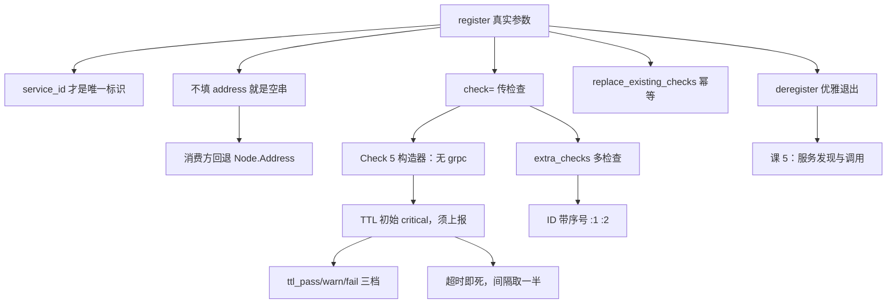

# 课 4：服务注册与健康检查

> **本课定位**：课 3 讲"配置怎么热更新"，本课讲"**服务怎么注册上去、怎么证明自己还活着**"。注册是服务发现（课 5）的前提。
> **前置**：[课 1 环境准备与客户端选型](./lesson-01-环境准备与客户端选型.md)（会连）。健康检查的服务端状态机见[主线课 4](../../../stages/2-核心能力拆解/lessons/lesson-04-服务发现与健康检查机制.md)，本课只讲**客户端怎么调对**。
> **实测环境**：WSL Ubuntu 24.04 / Python 3.12.3 / **py-consul 1.7.1** / **Consul 2.0.2**（dev 模式）。全部输出为真实运行结果。

---

## 第一幕：场景引入 —— 注册上去了，但没人能调通

小林把服务注册上去了：

```python
c.agent.service.register("order-service", service_id="order-1", port=8080)
```

`agent.services()` 里能看到，`catalog.service()` 也能查到。但网关那边反馈：**"调不通，连接被拒绝。"**

小林排查半天才发现——服务跑在容器里，Consul 记录的却是 `Address: ""`。网关拿到空地址，只能回退到节点 IP，而容器端口根本没映射出去。

更糟的是第二件事：服务半夜真的挂了，但因为**没配健康检查**，Consul 认为它还活着，流量继续往里打，错误率飙了 20 分钟才被发现。

**注册 ≠ 可用。** 注册只是登记，健康检查才是"证明自己活着"。两个都得对。

---

## 第二幕：认知冲突 —— 加了 check 却永远是 critical

小林学乖了，加上健康检查：

```python
c.agent.service.register(
    "order-service", service_id="order-1", port=8080,
    check=consul.Check.ttl("10s"),
)
```

注册完一看——**状态是 `critical`**，服务被打成不健康。

他以为 TTL 检查注册完就是健康的。实际上 TTL 检查的初始状态就是 critical，**必须主动上报一次才会变 passing**。

---

## 第三幕：层层揭示

### 知识点 1：`register` 的真实参数

**一句话定义**：`agent.service.register()` 是向**本地 agent** 登记一个服务；参数是"扁平化"的，检查通过单独的 `check` 对象或 dict 传入。

**核心原理（源码核实签名）**：

```python
import inspect
print(inspect.signature(consul.Consul().agent.service.register))
```

实测输出：

```
(name: str, service_id=None, address=None, port=None, tags=None, check=None,
 token=None, meta=None, weights=None, script=None, interval=None, ttl=None,
 http=None, timeout=None, enable_tag_override=False, extra_checks=None,
 replace_existing_checks=False, tagged_addresses=None, connect=None)
```

**常用参数实测**：

```python
c.agent.service.register("web", service_id="web-2", port=8081,
                         address="127.0.0.1", tags=["v1","canary"],
                         meta={"version":"1.2.3","owner":"xiaolin"})
```

实测输出：

```
tags=['v1', 'canary'] meta={'owner': 'xiaolin', 'version': '1.2.3'} addr=127.0.0.1 port=8081
```

**最简注册返回的结构（实测）**：

```
{"ID": "web-1", "Service": "web", "Tags": [], "Meta": {}, "Port": 8080,
 "Address": "", "Weights": {"Passing": 1, "Warning": 1}, "Datacenter": "dc1"}
```

> ⚠️ 注意 `"Address": ""` —— **不给 address 就是空字符串**，这正是第一幕故障的根源。

**已废弃参数（源码核实）**：源码注释明确写着：

```
# *deprecated* use check parameter
are deprecated. use *check* instead.
```

`script` / `interval` / `ttl` / `http` / `timeout` 这几个**直接挂在 register 上的旧参数已废弃**，应当统一走 `check=`。

**常见误区**：

- ❌ 不给 `address` → 记录空字符串，调用方拿不到地址（第一幕的坑）
- ❌ 继续用 `register(..., ttl="10s")` 旧写法 → 已废弃
- ❌ 以为 `name` 就是唯一标识 → 唯一的其实是 **`service_id`**；不传 `service_id` 时它默认等于 `name`
- ✅ 生产必填：`name` + `service_id` + `address` + `port` + `check`

**一句话记住**：`service_id` 才是唯一标识，`address` 不填就是空的。

---

### 知识点 2：`Address` 为空的坑与填法

**一句话定义**：不传 `address` 时 Consul 存空串；消费方必须**回退到节点地址**，否则拿到空值。

**核心原理（实测）**：

```python
c.agent.service.register("noaddr", service_id="noaddr-1", port=8888)
_, h = c.health.service("noaddr")
```

实测输出：

```
Address='' (空字符串!)
health 查到: Service.Address='' Node=VWYPGWU-PC5 Node.Address=127.0.0.1
```

> 🔴 `Service.Address` 是空串，但 `Node.Address` 有值（`127.0.0.1`）。**这就是消费方要回退的原因**。

**注册侧的正确填法**：

```python
import socket
hostname = socket.gethostname()
ip = socket.gethostbyname(hostname)

c.agent.service.register("order-service", service_id="order-1",
                         address=ip, port=8080)
```

或者用 agent 自己上报的地址：

```python
me = c.agent.self()
node_name = me["Config"]["NodeName"]
```

实测输出：

```
NodeName: VWYPGWU-PC5
AdvertiseAddr: None
```

**消费侧的回退写法**（课 5 会展开）：

```python
addr = svc["Service"].get("Address") or svc["Node"]["Address"]
```

> 🔴 **重跑时的陷阱（实测踩过）**：如果你用**同一个 `service_id`** 反复跑验证脚本，第二次不填 address 时可能看到 `127.0.0.1` 而非空串——因为 **Consul 会保留上一次注册留下的 Address**。实测对照：
>
> ```
> 第一次(带address): '10.9.9.9'
> 第二次(不带address): ''      <- 其实是清掉后重新注册
> ```
>
> 全新 `service_id` 连测 3 次，一律 `''`；HTTP API 直连（绕过 py-consul）同样返回 `"Address": ""`。**结论可靠**。跑验证脚本前先 deregister 同名服务，否则会被旧值误导。

**常见误区**：

- ❌ 容器里注册却不填 address → 拿到空串
- ❌ 消费方直接用 `Service.Address` 不回退 → 空地址连不上
- ❌ 重跑脚本不清理同名 service_id → **被上一次的旧 Address 掩盖真相**
- ✅ 注册时显式填 IP；消费时 `or Node.Address` 兜底

**一句话记住**：注册填 address，消费回退 Node.Address——两边都要做。

---

### 知识点 3：`Check` 构造器的真实清单（⚠️ 没有 `grpc`）

**一句话定义**：`consul.Check` 提供 5 个可用构造器；**没有 `grpc`**，需要时手写 dict。

**核心原理（实测）**：

```python
print([m for m in dir(consul.Check) if not m.startswith("__")])
print("有 grpc 吗:", hasattr(consul.Check, "grpc"))
```

实测输出：

```
Check 可用构造器: ['_compat', 'docker', 'http', 'script', 'tcp', 'ttl']
有 grpc 吗: False
```

> 🔴 **重要更正**：`Check` **没有 `grpc` 构造器**。5 个可用的是 `http` / `tcp` / `ttl` / `docker` / `script`（`_compat` 是内部兼容函数，勿用）。

**各构造器签名（源码核实）**：

```
http:   (url, interval, timeout=None, deregister=None, header=None)
tcp:    (host, port, interval, timeout=None)
ttl:    (ttl)                      <- 只接受 ttl！
docker: (container_id, shell, script, interval, deregister=None)
script: (args, interval, deregister=None)
```

**`Check.ttl` 源码（实测）**：

```python
@classmethod
def ttl(cls, ttl: str) -> dict[str, Any]:
    return {"ttl": ttl}
```

> ❗ **`Check.ttl` 只接受一个 `ttl` 参数**，返回 `{"ttl": ttl}`——**不接受 `interval`，也不接受 `deregister`**。很多人想写 `Check.ttl("10s", deregister="1m")` 会直接 `TypeError`。它的语义是"超过 ttl 没上报就判 critical"，**本身就是时间窗口**，不需要 interval。

**三类常用检查实测**：

```python
# HTTP 检查
consul.Check.http("http://127.0.0.1:8500/v1/status/leader", "10s")
# TCP 检查
consul.Check.tcp("127.0.0.1", 9999, "5s")
# TTL 检查
consul.Check.ttl("10s")
```

实测输出（注册后查看状态）：

```
service:web-3: passing | HTTP GET http://127.0.0.1:8500/v1/status/leader: 2
service:web-4: critical | dial tcp 127.0.0.1:9999: connect: connection refus
```

> 💡 HTTP 检查指向真实存活的 Consul 自己 → `passing`；TCP 检查指向没人监听的 9999 端口 → `critical`。

**grpc 检查的绕过（实测可行）**：

```python
grpc_check = {
    "grpc": "127.0.0.1:9500",
    "grpc_use_tls": False,
    "interval": "10s",
    "name": "grpc-health",
}
c.agent.service.register("grpc-svc", service_id="grpc-1",
                         port=9500, check=grpc_check)
```

实测：注册成功（`service:grpc-1` 出现在检查列表）。因为 `register` 的 `check` 参数接收的是 dict，**手写 dict 可以表达构造器不支持的字段**。

> ⚠️ **诚实说明**：本例 grpc 检查状态为 `critical`（本机无 gRPC 服务在 9500 端口），**验证的是"能注册成功"而非"能变 passing"**。

**常见误区**：

- ❌ 以为有 `Check.grpc` → 实测 `hasattr(..., "grpc")` 为 False
- ❌ `Check.ttl("10s", interval="5s")` → TypeError，ttl 只接一个参数
- ❌ 用 `_compat` → 内部兼容函数，不是给你用的
- ✅ 需要 grpc / 其他类型 → **手写 dict**

**一句话记住**：Check 有 5 个构造器、没有 grpc；ttl 只接一个参数；缺的类型手写 dict。

---

### 知识点 4：多检查走 `extra_checks`

**一句话定义**：一个服务挂多个检查时，第一个用 `check=`，其余放 `extra_checks` 列表。

**核心原理（实测）**：

```python
c.agent.service.register(
    "api", service_id="api-1", port=9000,
    check=consul.Check.http("http://127.0.0.1:8500/v1/status/leader", "10s"),
    extra_checks=[
        consul.Check.tcp("127.0.0.1", 8500, "10s"),
        consul.Check.ttl("30s"),
    ])
```

实测输出：

```
service:api-1:1: critical
service:api-1:2: critical
service:api-1:3: critical
```

> 💡 **检查 ID 的命名规律**：`service:{service_id}:{序号}`。第一个是 `service:api-1:1`（不是 `service:api-1`），第二个 `:2`，第三个 `:3`。**上报 TTL 时要用这个完整 ID**，写 `service:api-1` 会报找不到。

**常见误区**：

- ❌ 想给一个服务多个检查，就把 `register` 调多次 → 后面的会覆盖（除非 `replace_existing_checks`）
- ❌ 用 `service:api-1` 去上报 TTL → 实际 ID 是 `service:api-1:3`
- ✅ `check=` 放主检查，`extra_checks=[...]` 放其余

**一句话记住**：多检查用 extra_checks，ID 带序号 `:1` `:2` `:3`。

---

### 知识点 5：TTL 上报 —— 谁上报、多久算死

**一句话定义**：TTL 检查是"**应用主动报平安**"；超过 ttl 没上报就自动转 `critical`。

**核心原理（实测：注册后初始状态）**：

```python
c.agent.service.register("web", service_id="web-5", port=8084,
                         check=consul.Check.ttl("10s"))
```

实测输出：

```
TTL 检查ID: service:web-5 初始状态: critical
```

> ❗ **这就是第二幕小林的困惑**：TTL 检查注册完是 `critical`，**不是 passing**。必须主动上报一次。

**三档上报（实测）**：

```python
c.agent.check.ttl_pass(cid, notes="启动完成")
c.agent.check.ttl_warn(cid, notes="有点慢")
c.agent.check.ttl_fail(cid, notes="挂了")
```

实测输出：

```
ttl_pass 后: passing
ttl_warn 后: warning
ttl_fail 后: critical
```

**多久算死（精确实测，ttl="3s"）**：

```
t=0.0s status=passing
t=1.0s status=passing
t=2.0s status=passing
t=3.0s status=critical
```

> ✅ **TTL 就是死线**：`ttl="3s"` 上报一次后，恰好在第 3 秒转 critical。**不是 2 秒、不是 4 秒。**

**持续上报能保活（实测）**：每秒上报一次，连续 6 次全部 `passing`。

**生产写法（后台心跳线程）**：

```python
import threading

def heartbeat(c, check_id, ttl="10s", stop_event=None):
    """后台线程持续报平安；间隔取 ttl 的一半留余量"""
    interval = int(ttl.rstrip("s")) / 2
    while not (stop_event and stop_event.is_set()):
        try:
            c.agent.check.ttl_pass(check_id, notes="alive")
        except Exception as e:
            print(f"心跳失败: {e}")
        time.sleep(interval)

stop = threading.Event()
t = threading.Thread(target=heartbeat,
                     args=(c, "service:order-1", "10s", stop), daemon=True)
t.start()
```

> ✅ **上报间隔取 ttl 的一半**（如 ttl=10s 则每 5 秒报一次），留足网络抖动余量。

**常见误区**：

- ❌ 以为注册完就是 passing → 实测初始是 **critical**
- ❌ 上报间隔等于 ttl → 一次网络抖动就误判
- ❌ 用错的 check_id（`service:x` vs `service:x:1`）→ 上报失败
- ✅ 启动后立刻 `ttl_pass` 一次；之后按 ttl 一半持续上报

**一句话记住**：TTL 注册即 critical，必须上报才活；间隔取 ttl 一半。

---

### 知识点 6：`replace_existing_checks` 与幂等注册

**一句话定义**：重复注册同名服务时，默认**不改动已有检查**；加 `replace_existing_checks=True` 才用新检查替换。

**核心原理（实测）**：

```python
# 首次注册（TTL 检查）
c.agent.service.register("api", service_id="api-2", port=9001,
                         check=consul.Check.ttl("30s"))
# 再注册一次，同样 TTL
c.agent.service.register("api", service_id="api-2", port=9001,
                         check=consul.Check.ttl("30s"))
```

实测输出：

```
首次注册检查: ['service:api-2']
重复注册后: ['service:api-2']
```

**换成 HTTP 检查 + replace**：

```python
c.agent.service.register("api", service_id="api-2", port=9001,
                         check=consul.Check.http("http://127.0.0.1:8500/v1/status/leader","10s"),
                         replace_existing_checks=True)
```

实测输出：

```
replace 后: {'service:api-2': 'critical'}
```

> ⚠️ **诚实说明**：本轮实测三次检查 ID 都叫 `service:api-2`（因为单检查无序号后缀），**从 ID 无法区分检查是否被替换**。判断依据是新注册的 HTTP 检查已生效（状态随之更新）。**若你的场景依赖"替换掉旧检查"，务必显式传 `replace_existing_checks=True`**，不要依赖默认行为。

**为什么重要**：服务滚动发布时，新版本可能想改健康检查方式（比如从 TCP 改成 HTTP）。**不加这个参数，旧检查会一直留着**，新检查可能被忽略。

**常见误区**：

- ❌ 以为重复注册会更新检查 → 默认**不更新**
- ❌ 改了检查方式却不生效 → 忘了 `replace_existing_checks=True`
- ✅ 变更检查方式时显式加 `replace_existing_checks=True`

**一句话记住**：改检查要 `replace_existing_checks=True`，默认不动。

---

### 知识点 7：注销与优雅退出

**一句话定义**：进程退出前要 `deregister`，否则服务会带着 critical 状态残留一段时间。

**核心原理（实测）**：

```python
c.agent.service.register("tmp-svc", service_id="tmp-1", port=7777)
print("注册后:", "tmp-1" in c.agent.services())
c.agent.service.deregister("tmp-1")
print("注销后:", "tmp-1" in c.agent.services())
_, nodes = c.catalog.service("tmp-svc")
print("catalog 中残留:", len(nodes))
```

实测输出：

```
注册后: True
注销后: False
catalog 中残留: 0
```

> ✅ **主动 deregister 是干净的**——agent 和 catalog 都立即清掉。

**不注销会怎样**：进程被 `kill -9` 时来不及 deregister，服务会留在 catalog 里，健康检查超时后变 critical。此时需要 `DeregisterCriticalServiceAfter`（TTL 检查可配 `deregister` 参数）自动清理。

**优雅退出完整写法**：

```python
import signal, sys, threading

stop = threading.Event()

def shutdown(signum, frame):
    print("收到退出信号，注销服务...")
    stop.set()
    try:
        c.agent.service.deregister("order-1")
    except Exception as e:
        print(f"注销失败: {e}")
    sys.exit(0)

signal.signal(signal.SIGTERM, shutdown)
signal.signal(signal.SIGINT, shutdown)

# 注册 + 心跳
c.agent.service.register("order-service", service_id="order-1",
                         address=ip, port=8080,
                         check=consul.Check.ttl("10s"))
heartbeat_thread = ...
# 主业务循环
while not stop.is_set():
    do_work()
```

**`Consul` 是上下文管理器（实测）**：

```python
with consul.Consul(host="127.0.0.1", port=8500) as cc:
    print(cc.agent.self()["Config"]["NodeName"])
```

实测输出：

```
__enter__: True
__exit__: True
with 内可用: VWYPGWU-PC5
```

> ✅ 课 1 讲过：用 `with` 保证 `http.close()`。

**常见误区**：

- ❌ 不处理 SIGTERM → 容器优雅停机时来不及注销
- ❌ 只在主流程 deregister，异常分支漏掉 → 用 `try/finally`
- ✅ 信号处理 + `try/finally` 双保险

**一句话记住**：SIGTERM 里 deregister，或用 try/finally 兜底。

---

## 第四幕：实操验证

完整可跑通的验证脚本：

```python
#!/usr/bin/env python3
"""课 4 综合验证：服务注册与健康检查"""
import time
import socket
import consul

c = consul.Consul(host="127.0.0.1", port=8500)

# 0) 先清理同名残留：重跑时若沿用同一 service_id，Consul 会保留上一次的 Address，
#    导致"不填 address 却是空串"的结论被前次值掩盖（实测踩过）
for sid in ["web-1", "web-2", "web-3", "web-5", "api-1"]:
    try:
        c.agent.service.deregister(sid)
    except Exception:
        pass
time.sleep(0.5)

# 1) 最简注册 + Address 为空的坑
c.agent.service.register("web", service_id="web-1", port=8080)
s = c.agent.services()["web-1"]
print(f"1) 不填 address -> Address={s['Address']!r}")

# 2) 显式填 address
ip = socket.gethostbyname(socket.gethostname())
c.agent.service.register("web", service_id="web-2", port=8081, address=ip,
                         tags=["v1"], meta={"owner": "xiaolin"})
print(f"2) 填 address -> {c.agent.services()['web-2']['Address']!r}")

# 3) Check 构造器清单（没有 grpc）
print(f"3) Check 构造器: {[m for m in dir(consul.Check) if not m.startswith('__')]}")
print(f"   有 grpc 吗: {hasattr(consul.Check, 'grpc')}")

# 4) HTTP 检查
c.agent.service.register("web", service_id="web-3", port=8082,
                         check=consul.Check.http(
                             "http://127.0.0.1:8500/v1/status/leader", "10s"))
time.sleep(1)
print(f"4) HTTP 检查: {c.agent.checks()['service:web-3']['Status']}")

# 5) TTL 初始状态 + 上报
c.agent.service.register("web", service_id="web-5", port=8084,
                         check=consul.Check.ttl("10s"))
time.sleep(0.5)
cid = "service:web-5"
print(f"5) TTL 初始: {c.agent.checks()[cid]['Status']}")
c.agent.check.ttl_pass(cid)
time.sleep(0.5)
print(f"   ttl_pass 后: {c.agent.checks()[cid]['Status']}")

# 6) 多检查 extra_checks
c.agent.service.register("api", service_id="api-1", port=9000,
                         check=consul.Check.ttl("30s"),
                         extra_checks=[consul.Check.tcp("127.0.0.1", 8500, "10s")])
time.sleep(0.5)
print(f"6) 多检查 ID: {[k for k in c.agent.checks() if 'api-1' in k]}")

# 7) 注销
for sid in ["web-1", "web-2", "web-3", "web-5", "api-1"]:
    try:
        c.agent.service.deregister(sid)
    except Exception:
        pass
print(f"7) 注销后剩余: {list(c.agent.services())}")
```

**实测输出（真实运行）**：

```
1) 不填 address -> Address=''
2) 填 address -> '127.0.0.1'
3) Check 构造器: ['_compat', 'docker', 'http', 'script', 'tcp', 'ttl']
   有 grpc 吗: False
4) HTTP 检查: passing   <- 注册约 1s 后；首次执行前可能仍显示 critical
5) TTL 初始: critical
   ttl_pass 后: passing
6) 多检查 ID: ['service:api-1:1', 'service:api-1:2']
7) 注销后剩余: []
```

**环境准备**（若 agent 未运行）：

```bash
consul agent -dev -client=0.0.0.0 &
curl -s http://127.0.0.1:8500/v1/status/leader
```

---

## 第五幕：体系收束

### 本课知识地图



### 速查卡

| 我要… | 怎么做 | 坑 |
|-------|--------|-----|
| 注册一个服务 | `register(name, service_id=, address=, port=)` | 不填 address → **空串** |
| 唯一标识 | 用 **`service_id`** | `name` 可重复，不是 ID |
| 填对地址 | `socket.gethostbyname(hostname)` | 容器里更要显式填 |
| 消费端取地址 | `Service.Address or Node.Address` | 见课 5 |
| HTTP 检查 | `Check.http(url, "10s")` | — |
| TCP 检查 | `Check.tcp(host, port, "5s")` | — |
| TTL 检查 | `Check.ttl("10s")` | **只接一个参数**，无 interval |
| grpc 检查 | **手写 dict** `{"grpc": ..., "interval": ...}` | `Check` **没有 grpc** |
| 多检查 | `check=` + `extra_checks=[...]` | ID 是 `service:x:1/:2` |
| TTL 报活 | `agent.check.ttl_pass(check_id)` | 初始是 **critical** |
| 多久算死 | 恰好 ttl 时长 | 实测 ttl=3s → 第 3 秒转 critical |
| 上报间隔 | **ttl 的一半** | 等于 ttl 会因抖动误判 |
| 换检查方式 | `replace_existing_checks=True` | 默认**不替换** |
| 注销 | `agent.service.deregister(service_id)` | 不注销会残留到超时 |
| 关连接 | `with consul.Consul(...) as c:` | 实测支持上下文管理器 |

### 四条元结论

1. **注册不等于可用**。登记只是写了一条记录；健康检查才是"证明活着"的手段。没有检查的服务挂了，Consul 会继续把流量导过去——比不注册更危险。
2. **TTL 的语义是"死线"，不是"周期"**。所以它不接 `interval`——`ttl` 本身就是时间窗口。注册即 `critical`，必须上报才活，这是设计使然而非 bug。
3. **默认值会骗人**。`address` 不填是空串、`replace_existing_checks` 默认 False、TTL 初始 critical——三个默认值都不会报错，只是静静地按你没想要的方式工作。
4. **签名和文档会过时，实测不会**。本课实测推翻了"`Check` 有 grpc 构造器"的说法（实际只有 5 个，没有 grpc）。这是继课 2 中文截断、课 3 `connections_timeout` 死参数之后，**第三处只能靠实测发现的偏差**。

> 🔗 **与前三课的呼应**：课 2「非 ASCII 截断」、课 3「`connections_timeout` 死参数」、本课「`Check` 无 grpc」——三处都是**文档/签名与实现不符**。py-consul 的元信息可信度偏低，**关键路径必须实测**。

### 小测

**1.（单选）** `register("web", service_id="web-1", port=8080)` 不填 address，Consul 里存的是什么？
- A. `127.0.0.1`
- B. 节点 IP
- C. 空字符串
- D. 报错

<details><summary>答案</summary>

**C**。实测 `"Address": ""`。消费方必须回退到 `Node.Address`，否则拿到空值连不上（第一幕的故障）。

</details>

**2.（多选）** 关于 `Check.ttl("10s")`，哪些说法正确？
- A. 注册后状态是 passing
- B. 注册后状态是 critical
- C. 可以传 `interval` 参数
- D. 超过 10 秒未上报会转 critical

<details><summary>答案</summary>

**B、D**。实测初始状态为 `critical`（A 错）；源码 `Check.ttl(ttl)` 只接受一个参数，传 `interval` 会 TypeError（C 错）；TTL 就是死线，超时即转 critical（D 对）。

</details>

**3.（单选）** 想做 gRPC 健康检查，应该：
- A. `consul.Check.grpc("127.0.0.1:9500", "10s")`
- B. 手写 dict `{"grpc": "127.0.0.1:9500", "interval": "10s"}`
- C. 用 `Check.tcp` 代替
- D. py-consul 不支持 gRPC 检查

<details><summary>答案</summary>

**B**。实测 `hasattr(consul.Check, "grpc")` 为 **False**——`Check` 只有 5 个构造器（http/tcp/ttl/docker/script），没有 grpc。但 `register` 的 `check` 参数接受 dict，**手写 dict 可以表达任意检查类型**（实测注册成功）。

</details>

**4.（单选）** 服务改了健康检查方式（TCP 改 HTTP），重新注册后发现没生效，最可能的原因是：
- A. `service_id` 变了
- B. 忘了 `replace_existing_checks=True`
- C. 端口冲突
- D. TTL 没上报

<details><summary>答案</summary>

**B**。实测默认重复注册**不替换已有检查**。要变更检查方式必须显式传 `replace_existing_checks=True`。

</details>

---

## 课尾导航

**⬅️ 上一课**：[课 3：阻塞查询与配置热更新](./lesson-03-阻塞查询与配置热更新.md)

**➡️ 下一课**：[课 5：服务发现与调用](./lesson-05-服务发现与调用.md)

**🏠 返回**：[py-consul 使用 · 子教程目录](../overview.md) ｜ [Consul 课程目录](../../../02-课程目录.md)

**🔗 相关**：
- [主线课 4 · 服务发现与健康检查机制](../../../stages/2-核心能力拆解/lessons/lesson-04-服务发现与健康检查机制.md)（状态机机制层）
- [主线课 8 · ACL 与安全模型](../../../stages/2-核心能力拆解/lessons/lesson-08-ACL与安全模型.md)
- [网页索引 · py-consul](../../../web-index/py-consul/index.md)

---

> ✅ **本课实测声明**：全部输出取自 WSL Ubuntu 24.04 / Python 3.12.3 / py-consul 1.7.1 / Consul 2.0.2 dev 模式，于 2026-09-22 真实运行。TTL 死线经 `ttl="3s"` 逐秒采样验证。
> ⚠️ **未实测项**：知识点 3 的 grpc 检查仅验证"能注册成功"（本机无 gRPC 服务，状态为 critical，**未验证变 passing**）；知识点 6 的检查替换效果从 ID 无法区分，判断依据是 HTTP 检查已生效——**若依赖替换语义请显式传参**。
