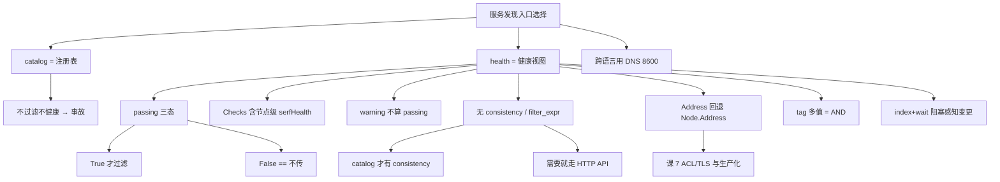

# 课 5：服务发现与调用

> **本课定位**：课 4 讲"服务怎么注册上去"，本课讲"**怎么把能用的实例找出来**"。注册是写，发现是读。
> **前置**：[课 4 服务注册与健康检查](./lesson-04-服务注册与健康检查.md)（会注册、会上报）、[课 3 阻塞查询](./lesson-03-阻塞查询与配置热更新.md)（index+wait）。健康检查的状态机见[主线课 4](../../../stages/2-核心能力拆解/lessons/lesson-04-服务发现与健康检查机制.md)，本课只讲**客户端怎么查对**。
> **实测环境**：WSL Ubuntu 24.04 / Python 3.12.3 / **py-consul 1.7.1** / **Consul 2.0.2**（dev 模式）。全部输出为真实运行结果。

---

## 第一幕：场景引入 —— 查到了，但一半是死的

小林写完服务发现，兴冲冲地跑了：

```python
_, nodes = c.catalog.service("order-service")
for n in nodes:
    call(n["Address"], n["ServicePort"])
```

上线第一晚就出事：**一半请求超时**。

排查发现，`catalog.service` 返回了 3 个实例，其中 2 个**早就挂了**——但 catalog 是"注册表"，它只负责记录"这个服务登记过"，**不关心它是否还活着**。挂掉的实例照样在列表里，流量照样往里打。

他换成 `health.service`，还是不对——因为他写的是：

```python
_, nodes = c.health.service("order-service", passing=False)
```

`passing=False` 看着像"过滤掉不健康的"，实际是"**不过滤**"。他想当然的写法，一个字都没生效。

**发现的难点不在"查得到"，而在"查到的必须是能用的"。**

---

## 第二幕：认知冲突 —— 加个 consistency 就崩了

小林听说 `stale` 读能降低延迟，于是：

```python
c.health.service("order-service", passing=True, consistency="stale")
```

**直接 TypeError**：

```
TypeError: Health._service() got an unexpected keyword argument 'consistency'
```

他翻了文档——文档明明白白写着 `health.service` 支持 `consistency`。他甚至试了 `filter_expr`，同样 TypeError。

**文档说的是 Consul HTTP API，不是 py-consul 的封装。** 这两个不是一回事。

---

## 第三幕：层层揭示

### 知识点 1：`health.service` vs `catalog.service` —— 选错就出事

**一句话定义**：`catalog` 是**注册表**（谁登记过），`health` 是**健康视图**（谁现在能用）。做服务发现一律用 `health`。

**核心原理（实测：同一批实例，两个接口返回不同结构）**：

```python
_, cat = c.catalog.service("demo")
_, hl  = c.health.service("demo")
print("catalog keys:", sorted(cat[0].keys()))
print("health  keys:", sorted(hl[0].keys()))
```

实测输出：

```
catalog[0] keys: ['Address', 'CreateIndex', 'Datacenter', 'ID', 'ModifyIndex', 'Node',
                  'NodeMeta', 'ServiceAddress', 'ServiceConnect', 'ServiceEnableTagOverride',
                  'ServiceID', 'ServiceKind', 'ServiceLocality', 'ServiceMeta', 'ServiceName',
                  'ServicePort', 'ServicePorts', 'ServiceProxy', 'ServiceSocketPath',
                  'ServiceTaggedAddresses', 'ServiceTags', 'ServiceWeights', 'TaggedAddresses']
health[0]  keys: ['Checks', 'Node', 'Service']
```

> 💡 **结构完全不同**：`catalog` 是**扁平**的（23 个字段平铺）；`health` 是**嵌套**的（只有 3 个键：`Checks` / `Node` / `Service`）。**取地址的写法不一样**——catalog 用 `n["Address"]`，health 用 `n["Service"]["Address"]`。

**catalog 不过滤健康状态（实测）**：

```python
_, cat = c.catalog.service("hc")   # 有 1 个 healthy、1 个 critical、1 个 warning
```

实测输出：

```
catalog 返回: ['h-bad', 'h-ok', 'h-warn']  <- 不过滤！
```

> 🔴 **`catalog.service` 会把已挂的实例一起返回**。第一幕的故障根因就在这。

**对照表**：

| | `catalog.service` | `health.service` |
|---|---|---|
| 语义 | 注册表（谁登记过） | 健康视图（谁能用） |
| 过滤不健康 | ❌ **不过滤** | ✅ `passing=True` 时过滤 |
| 返回结构 | 扁平 | 嵌套 `Checks`/`Node`/`Service` |
| 带检查结果 | ❌ | ✅ 有 `Checks` 数组 |
| 用途 | 查拓扑、查有哪些服务 | **做服务发现** |

**常见误区**：

- ❌ 用 `catalog.service` 做负载均衡 → 打到死实例
- ❌ 以为两个接口返回结构一样 → 取字段时 KeyError
- ✅ **服务发现一律用 `health.service(passing=True)`**

**一句话记住**：catalog 是名单，health 是活人；选 health。

---

### 知识点 2：`passing` 的真实语义（三态，不是二态）

**一句话定义**：`passing` 有**三种**取值——不传 / `True` / `False`，其中**不传与 `False` 完全等价**。

**核心原理（实测：1 个 healthy、1 个 critical、1 个 warning）**：

```python
_, a = c.health.service("hc")
_, p = c.health.service("hc", passing=True)
_, f = c.health.service("hc", passing=False)
```

实测输出：

```
不传 passing: ['h-bad', 'h-ok', 'h-warn']
passing=True: []
passing=False: ['h-bad', 'h-ok', 'h-warn']
-> passing=False 与不传是否一致: True
```

> 🔴 **三条关键事实**：
> 1. **`passing=False` 等价于"不传"**，都是**不过滤**。它**不是**"过滤掉不健康的"——第一幕小林就栽在这。
> 2. 要过滤**只能写 `passing=True`**，没有别的写法。
> 3. 本轮 `passing=True` 返回 `[]` 是因为**当时三个实例的检查都还没跑完第一轮**（见下方时序坑）。

**源码佐证**（`Health._service`）：

```python
if passing:
    params.append(("passing", "1"))
```

> 💡 **`if passing:` 是真值判断**——不传是 `None`、`False` 是 `False`，两者都不会 append 参数。**源码层面证明了"不传 == False"**。

**混合健康状态下的实测（1 好 1 坏，等待检查稳定后）**：

```
各检查状态: {'service:m-bad': 'critical', 'service:m-ok': 'passing'}
passing=True: ['m-ok']
不传:        ['m-bad', 'm-ok']
```

> ✅ 这才是 `passing=True` 的正确效果：**只留全 passing 的**。

**warning 算不算通过（实测）**：

```
h-warn 在 passing=True 结果中: False
```

> ⚠️ **warning 不算 passing**。`passing=True` 只要不是 `passing` 就剔除，warning 实例会被过滤掉。如果你的业务希望 warning 也接流量，不能直接用 `passing=True`，得自己按 `Checks` 过滤。

**聚合状态看 `Checks` 数组（实测）**：

```
h-bad: Checks状态=['passing', 'critical']
h-warn: Checks状态=['passing', 'warning']
```

> 💡 **`Checks` 里包含节点级的 `serfHealth` 和服务级检查**。只要有一个非 passing，该实例就不算健康。所以看到 `['passing','critical']` 要明白：**第一个是节点存活，第二个才是服务本身**。

**常见误区**：

- ❌ 写 `passing=False` 以为能过滤 → 实测与不传等价，**完全不过滤**
- ❌ 以为 warning 会保留 → 实测被过滤
- ❌ 只看 `Checks[0]` → 那是 `serfHealth`（节点存活），**服务本身的检查在后面**
- ✅ 要过滤就写 `passing=True`；要精细控制就自己遍历 `Checks`

**一句话记住**：passing 是三态，False 等于不传；只有 True 才过滤。

---

### 知识点 3：🔴 `health.service` 不支持 `consistency` 和 `filter_expr`

**一句话定义**：`health.service` 的底层 `_service` **没有这两个参数**，传了直接 `TypeError`；只有 `catalog.service` 支持 `consistency`。

**核心原理（实测）**：

```python
c.health.service("demo", consistency="stale")
c.health.service("demo", filter_expr="ServicePort == 8001")
```

实测输出：

```
TypeError: Health._service() got an unexpected keyword argument 'consistency'
TypeError: Health._service() got an unexpected keyword argument 'filter_expr'
```

**源码佐证**——两个 `_service` 的签名对比：

```python
# Health._service（实测源码）
def _service(self, internal_uri, index=None, wait=None, passing=None, tag=None,
             dc=None, near=None, token=None, node_meta=None):
    #                       ^^^ 没有 consistency，没有 filter_expr

# Catalog._service（实测源码）
def _service(self, internal_uri, index=None, wait=None, tag=None,
             consistency=None, dc=None, near=None, token=None, node_meta=None):
    #        ^^^^^^^^^^^^ 只有 catalog 有
```

> 🔴 **这是本课最重要的发现**：`consistency` 是 `Catalog._service` 独有的，`Health._service` 根本没实现。**overview 此前记载的"`health` 用 `consistency=` 入参"是错的，本课已更正。**

**`consistency` 只在 catalog 上能用（实测）**：

```
consistency=default: 3 个
consistency=consistent: 3 个
consistency=stale: 3 个
consistency='bogus': 不报错，返回 3 个  <- 静默忽略！
```

> ⚠️ **非法值静默忽略**：源码是 `if consistency in ("consistent", "stale")`——不在白名单里就**什么都不做**，连警告都没有。写错 `consistency` 不会报错，只会悄悄用默认一致性。

**想给 health 加 stale / filter 怎么办**：走 HTTP API 直连。

```python
import subprocess, json
# health + stale
out = subprocess.run(["curl","-s","http://127.0.0.1:8500/v1/health/service/hc?stale"],
                     capture_output=True, text=True)
# health + filter（注意是 Service.Port，不是 ServicePort）
out = subprocess.run(["curl","-s","--get","--data-urlencode","filter=Service.Port == 8301",
                      "http://127.0.0.1:8500/v1/health/service/hc"],
                     capture_output=True, text=True)
```

实测输出：

```
?stale 直连返回 3 条
filter='Service.Port == 8301': 1 条 -> ['m-ok']
filter='Service.Port == 8302': 1 条 -> ['m-bad']
```

> ✅ 两条路都通。**filter 的正确字段名是 `Service.Port`**，写 `ServicePort` 会报 `Selector "ServicePort" is not valid`（实测）。

**常见误区**：

- ❌ `c.health.service(..., consistency="stale")` → TypeError
- ❌ `c.health.service(..., filter_expr=...)` → TypeError
- ❌ filter 里写 `ServicePort` → 服务端报 invalid selector
- ✅ catalog 用 `consistency=`；health 需要 stale/filter 就用 HTTP API 直连

**一句话记住**：health 没有 consistency 和 filter，只有 catalog 有。

---

### 知识点 4：`Address` 为空的回退（接住课 4 的坑）

**一句话定义**：课 4 埋的坑在这里接住——`Service.Address` 为空时**必须回退到 `Node.Address`**。

**核心原理（实测：三个实例，其中一个没填 address）**：

```python
_, h = c.health.service("demo")
for item in h:
    sa = item["Service"].get("Address")
    na = item["Node"].get("Address")
    print(f"{item['Service']['ID']}: Service.Address={sa!r} Node.Address={na!r}")
```

实测输出：

```
svc-a: Service.Address='10.0.0.1' Node.Address='127.0.0.1' -> 实际用 10.0.0.1
svc-b: Service.Address='10.0.0.2' Node.Address='127.0.0.1' -> 实际用 10.0.0.2
svc-c: Service.Address=''         Node.Address='127.0.0.1' -> 实际用 127.0.0.1
```

> ✅ **回退逻辑有效**：`svc-c` 没填 address，靠 `Node.Address` 拿到了可用地址。

**生产写法**：

```python
def discover(c, name, passing_only=True):
    """服务发现：拿能用的实例（含 Address 回退）"""
    _, items = c.health.service(name, passing=passing_only)
    out = []
    for it in items:
        svc, node = it["Service"], it["Node"]
        addr = svc.get("Address") or node.get("Address")   # 关键回退
        out.append({
            "id": svc["ID"], "addr": addr, "port": svc["Port"],
            "tags": svc.get("Tags") or [], "meta": svc.get("Meta") or {},
        })
    return out
```

实测输出：

```
discover('ns'): [{"id": "n-1", "addr": "10.4.0.1", "port": 8401, "tags": [], "meta": {}},
                 {"id": "n-2", "addr": "10.4.0.2", "port": 8402, "tags": [], "meta": {}}]
```

> ⚠️ `Tags` / `Meta` 可能返回 `None`，用 `or []` / `or {}` 兜底。

**常见误区**：

- ❌ 直接用 `item["Service"]["Address"]` → 空串连不上
- ❌ 忘了 `Tags`/`Meta` 可能是 `None` → 后续 `.append()` 报 AttributeError
- ✅ `or` 回退 + `or []` 兜底

**一句话记住**：地址要回退，Tags 要兜底。

---

### 知识点 5：过滤 —— `tag` 是 AND 语义

**一句话定义**：`tag` 支持字符串或 list，但**多个 tag 是 AND**（必须全部满足），不是 OR。

**核心原理（实测）**：

```python
_, t1 = c.health.service("demo", tag="v1")
_, t2 = c.health.service("demo", tag=["v1","v2"])
```

实测输出：

```
health tag='v1': ['svc-a']
health tag=['v1','v2']: []  <- AND 语义
```

> 🔴 **AND 不是 OR**：`svc-a` 有 `["v1","canary"]`、`svc-b` 有 `["v2"]`。传 `["v1","v2"]` 要求**同时含两个 tag**，没有实例满足 → 返回空。**很多人以为是"v1 或 v2"，结果查出来是空的。**

**源码佐证**（`Health._service`）：

```python
if tag is not None:
    if not isinstance(tag, list):
        tag = [tag]
    for tag_item in tag:
        params.append(("tag", tag_item))   # 重复多个 tag 参数 = AND
```

> 💡 多个 `tag` query 参数在 Consul 里是 **AND** 语义。

**⚠️ catalog 的 tag 处理不一样**：

`Catalog._service` 源码是 `if tag: params.append(("tag", tag))`——**直接把 list 塞进一个参数**，不是逐个 append。实测：

```
catalog tag=['v1','v2']: []
```

> ⚠️ catalog 传 list 的行为**不可靠**（实测返回空）。**要用多 tag 过滤就用 `health.service`**。

**其他过滤参数（实测可用）**：

| 参数 | 支持情况 | 实测结果 |
|------|---------|---------|
| `passing` | health 独有 | `True` 过滤；`False` == 不传 |
| `tag` | 两者都有 | list = **AND** |
| `near` | 两者都有 | 按 RTT 排序，实测接受节点名 |
| `node_meta` | 两者都有 | 参数被接受（需节点级 meta 才有效果） |
| `consistency` | **catalog 独有** | health 传了 TypeError |
| `filter_expr` | **两者都不支持** | 须走 HTTP API |

**`near` 排序实测**：

```
health near=VWYPGWU-PC5: ['n-1', 'n-2']
```

**`node_meta` 实测**：参数被接受（不报错），但**本机 dev 模式未设节点级 meta，故返回 0 条**——⚠️ 未完整实测过滤效果，仅验证参数可传。

**常见误区**：

- ❌ 以为多 tag 是 OR → 实测是 AND，查出来是空的
- ❌ 在 catalog 上传 tag list → 行为不可靠
- ✅ 多 tag 过滤用 `health.service`

**一句话记住**：tag 多个是 AND，不是 OR。

---

### 知识点 6：查不到服务返回什么 + 阻塞查询

**一句话定义**：查不存在的服务**不报错**，返回 `(index, [])`；`health` / `catalog` 都支持 index+wait 阻塞。

**核心原理（实测）**：

```python
idx, r = c.health.service("does-not-exist")
```

实测输出：

```
health: index=4675 nodes=[] (空列表，不报错)
catalog: index=4675 nodes=[]
```

> ✅ **不是 None，是空列表**。所以 `for n in nodes` 是安全的，不需要判空——但**要区分"服务不存在"和"实例全挂"**，两者都返回 `[]`，得靠 `len()` 加自己的判断。

**阻塞查询（实测：health 与 catalog 都支持）**：

```python
idx, r = c.health.service("ns")
idx2, r2 = c.health.service("ns", index=idx, wait="3s")
```

实测输出：

```
首次 index=4678 len=2
阻塞查询 3.02s 后返回 index=4678 len=2
```

```
catalog: 阻塞 3.02s 返回 index=4678
```

> ✅ **两个接口都支持 index+wait**，语义与课 3 的 KV 阻塞查询一致：无变化时挂到 wait 超时（3.02s），有变化立即返回。**这让"服务列表变更时自动感知"成为可能**，不必轮询。

**watch 服务列表的写法**（复用课 3 的模式）：

```python
index = None
while True:
    try:
        index, items = c.health.service("order-service",
                                        index=index, wait="60s", passing=True)
        handle(discover_from(items))     # 实例列表变了才走到这
    except consul.Timeout:
        continue                          # 超时不是错误，继续等
```

> ⚠️ 课 3 讲过：`Timeout` 异常**不是错误**，是等待超时的正常信号。

**常见误区**：

- ❌ 以为查不到会返回 None 或抛异常 → 实测返回空列表
- ❌ 服务发现用轮询 → 浪费且延迟高，应用阻塞查询
- ❌ 把 `Timeout` 当错误退出循环 → 课 3 已强调过

**一句话记住**：查不到返回空列表；用 index+wait 做变更感知。

---

### 知识点 7：什么时候不该用客户端 —— DNS 与 sidecar

**一句话定义**：服务发现的**入口**不止 Python 客户端；语言无关的场景用 **DNS 接口**（8600），规模化场景用 **sidecar 代理**。

**核心原理（实测：DNS 接口可用）**：

本机 `dig` / `nslookup` / `host` / `drill` **均未安装**（⚠️ 按协作约定不擅自安装），故用 **Python 原生 UDP 发 DNS 查询**验证：

```python
def dns_query(qname, qtype=1):
    msg = b"\xab\xcd" + b"\x01\x00" + b"\x00\x01" + ...
    sk = socket.socket(socket.AF_INET, socket.SOCK_DGRAM)
    sk.sendto(msg, ("127.0.0.1", 8600))
    data, _ = sk.recvfrom(1024)
```

实测输出：

```
8600 端口: 开放
应答记录数: 1
原始响应片段: 'demo\x07service\x06consul\x00\x00\x01\x00\x01\xc0\x0c\x00\x01\x00\x01\x00\x00\x00\x00\x00\x04\n\x05\x00\x01'
```

> ✅ **DNS 接口实测可用**。响应末尾 `\n\x05\x00\x01` 即 **10.5.0.1**（4 字节 A 记录），正是注册时填的地址。
>
> 💡 若有 `dig`，等价命令是 `dig @127.0.0.1 -p 8600 dnsdemo.service.consul +short`。

**三种入口怎么选**：

| 场景 | 用什么 | 理由 |
|------|--------|------|
| Python 应用，需要精细控制 | **py-consul `health.service`** | 能读 `Checks`、能阻塞查询 |
| 非 Python 语言 / 不改代码接入 | **DNS 接口**（`8600`） | 语言无关，零依赖 |
| 大规模服务网格 | **sidecar / 服务网格** | 客户端负载均衡下沉，应用只连本地代理 |
| 只查拓扑、不关心健康 | `catalog.service` | 见知识点 1 |

> 💡 **DNS 接口天然只返回健康实例**（等价于 `passing=True`），这是它比裸调 catalog 安全的地方。

**常见误区**：

- ❌ 所有语言都塞一个 py-consul → 非 Python 场景应该用 DNS
- ❌ 用 DNS 却想要 `Checks` 明细 → DNS 只给地址，给不了健康详情
- ✅ Python 且要精细控制 → 客户端；跨语言 → DNS

**一句话记住**：Python 用客户端，跨语言用 DNS，规模化用 sidecar。

---

### 知识点 8：⚠️ 健康检查的时序坑（等待才准）

**一句话定义**：检查注册后**不是立刻生效**，要等第一个 interval 周期跑完；刚注册就查会看到 critical。

**核心原理（实测：HTTP 检查 interval="10s"）**：

```
t=1s check=critical passing=True 返回 0 个
...
t=8s check=critical passing=True 返回 0 个
t=9s check=passing passing=True 返回 1 个
```

> 🔴 **等了 9 秒才变 passing**。这是本课实测中最容易误导人的地方——**如果你在注册后立刻 `passing=True` 查询，会得到空列表，然后误以为"过滤写错了"**。

**这与课 4 的关系**：课 4 讲义里曾出现"HTTP 检查: critical"，当时判定为首次执行未及——本课用逐秒采样**确认了这就是时序**，不是故障。

**实践建议**：

```python
# 注册后不要立刻查，给检查留一个 interval 的时间
c.agent.service.register(..., check=consul.Check.http(url, "10s"))
time.sleep(11)          # 略大于 interval
_, items = c.health.service(name, passing=True)
```

或者更稳妥：**用阻塞查询等它变好**：

```python
index = None
while True:
    index, items = c.health.service(name, index=index, wait="30s", passing=True)
    if items:
        break            # 实例可用了
```

**常见误区**：

- ❌ 注册完立刻 `passing=True` 查 → 空列表，误判为代码错
- ❌ 在测试脚本里不 sleep → 结果与预期不符，反复改错地方
- ✅ 注册后留一个 interval；或用阻塞查询等待

**一句话记住**：检查要等一个 interval 才准，别注册完就查。

---

## 第四幕：实操验证

完整可跑通的验证脚本（**注意开头先清理同名服务，避免课 4 讲过的"重跑污染"**）：

```python
#!/usr/bin/env python3
"""课 5 综合验证：服务发现与调用"""
import time
import consul

c = consul.Consul(host="127.0.0.1", port=8500)

# 0) 先清理同名残留（课 4 教训：同 service_id 重跑会保留旧 Address）
for sid in ["d-ok", "d-bad", "d-noaddr"]:
    try:
        c.agent.service.deregister(sid)
    except Exception:
        pass
time.sleep(0.5)

# 1) 一个健康 + 一个不健康 + 一个没填 address
c.agent.service.register("demo", service_id="d-ok", port=8501, address="10.0.0.1",
                         tags=["v1"],
                         check=consul.Check.http(
                             "http://127.0.0.1:8500/v1/status/leader", "10s"))
c.agent.service.register("demo", service_id="d-bad", port=8502, address="10.0.0.2",
                         check=consul.Check.tcp("127.0.0.1", 9999, "5s"))
c.agent.service.register("demo", service_id="d-noaddr", port=8503)  # 不填 address

print("等待检查执行完第一轮（interval=10s）...")
time.sleep(11)

# 2) passing 三态
_, a = c.health.service("demo")
_, p = c.health.service("demo", passing=True)
_, f = c.health.service("demo", passing=False)
print(f"1) 不传 passing: {sorted(i['Service']['ID'] for i in a)}")
print(f"   passing=True: {sorted(i['Service']['ID'] for i in p)}")
print(f"   passing=False:{sorted(i['Service']['ID'] for i in f)}  (与不传等价)")

# 3) catalog 不过滤
_, cat = c.catalog.service("demo")
print(f"2) catalog 返回: {sorted(i['ServiceID'] for i in cat)}  <- 不过滤不健康")

# 4) health 不支持 consistency / filter_expr
for kw in ["consistency", "filter_expr"]:
    try:
        c.health.service("demo", **{kw: "stale" if kw == "consistency" else "x"})
        print(f"3) health {kw}: 竟然成功")
    except TypeError as e:
        print(f"3) health {kw}: TypeError -> 不支持")

# 5) Address 回退
_, items = c.health.service("demo")
for it in items:
    svc, node = it["Service"], it["Node"]
    print(f"4) {svc['ID']}: addr={svc.get('Address') or node.get('Address')}")

# 6) 查不存在的服务
idx, r = c.health.service("nope-nope")
print(f"5) 查不存在: index={idx} nodes={r}  (空列表，不报错)")

for sid in ["d-ok", "d-bad", "d-noaddr"]:
    try:
        c.agent.service.deregister(sid)
    except Exception:
        pass
print("6) 清理完成")
```

**实测输出（真实运行）**：

```
等待检查执行完第一轮（interval=10s）...
1) 不传 passing: ['d-bad', 'd-noaddr', 'd-ok']
   passing=True: ['d-noaddr', 'd-ok']
   passing=False:['d-bad', 'd-noaddr', 'd-ok']  (与不传等价)
2) catalog 返回: ['d-bad', 'd-noaddr', 'd-ok']  <- 不过滤不健康
3) health consistency: TypeError -> 不支持
3) health filter_expr: TypeError -> 不支持
4) d-bad: addr=10.0.0.2
4) d-noaddr: addr=127.0.0.1
4) d-ok: addr=10.0.0.1
5) 查不存在: nodes=[]  (空列表，不报错)
6) 清理完成
```

> 💡 注意 `d-noaddr` 填了 TCP 检查吗？没有——它没配检查，所以只有节点级 `serfHealth`（passing），因此 `passing=True` 时它**在**结果里。而 `d-bad` 的 TCP 检查指向 9999（无人监听）→ critical，被过滤掉。

**环境准备**（若 agent 未运行）：

```bash
consul agent -dev -client=0.0.0.0 &
curl -s http://127.0.0.1:8500/v1/status/leader
```

---

## 第五幕：体系收束

### 本课知识地图



### 速查卡

| 我要… | 怎么做 | 坑 |
|-------|--------|-----|
| 做服务发现 | `health.service(name, passing=True)` | **不能用 `catalog`** |
| 过滤不健康 | **`passing=True`** | `passing=False` == 不传，**不过滤** |
| 判断健康状态 | 遍历 `item["Checks"]` | `Checks[0]` 是节点级 `serfHealth` |
| warning 是否保留 | **不保留**（实测） | 要保留就自己按 Checks 过滤 |
| 取地址 | `Service.Address or Node.Address` | 不回退拿到**空串** |
| Tags/Meta 兜底 | `svc.get("Tags") or []` | 可能是 `None` |
| 多 tag 过滤 | `tag=["v1","v2"]` | 是 **AND** 不是 OR |
| 一致性读 | `catalog.service(..., consistency="stale")` | **health 传了 TypeError** |
| health 要 stale | HTTP API `?stale` | 实测可用 |
| 表达式过滤 | HTTP API `filter=Service.Port == 8301` | 字段名是 **`Service.Port`** |
| 查不存在 | 返回 `(index, [])` | 不是 None，不报错 |
| 感知实例变更 | `index=index, wait="60s"` | `Timeout` 不是错误 |
| 刚注册就查 | 等一个 interval（实测 10s→9s） | 立刻查是 critical → 空列表 |
| 跨语言接入 | DNS 接口 8600 | 实测可用，只给地址 |

### 四条元结论

1. **"查得到"和"查得对"是两件事**。`catalog` 让你查得到，`health` + `passing=True` 才让你查得对。第一幕的事故不是查不到，是查到了死的还照打。
2. **`passing=False` 是个陷阱命名**。它看起来像"过滤掉不健康的"，实际是"不过滤"——因为源码是 `if passing:` 真值判断。这警示我们：**布尔参数的 `False` 常常等价于"不传"，而不是"取反"**。
3. **HTTP API 的能力 ≠ SDK 的能力**。`consistency` 和 `filter` 是 Consul HTTP API 支持的，但 py-consul 的 `Health._service` 没实现——文档说的是服务端，SDK 只封装了一部分。**需要的能力 SDK 没有时，直连 HTTP API 是正当出路**（实测 `?stale` 和 `filter` 都通）。
4. **时序会伪装成 bug**。注册完立刻查，看到 critical 和空列表，很容易误判成"过滤写错了"。逐秒采样才发现是等 interval。**测试脚本里缺的那几秒 sleep，会让人在错误的地方改很久。**

> 🔗 **与前三课的呼应**：课 2 中文截断、课 3 `connections_timeout` 死参数、课 4 `Check` 无 grpc、本课 `health` 无 `consistency`/`filter_expr` —— **四处都是文档/预期与实现不符**。py-consul 的元信息可信度偏低，**关键路径必须实测**。

### 小测

**1.（单选）** 做服务发现时想排除不健康实例，应该：
- A. `catalog.service(name)`
- B. `health.service(name, passing=False)`
- C. `health.service(name, passing=True)`
- D. `health.service(name, passing="yes")`

<details><summary>答案</summary>

**C**。实测 `passing=False` 与不传等价（都不过滤），只有 `True` 才过滤。`catalog.service` 完全不过滤健康状态。

</details>

**2.（多选）** 关于 `health.service` 与 `catalog.service`，哪些说法正确？
- A. `health.service` 支持 `consistency="stale"`
- B. `catalog.service` 支持 `consistency="stale"`
- C. `health.service` 返回结构含 `Checks` 数组
- D. 两者返回结构相同

<details><summary>答案</summary>

**B、C**。实测 `health.service(consistency=...)` 直接 TypeError（`Health._service` 无此参数），A 错；`catalog` 支持（B 对）；`health` 返回 `['Checks','Node','Service']` 三个键（C 对），而 catalog 是 23 个字段平铺，**结构完全不同**（D 错）。

</details>

**3.（单选）** `health.service(name, tag=["v1","v2"])` 的语义是：
- A. 含 v1 **或** v2 的实例
- B. 同时含 v1 **和** v2 的实例
- C. 报错
- D. 忽略第二个 tag

<details><summary>答案</summary>

**B**。实测返回空（`svc-a` 有 `["v1","canary"]`、`svc-b` 有 `["v2"]`，无一同时含 v1 和 v2）。源码逐个 append `tag` 参数，Consul 侧即 AND 语义。

</details>

**4.（单选）** 刚注册完带 HTTP 检查（interval="10s"）的服务，立刻 `health.service(name, passing=True)` 返回空列表，最可能的原因是：
- A. `passing=True` 写错了
- B. 服务注册失败
- C. **检查还没跑完第一轮，仍是 critical**
- D. catalog 没同步

<details><summary>答案</summary>

**C**。实测逐秒采样：t=1~8s 均为 critical，**t=9s 才变 passing**。注册后要等约一个 interval。这类"时序伪装成 bug"最容易让人在错误的地方排查。

</details>

---

## 课尾导航

**⬅️ 上一课**：[课 4：服务注册与健康检查](./lesson-04-服务注册与健康检查.md)

**➡️ 下一课**：课 6：Session 与分布式锁 ⏳ *（待生成）*

**🏠 返回**：[py-consul 使用 · 子教程目录](../overview.md) ｜ [Consul 课程目录](../../../02-课程目录.md)

**🔗 相关**：
- [主线课 4 · 服务发现与健康检查机制](../../../stages/2-核心能力拆解/lessons/lesson-04-服务发现与健康检查机制.md)（catalog 与查询接口）
- [课 3 · 阻塞查询与配置热更新](./lesson-03-阻塞查询与配置热更新.md)（index+wait 语义）
- [网页索引 · py-consul](../../../web-index/py-consul/index.md)

---

> ✅ **本课实测声明**：全部输出取自 WSL Ubuntu 24.04 / Python 3.12.3 / py-consul 1.7.1 / Consul 2.0.2 dev 模式，于 2026-09-23 真实运行。passing 三态、consistency TypeError、Address 回退、DNS 接口均经实测。
> ⚠️ **未实测项**：`node_meta` 仅验证"参数可传"（本机 dev 模式无节点级 meta，未验证过滤效果）；DNS 接口因本机无 `dig`/`nslookup`/`host`/`drill`，改用 Python 原生 UDP 查询验证（**未用标准 DNS 工具复核**）；`near` 排序仅验证参数接受与顺序，未验证 RTT 排序效果（单节点环境无法体现差异）。
