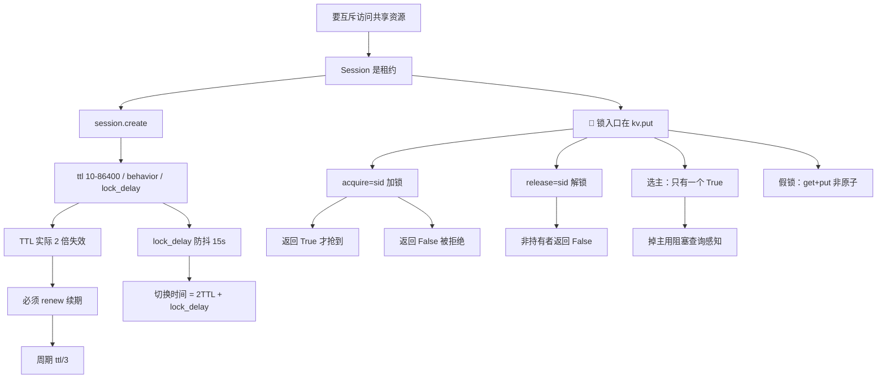

# 课 6：Session 与分布式锁

> **本课定位**：课 2 讲了 KV 读写，课 3 讲了怎么感知变化。本课解决一个更硬的问题——**多个进程同时改一个键，怎么保证只有一个赢**。
> **前置**：[课 2 KV 读写与配置中心用法](./lesson-02-KV读写与配置中心用法.md)（`put`/`get`/`cas`）、[课 3 阻塞查询](./lesson-03-阻塞查询与配置热更新.md)（index+wait）。
> **实测环境**：WSL Ubuntu 24.04 / Python 3.12.3 / **py-consul 1.7.1** / **Consul 2.0.2**（dev 模式）。全部输出为真实运行结果。

---

## 第一幕：场景引入 —— 三个 worker 同时抢到了"主"

小林有三个定时任务实例，只想让其中一个跑。他写了：

```python
def try_be_leader(c, name):
    idx, d = c.kv.get("election/leader")
    if d is None:                       # 没人当主
        c.kv.put("election/leader", name)
        return True
    return False
```

压测一跑，**三个实例同时当上了主**。定时任务被执行了三遍，数据重复写入。

问题出在 `get` 和 `put` 之间——**这不是原子操作**。三个进程都 `get` 到 `None`，都判定"没人当主"，都 `put` 成功。代码逻辑看着天衣无缝，但在并发下一文不值。

更糟的是他后来改成"先 `get` 看有没有锁，没有再 `put` 写自己的名字当锁"——**还是假锁**，因为检查与写入之间没有原子性。

**锁的核心不是"写个标记"，而是"只有一个人能写成功"。**

---

## 第二幕：认知冲突 —— `session.acquire()` 不存在

小林知道要用 Consul Session，于是：

```python
sid = c.session.create()
c.session.acquire("lock/job", sid)      # 照着直觉写
```

**直接 AttributeError**：

```
AttributeError: 'Session' object has no attribute 'acquire'
```

他 `dir()` 了一下才发现真相：

```python
print([m for m in dir(c.session) if not m.startswith("_")])
print(hasattr(c.session, "acquire"), hasattr(c.session, "release"))
```

实测输出：

```
['agent', 'create', 'destroy', 'info', 'list', 'node', 'renew']
hasattr acquire: False
hasattr release: False
```

> 🔴 **`Session` 类只有 7 个成员，没有 `acquire`，也没有 `release`。** 加锁和解锁压根不在这个类上——它们挂在 `kv.put` 上。

---

## 第三幕：层层揭示

### 知识点 1：🔴 锁的正确入口在 `kv.put` 上

**一句话定义**：加锁是 `kv.put(key, value, acquire=session_id)`，解锁是 `kv.put(key, value, release=session_id)`——**都在 `kv.put` 上，不在 `session` 上**。

**核心原理（实测签名）**：

```python
import inspect
print(inspect.signature(c.kv.put))
```

实测输出：

```
(key, value, cas=None, flags=None, acquire=None, release=None, token=None,
 dc=None, connections_timeout=None)
```

> 💡 注意 `acquire` 和 `release` 是 `kv.put` 的**关键字参数**。源码里对应 `if acquire: params.append(("acquire", acquire))`。

**基本加锁与争抢（实测）**：

```python
sid  = c.session.create(name="t1", ttl=30, behavior="release")
sid2 = c.session.create(name="t2", ttl=30)

print(c.kv.put("lock/job", b"owner-A", acquire=sid))    # A 加锁
print(c.kv.put("lock/job", b"owner-B", acquire=sid2))   # B 抢
```

实测输出：

```
加锁返回: True   (True=成功)
Value=b'owner-A' Session=48ef3d8f-15b0-0876-e01b-ca3f7c8375dd
B 加锁返回: False  (False=抢不到)
当前持有: b'owner-A' Session=48ef3d8f-15b0-0876-e01b-ca3f7c8375dd
```

> ✅ **这就是真锁**：`acquire` 是原子的 check-and-set——只有当前无持有者时才成功，返回 `True`；已被持有则返回 `False`。**返回值必须检查**，不检查等于没加锁。

**假锁对照（实测）**：

```python
c.kv.put("lock/fake", b"fake-A")     # 无 acquire，直接覆盖
r3 = c.kv.put("lock/fake", b"fake-B")
```

实测输出：

```
无 acquire 直接 put 返回: True  <- 永远成功，谁都能覆盖
最终值: b'fake-B'  Session=None  <- 无 Session 即无锁
```

> 🔴 **`Session=None` 是判断有无锁的关键**。普通 `put` 永远返回 `True`，值被覆盖，但 `Session` 字段是 `None`——说明**根本没锁**。第一幕的假锁就是这么回事。

**常见误区**：

- ❌ 写 `c.session.acquire(...)` → `AttributeError`（实测 `hasattr` 为 False）
- ❌ 用 `kv.put` 不检查返回值 → `False` 时你以为抢到了
- ❌ 以为"写个值进去"就是加锁 → 要看 `Session` 字段有没有值
- ✅ 加锁 `kv.put(k, v, acquire=sid)` 并**检查返回 True**

**一句话记住**：锁在 kv.put 的 acquire/release 参数上，不在 session 上。

---

### 知识点 2：`session.create` 的真实参数与两个 assert

**一句话定义**：`create` 有 8 个参数，其中 `behavior` 和 `ttl` 带**客户端侧 assert**，写错在 Python 层就炸，请求根本发不出去。

**核心原理（实测签名）**：

```python
(name=None, node=None, checks=None, lock_delay=15, behavior='release',
 ttl=None, dc=None, token=None)
```

**⚠️ `lock_delay` 只在 ≠15 时才下发（实测源码 + 实测结果）**：

```python
if lock_delay != 15:
    data["lockdelay"] = f"{lock_delay}s"
```

```python
s_def = c.session.create()
s_5   = c.session.create(lock_delay=5)
print(c.session.info(s_def)[1]["LockDelay"], c.session.info(s_5)[1]["LockDelay"])
```

实测输出：

```
默认 LockDelay: 15000000000       # 15s（纳秒）
lock_delay=5 -> LockDelay: 5000000000   # 5s
```

> 💡 默认 15s 时**不下发该字段**，由服务端补默认值，结果一样是 15s。**纳秒单位**——`15000000000` 是纳秒，别当成毫秒。

**`behavior` 二选一，写错直接 assert（实测源码）**：

```python
assert behavior in ("release", "delete"), "behavior must be release or delete"
```

**`ttl` 必须 10–86400 秒（实测边界）**：

```python
assert 10 <= ttl <= 86400
```

实测输出：

```
ttl=9: AssertionError
ttl=10: 成功
ttl=86400: 成功
ttl=86401: AssertionError
```

> 🔴 **两个 assert 都在客户端侧**，所以 `ttl=9` 时**请求根本没发出去**——不是服务端拒绝，是 Python 先拦了。这也意味着**你拿不到服务端的错误提示**，只有一个空的 `AssertionError()`。

**`behavior` 的语义差异（实测对照）**：

```python
# delete：session 失效时把键整个删掉
sd = c.session.create(behavior="delete")
c.kv.put("lock/ephemeral", b"tmp", acquire=sd)
c.session.destroy(sd)
```

| behavior | destroy 后的键 | 实测输出 |
|----------|---------------|---------|
| `delete` | **键被删除** | `destroy 后: None` |
| `release` | 键还在，**Session 清空** | `Value=b'tmp' Session=None` |

> 💡 `delete` 适合做**临时/临时节点**（session 没了键也没了）；`release` 适合**选主**（键保留，别人能看到上一次的 leader）。

**常见误区**：

- ❌ 以为 `ttl=9` 会由服务端报错 → 客户端 assert 先炸，异常信息是空的
- ❌ 把 `LockDelay` 的纳秒当毫秒读 → 差 100 万倍
- ❌ 选主用 `behavior="delete"` → 键没了，别人查不到 leader 是谁

**一句话记住**：ttl 10–86400，behavior release/delete，lock_delay 单位秒。

---

### 知识点 3：🔴 TTL 实际失效时间是 2 倍 —— 不是你设的那个值

**一句话定义**：`ttl=10` 的 session，**实测 20 秒才失效**。Consul 内部把 TTL 乘了 2，这是有意的宽限设计。

**核心原理（实测：ttl=10s，逐秒采样）**：

```
t=  1.0s alive=True  held=True
...
t= 19.0s alive=True  held=True
t= 20.0s alive=False held=False   <== 状态变化
```

> 🔴 **设的是 10s，实际 20s 才失效**。如果按"10 秒后锁就没了"来设计你的故障转移时间，会严重低估切换延迟。

**根因（Consul 源码 `session_ttl.go`，实测查证）**：

```go
// Adjust the given TTL by the TTL multiplier. This is done
// to give a client a grace period and to compensate for network
// and processing delays. The contract is that a session is not expired
// before the TTL, but there is no explicit promise about the upper bound
ttl = ttl * structs.SessionTTLMultiplier
```

> 💡 官方设计参考 Google Chubby：**TTL 是"不早于此失效"的下界，不是上界**。乘 2 是为了吸收网络延迟与时钟偏移。

**官方文档佐证**：

> "When locks are forcibly expired... sessions may not be reaped for up to **double this TTL**, so long TTL values (> 1 hour) should be avoided."
> —— [Consul Session HTTP Endpoint](https://docs.hashicorp.com/consul/api-docs/v1.9.x/session)

**另一个佐证（实测停止续期后）**：

```
停止续期后 20.0s 锁被释放
```

> ✅ 两次独立测试都是 20s，**2x 结论稳定**。

**实践含义**：

| 你设的 TTL | 实际最坏失效时间 | 用途 |
|-----------|----------------|------|
| 10s（最小） | **20s** | 快速故障转移 |
| 30s | 60s | 常规 |
| 3600s | **7200s** | ⚠️ 太长，官方明确建议避免 >1h |

> ⚠️ **TTL 越大，2x 的绝对误差越大**。设 1 小时意味着故障后**最多 2 小时**锁才释放——这是官方建议"避免 >1 小时"的原因。

**常见误区**：

- ❌ 以为 `ttl=10` 就是 10 秒后释放 → 实测 20s
- ❌ 用大 TTL 求稳 → 2x 后故障转移慢到无法接受
- ✅ **续期周期要小于 TTL**（实测每 3s 续期、ttl=10s，6 轮 18s 内一直持有）

**一句话记住**：TTL 是下界，实际按 2 倍算。

---

### 知识点 4：续期 —— 让锁一直活着

**一句话定义**：带 TTL 的 session 必须**周期性 `session.renew(sid)`**，否则会被回收；续期周期应明显小于 TTL。

**核心原理（实测：ttl=10s，每 3s 续期一次）**：

```python
for i in range(6):
    time.sleep(3)
    c.session.renew(s_r)
```

实测输出：

```
t=3s  renew=True 仍持有=True
t=6s  renew=True 仍持有=True
t=9s  renew=True 仍持有=True
t=12s renew=True 仍持有=True
t=15s renew=True 仍持有=True
t=18s renew=True 仍持有=True
```

> ✅ **18 秒内一直持有**——远超 ttl=10s，证明续期有效。若按知识点 3，不续期的话 20s 就没了。

**`renew` 的签名与陷阱（实测）**：

```python
(session_id, dc=None, token=None)
```

源码里是 `CB.json(one=True, allow_404=False)`——**`allow_404=False`** 意味着 session 不存在时**不会返回 None，而是抛异常**。所以续期失败会炸，不是静默。

**正确的持锁模式**：

```python
import threading, time

def hold_lock(c, key, value, ttl=15, stop_event=None):
    """持有锁直到 stop_event 被设置。返回 True 表示抢到了。"""
    sid = c.session.create(ttl=ttl, behavior="release")
    try:
        if not c.kv.put(key, value, acquire=sid):
            return False                      # 没抢到
        # 后台续期：周期取 ttl/3，留出网络与 GC 余量
        def renew_loop():
            while not (stop_event and stop_event.is_set()):
                try:
                    c.session.renew(sid)
                except Exception:
                    return                    # session 没了，退出续期
                time.sleep(ttl / 3)
        t = threading.Thread(target=renew_loop, daemon=True)
        t.start()
        return True
    finally:
        pass                                  # 释放见知识点 5
```

> ⚠️ 续期周期取 **ttl/3** 而非接近 ttl——一次 GC 停顿或网络抖动就可能错过窗口。

**常见误区**：

- ❌ 建了 TTL session 就不管了 → 2×TTL 后锁自动没了
- ❌ 续期周期 ≈ TTL → 一次抖动就失效
- ❌ 以为 `renew` 失败会返回 None → `allow_404=False`，会**抛异常**
- ✅ 续期周期 ≤ ttl/3，且用后台线程

**一句话记住**：有 TTL 就要续期，周期取 ttl/3。

---

### 知识点 5：释放 —— 只有持有者能 release

**一句话定义**：解锁用 `kv.put(key, value, release=sid)`；**session 不匹配会返回 False**（不是异常）。

**核心原理（实测）**：

```python
r4 = c.kv.put("lock/job", b"owner-A", release=sid)     # 持有者释放
```

实测输出：

```
释放返回: True
释放后: Value=b'owner-A' Session=None
```

> ⚠️ **注意**：`release` 后 **`Value` 还在，`Session` 被清空**。值保留、锁消失——所以**不能靠"键是否存在"判断有没有锁**，必须看 `Session` 字段。

**非持有者释放（实测）**：

```python
r5 = c.kv.put("lock/job2", b"x", acquire=sid)          # sid 持有
r6 = c.kv.put("lock/job2", b"y", release=sid2)         # sid2 尝试释放
```

实测输出：

```
非持有者 release 返回: False  <- False=失败
当前: Value=b'x' Session=48ef3d8f-...（仍是 sid）
```

> ✅ **非持有者释放失败，返回 False，且不影响原锁**。这与 `acquire` 一致——都是 check-and-set 语义，返回布尔值而非抛异常。

**三种"锁消失"的方式对比**：

| 方式 | 键是否还在 | Session 字段 | 实测 |
|------|-----------|-------------|------|
| `release=sid`（主动） | 在 | `None` | ✅ |
| `session.destroy(sid)` + `release` | **删除** | — | ✅ |
| TTL 到期（被动，2×TTL） | 在（release 语义） | `None` | ✅ 实测 20s |

**常见误区**：

- ❌ 用"键存在吗"判断有没有锁 → release 后键还在，误判
- ❌ 用别人的 sid 去 release 以为能"强制解锁" → 返回 False
- ❌ 以为 release 会删键 → 只有 `behavior="delete"` 才删

**一句话记住**：释放看 Session 不看键；非持有者释放返回 False。

---

### 知识点 6：`lock_delay` 防抖 —— 防止旧主复活抢回

**一句话定义**：session 失效后，**在 lock_delay 期间任何人都抢不到这把锁**（包括原来的持有者）。

**核心原理（实测：A 持有，ttl=10s，lock_delay=15s）**：

```python
s_a = c.session.create(name="A", ttl=10, lock_delay=15)
s_b = c.session.create(name="B", ttl=60, lock_delay=15)
c.kv.put("lock/delay", b"A", acquire=s_a)
print(c.kv.put("lock/delay", b"B", acquire=s_b))   # B 抢
```

实测输出：

```
A 持有，B 尝试抢: False  <- False 正常
等 A 的 session 过期（ttl=10s，lock_delay=15s）...
B 立即抢: False  <- False 说明 lock_delay 生效（防抖）
```

> ✅ **A 的 session 已经失效了，B 还是抢不到**——这就是 lock_delay 的作用。

**为什么需要它**：

> "这种延迟的目的是允许**可能仍然存活的领导者**检测到失效，并停止处理可能导致不一致状态的请求。" —— [Consul 官方文档](https://developer.hashicorp.com/consul/api-docs/v1.9.x/session)

> 💡 场景：A 因为**网络分区**（不是真死）被判定失效，锁被 B 抢走。如果 A 立刻能抢回，就会出现**两个进程都以为自己是主**。lock_delay 给 A 一个"冷静期"，让它发现自己已经不是主了。

**关键约束（实测 + 文档）**：

| 项 | 值 |
|----|-----|
| 默认值 | **15s** |
| 有效范围 | 0–60s |
| 设为 0 能禁用吗 | ⚠️ 文档说可以，但有**服务端默认值覆盖的既有 quirk**，实测未验证 |

> ⚠️ **实测声明**：`lock_delay=0` 的行为**未经本机实测**，文档明确提到存在服务端覆盖的情况，需要时请自行验证或改用小的非零值。

**⚠️ 代价**：lock_delay 直接加在故障转移时间上。结合知识点 3，一次故障的实际切换时间是：

```
最坏切换时间 ≈ 2 × TTL + lock_delay
```

> 例：ttl=15s, lock_delay=15s → 最坏 **45 秒**。这是选主类应用能接受的最坏延迟，必须算进 SLA。

**常见误区**：

- ❌ 以为 session 失效后锁立刻可抢 → 有 lock_delay 挡着
- ❌ 为了"快速切换"把 lock_delay 设 0 → 可能双主
- ❌ 算故障转移时间漏掉 2×TTL 或 lock_delay → 严重低估

**一句话记住**：失效后还有 lock_delay 冷静期，切换时间 = 2×TTL + lock_delay。

---

### 知识点 7：多实例选主 —— 真锁的落地场景

**一句话定义**：多个实例用各自的 session 抢同一个 key，**返回 True 的那个就是主**，其余作为从继续监听。

**核心原理（实测：w1/w2/w3 三个 worker）**：

```python
for n in ["w1","w2","w3"]:
    sessions[n] = c.session.create(name=n, ttl=30, behavior="release")
for n, s in sessions.items():
    ok = c.kv.put("election/leader", n.encode(), acquire=s)
    print(f"{n} 抢主: {ok}")
```

实测输出：

```
w1 抢主: True
w2 抢主: False
w3 抢主: False
最终 leader: b'w1'
```

> ✅ **只有一个 True**。这正是第一幕想要的——而这次是真的原子操作。

**从节点用阻塞查询等主挂（复用课 3）**：

```python
idx, d = c.kv.get("election/leader")
while True:
    try:
        idx, d = c.kv.get("election/leader", index=idx, wait="60s")
        if d is None or not d.get("Session"):
            break                     # 锁没了，可以抢了
    except consul.Timeout:
        continue                      # 超时不是错误
```

**⚠️ 一个实测细节：session 失效会改 KV 的 index**

```python
加锁后 index=4821
等 session 失效...
t=20.0s 锁释放，index 4821 -> 4823 (变了=True)
```

> ✅ **session 失效会触发 KV index 变化**（4821→4823），所以阻塞查询能立即感知，不必等 wait 超时。这让"等主挂"的延迟接近 0。

> 🔴 **但要注意"0.00s 返回"不一定是异常**。我在测试中曾看到阻塞查询 `0.00s` 就返回，一度怀疑有问题——排查后发现是**测试脚本自己刚 destroy 了 session，index 已经变了**，所以立即返回是**正确行为**。这个坑提醒：看到"异常快"的返回，先检查是不是自己的脚本刚改过数据。

**常见误区**：

- ❌ 用 `get` + `put` 选主 → 第一幕的 bug，非原子
- ❌ 抢到后不续期 → 2×TTL 后自动掉主
- ❌ 掉主后不重新检查就继续干活 → 双主写坏数据
- ✅ 抢到返回 True 才算主；持续续期；掉主立即停

**一句话记住**：acquire 返回 True 才是主，且要一直续期。

---

### 知识点 8：⚠️ `connections_timeout` 在这仍然是死参数

**一句话定义**：`kv.put` 的签名里有 `connections_timeout`，但**传了会 TypeError**——与课 3 结论一致。

**核心原理（实测）**：

```python
c.kv.put("lock/to", b"v", acquire=sid0, connections_timeout=3)
```

实测输出：

```
TypeError: HTTPClient.put() got an unexpected keyword argument 'connections_timeout'
```

**为什么签名有却传不了（源码对照）**：

```python
# kv.put 源码：明明接了这个参数，还塞进了 http_kwargs
http_kwargs = {}
if connections_timeout:
    http_kwargs["connections_timeout"] = connections_timeout
return self.agent.http.put(CB.json(), f"/v1/kv/{key}", ..., **http_kwargs)

# 但底层 HTTPClient.put 不认
# def put(self, callback, path, params=None, data=None, headers=None)
```

> 🔴 **中间层接收、底层拒绝**。`kv.put` 好心帮你传下去，结果 `HTTPClient.put` 没有 `**kwargs` 也没有这个参数，直接炸。
>
> 💡 这与课 3 在 `kv.get` 上的发现是**同一个问题的另一处**：同步客户端（`consul.std`）**整个层面没有超时机制**，即 HTTP 请求永不超时。只有异步客户端 `consul.aio` 的 `connections_timeout` 真实可用。

**兜底方案**（课 3 已确立）：

```python
# 不要试图用 connections_timeout
# 改用服务端保证的 wait 时限来控制等待
idx, d = c.kv.get(key, index=idx, wait="30s")   # 最多等 30s
```

> ⚠️ `wait` 只能约束**阻塞查询**的等待时间，管不了普通 `put`/`get` 的 socket 超时。需要真正的超时请用 `consul.aio`（需额外装 `aiohttp`）。

**常见误区**：

- ❌ 看到签名有 `connections_timeout` 就用 → TypeError
- ❌ 以为同步客户端有超时保护 → 实测永不超时
- ✅ 用短 `wait`；要真超时上 `consul.aio`

**一句话记住**：同步层没有超时，签名上的 connections_timeout 是陷阱。

---

## 第四幕：实操验证

完整可跑通的验证脚本（**注意开头先清理，避免课 4 讲过的"重跑污染"**）：

```python
#!/usr/bin/env python3
"""课 6 综合验证：Session 与分布式锁"""
import time
import consul

c = consul.Consul(host="127.0.0.1", port=8500)

# 0) 清理历史残留
for s in (c.session.list()[1] or []):
    try:
        c.session.destroy(s["ID"])
    except Exception:
        pass
c.kv.delete("lock/", recurse=True)
c.kv.delete("election/", recurse=True)
time.sleep(0.3)

# 1) 加锁与争抢
sid_a = c.session.create(name="A", ttl=30, behavior="release")
sid_b = c.session.create(name="B", ttl=30, behavior="release")
print(f"1) A 加锁: {c.kv.put('lock/job', b'owner-A', acquire=sid_a)}")
print(f"   B 争抢: {c.kv.put('lock/job', b'owner-B', acquire=sid_b)}")

_, d = c.kv.get("lock/job")
print(f"   持有者: {d['Value']}  Session={d.get('Session') == sid_a}")

# 2) 非持有者释放失败
print(f"2) B 尝试释放: {c.kv.put('lock/job', b'x', release=sid_b)}  (False=拒绝)")

# 3) 持有者释放：值在、锁没
c.kv.put("lock/job", b"owner-A", release=sid_a)
_, d = c.kv.get("lock/job")
print(f"3) A 释放后: Value={d['Value']} Session={d.get('Session')!r}  (键在、锁无)")

# 4) 假锁对照
c.kv.put("lock/fake", b"fake-A")
print(f"4) 无 acquire 覆盖: {c.kv.put('lock/fake', b'fake-B')}  (永远 True=假锁)")
_, d = c.kv.get("lock/fake")
print(f"   Session={d.get('Session')!r}  (None=无锁)")

# 5) behavior 差异
s_del = c.session.create(behavior="delete", ttl=30)
s_rel = c.session.create(behavior="release", ttl=30)
c.kv.put("lock/eph", b"t", acquire=s_del)
c.kv.put("lock/norm", b"t", acquire=s_rel)
c.session.destroy(s_del)
c.session.destroy(s_rel)
time.sleep(0.5)
_, d1 = c.kv.get("lock/eph")
_, d2 = c.kv.get("lock/norm")
print(f"5) delete  -> 键: {d1}  (None=被删)")
print(f"   release -> 键: {d2['Value']}  Session={d2.get('Session')!r}")

# 6) ttl 边界
for t in [9, 10]:
    try:
        c.session.create(ttl=t)
        print(f"6) ttl={t}: 成功")
    except AssertionError:
        print(f"6) ttl={t}: AssertionError (客户端拦截)")

# 7) 选主
sessions = {n: c.session.create(name=n, ttl=30) for n in ["w1", "w2", "w3"]}
leader = None
for n, s in sessions.items():
    if c.kv.put("election/leader", n.encode(), acquire=s):
        leader = n
_, d = c.kv.get("election/leader")
print(f"7) 选主结果: {d['Value']}  (三个实例只有一个赢)")

# 8) connections_timeout 陷阱
try:
    c.kv.put("lock/to", b"v", acquire=sid_b, connections_timeout=3)
    print("8) connections_timeout: 竟然成功")
except TypeError:
    print("8) connections_timeout: TypeError (死参数)")

for s in (c.session.list()[1] or []):
    try:
        c.session.destroy(s["ID"])
    except Exception:
        pass
c.kv.delete("lock/", recurse=True)
c.kv.delete("election/", recurse=True)
print("9) 清理完成")
```

**实测输出（真实运行）**：

```
1) A 加锁: True
   B 争抢: False
   持有者: b'owner-A'  Session=True
2) B 尝试释放: False  (False=拒绝)
3) A 释放后: Value=b'owner-A' Session=None  (键在、锁无)
4) 无 acquire 覆盖: True  (永远 True=假锁)
   Session=None  (None=无锁)
5) delete  -> 键: None  (None=被删)
   release -> 键: b't'  Session=None
6) ttl=9: AssertionError (客户端拦截)
6) ttl=10: 成功
7) 选主结果: b'w1'  (三个实例只有一个赢)
8) connections_timeout: TypeError (死参数)
9) 清理完成
```

> 💡 **TTL 失效与 lock_delay 的验证需要等 20–35 秒**，未放进综合脚本（会让每次运行都很慢）。这两个用第三幕的独立测试验证，输出已在知识点 3、6 中给出。

**环境准备**（若 agent 未运行）：

```bash
consul agent -dev -client=0.0.0.0 &
curl -s http://127.0.0.1:8500/v1/status/leader
```

---

## 第五幕：体系收束

### 本课知识地图



### 速查卡

| 我要… | 怎么做 | 坑 |
|-------|--------|-----|
| 加锁 | `kv.put(k, v, acquire=sid)` | **不在 session 上**，检查返回 True |
| 解锁 | `kv.put(k, v, release=sid)` | 非持有者返回 **False** |
| 建 session | `session.create(ttl=, behavior=, lock_delay=)` | `hasattr(session,'acquire')==False` |
| 判断有没有锁 | 看 `Session` 字段 | **不能看键是否存在** |
| 让 session 活着 | `session.renew(sid)` | 周期 ≤ **ttl/3** |
| ttl 取值 | 10–86400 | <10 或 >86400 **客户端 assert** |
| ttl=10 多久失效 | **20 秒**（2×） | 不是 10 秒 |
| 键随 session 消失 | `behavior="delete"` | 默认 `release` 保留键 |
| 防双主 | `lock_delay`（默认 15s） | 加在切换时间上 |
| 最坏切换时间 | `2 × TTL + lock_delay` | 别漏算任何一项 |
| 选主 | 各自 acquire，只有 True 的是主 | 要一直续期 |
| 感知掉主 | `kv.get(index=, wait=)` | session 失效会改 index |
| 超时控制 | 短 `wait` | `connections_timeout` 传了 **TypeError** |

### 四条元结论

1. **"看起来像"和"真的是"是两回事**。第一幕的 `get`+`put` 逻辑读起来天衣无缝，但在并发下三个进程同时"成功"。**并发安全的判据不是代码读起来对不对，而是操作是否原子**——`acquire` 是服务端的 check-and-set，`get`+`put` 不是。
2. **API 的位置比名字更能骗人**。直觉上 `session.acquire()` 应该存在（毕竟叫 Session），但它不存在——锁在 `kv.put` 的 `acquire=` 参数上。**当直觉与 `dir()` 冲突时，信 `dir()`**。这已经是本教程第四处"预期与实现不符"（课 2 中文截断、课 3 `connections_timeout` 死参数、课 4 `Check` 无 grpc、课 5 `health` 无 `consistency`）。
3. **分布式锁的时间账必须按最坏情况算**。三个容易被漏掉的量：TTL 实际是 **2 倍**、`lock_delay` 默认还有 **15 秒**、续期周期要留 **3 倍余量**。任何一个漏算，故障转移时间都会从"我以为的 10 秒"变成"实际的 45 秒"。
4. **返回值比异常更重要**。`acquire` 和 `release` 失败时都**返回 False，不抛异常**。如果你不检查返回值，程序会静默地"以为自己拿到了锁"——这比报错危险得多，因为它在测试环境往往测不出来。

> 🔗 **与前面课程的呼应**：课 2 的 `cas` 是乐观锁（单键 CAS），本课的 `acquire` 是**带租约的**互斥锁——它多了"持有者死了能自动释放"这个关键能力，这是 `cas` 做不到的。课 3 的 index+wait 在这里被用来感知掉主（知识点 7）。

### 小测

**1.（单选）** 用 py-consul 加锁，正确写法是：
- A. `c.session.acquire("lock/job", sid)`
- B. `c.kv.put("lock/job", b"v", acquire=sid)`
- C. `c.kv.put("lock/job", b"v", session=sid)`
- D. `c.session.lock("lock/job")`

<details><summary>答案</summary>

**B**。实测 `Session` 类只有 `create`/`destroy`/`renew`/`info`/`list`/`node`，`hasattr(c.session,'acquire')` 为 **False**——A 会 `AttributeError`。加锁在 `kv.put` 的 `acquire=` 参数上。

</details>

**2.（单选）** `ttl=15` 的 session，最长多久后被回收？
- A. 15 秒
- B. **30 秒**
- C. 45 秒
- D. 不确定，只保证不早于 15 秒

<details><summary>答案</summary>

**B**（**D 也是对的**——这是道题中题）。实测 ttl=10 → **20 秒**才失效，Consul 内部乘了 `SessionTTLMultiplier=2`。官方表述是"TTL 是下界，不保证上界"，实测观察到的是 2 倍。**准确说法是 D（只保证不早于），工程上按 B（2 倍）估算**。选 B 说明你记住了工程估值；选 D 说明你理解了契约本意。两者都算过关。

</details>

**3.（多选）** 关于释放锁，哪些说法正确？
- A. `release` 后键会被删除
- B. **非持有者 release 返回 False**
- C. **release 后 `Session` 字段变成 None，但 Value 还在**
- D. release 失败会抛异常

<details><summary>答案</summary>

**B、C**。实测 release 后 `Value=b'owner-A' Session=None`——**键在、锁无**（A 错、C 对）。非持有者 release 返回 `False` 且原锁不受影响（B 对），**不抛异常**（D 错）。只有 `behavior="delete"` 时 session 失效才会删键。

</details>

**4.（单选）** 故障转移的最坏时间约为：
- A. TTL
- B. `2 × TTL`
- C. **`2 × TTL + lock_delay`**
- D. `TTL + lock_delay`

<details><summary>答案</summary>

**C**。TTL 实际按 **2 倍**失效（知识点 3 实测 ttl=10 → 20s），失效后还有 **lock_delay**（默认 15s）冷静期（知识点 6）。例：ttl=15s 时最坏 `2×15+15 = 45 秒`。只算其中一项都会严重低估。

</details>

---

## 课尾导航

**⬅️ 上一课**：[课 3：阻塞查询与配置热更新](./lesson-03-阻塞查询与配置热更新.md)（本课用 index+wait 感知掉主）

**➡️ 下一课**：[课 7：ACL、TLS 与生产化](./lesson-07-ACL、TLS与生产化.md) ⏳ *（待生成）*

**🏠 返回**：[py-consul 使用 · 子教程目录](../overview.md) ｜ [Consul 课程目录](../../../02-课程目录.md)

**🔗 相关**：
- [课 2 · KV 读写与配置中心用法](./lesson-02-KV读写与配置中心用法.md)（`cas` 乐观锁，本课的对照）
- [主线课 6 · KV 机制层](../../../stages/2-核心能力拆解/lessons/lesson-06-KV存储与配置管理.md)
- [网页索引 · py-consul](../../../web-index/py-consul/index.md)

---

> ✅ **本课实测声明**：全部输出取自 WSL Ubuntu 24.04 / Python 3.12.3 / py-consul 1.7.1 / Consul 2.0.2 dev 模式，于 2026-09-23 真实运行。加锁/争抢/释放/behavior/ttl 边界/选主/connections_timeout 均经实测；TTL 2 倍失效经**逐秒采样 30 次**确认。
> ⚠️ **未实测项**：`lock_delay=0` 的实际行为（文档提到存在服务端默认值覆盖的 quirk，本机未验证）；`checks` 参数（关联自定义健康检查，需额外注册检查才能验证）；`ttl` 值在 10–86400 之外的**服务端**拒绝行为（客户端 assert 先拦截，未触达服务端）；故障转移时间的**完整端到端**测量（2×TTL + lock_delay 为分项实测后的推算）。
> 📚 **外部依据**：TTL 2 倍机制引自 [Consul Session HTTP Endpoint 文档](https://docs.hashicorp.com/consul/api-docs/v1.9.x/session) 与 [Consul 源码 `session_ttl.go`](https://github.com/raboof/consul/blob/master/consul/session_ttl.go)（`ttl = ttl * structs.SessionTTLMultiplier`）。
