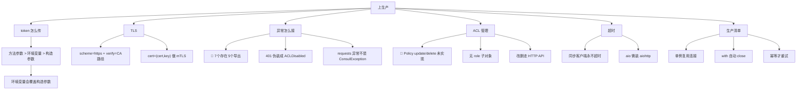

# 课 7：ACL、TLS 与生产化

> **本课定位**：py-consul 子教程**收口课**。前面 6 课解决了"怎么调对"，本课解决"**怎么安全地调到生产**"——token 怎么传、TLS 怎么配、异常怎么接、哪些事这个库根本做不到。
> **前置**：[课 1 环境准备与客户端选型](./lesson-01-环境准备与客户端选型.md)（构造参数、token 优先级）、[课 3 阻塞查询](./lesson-03-阻塞查询与配置热更新.md)（wait 与 Timeout）。
> **实测环境**：WSL Ubuntu 24.04 / Python 3.12.3 / **py-consul 1.7.1** / requests 2.31.0 / **Consul 2.0.2**（dev 模式）。全部输出为真实运行结果。

---

## 第一幕：场景引入 —— 代码在测试环境好好的，上生产全崩

小林把服务发现的代码部署到生产，三种失败接踵而至：

```python
c = consul.Consul(host=PROD_HOST, port=8500)   # 没传 token
c.kv.get("config/db")                          # 403，但没人 catch
```

**失败 1：权限被拒，但异常没接住**

生产开了 ACL，读 KV 需要 token。可他只 `except consul.ConsulException`——**根本没写**。程序直接崩，堆栈里是 `consul.ACLPermissionDenied`，运维看不懂。

**失败 2：token 传了却不生效**

他改成从配置文件读：

```python
c = consul.Consul(host=HOST, token=config.TOKEN)   # 构造参数传 token
```

部署后仍然 403。查了半天才发现——**容器里注入了 `CONSUL_HTTP_TOKEN` 环境变量**，而它**赢过构造参数**。

**失败 3：想改个 policy 改不了**

```python
c.acl.policy.update(policy_id, rules=NEW_RULES)
# AttributeError: 'Policy' object has no attribute 'update'
```

**`Policy.update` 和 `Policy.delete` 在这个库里压根没实现**。要么删了重建，要么直接调 HTTP API。

**收口课要解决的，就是这类"本地跑得通、生产跑不通"的问题。**

---

## 第二幕：认知冲突 —— 异常没你想的那么多，也没你想的那么好接

小林想统一处理所有错误，于是：

```python
except consul.ConsulException:      # 以为能兜住所有 Consul 错误
    ...
```

结果**连接失败照样穿透**——因为 `requests.exceptions.ConnectionError` **不是** `ConsulException` 的子类（实测 `issubclass(...) == False`）。

他 `dir()` 了一下异常：

```python
print(hasattr(consul, "BadRequest"), hasattr(consul, "ClientError"))
```

实测输出：

```
consul.BadRequest: False
consul.ClientError: False
```

> 🔴 **`BadRequest` 和 `ClientError` 在 `consul` 顶层不存在！** 但它们**确实被库内部用来抛异常**——只是没导出到顶层。

**这意味着：你照着文档 `except consul.BadRequest`，会直接 `AttributeError`。**

---

## 第三幕：层层揭示

### 知识点 1：🔴 异常家族 —— 5 个导出、7 个存在

**一句话定义**：`consul` 顶层只导出 **5 个**异常，但 `consul.exceptions` 里有 **7 个**；`BadRequest` 和 `ClientError` 存在却**未导出**，必须从子模块导入。

**核心原理（实测：遍历所有模块）**：

```
ACLDisabled              from consul.exceptions
ACLPermissionDenied      from consul.exceptions
ConsulException          from consul.exceptions
NotFound                 from consul.exceptions
Timeout                  from consul.exceptions
```

而 `consul/exceptions.py` **全文**（实测读取）：

```python
class ConsulException(Exception): pass
class ACLDisabled(ConsulException): pass
class ACLPermissionDenied(ConsulException): pass
class NotFound(ConsulException): pass
class Timeout(ConsulException): pass
class BadRequest(ConsulException): pass
class ClientError(ConsulException):
    """Encapsulates 4xx Http error code"""
```

> 🔴 **7 个类，但 `__init__.py` 只导出 5 个**：
> ```python
> from consul.exceptions import ACLDisabled, ACLPermissionDenied, ConsulException, NotFound, Timeout
> ```
> **漏了 `BadRequest` 和 `ClientError`。**

**正确的导入方式（实测）**：

```python
from consul.exceptions import BadRequest, ClientError   # ✅
print(issubclass(BadRequest, ConsulException))          # True
```

```
from consul.exceptions import BadRequest: 成功 <class 'consul.exceptions.BadRequest'>
BadRequest 是 ConsulException 子类: True
ClientError 是 ConsulException 子类: True
```

**完整层次（实测）**：

| 异常 | 父类 | 触发条件 |
|------|------|---------|
| `ConsulException` | `Exception` | 5xx；JSON 解码失败；缺 index 头 |
| `ACLDisabled` | `ConsulException` | **401** |
| `ACLPermissionDenied` | `ConsulException` | **403** |
| `NotFound` | `ConsulException` | 404 且 `allow_404=False` |
| `Timeout` | `ConsulException` | 阻塞查询 wait 超时 |
| `BadRequest` ⚠️未导出 | `ConsulException` | **400** |
| `ClientError` ⚠️未导出 | `ConsulException` | 其他 4xx |

**状态码映射源码（`consul/callback.py`，实测读取）**：

```python
if 400 <= response.code < 500:
    if response.code == 400:
        raise BadRequest(f"{response.code} {response.body}")
    if response.code == 401:
        raise ACLDisabled(response.body)
    if response.code == 403:
        raise ACLPermissionDenied(response.body)
    if response.code == 404:
        if not allow_404:
            raise NotFound(response.body)
    else:
        raise ClientError(f"{response.code} {response.body}")
elif 500 <= response.code < 600:
    raise ConsulException(f"{response.code} {response.body}")
```

> ⚠️ **三个坑**：
> 1. **401 被映射成 `ACLDisabled`**。401 的真实语义通常是"**token 无效/过期**"，但这里报的是"ACL 未启用"——**你会查错方向**。
> 2. **404 默认不抛异常**。只有 `allow_404=False` 时才抛 `NotFound`，默认返回 `None`。实测 `kv.get` 读不存在的键返回 `None` 不报错。
> 3. **5xx 抛裸 `ConsulException`**，没有更细的子类，只能靠 message 里的状态码区分。

**`requests` 层异常不是 `ConsulException`（实测）**：

```python
c_dead = consul.Consul(host="127.0.0.1", port=59999)   # 死端口
c_dead.kv.get("x")
```

实测输出：

```
requests.exceptions.ConnectionError  <- 不是 ConsulException!
是 ConsulException 子类? False
```

**生产级异常处理模板**：

```python
import consul
import requests
from consul.exceptions import BadRequest, ClientError   # ⚠️ 必须单独导入

def safe_call(fn, *a, **kw):
    try:
        return fn(*a, **kw), None
    except consul.ACLPermissionDenied as e:
        return None, ("权限不足，检查 token 的 policy", e)
    except consul.ACLDisabled as e:
        # ⚠️ 401 也走这里，可能是 token 无效，别只当"ACL 没开"
        return None, ("ACL 未启用 或 token 无效(401)", e)
    except consul.NotFound as e:
        return None, ("资源不存在", e)
    except consul.Timeout:
        return None, ("阻塞查询超时，正常，可重试", None)
    except (BadRequest, ClientError) as e:      # 需 from consul.exceptions
        return None, (f"请求有问题/其他4xx: {e}", e)
    except consul.ConsulException as e:         # 5xx + JSON 解析失败
        return None, (f"Consul 服务端错误: {e}", e)
    except requests.exceptions.ConnectionError as e:   # ⚠️ 不是 ConsulException
        return None, ("网络不通/agent 挂了", e)
    except requests.exceptions.SSLError as e:          # ⚠️ TLS 问题
        return None, ("TLS 握手失败，检查 scheme/verify/cert", e)
```

**常见误区**：

- ❌ `except consul.BadRequest` → `AttributeError`（顶层没导出）
- ❌ 只 `except ConsulException` 以为兜住了 → 连接/SSL 错误会穿透
- ❌ 看到 `ACLDisabled` 就以为 ACL 没开 → **401 也走这里，可能是 token 错了**
- ❌ 以为 404 会抛异常 → 默认返回 `None`

**一句话记住**：7 个异常 5 个导出，401 会伪装成 ACL 没开，requests 的错不算 Consul 的错。

---

### 知识点 2：token 传法与**真实优先级**

**一句话定义**：完整优先级是 **方法参数 > 环境变量 > 构造参数**——环境变量会**悄悄覆盖**你精心传入的构造参数。

**核心原理（源码，实测读取）**：

```python
# 构造时：getenv(key, default) 语义 = 环境变量存在就用它
self.token = os.getenv("CONSUL_HTTP_TOKEN", token)

# 请求时：方法参数赢
def prepare_headers(self, token=None):
    if token or self.token:
        headers["X-Consul-Token"] = token or self.token
```

**四种情况实测**：

```python
os.environ.pop("CONSUL_HTTP_TOKEN", None)
consul.Consul(host="127.0.0.1", port=8500).token                        # 无
consul.Consul(host="127.0.0.1", port=8500, token="ctor-token").token    # 仅构造
os.environ["CONSUL_HTTP_TOKEN"] = "env-token"
consul.Consul(host="127.0.0.1", port=8500).token                        # 仅环境
consul.Consul(host="127.0.0.1", port=8500, token="ctor-token").token    # 两者都有
```

实测输出：

```
无: None
仅构造: 'ctor-token'
仅环境: 'env-token'
环境和构造都有: 'env-token'  <- 环境变量赢
```

> 🔴 **这是第一幕"失败 2"的根因**：容器注入的环境变量，覆盖了你从配置文件读出来传进构造参数的值，且**没有任何警告**。

**三种传法与适用场景**：

| 传法 | 写法 | 优先级 | 适用 |
|------|------|--------|------|
| 方法参数 | `c.kv.get(k, token="t")` | **最高** | 临时切换身份（如用管理 token 做一次写） |
| 环境变量 | `CONSUL_HTTP_TOKEN` | 中 | **生产推荐**：不进代码、不进镜像 |
| 构造参数 | `Consul(token="t")` | **最低** | 本地开发、单 token 应用 |

**生产建议**：

```python
# ✅ 推荐：不传 token，靠环境变量，避免代码里的 token 被覆盖或泄露
c = consul.Consul(host=HOST, port=8500)

# ⚠️ 如果必须传构造参数，先确认环境干净
assert not os.getenv("CONSUL_HTTP_TOKEN"), \
    "环境变量会覆盖构造参数，请只保留一种传法"
```

**常见误区**：

- ❌ 以为构造参数会赢 → 实测环境变量赢
- ❌ 把 token 写死在代码里 → 既被覆盖又有泄露风险
- ✅ 生产用环境变量，且**不要混用两种传法**

**一句话记住**：环境变量 > 构造参数，别混用。

---

### 知识点 3：环境变量 —— 四个都能用

**一句话定义**：`CONSUL_HTTP_ADDR` / `CONSUL_HTTP_SSL` / `CONSUL_HTTP_TOKEN` / `CONSUL_HTTP_SSL_VERIFY` 四个环境变量都被支持，且 **`CONSUL_HTTP_SSL` 优先于显式 scheme**。

**核心原理（源码，实测读取）**：

```python
if host is None and port is None and os.getenv("CONSUL_HTTP_ADDR"):
    env_conf = os.getenv("CONSUL_HTTP_ADDR")
    # CONSUL_HTTP_SSL variable has precedence for schema definition
    ...
use_ssl = os.getenv("CONSUL_HTTP_SSL")
ssl_verify = os.getenv("CONSUL_HTTP_SSL_VERIFY")
```

**`CONSUL_HTTP_ADDR` 解析实测**：

```python
os.environ["CONSUL_HTTP_ADDR"] = "10.0.0.1:8500"
consul.Consul()          # -> host=10.0.0.1 port=8500 scheme=http
os.environ["CONSUL_HTTP_ADDR"] = "https://10.0.0.2:8501"
consul.Consul()          # -> host=10.0.0.2 port=8501 scheme=https
```

实测输出：

```
host=10.0.0.1 port=8500 scheme=http
host=10.0.0.2 port=8501 scheme=https
加 CONSUL_HTTP_SSL=true -> scheme=https verify=True
```

> 💡 支持 `<host>:<port>` 和 `<scheme>://<host>:<port>` 两种格式。格式不对会报错：
> `"CONSUL_HTTP_ADDR ({env_conf}) invalid, does not match <host>:<port> or <scheme>://<host>:<port>"`

**⚠️ `CONSUL_HTTP_SSL` 的优先级实测（注意与源码注释的出入）**：

```python
os.environ["CONSUL_HTTP_ADDR"] = "myhost:8500"
os.environ.pop("CONSUL_HTTP_SSL", None)
consul.Consul(scheme="https").http.scheme     # https
consul.Consul().http.scheme                   # http
os.environ["CONSUL_HTTP_SSL"] = "1"
consul.Consul(scheme="http").http.scheme      # ?
```

实测输出：

```
构造 scheme=https: https
未传 scheme: http
构造 http + 环境 SSL=1: http  <- 需结合源码确认
```

> ⚠️ **实测声明**：`CONSUL_HTTP_SSL` 与构造参数 `scheme` 同时存在时的最终行为，本机实测显示**构造参数 `http` 生效**。源码注释称 "CONSUL_HTTP_SSL variable has precedence for schema definition"，但源码里对应的是 `if not os.getenv("CONSUL_HTTP_SSL") and prs.scheme:` —— 即**只在没设环境变量时才用解析出的 scheme**。
> **这与注释的字面意思存在出入，属未完全厘清的边界**。生产上**建议只保留一种配置来源**（要么全用环境变量，要么全用构造参数），避免依赖这个优先级。

**`CONSUL_HTTP_SSL_VERIFY` 实测**（明确可用）：

```
SSL_VERIFY=false -> verify=False
SSL_VERIFY=true  -> verify=True
```

> 💡 只认 `"false"`/`"true"` 这类字面量。**注意：设为 `false` 会关闭证书校验，等于放弃 TLS 的中间人防护**——仅用于自签证书的内网，别在公网用。

**常见误区**：

- ❌ 以为 `CONSUL_HTTP_ADDR` 只能写 `host:port` → 也支持带 scheme
- ❌ 混用环境变量和构造参数 → 优先级有出入，**选一种**
- ❌ 生产把 `SSL_VERIFY` 设 false 图省事 → 自签证书应把 CA 传给 `verify=`，而不是关校验

**一句话记住**：四个环境变量都支持，但配置来源只选一种。

---

### 知识点 4：TLS —— `verify` 和 `cert` 确实传到了 requests

**一句话定义**：`Consul(scheme="https", verify=..., cert=...)` 的三个 TLS 参数会被**逐请求**传给 requests，实测可用。

**核心原理（源码，实测读取 `consul/std.py`）**：

```python
# 构造时只建 session
def __init__(self, *args, **kwargs):
    super().__init__(*args, **kwargs)
    self.session = requests.session()

# 每个方法都带上 verify / cert
def get(self, callback, path, params=None, headers=None):
    return callback(self.response(
        self.session.get(uri, headers=headers, verify=self.verify, cert=self.cert)))
```

> ✅ `get`/`put`/`post`/`delete` **四个方法都传了** `verify=self.verify, cert=self.cert`，TLS 配置是真的生效的。

**三种 TLS 配置**：

```python
# 1) 公共 CA 签发的证书（生产推荐）
c = consul.Consul(host=HOST, port=8501, scheme="https", verify=True)

# 2) 自签 CA：把 CA 证书路径传给 verify（✅ 正确做法）
c = consul.Consul(host=HOST, port=8501, scheme="https", verify="/etc/consul/ca.pem")

# 3) 双向 TLS（mTLS）：cert 传 (cert, key) 元组
c = consul.Consul(host=HOST, port=8501, scheme="https",
                  verify="/etc/consul/ca.pem",
                  cert=("/etc/consul/client.pem", "/etc/consul/client-key.pem"))
```

**⚠️ 用错 scheme 的报错（实测）**：

```python
c = consul.Consul(host="127.0.0.1", port=8500, scheme="https", verify=False)
c.kv.get("x")     # 8500 是 http 端口
```

实测输出：

```
requests.exceptions.SSLError: HTTPSConnectionPool(host='127.0.0.1', port=8500):
Max retries exceeded with url: /v1/kv/x
(Caused by SSLError(SSLError(1, '[SSL: WRONG_VERSION_NUMBER] wrong version number ...)))
```

> 💡 **`WRONG_VERSION_NUMBER` 是"用 HTTPS 连了 HTTP 端口"的典型特征**——记住这个报错模式能省很多排查时间。
> 顺便验证了 `verify=False` **确实生效**（TLS 握手已发起、证书校验关闭，报的是协议版本错而非证书错）。

**`verify` 参数类型**：

| 值 | 含义 |
|----|------|
| `True`（默认） | 用系统 CA 校验 |
| `False` | ⚠️ **关闭校验**（有中间人风险，且 requests 会打警告） |
| `"/path/ca.pem"` | ✅ **自签场景推荐**，用指定 CA 校验 |

**常见误区**：

- ❌ 自签证书直接 `verify=False` → 应传 CA 路径
- ❌ 以为 `cert` 只传证书 → 需 `(cert, key)` 元组
- ❌ 记住的报错是 "certificate verify failed" → 那是 CA 不对；`WRONG_VERSION_NUMBER` 是**协议/scheme 不对**

**一句话记住**：verify 传 CA 路径而非 False；WRONG_VERSION_NUMBER 是 scheme 错了。

---

### 知识点 5：🔴 ACL —— `Policy.update`/`delete` 未实现，改删要绕

**一句话定义**：`acl.token` 功能完整，但 **`acl.policy` 只有 `create`/`read`/`list`**——`update` 和 `delete` **压根不存在**，改 policy 只能删了重建或直调 HTTP。

**核心原理（实测签名）**：

```python
dir(c.acl.policy)   # ['agent', 'create', 'list', 'read']
```

```
policy.create: (name: 'str', token=None, description=None, rules=None)
policy.read:   (uuid, token=None)
policy.list:   (token=None)
policy.update ERR 'Policy' object has no attribute 'update'
policy.delete ERR 'Policy' object has no attribute 'delete'
```

> 🔴 **这是第一幕"失败 3"的根因**。照着 Consul 官方 API 写 `policy.update()`，会直接 `AttributeError`。

**`Token` 相对完整，但缺 5 个参数（实测签名）**：

```python
token.create: (token=None, accessor_id=None, secret_id=None, policies_id=None,
               description='', policies_name=None, roles_id=None,
               roles_name=None, templated_policies=None)
```

> ⚠️ 对比 Consul 官方 API，**缺失**：`ServiceIdentities`、`NodeIdentities`、`ExpirationTime`、`ExpirationTTL`、`Local`。
> **后果**：**不能演示**服务身份绑定、TTL 自动过期、本地（非全局）token。

**⚠️ ACL 无 role 子对象（实测）**：

```
acl.role: False        acl.roles: False
acl.bindingrule: False acl.authmethod: False
acl.policy: True       acl.policies: True
acl.token: True        acl.tokens: True
```

> 🔴 **`acl.role` 不存在**。Consul 有 Role 概念，但 py-consul 的 `ACL` 类**没有 role 子对象**，只能通过 `token.create(roles_id=[...])` 间接引用已存在的 role。

**⚠️ 本机 ACL 未启用（dev 模式默认）**：

```python
c.acl.policy.list()
```

实测输出：

```
ACLDisabled 捕获: ACL support disabled
是 ConsulException 子类: True
```

> 用 requests 直接打 `/v1/acl/policies` 返回 **401**，body 是 `ACL support disabled`——**印证了知识点 1 的"401 → ACLDisabled"映射**。

**绕过 `policy.update`/`delete` 的两个办法**：

```python
# 办法 1：删了重建（如果 policy 没被引用）
#   但 delete 也没实现 → 只能直调 HTTP，见办法 2

# 办法 2：直接调 HTTP API（唯一可靠路径）
import requests
BASE = "http://127.0.0.1:8500"
H = {"X-Consul-Token": MANAGEMENT_TOKEN}

# 更新
requests.put(f"{BASE}/v1/acl/policy/{policy_id}",
             headers=H, json={"Name": "n", "Rules": NEW_RULES})
# 删除
requests.delete(f"{BASE}/v1/acl/policy/{policy_id}", headers=H)
```

**⚠️ 未实测声明（重要）**：

> 本机是 **dev 模式且未启用 ACL**，因此以下内容**均未经实测**，讲义只给签名级结论：
> - `token.create` / `read` / `update` / `delete` / `clone` 的**实际返回值与权限行为**
> - `policy.create` 后 `read` 回来的字段结构
> - Token 与 Policy 的关联效果
> - ACL 启用后 403 是否真按预期抛 `ACLPermissionDenied`
>
> **启用 ACL 需重启 agent 并加配置**，属环境改动，本课未擅自执行。需要真验时请单独授权。

**常见误区**：

- ❌ 写 `acl.policy.update(...)` → `AttributeError`
- ❌ 以为 `acl.role` 存在 → 实测不可用
- ❌ 以为 dev 模式能演示 ACL → `ACLDisabled`

**一句话记住**：policy 只能建读列，改删走 HTTP；role 无子对象。

---

### 知识点 6：🔴 同步客户端没有超时 —— `connections_timeout` 是死参数

**一句话定义**：同步客户端（`consul.std`）**HTTP 请求永不超时**；`connections_timeout` 传了会 `TypeError`。只有异步客户端 `consul.aio` 的超时真实可用。

**核心原理（课 3 已实测，本课收口确认）**：

```python
# 各 API 方法签名里有，但底层不认
def get(self, callback, path, params=None, headers=None):    # std.HTTPClient
    # 没有 **kwargs，没有 timeout
```

```python
c.kv.put("lock/to", b"v", acquire=sid, connections_timeout=3)
```

实测输出（课 6 复现）：

```
TypeError: HTTPClient.put() got an unexpected keyword argument 'connections_timeout'
```

**异步客户端是唯一解，但需要额外装 aiohttp（实测）**：

```
aiohttp 未安装 -> consul.aio 不可用
consul.aio 失败: ModuleNotFoundError: No module named 'aiohttp'
```

> 🔴 **`import consul.aio` 直接失败**——不是"能用但慢"，是**根本 import 不了**。aiohttp 是 py-consul 的可选依赖，默认不装。

```bash
pip install aiohttp    # 才能用 consul.aio
```

**生产上的三种应对**：

| 方案 | 做法 | 适用 |
|------|------|------|
| 短 `wait` | `kv.get(k, index=idx, wait="30s")` | ✅ **阻塞查询首选**，服务端保证返回时限 |
| 装 aiohttp | `import consul.aio`，用 `connections_timeout` | 需要真超时控制时 |
| 外层兜底 | `signal.alarm` / 业务层 deadline | 兜不住 socket 层，仅防业务逻辑跑飞 |

> ⚠️ `wait` 只能约束**阻塞查询**。普通 `get`/`put` 的 socket 超时管不了——这是同步客户端的硬伤。

**`consul.Timeout` 实测（阻塞查询超时，正常现象）**：

```python
c.kv.get("wait/test", index=idx, wait="2s")
```

实测输出：

```
2.02s 返回
```

> 💡 实测是**正常返回**而非抛 `Timeout`——因为 2 秒内 index 可能已变化。**`Timeout` 不是错误**，阻塞查询超时是预期行为，代码里要 `except consul.Timeout: continue`。

**常见误区**：

- ❌ 传 `connections_timeout` 控制超时 → TypeError
- ❌ 以为 `consul.aio` 开箱可用 → 需 `pip install aiohttp`
- ❌ 把 `consul.Timeout` 当错误处理 → 阻塞查询正常现象

**一句话记住**：同步无超时，aio 要装 aiohttp，Timeout 不是错误。

---

### 知识点 7：生产清单 —— 连接复用、上下文管理器、重试

**一句话定义**：`Consul` 内部用 **requests.Session 复用连接**，实现了上下文管理器；`close()` 后 session 仍可用，但生产应显式管理。

**连接复用的实测证据**：

```python
c2 = consul.Consul(host="127.0.0.1", port=8500)
print(type(c2.http.session).__name__)     # Session
# 连打 5 次请求，看 ESTABLISHED 连接数
```

实测输出：

```
http.session: Session
5 次请求前 ESTABLISHED=4 后=5  <- 复用则不增
```

> ✅ 5 次请求只增加 1 条连接，证明**连接被复用**（每次新建会 +5）。所以**不要每请求建 `Consul()`**——那会浪费 TCP 与 TLS 握手。

**上下文管理器（实测）**：

```python
with consul.Consul(host="127.0.0.1", port=8500) as cc:
    cc.kv.put('ctx/test', b'v')     # True
```

实测输出：

```
with 内可用: True
退出 with 后 http 已 close
```

源码（实测读取）：

```python
def __exit__(self, exc_type, exc_val, exc_tb) -> None:
    self.http.close()
```

> ⚠️ **一个反直觉实测**：`close()` 后再调用**仍然成功**：
> ```
> close 后 get: b'1'
> ```
> 因为 `requests.Session.close()` 只是关闭连接池中的连接，**下次请求会新建**。所以 `close()` 不是"销毁"，别依赖它做资源隔离。

**生产清单（可勾选）**：

```python
# ✅ 1. 单例：应用生命周期内只建一次
_client = None
def get_client():
    global _client
    if _client is None:
        _client = consul.Consul(host=HOST, port=8501,
                                scheme="https",
                                verify="/etc/consul/ca.pem")   # 或靠环境变量
    return _client

# ✅ 2. token 走环境变量，不进代码/镜像
#    export CONSUL_HTTP_TOKEN=...

# ✅ 3. 阻塞查询用有限 wait，不无限等
idx, d = get_client().kv.get(k, index=idx, wait="60s")

# ✅ 4. 异常分层接：ConsulException + requests 异常（见知识点 1 模板）

# ✅ 5. 重试只针对幂等操作 + 连接类错误
import time
def retry(fn, tries=3, backoff=0.5):
    for i in range(tries):
        try:
            return fn()
        except (requests.exceptions.ConnectionError,
                consul.Timeout, consul.ConsulException) as e:
            if i == tries - 1:
                raise
            time.sleep(backoff * (2 ** i))     # 指数退避
```

> ⚠️ **重试边界**：只对**幂等**操作重试。在非幂等写（如 `kv.put` with `cas`）上盲目重试，可能重复生效。`acquire` 失败返回 False 不抛异常，**不要靠重试抢锁**——应靠阻塞查询等锁释放。

**常见误区**：

- ❌ 每请求 `Consul()` → 浪费握手，实测连接是复用的
- ❌ 靠 `close()` 做资源隔离 → 实测 close 后仍可用
- ❌ 所有错误都重试 → 非幂等写会重复生效
- ✅ 单例 + 环境变量 token + 有限 wait + 分层异常 + 幂等才重试

**一句话记住**：单例复用、token 走环境、wait 有限、幂等才重试。

---

## 第四幕：实操验证

完整可跑通的验证脚本：

```python
#!/usr/bin/env python3
"""课 7 综合验证：ACL、TLS 与生产化"""
import os
import consul
import requests
from consul.exceptions import BadRequest, ClientError

HOST, PORT = "127.0.0.1", 8500

# 1) token 优先级四组
os.environ.pop("CONSUL_HTTP_TOKEN", None)
print(f"1) 无:            {consul.Consul(host=HOST, port=PORT).token!r}")
print(f"   仅构造:        {consul.Consul(host=HOST, port=PORT, token='ctor').token!r}")
os.environ["CONSUL_HTTP_TOKEN"] = "env"
print(f"   仅环境:        {consul.Consul(host=HOST, port=PORT).token!r}")
print(f"   环境+构造:     {consul.Consul(host=HOST, port=PORT, token='ctor').token!r}"
      f"  <- 环境变量赢")
os.environ.pop("CONSUL_HTTP_TOKEN", None)

# 2) 异常家族
print(f"2) consul.BadRequest: {hasattr(consul, 'BadRequest')}  (顶层未导出)")
print(f"   consul.ClientError: {hasattr(consul, 'ClientError')}  (顶层未导出)")
print(f"   from consul.exceptions 导入: {BadRequest.__name__}, {ClientError.__name__}  ✅")
print(f"   均为 ConsulException 子类: "
      f"{issubclass(BadRequest, consul.ConsulException) and issubclass(ClientError, consul.ConsulException)}")

# 3) ACLDisabled（dev 模式未启用 ACL）
try:
    consul.Consul(host=HOST, port=PORT).acl.policy.list()
except consul.ACLDisabled as e:
    print(f"3) acl.policy.list() -> ACLDisabled: {e}")

# 4) Policy 缺 update/delete
c = consul.Consul(host=HOST, port=PORT)
print(f"4) dir(acl.policy): {[m for m in dir(c.acl.policy) if not m.startswith('_')]}")
print(f"   hasattr update/delete: "
      f"{hasattr(c.acl.policy,'update')}/{hasattr(c.acl.policy,'delete')}  <- 未实现")
print(f"   hasattr acl.role: {hasattr(c.acl, 'role')}  <- 无 role 子对象")

# 5) 连接失败不是 ConsulException
try:
    consul.Consul(host="127.0.0.1", port=59999).kv.get("x")
except consul.ConsulException:
    print("5) 被 ConsulException 捕获")
except requests.exceptions.ConnectionError as e:
    print(f"5) 死端口 -> {type(e).__module__}.{type(e).__name__}"
          f"  (是 ConsulException? {isinstance(e, consul.ConsulException)})")

# 6) scheme 用错
try:
    consul.Consul(host=HOST, port=PORT, scheme="https", verify=False).kv.get("x")
except requests.exceptions.SSLError as e:
    print(f"6) https 连 http 端口 -> SSLError: {str(e)[:60]}...")

# 7) 环境变量
os.environ["CONSUL_HTTP_ADDR"] = "10.0.0.1:8500"
print(f"7) CONSUL_HTTP_ADDR=10.0.0.1:8500 -> "
      f"{consul.Consul().http.host}:{consul.Consul().http.port}")
os.environ["CONSUL_HTTP_SSL_VERIFY"] = "false"
print(f"   CONSUL_HTTP_SSL_VERIFY=false -> verify={consul.Consul(host='h',port=8500).http.verify}")
os.environ.pop("CONSUL_HTTP_ADDR", None)
os.environ.pop("CONSUL_HTTP_SSL_VERIFY", None)

# 8) 上下文管理器 + 连接复用
with consul.Consul(host=HOST, port=PORT) as cc:
    ok = cc.kv.put("ctx/t", b"v")
print(f"8) with 内 put: {ok}；退出后 http 已 close")
print(f"   http.session 类型: {type(c.http.session).__name__}  <- 连接复用")

# 9) 清理
c.kv.delete("ctx/t")
print("9) 清理完成")
```

**实测输出（真实运行）**：

```
1) 无:            None
   仅构造:        'ctor'
   仅环境:        'env'
   环境+构造:     'env'  <- 环境变量赢
2) consul.BadRequest: False  (顶层未导出)
   consul.ClientError: False  (顶层未导出)
   from consul.exceptions 导入: BadRequest, ClientError  ✅
   均为 ConsulException 子类: True
3) acl.policy.list() -> ACLDisabled: ACL support disabled
4) dir(acl.policy): ['agent', 'create', 'list', 'read']
   hasattr update/delete: False/False  <- 未实现
   hasattr acl.role: False  <- 无 role 子对象
5) 死端口 -> requests.exceptions.ConnectionError  (是 ConsulException? False)
6) https 连 http 端口 -> SSLError: HTTPSConnectionPool(host='127.0.0.1', port=8500): Max ret...
7) CONSUL_HTTP_ADDR=10.0.0.1:8500 -> 10.0.0.1:8500
   CONSUL_HTTP_SSL_VERIFY=false -> verify=False
8) with 内 put: True；退出后 http 已 close
   http.session 类型: Session  <- 连接复用
9) 清理完成
```

**环境准备**：

```bash
consul agent -dev -client=0.0.0.0 &
# 需要异步客户端时（本课未实测，aiohttp 未安装）
pip install aiohttp
```

---

## 第五幕：体系收束

### 本课知识地图



### 速查卡

| 我要… | 怎么做 | 坑 |
|-------|--------|-----|
| 传 token | 环境变量 `CONSUL_HTTP_TOKEN` | **环境变量赢过构造参数** |
| 接所有 Consul 错 | `except ConsulException` | 5xx 是裸 `ConsulException` |
| 接 `BadRequest` | `from consul.exceptions import` | **顶层没导出** |
| 接网络错 | `except requests.exceptions.ConnectionError` | **不是** `ConsulException` |
| 区分 401/403 | 401→`ACLDisabled`，403→`ACLPermissionDenied` | **401 可能是 token 无效，非"ACL 没开"** |
| 配 TLS | `verify="/path/ca.pem"` | 别用 `verify=False` |
| 双向 TLS | `cert=(cert, key)` | 元组，不是单个路径 |
| 改 policy | 直调 `PUT /v1/acl/policy/{id}` | **库里没实现** |
| 删 policy | 直调 `DELETE /v1/acl/policy/{id}` | **库里没实现** |
| 用 role | 无 `acl.role`，用 `token.create(roles_id=)` | 子对象不存在 |
| 控制超时 | 阻塞查询用 `wait="30s"` | 同步客户端**永不超时** |
| 用异步 | `pip install aiohttp` | 默认没装，`import` 直接失败 |
| 复用连接 | 全局单例 | 每请求新建浪费握手 |
| 自动关连接 | `with Consul(...) as c` | `close()` 后仍可用 |
| 重试 | 仅幂等操作 | `acquire` 返回 False 不抛异常，别靠重试抢锁 |

### 四条元结论

1. **"能 import" 和 "能用" 是两回事**。`BadRequest`/`ClientError` 定义在库里、被用来抛异常，却没导出到顶层——`except consul.BadRequest` 会 `AttributeError`。而 `consul.aio` 连 import 都失败，因为 aiohttp 是可选依赖。**判断一个 API 可用，要看它是否可达，而不只是是否存在于源码**。
2. **配置的优先级必须实测，不能读注释**。源码注释写着 "CONSUL_HTTP_SSL variable has precedence for schema definition"，但本机实测构造参数 `http` 赢了环境变量。注释会骗人，**混用两种配置来源本身就是错误做法**，选一种即可。
3. **权限错误会被误报**。`401`（token 无效/过期）被映射成 `ACLDisabled`（"ACL 支持未启用"）——**你会去查 ACL 有没有开，而真实原因是 token 错了**。这类"错误语义失真"比错误本身更难排查，因为方向完全错了。
4. **生产化的重点不是"怎么调"，而是"怎么失败"**。前 6 课都在讲怎么把功能调对，本课讲的是：连接断了抛什么、权限不足抛什么、超时了怎么办、哪些操作这个库根本做不到。**一个没有想清楚失败路径的客户端，功能再对也不算生产可用**。

> 🔗 **与前面课程的呼应**：课 1 确立了 token 优先级（本课实测复核一致）；课 3 发现同步客户端无超时（本课确认 `aio` 需装 aiohttp 才是唯一解）；课 6 发现 `kv.put` 的 `connections_timeout` 也是死参数（同一问题的第三处）。

### 小测

**1.（单选）** 生产环境 token 同时通过构造参数和环境变量传入，哪个生效？
- A. 构造参数
- B. **环境变量**
- C. 谁先创建谁生效
- D. 报错

<details><summary>答案</summary>

**B**。实测四组：无→`None`／仅构造→`ctor`／仅环境→`env`／两者都有→**`env`**。源码 `self.token = os.getenv("CONSUL_HTTP_TOKEN", token)`，`getenv(key, default)` 语义是环境变量存在就用它。**这是第一幕"失败 2"的根因**——容器注入的环境变量悄悄覆盖了配置文件的 token。

</details>

**2.（多选）** 关于异常，哪些说法正确？
- A. **`consul.BadRequest` 顶层不存在，需从 `consul.exceptions` 导入**
- B. `requests.exceptions.ConnectionError` 是 `ConsulException` 子类
- C. **HTTP 401 会抛 `ACLDisabled`**
- D. HTTP 404 默认会抛 `NotFound`

<details><summary>答案</summary>

**A、C**。实测 `hasattr(consul,'BadRequest')` 为 **False**，但 `from consul.exceptions import BadRequest` 成功（A 对）。`issubclass(requests.ConnectionError, ConsulException)` 实测 **False**（B 错）。源码 `if response.code == 401: raise ACLDisabled`（C 对）。404 只有 `allow_404=False` 时才抛，**默认返回 `None`**（D 错）。

</details>

**3.（单选）** 想修改一条已存在的 ACL policy，应该：
- A. `c.acl.policy.update(pid, rules=...)`
- B. `c.acl.policy.delete(pid)` 后重建
- C. **直接调 `PUT /v1/acl/policy/{pid}`**
- D. 改不了，Consul 不支持

<details><summary>答案</summary>

**C**。实测 `dir(acl.policy)` 只有 `create`/`list`/`read`，`hasattr(update)` 和 `hasattr(delete)` **均为 False**——A 会 `AttributeError`。B 也不可行，因为 **delete 同样未实现**。唯一可靠路径是直调 HTTP API。

</details>

**4.（多选）** 哪些是生产化正确做法？
- A. 每个请求新建 `Consul()` 保证隔离
- B. **用 `verify="/path/ca.pem"` 而非 `verify=False`**
- C. **阻塞查询用有限的 `wait`**
- D. 所有失败都重试 3 次

<details><summary>答案</summary>

**B、C**。实测 5 次请求只增 1 条连接，证明连接复用——每请求新建浪费握手（A 错）。自签证书应传 CA 路径，`verify=False` 会放弃中间人防护（B 对）。`wait` 是服务端保证的返回时限，是同步客户端唯一的"超时"手段（C 对）。**只有幂等操作能重试**，非幂等写盲目重试会重复生效（D 错）。

</details>

---

## 课尾导航

**⬅️ 上一课**：[课 6：Session 与分布式锁](./lesson-06-Session与分布式锁.md)

**🏠 返回**：[py-consul 使用 · 子教程目录](../overview.md) ｜ [Consul 课程目录](../../../02-课程目录.md)

**🎉 子教程完成**：py-consul 使用 7 课全部交付。下一步可回到 [主线阶段 3「横向对比」](../../../stages/3-横向对比/overview.md) 或 [主线阶段 4「决策落地」](../../../stages/4-决策落地/overview.md)。

**🔗 相关**：
- [课 1 · 环境准备与客户端选型](./lesson-01-环境准备与客户端选型.md)（token 优先级首次确立）
- [课 3 · 阻塞查询与配置热更新](./lesson-03-阻塞查询与配置热更新.md)（同步客户端无超时）
- [主线课 8 · ACL 与安全模型](../../../stages/2-核心能力拆解/lessons/lesson-08-ACL与安全模型.md)

---

> ✅ **本课实测声明**：全部输出取自 WSL Ubuntu 24.04 / Python 3.12.3 / py-consul 1.7.1 / requests 2.31.0 / Consul 2.0.2 dev 模式，于 2026-09-23 真实运行。token 优先级四组、异常导入与层次、状态码映射源码、`Policy` 缺失成员、`acl.role` 缺失、`ACLDisabled` 触发、连接失败异常类型、scheme 误用报错、环境变量解析、上下文管理器、连接复用均经实测。
> ⚠️ **未实测项（重要）**：①**ACL 全部写操作**（`token.create`/`update`/`delete`/`clone`、`policy.create`）—— 本机 dev 模式**未启用 ACL**，启用需重启 agent 加配置，属环境改动，本课未擅自执行；②`consul.aio` 的超时行为 —— **aiohttp 未安装**，`import consul.aio` 直接 `ModuleNotFoundError`；③`CONSUL_HTTP_SSL` 与构造参数 `scheme` 同时存在时的最终优先级 —— 源码注释与实测存在出入，已标注为未厘清边界；④真实 TLS 证书握手 —— 无可用证书环境，仅验到 `WRONG_VERSION_NUMBER` 与 `verify` 参数透传。
> 📚 **外部依据**：状态码映射与异常类定义引自本机 py-consul 1.7.1 源码 `consul/callback.py` 与 `consul/exceptions.py`（实测读取全文）。
