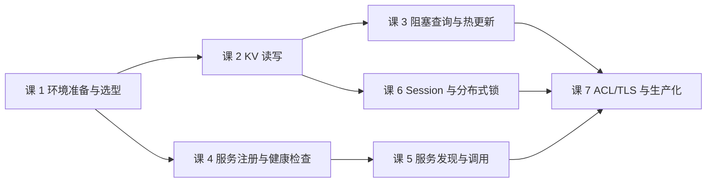

# py-consul 使用（Consul · 子教程）

> **定位**：面向 **Python 开发者**——把"Consul 的 HTTP API 怎么用 Python 客户端调对"这一整摊事说清：选哪个包、怎么连、KV 怎么读写、配置怎么热更新、服务怎么注册与发现、锁怎么上、生产怎么跑。
> **前置**：主线[阶段 2「核心能力拆解」](../../stages/2-核心能力拆解/overview.md)的知识（catalog / 健康检查语义 / 阻塞查询 / KV / ACL 模型）。子教程**不重复主线内容**，只讲**客户端视角**：同一个知识点，主线讲"Consul 的机制是什么"，本教程讲"用 py-consul 怎么把它调对、会踩什么坑"。
> **怎么进入**：① 已学主线 → 直接按下方课清单学；② 只为写 Python 客户端而来 → 先补主线阶段 2（尤其[课 4 服务发现与健康检查机制](../../stages/2-核心能力拆解/lessons/lesson-04-服务发现与健康检查机制.md)与[课 6 KV 存储与配置管理](../../stages/2-核心能力拆解/lessons/lesson-06-KV存储与配置管理.md)），或按各课课首的「前置提示」按需回看。

> 📖 结论已按官方来源核对（核对于 2026-09-22 ｜ 来源：PyPI `py-consul` 项目页 / `criteo/py-consul` GitHub 与 **GitHub Pages 文档站**）
> 🗂️ **配套网页索引**：[web-index/py-consul](../../web-index/py-consul/index.md)（40 条 · 4 分区）——写每课前先按「我要…」列定位官方文档页，避免现场找链接。
> ⚠️ 注意：**py-consul 的文档主体是 GitHub Pages Sphinx 站**（`criteo.github.io/py-consul/`），不是 README（仅 64 行）；仓库 `docs/` 目录是空壳、无正文。

## 与主线的关系

主线只在[场景解法库 · 场景 01](../../场景解法库/场景-01-多实例选主与防重跑.md)出现过一行客户端代码 `c = consul.Consul(host="127.0.0.1", port=8500)`，属于典型的**提及级带过**。本教程把它背后那一整片没讲的东西逐条兑现：

| 主线提及 / 隐含前提 | 本教程兑现（讲"怎么用对"） |
|---|---|
| 场景 01 一行 `consul.Consul(...)` | 课 1 客户端选型与连接（三个同宗包的选择、连接参数、连接复用） |
| 主线课 6「KV 存储与配置管理」（机制层） | 课 2 KV 读写（返回值解构、`Value` 是 bytes、前缀与递归、CAS） |
| 主线课 4「阻塞查询与 watch」（机制层） | 课 3 阻塞查询与配置热更新（index / wait 语义、watch 循环的正确写法） |
| 主线课 4「健康检查类型与语义」 | 课 4 服务注册与健康检查（`Check` 三类、TTL 上报、优雅注销） |
| 主线课 4「catalog 与查询接口」 | 课 5 服务发现（`health` vs `catalog`、`passing` 过滤、`Address` 为空的坑） |
| 主线未展开的锁实现 | 课 6 Session 与分布式锁（`acquire`/`release`、假锁的常见写法） |
| 主线课 8「ACL 与安全模型」 | 课 7 ACL、TLS 与生产化（token 传法、TLS、超时重试、异步客户端） |

> 主线不因本教程而改写（主线是架构师选型视角，客户端调用细节超出其目标）。

**与 Phase 5 三产物的分工**（互补，不重复）：

| 产物 | 视角 | 回答什么 |
|------|------|---------|
| [08-实战经验.md](../../08-实战经验.md) | 学习态 · 经验 | 不该用在哪、高频故障模式长什么样、落地 Checklist |
| [09-排障速查手册.md](../../09-排障速查手册.md) | 使用态 · 急用 | 已经崩了 → 按症状倒查，条件-动作表 |
| [场景解法库/](../../场景解法库/INDEX.md) | 设计态 · 设计 | 新要求来了 → 解法谱系 + 权衡（客户端代码只是其中一段） |
| **本教程** | **系统学 · 体系** | **要用 Python 操作 Consul 时，API 怎么用、坑在哪、生产怎么写** |

> 三者按需互引：本教程讲坑时会写"症状见 [09 症状 N]"，讲选型权衡时写"见场景解法库场景 N"，但**不重讲它们已有的内容**。

**与「子教程 · 运维专项」的分工**：运维专项讲**怎么把 Consul 集群养住**（服务端 / 集群视角），本教程讲**怎么写 Python 代码操作它**（客户端 / 应用视角）。两者共用主线阶段 2 作前置，互不重叠。

## 关键事实（选包的第一道门槛 · 2026-09 核实）

三个同宗包极易混淆，先给结论：

| 包 | 现状 | 结论 |
|----|------|------|
| `py-consul`（criteo/py-consul） | **活跃维护**；最新 1.7.1（2025-11-24）；依赖 `requests`；要求 Python ≥ 3.10；README 声明支持 **Consul 1.20–1.22** | ✅ **用这个** |
| `python-consul`（原 cablehead） | 自 2018 起无维护 | ❌ 不用 |
| `python-consul2`（poppyred） | 最后提交 2022-02-16，版本停在 0.1.5 | ❌ 不用（中文教程里大量出现，别被带偏） |

> ⚠️ **一个必须实测的矛盾点**：py-consul 官方声明支持到 Consul **1.22**，而本课程的实操环境是 **Consul 2.0.2**（主线与运维专项均在此实测）。二者相差一个大版本——**"声明支持范围"与"实际能不能用"不是一回事**，课 1 会用真实请求逐条验证，而不是停在 README 的字面上。
> ⏳ 置信度说明：上表"支持范围"取自官方 README（2026-09 核实）；"Consul 2.0.2 上是否可用"**属未实测结论，课 1 交付时以实测结果为准**。

## 端点实现状态（备课前必查 · 2026-09-22 核实）

来源：[ENDPOINT_STATUS.md](https://github.com/criteo/py-consul/blob/master/ENDPOINT_STATUS.md)（仓库自带，标注每个 HTTP 端点的 ✅ 完全实现 / ⚠️ 部分实现 / ❌ 未实现）。**写每课前先查这张表**，避免讲一个库里压根没实现的端点。

| 课 | 依赖端点 | 状态 | 对写课的影响 |
|----|---------|------|-------------|
| 课 2 | `KV.get` / `KV.put` / `KV.delete` | ✅ 全实现 | ⚠️ 实测发现**非 ASCII 值被按字符数截断**（缺陷，见课 2 知识点 7），写中文须先 `.encode("utf-8")` |
| 课 3 | 同上（阻塞查询靠 `index` + `wait`） | ✅ | ⚠️ 实测发现**同步客户端 `connections_timeout` 是死参数**（签名有但 `HTTPClient.get` 不接受，传则 TypeError；同步层无超时=永不超时），见课 3 知识点 5。**兜底改用短 wait** |
| 课 4 | `Agent.Service.register` | ⚠️ **缺 `Kind` / `Proxy` / `SocketPath` / `Locality`** | 讲注册时**不能演示 sidecar / Connect 代理注册**；`Kind` 缺失意味着只能注册普通服务 |
| 课 4 | `Agent.Check.register` / `ttl_pass` / `ttl_warn` / `ttl_fail` | ✅ | ⚠️ 实测更正：`Check` 类**无 `grpc` 构造器**（仅 http/tcp/ttl/docker/script 五个），gRPC 检查须手写 dict；TTL 检查注册即 critical，须主动上报才 passing（实测 ttl=3s 第 3 秒转 critical） |
| 课 4 | `Agent.services` / `Agent.checks` | ⚠️ 缺 `filter` | 客户端侧过滤需自己写，不能靠 `filter` 入参 |
| 课 5 | `Health.service` / `state` / `checks` / `node` | ✅ 全实现 | ⚠️ 实测更正：`Health._service` 无 `consistency`、无 `filter_expr` 参数，传即 TypeError；`passing=False` 等价于不传（源码 if passing 真值判断）；warning 不算 passing |
| 课 5 | `Catalog.service` / `nodes` / `services` | ✅ 全实现 | ⚠️ 实测：`catalog` 不过滤不健康实例（含 critical 全返回），不可用于服务发现；`consistency` 仅此处支持（health 无）；非法值静默忽略 |
| 课 6 | `Session.create` / `destroy` / `renew` / `info` / `list` / `node` | ✅ 全实现 | 无阻塞；⚠️ 实测补充：`ttl` 实际失效时间为 **2×TTL**（逐秒采样 30 次确认，ttl=10→20s，源码 `ttl*SessionTTLMultiplier`）；客户端侧 assert `10<=ttl<=86400`，越界请求根本不发出；`LockDelay` 返回**纳秒** |
| 课 7 | `ACL.*` / token / policy / role | ⚠️ `Token.create`/`update` 缺 `ServiceIdentities`、`NodeIdentities`、`ExpirationTime`、`ExpirationTTL`、`Local`；`Token.list` 缺过滤参数；🔴 **实测新增：`acl.role` 子对象不存在**（`hasattr(c.acl,'role')` 为 False），role 只能通过 `token.create(roles_id=)` 间接引用 | 讲 token 管理时**不能演示服务身份绑定与 TTL 过期**；**role 无法直接管理** |
| 课 7 | `Policy.update` / `Policy.delete` | ❌ **未实现** | ❗**policy 只能建/读/列，改和删除要绕**（只能删了重建或直接调 HTTP）——必须写进讲义，否则学员会卡住。⚠️ **2026-09-23 课 7 实测确认**：`dir(acl.policy)` 仅 `['agent','create','list','read']`，`hasattr` 的 update/delete **均 False**；且 **delete 也未实现**，故「删了重建」同样走不通，**唯一可靠路径是直调 HTTP API**（`PUT`/`DELETE /v1/acl/policy/{id}`） |
| — | `Connect.CA.configuration` 写入 | ❌ 未实现 | 课 7 不讲 CA 配置写入 |

### 三个写课前必须知道的源码事实

1. **锁的入口不在 `Session` 上**。`Session` 类只有 `create` / `destroy` / `renew` / `info` / `list` / `node`（`源码验证 @ master`；⚠️ **2026-09-23 课 6 实测确认 `hasattr(session,'acquire')` 与 `hasattr(session,'release')` 均为 False**）——**没有 `acquire` / `release`**。真正的加锁/解锁是 `kv.put(key, value, acquire=session_id)` 与 `kv.put(key, value, release=session_id)`。课 6 必须按这个讲，否则学员照抄会 `AttributeError`。⚠️ 课 6 补充实测：`acquire`/`release` **失败返回 False 而非抛异常**（不检查返回值=静默以为抢到锁）；`release` 后 **Value 保留、Session 清空**，故判断有无锁必须看 `Session` 字段而非键是否存在；🔴 **`kv.put` 签名有 `connections_timeout` 但传了 TypeError**（`HTTPClient.put` 不认），与第 2 条同步客户端无超时是同一问题，课 7 沿用此口径。
2. **`Consul()` 没有 `timeout` 构造参数**。⚠️ **2026-09-22 课 3 实测更正**：虽然各 API 方法签名里有 `connections_timeout`，但**同步客户端传它会 TypeError**——源码 `std.HTTPClient.get(self, callback, path, params=None, headers=None)` 无 `**kwargs`、无 timeout，整个 `consul.std` grep 不到超时设置，即**同步客户端 HTTP 请求永不超时**。只有异步客户端（`consul.aio`）的 `connections_timeout` 真实可用。**兜底方案：用短 `wait`（如 30s）代替客户端超时**——wait 是服务端保证的返回时限。课 7 讲超时须按此更正后的口径。
3. **token 优先级是「方法级 > 环境变量 > 构造参数」**（⚠️ **2026-09-22 课 1 实测更正**，原源码推断有误）。源码 `prepare_headers` 为 `token or self.token`（方法参数赢）；而 `self.token = os.getenv("CONSUL_HTTP_TOKEN", token)`——`getenv(key, default)` 的语义是"环境变量存在就用它"，故**环境变量赢过构造参数**（原推断为"构造参数赢"，系把 `getenv` 默认值语义理解反了）。课 1 四组实测对照：`无→None` / `仅构造→ctor-token` / `仅环境→env-token` / `两者都有→env-token`。课 7 讲"三种传法"时按此顺序讲。

## 课清单

| 课 | 知识点（关键点） | 对应主线提及 |
|----|-----------------|-------------|
| **课 1：环境准备与客户端选型**（环境准备课，轻量结构） | 选包（三个同宗包的血缘与现状 / 版本与 Python 要求 / 与 Consul 2.0.2 的版本落差）→ 安装与连接（pip / uv / `Consul()` 真实参数：源码核实为 `host` / `port` / `token` / `scheme` / `consistency` / `dc` / `verify` / `cert`——**没有 `timeout` 构造参数**；另支持环境变量 `CONSUL_HTTP_ADDR` / `CONSUL_HTTP_SSL` / `CONSUL_HTTP_TOKEN` / `CONSUL_HTTP_SSL_VERIFY`）→ 第一个请求与探活（`agent.self()` / 连不上的四类原因）→ 连接生命周期（**`Consul` 是上下文管理器，用 `with` 保证 `http.close()`**） | 场景 01 一行 `consul.Consul(...)`；主线课 3（dev 模式） |
| **课 2：KV 读写与配置中心用法** | 读写基本型（`put` / `get` 返回 `(index, data)` 二元组 / **`data` 为 `None` 的语义** / **`Value` 是 bytes，必须 decode**）→ 前缀与递归（`recurse` / `keys` / `separator` / 空前缀坑）→ 写的安全语义（`cas` 乐观锁 / `acquire` / `flags`）→ 删除（`delete` / `recurse` 删除子树） | 主线课 6（KV 机制层） |
| **课 3：阻塞查询与配置热更新** | index 与 wait 语义（X-Consul-Index / **不传 index 就退化成普通查询**）→ watch 循环的正确写法（index 递进 / `Timeout` 异常不是错误）→ 三个坑（超时默认值 / 服务端 wait 上限 / 循环里重建 client） | 主线课 4（阻塞查询与 watch） |
| **课 4：服务注册与健康检查** | `register` 真实参数（源码核实：`name` / `service_id` / `address` / `port` / `tags` / `check` / `token` / `meta` / `weights` / `enable_tag_override` / **`extra_checks`** / **`replace_existing_checks`**（幂等注册的关键）/ `tagged_addresses` / `connect`；`script`/`interval`/`ttl`/`http`/`timeout` 已废弃）→ `Check` **五种**可用构造器（`http` / `tcp` / `ttl` / `docker` / `script`；`_compat` 为内部函数勿用）——⚠️ **实测更正：没有 `grpc`**（`hasattr(consul.Check,'grpc')` 为 False），gRPC 检查须手写 dict 传 `check=`；**`Check.ttl(ttl)` 只接受 ttl，不接 `interval`/`deregister`**）→ 多检查走 `extra_checks` → TTL 上报（`ttl_pass` / `ttl_warn` / `ttl_fail`：谁上报、多久算死）→ 注销与优雅退出（`deregister` / **上下文管理器与进程信号处理**） | 主线课 4（健康检查类型与语义） |
| **课 5：服务发现与调用** | `health.service` vs `catalog.service`（**`passing=True` 才是能用的实例；`passing=False` 等价于不传**）→ 拿到实例之后（`Address` 为空时回退 `Node.Address` 的坑）→ 一致性模式入参（⚠️ **实测更正：`health` 无 `consistency=` 参数，传即 TypeError**；仅 `catalog.service` 支持 `consistency`；health 要 stale/filter 须走 HTTP API 直连）→ 过滤与排序（`tag` 支持 list 且为 **AND** 语义 / ⚠️ **无 `filter_expr`**，须直连 `filter=Service.Port == x` / `near` 按 RTT 排序 / `node_meta`）→ 什么时候不该用客户端（DNS 接口 / sidecar 场景） | 主线课 4（catalog 与查询接口） |
| **课 6：Session 与分布式锁** | `session.create`（`ttl` / `behavior` / `lock_delay`；**`lock_delay` 默认 15s 且只在 ≠15 时才下发**）→ **锁的正确入口是 `kv.put(..., acquire=session_id)` 与 `kv.put(..., release=session_id)`**（源码核实：`Session` 类只有 create/destroy/renew/info/list/node，**没有 acquire/release 方法**）→ 真锁 vs **"先 get 再 put"的假锁** → 锁失效与续期（`session.renew` / `ttl` 必须 10–86400 秒、否则**客户端 assert 失败**、请求不发出 / 🔴 **实测更正：TTL 实际按 2 倍失效**（ttl=10 实测 20s，非 10s）/ 持锁进程被 kill 后靠 lock-delay 防抖 / **最坏切换时间 = 2×TTL + lock_delay**） | 主线未展开；场景 01（多实例选主） |
| **课 7：ACL、TLS 与生产化** | token 的传法与**真实优先级**（源码核实 `prepare_headers`：`headers["X-Consul-Token"] = token or self.token`——**方法参数赢**；而 `self.token = os.getenv("CONSUL_HTTP_TOKEN", token)` 的 getenv 语义是环境变量存在就用它，故**环境变量赢过构造参数**。⚠️ 2026-09-22 课 1 实测更正：完整顺序为**方法参数 > 环境变量 > 构造参数**）→ **环境变量支持**（`CONSUL_HTTP_ADDR` / `CONSUL_HTTP_SSL` / `CONSUL_HTTP_TOKEN` / `CONSUL_HTTP_SSL_VERIFY`）→ TLS（`scheme="https"` / `verify` / `cert`）→ 超时与异常（`timeout` 不是构造参数，走 `connections_timeout` 逐方法传入 / 🔴 **实测更正 `ConsulException` 家族：`consul` 顶层只导出 5 个**（`ConsulException`/`Timeout`/`NotFound`/`ACLPermissionDenied`/`ACLDisabled`），**`BadRequest` 与 `ClientError` 定义在 `consul.exceptions` 但未被 `__init__` 导出**——`except consul.BadRequest` 会 AttributeError，必须 `from consul.exceptions import BadRequest, ClientError`；⚠️ **401 被映射为 `ACLDisabled`**（源码 `callback.py`），真实语义常是 token 无效/过期，会误导排查方向；404 默认 `allow_404=True` 返回 None 不抛异常 / `requests` 层异常（`ConnectionError`/`SSLError`）**不是** `ConsulException` 子类，实测 `issubclass` 为 False）→ 异步客户端 `consul.aio`（**需额外装 `aiohttp`**；⚠️ **2026-09-23 课 7 实测：本机 aiohttp 未安装，`import consul.aio` 直接 `ModuleNotFoundError`**，即异步路径当前**完全不可用**，需 `pip install aiohttp` 才谈得上用）→ 生产清单（**`Consul` 实现了上下文管理器 `__enter__`/`__exit__`，可用 `with` 自动关连接**；⚠️ 课 7 实测：`http.close()` 后再调用**仍然成功**（requests Session 会新建连接），故 close 不是「销毁」，不能用于资源隔离；实测 5 次请求 ESTABLISHED 仅 +1，证明**连接复用**，不应每请求新建 `Consul()`；重试只对幂等操作） | 主线课 8（ACL 与安全模型） |

## 学习路径

- **课 1 是地基**：不先解决"装哪个包、怎么连上"，后面六课的代码一行都跑不起来
- **课 2 → 课 3 是一条线**（配置中心：读得到 → 读得新）；**课 4 → 课 5 是另一条线**（服务治理：注册得上 → 发现得准）；**课 6 是支线**（要用锁才学）
- **课 7 是收口**：无论前面走哪条线，上生产前都要过一遍
- 只解决眼前问题？→ 优先级：**课 1（连上） > 课 2（读写） > 课 4+5（注册发现）**

## 内容边界（本教程不做什么）

- **不做 Phase 3 / Phase 5**：不收口综合实战项目、不产领域三产物（那是全课程的收尾，主线已完成）
- **不配应用实战 / 源码解析篇**：子教程按需学习、不进主线进度，其课文件不配 4.2 实战篇与源码解析篇（与运维专项同口径）
- **不重讲 Consul 服务端机制**：Raft / Gossip / 健康检查状态机属主线阶段 2，本教程只讲"客户端这一侧怎么调"
- **不做源码考古**：`py-consul` 是 SDK 类对象，但按子教程口径不配源码解析篇；写前遇到"文档没写清"的用法时按「源码探索」求证（标注 `源码验证 @ {版本}`），**只停在用法层**，不展开实现原理分析
- **不重讲运维**：集群怎么搭、怎么备份、怎么升级见[子教程 · 运维专项](../运维专项/overview.md)

## 运行环境约定

> 本教程所有代码在 **WSL Ubuntu（Python 3.12.3）+ 本机 Consul 2.0.2** 上实操；需要装包时（`py-consul`）属**改环境动作**，按既有协作约定**先抛决策点、等用户授权**后再执行，不擅自安装。跑不了的命令一律标 `⚠️ 未实测（{原因}）`，不把想象稿写成实测输出。

## 学习进度

> 子教程进度独立记录于此（不混主线进度表）；课文件生成并学完后勾选。

- [x] 课 1：环境准备与客户端选型（2026-09-22 交付）
- [x] 课 2：KV 读写与配置中心用法（2026-09-22 交付）
- [x] 课 3：阻塞查询与配置热更新（2026-09-22 交付）
- [x] 课 4：服务注册与健康检查（2026-09-22 交付）
- [x] 课 5：服务发现与调用（2026-09-23 交付）
- [x] 课 6：Session 与分布式锁（2026-09-23 交付）
- [x] 课 7：ACL、TLS 与生产化（2026-09-23 交付 · 子教程收口）
