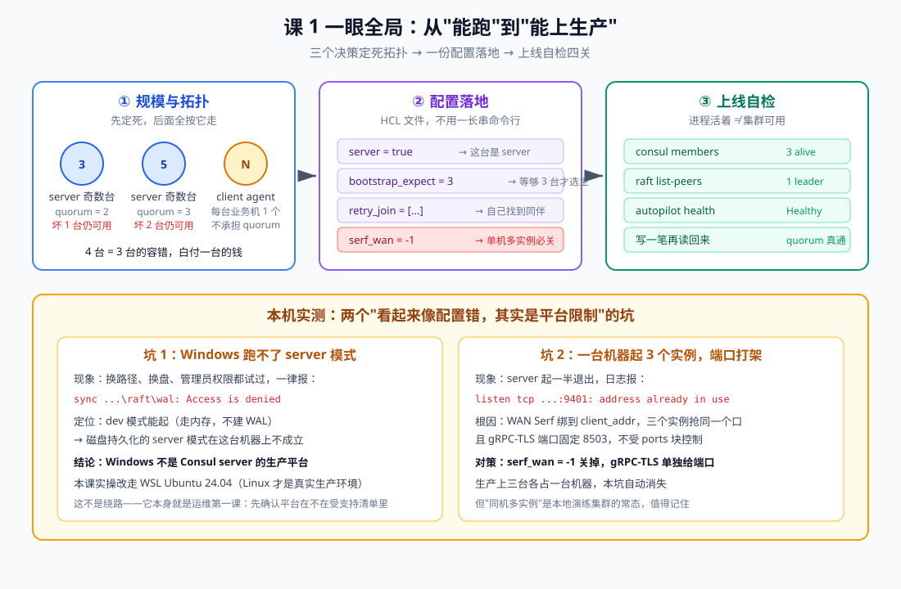
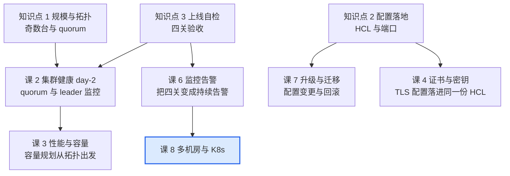

# 课 1：生产部署与集群搭建

> **本课目标**：亲手搭出一个**能上生产的 Consul 集群**——不是 `consul agent -dev`，而是 3 台 server 组成 Raft quorum、有持久化数据目录、能扛住一台机器宕机的真集群；并在搭建过程中，把"规模与拓扑怎么定、配置怎么落、上线后验什么"三件事一次说清。
> **情节定位**：小林所在的团队决定上 Consul。开发那边 `consul agent -dev` 跑了一周，Demo 演示很顺利。轮到运维接手时，负责人问了三个问题：**几台机器？坏了怎么办？你怎么知道它是好的？** 这三个问题，本课逐个回答。
> **前置**：主线[课 3 五分钟跑起来看一眼](../../../stages/1-认识Consul/lessons/lesson-03-五分钟跑起来看一眼.md)（dev 模式与三视图）、[课 5 Raft 与 Gossip 一致性成色](../../../stages/2-核心能力拆解/lessons/lesson-05-Raft与Gossip一致性成色.md)（quorum 与选主）。若只记得"dev 模式一条命令"，建议先回看这两课。
>
> **本课所有命令与输出均为 2026-09-20 在本机 WSL Ubuntu 24.04 + Consul 2.0.2 真实实测**，非文档摘抄。Windows 侧的失败现象同样为实测记录（详见第二幕）。

---

## 第一幕：三个问题

演示会结束后的第二天，运维负责人把小林叫过去，白板上写了三个问题：

1. **几台机器？** —— 不是"越多越好"，奇数台有个硬道理
2. **坏了怎么办？** —— 坏一台、坏两台，集群分别是什么反应
3. **你怎么知道它是好的？** —— 进程在跑，不等于集群可用

这三个问题对应本课的三幕内容：**定拓扑（知识点 1）→ 落配置（知识点 2）→ 做自检（知识点 3）**。

开发同学的 dev 模式回答不了任何一条：它是单节点、纯内存、关掉就什么都没了。用 dev 上生产，等于用样板间交付一套真房子——主线[课 11](../../../stages/4-决策落地/lessons/lesson-11-许可证成本与风险.md)已经把它列为明确禁止项。本课的起点，就是**把样板间换成真房子**。

## 第二幕：搭建前的两个真实障碍

备课实测时，在本机（Windows 11）上先撞了南墙。这两个障碍比顺利搭起来更有教学价值，先如实交代。

### 障碍 1：Windows 上根本起不来 server 模式

按生产配置在 Windows 上启动第一个 server，直接失败：

```text
[ERROR] agent: Error starting agent: error="Failed to start Consul server:
Failed to start Raft: fail to open write-ahead-log: failed initializing meta DB:
sync D:\projects\learning\consul\playground-ops\data\node1\raft\wal: Access is denied."
```

排查过程（每一步都是实测）：

| 尝试 | 结果 |
|------|------|
| 换数据目录到 `C:/Users/.../Temp` | 同样 `Access is denied` |
| 换到 D 盘项目目录 | 同样 `Access is denied` |
| 确认当前是管理员权限 | 是（返回 True） |
| 确认目录 ACL 权限 | 完全控制（F），无问题 |
| **改用 `-dev` 模式** | ✅ **正常启动**，`consul members` 返回 alive |

关键的分界线在最后一条：**dev 模式能起，磁盘持久化的 server 模式起不来**。dev 模式把状态放内存，不建 Raft WAL（Write-Ahead Log，预写日志）；server 模式要建 WAL，而 WAL 初始化会对目录做 `sync` 系统调用——这个调用在 Windows 的 NTFS 上被拒绝了。

**结论不是"配置写错了"，而是平台限制**：Windows 不是 Consul server 的受支持生产平台（官方生产部署指引面向 Linux）。这台机器上，生产形态的集群**只能跑在 Linux 里**。

> **这恰恰是运维第一课**：动手之前先确认平台在不在受支持清单里。很多"诡异的权限问题"最后都指向同一个答案——你站错了平台。

本课的实操环境因此改走**本机 WSL Ubuntu 24.04**，Linux 版 Consul 2.0.2。这不是绕路，而是**更贴近生产**：真实环境里 Consul server 就是跑在 Linux 上的。

### 障碍 2：一台机器上起 3 个实例，端口打架

在 WSL 里起了 3 个节点，进程启动后立刻退出。看日志：

```text
[ERROR] agent: Error starting agent: error="Failed to start Consul server:
Failed to start WAN Serf: failed to start TCP listener on \"127.0.0.1\" port 9401:
listen tcp 127.0.0.1:9401: bind: address already in use"
```

注意报错里的地址是 `127.0.0.1`——但我给这个节点配的 `bind_addr` 是 `127.0.0.1`、`client_addr` 也是 `127.0.0.1`，而**报错端口 9401 属于 node1 的 serf_wan**。更关键的发现是：`ports` 块里给 `serf_wan` 配的端口**没生效**，它绑定到了 `client_addr` 上，于是三个实例抢同一个口。

顺带还发现：**gRPC-TLS 端口固定 8503，不受 `ports` 块控制**（日志里 `address=127.0.0.3:8503` 冲突）。

两个对策（实测有效）：

- `serf_wan = -1`：单 DC 场景用不到 WAN Serf（那是多数据中心联邦用的），直接关掉
- `grpc_tls` 显式给一个独立端口段，避免与 8503 撞车

> 生产上三台 server 各占一台机器，这两个坑自动消失。但**"同机多实例"是本地演练集群的常态**，值得记住。

---

## 第三幕：层层揭示



> **看图**：上面一排是三个动作——先定死几台机器（奇数、坏得起几台），再写一份配置文件把它落地，最后按四条去验收。下面两块是本机实测撞的两个坑：Windows 起不来 server（得换 Linux），同机多实例端口打架（关掉 WAN Serf）。

### 知识点 1：规模与拓扑——奇数台与 quorum

**一句话定义**：生产 Consul 集群由**奇数台 server**（3 或 5）组成 Raft quorum，加上**每个业务节点一个 client agent**；server 负责一致性与存储，client 负责转发与本地健康检查。

**直觉建立**：**董事会表决**。server 是董事，任何决议（写数据、改配置）都要**过半数董事同意**才能生效。3 人董事会要 2 票，5 人要 3 票。为什么是奇数？因为 4 人董事会要 3 票——**和 3 人一样只容忍 1 人缺席，却多养一个董事**。4 台 = 3 台的容错能力 + 一台的钱，纯亏。

**核心原理**：quorum（法定人数）= `floor(N/2) + 1`

| server 台数 | quorum | 容忍故障 | 评价 |
|------------|--------|---------|------|
| 1 | 1 | 0 台 | ❌ dev/测试，无容错 |
| 2 | 2 | 0 台 | ❌ 比 1 台更差（多一台却无容错提升） |
| **3** | **2** | **1 台** | ✅ 最小生产形态，单 DC 首选 |
| 4 | 3 | 1 台 | ❌ 浪费，等于 3 台的容错 |
| **5** | **3** | **2 台** | ✅ 关键业务、需容忍双故障或跨机架 |
| 7 | 4 | 3 台 | ⚠️ 写入变慢（等更多副本确认），一般不必 |

三条实践结论：

1. **3 台是单数据中心的标准起点**——坏一台照常服务，运维窗口内修好即可
2. **5 台用于"坏两台也要活"**——例如跨机架部署，容忍整个机架掉线 + 一台计划内维护
3. **超过 5 台收益递减**——每加一台，写操作要等更多副本确认，提交延迟上升，而容错只 +0.5 台

**client agent 的部署密度**：每台运行业务服务的机器（VM / 物理机 / K8s Node）部署**一个** client agent，业务进程通过本机 `127.0.0.1:8500` 与之通信。client 不参与 Raft、不占 quorum、可任意增减——**它的数量不影响集群容错能力**。

**示例演示**（本课 3 节点集群实测）：

```text
Node        Address         Status  Type    Build  Protocol  DC      Partition  Segment
ops-node-1  127.0.0.1:9301  alive   server  2.0.2  2         opsdc1  default    <all>
ops-node-2  127.0.0.2:9302  alive   server  2.0.2  2         opsdc1  default    <all>
ops-node-3  127.0.0.3:9303  alive   server  2.0.2  2         opsdc1  default    <all>
```

三台全是 `server`、`alive`、同一 `DC`。这就是最小生产形态的完整画像。

**常见误区**：

- *"server 越多越稳"* —— 超过 5 台反而不稳：写提交要等更多副本，leader 选举更慢，网络分区时更难达成 quorum。**加 server 换的是容错，不是性能**。
- *"2 台 server 也算集群"* —— 2 台的 quorum 是 2，坏一台就剩 1 台 < 2，**直接不可用**。2 台比 1 台更糟：多了机器的钱和运维，容错能力还是 0。
- *"client agent 挂了会影响服务发现"* —— 只影响**那一台机器上的**服务，集群不受影响。这正是 client 存在的意义：把故障域限制在单机。
- *"业务进程直连 server"* —— 可以但不推荐。直连让业务耦合 server 地址，且每台业务机都要做服务注册；client agent 把这些收拢到本机。

**一句话记住**：server 奇数台（3 或 5）定容错，client 一台业务机一个定接入；**加 server 买的是"能坏几台"，不是"跑得更快"**。

### 知识点 2：配置落地——用 HCL 文件，不用超长命令行

**一句话定义**：生产部署把全部参数写进 **HCL 配置文件**（`.hcl`），以 `consul agent -config-file=xxx.hcl` 启动；关键配置是 `server`、`bootstrap_expect`、`retry_join`、`data_dir` 与端口段。

**直觉建立**：**交房标准清单**。命令行参数是"口头交代"（这次说了下次可能忘），配置文件是"白纸黑字的清单"（进版本库、可 review、可复现、三台机器长得一样）。生产环境的配置一定要能**版本化**。

**核心原理**：一份生产配置长这样（本课 3 节点集群的 node1 实测配置，已按第二幕的两个坑修正）：

```hcl
node_name  = "ops-node-1"
server     = true
datacenter = "opsdc1"
data_dir   = "/tmp/consul-ops/data/node1"
log_level  = "INFO"

bind_addr      = "127.0.0.1"
advertise_addr = "127.0.0.1"
client_addr    = "127.0.0.1"

bootstrap_expect = 3

ui_config {
  enabled = true
}

telemetry {
  prometheus_retention_time = "60s"
}

ports {
  server       = 8301
  serf_lan     = 9301
  serf_wan     = -1        # 单 DC 关闭 WAN Serf（第二幕坑 2）
  http         = 8501
  dns          = 8601
  grpc         = 8701
  grpc_tls     = 8801      # 不配会撞固定端口 8503
}

retry_join = ["127.0.0.1:9301", "127.0.0.2:9302", "127.0.0.3:9303"]
```

六个关键项逐个说清：

| 配置项 | 作用 | 生产要点 |
|--------|------|---------|
| `server = true` | 这台是 server（参与 Raft） | 写死，别靠默认值；client 节点不写 |
| `bootstrap_expect = 3` | 等到凑够 3 台 server 才选主 | **只在初始化时生效**；必须与预期 server 数一致，配错会永远选不出主 |
| `retry_join` | 启动时自动去连这些地址 | 填 **serf_lan 端口**（本例 9301/9302/9303），不是 HTTP 端口 |
| `data_dir` | 持久化目录（Raft 数据、快照） | 必须是**真磁盘**，且做好备份；删了等于删库 |
| `bind_addr` / `advertise_addr` | 集群内部通信地址 | NAT 后要分别配（advertise 是对外通告的地址） |
| `client_addr` | HTTP/DNS 监听地址 | 配 `0.0.0.0` 才允许非本机访问；默认只听回环 |

**端口清单**（运维必须能背下来，防火墙要开）：

| 端口 | 协议 | 用途 | 谁连它 |
|------|------|------|--------|
| 8300 | TCP | server RPC（Raft 复制） | server ↔ server |
| 8301 | TCP+UDP | Serf LAN（gossip） | 所有 agent 之间 |
| 8302 | TCP+UDP | Serf WAN（跨 DC） | 多 DC 才需要 |
| 8500 | TCP | HTTP API / UI | 运维、业务 |
| 8600 | TCP+UDP | DNS 接口 | 业务（DNS 发现） |
| 8502 | TCP | gRPC | Envoy / 数据面 |

**以服务方式运行**：生产上不会开个终端跑 `nohup`。Linux 用 systemd：

```ini
[Unit]
Description=Consul Server
After=network.target

[Service]
User=consul
ExecStart=/usr/local/bin/consul agent -config-file=/etc/consul.d/server.hcl
ExecReload=/bin/kill -HUP $MAINPID
Restart=on-failure
LimitNOFILE=65536

[Install]
WantedBy=multi-user.target
```

`Restart=on-failure` 是关键：进程意外退出自动拉起，**但拉起不等于集群健康**（知识点 3 解释为什么）。

**示例演示**（本课 WSL 实测，三节点启动后）：

```bash
# 三台分别启动
nohup consul agent -config-file /tmp/consul-ops/conf/node1.hcl > /tmp/consul-ops/log/node1.log 2>&1 &
nohup consul agent -config-file /tmp/consul-ops/conf/node2.hcl > /tmp/consul-ops/log/node2.log 2>&1 &
nohup consul agent -config-file /tmp/consul-ops/conf/node3.hcl > /tmp/consul-ops/log/node3.log 2>&1 &

# 15 秒后确认
pgrep -cf 'consul agent'    # 3
```

**常见误区**：

- *"bootstrap_expect 写 1 也能起"* —— 能起，但那是**单节点自举**，之后再加节点不会自动进 quorum。要 3 台集群就老老实实写 3。
- *"retry_join 填 HTTP 端口 8500"* —— 错。它走的是 Serf/gossip 通道，要填 **8301**（或自定义后的 serf_lan 端口）。填错的表现是"三台都起来了但互相看不见"。
- *"data_dir 随便放 /tmp"* —— 演示可以，生产不行：/tmp 会被清理，且 Consul 的 Raft 数据是该节点的**全部状态**。本课放 /tmp 是因为这是演练集群，讲义里会明确标注。
- *"配置改了重启就生效"* —— 大部分项要重启，但**有些项改了会导致节点不认自己的旧数据**（如 `node_name`、`datacenter`），动之前先想清楚。

**一句话记住**：配置进文件、文件进版本库；`bootstrap_expect` 数准 server 台数，`retry_join` 填 gossip 端口，`data_dir` 是要备份的命根子。

### 知识点 3：上线自检——进程活着 ≠ 集群可用

**一句话定义**：集群启动后必须过**四关**才能宣布可用：成员全 alive、有且仅有一个 leader、autopilot 健康、读写真的通。缺任何一关都不能交付。

**直觉建立**：**交车验收**。4S 店说"车能启动"不等于能交付——你要看仪表盘（members）、发动机（leader）、自检系统（autopilot），还得**真开一圈**（读写）。只看 `ps` 里有进程，等于只听了声引擎响。

**核心原理**：四关逐关说明与实测输出。

**第 1 关：成员全 alive** —— `consul members`

```text
Node        Address         Status  Type    Build  Protocol  DC      Partition  Segment
ops-node-1  127.0.0.1:9301  alive   server  2.0.2  2         opsdc1  default    <all>
ops-node-2  127.0.0.2:9302  alive   server  2.0.2  2         opsdc1  default    <all>
ops-node-3  127.0.0.3:9303  alive   server  2.0.2  2         opsdc1  default    <all>
```

看三点：`Status` 必须全是 `alive`（`failed` 是失联、`left` 是主动下线）、`Type` 符合预期、`DC` 一致。

**第 2 关：有且仅有一个 leader** —— `consul operator raft list-peers`

```text
Node        ID                                    Address         State     Voter  RaftProtocol  Commit Index  Trails Leader By
ops-node-2  3448b18b-13af-732a-0c15-352625bdd595  127.0.0.2:8302  leader    true   3             27            -
ops-node-3  3cf69c05-bba2-99bf-92e0-e6f0ee916130  127.0.0.3:8303  follower  true   3             27            0 commits
ops-node-1  a9d732da-1df7-b56c-22cf-ae3bbe27f0c9  127.0.0.1:8301  follower  true   3             27            0 commits
```

三个看点：**有 leader**（不能是三个 follower——那是没选出主）、**只有一个 leader**（两个 leader = 脑裂，立刻处理）、`Trails Leader By` 是 `0 commits`（follower 没落后）。

**第 3 关：autopilot 健康** —— `consul operator autopilot get-config` 与健康接口

```text
CleanupDeadServers      = true
LastContactThreshold    = 200ms
MaxTrailingLogs         = 250
MinQuorum               = 0
ServerStabilizationTime = 10s
```

```json
{
    "Healthy": true,
    "FailureTolerance": 1,
    ...
}
```

`Healthy: true` 是 autopilot 的综合判定；`FailureTolerance: 1` 直接告诉你**还能坏 1 台**（3 节点集群的期望值，与知识点 1 的表格对上了）。

> autopilot 是 Consul 的**集群自愈管家**：自动清理死掉的节点（`CleanupDeadServers`）、判断节点是否稳定到可以当 voter（`ServerStabilizationTime`）、算出容错余量。它是"集群现在健康吗"这个问号的官方答案。

**第 4 关：读写真的通** —— 写一笔 KV 再读回来

```bash
curl -s -X PUT -d 'quorum-test' http://127.0.0.1:8501/v1/kv/ops/quorum   # true
curl -s http://127.0.0.1:8501/v1/kv/ops/quorum?raw                        # quorum-test
```

这一关验的是 **quorum 真的工作**：写操作必须过半数 server 确认才返回 `true`。如果集群实际只有 1 台能通信，这一笔写会失败——**而前三关可能全部通过**。

**四关的验收脚本**（本课实测完整版见第四幕）：

```bash
#!/usr/bin/env bash
export CONSUL_HTTP_ADDR=http://127.0.0.1:8501
echo "1. members:";    consul members | grep -c alive                      # 期望 3
echo "2. leader:";     consul operator raft list-peers | grep -c leader    # 期望 1
echo "3. autopilot:";  curl -s $CONSUL_HTTP_ADDR/v1/operator/autopilot/health \
                       | grep -o '"Healthy":[a-z]*'                        # 期望 true

# 4. 读写：必须校验 HTTP 状态码——无 quorum 时可能返回空 body
CODE=$(curl -s -o /dev/null -w '%{http_code}' -X PUT -d ok $CONSUL_HTTP_ADDR/v1/kv/_health)
VAL=$(curl -s $CONSUL_HTTP_ADDR/v1/kv/_health?raw)
echo "4. rw: write_http=$CODE read_value=$VAL"
[ "$CODE" = "200" ] && [ "$VAL" = "ok" ] && echo "PASS" || echo "FAIL"
```

> 第四关的写法是刻意加长的。写成 `curl -X PUT ... && echo OK` 是**错的**——无 quorum 时 curl 可能返回空 body 而退出码仍为 0，`&&` 会照样打印 OK。**验收脚本自己不能被空响应骗过**，这是本课在第四幕踩出来的坑。

**常见误区**：

- *"进程在，集群就在"* —— 本课最核心的反例：**停掉 2 台后，剩下的 1 台进程活得好好的，但读写全部失败**（第四幕会亲手复现）。监控 `consul` 进程存活是最低级的告警，必须换成"能否写入"。
- *"members 全 alive 就够了"* —— 不够。gossip 层 alive 只说明网络通，**不代表 Raft 层选出了主**。三台互相看得见但都停在 follower 的状态是存在的。
- *"一次自检通过就永远健康"* —— 集群状态会漂移：leader 会换、节点会失联、磁盘会满。自检要变成**持续监控**（课 6 讲怎么把它变成告警）。
- *"autopilot 开着就不用管了"* —— autopilot 只管**自动清理与判定**，它不会替你加机器、不会修网络分区。`Healthy: false` 是**通知你出事了**，不是自愈完成。

**一句话记住**：members 看网络、list-peers 看 Raft、autopilot 看综合健康、**写一笔才是真验收**；四关全过才叫"集群可用"。

---

## 第四幕：实操验证（完整复现清单）

> **场地**：本机 WSL Ubuntu 24.04 + Consul 2.0.2。
> **Windows 用户请先读第二幕障碍 1**——Windows 上起不了 server 模式，必须走 Linux（WSL / 虚拟机 / 容器）。

### 第 0 步：准备环境

```bash
# WSL 内安装 Consul（若已有可跳过）
cd /tmp && mkdir -p consul-ops && cd consul-ops
curl -O https://releases.hashicorp.com/consul/2.0.2/consul_2.0.2_linux_amd64.zip
python3 -c "import zipfile;zipfile.ZipFile('consul_2.0.2_linux_amd64.zip').extractall('.')"
chmod +x consul && sudo mv consul /usr/local/bin/consul
consul version    # Consul v2.0.2
```

> 本机没有 `unzip`，用 Python 内置 `zipfile` 解压——**不为了解压一个包去装软件**，这是运维的克制。

```bash
# 建目录与环回别名（单机模拟三台机器的关键技巧）
BASE=/tmp/consul-ops
mkdir -p $BASE/data/node{1,2,3} $BASE/conf $BASE/log
for i in 1 2 3; do sudo ip addr add 127.0.0.$i/8 dev lo; done
ip -4 addr show lo | grep -o '127\.0\.0\.[0-9]*'   # 应看到 127.0.0.1/2/3
```

### 第 1 步：写三份配置

```bash
for i in 1 2 3; do
cat > $BASE/conf/node$i.hcl <<EOF
node_name  = "ops-node-$i"
server     = true
datacenter = "opsdc1"
data_dir   = "$BASE/data/node$i"
log_level  = "INFO"

bind_addr      = "127.0.0.$i"
advertise_addr = "127.0.0.$i"
client_addr    = "127.0.0.$i"

bootstrap_expect = 3
ui_config { enabled = true }

telemetry { prometheus_retention_time = "60s" }

ports {
  server   = $((8300 + i))
  serf_lan = $((9300 + i))
  serf_wan = -1
  http     = $((8500 + i))
  dns      = $((8600 + i))
  grpc     = $((8700 + i))
  grpc_tls = $((8800 + i))
}

retry_join = ["127.0.0.1:9301", "127.0.0.2:9302", "127.0.0.3:9303"]
EOF
done
```

### 第 2 步：启动集群

```bash
for i in 1 2 3; do
  nohup consul agent -config-file $BASE/conf/node$i.hcl > $BASE/log/node$i.log 2>&1 &
  echo "started node$i pid=$!"
done
sleep 15
pgrep -cf 'consul agent'    # 3
```

### 第 3 步：四关自检

```bash
export CONSUL_HTTP_ADDR=http://127.0.0.1:8501

# 关卡 1：成员
consul members
# 期望：三个 ops-node-* 全 alive

# 关卡 2：Raft leader
consul operator raft list-peers
# 期望：1 个 leader + 2 个 follower，Trails Leader By = 0 commits

# 关卡 3：autopilot
consul operator autopilot get-config
curl -s $CONSUL_HTTP_ADDR/v1/operator/autopilot/health | python3 -m json.tool
# 期望：Healthy=true, FailureTolerance=1

# 关卡 4：读写
curl -s -X PUT -d 'quorum-test' $CONSUL_HTTP_ADDR/v1/kv/ops/quorum    # true
curl -s $CONSUL_HTTP_ADDR/v1/kv/ops/quorum?raw                        # quorum-test
```

### 第 4 步：亲手验证容错（本课最有价值的一步）

```bash
# 4a. 停 1 台（剩 2/3，quorum=2 仍满足）
pkill -f 'conf/node3.hcl'; sleep 8        # 等 8 秒，给重选 leader 留时间
consul members                            # node3 = failed
curl -s -X PUT -d 'after-1-down' $CONSUL_HTTP_ADDR/v1/kv/ops/quorum   # true  ✅
curl -s $CONSUL_HTTP_ADDR/v1/kv/ops/quorum?raw                        # after-1-down
```

受控实测（分别停 follower 与停 leader，各跑一轮）：

| 停掉谁 | 停后 8s 可写？ | 说明 |
|--------|--------------|------|
| follower（node3） | ✅ `true` | 剩两台 quorum=2 直接满足 |
| **leader 本人**（node3） | ✅ `true` | **剩下两台会重选出新 leader**，同样可写 |

> **别被等待时间骗了**：`sleep 6` 就探测时，我实测拿到过 `Raft leader not found`——以为是"坏 1 台就不可用了"，实际上是**新 leader 还没选出来**。停完等 8 秒再测，两种情形都可写。**坏 1 台真正的影响是"有几十秒的选举抖动"，不是"不可用"**，这个区别在生产上很关键。

```bash
# 4b. 再停 1 台（只剩 1/3，quorum=2 不满足）
pkill -f 'conf/node2.hcl'; sleep 8
curl -s --max-time 8 -X PUT -d 'x' $CONSUL_HTTP_ADDR/v1/kv/ops/quorum
curl -s --max-time 8 $CONSUL_HTTP_ADDR/v1/kv/ops/quorum?raw
```

**失败的样子比想象的更不统一**（三轮独立实测，每次采样结果都不同）：

| 形态 | 表现 | 危险之处 |
|------|------|---------|
| **A：空响应** | HTTP 请求**拿不到状态码**（curl 报 `000`），body 为空 | ⚠️ **最阴险**：脚本若只看 body 是否含 "error"，会把它当成成功 |
| B：文本报错 | `No cluster leader`（HTTP 500） | 明确，好识别 |
| C：文本报错 | `Raft leader not found in server lookup mapping` | 明确，好识别 |
| D：连接层报错 | `rpc error ... connection refused` | 指向网络，容易误导去查网络 |

实测采样（同一状态下连采 4 次）：

```text
第1次 写=[空]          读=No cluster leader
第2次 写=[空]          读=[空]
第3次 写=[空]          读=[空]
第4次 写=No cluster leader  读=[空]
```

> **这一条比"集群不可用"更重要**：无 quorum 时**最常见的响应是空**，而不是一句漂亮的报错。判断 Consul 是否健康的正确姿势是**看 HTTP 状态码 + 能否读到刚写进去的值**，绝不是"看返回体里有没有 error 字样"。课 6 讲告警时会把这个坑展开成完整的三步核验。

### 第 5 步：恢复，验证自愈

```bash
nohup consul agent -config-file $BASE/conf/node2.hcl > $BASE/log/node2.log 2>&1 &
nohup consul agent -config-file $BASE/conf/node3.hcl > $BASE/log/node3.log 2>&1 &
sleep 15

consul members                                        # 三个都 alive
consul operator raft list-peers                       # leader 可能已漂移到别的节点
curl -s -X PUT -d 'recovered' $CONSUL_HTTP_ADDR/v1/kv/ops/quorum && echo "WRITE OK"
```

实测：恢复后 leader 从 ops-node-2 漂移到 **ops-node-1**，三节点 `Commit Index` 一致（43），读写恢复正常。**leader 漂移是正常的**，不必惊慌。

### 第 6 步：收摊

```bash
pkill -f 'consul agent'
pgrep -cf 'consul agent'    # 0
```

**本机适配备忘**：

- WSL 里没有 `unzip`，用 `python3 -c "import zipfile;..."` 解压
- 单机多用 `127.0.0.x` 环回别名模拟多机，需 `sudo ip addr add 127.0.0.$i/8 dev lo`
- `ip addr` 加过的别名重启 WSL 会丢，重跑一次即可
- 端口段建议按 `8300+i / 9300+i / 8500+i` 规律递增，一眼能看出属于哪个节点
- `consul members` 要指定目标时用 `-http-addr=http://127.0.0.2:8502`

纸面验收（不动手也能做对）：合上讲义，回答——3 台集群坏 1 台后能否写入？坏 2 台后剩下的节点进程还在吗？它还能读吗？

## 第五幕：体系收束

小林在白板上写下了三个问题的答案：

| 负责人三问 | 本课的答案 | 证据（实测） |
|-----------|-----------|-------------|
| 几台机器？ | 3 台 server（奇数、quorum=2）+ 每业务机 1 个 client | `consul members` 三台 alive |
| 坏了怎么办？ | 坏 1 台照常读写；坏 2 台**读写全停**（进程仍活着） | 第 4 步 4a / 4b 亲手复现 |
| 你怎么知道它是好的？ | 四关自检，最后一关必须是**真的写一笔** | 第 3 步四关全过 |

三个知识点在全局的位置：



**自测思考题**（建议先自己作答再看提示）：

1. 团队为了"更稳"买了 4 台机器部署 4 个 server。你觉得这个决定怎么样？
   *提示：4 台的 quorum = 3，只容忍 1 台故障，和 3 台完全一样——多花一台的钱和运维，容错没提升。要么降到 3 台省钱，要么升到 5 台真买 2 台容错。*
2. 三台 server 都起来了，`consul members` 显示三台 alive，但写入一直报错（`Raft leader not found` 或 `connection refused` 都算）。可能是什么原因？
   *提示：gossip 通（alive）不等于 Raft 成（选出主）。检查 `bootstrap_expect` 是否与实际 server 数一致、`retry_join` 填的是不是 serf_lan 端口（9301 而非 8501）——填错端口的典型表现就是"互相看不见"。*
3. 为什么"写一笔 KV"能作为集群可用的最终验收，而不是看进程或看 members？
   *提示：写操作必须过 quorum（半数以上 server 确认）才返回成功。它能一次性证明：网络通 + Raft 有主 + 半数以上节点可达。而进程存活证明不了任何一条，members alive 只证明 gossip 层通。*
4. 你写了个健康检查脚本：`curl -s -X PUT -d ok $ADDR/v1/kv/_health && echo "集群健康"`。集群坏掉 2 台时，这个脚本输出了"集群健康"。为什么？
   *提示：无 quorum 时 curl 常返回**空 body 且退出码为 0**，`&&` 照样执行后面的 echo。正确做法是校验 HTTP 状态码（`-w '%{http_code}'`，期望 200）并回读刚写的值比对。这是本课第四幕实测踩出来的坑。*

---

## 📇 概念速查卡

| 术语 | 一句话解释 | 本课角色 |
|------|-----------|----------|
| quorum | 过半数（floor(N/2)+1），决议生效的最低票数 | 决定容忍几台故障 |
| server / client agent | server 参与 Raft 与存储；client 只转发与本地检查 | 拓扑两类角色 |
| `bootstrap_expect` | 凑够 N 台 server 才开始选主 | 初始化关键项 |
| `retry_join` | 启动时自动连接的同伴地址（**serf_lan 端口**） | 自动组网 |
| `data_dir` | Raft 数据与快照的持久化目录 | 要备份的命根子 |
| `bind_addr` / `advertise_addr` | 监听地址 / 对外通告地址（NAT 后不同） | 网络配置 |
| `client_addr` | HTTP/DNS 监听地址，默认只听回环 | 访问控制第一道 |
| `serf_wan = -1` | 关闭跨 DC 的 WAN Serf | 同机多实例避坑 |
| WAL（预写日志） | Raft 的持久化日志，Windows 上 sync 被拒 | 障碍 1 根因 |
| autopilot | 集群自愈管家：清死节点、算容错、判健康 | 第 3 关 |
| `FailureTolerance` | 还能再坏几台（autopilot 给出） | 容错余量读数 |
| `list-peers` | 列出 Raft 成员与角色（leader/follower） | 第 2 关 |
| `Trails Leader By` | follower 落后 leader 多少条日志 | 复制延迟读数 |
| leader 漂移 | leader 换节点，恢复过程中的正常现象 | 第 5 步实测 |
| `No cluster leader` | 无 quorum 时读写的报错之一（HTTP 500） | 第 4b 步实证 |
| 空响应（HTTP 000） | 无 quorum 时**最常见**的失败形态，body 为空且拿不到状态码 | 第 4b 步实证（最易误判） |
| leader 重选抖动 | 坏 1 台后台台重选，期间短暂不可用（秒级） | 第 4a 步实测 |

## 🚀 下一批接力提示词

> 学完本课后，**复制下面这段文字发给 AI**，即可无缝进入下一批：

```
继续学 Consul 运维专项。我的学习档案在 consul/00-学习档案.md，
刚学完子教程《运维专项》课 1《生产部署与集群搭建》
知识点（规模与拓扑-奇数台与quorum、配置落地-HCL与端口、上线自检-四关验收），
请按大纲继续讲解课 2《集群健康与 day-2 运维》。
```

## 🧭 课程导航

- [返回子教程总览](../overview.md)
- 下一课：课 2 集群健康与 day-2 运维（尚未生成，生成后改为链接）
- [返回课程目录](../../../02-课程目录.md)
- [回主线：课 5 Raft 与 Gossip 一致性成色](../../../stages/2-核心能力拆解/lessons/lesson-05-Raft与Gossip一致性成色.md)
