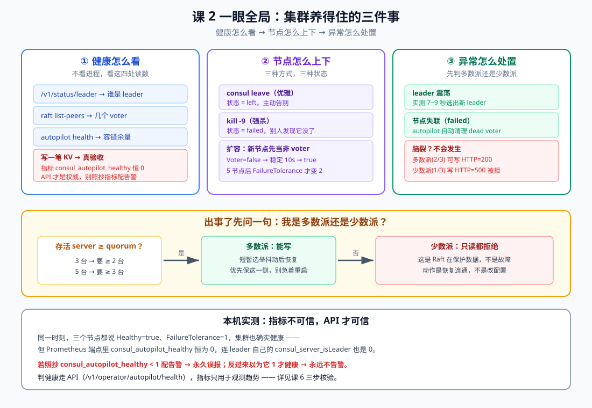
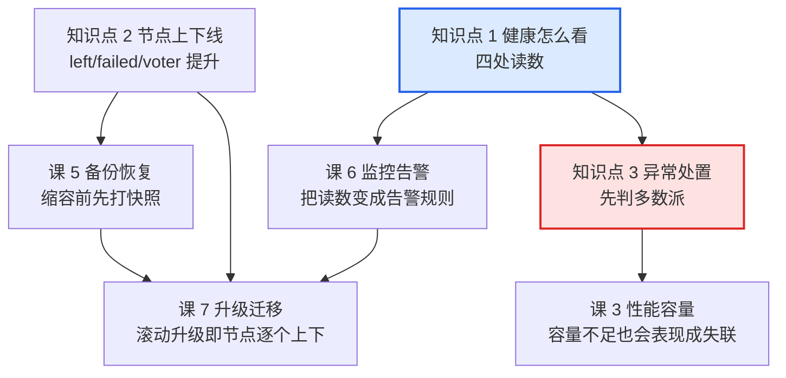

# 课 2：集群健康与 day-2 运维

> **本课目标**：把"集群现在好不好"从一句感觉变成**四处可查的读数**，把"节点上下线"从重启机器变成**三种有明确语义的操作**，并能在 leader 震荡、节点失联时**先判多数派还是少数派**再动手。
> **情节定位**：课 1 交付的集群跑了一周。某天告警说"Consul 有节点 failed"，小林登上去一看：三个进程都在，`consul members` 也显示 alive——**告警是误报吗？** 还是说，他看的地方从一开始就不对？本课回答这个问题。
> **前置**：[课 1 生产部署与集群搭建](./lesson-01-生产部署与集群搭建.md)（quorum、四关自检）、主线[课 5 Raft 与 Gossip 一致性成色](../../../stages/2-核心能力拆解/lessons/lesson-05-Raft与Gossip一致性成色.md)（选主与复制）。
>
> **本课所有命令与输出均为 2026-09-20 在本机 WSL Ubuntu 24.04 + Consul 2.0.2 真实实测**，含三轮独立重复的震荡实验。

---

## 第一幕：告警响了，但看起来一切正常

凌晨两点，告警：`consul_up{instance="ops-node-3"} == 0`。

小林登上去：

```bash
ps aux | grep consul        # 三个进程都在
consul members              # 三个都是 alive
```

他松了口气，把告警静默了。**三小时后，业务大面积超时。**

问题出在哪？他查的三个地方都是"活着的证据"，但没有一个是"健康的证据"。更要命的是——他如果真去查指标，会看到**更离谱的东西**：

```text
consul_autopilot_healthy 0        ← 但 API 明明说 Healthy=true
consul_server_isLeader 0          ← 连 leader 自己都报 0
```

本课要做的，就是**把这套读数体系理清楚**：哪些能信，哪些不能信，出事时先看什么。

## 第二幕：指标骗了你

在讲"怎么看健康"之前，必须先扫掉一个雷——否则后面所有基于指标的判断都是错的。

### 实测：API 与指标自相矛盾

同一时刻、同一个集群、同一个节点：

```bash
# API 说：健康
curl -s http://127.0.0.1:8501/v1/operator/autopilot/health | python3 -m json.tool
{
    "Healthy": true,
    "FailureTolerance": 1,
    ...
}
```

```bash
# 指标说：不健康
curl -s 'http://127.0.0.1:8501/v1/agent/metrics?format=prometheus' | grep autopilot
consul_autopilot_healthy 0
consul_autopilot_failure_tolerance 0
```

按三步核验铁律（沿用 Kafka 课 17 固化的方法，课 6《监控指标与告警》会完整展开）逐条验：

**第 1 步，看实际值域**：连续采样 3 次，`consul_autopilot_healthy` 恒为 `0`。健康的集群不可能恒 0 → 值域不对。

**第 2 步，读 HELP 行确认语义**：

```text
# TYPE consul_autopilot_healthy gauge
consul_autopilot_healthy 0
# TYPE consul_raft_state_leader counter     ← 标成 counter，值却是 0
consul_raft_state_leader 0
# TYPE consul_server_isLeader gauge
consul_server_isLeader 0
```

**第 3 步，连续采样 + 跨节点对照**：三个节点全查一遍——

```text
  node1 (leader):   consul_server_isLeader = 0
  node2 (follower): consul_server_isLeader = 0
  node3 (follower): consul_server_isLeader = 0
```

连 **leader 自己**都报 0。这个指标在本环境（Consul 2.0.2 + 该 telemetry 配置）**没有在产出有效值**，不是"集群不健康"。

> **这就是课 1 结尾讲过的"静默失效"**：指标恒 0 比报错更危险。若你写 `consul_autopilot_healthy < 1` 告警 → **永久误报**；若你以为"值为 1 才健康" → **永远不告警**。两个方向都是坑。

**本课结论（先记住，课 6 再展开）**：
- **判定健康走 API**：`/v1/operator/autopilot/health`、`/v1/status/leader`、`raft list-peers`
- **指标只用于观测趋势**，且用之前必须按三步核验

## 第三幕：层层揭示



> **看图**：上排三块是 day-2 的三件事——健康看四处读数、节点三种上下法、异常先判多数派。中间是出事时的判定流程：先问"存活 server 够不够 quorum"。底部是实测的指标陷阱。

### 知识点 1：quorum 与 leader 健康怎么看（不是看进程在不在）

**一句话定义**：集群健康的权威判据是**四处读数**——leader 是谁、有几个 voter、autopilot 的容错余量、以及**能否真的写入**；进程存活完全不在判据里。

**直觉建立**：**体检报告 vs 摸脉搏**。进程在 = 有脉搏，这是最低标准。真正的健康要看报告：血压（leader）、血常规（voter 数）、医生结论（autopilot）、以及——**你能不能爬五楼**（写入）。

**核心原理**：四处读数逐个说清。

**读数 1：谁是 leader** —— 三种问法，用途不同

```bash
# A. 最轻量，适合脚本与探活
curl -s http://127.0.0.1:8501/v1/status/leader
"127.0.0.2:8302"

# B. 最全，含 voter / 复制延迟，日常排查用
consul operator raft list-peers
Node        Address         State     Voter  RaftProtocol  Commit Index  Trails Leader By
ops-node-2  127.0.0.2:8302  leader    true   3             27            -
ops-node-1  127.0.0.1:8301  follower  true   3             27            0 commits
ops-node-3  127.0.0.3:8303  follower  true   3             27            0 commits

# C. 只列地址，不含角色
curl -s http://127.0.0.1:8501/v1/status/peers
["127.0.0.1:8301","127.0.0.2:8302","127.0.0.3:8303"]
```

**读数 2：各节点对 leader 的认知是否一致**

```text
  node1 认为 leader = "127.0.0.2:8302"
  node2 认为 leader = "127.0.0.2:8302"
  node3 认为 leader = "127.0.0.2:8302"
```

三个答案**必须一致**。不一致说明有节点的 Raft 状态落后——这是分区或网络抖动的早期信号，比 `members` 变 failed 出现得更早。

**读数 3：autopilot 综合判定与容错余量**

```bash
curl -s http://127.0.0.1:8501/v1/operator/autopilot/health | python3 -m json.tool
{
    "Healthy": true,
    "FailureTolerance": 1,
    "Servers": [
        { "Name": "ops-node-2", "Leader": true,  "LastContact": "0s",           "Healthy": true, "Voter": true },
        { "Name": "ops-node-1", "Leader": false, "LastContact": "50.466402ms",  "Healthy": true, "Voter": true },
        { "Name": "ops-node-3", "Leader": false, "LastContact": "80.749494ms",  "Healthy": true, "Voter": true }
    ]
}
```

两个字段是重点：

| 字段 | 含义 | 怎么用 |
|------|------|--------|
| `Healthy` | autopilot 的综合判定 | 唯一值得当告警条件的综合读数 |
| `FailureTolerance` | **还能再坏几台** | 3 节点=1、5 节点=2；比 Healthy 更有行动指导性。**新节点未被提升为 voter 前不会增加** |
| `LastContact` | leader 上次联系到该节点距今 | 超过 `LastContactThreshold`(默认 200ms) 该节点判不健康 |
| `Voter` | 是否为投票成员 | 扩容时新节点先 false 后 true |

autopilot 的判定参数（默认）：

```text
CleanupDeadServers      = true     ← 自动清理死掉的节点
LastContactThreshold    = 200ms    ← 超过这个延迟判不健康
MaxTrailingLogs         = 250      ← 落后超过 250 条日志判不健康
ServerStabilizationTime = 10s      ← 新节点稳定 10s 后才提升为 voter
```

**读数 4：真的写一笔**（课 1 第四关的延续）

```bash
CODE=$(curl -s -o /dev/null -w '%{http_code}' -X PUT -d ok $ADDR/v1/kv/_health)
VAL=$(curl -s $ADDR/v1/kv/_health?raw)
[ "$CODE" = "200" ] && [ "$VAL" = "ok" ] && echo PASS || echo FAIL
```

**为什么它不可替代**：前三个读数都来自**某个节点的视角**，只有写入要过 quorum——它证明的是"**半数以上节点此刻可达且达成了一致**"。

**示例演示**（本课实测的健康基线）：

```text
leader = ops-node-1:8301（三个节点认知一致）
voter  = 3 个，全是 true
Healthy= true，FailureTolerance = 1
写入 HTTP = 200，回读 = ok
```

**常见误区**：

- *"进程在就是好的"* —— 第一幕的教训。课 1 已实测：坏 2 台后进程仍活着，但读写全拒。
- *"members 全 alive 就够了"* —— gossip 层通 ≠ Raft 层健康。`members` 看的是 Serf，`list-peers` 看的才是 Raft。
- *"指标说 0 就是有问题"* —— 见第二幕。本环境 `consul_autopilot_healthy` 恒 0 但集群健康。**先核验再下结论**。
- *"FailureTolerance 是固定的"* —— 不是。它随 voter 数变化：3 台=1，5 台=2，**且新节点刚加入时尚未成为 voter，此时余量不增加**（第四幕有实测）。

**一句话记住**：判健康走 API 四读数（leader / voter / autopilot / 真写入），**进程存活不是健康证据，指标用前必核验**。

### 知识点 2：节点上下线——三种方式，三种状态

**一句话定义**：节点离开集群有 **`consul leave`（优雅，状态 `left`）、被强杀（`failed`）、被 autopilot 自动清理**三种路径；加入则经历"非 voter → voter"的过渡。

**直觉建立**：**离职交接 vs 突然消失**。交了离职信（leave）的同事，工作已交接，系统里标记"已离职"；突然消失（kill -9）的，系统只能标"失联"，还得等 HR（autopilot）过一段时间来办离职手续。

**核心原理**：

**方式 A：优雅下线 `consul leave`**

```bash
consul leave -http-addr=http://127.0.0.3:8503
Graceful leave complete
```

实测结果：

```text
ops-node-1  127.0.0.1:9301  alive   server  2.0.2  2  opsdc1
ops-node-2  127.0.0.2:9302  alive   server  2.0.2  2  opsdc1
ops-node-3  127.0.0.3:9303  left    server  2.0.2  2  opsdc1   ← left
```

同时 `raft list-peers` 里 **node3 已立刻从 voter 列表消失**（剩 2 个 voter）——leave 是**主动交还投票权**，quorum 从 2/3 变成 2/2。

> ⚠️ **注意**：3 节点集群 leave 掉 1 台后，剩 2 台、quorum 仍是 2——**此时再坏任何一台就全停**。计划内维护不要一次 leave 多台。

**方式 B：强杀（SIGKILL）**

```bash
kill -9 $(pgrep -f 'conf/node3.hcl')
```

```text
ops-node-3  127.0.0.3:9303  failed  server  2.0.2  2  opsdc1   ← failed
```

`raft list-peers` 里 **node3 仍在列表中，且 `Trails Leader By = 2 commits`**——它没来得及交还投票权，其他节点只能等 autopilot 来清理。

| 对比 | `consul leave` | `kill -9` |
|------|---------------|-----------|
| members 状态 | `left` | `failed` |
| 是否立即退出 voter 列表 | **是** | 否，等 autopilot 清理 |
| 是否触发选举 | 是（若离开的是 leader） | 是 |
| 适用场景 | 计划内维护、缩容 | 模拟宕机、进程崩溃 |

**方式 C：autopilot 自动清理**（`CleanupDeadServers = true`）

强杀后等待约 30 秒：

```text
# 清理前：node3 仍在，Trails Leader By = 2 commits
ops-node-3  127.0.0.3:8303  follower  true   3    49    2 commits

# 清理后：node3 从 voter 列表消失
ops-node-1  127.0.0.1:8301  leader    true   3    56    -
ops-node-2  127.0.0.2:8302  follower  true   3    56    0 commits
```

**这就是 `CleanupDeadServers` 的价值**：死掉的节点如果不清出去，它会一直占着 voter 名额，**导致 quorum 永远按旧节点数计算**（3 台的 quorum=2，死 1 台后若仍算 3 台，实际只剩 2 台可用却要 2 票——勉强够；死 2 台就彻底卡死）。

**扩容：新节点先当"学徒"**

```text
# node4 刚加入
ops-node-4  127.0.0.4:8304  follower  false  3   33    0 commits   ← Voter=false

# 稳定 10s 后（ServerStabilizationTime）
ops-node-4  127.0.0.4:8304  follower  true   3   39    0 commits   ← Voter=true
```

**为什么要先当非 voter**：新节点的数据是空的，直接给投票权会拖慢 quorum（它要追日志）。先让它同步（非 voter 也接收复制），追平了再给票——这是 autopilot 的保护设计。

**扩容实测时间线（3 → 5，每步都记了时刻）**：

| 时刻 | server 数 | voter 数 | FailureTolerance |
|------|----------|---------|-----------------|
| 初始 3 台 | 3 | 3 | 1 |
| 加 node4 +10s | 4 | **3** | 1 ← 还没提升 |
| 加 node4 +25s | 4 | 4 | **1** ← 变 voter 了，但余量仍 1 |
| 加 node5 +10s | 5 | 4 | 1 |
| 加 node5 +30s | 5 | 5 | **2** ✅ |

两个反直觉但重要的结论：

1. **新节点要等约 25 秒才被提升为 voter**（`ServerStabilizationTime=10s` 只是最短稳定期，实际还含追赶日志时间）
2. **4 台时 FailureTolerance 仍是 1** —— 这正好实证了课 1 表格里的"4 台 = 3 台的容错，白付一台的钱"。4 台的 quorum 是 3，只容忍 1 台故障，跟 3 台一样。**加到 5 台才变成 2**。

> 所以扩容后别急着庆祝——**等 `FailureTolerance` 真的涨上去**，才算买到了容错。

**缩容**：用 `consul leave` 逐个下线，实测从 5 台回到 3 台，`FailureTolerance` 回到 1，全程可写。

**常见误区**：

- *"failed 和 left 只是显示不同"* —— 不是。`left` 已交还投票权并从 voter 列表移除；`failed` 还占着 voter 名额，靠 autopilot 清理。**这直接影响 quorum 计算**。
- *"强杀更快更省事"* —— 省事的是你，麻烦的是集群：要等 autopilot 清理，期间容错余量偏低。计划内操作一律用 `leave`。
- *"加节点立刻提升容错"* —— 见上表，要等成为 voter。
- *"一次下线多台没问题"* —— 3 节点集群 leave 1 台后 quorum 变成 2/2，**第二台一下线就全停**。必须逐台操作、每台之间确认恢复。

**一句话记住**：计划内用 `leave`（状态 left、立即交权），宕机是 `failed`（autopilot 清理）；**扩容后要等新节点变成 voter，容错余量才真的增加**。

### 知识点 3：典型集群异常的处置——先判多数派

**一句话定义**：遇到集群异常，第一步永远是**判断自己是多数派还是少数派**；多数派等选举自愈（实测 7~9 秒），少数派要恢复连通而非改配置。

**直觉建立**：**议会表决的 quorum**。议会 100 人，法定人数 51 人。来了 60 人 → 能表决（多数派）；只来 30 人 → 凑不够法定人数，**什么都做不了，而且这是对的**（防止 30 人偷偷通过决议）。Raft 同理：少数派**主动拒绝服务**，这是保护数据的机制，不是故障。

**核心原理**：三类异常的处置。

**异常 1：leader 震荡**（leader 反复挂掉/重启）

实测——连续三轮杀掉当前 leader，测量恢复可写的时间：

```text
第 1 轮：leader = ops-node-3  →  9s 后恢复可写，新 leader = ops-node-2
第 2 轮：leader = ops-node-2  →  7s 后恢复可写，新 leader = ops-node-3
第 3 轮：leader = ops-node-3  →  8s 后恢复可写，新 leader = ops-node-2
```

**结论：稳定在 7~9 秒**。leader 每次变更都会让 Raft term 递增，集群经历一次"选举窗口"，期间不可写。

处置要点：
- **leader 变更本身不是故障**，短时间抖动可接受
- **频繁震荡（分钟级多次）才是问题**：查 leader 所在机器的 CPU、磁盘 I/O、网络丢包
- 不要把"leader 变了"配成告警——它会频繁误报。要告警的是**变更频率**（课 6）

**异常 2：节点失联（failed）**

```text
ops-node-3  127.0.0.3:9303  failed  server  2.0.2  2  opsdc1
```

处置顺序：
1. 确认是**真宕机**还是网络分区：从别的节点 `ping` / 检查交换机
2. 若进程能拉起 → 直接重启，它会带着 `data_dir` 重新加入（课 1 第 5 步实测过）
3. 若机器彻底没了 → 确认 autopilot 已把它清出 voter，再补一台新机器
4. **不要**急着清 `data_dir`——那是它重新加入后恢复数据的依据

**异常 3：脑裂边界（网络分区）**

这是本课最关键的一组实测。3 节点分成"2 台"和"1 台"两半：

```text
场景 1：停 1 台，剩 2 台（多数派）
  node1 写 HTTP=200   ✅
  node2 写 HTTP=200   ✅

场景 2：再停 1 台，剩 1 台（少数派）
  存活进程 = 1
  少数派 node1 写 HTTP=500            ❌
  少数派 node1 读 = Raft leader not found in server lookup mapping   ❌
```

> **少数派的失败形态同样不唯一**（复验时又复现了课 1 的现象）：除了 `HTTP=500` + 明确报错，也会出现**拿不到状态码（curl 报 000）+ 空响应**。
>
> 所以判断"我是不是少数派"不能靠匹配某句报错，也不能只看状态码是不是 500——**拿不到响应本身就说明不可用**。稳妥的判据是**先数存活 voter**（`raft list-peers` 有几台），这个读数不会骗你。

**结论：Raft 下不会发生脑裂（双写）**。因为任何写入都要过 quorum，而被分割出去的少数派（1/3）**凑不够 quorum，会主动拒绝读写**。网络分区时最多只有一个分区能写入。

> 少数派的"不可用"是**设计而非缺陷**。课 1 已实测过这个状态：进程活着、端口监听，但什么都做不了。

处置要点：
- **先判断自己在哪一侧**：`consul operator raft list-peers` 看有几个 voter 还活着
- **多数派侧**：不要乱动，等自愈
- **少数派侧**：动作是**恢复网络连通**，不是改配置、不是重启、更不是删 `data_dir`
- 若分区长时间不能恢复，优先让多数派侧继续服务，事后把少数派重新接入

**示例演示**（判定流程）：

```bash
# 出事了，第一件事：数还活着几个 voter
ALIVE=$(consul operator raft list-peers 2>/dev/null | grep -c 'ops-node')
echo "存活 voter = $ALIVE"
# 3 节点集群：ALIVE >= 2 → 多数派，等自愈；ALIVE < 2 → 少数派，修网络
```

**常见误区**：

- *"leader 变了就是出问题了"* —— 正常维护、滚动升级都会换 leader。要关心的是**频率**，不是事件本身。
- *"少数派也能读，只是不能写"* —— 本课实测：**读也被拒绝**（`Raft leader not found`）。默认一致性下读也要过 leader。
- *"分区时两边都能写，会脑裂"* —— 不会。少数派凑不够 quorum 会主动拒绝，这正是 Raft 的价值。
- *"节点 failed 了赶紧清 data_dir 重加"* —— 清了就得全量同步，还可能丢数据。先尝试原地重启。

**一句话记住**：**先数存活 voter 够不够 quorum**——够就等（7~9 秒自愈），不够就修网络；**少数派拒绝服务是 Raft 在保护数据，不是故障**。

---

## 第四幕：实操验证（完整复现清单）

> **场地**：WSL Ubuntu 24.04 + Consul 2.0.2，3 节点集群（沿用课 1 环境）。
> 若环境已清理，先跑课 1 第四幕的"第 0~2 步"重建基线。

### 第 1 步：四处健康读数

```bash
export CONSUL_HTTP_ADDR=http://127.0.0.1:8501

# 读数 1：leader 是谁
curl -s http://127.0.0.1:8501/v1/status/leader; echo
consul operator raft list-peers

# 读数 2：三个节点对 leader 的认知是否一致
for i in 1 2 3; do
  echo -n "  node$i 认为 leader = "
  curl -s "http://127.0.0.$i:$((8500+i))/v1/status/leader"; echo
done

# 读数 3：autopilot
curl -s http://127.0.0.1:8501/v1/operator/autopilot/health | python3 -m json.tool
consul operator autopilot get-config

# 读数 4：真的写一笔
CODE=$(curl -s -o /dev/null -w '%{http_code}' -X PUT -d ok $CONSUL_HTTP_ADDR/v1/kv/_health)
echo "写入 HTTP=$CODE  回读=$(curl -s $CONSUL_HTTP_ADDR/v1/kv/_health?raw)"
```

**期望**：三处 leader 一致、voter 3 个全 true、Healthy=true 且 FailureTolerance=1、写入 HTTP=200。

### 第 2 步：验证指标不可信（本课最重要的一步）

```bash
# API 说健康
curl -s $CONSUL_HTTP_ADDR/v1/operator/autopilot/health \
  | python3 -c "import sys,json;d=json.load(sys.stdin);print('API Healthy =',d['Healthy'])"

# 指标说不健康
curl -s "$CONSUL_HTTP_ADDR/v1/agent/metrics?format=prometheus" | grep -E '^consul_autopilot_healthy'

# 连 leader 自己都报 0
for i in 1 2 3; do
  v=$(curl -s "http://127.0.0.$i:$((8500+i))/v1/agent/metrics?format=prometheus" \
      | grep -E '^consul_server_isLeader ' | awk '{print $2}')
  echo "  node$i: consul_server_isLeader = ${v:-无}"
done
```

**期望**：API `Healthy=True`，而 `consul_autopilot_healthy` 与三个节点的 `consul_server_isLeader` **全部为 0**。

> 看到这个矛盾，正确的反应不是"集群坏了"，而是**"这个指标不能用"**。这就是三步核验的价值——它让你怀疑指标，而不是怀疑集群。

### 第 3 步：优雅下线 vs 强杀

```bash
# 3a. 优雅下线
consul leave -http-addr=http://127.0.0.3:8503     # Graceful leave complete
sleep 6
consul members            # node3 = left
consul operator raft list-peers   # node3 已从 voter 列表消失（剩 2）
```

```bash
# 3b. 重新加入
nohup consul agent -config-file /tmp/consul-ops/conf/node3.hcl > /tmp/consul-ops/log/node3.log 2>&1 &
sleep 12
consul members | grep node3     # 回到 alive
```

```bash
# 3c. 强杀 → failed
kill -9 $(pgrep -f 'conf/node3.hcl'); sleep 8
consul members                        # node3 = failed
consul operator raft list-peers       # node3 仍在列表，Trails Leader By > 0

# 3d. 等 autopilot 清理（约 30s）
sleep 30
consul operator raft list-peers       # node3 已从 voter 列表消失
```

### 第 4 步：扩容 3 → 5，观察 voter 提升

```bash
# 生成 node4/node5 配置（bootstrap_expect 保持 3）
# 启动后观察 Voter 列：false → true
nohup consul agent -config-file /tmp/consul-ops/conf/node4.hcl > /tmp/consul-ops/log/node4.log 2>&1 &
sleep 12
consul operator raft list-peers       # node4: Voter=false

sleep 15
consul operator raft list-peers       # node4: Voter=true
curl -s $CONSUL_HTTP_ADDR/v1/operator/autopilot/health \
  | python3 -c "import sys,json;print('FailureTolerance =',json.load(sys.stdin)['FailureTolerance'])"
```

**期望**：新节点先 `Voter=false`，稳定后变 `true`；**5 台全部成为 voter 后，FailureTolerance 才从 1 变成 2**。

### 第 5 步：脑裂边界（多数派 vs 少数派）

```bash
# 5a. 停 1 台，剩 2 台 = 多数派
pkill -f 'conf/node3.hcl'; sleep 8
for n in 1 2; do
  printf "  node%s 写 HTTP=%s\n" "$n" \
    "$(curl -s -o /dev/null -w '%{http_code}' --max-time 4 -X PUT -d x \
       http://127.0.0.$n:$((8500+n))/v1/kv/ops/probe)"
done
# 期望：两个都是 200

# 5b. 再停 1 台，剩 1 台 = 少数派
pkill -f 'conf/node2.hcl'; sleep 8
echo "  存活进程 = $(pgrep -cf 'consul agent')"
echo "  少数派写 HTTP=$(curl -s -o /dev/null -w '%{http_code}' --max-time 4 -X PUT -d x http://127.0.0.1:8501/v1/kv/ops/probe)"
curl -s --max-time 4 http://127.0.0.1:8501/v1/kv/ops/probe?raw
# 期望：写 500 或 000（失败形态不唯一），读报错或空响应
```

> 两种都算"不可用"。**别把脚本写成只认 500**——`000`（拿不到响应）同样表示失败，只认 500 会让 000 从你的判断里溜走。

### 第 6 步：收摊

```bash
pkill -f 'consul agent'; sleep 2
pgrep -cf 'consul agent'    # 0
```

**本机适配备忘**：

- 判健康用 API，别用 `consul_autopilot_healthy` / `consul_server_isLeader`（本环境恒 0）
- `consul leave` 要指定目标节点的 HTTP 地址：`-http-addr=http://127.0.0.N:850N`
- 脚本里探测不同节点时，**端口要随节点号变化**（`8500+$n`）——本课实测时把端口写死成 8501，导致 leader 节点误报 HTTP=000，一度以为是集群问题
- HCL 的 `ports {}` 块**不能用分号写在一行**，必须是多行，否则报 `illegal char`
- 扩容后 FailureTolerance 不会立刻变大，等 `ServerStabilizationTime`(10s) + 提升时间

纸面验收：合上讲义回答——3 节点集群 leave 掉 1 台后，quorum 变成几？此时再坏一台会怎样？扩容到 5 台后立刻查 FailureTolerance 是几？

## 第五幕：体系收束

回到第一幕那个凌晨的告警。小林现在知道该查什么了：

| 他原来查的 | 问题 | 应该查的 |
|-----------|------|---------|
| `ps` 看进程 | 只能证明"活着" | `/v1/status/leader` + 三节点一致性 |
| `consul members` | 只看 gossip 层 | `raft list-peers` 看 Raft voter |
| 指标 `autopilot_healthy` | 本环境恒 0，不可信 | API `/v1/operator/autopilot/health` |
| — | 漏了最关键的 | **真的写一笔并回读** |

三个知识点在全局的位置：



**自测思考题**：

1. 告警说 `consul_autopilot_healthy == 0`，但 API 返回 `Healthy: true`。你信哪个？为什么？
   *提示：两个都不盲信，先按三步核验——①连续采样看值是否变化（恒 0 → 值域不对）；②读 HELP 行看语义；③跨节点对照（连 leader 自己都报 0 → 指标没在产出）。本环境实测结论：指标不可用，以 API 为准。*
2. 3 节点集群，运维要下线 1 台做维护。他一次性把 3 台都 `consul leave` 了，会发生什么？
   *提示：leave 第 1 台后剩 2 台、quorum 仍为 2；leave 第 2 台后只剩 1 台 < quorum 2 → **集群立刻不可用**。正确做法是逐台操作，每台之间确认 FailureTolerance 恢复、写入正常。*
3. 扩容到 5 台后立刻查 `FailureTolerance` 仍是 1，是扩容失败了吗？更反直觉的是：加到 4 台、且 4 台都成了 voter 时，它**还是 1**。为什么？
   *提示：两个原因。①新节点先以 `Voter=false` 加入，需稳定后（实测约 25s）才被提升为 voter，期间不算数。②**4 台的 quorum 是 3，只容忍 1 台故障——和 3 台完全一样**，这正是课 1 表格里"4 台 = 3 台的容错，白付一台的钱"的实测证据。要买到 2 台容错，必须加到 5 台。*
4. 网络分区把 3 节点分成 2|1，少数派那台还在跑。业务连它读写全失败，你要怎么办？
   *提示：先确认自己在哪一侧（数存活 voter）。少数派拒绝服务是 Raft 的保护机制，不是故障——**动作是恢复网络连通**，不是重启、不是改配置、更不是删 data_dir。*

---

## 📇 概念速查卡

| 术语 | 一句话解释 | 本课角色 |
|------|-----------|----------|
| `/v1/status/leader` | 最轻量的 leader 查询，适合脚本探活 | 读数 1 |
| `raft list-peers` | 列出 Raft 成员、角色、voter 与复制延迟 | 读数 2 |
| `FailureTolerance` | 还能再坏几台（3 台=1、5 台=2） | 比 Healthy 更有行动性 |
| `LastContact` | leader 上次联系该节点距今，超 200ms 判不健康 | autopilot 判据 |
| `MaxTrailingLogs` | 落后超 250 条日志判不健康 | autopilot 判据 |
| `ServerStabilizationTime` | 新节点稳定 10s 后才提升为 voter | 扩容过渡期 |
| `CleanupDeadServers` | 自动清理死节点，避免其占 voter 名额 | failed 的善后 |
| 非 voter（Voter=false） | 新节点先同步数据、无投票权 | 扩容中间态 |
| `left` / `failed` | 优雅下线 / 强杀失联 | 两种离开状态 |
| `consul leave` | 优雅下线，立即交还投票权 | 计划内维护 |
| leader 震荡 | leader 频繁变更，实测恢复 7~9 秒 | 异常 1 |
| 多数派 / 少数派 | 存活 ≥ quorum / < quorum | 异常处置第一判据 |
| 脑裂（双写） | **Raft 下不会发生**，少数派凑不够 quorum 主动拒绝 | 异常 3 |
| 三步核验 | 值域 / HELP 语义 / 连续采样 | 指标的验伪方法 |

## 🚀 下一批接力提示词

> 学完本课后，**复制下面这段文字发给 AI**，即可无缝进入下一批：

```
继续学 Consul 运维专项。我的学习档案在 consul/00-学习档案.md，
刚学完子教程《运维专项》课 2《集群健康与 day-2 运维》
知识点（quorum与leader健康怎么看、节点上下线三种方式、典型异常处置-先判多数派），
请按大纲继续讲解课 3《性能、容量与调优》。
```

## 🧭 课程导航

- [返回子教程总览](../overview.md)
- [上一课：课 1 生产部署与集群搭建](./lesson-01-生产部署与集群搭建.md)
- 下一课：课 3 性能、容量与调优（尚未生成，生成后改为链接）
- [返回课程目录](../../../02-课程目录.md)
- [回主线：课 5 Raft 与 Gossip 一致性成色](../../../stages/2-核心能力拆解/lessons/lesson-05-Raft与Gossip一致性成色.md)
