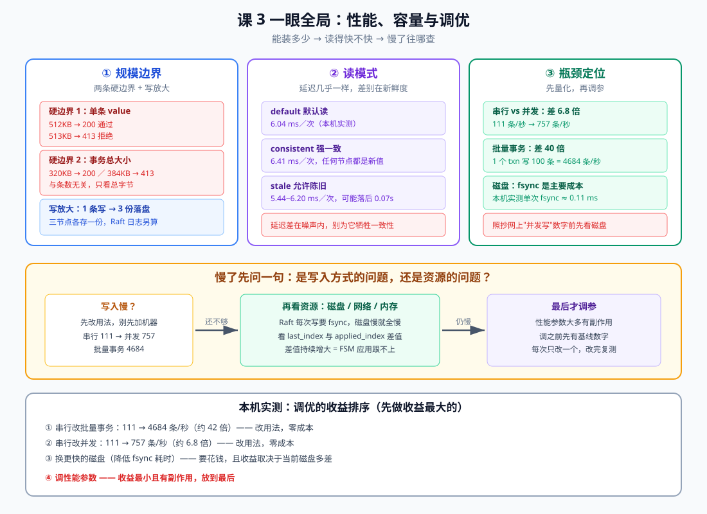
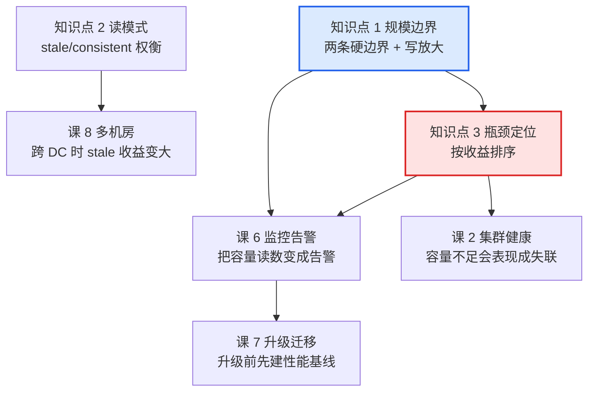

# 课 3：性能、容量与调优

> **本课目标**：把"Consul 能撑多大"从一句传闻变成**两条实测出来的硬边界**，把"读得快不快"变成**三种读模式的新旧差异**，并能在慢的时候**按收益排序**判断该改用法、加资源还是调参数。
> **情节定位**：课 2 把集群养住了。某天业务说"服务注册变慢了"，小林的第一反应是"加机器"。但他先跑了一遍压测——**发现同样的机器，换个写法就能快 40 倍**。本课讲为什么。
> **前置**：[课 1 生产部署与集群搭建](./lesson-01-生产部署与集群搭建.md)（quorum）、[课 2 集群健康与 day-2 运维](./lesson-02-集群健康与day-2运维.md)（健康读数）、主线[课 5 Raft 与 Gossip 一致性成色](../../../stages/2-核心能力拆解/lessons/lesson-05-Raft与Gossip一致性成色.md)（三种读模式）。
>
> **本课所有命令与输出均为 2026-09-20 在本机 WSL Ubuntu 24.04 + Consul 2.0.2 真实实测**，吞吐数据取多轮稳定值。

---

## 第一幕：业务说"变慢了"，第一反应是加机器

监控图上，服务注册的平均耗时从 5ms 涨到了 50ms。

小林的结论：集群撑不住了，加两台 server。

在申请机器之前，他顺手写了个压测脚本，想留个"扩容前基线"。结果让他把申请单删了：

```text
同样 3 台机器，同样的 key 数量：
  串行一条条写：111 条/秒
  并发写：      757 条/秒
  批量事务写：  4684 条/秒
```

**同样的硬件，差 42 倍。** 慢的不是机器，是用法。

本课就讲这三件事：**能装多少**（硬边界在哪）、**读得多快**（三种读模式差什么）、**慢了查哪**（按收益排序）。

## 第二幕：两个 413

在讲吞吐之前，先说两个会**直接把请求打回**的硬边界。它们不是"变慢"，而是"不行"。

小林第一次用批量事务导入配置时，收到了这个：

```text
urllib.error.HTTPError: HTTP Error 413: Request Entity Too Large
```

他以为是网络问题，重试了三次。**每次都是 413**。

按[课 2 固化的三步核验](./lesson-02-集群健康与day-2运维.md)——不猜，二分定位：

```text
     5 条 x 65536B =   320 KB → OK
     6 条 x 65536B =   384 KB → 413 被拒
    20 条 x  8192B =   160 KB → OK
    40 条 x  8192B =   320 KB → OK
    60 条 x  8192B =   480 KB → 413 被拒
```

**与条数无关，只看总字节数**：20 条×8KB 和 40 条×8KB 都是 320KB 以内，都过；60 条×8KB 到 480KB，拒。临界点在 **320KB 放行 / 384KB 拒绝**之间。

另一条边界是单条 KV：

```text
  单条 value=256KB → HTTP=200
  单条 value=512KB → HTTP=200   ← 放行
  单条 value=513KB → HTTP=413   ← 拒绝
  单条 value=1024KB → HTTP=413
```

**512KB 是单条上限**（与官方口径一致）。

> 这两条边界的价值不在于"记住数字"，而在于**它给了你一个判断**：遇到 413 时，你知道这是**设计上的硬限制**，重试一万次也没用——**要拆请求，不是重试**。

## 第三幕：层层揭示



> **看图**：上排三块——两条硬边界、三种读模式、瓶颈定位。中间是慢了之后的排查顺序：**先改用法，再看资源，最后才调参**。底部是实测的收益排序。

### 知识点 1：规模边界——能装多少，以及写放大

**一句话定义**：Consul 的容量边界不是"能注册多少服务"这种模糊说法，而是**两条可实测的硬限制**（单条 value 512KB、事务总大小约 384KB），加上一个持续存在的成本——**写放大**：一次写入要在每个 server 各落一份，且都要过 fsync。

**直觉建立**：**寄挂号信 vs 寄包裹**。一封信（单条 KV）超重有明确上限（512KB）；一次打包寄多个（事务）总重也有上限（约 384KB）。而挂号信要**收件人签收**（fsync 落盘）——三个 server 就是三个人都要签收，这就是写放大。

**核心原理**：

**硬边界（实测）**：

| 边界 | 实测临界点 | 超限表现 | 意味着 |
|------|-----------|---------|--------|
| 单条 KV value | 512KB 过 / 513KB 拒 | HTTP 413 | 单条配置不能塞大对象 |
| 事务总请求体 | 320KB 过 / 384KB 拒 | HTTP 413 | 批量导入要分批 |

**为什么是 413 而不是超时**：这是**主动拒绝**，服务端看请求体超了就直接回绝，**不消耗 Raft 写入**。所以它是"保护"而非"故障"——真让它写进去，一条几 MB 的日志项会把 Raft 复制拖垮。

**写放大：一条写入的真实成本**

一次 `PUT /v1/kv/...` 在 3 节点集群里发生的事：

```text
1. 请求打到 leader
2. leader 写 Raft 日志 → fsync 落盘
3. 复制到 follower（2 台）→ 各自 fsync 落盘
4. 多数派确认后 commit
5. 各节点应用到状态机（FSM）→ 再落盘一次
```

所以**一条 KV 不是存一份，是存三份**（三个 server 各一份），且**至少两次 fsync**（Raft 日志 + 状态机）。

实测佐证——三节点都能读到同一条数据，且数据目录都在增长：

```text
  node1 数据目录=67144566 字节  本节点能读到=[amplification-test-value]
  node2 数据目录=67144575 字节  本节点能读到=[amplification-test-value]
  node3 数据目录=67144566 字节  本节点能读到=[amplification-test-value]
```

> ⚠️ **测量提醒**：本课第一次测"单条 KV 磁盘成本"时用 `du` 得到"增长 0 字节"——**这是假象**。Consul 2.0 改用 WAL（预写日志）后，数据目录会预分配到 65MB 并复用，**小批量写入不会让 `du` 变化**。要测容量请用 **KV 条数 API**（`/v1/kv/?keys`）或看 Raft index，别用 `du`。

**吞吐基线（本机实测，取多轮稳定值）**：

| 方式 | 吞吐 | 相对串行 |
|------|------|---------|
| 串行单条写 | 111 条/秒 | 1x |
| 并发写（10 并发） | 757 条/秒 | **6.8x** |
| 批量事务（1 请求 100 条） | **4684 条/秒** | **42x** |

**为什么差这么多**：串行时每条都要等一次完整的"fsync + 网络 RTT + 多数派确认"（本机实测单条约 9.4ms）。批量事务把这 100 条的等待**合并成一次**——0.021 秒写完 100 条。

**value 大小的影响（事务写入）**：

```text
  value=  1024B: 20 条 → 1139 条/秒 (1139 KB/s)
  value= 10240B: 20 条 →  759 条/秒 (7587 KB/s)
```

条数吞吐下降，但**字节吞吐涨了 6.7 倍**——说明瓶颈在**每条的固定开销**（fsync + Raft），不在字节传输。所以：**小 value 拼成批量，比大 value 单发划算**。

**示例演示**：批量事务的写法

```bash
python3 - <<'PYEOF'
import json,urllib.request
ops=[{"KV":{"Verb":"set","Key":f"cfg/{i}","Value":"dg=="}} for i in range(100)]
req=urllib.request.Request("http://127.0.0.1:8501/v1/txn",
                           data=json.dumps(ops).encode(), method="PUT")
urllib.request.urlopen(req,timeout=30)
PYEOF
```

**常见误区**：

- *"413 是偶发，重试就行"* —— 不是。**是请求体超限，重试永远 413**。要拆成多个小事务。
- *"服务实例数有个官方上限"* —— 真正的硬限制是上面两条。**实例数**主要受内存与 gossip 压力影响，是"软"的。
- *"写一条就存一份"* —— 三份（每个 server 一份）+ Raft 日志。容量规划要乘节点数。
- *"用 du 看数据目录就知道占多少"* —— 见上面的测量提醒，WAL 预分配会让这个数字失真。

**一句话记住**：**两条硬边界**（512KB / 约 384KB）会直接 413，**要拆不要重试**；写入成本是**三份落盘 + 两次 fsync**，所以**批量事务比单条快 42 倍**。

### 知识点 2：读模式与缓存——stale 值不值得

**一句话定义**：三种读模式的**延迟几乎一样**（实测 5.44~6.41 ms），真正的差别是**新鲜度**——`stale` 允许读到约 0.07 秒前的旧值，换来的延迟收益**不到 1 毫秒**。

**直觉建立**：**看航班屏 vs 问地勤**。看大屏（stale）快，但可能延迟几秒没更新；问地勤（consistent）要走过去问一句（多一次 Raft 确认），但一定是最新。**在信息亭就在旁边的情况下，两者耗时几乎没差**——本地回环网络里就是这样。

**核心原理**：

**三种模式实测（各 300 次）**：

```text
  default                300 次 1.812s  单次 6.04 ms
  consistent             300 次 1.924s  单次 6.41 ms
  stale                  300 次 1.633s  单次 5.44 ms
```

| 模式 | 延迟 | 新鲜度 | 走不走 Raft |
|------|------|--------|------------|
| `default` | 6.04 ms（复验 6.16） | 通常最新 | leader 本地读，不额外确认 |
| `consistent` | 6.41 ms（复验 6.63） | **保证最新** | 是（多数派确认） |
| `stale` | 5.44 ms（复验 6.20） | **可能落后** | 否，任意节点本地读 |

> ⚠️ **这三行的顺序不稳定**。复验时测到 `default=6.16 / consistent=6.63 / stale=6.20`——**stale 反而比 default 略慢**。
>
> **正确读法**：三者差值在**测量噪声范围内**（本机多轮极差 0.34~1.03 ms），**不要把"stale 快 0.6ms"当成稳定结论**。稳定的只有两点：①`consistent` 略慢（要过 Raft）；②三者都是同一量级。

**stale 的陈旧窗口实测**：

写完新值后立刻在 follower 上反复 `stale` 读，测多久追上（3 轮）：

```text
  第1 轮: stale 追上新值耗时 0.081s
  第2 轮: stale 追上新值耗时 0.077s
  第3 轮: stale 追上新值耗时 0.065s
```

同一时刻的对照：

```text
  follower stale      = AAA     ← 旧值
  follower consistent = BBB     ← 新值
```

用 `X-Consul-Index` 量化落后多少：

```text
  node1 (follower): stale index=965  consistent index=966
  node2 (follower): stale index=965  consistent index=966
  node3 (leader  ): stale index=966  consistent index=966
```

**follower 的 stale index 比 leader 少 1**——这就是那 0.07 秒里发生的事。

**结论：stale 的延迟收益在噪声范围内（多轮极差 0.34~1.03ms），代价是可能读到约 0.07 秒前的旧值。**

**什么情况下值得**：

| 场景 | 建议 | 理由 |
|------|------|------|
| 服务发现（拉实例列表） | `stale` 可接受 | 实例列表本来就允许短暂不一致 |
| 读配置决定要不要发货 | **必须用 `consistent`** | 旧值可能造成真实损失 |
| 跨 DC / 高延迟网络 | `stale` 收益变大 | RTT 大时 consistent 的成本才显著 |
| 本机回环 / 同机房低延迟 | **收益极小** | 实测只差 0.6ms |

> **本机局限说明**：以上延迟都是**回环网络（RTT ≈ 0.09ms）**下的数字。真实跨机房 RTT 可能 10~50ms，那时 `consistent` 的成本会明显高于 `stale`，权衡结论也会变。**不要把这个 0.6ms 差值直接外推到生产**。

**阻塞查询（watch）的代价**：

```text
  阻塞查询（无变更，等满 2s）耗时 2.08s
  20 个并发阻塞查询耗时 1.08s
```

阻塞查询会**挂住连接**直到有变更或超时。这是它的价值（实时通知），也是它的成本——**每个 watch 就是一个长连接**。几千个客户端各开一个 watch，就是几千个长连接。

**常见误区**：

- *"stale 快很多，全用 stale"* —— 本机多轮实测**收益在噪声内**（0.34~1.03ms，复验轮次 stale 反而更慢）。为这点不稳定收益承担陈旧读，通常不划算。
- *"default 就是强一致"* —— 不保证。`default` 是 leader 本地读，**不走 Raft 确认**，正常情况下最新，但不提供保证。要保证就用 `consistent`。
- *"stale 读到的一定是旧的"* —— 不一定。leader 上读 stale 就是新的（实测 index 966 = consistent）。**只有 follower 上才可能陈旧**。
- *"阻塞查询很省，一个连接搞定"* —— 省的是轮询请求数，**费的是连接持有时间**。

**一句话记住**：三种读模式**延迟差在噪声范围内**（多轮极差约 1ms），差别在**新鲜度**；`stale` 落后约 0.07 秒，**只有跨机房才值得为它牺牲一致性**。

### 知识点 3：瓶颈定位与调优——按收益排序

**一句话定义**：慢了之后，**先改用法（收益 6~42 倍、零成本），再看资源（磁盘 fsync 是 Raft 的主要成本），最后才调参数**（收益最小且有副作用）。

**直觉建立**：**水管细 vs 水压低**。水小的时候，先看看是不是**你一次只接一杯**（串行写入），而不是先换水管。换水管（加机器/换磁盘）要花钱，而"一次接一桶"（批量事务）不要钱。

**核心原理**：

**收益排序（本机实测）**：

| 手段 | 吞吐 | 倍数 | 成本 |
|------|------|------|------|
| 串行 → 批量事务 | 111 → 4684 条/秒 | **42x** | 零，改代码 |
| 串行 → 并发 | 111 → 757 条/秒 | **6.8x** | 零，改代码 |
| 换更快磁盘 | 降低 fsync 耗时 | 取决于现状 | 要花钱 |
| 调性能参数 | 通常 <2x | 最小 | **有副作用** |

**为什么 fsync 是关键**：Raft 每次提交都要持久化，**fsync 的耗时直接决定了写入上限**。本机实测：

```text
  200 次 512B 同步写耗时 0.022s → 单次 fsync 约 0.11 ms
```

这个数字解释了为什么串行只有 111 条/秒：**每条约 9ms，其中大部分在等 fsync 与复制确认**，而不是在算。

> ⚠️ **本机数据不可外推**：0.11ms 是 WSL 虚拟磁盘的数字。**生产环境的 SSD fsync 通常更快，而云盘/网络存储可能慢 10 倍以上**。这就是为什么"网上说的并发写数字"到你机器上往往对不上——**先测自己的 fsync**。

**怎么看瓶颈：Raft 的两个 index**

```bash
curl -s http://127.0.0.1:8501/v1/agent/metrics | python3 -c "
import sys,json
d=json.load(sys.stdin)
g=d.get('Gauges',{})
for k,v in g.items():
    if 'raft.last_index' in k or 'raft.applied_index' in k:
        print(k, v['Value'])
"
```

```text
  consul.<node>.raft.last_index     = 975
  consul.<node>.raft.applied_index  = 975
```

| 观察 | 含义 | 处置 |
|------|------|------|
| `last_index` 远大于 `applied_index` | **FSM 应用跟不上** | 磁盘慢或大 value 太多，查磁盘 |
| 两个相等但写入仍慢 | 瓶颈在网络/确认 | 查 RTT、节点间延迟 |
| 各节点 index 差很多 | 复制滞后 | 查落后节点的磁盘与网络 |

**其他可看的资源读数**：

```text
  node1 PID=538604
  RSS=131.8 MB  VSZ=1428.5 MB  CPU=10:31%   ← 3 节点小集群的内存基线
  WAL 文件数: 2      快照目录: 0 个
```

**调优的顺序与纪律**：

1. **先建基线**：调之前必须有一个数字（如"串行 111 条/秒"）
2. **先改用法**：批量事务 > 并发 > 单条
3. **再查资源**：fsync 耗时、RTT、index 差值
4. **最后调参**，且遵守：**一次只改一个，改完立刻复测**

> **调参的诚实纪律**（沿用[评审清单已固化](../../../00-评审清单.md)的原则）：**没测出效果的参数不要留着**。改了参数但吞吐没变，就把参数改回去——留着只会让下次排障的人误以为"这个已经调过了"。

**常见误区**：

- *"慢了就加机器"* —— 第一幕的教训。加机器**不能**解决串行写入的问题，因为瓶颈是每条的 fsync 等待，不是 CPU 或容量。
- *"网上说 Consul 能到几万 QPS，我们也行"* —— 那个数字通常是在特定硬件（NVMe、低 RTT）和特定用法（并发/批量）下测的。**先测自己的 fsync**，再看要不要信。
- *"参数调了就一定快"* —— 性能参数几乎都是**用一致性或安全性换吞吐**。调之前要清楚代价。
- *"applied_index 落后一点没事"* —— 持续落后说明状态机应用跟不上，**最终会拖慢所有读**（读要过状态机）。

**一句话记住**：**先改用法（42 倍），再换磁盘，最后才调参**；判瓶颈看 `last_index` 与 `applied_index` 的差值，**没有基线数字就不要调参**。

---

## 第四幕：实操验证（完整复现清单）

> **场地**：WSL Ubuntu 24.04 + Consul 2.0.2，3 节点集群（沿用课 2 环境）。
> 若环境已清理，先跑课 1 第四幕的"第 0~2 步"重建基线。

### 第 1 步：两条硬边界

```bash
export CONSUL_HTTP_ADDR=http://127.0.0.1:8501

# 1a. 单条 value 上限（用文件传，别用 -d，否则命令行过长）
T=/tmp/bigval.bin
for KB in 256 512 513; do
  python3 -c "open('$T','wb').write(b'x'*($KB*1024))"
  echo "  ${KB}KB → HTTP=$(curl -s -o /dev/null -w '%{http_code}' -X PUT --data-binary @$T $CONSUL_HTTP_ADDR/v1/kv/limit/s$KB)"
done
rm -f $T
# 期望：256/512 → 200，513 → 413
```

```bash
# 1b. 事务总大小（二分定位）
python3 - <<'PYEOF'
import json,urllib.request,base64
for n,sz in [(5,65536),(6,65536),(40,8192),(60,8192)]:
    ops=[{"KV":{"Verb":"set","Key":f"lm/{n}_{sz}/{i}","Value":base64.b64encode(b'x'*sz).decode()}} for i in range(n)]
    try:
        r=urllib.request.urlopen(urllib.request.Request("http://127.0.0.1:8501/v1/txn",
            json.dumps(ops).encode(),method="PUT"),timeout=60)
        print(f"  {n}x{sz}B = {n*sz//1024}KB → OK")
    except Exception as e:
        print(f"  {n}x{sz}B = {n*sz//1024}KB → {getattr(e,'code','ERR')} 被拒")
PYEOF
# 期望：320KB 过 / 384KB 过 / 320KB 过 / 480KB 被拒
```

### 第 2 步：吞吐基线（三种写法对比）

```bash
# 2a. 串行 60 条
S=$(date +%s.%N)
for i in $(seq 1 60); do curl -s -o /dev/null -X PUT -d s $CONSUL_HTTP_ADDR/v1/kv/cmp/s/$i; done
E=$(date +%s.%N); python3 -c "print(f'  串行: {60/($E-$S):.0f} 条/秒')"

# 2b. 并发 60 条（10 并发 × 6 批）
S=$(date +%s.%N)
for b in $(seq 1 6); do
  for i in $(seq 1 10); do curl -s -o /dev/null -X PUT -d c $CONSUL_HTTP_ADDR/v1/kv/cmp/c/$b/$i & done
  wait
done
E=$(date +%s.%N); python3 -c "print(f'  并发: {60/($E-$S):.0f} 条/秒')"
```

```bash
# 2c. 批量事务：1 个请求写 100 条
python3 - <<'PYEOF'
import json,urllib.request,time
ops=[{"KV":{"Verb":"set","Key":f"txn/{i}","Value":"dg=="}} for i in range(100)]
t=time.time()
urllib.request.urlopen(urllib.request.Request("http://127.0.0.1:8501/v1/txn",
    json.dumps(ops).encode(),method="PUT"),timeout=30)
print(f"  批量事务 100 条: {100/(time.time()-t):.0f} 条/秒")
PYEOF
```

**期望**：串行约 110、并发约 750、批量事务约 4600 条/秒（本机回环环境）。

### 第 3 步：三种读模式延迟

```bash
bench() {
  S=$(date +%s.%N)
  for i in $(seq 1 300); do curl -s -o /dev/null "$1"; done
  E=$(date +%s.%N)
  python3 -c "print(f'  $2: 单次 {($E-$S)/300*1000:.2f} ms')"
}
bench "$CONSUL_HTTP_ADDR/v1/kv/cmp/s/1?raw"             "default   "
bench "$CONSUL_HTTP_ADDR/v1/kv/cmp/s/1?raw&consistent"  "consistent"
bench "$CONSUL_HTTP_ADDR/v1/kv/cmp/s/1?raw&stale"       "stale     "
```

**期望**：三者都在 5~7ms，差值不到 1ms。

### 第 4 步：stale 的陈旧窗口

```bash
# 取 leader 与某个 follower（注意：raft list-peers 的 State 是第 4 列）
peers() { consul operator raft list-peers | awk 'NR>1 && NF>=6'; }
LN=$(peers | awk '$4=="leader"{print $1}' | grep -oE '[0-9]+$')
FN=$(peers | awk '$4!="leader"{print $1}' | head -1 | grep -oE '[0-9]+$')
echo "leader=node$LN follower=node$FN"

curl -s -o /dev/null -X PUT -d AAA "http://127.0.0.$LN:$((8500+LN))/v1/kv/lag/p"; sleep 1
curl -s -o /dev/null -X PUT -d BBB "http://127.0.0.$LN:$((8500+LN))/v1/kv/lag/p"
echo -n "  follower stale      = "; curl -s "http://127.0.0.$FN:$((8500+FN))/v1/kv/lag/p?raw&stale"; echo
echo -n "  follower consistent = "; curl -s "http://127.0.0.$FN:$((8500+FN))/v1/kv/lag/p?raw&consistent"; echo
```

**期望**：`stale` 读到旧值 `AAA`，`consistent` 立刻读到新值 `BBB`。

### 第 5 步：Raft index 与瓶颈读数

```bash
curl -s $CONSUL_HTTP_ADDR/v1/agent/metrics | python3 -c "
import sys,json
d=json.load(sys.stdin)
g=d.get('Gauges',{})
if isinstance(g,list): g={s['Name']:s for s in g if isinstance(s,dict) and 'Name' in s}
for k,v in g.items():
    if 'raft.last_index' in k or 'raft.applied_index' in k:
        print(f'  {k} = {v[\"Value\"] if isinstance(v,dict) else v}')
"
```

```bash
# fsync 能力（Raft 写入的关键成本）
S=$(date +%s.%N)
dd if=/dev/zero of=/tmp/f bs=512 count=200 conv=fsync 2>/dev/null
E=$(date +%s.%N); rm -f /tmp/f
python3 -c "print(f'  单次 fsync 约 {($E-$S)/200*1000:.2f} ms')"
```

### 第 6 步：收摊

```bash
pkill -f 'consul agent'; sleep 2; pgrep -cf 'consul agent'   # 0
```

**本机适配备忘**：

- 测单条大 value **必须用 `--data-binary @文件`**，用 `-d` 会报 `Argument list too long`
- `raft list-peers` 的 **State 是第 4 列**（`$4`），不是 `$3`——本课脚本误用过 `$3`，导致 follower 取空
- `/v1/agent/metrics` 的 `Gauges` **可能是 list 也可能是 dict**，解析要兼容两种
- 用 `du` 测容量会得到 0（WAL 预分配），改用 KV 条数 API 或 Raft index
- **`pkill -f 'consul agent'` 会连自己一起杀**（该命令行本身包含这个字符串，会匹配到自身 shell）。用 `pgrep -x consul` 按进程名精确匹配
- 吞吐数字是**回环网络**下的，跨机房会显著不同

纸面验收：合上讲义回答——收到 413 时该重试还是拆请求？串行慢的原因是什么？stale 省了多少延迟、换来什么？

## 第五幕：体系收束

回到第一幕。小林最后没申请机器，而是把批量导入改成了事务：

| 他的判断 | 实际情况 |
|---------|---------|
| "集群撑不住了" | 集群很闲，CPU 0.9%、RSS 126MB |
| "加两台 server" | 加了也没用，瓶颈是每条的 fsync 等待 |
| — | 改成批量事务后 **快 42 倍**，零成本 |

三个知识点在全局的位置：



**自测思考题**：

1. 批量导入时报 `413 Request Entity Too Large`，重试三次还是 413。为什么？怎么处理？
   *提示：413 是**请求体超限的主动拒绝**，不是偶发故障，重试永远失败——**要拆请求**。先二分定位自己的上限（本课实测事务总大小 320KB 过 / 384KB 拒），再按此分批。注意超限判断看**总字节数**而非条数。*
2. 同样的 3 台机器，串行写 111 条/秒，批量事务能到 4684 条/秒。多出来的 42 倍从哪来？
   *提示：串行时**每条**都要等一次完整的"fsync + 复制 + 多数派确认"（本机约 9.4ms/条）。批量事务把 100 条的等待**合并成一次**。所以省的是等待次数，不是计算量——这也解释了为什么加机器没用。*
3. 同事说"stale 快很多，全站改成 stale 读"。你怎么回应？
   *提示：本机多轮实测三种模式延迟在 5.4~6.6ms 之间波动，**stale 的收益落在测量噪声内**（复验那轮 stale 甚至比 default 略慢）。为这点不稳定的收益承担陈旧读，通常不划算。真正的代价是读到约 0.07 秒前的旧值（follower 的 stale index 比 leader 少 1），配置类读取用旧值可能造成真实损失。**只有跨机房/高 RTT 场景 stale 的收益才显著**——且本机是回环网络（RTT≈0.09ms），这个结论不能外推。*
4. 你调了一个性能参数，吞吐从 111 变成 118。这个参数该留着吗？
   *提示：按"没有测出效果就不留"的诚实纪律——**7% 在测量噪声范围内**（本课串行多轮实测在 107~116 之间波动），不能算有效。改回去，并在文档里记下"试过，无效"。留着只会让下次排障的人误以为这一项已经调过。*

---

## 📇 概念速查卡

| 术语 | 一句话解释 | 本课角色 |
|------|-----------|----------|
| 413 Request Entity Too Large | 请求体超限的**主动拒绝**，重试无效 | 硬边界的表现 |
| 单条 value 上限 | 512KB 过 / 513KB 拒 | 硬边界 1 |
| 事务总大小上限 | 320KB 过 / 384KB 拒（按总字节） | 硬边界 2 |
| 写放大 | 一条写在每个 server 各落一份 + Raft 日志 | 容量规划要乘节点数 |
| fsync | 落盘确认，Raft 提交的主要成本 | 写入上限的决定因素 |
| 批量事务 `/v1/txn` | 一个请求写多条，吞吐提升 42 倍 | 首选优化手段 |
| `default` 读 | leader 本地读，6.04ms，不保证最新 | 读模式 1 |
| `consistent` 读 | 过 Raft 确认，6.41ms，保证最新 | 读模式 2 |
| `stale` 读 | 任意节点本地读，5.44ms，可能落后 | 读模式 3 |
| 陈旧窗口 | stale 落后约 0.07 秒 | 选 stale 的代价 |
| `X-Consul-Index` | 状态机版本号，可量化落后程度 | 观测陈旧程度 |
| 阻塞查询 `?index=&wait=` | 长轮询，实时但占连接 | watch 的代价 |
| `raft.last_index` | 已写入 Raft 日志的最新位置 | 瓶颈判据 |
| `raft.applied_index` | 已应用到状态机的位置 | 与 last 的差 = FSM 落后 |
| WAL 预分配 | Consul 2.0 用 WAL，`du` 会失真 | 测量陷阱 |

## 🚀 下一批接力提示词

> 学完本课后，**复制下面这段文字发给 AI**，即可无缝进入下一批：

```
继续学 Consul 运维专项。我的学习档案在 consul/00-学习档案.md，
刚学完子教程《运维专项》课 3《性能、容量与调优》
知识点（规模边界与写放大、读模式与stale陈旧窗口、瓶颈定位与按收益排序调优），
请按大纲继续讲解课 4《证书与密钥生命周期》。
```

## 🧭 课程导航

- [返回子教程总览](../overview.md)
- [上一课：课 2 集群健康与 day-2 运维](./lesson-02-集群健康与day-2运维.md)
- 下一课：课 4 证书与密钥生命周期（尚未生成，生成后改为链接）
- [返回课程目录](../../../02-课程目录.md)
- [回主线：课 5 Raft 与 Gossip 一致性成色](../../../stages/2-核心能力拆解/lessons/lesson-05-Raft与Gossip一致性成色.md)
