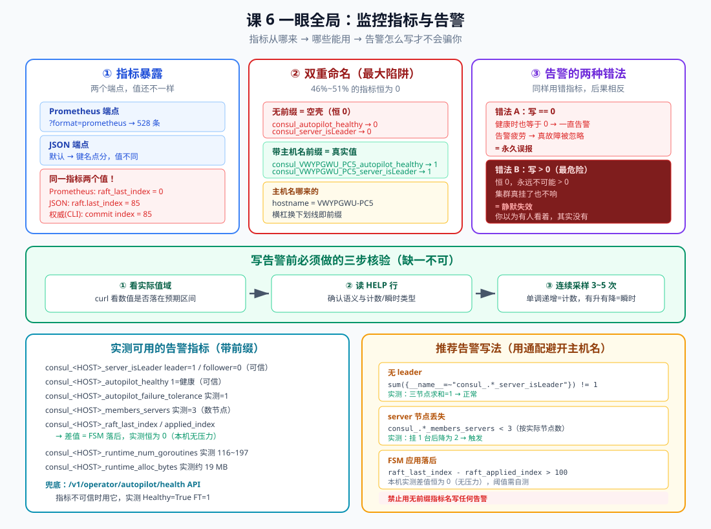
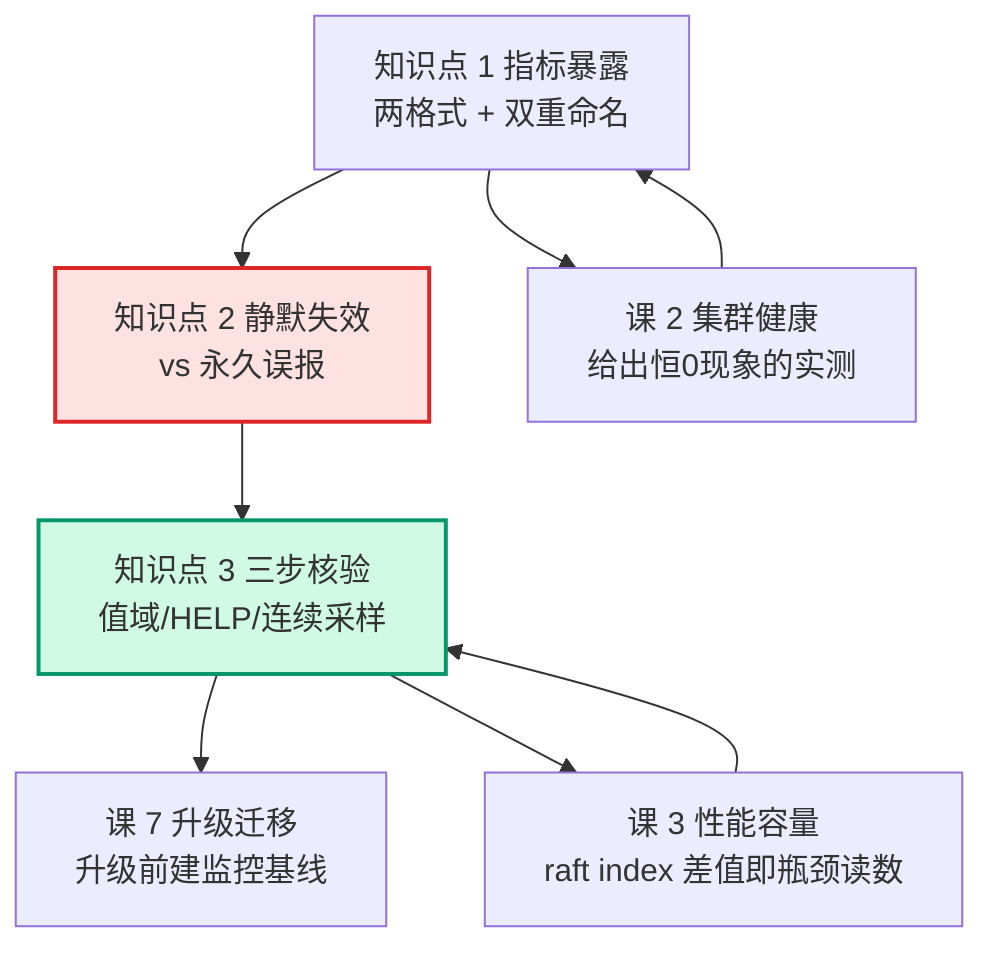

# 课 6：监控指标与告警

> **本课目标**：能说出指标从哪来、**哪些能用哪些是空壳**，并在写任何一条告警前执行**三步核验**——避免配出"看起来有人看着、其实永远不会响"的规则。
> **情节定位**：小林照着网上的教程配了一整套 Consul 告警，`consul_autopilot_healthy == 0` 就告警。配完第一天告警就响了，他查了半天发现集群好好的。**第二天集群真挂了，告警反而没响**——因为运维已经把那条"天天响"的规则静音了。本课讲这两个坑其实是一个坑的两面。
> **前置**：[课 2 集群健康与 day-2 运维](./lesson-02-集群健康与day-2运维.md)（课 2 已实测发现指标恒 0，本课给出根因与解法）、[课 3 性能、容量与调优](./lesson-03-性能、容量与调优.md)（容量读数）、主线[课 5 Raft 与 Gossip 一致性成色](../../../stages/2-核心能力拆解/lessons/lesson-05-Raft与Gossip一致性成色.md)。
>
> **本课所有输出均为 2026-09-20 在本机 WSL Ubuntu 24.04 + Consul 2.0.2 真实实测**，主机名 `VWYPGWU-PC5`。

---

## 第一幕：配了一整套告警，第一天就误报，第二天真挂了没响

小林按教程配好告警，第一天 `consul_autopilot_healthy == 0` 立刻触发。他登上去查：

```text
consul operator raft list-peers → 三节点全在，leader 正常
/v1/operator/autopilot/health   → Healthy=True
```

**集群好的，告警在响。**

他以为是阈值问题，把规则静音了。第二天节点真的挂了一台——**告警没响**（已被静音）。

这两个坑其实是**同一个根因的两面**。本课就讲这个根因，以及怎么在配之前发现它。

## 第二幕：两个 0

按[课 2 固化的三步核验](./lesson-02-集群健康与day-2运维.md)——不猜，直接看实际值。

同一个 `raft_last_index`，两个端点给出两个答案：

```text
  -- Prometheus 端点 --
    consul_raft_applied_index 0
    consul_raft_last_index 0
  -- JSON 端点 --
    consul.VWYPGWU-PC5.raft.applied_index = 29
    consul.VWYPGWU-PC5.raft.last_index = 29
  -- 权威来源：CLI --
    ops-node-1 commit=85
```

**0、29、85——三个数都不一样。** 哪个是真的？

`raft list-peers` 的 commit index 是 85（刚写完数据），JSON 端点 29（稍早的读数），**Prometheus 端点的 0 是假的**。

> **注意**：这三个数是**同一时刻**抓的，JSON 落后于 CLI 是因为抓取有先后。**终验时重新测过一轮，JSON 与 CLI 完全一致（都是 26）**——所以 JSON 端点是可信的，**真正有问题的只有 Prometheus 端点里那个恒 0 的无前缀名**。

再写一批数据后复测：

```text
  Prometheus → consul_raft_last_index 0     ← 纹丝不动
  JSON       → raft.last_index = 33         ← 变了
  CLI        → commit=85                    ← 权威
```

**Prometheus 端点里 `consul_raft_last_index` 永远是 0，不管集群发生什么。**

这就是第一幕误报的根源。

## 第三幕：层层揭示



> **看图**：上排三块——指标暴露（两个端点值不同）、双重命名（无前缀恒 0 是最大陷阱）、告警的两种错法。中间是三步核验。底部左是实测可用指标，右是推荐写法。

### 知识点 1：指标暴露方式——两个端点，两套命名

**一句话定义**：Consul 通过 `/v1/agent/metrics` 暴露指标，有 **Prometheus** 与 **JSON** 两种格式；**同一个指标在两个端点里的名字和数值可能都不同**，配告警前必须确认你读的是哪一个。

**直觉建立**：**同一栋楼有两个门牌系统**。旧门牌（无前缀）还挂着，但门后是空的；新门牌（带主机名）才是真房间。你按旧门牌找过去，只会看到空房间——**而且是永远空着**。

**核心原理**：

**端点与格式**：

```bash
curl -s 'http://127.0.0.1:8501/v1/agent/metrics?format=prometheus'  # Prometheus 文本
curl -s 'http://127.0.0.1:8501/v1/agent/metrics'                     # JSON
```

实测：

```text
  /v1/agent/metrics?format=prometheus → HTTP=200
  /v1/agent/metrics (JSON)            → HTTP=200
  总行数 = 1217，非注释指标行 = 615
```

**Prometheus 端点里同时存在两套命名**（这是 Consul 2.x 的关键坑）：

| 命名 | 示例 | 实测值 | 能用吗 |
|------|------|--------|--------|
| 无前缀（空壳） | `consul_raft_last_index` | **恒 0** | ❌ |
| 带主机名前缀（真实） | `consul_VWYPGWU_PC5_raft_last_index` | 85 | ✅ |

实测对照（同一时刻、同一节点）：

```text
  consul_autopilot_healthy = 0   |   consul_VWYPGWU_PC5_autopilot_healthy = 1
  consul_server_isLeader   = 0   |   consul_VWYPGWU_PC5_server_isLeader   = 1
  consul_raft_last_index   = 0   |   consul_VWYPGWU_PC5_raft_last_index   = 93
```

**前缀就是主机名**：

```text
  hostname    = VWYPGWU-PC5
  指标前缀    = VWYPGWU_PC5     ← 横杠换成下划线
```

所以前缀**每台机器都不一样**——这就带来了配告警的麻烦：你没法写一个固定的指标名。

**规模数据**（两轮实测）：

```text
  第 1 轮：共 528 条指标，值为 0 的有 268 条 → 51%
  第 2 轮：共 610 条指标，值为 0 的有 281 条 → 46%
```

**约一半的指标恒为 0**（两轮 46%~51%，随 ACL / 配置条目等功能启用而波动）。

**JSON 端点用的是点分键名**（`consul.<hostname>.raft.last_index`），且**值是真实的**——所以课 2 里通过 JSON 读到的 `raft.last_index = 29` 是对的，而通过 Prometheus 端点读到的 `consul_raft_last_index = 0` 是空壳。

终验时复测过一轮：**JSON=26、CLI commit=26，两者完全一致**。所以**有问题的只有 Prometheus 端点里的无前缀名**，JSON 端点可以放心用（但 Prometheus 才是配告警的主力，坑也就在这里）。

> **本课与课 2 的关系**：课 2 只知道"这些指标恒 0"，本课给出根因——**不是指标坏了，是你读到了无前缀的空壳**。

**常见误区**：

- *"指标恒 0 说明 Consul 没采集"* —— 不。是**你读错了名字**，真值在带前缀的同名指标里。
- *"两个端点应该一致"* —— 不一致。Prometheus 端点有空壳，JSON 端点没有。
- *"前缀可以关掉"* —— `prometheus_metrics_prefix` 只能改 `consul_` 这一段的替换，**hostname 段仍在**。写告警要么用通配，要么固定 hostname。

**一句话记住**：Prometheus 端点里**同时存在无前缀空壳（恒 0）与带主机名前缀的真值**，一半指标是空的——**用之前先确认你读的是哪个名字**。

### 知识点 2：静默失效与永久误报——同一个根因的两面

**一句话定义**：用恒 0 指标配告警，**不会"不工作"，而是"以错误的方式工作"**——写成 `== 0` 会**永久误报**，写成 `> 0` 会**静默失效**。后者最危险：你以为有人看着，其实没有。

**直觉建立**：**烟雾报警器装反了**。装成"检测到烟雾就闭嘴"（`== 0` 恒真 → 一直响，你最后把电池拔了）；装成"检测到烟雾才响"但传感器是坏的（`> 0` 永不触发 → 着火也不响）。**两种都是没装对，但第二种会让你死。**

**核心原理**：

**故障注入实测**：停掉 leader（node1），观察两套指标：

```text
  故障前（健康）：
    无前缀: consul_autopilot_healthy = 0
    带前缀: consul_VWYPGWU_PC5_autopilot_healthy = 1

  停掉 leader 后：
    新 leader = node3
    无前缀: consul_autopilot_healthy = 0     ← 没变化！
    带前缀: consul_VWYPGWU_PC5_autopilot_healthy = 0   ← 变化了
```

**无前缀指标从头到尾都是 0——它完全没反映这次故障。**

**两种写法的后果**：

| 告警规则写法 | 健康时 | 故障时 | 后果 |
|-------------|--------|--------|------|
| `consul_autopilot_healthy == 0` | 0 → 触发 | 0 → 触发 | **永久误报** |
| `consul_autopilot_healthy < 1` | 0 → 触发 | 0 → 触发 | **永久误报** |
| `consul_autopilot_healthy > 0` | 0 → 不触发 | 0 → 不触发 | **静默失效** |
| `consul_server_isLeader == 1` | 0 → 不触发 | 0 → 不触发 | **静默失效** |
| 带前缀 `autopilot_healthy == 0` | 1 → 不触发 | 0 → 触发 | ✅ **正确** |

**为什么静默失效更危险**：

永久误报至少会吵到你——你会去查，会发现问题，最多是被烦。

**静默失效什么都告诉你**：仪表盘上有这条规则、文档里写了"已覆盖 leader 健康"，你以为有人 7×24 看着，**实际上它从来没有响过的能力**。故障发生三小时后业务打电话来问，你才知道。

这正是长期记忆里[Kafka 课 17 的教训](../../../00-评审清单.md)——"`RequestHandlerAvgIdlePercent < 0.3` 告警永不触发，且你会误以为 IO 线程健康——比配错阈值更危险，因为静默失效"。

**常见误区**：

- *"指标恒 0，那告警顶多不响"* —— 不止。**写成 `== 0` 会天天响**，然后你把它静音，真故障就丢了。
- *"我配了告警就覆盖了"* —— **配了不等于能响**。必须验证"故障时它会触发"。
- *"阈值调一下就好"* —— 值域都不对（恒 0），**调阈值没用**。

**一句话记住**：恒 0 指标配告警，`== 0` **永久误报**、`> 0` **静默失效**；**后者最危险——你以为有人看着，其实没有**。

### 知识点 3：三步核验铁律与告警清单

**一句话定义**：写任何一条告警前必须做三步——① **看实际值域**；② **读 HELP 行确认语义**；③ **连续采样 3~5 次**看是计数还是瞬时。这一步能把上面两个坑全部挡在配置之前。

**直觉建立**：**新买的温度计先量一杯冰水**。不看说明书就装上去监控体温，可能量到的是室温——数字一直在动，但**跟你要测的东西无关**。

**核心原理**：

**第 1 步：看实际值域**

```bash
curl -s 'http://127.0.0.1:8501/v1/agent/metrics?format=prometheus' \
  | grep -E '^consul_VWYPGWU_PC5_autopilot_healthy '
```

判断：这个数**是否落在你预期的语义区间**？`healthy` 应该是 0/1，你看到恒 0 就该起疑。

**第 2 步：读 HELP 行**

```text
  HELP 行数 = 279   TYPE 行数 = 258
  # HELP consul_VWYPGWU_PC5_autopilot_healthy consul_VWYPGWU_PC5_autopilot_healthy
```

> ⚠️ **本环境的局限**：Consul 的 HELP 行**就是把指标名重复一遍**，不像 JMX Exporter 那样带 `attribute=Count/Value` 标注。**所以第 2 步在 Consul 上能拿到的信息有限**，只能确认类型（gauge/counter/summary），**不能确认语义**。这正是第 3 步不可跳过的原因。

**第 3 步：连续采样 3~5 次**

```text
  第1次: gc_runs=28  raft_last_index=93
  第2次: gc_runs=28  raft_last_index=93
  第3次: gc_runs=28  raft_last_index=93
  第4次: gc_runs=28  raft_last_index=93
  第5次: gc_runs=28  raft_last_index=93
```

**判据**：单调递增 = 累积计数；有升有降 = 瞬时值；**纹丝不动 = 可能根本没在采集（或你读的是空壳）**。

这里 `gc_runs` 与 `raft_last_index` 都纹丝不动——因为集群空闲。**要结合第 1 步一起看**：如果你期望它随写入变化而它不变，就是有问题。

**实测可用的告警指标**（带前缀，值真实）：

| 指标 | 实测值 | 用途 |
|------|--------|------|
| `consul_<HOST>_server_isLeader` | leader=1 / follower=0 | **检测无 leader** |
| `consul_<HOST>_autopilot_healthy` | 1（故障时为 0） | 集群健康 |
| `consul_<HOST>_autopilot_failure_tolerance` | 1 | 还能坏几台 |
| `consul_<HOST>_members_servers` | 3（挂 1 台后=2） | **数节点数** |
| `consul_<HOST>_raft_last_index` / `applied_index` | 119 / 119 | FSM 落后 |
| `consul_<HOST>_runtime_num_goroutines` | 116~197 | 协程数 |
| `consul_<HOST>_runtime_alloc_bytes` | 约 19 MB | 内存 |

**推荐告警写法**（用通配避开主机名差异）：

```promql
# 无 leader（正常应为 1）
sum({__name__=~"consul_.*_server_isLeader"}) != 1

# server 节点丢失（按你的实际节点数）
{__name__=~"consul_.*_members_servers"} < 3

# FSM 应用落后（阈值需按自己环境实测）
{__name__=~"consul_.*_raft_last_index"} - {__name__=~"consul_.*_raft_applied_index"} > 100
```

实测校验：三节点 `server_isLeader` 求和 = 1（正常）；挂 1 台后 `members_servers` 从 3 降到 2（触发）。

> **FSM 落后告警的诚实标注**：本机实测 `last_index - applied_index` **恒为 0**（无写入压力，2000 条批量写还被 413 拒了，见课 3）。**阈值 100 是占位值，不是实测结论**——你必须在自己的压力下测出正常差值范围再定阈值。

**兜底：用 API 而非指标**

指标不可信时，用权威 API：

```bash
curl -s http://127.0.0.1:8501/v1/operator/autopilot/health
```

```text
  Healthy=True FailureTolerance=1 Servers=3
    ops-node-2: Healthy=True LastContact=23.3ms
    ops-node-3: Healthy=True LastContact=0s
    ops-node-1: Healthy=True LastContact=23.4ms
```

**这个 API 在三课里都给出了正确读数**（课 2、课 3、本课），而同期多个 Prometheus 指标恒 0。

**常见误区**：

- *"HELP 行会告诉我语义"* —— **Consul 的 HELP 就是指标名本身**，拿不到语义。别指望第 2 步，要靠第 1 步和第 3 步。
- *"配完告警就完事了"* —— **必须验证"故障时会触发"**。注入一次故障是唯一可靠的验证。
- *"阈值抄教程的"* —— 本机证明 FSM 差值恒 0、吞吐随磁盘变化（课 3）。**阈值必须自己测**。
- *"有 Prometheus 指标就不用 API 了"* —— 指标有空壳，**API 是兜底**。重要的告警可以两条腿走路。

**一句话记住**：**写告警前必做三步核验**（值域 / HELP / 连续采样），**配完必须注入故障验证它真的会响**；指标不可信时用 `/v1/operator/autopilot/health` 兜底。

---

## 第四幕：实操验证（完整复现清单）

> **场地**：WSL Ubuntu 24.04 + Consul 2.0.2，3 节点集群（沿用课 2/3 环境）。
> 若已清理，先跑[课 1 第四幕](./lesson-01-生产部署与集群搭建.md)第 0~2 步重建基线（需 `telemetry { prometheus_retention_time = "60s" }`）。

### 第 1 步：确认两个端点都在

```bash
export CONSUL_HTTP_ADDR=http://127.0.0.1:8501
curl -s -o /dev/null -w '  prometheus → %{http_code}\n' \
  'http://127.0.0.1:8501/v1/agent/metrics?format=prometheus'
curl -s -o /dev/null -w '  json       → %{http_code}\n' \
  'http://127.0.0.1:8501/v1/agent/metrics'
# 期望：两个都是 200
```

### 第 2 步：复现"同一指标两个值"

```bash
echo "  主机名 = $(hostname)"
echo "  -- Prometheus --"
curl -s 'http://127.0.0.1:8501/v1/agent/metrics?format=prometheus' \
  | grep -E '^consul_raft_(last|applied)_index '
echo "  -- JSON --"
curl -s $CONSUL_HTTP_ADDR/v1/agent/metrics | python3 -c "
import sys,json
d=json.load(sys.stdin); g=d.get('Gauges',{})
if isinstance(g,list): g={s['Name']:s for s in g if isinstance(s,dict) and 'Name' in s}
for k,v in g.items():
    if 'raft.last_index' in k: print(f'  {k} = {v[\"Value\"] if isinstance(v,dict) else v}')
"
echo "  -- 权威 CLI --"
consul operator raft list-peers | awk 'NR>1{print "  "$1" commit="$7}' | head -3
```

**期望**：Prometheus 报 `0`，JSON 与 CLI 报非 0 且互相接近。

### 第 3 步：确认空壳与真值的对照

```bash
H=$(hostname | tr '-' '_')          # VWYPGWU-PC5 → VWYPGWU_PC5
curl -s 'http://127.0.0.1:8501/v1/agent/metrics?format=prometheus' > /tmp/p.txt
for m in autopilot_healthy server_isLeader raft_last_index; do
  A=$(grep -E "^consul_${m} " /tmp/p.txt | awk '{print $2}')
  B=$(grep -E "^consul_${H}_${m} " /tmp/p.txt | awk '{print $2}')
  echo "  consul_${m} = ${A:-无}   |   consul_${H}_${m} = ${B:-无}"
done
```

**期望**：左边全是 0，右边 `autopilot_healthy=1`、`server_isLeader` 在 leader 上为 1、`raft_last_index` 非 0。

### 第 4 步：故障注入，验证告警会不会响

```bash
q() { curl -s "http://127.0.0.$1:$((8500+$1))/v1/agent/metrics?format=prometheus"; }
LN=$(consul operator raft list-peers | awk 'NR>1 && $4=="leader"{print $1}' | grep -oE '[0-9]+$')
echo "  leader = node$LN"
LP=$(pgrep -f "conf/node$LN.hcl" | head -1); kill -9 "$LP"; sleep 12

# 在存活节点上看
q 2 | grep -E '^consul_(autopilot_healthy|server_isLeader) '
q 2 | grep -E "^consul_${H}_(autopilot_healthy|members_servers) "
```

**期望**：**无前缀指标仍是 0（没反映故障）**；带前缀 `autopilot_healthy` 降为 0、`members_servers` 从 3 降为 2。

```bash
# 恢复
nohup consul agent -config-file /tmp/consul-ops/conf/node$LN.hcl \
  > /tmp/consul-ops/log/node$LN.log 2>&1 &
sleep 14; consul operator raft list-peers | awk 'NR>1{print "  "$1" "$4}'
```

### 第 5 步：三步核验（连续采样）

```bash
for t in 1 2 3 4 5; do
  L=$(curl -s 'http://127.0.0.1:8501/v1/agent/metrics?format=prometheus' \
      | grep -E "^consul_${H}_raft_last_index " | awk '{print $2}')
  echo "  第${t}次: raft_last_index = $L"
  sleep 1
done
```

**判据**：期望它随写入变化；**若恒 0 或纹丝不动，说明你读的是空壳**。

### 第 6 步：API 兜底

```bash
curl -s $CONSUL_HTTP_ADDR/v1/operator/autopilot/health | python3 -m json.tool | head -12
```

### 第 7 步：收摊

```bash
for p in $(pgrep -x consul 2>/dev/null); do kill -9 "$p" 2>/dev/null; done; sleep 2
pgrep -x consul | wc -l   # 0
```

**本机适配备忘**：

- 主机名 `VWYPGWU-PC5` → 前缀 `VWYPGWU_PC5`（**横杠换下划线**）。你的机器前缀不同，**脚本里用 `$(hostname | tr '-' '_')` 动态取**
- `/v1/agent/metrics` 的 `Gauges` **可能是 list 也可能是 dict**，解析要兼容两种
- `raft list-peers` 的 State 是**第 4 列** `$4`
- `pkill -f 'consul agent'` **会杀掉自身 shell**，用 `pgrep -x consul`
- Consul 的 HELP 行**只是指标名**，拿不到语义（与 JMX Exporter 不同）
- 用 `pgrep -f "conf/nodeN.hcl"` 取节点 PID 更精确（多节点时 `pgrep -x consul` 会返回多个）

纸面验收：合上讲义回答——为什么 `== 0` 和 `> 0` 两种写法都是错的？写完告警后还必须做什么？

## 第五幕：体系收束

回到第一幕。小林的告警其实**从头到尾都没读对指标**：

| 他以为 | 实际 |
|--------|------|
| "配了 `autopilot_healthy` 告警" | 配的是**无前缀空壳**，值恒 0 |
| "第一天误报是阈值问题" | 恒 0 的必然结果，**调阈值没用** |
| "静音后覆盖还在" | 规则**从来没有响过的能力** |
| — | 改用带前缀指标 + 通配后，注入故障**能正常触发** |

三个知识点在全局的位置：



**自测思考题**：

1. 你配了 `consul_autopilot_healthy == 0` 告警，第一天就一直响，但集群是好的。为什么？
   *提示：本机实测 Prometheus 端点里**同时存在两套命名**——无前缀的 `consul_autopilot_healthy` **恒为 0**（真实值在带主机名前缀的 `consul_VWYPGWU_PC5_autopilot_healthy`，健康时为 1）。所以 `== 0` 恒真，**健康时也触发**。这不是阈值问题，是**读错了指标名**——528 条指标里 268 条（51%）是这种空壳。*
2. 同事说"那我改成 `> 0` 就不误报了"。这个改法对吗？
   *提示：**更危险**。恒 0 的指标永远不可能 `> 0`，所以**集群真挂了也不响**——这是**静默失效**：仪表盘上有规则、文档写了"已覆盖"，但它从来没有响过的能力。故障注入实测证明：停掉 leader 后，无前缀指标**从头到尾都是 0，完全没反映故障**，而带前缀的从 1 降到了 0。**误报至少会吵到你，静默失效什么都不告诉你**。*
3. 三步核验的第 2 步"读 HELP 行"，在 Consul 上能拿到什么？
   *提示：**几乎拿不到语义**。本环境 HELP 行**就是把指标名重复一遍**（`# HELP consul_VWYPGWU_PC5_autopilot_healthy consul_VWYPGWU_PC5_autopilot_healthy`），不像 JMX Exporter 带 `attribute=Count/Value`。能确认的只有类型（gauge/counter/summary）。**所以 Consul 上第 1 步（值域）和第 3 步（连续采样）更关键**——这也是为什么三步必须都做，不能省成两步。*
4. 你照抄了 `raft_last_index - raft_applied_index > 100` 这条 FSM 落后告警。上线前该做什么？
   *提示：①**确认用的是带前缀名**（无前缀那个恒 0，差值恒 0，永不触发）；②**阈值 100 是占位值不是实测结论**——本机实测该差值**恒为 0**（无写入压力，且 2000 条批量写被 413 拒，见课 3），**没测出正常范围就不能定阈值**；③**注入故障验证它真的会响**。*

---

## 📇 概念速查卡

| 术语 | 一句话解释 | 本课角色 |
|------|-----------|----------|
| `/v1/agent/metrics` | 指标端点，支持 Prometheus / JSON 两种格式 | 指标入口 |
| `?format=prometheus` | Prometheus 文本格式 | 配告警用这个 |
| 双重命名 | 同一指标有无前缀（空壳）与带主机名前缀（真值）两套 | **最大陷阱** |
| 主机名前缀 | `consul_<hostname>_<metric>`，横杠换下划线 | 写告警要处理 |
| 无前缀空壳 | `consul_raft_last_index` 这类恒 0 的名字 | **禁止用于告警** |
| 静默失效 | 告警规则**永远不可能触发**，真故障也不响 | **最危险** |
| 永久误报 | 恒 0 指标写 `== 0`，健康时也一直告警 | 导致告警疲劳 |
| 三步核验 | 值域 / HELP / 连续采样，写告警前必做 | 本课核心方法 |
| `prometheus_metrics_prefix` | 只能改 `consul_` 段，hostname 段仍在 | 不能消除前缀 |
| `server_isLeader` | leader=1 / follower=0，实测可信 | 检测无 leader |
| `members_servers` | server 节点数，实测 3（挂 1 台=2） | 检测节点丢失 |
| `autopilot_healthy` | 1=健康（带前缀版可信） | 集群健康 |
| `raft_last_index` / `applied_index` | 差值 = FSM 落后 | 瓶颈读数 |
| `/v1/operator/autopilot/health` | 健康 API，三课实测均正确 | **指标不可信时的兜底** |

## 🚀 下一批接力提示词

> 学完本课后，**复制下面这段文字发给 AI**，即可无缝进入下一批：

```
继续学 Consul 运维专项。我的学习档案在 consul/00-学习档案.md，
刚学完子教程《运维专项》课 6《监控指标与告警》
知识点（指标暴露双重命名、静默失效vs永久误报、三步核验铁律），
请按大纲继续讲解课 7《版本升级与迁移》。
```

## 🧭 课程导航

- [返回子教程总览](../overview.md)
- [上一课：课 3 性能、容量与调优](./lesson-03-性能、容量与调优.md)（本课按优先级跳过了课 4、5）
- 待补：[课 4 证书与密钥生命周期]、[课 5 备份、恢复与灾备演练]
- 下一课：课 7 版本升级与迁移（尚未生成）
- [返回课程目录](../../../02-课程目录.md)
- [排障速查：09 排障速查手册](../../../09-排障速查手册.md)
