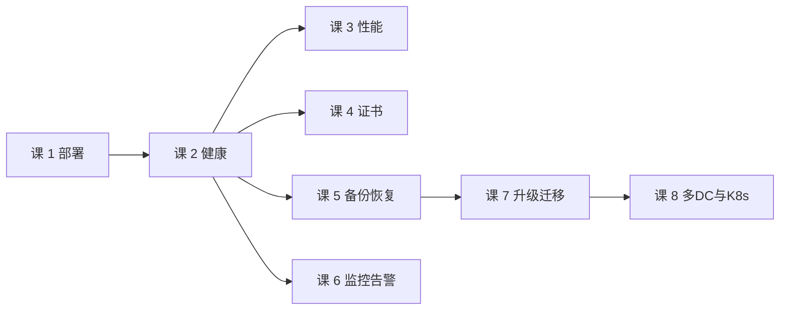

# 课 8：多机房与 K8s 运维视角

> 面向：运维 / SRE
> 前置：课 1（生产部署）、课 2（集群健康）、课 7（版本升级与迁移）
> 本课**多 DC 联邦、故障域、退出路径**均来自本机 WSL Ubuntu 24.04 + Consul 2.0.2 **双 DC 集群实测**（2026-09-20，dc1 三节点 + dc2 单节点，WAN 联邦）；**K8s 部分引自官方文档，本机未实测**（边界已在对应小节标注）。

---

## 引子：两个机房，一份数据？

这是多 DC 最常见的误解。

你搭好了 dc1 和 dc2，`consul join -wan` 把两个 DC 联邦起来。`consul members -wan` 里两个 DC 的节点都 alive 了。于是你认为：

> "现在两个机房都有数据了，一个机房挂了另一个能顶上。"

**这是错的。**

联邦（federation）建立的是**查询通道**，不是**数据副本**。本课会用实测证明这句话，并说明它对你意味着什么。

---

## 一、多 DC 联邦的运维现实

### 1.1 实测环境

```console
dc1: dc1-s1 / dc1-s2 / dc1-s3  (127.0.1.x, 3 server)
dc2: dc2-s1                    (127.0.2.1, 1 server)
```

联邦的关键动作是 **WAN join**（注意不是 LAN 的 `retry_join`）：

```console
$ consul join -wan 127.0.2.1:8302
Successfully joined cluster by contacting 1 nodes.
```

之后 WAN 成员表里出现 dc2：

```console
Node        Address         Status  Type    Build  Protocol  DC   Partition  Segment
dc1-s1.dc1  127.0.1.1:8302  alive   server  2.0.2  2         dc1  default    <all>
dc1-s2.dc1  127.0.1.2:8302  alive   server  2.0.2  2         dc1  default    <all>
dc1-s3.dc1  127.0.1.3:8302  alive   server  2.0.2  2         dc1  default    <all>
dc2-s1.dc2  127.0.2.1:8302  alive   server  2.0.2  2         dc2  default    <all>
```

### 1.2 端口：WAN 用 8302，不是 8301

| 用途 | 端口 | 说明 |
|---|---|---|
| **serf_lan** | 8301 | 同 DC 内 gossip |
| **serf_wan** | 8302 | **跨 DC gossip，联邦专用** |
| server (RPC) | 8300 | 跨 DC 请求也走这个 |

课 1 的单 DC 配置里我把 `serf_wan = -1`（禁用）。**要做多 DC 必须打开 8302**，且防火墙要同时放行 TCP 与 UDP 的 8302 和 8300。

### 1.3 核心实验：查询通道 ≠ 数据副本

**第 1 步：在 dc1 写数据**

```console
dc1 读 app/only-dc1 = 'written-in-dc1'
```

**第 2 步：从 dc2 读**

```console
dc2 本地读（不带 dc 参数）= ''          ← 读不到
dc2 跨 DC 读 ?dc=dc1      = 'written-in-dc1'   ← 读到了
跨 DC HTTP 状态码          = 200
```

**第 3 步：反向也一样**

```console
dc2 写 app/only-dc2 = 'written-in-dc2'
dc1 本地读           = ''                  ← 读不到
dc1 跨DC读 ?dc=dc2   = 'written-in-dc2'   ← 读到了
```

**第 4 步：决定性判据——各自的键列表**

```console
dc1 keys: app/only-dc1
dc2 keys: app/only-dc2
```

**这就是证据。** 如果数据是复制的，两边 keys 应该相同。实际**各只有一个自己的键**。

**服务也一样**。在 dc1 注册一个 `web` 服务：

```console
dc1 本地查 web  = 1 个实例
dc2 跨DC查 web  = 1 个实例 (来自dc1)
dc2 catalog 的 services: {"consul":[]}     ← dc2 自己的 catalog 里【没有 web】
```

### 1.4 所以联邦到底给了你什么

| 你能得到 | 你得不到 |
|---|---|
| 一个 DC 可以**查询**另一个 DC 的数据 | 数据的**副本** |
| 跨 DC 服务发现（DNS / HTTP `?dc=`） | 跨 DC 的**高可用**（一个 DC 挂了数据不会在另一个 DC 出现） |
| 统一的 UI 视图 | 统一的**写**入口（写必须指定目标 DC） |

**一句话**：联邦是**望远镜**，不是**备份**。你能看到对面，但对面没有你的东西。

> ⚠️ **运维含义**：如果你要的是"一个机房挂了另一个能顶上"，联邦**不够**。你需要的是**每个 DC 独立完整的数据**（各自写入），或者业务层做双写。联邦本身不帮你复制任何东西。

### 1.5 跨 DC 故障域（实测）

**dc2 挂掉后 dc1 的状态**：

```console
dc1 写测试        = HTTP 200        ← 写入正常
dc1 读 app/only-dc1 = 'written-in-dc1'  ← 数据完好
dc1 raft peers    = 3 节点全在，leader 正常
```

**结论：故障域是隔离的。** 一个 DC 完全挂掉，另一个 DC 的读写与 Raft 都不受影响。这是联邦架构真正的价值——**不是数据冗余，而是故障隔离**。

### 1.6 但要小心：故障检测有 40 秒盲区

停止 dc2 后，我逐秒测量 dc1 何时把它标记为 failed：

```console
T+ 4s  状态=alive
T+19s  状态=alive
T+37s  状态=alive
T+40s  状态=failed     ← 约 40 秒
```

**为什么是 40 秒？** 官方默认值（[Gossip parameters](https://developer.hashicorp.com/consul/docs/v1.22.x/reference/agent/configuration-file/gossip)）：

| 参数 | WAN 默认 | LAN 默认 |
|---|---|---|
| `probe_interval` | **5s** | 1s |
| `probe_timeout` | **3s** | 500ms |
| `suspicion_mult` | **6** | 4 |
| `gossip_interval` | 500ms | 200ms |

WAN 的探测间隔是 LAN 的 **5 倍**、超时是 **6 倍**——因为跨机房 RTT 大、丢包率高，参数必须保守。

**这 40 秒的运维含义**：
- 跨 DC 查询在故障后的 40 秒内，仍会**尝试**路由到已死的 DC 并等待超时。
- 表现为**跨 DC 请求变慢或报错**，而不是立刻得到"目标 DC 不可用"的明确答复。
- 如果你的应用依赖跨 DC 查询，**必须设置客户端超时短于这个值**，否则会被拖住。

**实测到的两种跨 DC 失败形态**：

```console
# leave 之后（立刻）
No path to datacenter

# kill -9 之后（40s 内，节点仍是 alive）
rpc error getting client: failed to get conn: dial tcp 127.0.1.1:0->127.0.2.1:8300:
connect: connection refused
```

**这两种错误信息完全不同**，但都会让你的跨 DC 调用失败。告警与排障时要分别识别。

---

## 二、K8s 上的运维

> ⚠️ **本节全部内容引自 HashiCorp 官方文档与 Helm chart 文档，本机未实测。** 本机虽有 docker 29.4.1 / kubectl 1.34 / kind 0.30 / helm 3.22，但起 kind 集群并 helm 安装 consul 属**装集群组件、拉镜像**，按既有规矩需你明确授权才执行。若你需要这部分实测，告诉我一声。

### 2.1 consul-k8s 组件全景

Helm chart（当前最新 **2.0.4**）会装出这些组件：

| 组件 | 形态 | 干什么 |
|---|---|---|
| **consul-server** | StatefulSet | Consul server 集群 |
| **consul-client** | DaemonSet | 每节点一个 client agent |
| **consul-connect-injector** | Deployment | 准入控制器，给 pod 注入 sidecar |
| **consul-controller** | Deployment | 把 K8s 资源（Service/Ingress 等）翻译成 Consul 配置 |
| **consul-webhook-cert-manager** | Deployment | 管理 webhook 证书 |
| **consul-dataplane** | (sidecar/容器) | 替代旧版单独 Envoy 容器，Envoy + dataplane 合一 |
| **mesh-gateway / ingress-gateway / terminating-gateway** | 可选 | 跨集群/跨 DC 流量出入口 |

**运维视角的关键点**：你运维的对象从「几个 consul 进程」变成了「一组 K8s workload」。排障命令从 `systemctl status consul` 变成 `kubectl get pods -n consul`。

### 2.2 Helm chart 不替你运维

官方原话（[Install Consul on Kubernetes](https://github.com/hashicorp/consul/blob/main/website/content/docs/k8s/installation/install.mdx)）：

> "The Helm chart exposes several useful configurations and automatically sets up complex resources, but it **does not automatically operate Consul**. You must still become familiar with how to monitor, backup, and upgrade the Consul cluster."

**Helm 只管装，不管养。** 课 5 的备份、课 6 的监控、课 7 的升级，在 K8s 上**一个都不少**，只是操作对象换成了 Pod 与 PVC。

### 2.3 版本对齐：三个镜像要一起管

这是 K8s 上最容易出错的地方。一次升级涉及**至少三个镜像版本**：

```yaml
global:
  image: hashicorp/consul:2.0.0              # Consul 本体
  imageK8S: hashicorp/consul-k8s-control-plane:2.0.4
  imageConsulDataplane: hashicorp/consul-dataplane:2.0.4
```

**规则**：
- **Helm chart 版本 ≠ Consul 版本**。chart 2.0.4 可以装 consul 2.0.0。
- 官方警告：**image 一定要 pin 版本**。不 pin 的话，chart 更新会**顺带把你 Consul 升了**（"other changes to the chart may inadvertently upgrade your Consul version"）。
- 升级时 chart、consul、consul-k8s、dataplane **四者版本要查兼容矩阵**，不能各升各的。

### 2.4 K8s 上特有的运维动作

| 动作 | 命令 / 说明 |
|---|---|
| 看组件状态 | `kubectl get pods -n consul` |
| 改配置 | 改 values → `helm upgrade consul hashicorp/consul -f values.yaml -n consul` |
| **升级前必做** | `helm upgrade --dry-run`（官方明确要求，chart 变化大） |
| 查 server 日志 | `kubectl logs consul-server-0 -n consul` |
| 备份 | 仍是 `consul snapshot save`，但要 exec 进 pod 或 port-forward |
| 卸载 | `helm uninstall consul -n consul`（**PVC 默认不会删**，要单独清理） |

### 2.5 与 VM 混布（heterogeneous workloads）

官方文档明确支持：Consul agent 可以加入**运行在 K8s 内或外**的 server。

**两种典型混布形态**：

```
形态 A：K8s 内跑 client，join 到 VM 上的 server
  VM(server) ←── join ── K8s(consul-client DaemonSet)
  配置：server.enabled=false, client.enabled=true, client.join=["<VM-IP>"]

形态 B：VM 上的 agent join 到 K8s 内的 server
  K8s(server StatefulSet) ←── join ── VM(consul agent)
  配置：K8s 侧 server 要暴露（LoadBalancer / NodePort / hostNetwork）
```

**混布的运维难点**：
- **网络**：K8s 内 server 的地址对 VM 要可达。用 ClusterIP 不行，得 LoadBalancer 或 NodePort。
- **健康检查方向**：VM 上的服务注册到 Consul，K8s 里的 pod 要能访问——涉及 Pod CIDR 与 VM 网段路由。
- **证书**：跨环境 TLS 时，SAN 要同时包含 K8s Service DNS 和 VM 地址。
- **排障分裂**：一半命令在 `kubectl`，一半在 `systemctl`。这是混布最大的隐性成本。

### 2.6 Helm 默认是不安全的

官方安全警告：

> "By default, Helm installs Consul with **security configurations disabled**... We strongly recommend... enable Consul's security features before going into production."

**默认关掉的**：TLS、gossip 加密、ACL。生产必须显式打开：

```yaml
global:
  tls:
    enabled: true
    enableAutoEncrypt: true
  gossipEncryption:
    autoGenerate: true
  acls:
    manageSystemACLs: true
```

这与课 4 讲的"三类凭证"完全对应——**K8s 上一样要管，只是由 Helm/Secret 托管**。

---

## 三、退出与迁移

### 3.1 两种下线方式，后果完全不同（实测）

这是我实测中最有价值的一组对比。**同样是让一个节点消失，`consul leave` 和 `kill -9` 的结果不一样。**

**方式 A：`consul leave`（优雅下线）**

```console
$ consul leave
Graceful leave complete

# 立刻查 WAN 成员表
dc2-s1.dc2  127.0.2.1:8302  left    server  2.0.2  2   dc2
dc2 进程数 = 0

# 跨 DC 读
'No path to datacenter'
```

**方式 B：`kill -9`（硬杀）**

```console
T+ 6s   状态=alive     ← 还以为它活着
T+25s   状态=alive
T+45s   状态=failed    ← 约 45 秒才标记

# 跨 DC 读（40 秒盲区内）
'rpc error ... dial tcp ... connect: connection refused'
```

| 对比项 | `consul leave` | `kill -9` |
|---|---|---|
| 成员表状态 | **left**（立即） | 先 alive，约 40~45s 后 failed |
| 进程 | 退出 | 被杀 |
| 跨 DC 报错 | `No path to datacenter` | `connection refused` |
| 集群是否立刻知道 | **是** | 否（有 40 秒盲区） |

**运维结论**：**下线必须用 `consul leave`**。硬杀会让集群在 40 秒内以为节点还活着，跨 DC 请求会被路由到死节点。

### 3.2 `left` 状态的一个反直觉陷阱（实测）

我原以为 `left` 只是个显示状态，节点重启就能回来。实测推翻了这个假设：

```console
# leave 之后重启 dc2（同 node_name、同 data_dir）
状态 = left              ← 没恢复

# 清空 data_dir 再重启
状态 = left              ← 仍然没恢复！

# 但此时检查节点本身
dc2 pid        = 3306489     ← 进程活着
dc2 HTTP 探活  = 200         ← 服务正常

# 跨 DC 读
'No path to datacenter'      ← 联邦通信确实是断的

# 让 dc2 主动重新 join
$ consul join -wan 127.0.1.1:8302
Successfully joined cluster by contacting 1 nodes.
状态 = alive             ← 恢复了
```

**三个结论**：

1. **`left` 不是"显示残留"，是真的断链**。节点进程活着、HTTP 200，但跨 DC 查询就是 `No path to datacenter`。
2. **清 `data_dir` 不能清除 `left`**。我第一次猜是 serf snapshot 持久化，实测证明**不是**——`left` 状态由**其他存活节点**持有。
3. **恢复手段是主动 `join -wan`**，不是重启。

> 📌 **排障提示**：如果 `consul members -wan` 里某个节点是 `left`，**不要去重启它**。它可能是活的，只是被集群标记为已离开。正确做法是在该节点上执行 `consul join -wan <对端>`。

### 3.3 单 DC 内的下线顺序

退出整个集群时，顺序与课 7 的升级一致——**先 follower，最后 leader**：

```console
# 停 dc1-s3（follower），quorum 2/3 保住
dc1 写 = HTTP 200        ← 仍可写
raft peers:
  dc1-s2  leader    true   3   68   -
  dc1-s1  follower  true   3   68   0 commits
  dc1-s3  follower  true   3   67   1 commit   ← 已落后
```

### 3.4 退出 Consul 的完整路径

如果你的目标是**彻底不用 Consul 了**（而不是缩容），路径是：

```
1. 清点依赖 ← 最容易漏
   ├─ 哪些服务在用它做服务发现（DNS / HTTP API）
   ├─ 哪些配置在 KV 里（课 5：KV 是唯一"业务数据"）
   ├─ 有没有 Connect/intentions 在做访问控制
   └─ 有没有外部系统硬编码了 .consul 域名

2. 迁移依赖
   ├─ 服务发现 → 目标方案（K8s Service / 其他注册中心）
   ├─ KV 配置 → 导出后写入新配置中心
   └─ 健康检查 → 迁移到目标平台

3. 双跑观察期 ← 不要直接切
   ├─ 新旧并行，流量逐步切
   └─ 保留回切能力

4. 下线
   ├─ 先停 client（业务无感）
   ├─ 再停 server follower
   ├─ 最后停 leader
   └─ 每个节点用 consul leave

5. 清理
   ├─ K8s: helm uninstall + 删 PVC（PVC 默认不删！）
   ├─ VM:  停服务、清 data_dir、清配置中的 token/证书
   └─ 回收 DNS 中指向 Consul 的记录
```

### 3.5 退出成本的真实来源

退出 Consul 的成本**不在 Consul 本身**，而在**你用它做了多少事**：

| 你用到的 | 退出难度 |
|---|---|
| 只做服务发现 | 低。替换 DNS/查询入口即可 |
| 用了 KV 存业务配置 | **中高**。这是唯一需要"迁移数据"的部分 |
| 用了 Connect/intentions | **高**。访问控制逻辑要重写到目标方案 |
| K8s 上用了 connect-inject | **高**。sidecar 注入与 mTLS 是绑定的 |

**课 5 的一句话在这里依然成立**：KV 是你唯一需要认真备份和迁移的东西。catalog 里的服务注册是**可以被重新产生**的（agent 重启会重新注册），KV 里的配置**不能**。

---

## 四、本课核心结论

1. **联邦 = 查询通道，不是数据副本**（实测）：dc1 keys 只有 `app/only-dc1`，dc2 只有 `app/only-dc2`；dc2 的 catalog 里没有 dc1 注册的 `web`。
2. **故障域是隔离的**（实测）：dc2 全挂，dc1 写入 HTTP 200、Raft 三节点正常。
3. **WAN 故障检测约 40 秒**（实测）：因为 WAN 默认 `probe_interval=5s`（LAN 是 1s）、`suspicion_mult=6`。跨 DC 客户端超时要短于此。
4. **`consul leave` 与硬杀后果不同**（实测）：leave 立刻 `left` + `No path to datacenter`；kill -9 有 40 秒盲区，报错是 `connection refused`。
5. **`left` 状态清不掉，要重新 join**（实测）：进程活着、HTTP 200，但联邦通信真断了；**清 data_dir 无效**，必须 `consul join -wan`。
6. **K8s 上 Helm 只管装不管养**（官方）：备份/监控/升级一个不少，且要管 3~4 个镜像版本对齐。

---

## 五、运维专项总结

到这里，运维专项 8 课全部完成。它们的关系：



**三条贯穿全篇的主线**：

1. **"能查到"不等于"没问题"**：课 2 的进程在 ≠ 健康；课 6 的指标有值 ≠ 语义对；本课的节点 alive ≠ 联邦可用（`left` 陷阱）。
2. **运维动作都有代价**：课 4 轮换要重启；课 5 恢复是全量覆盖；课 7 回滚会丢数据；本课硬杀有 40 秒盲区。
3. **实测优先于文档**：课 5 推翻了"快照不含 CA 私钥"；本课推翻了"`left` 是显示残留"和"清 data_dir 能重置"。

---

## 课尾导航

- **上一课**：[课 7 版本升级与迁移](lesson-07-版本升级与迁移.md)
- **回索引**：[运维专项 overview](../overview.md)
- **相关**：主线[课 7 多数据中心与服务网格](../../../stages/2-核心能力拆解/lessons/lesson-07-多数据中心与服务网格.md)、主线[课 12 选型决策框架与场景结论](../../../stages/4-决策落地/lessons/lesson-12-选型决策框架与场景结论.md)
- **急用**：跨 DC 查询失败 → 查 [09-排障速查手册](../../../09-排障速查手册.md)
- **回主线**：[01-学习路径总览](../../../01-学习路径总览.md)

### 小测

1. 两个 DC 做了 WAN 联邦，dc1 挂了，dc2 能查到 dc1 的数据吗？为什么？
2. `consul members -wan` 显示某节点 `left`，但它进程活着、HTTP 200。可能是什么原因？怎么处理？
3. 为什么跨 DC 故障检测要 40 秒，而同 DC 内只要几秒？
4. 下线一个节点，用 `consul leave` 和 `kill -9` 有什么实际区别？
5. K8s 上用 Helm 装 Consul，升级时为什么不能只升 `global.image`？

<details>
<summary>答案</summary>

1. **不能。** 联邦是**查询通道**不是数据副本。实测 dc1 keys 只有 `app/only-dc1`，dc2 只有 `app/only-dc2`。dc1 挂了，dc2 连查询通道都断了（`No path to datacenter`）。要跨 DC 高可用必须业务层双写，联邦不帮你复制。
2. **它执行过 `consul leave`。** `left` 是集群侧的持久标记，**不是显示残留**——实测该节点进程活着、HTTP 200，但跨 DC 读返回 `No path to datacenter`，联邦通信确实断了。处理：**在该节点上执行 `consul join -wan <对端地址>`**。注意**清 data_dir 无效**（实测验证过）。
3. 因为 WAN gossip 默认 `probe_interval=5s`、`probe_timeout=3s`、`suspicion_mult=6`，而 LAN 是 1s / 500ms / 4。跨机房 RTT 大、丢包率高，参数必须保守。实测停止 dc2 后约 40 秒才标记 failed。
4. `consul leave` **立刻**让集群知道（状态 `left`，跨 DC 报 `No path to datacenter`）；`kill -9` 有**约 40 秒盲区**（期间状态仍 alive，跨 DC 报 `connection refused`）。下线必须用 `leave`。
5. 因为一次升级涉及**四个版本**：Helm chart、consul、consul-k8s-control-plane、consul-dataplane。官方警告不 pin 版本时 chart 更新会**连带升级 Consul**。四者要按兼容矩阵一起对齐，且升级前必须 `helm upgrade --dry-run`。

</details>
